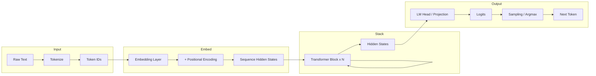
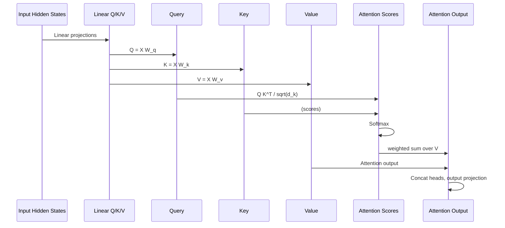

在大语言模型（LLM）和各类基于 Transformer 的架构中，前向传播的数据流与自注意力（Self-Attention）的计算顺序是理解模型行为的基础。本文简要梳理从输入到输出的整体流程，以及自注意力中 Query、Key、Value 的交互方式，便于在阅读源码或做推理优化时建立清晰心智模型。

## 从输入到输出的整体流程

在推理阶段，文本经过分词、嵌入与多层 Transformer 块，最终得到每个位置的 logits 并解码为下一个 token。整体数据流可以概括为以下流程。

其中，**Embedding Layer** 将 token ID 映射为稠密向量，**位置编码**（或 RoPE、ALiBi 等）注入位置信息；**Transformer Block × N** 即多层「自注意力 + 前馈」的堆叠，每层输出与输入同形状；**LM Head** 通常是一个线性层，将最后一层隐藏状态映射到词表大小的 logits，再经采样或贪心得到下一个 token。理解这一条主线，有助于在调试或做 KV Cache、量化时快速定位数据所在阶段。

## 自注意力中的 Query、Key、Value 交互

自注意力是 Transformer 的核心。每个 token 的表示会通过线性变换得到 Query（Q）、Key（K）、Value（V），再通过 Q 与所有位置的 K 做点积得到注意力权重，对 V 加权求和得到该位置的上下文表示。多 head 时，Q、K、V 按头拆分，各自做上述运算后再拼接。从「谁在何时用谁」的角度，可以看成下面这样的调用关系。

解码时，为支持增量解码与 KV Cache，通常会对当前步的 Q 与**已缓存**的 K、V 做上述运算，因此「新算 Q，复用 K、V」是推理优化中的常见模式。

## 小结

前向流程可以概括为：**Tokenize → Embedding（含位置）→ N 层 Transformer（自注意力 + 前馈）→ LM Head → Logits → 下一个 token**。自注意力则是在每一层内，通过 Q、K、V 的线性变换与按头的注意力计算，实现序列内任意位置之间的信息聚合。掌握这两点，再结合具体模型（如 LLaMA、Qwen 等）的 RoPE、SwiGLU 等细节，就能更顺畅地阅读实现或做性能与精度分析。
