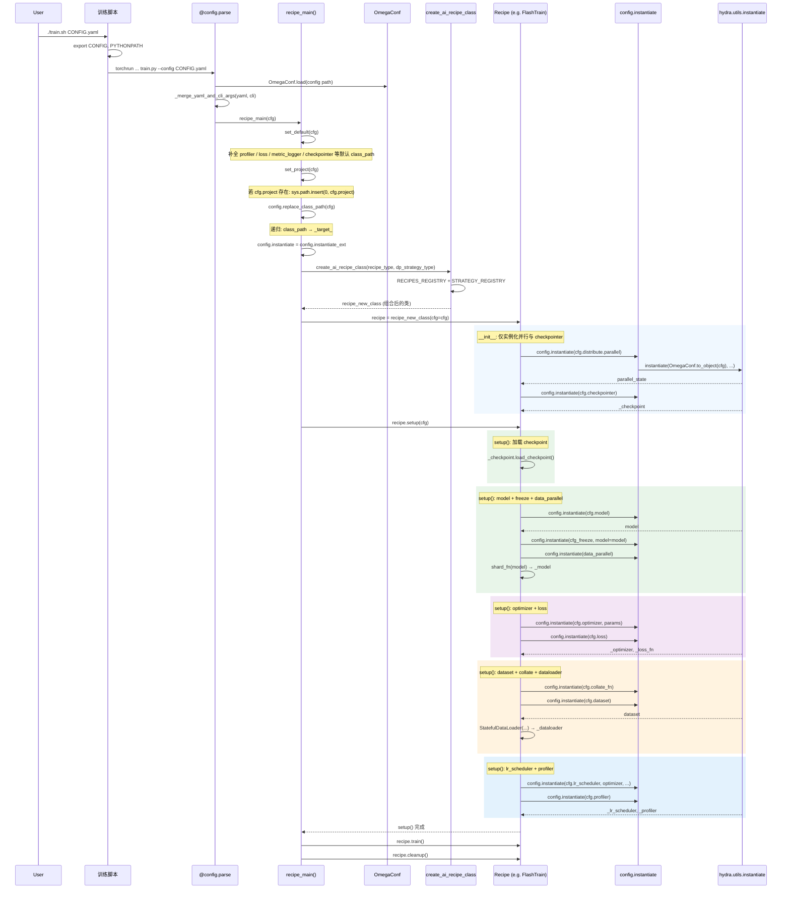

本文基于对某内部大模型训练框架的研读，梳理其如何通过 YAML 配置驱动从入口到各模块实例化的完整流程，并总结可复用的设计要点与扩展方式。内容已做脱敏，不涉及具体厂商与路径信息。

**目录**

1. [要解决的问题](#一要解决的问题)
2. [整体流程概览](#二整体流程概览)
3. [从 Train 入口到各模块实例化的序列图](#三从-train-入口到各模块实例化的序列图)
4. [为什么能配置「项目外的类」](#四为什么能配置项目外的类)
5. [关键技术点与关键代码](#五关键技术点与关键代码)
6. [配置与代码的对应关系](#六配置与代码的对应关系yaml-示例)
7. [目录与模块结构](#七目录与模块结构概念级)
8. [设计上的可取之处与注意点](#八设计上的可取之处与注意点)
9. [如何扩展：新模块、新 Recipe、新 Strategy](#九如何扩展新模块新-recipe新-strategy)
10. [对框架的思考与扩展方向](#十对框架的思考与扩展方向)

---

## 一、要解决的问题

训练脚本往往需要写死 Model、Dataset、Optimizer、Loss、Checkpointer 等。一旦换模型或换数据，就要改代码、改 import。一个自然的需求是：**用一份 YAML 描述「用哪个类、传什么参数」，运行时再按配置把各组件实例化出来**。更进一步，这些类可以不在当前仓库里，而是来自其他框架(如 Transformers, DeepSpeed, llama-factory, ms-swift, etc.)或项目或私有包——框架只要在运行时能把对应模块 import 进来即可。

本文讨论的框架实现了这一点：通过 **class_path（或等价的 _target_）+ OmegaConf + Hydra 的 instantiate**，配合 **可选的 project 路径注入**，实现「配置即契约」的训练管线。

---

## 二、整体流程概览

从用户执行训练脚本到各个模块（model、dataset、optimizer、loss、dataloader、lr_scheduler、profiler 等）被实例化，大致分为以下阶段：

1. **配置加载**：解析 YAML 与命令行 `key=value`，得到一棵 OmegaConf 配置树 `cfg`。
2. **配置规整**：补默认值（如缺省的 loss、checkpointer）、将 YAML 里的 `class_path` 统一替换为 Hydra 可识别的 `_target_`。
3. **运行环境扩展**：若配置里指定了 `project` 路径，则将其插入 `sys.path` 最前，便于后续 import 项目外或私有包。
4. **Recipe 组合**：根据 `recipe` 与 `dp_strategy` 从注册表取出对应基类，动态组合出「训练流程 + 并行策略」的 Recipe 类并实例化。
5. **分阶段实例化**：在 Recipe 的 `__init__` 中先实例化并行与 checkpointer；在 `setup(cfg)` 中再按顺序实例化 model、optimizer、loss、dataset/collate、dataloader、lr_scheduler、profiler 等。所有「从配置来的类」都走同一套 `config.instantiate`（内部即 Hydra 的 `instantiate`）。

下面用序列图与目录/代码片段把上述流程具象化。

---

## 三、从 Train 入口到各模块实例化的序列图



要点对应关系简述：

- **Parse**：负责 YAML + CLI 合并，产出 `cfg`。
- **replace_class_path**：整棵 `cfg` 中把 `class_path` 键改为 `_target_`，值（dotted path 字符串）不变。
- **create_ai_recipe_class**：根据 `recipe` / `dp_strategy` 从两个 registry 取基类，多继承组合出最终 Recipe 类。
- **Recipe.__init__**：只实例化「提前需要的」并行状态和 checkpointer。
- **Recipe.setup(cfg)**：按固定顺序实例化并组装 model、freeze、data_parallel、optimizer、loss、collate_fn、dataset、dataloader、lr_scheduler、profiler；凡是从配置来的类都走 `config.instantiate` → Hydra `instantiate`。

---

## 四、为什么能配置「项目外的类」

核心有两点。

### 4.1 用字符串表示「可导入路径」

YAML 里不写类本身，只写**可被 Python import 的 dotted path**，例如：

```yaml
model:
  class_path: flash_framework.models.asr.asr_model
  model_name_or_path: /path/to/ckpt
```

框架在运行时：

1. 通过 `replace_class_path` 把 `class_path` 转成 `_target_`。
2. 用 Hydra 的 `instantiate`，其内部会根据 `_target_` 字符串做「动态 import + 调用」：  
   `importlib.import_module(module_path)` + `getattr(module, name)` 得到 callable，再用该节点下其余字段作为 kwargs 构造实例。

因此，只要该 path 在运行时能被 import，类不必在当前仓库，可以在任意已安装包或即将被加入 `sys.path` 的目录下。

### 4.2 通过 project 扩展 sys.path

若 YAML 顶层配置了 `project`：

```yaml
project: /path/to/your/code
```

入口逻辑里会执行（脱敏后的逻辑等价于）：

```python
def set_project(cfg):
    if getattr(cfg, "project", None) is not None:
        assert os.path.exists(cfg.project)
        if cfg.project not in sys.path:
            sys.path.insert(0, cfg.project)
```

这样，在**任何** `config.instantiate` 发生之前，`project` 目录已经处于 `sys.path` 最前。之后 YAML 里写 `class_path: examples.xxx.MyModel` 时，就会从 `project` 下解析 `examples.xxx`，从而支持「类不在当前项目目录」的配置方式。

---

## 五、关键技术点与关键代码

### 5.1 技术栈小结

| 技术 | 作用 |
|------|------|
| **OmegaConf** | 加载 YAML、合并 CLI、解析 `${...}` 插值、递归替换 `class_path`→`_target_`，以及 `to_object` 转成普通 dict 供 Hydra 使用。 |
| **Hydra instantiate** | 根据 `_target_` 字符串动态 import 并调用，支持嵌套、kwargs、递归实例化。 |
| **replace_class_path** | 将 YAML 里对人友好的 `class_path` 统一改为 Hydra 的 `_target_`，实现「一份配置两用」。 |
| **sys.path.insert(0, project)** | 在实例化前扩展运行环境，使「项目外」或私有包可通过 dotted path 被 import。 |
| **config.instantiate = instantiate_ext** | 全局统一走带扩展能力的封装（如支持 torch_compile 等），而不改各 recipe 的调用方式。 |

### 5.2 replace_class_path：class_path → _target_

```python
def replace_class_path(cfg: any) -> None:
    if OmegaConf.is_dict(cfg):
        for key, value in list(cfg.items()):
            if key == "class_path":
                cfg["_target_"] = cfg.pop("class_path")
            else:
                replace_class_path(value)
    elif OmegaConf.is_list(cfg):
        for item in cfg:
            replace_class_path(item)
```

递归遍历整棵配置树，把所有 `class_path` 键改为 `_target_`，值保持不变。这样 YAML 可以继续用可读的 `class_path`，而底层统一符合 Hydra 的约定。

### 5.3 扩展版 instantiate：委托给 Hydra 并支持 torch_compile

核心逻辑（去掉 torch_compile 等细节后）可以概括为：

```python
from hydra.utils import instantiate
from omegaconf import OmegaConf

def instantiate_ext(config: DictConfig, *args, **kwargs):
    # ...
    config_copy = copy.deepcopy(config)
    # 解析插值、合并 kwargs、收集并移除 torch_compile 等...
    OmegaConf.resolve(config_copy)
    obj = instantiate(OmegaConf.to_object(config_copy), *args)
    # 可选: 对 obj 做 torch.compile 等后处理
    return obj
```

即：**OmegaConf 负责解析与转成普通 dict，Hydra 的 instantiate 负责按 `_target_` 动态加载并构造对象**。框架中将该函数命名为 `instantiate_ext` 并挂到 `config.instantiate` 上统一使用。

### 5.4 入口：set_default → set_project → replace_class_path → 绑定 instantiate → 创建 Recipe → setup

```python
@config.parse
def recipe_main(cfg: DictConfig) -> None:
    set_default(cfg)           # 补全缺省的 class_path
    set_project(cfg)            # 可选：sys.path.insert(0, cfg.project)
    config.replace_class_path(cfg)
    config.instantiate = config.instantiate_ext  # 扩展版 instantiate（支持 torch_compile 等）

    recipe_type = cfg.get("recipe", None) or "sft"
    dp_strategy_type = cfg.get("dp_strategy", None) or "normal"
    recipe_new_class = create_ai_recipe_class(recipe_type, dp_strategy_type)
    recipe = recipe_new_class(cfg=cfg)
    recipe.setup(cfg=cfg)
    recipe.train()
    recipe.cleanup()
```

这里可以看到：**所有「从配置里长出来的对象」都发生在 `recipe.setup(cfg)` 及其调用的 `config.instantiate` 中**，而 `set_project` 与 `replace_class_path` 必须在第一次 `instantiate` 之前完成。

---

## 六、配置与代码的对应关系（YAML 示例）

下面是一份精简后的 YAML 结构，用来说明各段如何对应到实例化：

```yaml
recipe: flash_train
# 可选：支持从项目外 import 时使用
# project: /path/to/your/code

trainer:
  dtype: bf16
  output_dir: /path/to/output
  batch_size: 1
  max_steps: 30000
  # ...

model:
  class_path: flash_framework.models.asr.asr_model
  model_name_or_path: ${checkpointer.checkpoint_dir}

distribute:
  parallel:
    class_path: flash_framework.parallel.setup_parallel_state
    dp_shard_size: 4
  data_parallel:
    class_path: flash_framework.parallel.setup_data_parallel
    backend: fsdp1

optimizer:
  class_path: torch.optim.AdamW
  fused: True
  lr: 1e-5
  weight_decay: 0.01

dataset:
  class_path: flash_framework.dataset.asr.get_mix_dataset
  dataset_index_path: script/train_data.yaml
  cutoff_len: 2560
  tokenizer:
    class_path: flash_framework.models.asr.asr_tokenizer
    model_name_or_path: ${model.model_name_or_path}

collate_fn:
  class_path: flash_framework.data.asr.ASRCollator

lr_scheduler:
  class_path: torchtune.training.lr_schedulers.get_cosine_schedule_with_warmup
  num_warmup_steps: 100

checkpointer:
  class_path: flash_framework.checkpoint.hf_checkpoint.FullModelHFCheckpointer
  checkpoint_dir: /path/to/ckpt
  # ...

metric_logger:
  class_path: torchtune.training.metric_logging.TensorBoardLogger
```

- 顶层 `recipe` / `dp_strategy` 用于从注册表选出 Recipe 与 Strategy 基类并组合。
- 其余带 `class_path` 的块都会在 `replace_class_path` 后变成 `_target_`，再在 `setup()` 的相应步骤里被 `config.instantiate` 实例化。
- `${...}` 由 OmegaConf 在 `resolve` 时解析，因此可以引用其他段（如 `model_name_or_path`）。

---

## 七、目录与模块结构（概念级）

框架大致呈「入口 + 配置解析 + Recipe/Strategy 注册 + 具体 Recipe 实现」的分层，概念上的目录树可抽象为：

```
project_root/
├── train.py                    # 入口：@config.parse, set_default/set_project/replace_class_path, create_recipe → setup/train/cleanup
├── config/                     # 配置解析、instantiate 封装
│   ├── __init__.py
│   ├── _parse.py               # YAML + CLI 合并
│   ├── _instantiate_ext.py     # replace_class_path, instantiate_ext（内部调 Hydra）
│   └── _instantiate.py         # 原生 _component_ 版 instantiate（可选）
├── recipes/
│   ├── recipe_factory.py       # create_recipe_class(recipe_type, dp_strategy_type)
│   ├── registry.py            # RECIPES_REGISTRY: recipe_name -> Recipe 类
│   └── flash_train.py         # FlashTrain: __init__ 里 parallel + checkpointer；setup 里 model/optimizer/loss/dataset/dataloader/lr_scheduler/profiler
├── parallel/
│   ├── registry.py            # STRATEGY_REGISTRY: strategy_name -> Strategy 类
│   └── data_parallel/         # FSDP/DDP/Accelerate/DeepSpeed 等具体 Strategy
├── models/                     # 模型实现（class_path 指向此处或 project 下）
├── dataset/                    # 数据集工厂（class_path 指向此处或 project 下）
├── data/                       # collate 等（class_path 指向此处或 project 下）
├── checkpoint/                 # checkpointer 实现
└── config/                     # 各任务 YAML（如 asr/asr_model.yaml）
```

实际项目中，`train.py` 和上述模块可能分布在不同的包下（如入口在顶层，config/recipe/parallel 在子包中），但**逻辑关系**与上面一致：入口只负责配置与 Recipe 调度，具体「用哪个类」全部由 YAML 的 `class_path` + `config.instantiate` 决定。

---

## 八、设计上的可取之处与注意点

### 8.1 优点

- **配置与实现解耦**：模型、数据集、优化器、checkpointer、lr_scheduler、freeze、metric_logger 等均通过 `class_path` 指定，换实现只需改 YAML 或换配置。
- **统一语义**：用 `class_path` → `_target_` 的薄封装兼容 Hydra 的递归实例化、嵌套、插值，学习成本低。
- **显式扩展运行环境**：`project` + `set_project` 明确「当前训练用的代码根」，支持多仓库/私有包而不依赖全局 PYTHONPATH。
- **Recipe × Strategy 组合**：通过 registry + 多继承组合「训练流程」与「并行策略」，扩展新策略或新 recipe 时不必改入口逻辑。

### 8.2 弊端与注意点

- **运行前难以校验**：错误的 `class_path` 要到 `instantiate` 时才报 ImportError/AttributeError，缺少配置期 schema 或静态检查。
- **隐式全局状态**：`set_project` 改 `sys.path`、`config.instantiate = instantiate_ext` 改全局，多环境/多进程时需注意隔离。
- **YAML 与类签名强绑定**：YAML 键名需与构造函数参数一致（或依赖 Hydra 的 partial/convert），参数重命名时容易遗漏配置。
- **project 安全**：若 `project` 来自不可信配置，将任意目录插入 `sys.path` 存在依赖注入与安全风险，生产环境应对路径做约束或白名单。

---

## 九、如何扩展：新模块、新 Recipe、新 Strategy

### 9.1 新增一个模块（例如新 Loss、新 Dataloader）

**新 Loss**

1. 实现 Loss 类或工厂（如 `your_package.losses.MyLoss`），构造函数参数与 YAML 中键对应。
2. 在 YAML 中增加段，例如：  
   `loss:`  
   `  class_path: your_package.losses.MyLoss`  
   `  weight: 0.5`
3. 若该类在项目外，在 YAML 顶层设置 `project: /path/to/your/code`。
4. 若当前 recipe 尚未支持 `cfg.loss`，在 recipe 的 `setup()` 中增加：  
   `if cfg.get("loss", None): self._loss_fn = config.instantiate(cfg.loss)`，并在训练循环中使用 `self._loss_fn`。

**新 Dataset / Dataloader**

1. 实现 dataset 工厂或类（如返回可被 DataLoader 使用的对象）。
2. 在 YAML 的 `dataset` / `dataset_val` / `dataset_test` 下写 `class_path` 与参数。
3. 无需改 recipe：`_setup_data()` 已通过 `config.instantiate(cfg_dataset)` 创建 dataset，只要接口（如 `__len__`、`__getitem__`）与现有用法一致即可。
4. 若需新 collate：实现 collate 类，在 YAML 中配置 `collate_fn` 的 `class_path`，recipe 中已有 `config.instantiate(cfg.collate_fn)`（内部即扩展版 instantiate）。

### 9.2 新增一个 Recipe

1. 实现新 Recipe 类，至少包含 `__init__(self, cfg)`、`setup(self, cfg)`、`train()`、`cleanup()`，内部用 `config.instantiate(cfg.xxx)` 构建 model、optimizer、dataloader 等。
2. 在 Recipe 注册表中注册，例如：  
   `RECIPES_REGISTRY["my_recipe"] = MyRecipe`
3. YAML 顶层设置 `recipe: my_recipe`。
4. 若需与现有并行策略组合，在 YAML 中设置 `dp_strategy: fsdp` 等，`create_ai_recipe_class` 会自动用 `STRATEGY_REGISTRY` 做多继承组合。

### 9.3 新增一个 Strategy

1. 实现 Strategy 类，与现有 Strategy 接口一致（如覆盖 `_setup_model` / `_setup_optimizer` / `_setup_data`），内部同样通过 `config.instantiate` 使用 `cfg.model`、`cfg.distribute.xxx` 等。
2. 在 Strategy 注册表中注册：  
   `STRATEGY_REGISTRY["my_strategy"] = MyStrategy`
3. YAML 顶层设置 `dp_strategy: my_strategy`。

---

## 十、对框架的思考与扩展方向

- **配置即契约**：把「用哪个类、传什么参数」全部放进 YAML，有利于复现、多实验对比和交付运维；代价是 YAML 与类签名强绑定，需要约定或工具（如 schema、生成器）来减少笔误。
- **project 与多仓库**：用 `project` 扩展 `sys.path` 是一种简单可用的做法，适合内部多 repo 协作；若走向更规范的包管理，可考虑用 namespace package 或统一安装再通过 `class_path` 引用，以减少对 `sys.path` 的依赖。
- **可观测与校验**：在 `replace_class_path` 之后、`setup` 之前，可以增加一轮「只做 import 不实例化」的校验，或导出 resolved config 的 schema，便于提前发现错误和做配置文档生成。
- **与 Hydra 的边界**：当前设计是「YAML 用 class_path，内部转 _target_ 再交给 Hydra」；若团队已全面采用 Hydra，也可以直接在 YAML 里写 _target_，或统一用 Hydra 的 default list/group 管理多配置，本框架的 replace_class_path 与 set_project 仍可保留为薄封装层。

---

以上内容整理自对一套配置驱动训练框架的阅读与讨论，侧重从「入口 → 配置规整 → 环境扩展 → Recipe 组合 → 分阶段实例化」的流程与可扩展方式，供算法与工程同学在设计或接入类似框架时参考。文中代码与路径已做脱敏处理。
