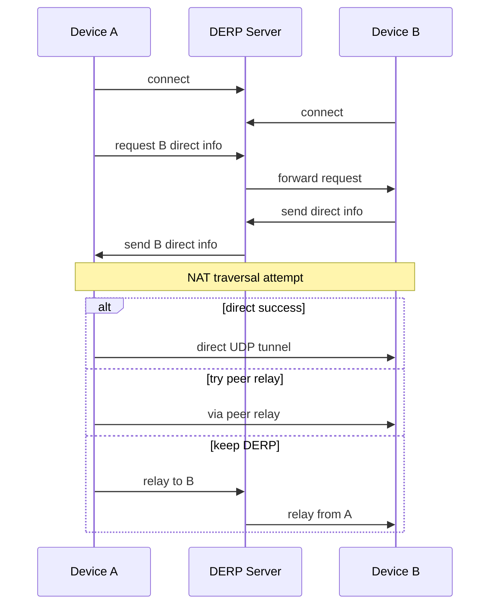
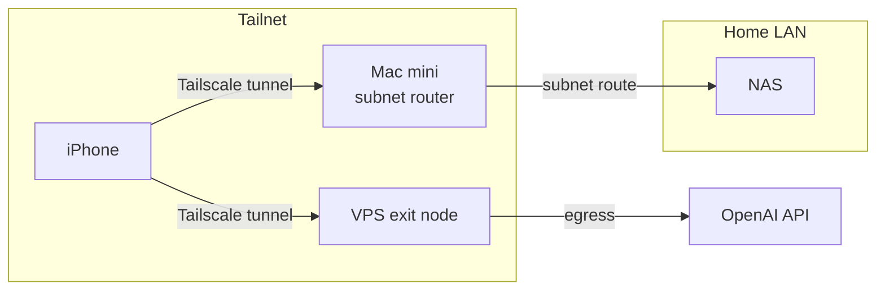

本文基于 Tailscale 官方文档与社区（GitHub、Reddit、知乎及中文博客）的实践，梳理家庭多设备（iPhone/iPad、家中 M1 Mac mini、海外 VPS）组网时，如何配置出口节点访问海外 GPT、子网路由打通家庭内网，以及网络与文件共享，并说明连接原理与可选加速手段。

**目录**

1. [场景与目标](#一场景与目标)
2. [Tailscale 核心概念速览](#二tailscale-核心概念速览)
3. [网络与连接原理](#三网络与连接原理)
4. [角色与拓扑](#四角色与拓扑)
5. [GPT 访问与「动态规则」路由](#五gpt-访问与动态规则路由)
6. [配置步骤：出口、子网、节点与加速](#六配置步骤出口子网节点与加速)
7. [网络共享与文件共享](#七网络共享与文件共享)
8. [社区与官方参考](#八社区与官方参考)
9. [小结与检查清单](#九小结与检查清单)

---

## 一、场景与目标

典型家庭场景：

- **终端**：多台 iPhone、iPad，可能还有笔记本/台式机。
- **家中常开设备**：M1 Mac mini 作为 homeserver（跑服务、存储或开发）。
- **云端**：一台海外 VPS（如腾讯云轻量服务器硅谷节点），希望作为访问海外 API（如 GPT）的出口。

需求可归纳为：

1. **访问海外 GPT**：在不改变全家上网方式的前提下，让指定设备（或指定流量）经 VPS 出网，以使用 OpenAI API 等需海外 IP 的服务。
2. **设备与家–云互通**：iPhone/iPad 在外或在家，都能通过同一套网络访问家中 Mac mini 及家庭内网设备（NAS、打印机等）。
3. **文件共享**：多设备之间、设备与 homeserver/VPS 之间，能方便地传文件（如 Taildrop），且可经子网路由访问家中 NAS。

Tailscale 基于 WireGuard，提供虚拟组网（tailnet）、出口节点（Exit Node）、子网路由（Subnet Router）与 DERP 中继，可覆盖上述需求；下文按「概念 → 原理 → 配置 → 共享 → 参考」展开。

---

## 二、Tailscale 核心概念速览

| 概念 | 含义 | 在本场景中的对应 |
|------|------|------------------|
| **Tailnet** | 你的 Tailscale 私有网络，所有已认证设备组成一个逻辑网 | 同一账号/组织下的 iPhone、iPad、Mac mini、VPS |
| **Exit Node** | 将「所有非 Tailscale 流量」从该设备出网，相当于 VPN 出口 | VPS（硅谷）作为出口，手机/平板选它时外网流量经 VPS |
| **Subnet Router** | 将 tailnet 与某物理子网桥接，使 tailnet 内设备能访问该子网 | Mac mini 广播家庭 LAN（如 192.168.1.0/24） |
| **DERP** | Designated Encrypted Relay Proxy，中继服务器，用于协商与兜底转发 | 官方 DERP 或自建（国内加速时） |
| **Peer Relay** | 通过 tailnet 内另一台设备中继，替代 DERP 以降低延迟 | Mac mini 可作 peer relay，加速 iPhone–VPS 间隧道 |

连接类型（两设备间）：

- **Direct**：直连 UDP，延迟最低、带宽最好。
- **Peer relay**：经 tailnet 内第三台设备中继，通常比 DERP 快。
- **DERP relay**：经 Tailscale/自建 DERP 中继，兜底保证连通。

---

## 三、网络与连接原理

### 3.1 连接建立顺序

任意两台 tailnet 设备建立通信时，先通过 DERP 交换信息，再尝试 NAT 穿透；若直连失败则尝试 peer relay，最后才长期走 DERP。下图为简化序列。



因此：**DERP 质量主要影响「建立连接」与「无法直连时的带宽」**。国内环境常见 UDP 受限或对称 NAT，容易长期走 DERP；自建国内 DERP 或开启 Peer Relay（如 Mac mini）可改善体验。

### 3.2 流量路径：访问 GPT vs 访问家庭内网

出口节点只影响「发往公网的流量」；访问 tailnet 或子网路由的流量不会从出口节点出网。



- **访问 GPT**：iPhone 选择 VPS 为 Exit Node 时，访问公网（如 api.openai.com）的流量路径为：iPhone → Tailscale 隧道 → VPS → 公网 → OpenAI。
- **访问家庭 NAS**：iPhone 经 Mac mini 子网路由访问 192.168.x.x：iPhone → Tailscale 隧道 → Mac mini → 家庭 LAN → NAS。不经过 VPS，也不占用出口节点带宽。
- **Taildrop 传文件**：设备间点对点（经 direct 或 relay），不经过 Exit Node 的互联网出口。

---

## 四、角色与拓扑

| 设备 | 角色 | 说明 |
|------|------|------|
| iPhone / iPad | 普通节点，可选使用 Exit Node | 安装 Tailscale，需要访问 GPT 时在客户端选 VPS 为出口；子网路由自动生效后可访问 192.168.x.x |
| M1 Mac mini（家） | 子网路由，可选 Peer Relay | 安装 Tailscale，`--advertise-routes=192.168.x.0/24`；可开启 Peer Relay 供 iPhone–VPS 中继 |
| VPS（海外） | 出口节点 | 安装 Tailscale，开启 IP 转发并 `--advertise-exit-node`，Admin 批准后即可被选为出口 |

出口/家庭内网/子网/加速对应关系：

| 需求 | 对应能力 | 配置要点 |
|------|----------|----------|
| 出口（访问 GPT） | Exit Node | VPS 广播 exit node，Admin 批准，客户端选「Use Exit Node」 |
| 家庭内网（访问 NAS/HomeServer） | Subnet Router | Mac mini 广播家庭网段，Admin 批准子网路由 |
| 节点 | 每台设备即节点 | 同一 tailnet 即可 |
| 加速 | Direct / Peer Relay / 自建 DERP | 路由器为 Mac mini 开 UDP 41641；或自建 DERP/Headscale；或开启 Peer Relay |

---

## 五、GPT 访问与「动态规则」路由

Tailscale 的 ACL/Via 是**按 IP 段与策略（tag/group）**做路由与访问控制，**不提供按域名的智能分流**（例如「仅 api.openai.com 走 VPS」）。因此所谓「动态规则路由」在 Tailscale 内只能做到「谁/哪类设备经哪个出口访问互联网」，不能精确到「仅 GPT 流量走 VPS」。

三种常见做法：

| 方案 | 做法 | 优点 | 缺点 |
|------|------|------|------|
| **A. 全流量走 VPS** | 需要访问 GPT 时，在 iPhone/iPad 上选「Use Exit Node」→ VPS | 配置简单，无需改 ACL | 该设备全部外网流量经 VPS，延迟/带宽取决于 VPS |
| **B. Via 强制某组经 VPS** | 在 ACL 中用 Via 将某 tag/group 的 `autogroup:internet` 强制经 VPS 出口 | 策略集中、适合多设备统一策略 | 仍是「该设备全部外网走 VPS」，不是按域名 |
| **C. VPS 上跑 GPT 专用代理** | VPS 上部署只转发 api.openai.com（及相关域名）的 HTTP(S)/SOCKS 代理，GPT 客户端配置该代理 | 只有 GPT 流量经 VPS，其余直连 | 需在应用层配置代理，并维护代理服务 |

推荐：多数家庭用户用 **方案 A** 即可（需要时打开 Exit Node，用完关）；若希望「仅 GPT 走代理、其他直连」则用 **方案 C**（在 VPS 上跑仅转发 api.openai.com 的代理，客户端填代理地址；具体实现可搜索「OpenAI API proxy」等）。

---

## 六、配置步骤：出口、子网、节点与加速

假设所有设备已安装 Tailscale 并登录同一 tailnet（同一账号或同一组织）。

### 6.1 VPS 作为出口节点

1. 在 VPS（如 Ubuntu）上安装 Tailscale：`curl -fsSL https://tailscale.com/install.sh | sh`，然后 `sudo tailscale up` 完成登录。
2. 开启 IP 转发（出口节点必须）：
   ```bash
   echo 'net.ipv4.ip_forward = 1' | sudo tee -a /etc/sysctl.d/99-tailscale.conf
   echo 'net.ipv6.conf.all.forwarding = 1' | sudo tee -a /etc/sysctl.d/99-tailscale.conf
   sudo sysctl -p /etc/sysctl.d/99-tailscale.conf
   ```
3. 广播为出口节点：`sudo tailscale up --advertise-exit-node`
4. 在 Admin 控制台：Machines → 找到该 VPS → 菜单 → **Edit route settings** → 勾选 **Use as exit node**。

### 6.2 Mac mini 作为子网路由

1. 在 Mac mini 上安装并登录 Tailscale。
2. 确认家庭内网网段（如 192.168.1.0/24），执行：
   ```bash
   sudo tailscale up --advertise-routes=192.168.1.0/24
   ```
   若有多段可写：`--advertise-routes=192.168.1.0/24,10.0.0.0/24`
3. 在 Admin 控制台：Machines → 找到 Mac mini → **Edit route settings** → 启用对应子网路由。

### 6.3 客户端使用出口与子网

- **iPhone/iPad**：打开 Tailscale 应用 → 设置中「Use Exit Node」选择你的 VPS（需要访问 GPT 时）；不选则不走出口。子网路由批准后，可直接访问 192.168.x.x（如 NAS 的 IP）。
- **Mac/PC**：同样在 Tailscale 客户端中选择 Exit Node；访问家庭内网用 192.168.x.x 或家中 hostname。

### 6.4 可选加速

- **UDP 41641**：在家庭路由器上为 Mac mini 做端口映射或开放 UDP 41641，便于外网设备与 Mac mini 建立 direct 连接。
- **Peer Relay**：在 Admin 或设备策略中允许 Mac mini 作为 peer relay，这样 iPhone–VPS 若无法直连，可经 Mac mini 中继，通常比走海外 DERP 快。
- **自建 DERP / Headscale**：国内用户若连官方 DERP 慢，可自建 DERP 或使用 Headscale + 自建 DERP，在客户端或 Headscale 配置中使用自建 DERP 节点；进阶可参考文末链接。

---

## 七、网络共享与文件共享

### 7.1 通过子网路由访问家庭内网

子网路由批准后，tailnet 内任意设备可直接用**家庭内网 IP 或 hostname** 访问 NAS、打印机等，例如：

- 在 iPhone 文件 App 或支持 SMB 的 App 中填 `smb://192.168.1.100`（NAS 的局域网 IP）。
- 浏览器访问 `http://192.168.1.x:8080` 等家中服务。

无需在 NAS 上安装 Tailscale；Mac mini 作为网关做 SNAT，对家庭内网设备透明。

### 7.2 Taildrop 文件共享

- 在 Admin 控制台：**Settings → General** 中启用 **Send Files**。
- 发送方：在 iOS 分享菜单或 macOS 右键选择「Send with Tailscale」/「通过 Tailscale 发送」，选择目标设备。
- 接收方：文件会进入该设备的下载目录；两端需在线且在同一 tailnet，传输为点对点加密，不经过出口节点。

---

## 八、社区与官方参考

**官方文档**

- [Exit nodes (route all traffic)](https://tailscale.com/kb/1103/exit-nodes/) — 出口节点配置与前提。
- [Subnet routers](https://tailscale.com/kb/1019/subnets/) — 子网路由原理与设置。
- [Connection types](https://tailscale.com/kb/1257/connection-types/) — Direct / Peer relay / DERP relay。
- [Route filtering with Via](https://tailscale.com/kb/1378/via/) — 使用 Via 做策略化出口。
- [Taildrop](https://tailscale.com/kb/1106/taildrop) — 文件发送与接收。
- [Custom DERP servers](https://tailscale.com/kb/1118/custom-derp-servers/) — 自建 DERP 中继配置（含 derp map）。
- [How NAT traversal works](https://tailscale.com/blog/how-nat-traversal-works/) — Tailscale 官方博客：NAT 穿透原理。

**Reddit r/Tailscale（真实用户讨论）**

- [Exit Node vs Subnet Router](https://www.reddit.com/r/Tailscale/comments/1q9zgjf/exit_node_vs_subnet_router/) — 出口节点与子网路由区别、何时用哪个。
- [All traffic through VPN](https://www.reddit.com/r/Tailscale/comments/1o9hv1z/all_traffic_through_vpn/) — 全流量经 Tailscale 出口节点的家庭/VPS 用法。

**GitHub tailscale/tailscale（DERP 与性能）**

- [Issue #14661 — DERP relay 约 1MB/s vs 直连 10MB/s 性能差异](https://github.com/tailscale/tailscale/issues/14661)。
- [Issue #13133](https://github.com/tailscale/tailscale/issues/13133) — 自建 DERP 带宽/性能相关。
- [Issue #13047](https://github.com/tailscale/tailscale/issues/13047) — DERP 出口带宽上限讨论。

**中文博客（出口节点 / 子网 / 进阶）**

- [全平台启用 Tailscale Exit Node 与子网路由完整教程](https://jmlovestore.com/quan-ping-tai-qi-yong-tailscaleexitnode-yu-zi-wang-lu-you/)（赵佳明）— Windows/macOS/Linux/手机/NAS 全平台步骤。
- [Tailscale 出口节点功能配置流量出口](https://blog.einverne.info/post/2023/03/tailscale-exit-nodes.html)（einverne）— 出口节点命令与 Admin 审批。
- [Tailscale 進階應用教學：Taildrop、出口節點與子網路路由設定](https://wellstsai.com/post/tailscale-advanced-guides/)（WellWells）— 进阶功能与 Taildrop。
- [Tailscale 子网路由：把 PVE 变成全能网关](https://sixiangjia.de/tech/pvetailscale/)（思乡家）— PVE 作子网网关、Admin 批准路由。

**自建 DERP / Headscale**

- [Self-built tailscale derp relay server](https://xlog.zjan.me/tailscale-drep)（ZDawn）— 自建 DERP 中继步骤与要求。
- [Self-hosted Headscale + DERP server](http://core.moe/self-hosted-headscale-derper)（kotoyuuko）— Headscale 控制面 + DERP 自建部署。
- [Headscale — DERP](https://juanfont.github.io/headscale/development/ref/derp/) — Headscale 官方 DERP 配置说明。

---

## 九、小结与检查清单

| 项目 | 检查项 |
|------|--------|
| **出口节点** | VPS 已安装 Tailscale、开启 IP 转发、`--advertise-exit-node`；Admin 已批准「Use as exit node」；客户端可选到该出口 |
| **子网路由** | Mac mini 已 `--advertise-routes=192.168.x.0/24`；Admin 已批准对应子网；客户端能 ping/访问 192.168.x.x |
| **文件共享** | Admin 已启用 Send Files；各端可用 Taildrop 互发文件；访问 NAS 用 192.168.x.x 或 hostname |
| **加速（可选）** | 路由器为 Mac mini 开放 UDP 41641；或启用 Peer Relay；或自建 DERP/Headscale 并配置客户端 |

按上述顺序配置，即可实现：多台 iPhone/iPad 与家中 Mac mini、海外 VPS 同处一个 tailnet，需要时经 VPS 出口访问 GPT，随时经子网路由访问家庭内网与 Taildrop 传文件；若遇延迟或带宽不足，再按需做 UDP 41641、Peer Relay 或自建 DERP 等加速。
