## 引子

2025 年底到 2026 年初，AI Coding Agent 进入了一个新的阶段——**单 Agent 不够用了**。当任务复杂度超过单个 Agent 的上下文窗口和推理能力时，"让多个 Agent 协同工作"成为必然选择。

本文基于对 Claude Code、OpenAI Codex CLI、OpenCode、Hermes Agent 等主流 Coding Agent 的实际使用和源码分析，系统梳理 Multi-Agent 在 Coding 场景下的架构模式、通信机制、调度策略和实战经验。

---

## 一、为什么需要多 Agent？

### 1.1 单 Agent 的瓶颈

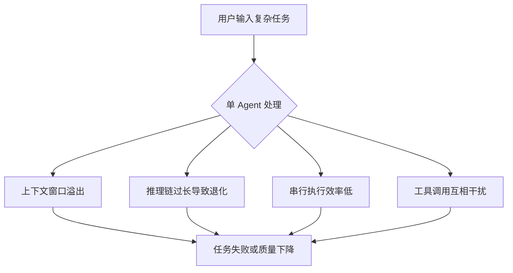

以 Hermes Agent 的一次实际调试为例：6 个测试文件失败，分布在 3 个不同子系统。如果单 Agent 串行处理，需要 ~106 秒；而 dispatch 3 个并行子 Agent，总耗时仅 ~53 秒，且每个 Agent 的上下文更聚焦，调试质量更高。

### 1.2 Multi-Agent 的核心价值

| 维度 | 单 Agent | 多 Agent |
|------|---------|---------|
| 上下文利用 | 全局共享，容易污染 | 每个 Agent 独立上下文，干净聚焦 |
| 执行效率 | 串行 | 并行（理论上 N 倍加速） |
| 故障隔离 | 一个工具失败影响全局 | 子 Agent 失败不影响其他 |
| 推理深度 | 长链推理容易退化 | 短链推理，更精准 |
| 资源利用 | 单线程 | 可利用多模型/多 provider |

---

## 二、Multi-Agent 通信架构

### 2.1 核心原则：单向指令 + 结果回传

几乎所有主流 Coding Agent 的多 Agent 通信都遵循同一个模式——**主 Agent 通过指令派发任务，子 Agent 完成后只返回摘要结果，中间过程不暴露**。

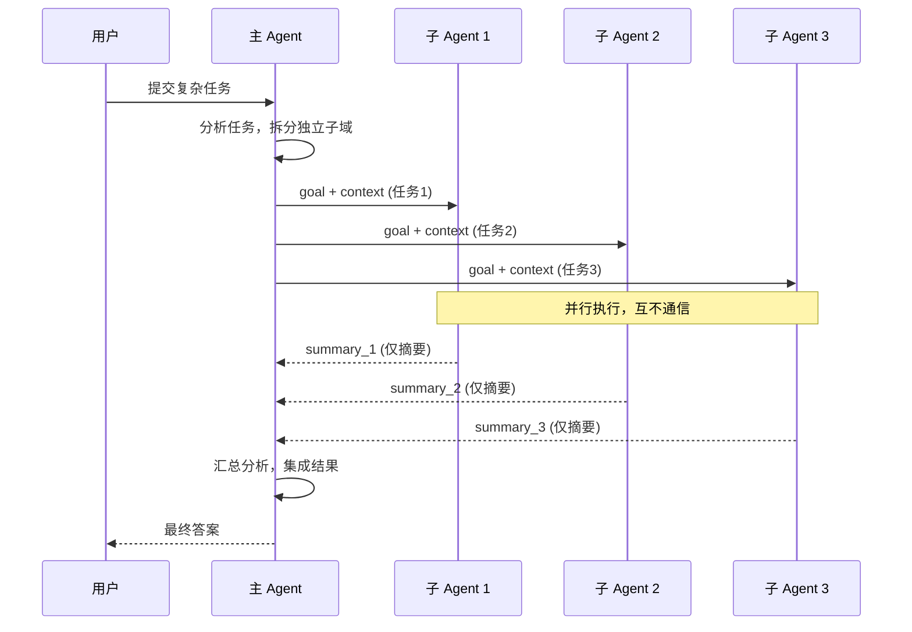

**关键特征：**

- **下行（主→子）**：通过 `goal`（任务目标）和 `context`（背景信息）传递，是一段精心构造的文字
- **上行（子→主）**：只有 `summary`（摘要），中间的工具调用、思考过程全部丢弃
- **横向（子↔子）**：**完全不通信**。子 Agent 不知道彼此的存在

### 2.2 为什么不支持 Peer-to-Peer 通信？

这不是工程偷懒，而是有意为之的设计决策：

1. **隔离性**：子 Agent 操作同一文件系统时，互相通信会导致竞态条件
2. **简洁性**：无需设计消息队列、锁机制、死锁检测
3. **可预测性**：没有涌现行为，主 Agent 对全局有完全控制
4. **上下文成本**：Agent 间传递完整上下文会迅速消耗 token 预算

### 2.3 上下行信息不对等

这是一个容易被忽视但极其重要的设计细节：

```
下行带宽：goal (~500-2000 tokens) + context (~500-5000 tokens)
上行带宽：summary (~100-500 tokens)
```

主 Agent 可以给子 Agent 丰富的上下文（代码片段、错误日志、约束条件），但子 Agent 回传的是压缩后的摘要。这意味着：

- **子 Agent 的发现可能丢失细节**——如果主 Agent 需要某个中间数据，需要在 goal 中明确要求子 Agent 保留
- **主 Agent 的协调能力取决于它给子 Agent 的上下文质量**——垃圾进，垃圾出

---

## 三、调度模式详解

### 3.1 模式一：完全并行（Fan-out / Fan-in）

最简单也最常用的模式。适用于子任务之间完全独立的场景。

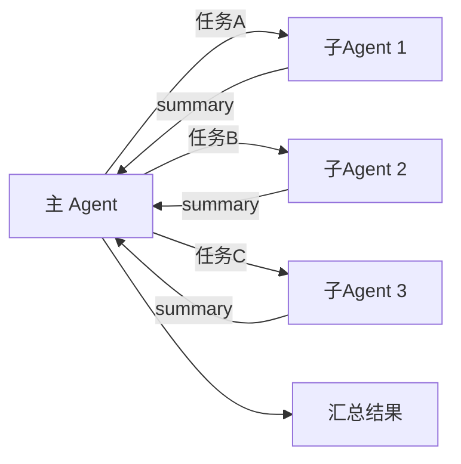

**Case：Hermes Agent 的并行调试**

```
场景：6 个测试失败，分布在 3 个文件
  - agent-tool-abort.test.ts: 3 failures (timing issues)
  - batch-completion-behavior.test.ts: 2 failures (event structure bug)
  - tool-approval-race-conditions.test.ts: 1 failure (async timing)

Dispatch:
  Agent 1 → Fix agent-tool-abort.test.ts
  Agent 2 → Fix batch-completion-behavior.test.ts
  Agent 3 → Fix tool-approval-race-conditions.test.ts

结果：
  Agent 1: 替换超时为事件驱动等待
  Agent 2: 修复 event 结构 bug (threadId 位置错误)
  Agent 3: 添加异步工具执行完成等待
  
  总耗时: ~53s (vs 串行 ~106s)
  零冲突，全部独立修复
```

### 3.2 模式二：串行链（Sequential Pipeline）

当任务 B 依赖任务 A 的结果时，必须串行。

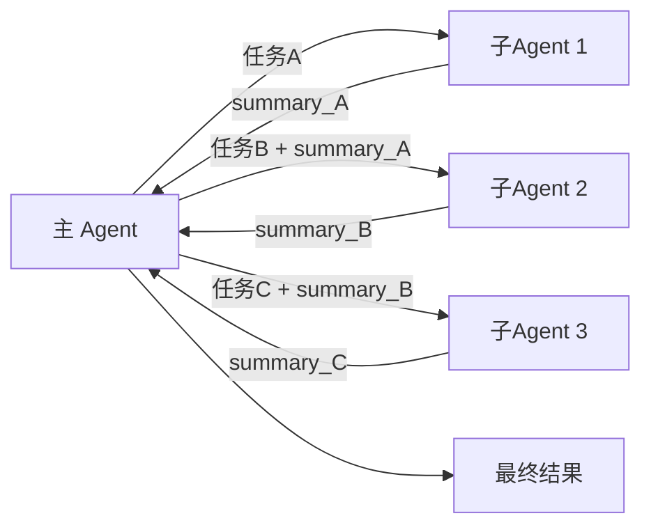

**Case：分阶段代码重构**

```
Step 1: Agent 调研现有架构 → 返回架构摘要
Step 2: 主 Agent 基于摘要设计新架构 → 派 Agent 实施模块 A
Step 3: 基于模块 A 的实现结果 → 派 Agent 实施依赖模块 B
```

### 3.3 模式三：分层编排（Hierarchical Orchestration）

主 Agent 派出一个"编排者"子 Agent，它再派出自己的子 Agent。

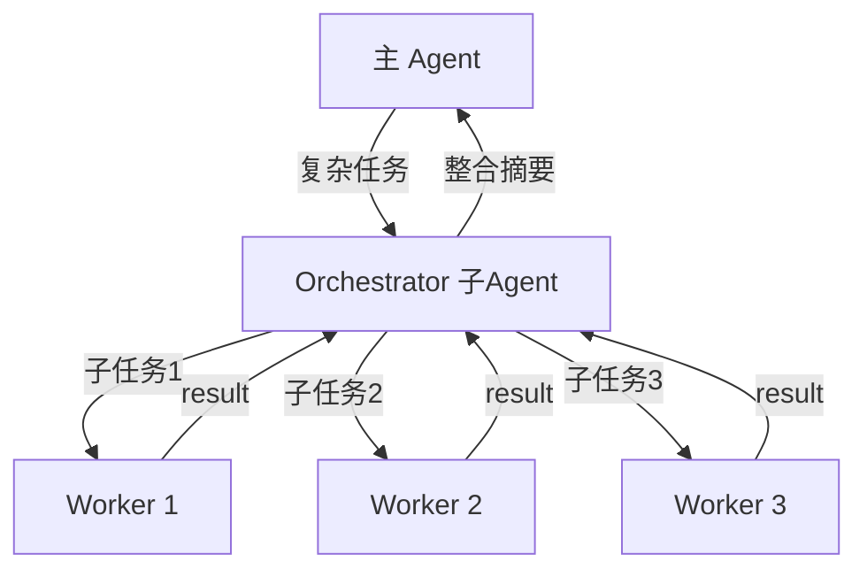

**在 Hermes Agent 中的角色分工：**

| 角色 | 能力 | 限制 |
|------|------|------|
| `leaf`（叶子 Agent） | 执行具体任务，使用工具 | 不能派发子 Agent |
| `orchestrator`（编排者） | 可以再派发子 Agent | 不能与用户交互 |

最大嵌套深度默认为 2 层，防止递归失控。

### 3.4 模式四：混合模式（Hybrid）

实际使用中，最常见的模式是混合——部分任务并行，部分任务串行。

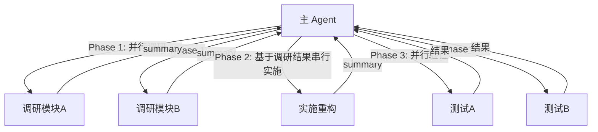

---

## 四、主流 Coding Agent 的多 Agent 实现对比

### 4.1 Claude Code

Claude Code 是目前 Multi-Agent 支持最成熟的 Coding Agent。

**核心机制：**
- **SubAgent（子 Agent）**：通过 `Task()` 工具派发
- **Claude Agent SDK**：提供 `claude --acp --stdio` 协议，支持从任意父进程 spawn Claude Code 子 Agent
- **Orchestrator 模式**：支持嵌套编排，子 Agent 可以是 leaf 或 orchestrator

**通信特点：**
- 子 Agent 通过 `goal` 和 `context` 接收任务
- 返回结构化的 `summary`，包含状态、API 调用数、耗时、token 用量
- 支持 `toolsets` 精确控制子 Agent 可用的工具范围

**Case：Claude Code 的 DeepResearch 实现**

根据 Anthropic 的工程博客 [How we built our multi-agent research system](https://www.anthropic.com/engineering/multi-agent-research-system)，Claude Deep Research 的架构是：

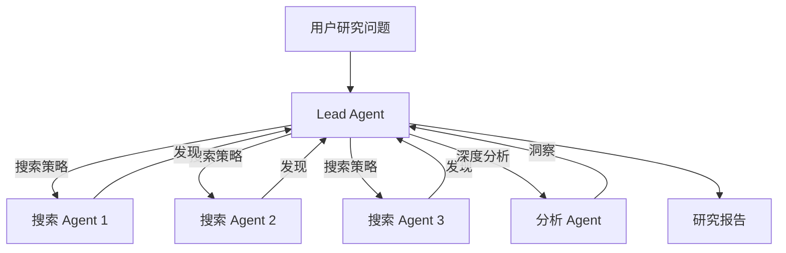

关键设计：
- Lead Agent 动态决定搜索方向和子 Agent 数量
- 每个搜索 Agent 有独立的上下文，避免信息过载
- 通过 `Todo` 工具跟踪多 Agent 的整体进度

### 4.2 OpenAI Codex CLI

Codex CLI 的多 Agent 能力相对较新，主要通过 ACP（Agent Communication Protocol）实现。

**核心机制：**
- 通过 `codex --acp --stdio` 作为子 Agent 被其他 Agent 调用
- 支持 `--model` 参数指定子 Agent 使用的模型
- 子 Agent 有独立的沙箱环境

**与 Claude Code 的关键差异：**
- Codex CLI 更侧重于沙箱隔离（默认在 sandbox 中运行）
- 子 Agent 的工具集相对固定，不如 Claude Code 灵活
- 通信协议兼容 ACP 标准，理论上可与任何支持 ACP 的 Agent 互操作

### 4.3 OpenCode

OpenCode 是一个开源的 CLI Coding Agent，架构上参考了 Claude Code 和 Codex 的设计。

**多 Agent 特点：**
- 支持通过 `delegate_task` 派发子 Agent
- 支持 leaf 和 orchestrator 两种角色
- 可配置最大并发子 Agent 数和嵌套深度

### 4.4 Hermes Agent

Hermes Agent（Nous Research）在多 Agent 调度上有自己的特色设计。

**核心机制：**
- `delegate_task` 工具：支持单任务和批量任务两种模式
- **批量模式**：一次派发多个子 Agent，自动并行执行
- **角色系统**：`leaf`（执行者）和 `orchestrator`（编排者）
- **工具集控制**：每个子 Agent 可以指定不同的 `toolsets`

**Hermes 的设计哲学：**

```python
# Hermes delegate_task 的核心参数
delegate_task(
    goal="具体任务描述",           # 必须：自包含的任务目标
    context="背景信息",            # 可选：帮助子 Agent 理解上下文
    toolsets=["terminal", "file"], # 可选：限定可用工具
    role="leaf",                  # 可选：leaf 或 orchestrator
    max_iterations=50,            # 可选：最大工具调用轮次
    acp_command="claude",         # 可选：使用外部 Agent 引擎
)
```

**Hermes 的独特能力——跨 Agent 引擎调度：**

```
Hermes 主 Agent
  ├── 子 Agent 1 (Hermes leaf，使用内置工具)
  ├── 子 Agent 2 (spawn Claude Code，使用 claude --acp)
  └── 子 Agent 3 (spawn Codex，使用 codex --acp)
```

这意味着 Hermes 可以作为"调度总管"，根据任务特性选择最适合的 Agent 引擎。

---

## 五、上下文工程：多 Agent 的灵魂

### 5.1 子 Agent 的上下文隔离

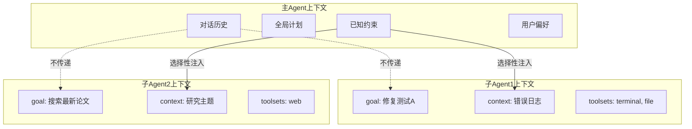

**关键原则：** 子 Agent 启动时只看到 `goal` + `context`，没有主 Agent 的对话历史。主 Agent 必须在 `context` 中精心构造子 Agent 需要的所有背景信息。

### 5.2 上下文压缩的三种策略

根据 Anthropic 的 [Effective context engineering for AI agents](https://www.anthropic.com/engineering/effective-context-engineering-for-ai-agents) 和 Manus 的实践经验：

1. **Offload（卸载）**：将子 Agent 的中间结果保存到文件系统，主 Agent 只在需要时读取
2. **Reduce（压缩）**：子 Agent 的 summary 是自动压缩的结果，丢弃中间过程
3. **Isolate（隔离）**：每个子 Agent 独立上下文，天然防止污染

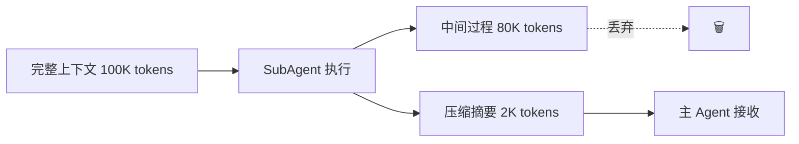

### 5.3 Goal 编写的好坏对比

**❌ Too broad（太宽泛）：**

```
goal: "Fix all the tests"
```

子 Agent 拿到后不知道从哪开始，可能浪费大量 token 探索。

**✅ Specific（具体聚焦）：**

```
goal: "Fix the 3 failing tests in src/agents/agent-tool-abort.test.ts:

1. 'should abort tool with partial output capture' - expects 'interrupted at'
2. 'should handle mixed completed and aborted tools' - fast tool aborted  
3. 'should properly track pendingToolCount' - expects 3 results but gets 0

These are timing/race condition issues. Your task:
1. Read the test file and understand each test
2. Identify root cause
3. Fix by replacing arbitrary timeouts with event-based waiting

Do NOT just increase timeouts - find the real issue.
Return: Summary of root cause and changes."
```

**❌ No context（没有上下文）：**

```
goal: "Fix the race condition"
```

**✅ Context-rich（上下文丰富）：**

```
goal: "Fix the race condition in tool-approval.test.ts"
context: "
Error output:
  Expected: 3
  Received: 0
  at Object.<anonymous> (tool-approval.test.ts:45:18)

The test waits 100ms but async tool execution takes ~300ms.
Related code: src/agents/tool-approval.ts line 120-150
"
```

---

## 六、实战陷阱与最佳实践

### 6.1 常见陷阱

| 陷阱 | 表现 | 解决方案 |
|------|------|---------|
| 子 Agent 重复工作 | 两个子 Agent 修了同一个文件 | 确保任务域不重叠 |
| 上下文不足 | 子 Agent 做了错误假设 | 在 context 中提供足够背景 |
| 摘要丢失关键信息 | 主 Agent 无法基于摘要决策 | 在 goal 中要求保留关键数据 |
| 工具集冲突 | 两个子 Agent 同时写同一个文件 | 分配不同的文件域或工具集 |
| 递归失控 | orchestrator 无限嵌套 | 设置 max_spawn_depth |

### 6.2 最佳实践 Checklist

```
□ 任务拆分
  - 子任务之间是否真的独立？
  - 是否有共享资源（同一文件、同一数据库）？
  - 是否需要对方的中间结果？

□ Goal 编写
  - 是否自包含（子 Agent 不需要额外上下文就能理解）？
  - 是否有明确的完成标准？
  - 是否有约束条件（"不要改生产代码"、"只修测试"）？

□ Context 注入
  - 是否包含错误日志/代码片段等关键上下文？
  - 是否说明了相关文件路径？
  - 是否排除了不相关的干扰信息？

□ 结果集成
  - 子 Agent 的修改是否会互相冲突？
  - 是否需要运行完整测试验证集成结果？
  - 摘要是否足够支撑主 Agent 的下一步决策？
```

### 6.3 什么时候不该用多 Agent

- **失败相互关联**：修一个可能修好全部 → 先调查再决定
- **需要全局理解**：子 Agent 无法独立理解问题
- **探索性调试**：还不知道什么坏了 → 先单 Agent 调查
- **共享状态**：子 Agent 会操作同一个资源 → 串行或加锁
- **任务太小**：派发子 Agent 的开销 > 直接执行的时间

---

## 七、Multi-Agent 的未来方向

### 7.1 ACP 协议标准化

Agent Communication Protocol（ACP）正在成为 Agent 间通信的事实标准。Claude Code、Codex、Hermes 都支持通过 ACP 互操作。这意味着：

```
未来可能出现的组合：
  Claude Code (规划) + Codex (执行) + Hermes (调度)
  每个 Agent 引擎做自己最擅长的事
```

### 7.2 从 SubAgent 到 Agent Economy

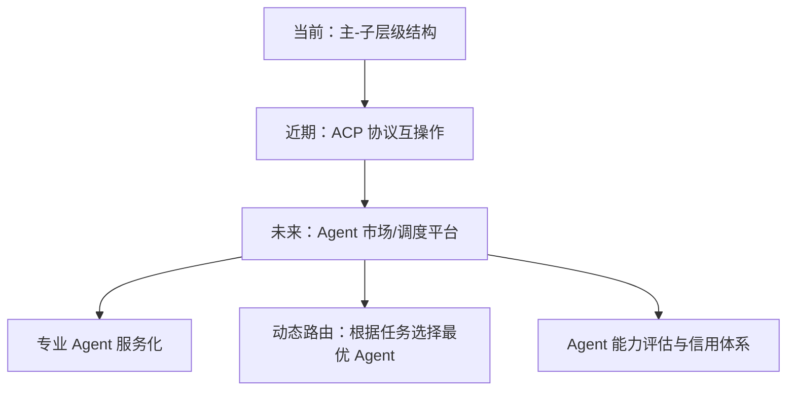

### 7.3 上下文工程的持续演进

Manus 在 25 年 3 月到 10 月之间重构了 5 次架构。这个领域变化极快。当前的关键趋势：

- **Offload + Reduce + Isolate** 三位一体的上下文管理
- **Agent Skills** 作为垂直能力注入的标准化方式
- **Memory 系统** 让 Agent 在多会话间保持知识
- **长时运行 Agent** 的可靠性和可观测性保障

---

## 八、总结

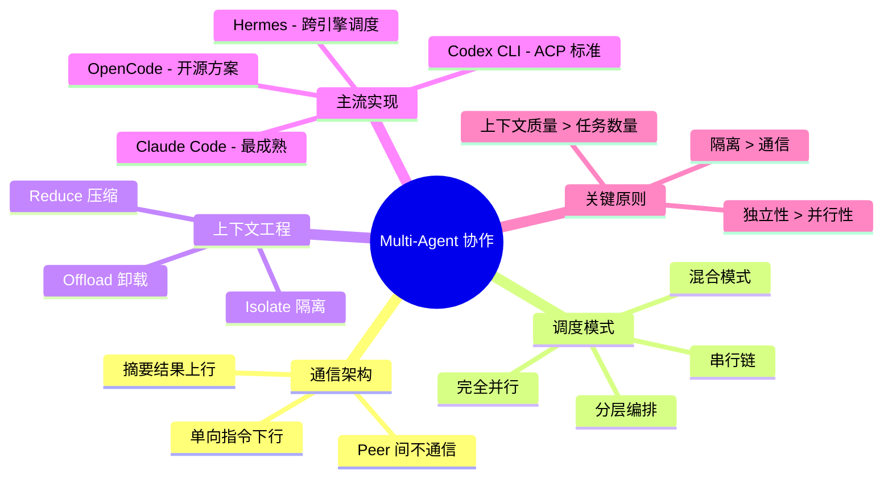

Multi-Agent 不是银弹。它在**任务可拆分、子域独立、上下文充足**的场景下表现出色；在**需要全局理解、强依赖、探索性**的场景下，单 Agent 仍然是更好的选择。

关键洞察：**Multi-Agent 的瓶颈不在 Agent 的数量，而在主 Agent 的任务拆分能力和上下文构造能力**。一个精心构造的 goal + context，胜过三个模糊的指令。

---

## 参考资料

1. [Building effective agents](https://www.anthropic.com/engineering/building-effective-agents) - Anthropic
2. [How we built our multi-agent research system](https://www.anthropic.com/engineering/multi-agent-research-system) - Anthropic（Claude Deep Research 架构）
3. [Effective context engineering for AI agents](https://www.anthropic.com/engineering/effective-context-engineering-for-ai-agents) - Anthropic
4. [Building agents with the Claude Agent SDK](https://www.anthropic.com/engineering/building-agents-with-the-claude-agent-sdk) - Anthropic
5. [Claude Code: Best practices for agentic coding](https://www.anthropic.com/engineering/claude-code-best-practices) - Anthropic
6. [Context Engineering in Manus](https://rlancemartin.github.io/2025/10/15/manus/) - Manus
7. [Context Engineering for Agents](https://rlancemartin.github.io/2025/06/23/context_engineering/) - Lance Martin & Langchain
8. [Kimi CLI Agent](https://github.com/MoonshotAI/kimi-cli) - Kimi（设计优雅的开源 CLI Agent）
9. [DeepAgents](https://github.com/langchain-ai/deepagents) - Langchain
10. [Measuring AI Ability to Complete Long Tasks](https://metr.org/blog/2025-03-19-measuring-ai-ability-to-complete-long-tasks/) - METR
11. [Hermes Agent - dispatching-parallel-agents](https://github.com/NousResearch/hermes-agent) - Nous Research
