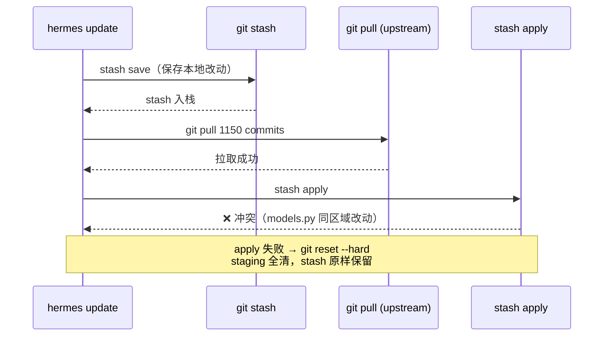
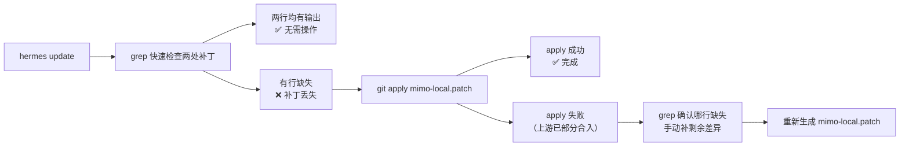

## 背景

`hermes update` 拉取了 1150 个新 commit 之后，本地针对 Xiaomi MIMO 的两处兼容补丁产生冲突，需要手动处理。

这不是一次偶然——只要维护了任何本地 hack，每次大版本 update 就可能触发。本文记录根因、解法，以及如何让补丁在下次更新后不再丢失。

---

## 冲突根因

本地有两处 MIMO 兼容改动：

| 文件 | 本地改动 | 上游动作 | 结果 |
|------|---------|---------|------|
| `hermes_cli/models.py` | 在 `_PROVIDER_MODELS["xiaomi"]` 加入 `mimo-v2.5-pro`、`mimo-v2.5`、`mimo-v2.5-flash` | 上游同位置合并了 `mimo-v2.5-pro`、`mimo-v2.5`（**缺 flash**） | **冲突** |
| `run_agent.py` | 修复 `_swap_credential` 的 `base_url` 覆盖 bug | 上游未触碰此行 | 自动合并成功，但 reset 时丢弃 |

`hermes update` 内部的冲突处理机制：



apply 失败时会 `git reset --hard`，staging 清空，stash 保留——但不会自动提示你哪里出了问题。

---

## 两处补丁的具体内容

### 补丁一：`hermes_cli/models.py` — 补入 `mimo-v2.5-flash`

上游已合并了 `mimo-v2.5-pro` 和 `mimo-v2.5`，但遗漏了 flash 变体。手动插入：

```python
# 上游合并后的状态：
"xiaomi": [
    "mimo-v2.5-pro",
    "mimo-v2.5",
    "mimo-v2-pro",
    ...
]

# 手动补入（插在 v2.5 之后、v2-pro 之前）：
"xiaomi": [
    "mimo-v2.5-pro",
    "mimo-v2.5",
    "mimo-v2.5-flash",   # ← 新增
    "mimo-v2-pro",
    ...
]
```

### 补丁二：`run_agent.py` — `_swap_credential` base_url 覆盖修复

**问题根因**：credential rotation 时，如果 entry 的 `base_url` 恰好等于 provider 的默认 `inference_base_url`，会错误地覆盖 `self.base_url`。Xiaomi MIMO 的多 token 轮换场景会稳定触发。

```python
# 原始代码（一行 or 链）：
runtime_base = getattr(entry, "runtime_base_url", None) \
    or getattr(entry, "base_url", None) \
    or self.base_url

# 修复后：先拿到 entry_base，再判断是否与 provider 默认值重复
entry_base = getattr(entry, "runtime_base_url", None) or getattr(entry, "base_url", None) or ""
if entry_base and self.base_url and entry_base.rstrip("/") != self.base_url.rstrip("/"):
    try:
        from hermes_cli.auth import PROVIDER_REGISTRY
        pconfig = PROVIDER_REGISTRY.get(self.provider)
        if pconfig and entry_base.rstrip("/") == pconfig.inference_base_url.rstrip("/"):
            entry_base = ""  # entry 的 base_url 就是 provider 默认值，不应覆盖
    except Exception:
        pass
runtime_base = entry_base or self.base_url
```

核心逻辑：**当 entry 携带的 `base_url` 与 provider 全局默认值相同时，不应覆盖当前实例的 `self.base_url`**。

---

## 解决步骤

不要重新 `git stash apply`（会再次冲突），直接手动应用：

```bash
# 1. 确认 reset 后状态是干净的
git -C ~/.hermes/hermes-agent status

# 2. 手动编辑 models.py，在 "xiaomi" list 中补入 mimo-v2.5-flash
vim ~/.hermes/hermes-agent/hermes_cli/models.py

# 3. 手动编辑 run_agent.py，应用 _swap_credential 修复
vim ~/.hermes/hermes-agent/run_agent.py

# 4. 验证两处补丁均已应用
grep "mimo-v2.5-flash" ~/.hermes/hermes-agent/hermes_cli/models.py
grep "entry_base" ~/.hermes/hermes-agent/run_agent.py

# 5. 清理已失效的旧 stash
git -C ~/.hermes/hermes-agent stash drop stash@{1}   # 冲突时的 auto-stash
```

---

## 每次 `hermes update` 后的检查清单

```bash
# 快速验证两处本地补丁是否仍然存在
grep "mimo-v2.5-flash" ~/.hermes/hermes-agent/hermes_cli/models.py \
  && echo "✅ models.py OK" || echo "❌ models.py 缺 flash"

grep "entry_base" ~/.hermes/hermes-agent/run_agent.py \
  && echo "✅ run_agent.py OK" || echo "❌ run_agent.py 缺修复"
```

两行都有输出则正常，否则重新应用本文的补丁。

---

## 让补丁不再手动重放：patch 文件方案

维护一个 `.patch` 文件，每次 update 后自动应用：

**第一步：在补丁应用完毕后生成 patch**

```bash
git -C ~/.hermes/hermes-agent diff > \
  ~/CodexSpace/Tooling/2026-0430-hermes-mimo-update-conflict/mimo-local.patch
```

**第二步：每次 `hermes update` 后执行**

```bash
git -C ~/.hermes/hermes-agent apply \
  ~/CodexSpace/Tooling/2026-0430-hermes-mimo-update-conflict/mimo-local.patch
```

如果 apply 失败（说明上游部分合并了本地改动），检查 grep 输出，只手动补剩余未合入的部分。



---

## Stash 残留说明

解决冲突后清理了已失效的 stash：

```bash
git -C ~/.hermes/hermes-agent stash list
# stash@{0}: hermes-update-autostash-20260430-101237 — 仅含 ui-tui/package-lock.json
# stash@{1}: 90caa28... — 包含 MIMO 补丁的旧 stash（已失效，手动处理后可删）

git -C ~/.hermes/hermes-agent stash drop stash@{1}
```

残留的 `stash@{0}` 只含 `ui-tui/package-lock.json`，是 update 过程自动产生的 auto-stash，与 MIMO 无关，可忽略。

---

*2026-04-30*
