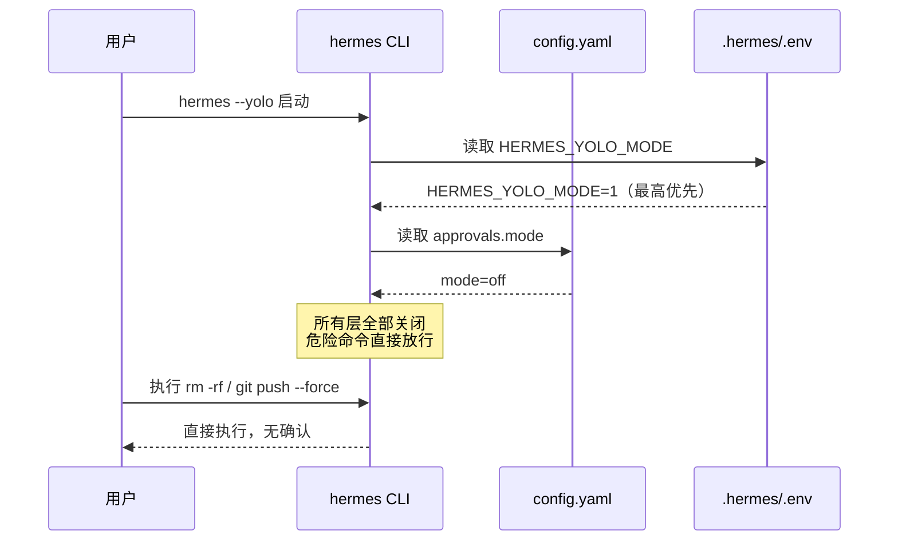

## 问题背景

用 Hermes Agent 跑自动化任务时，它会对"危险命令"（`rm -rf`、`git push --force`、`docker` 等）弹出确认提示，要手动 approve 才能继续。单次交互场景还好，但在自动化 pipeline 或高频调试环境里，这种中断极其烦人。

光改一两个配置项不够——Hermes 的审批系统有**多层控制**，必须全部关闭才能真正实现 YOLO。

---

## 审批系统的多层结构


| 层级 | 配置项 | 默认值 | 说明 |
|------|--------|--------|------|
| ① | `approvals.mode` | `manual` | `manual`=总是问，`smart`=LLM 判断，**`off`=全部跳过** |
| ② | `command_allowlist` | `[]` | 已批准的命令模式列表（list 类型！） |
| ③ | `approvals.cron_mode` | `deny` | cron 任务遇危险命令：`deny`=阻止，**`approve`=放行** |
| ④ | `approvals.mcp_reload_confirm` | `True` | reload-mcp 时是否确认 |
| ⑤ | `hooks_auto_accept` | `False` | PreToolUse/PostToolUse hooks 是否自动通过 |
| ⑥ | `security.tirith_enabled` | `True` | 代码/命令安全扫描（Tirith） |
| ⑦ | `HERMES_YOLO_MODE` 环境变量 | 未设置 | 设为 `1` 跳过所有危险命令审批，运行时最高优先 |
| ⑧ | `--yolo` CLI flag | 不启用 | 启动时一次性开启，重启失效 |

**关键陷阱**：`approvals.mode` 的有效值是 `manual` / `smart` / `off`，**不是 `auto`**！写了无效值会静默回退到 `manual`，仍然弹确认，很难发现。

---

## 四种开启方式

### 方法一：修改配置文件（永久，推荐）

直接编辑 `~/.hermes/config.yaml` 风险较高（YAML 类型容易写错），推荐用 Python 脚本一次性写入，确保类型正确：

```bash
python3 -c "
import yaml, os
path = os.path.expanduser('~/.hermes/config.yaml')
with open(path) as f:
    config = yaml.safe_load(f)

config['approvals'] = {
    'mode': 'off',
    'timeout': 60,
    'cron_mode': 'approve',
    'mcp_reload_confirm': False,
}
config['command_allowlist'] = []       # 必须是 list，不能是字符串 '[]'
config['hooks_auto_accept'] = True
config['security']['tirith_enabled'] = False

with open(path, 'w') as f:
    yaml.dump(config, f, default_flow_style=False, allow_unicode=True, sort_keys=False)
print('Done')
"
```

同时在 `~/.hermes/.env` 添加运行时变量（最高优先级，即使 config 被覆盖也生效）：

```bash
echo "HERMES_YOLO_MODE=1" >> ~/.hermes/.env
```

### 方法二：`--yolo` 启动标志（一次性）

```bash
hermes --yolo
```

重启 hermes 后失效，适合临时 debug 场景。

### 方法三：会话内实时切换

在 Hermes 会话中输入斜杠命令：

```
/yolo
```

无需重启，当前会话立即生效。Telegram/Discord gateway 模式同样支持。

### 方法四：逐项 CLI 命令

```bash
hermes config set approvals.mode off
hermes config set approvals.cron_mode approve
hermes config set approvals.mcp_reload_confirm false
hermes config set hooks_auto_accept true
hermes config set security.tirith_enabled false
hermes config set command_allowlist '[]'
```

注意最后一条：`hermes config set command_allowlist '[]'` 可能将值存为**字符串**而非 list，建议改用方法一的 Python 脚本修正。

---

## 配置生效流程



---

## 验证

```bash
# 检查 approvals 和安全扫描配置
hermes config | grep -A5 "approvals\|Security"

# 用 Python 验证 YAML 类型（关键：确认 command_allowlist 是 list 不是字符串）
python3 -c "
import yaml, os
c = yaml.safe_load(open(os.path.expanduser('~/.hermes/config.yaml')))
print('mode:', c['approvals']['mode'])
print('cron_mode:', c['approvals']['cron_mode'])
print('command_allowlist type:', type(c['command_allowlist']))
print('tirith:', c['security']['tirith_enabled'])
print('hooks_auto_accept:', c['hooks_auto_accept'])
"

# 验证环境变量
grep HERMES_YOLO_MODE ~/.hermes/.env
```

期望输出：
```
mode: off
cron_mode: approve
command_allowlist type: <class 'list'>
tirith: False
hooks_auto_accept: True
HERMES_YOLO_MODE=1
```

---

## 注意事项

1. **重启生效**：修改 `config.yaml` 后需重启 hermes CLI，或在当前会话执行 `/reset`
2. **安全风险**：YOLO 模式下 hermes 可以直接执行 `rm -rf`、`git push --force`，仅在本地受信任环境使用，生产/CI 环境请保留审批
3. **类型陷阱**：`command_allowlist` 必须是 YAML list `[]`，不能是字符串 `'[]'`；建议始终用 Python 脚本写入
4. **env 变量优先级最高**：即使 `config.yaml` 中 `approvals.mode` 是 `manual`，只要 `HERMES_YOLO_MODE=1` 存在，危险命令也会直接放行
5. **Gateway 同样受控**：Telegram/Discord 等 gateway 模式受相同配置控制，`/yolo` 命令在 gateway 会话中也有效

---

## 相关源码位置

| 文件 | 位置 | 说明 |
|------|------|------|
| `hermes_cli/config.py` | L1031–1051 | `approvals` 默认值定义 |
| `cli.py` | L6962 | `_toggle_yolo()` YOLO 实现 |
| `hermes_cli/main.py` | L1279 | `--yolo` 启动 flag 处理 |
| `gateway/run.py` | L7642 | `_handle_yolo_command()` gateway 支持 |

---

*2026-04-30*
