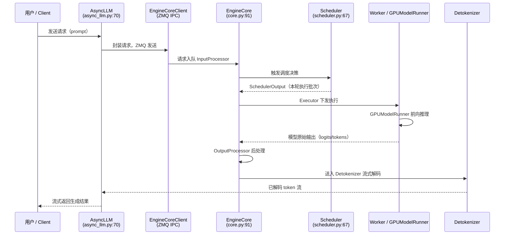
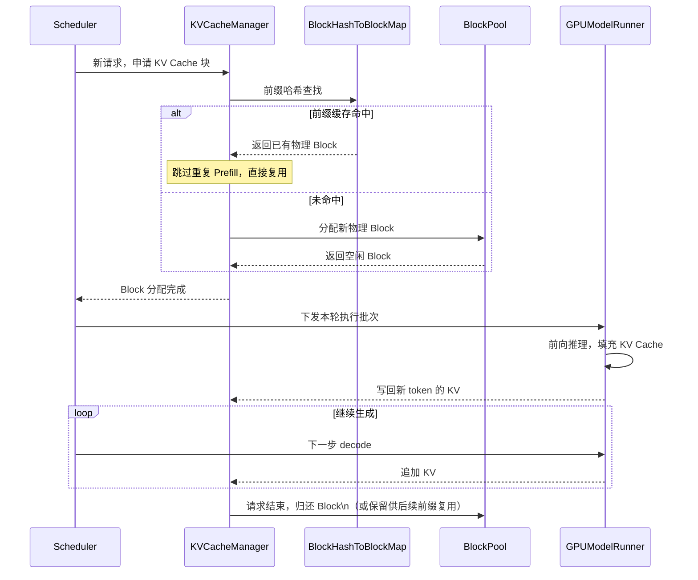
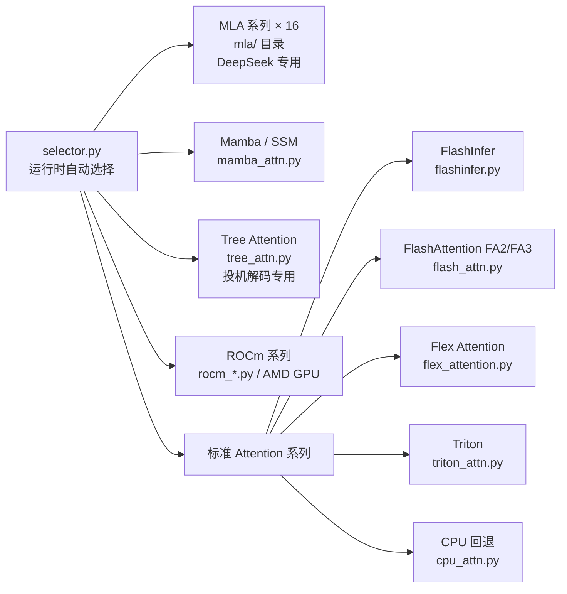
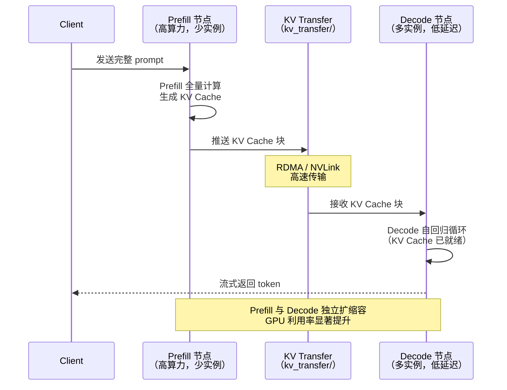
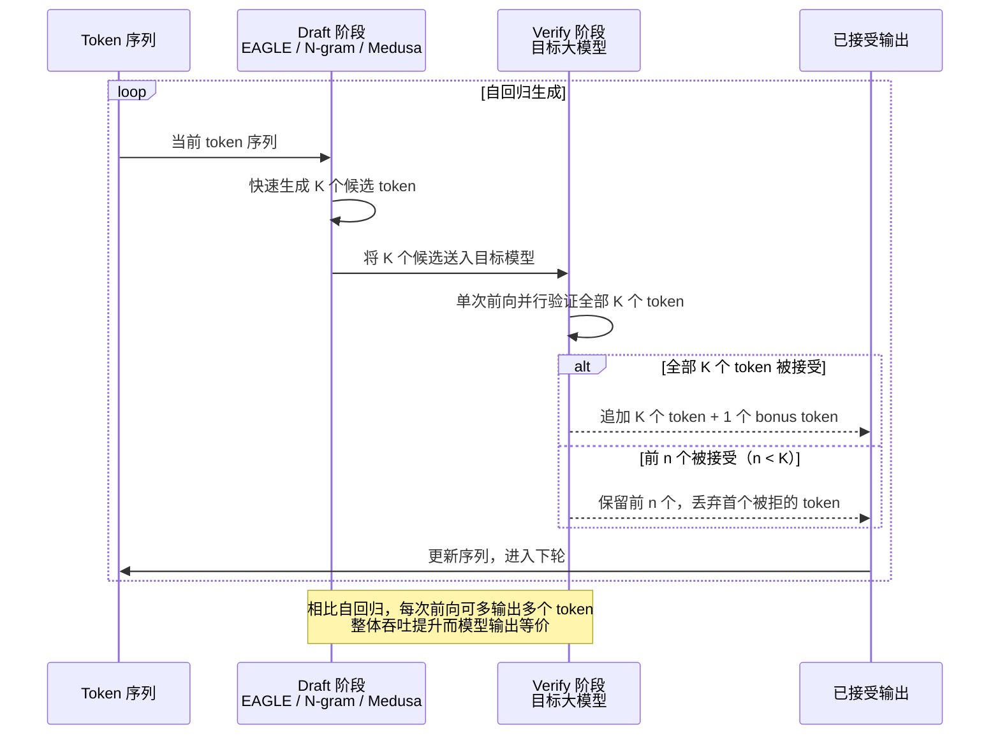

## 引子

vLLM 是目前生产环境中最广泛使用的大模型推理框架之一。v0.20 版本在保持向后兼容的同时，将主力执行路径完全迁移到了全新的 **V1 引擎**——进程分离架构、ZMQ IPC 通信、全新调度器。

本文基于 vLLM v0.20 源码，系统梳理其整体架构、数据流、核心组件和高级特性，帮助工程师快速建立完整的架构心智模型。

---

## 一、顶层目录结构

```
vllm_0_20/
├── vllm/              # Python 主库（57 子目录/模块）
├── csrc/              # CUDA/C++ 高性能内核（45 项）
├── benchmarks/        # 性能基准测试
├── examples/          # 使用示例（offline、online、tool_calling、speech_to_text 等）
├── tests/             # 测试用例
├── docs/              # 文档
├── docker/            # Docker 镜像定义
├── cmake/             # CMake 构建配置
├── requirements/      # 依赖分组（lint、test、build 等）
├── tools/             # 开发工具脚本
└── scripts/           # CI/运维脚本
```

核心逻辑集中在 `vllm/` 下，`csrc/` 负责 CUDA/C++ 高性能内核。

---

## 二、双引擎设计

vLLM v0.20 保留了**双引擎**设计以兼顾迁移平稳性：

| 引擎 | 路径 | 状态 | 说明 |
|------|------|------|------|
| **V1 引擎** | `vllm/v1/` | **主力引擎，活跃开发** | 进程分离架构，ZMQ IPC 通信 |
| Legacy 引擎 | `vllm/engine/` | 向后兼容保留 | `LLMEngine` / `AsyncLLMEngine` |

### V1 引擎数据流



进程间通信选用 **ZMQ**，将调度主进程与 GPU Worker 进程完全隔离，避免 GIL 争用并支持多机扩展。

---

## 三、用户入口点

| 入口 | 路径 | 用途 |
|------|------|------|
| **`LLM` 类** | `entrypoints/llm.py:106` | 离线推理：`generate()`, `chat()`, `encode()`, `embed()` |
| **OpenAI API** | `entrypoints/openai/api_server.py` | 生产级 OpenAI 兼容 HTTP 服务 |
| gRPC | `entrypoints/grpc_server.py` | gRPC 服务端点 |
| Anthropic API | `entrypoints/anthropic/` | Anthropic 格式兼容 |
| MCP | `entrypoints/mcp/` | Model Context Protocol |
| SageMaker | `entrypoints/sagemaker/` | AWS SageMaker 集成 |
| CLI | `entrypoints/cli/` | `vllm serve` 等命令行工具 |

公共 API（`vllm/__init__.py` 延迟加载）：`LLM`, `SamplingParams`, `RequestOutput`, `ModelRegistry`, `EngineArgs`。

---

## 四、模型加载层

### 4.1 模型注册表

`model_executor/models/registry.py` 以 HF `architectures` 字符串为键懒加载对应模块，覆盖 280+ 模型文件。

核心映射（`_TEXT_GENERATION_MODELS`）：

```
"LlamaForCausalLM"       → ("llama",       "LlamaForCausalLM")
"Qwen3ForCausalLM"       → ("qwen3",       "Qwen3ForCausalLM")
"DeepseekV3ForCausalLM"  → ("deepseek_v3", "DeepseekV3ForCausalLM")
```

覆盖家族：Llama、Qwen(2/2.5/3/3.5)、DeepSeek(v2/v3/v4)、Gemma、Mistral、Mixtral、Phi、Mamba 等。

`_ModelInfo` 数据类自动探测模型能力：多模态、PP 支持、无注意力、混合架构、转录等。

### 4.2 权重加载器

| 加载器 | 文件 | 格式 |
|--------|------|------|
| DefaultLoader | `default_loader.py` | HF safetensors/bin |
| BitsAndBytesLoader | `bitsandbytes_loader.py` | BnB 量化 |
| GGUFLoader | `gguf_loader.py` | GGUF 格式 |
| ShardedStateLoader | `sharded_state_loader.py` | 分片检查点 |
| TensorizerLoader | `tensorizer_loader.py` | CoreWeave Tensorizer |

### 4.3 层实现

- **核心层**：`linear.py`, `layernorm.py`, `activation.py`, `vocab_parallel_embedding.py`, `logits_processor.py`
- **注意力**：`attention/`, `mla.py`（Multi-head Latent Attention），`deepseek_v4_attention.py`, `lightning_attn.py`
- **MoE**：`fused_moe/`
- **旋转编码**：`rotary_embedding/`
- **量化**：`quantization/`（GPTQ, AWQ, SqueezeLLM, Marlin 等）

---

## 五、调度器与 KV Cache

### 5.1 调度器

| 文件 | 类 | 说明 |
|------|-----|------|
| `sched/scheduler.py:67` | `Scheduler(SchedulerInterface)` | 主调度器，决定每步执行哪些请求 |
| `sched/async_scheduler.py` | 异步调度器变体 | |
| `sched/output.py` | `SchedulerOutput` | 调度决策输出 |
| `sched/request_queue.py` | 请求优先队列 | |

### 5.2 KV Cache 管理

Paged Attention 的核心抽象：

| 文件 | 类 | 说明 |
|------|-----|------|
| `kv_cache_manager.py:106` | `KVCacheManager` | KV Cache 分配与回收 |
| `block_pool.py:130` | `BlockPool` | **Paged Attention 核心**：物理块池管理 |
| `block_pool.py:34` | `BlockHashToBlockMap` | 前缀缓存（Prefix Caching）的哈希查找 |
| `kv_cache_coordinator.py` | KV Cache 跨层协调 | |
| `encoder_cache_manager.py` | 编码器（多模态）缓存 | |

`BlockPool` 将 GPU 显存切分为固定大小的物理块（block），通过哈希映射实现 **Prefix Caching**：相同前缀的请求可以复用已有 KV Cache 块，大幅降低 TTFT。

**KV Cache 块分配与前缀缓存交互：**



### 5.3 KV Cache 卸载

- `vllm/v1/kv_offload/` — KV Cache 卸载到 CPU/磁盘
- `vllm/v1/simple_kv_offload/` — 简化版卸载，适用于内存充裕场景

---

## 六、注意力后端

核心抽象在 `vllm/v1/attention/backend.py`：

- `AttentionBackend(ABC)` — 后端接口
- `AttentionImpl` / `MLAAttentionImpl` / `SparseMLAAttentionImpl` — 实现基类
- `selector.py` — 运行时**自动选择**最优后端

**22+ 后端实现**：

| 后端 | 文件 | 说明 |
|------|------|------|
| FlashAttention | `flash_attn.py` | FA2/FA3，最常用 |
| FlashInfer | `flashinfer.py` | FlashInfer 库 |
| Triton | `triton_attn.py` | Triton 内核 |
| Flex Attention | `flex_attention.py` | PyTorch flex_attention |
| CPU | `cpu_attn.py` | CPU 回退 |
| **MLA 系列**（16 个） | `mla/` 目录 | DeepSeek MLA 专用 |
| Mamba | `mamba_attn.py` 等 | SSM "注意力" |
| Tree | `tree_attn.py` | 投机解码用 |
| ROCm | `rocm_*.py` | AMD GPU |

`selector.py` 根据硬件、模型类型、是否启用 MLA 等条件在运行时决策，用户无需手动指定。

**注意力后端树形结构（selector.py 选择范围）：**



---

## 七、分布式推理

### 7.1 并行策略

| 策略 | 核心文件 | 说明 |
|------|----------|------|
| Tensor Parallel (TP) | `parallel_state.py` (`GroupCoordinator:290`) | 模型分片到多 GPU |
| Pipeline Parallel (PP) | `parallel_state.py` | 流水线并行 |
| Data Parallel (DP) | `v1/worker/dp_utils.py` | 数据并行 |
| Expert Parallel (EP) | `distributed/elastic_ep/` | MoE 专家并行 |
| Context Parallel (CP) | `v1/worker/cp_utils.py` | 长上下文并行 |

初始化入口：`initialize_model_parallel()` 和 `init_distributed_environment()`。

### 7.2 通信后端

19 种通信后端（`distributed/device_communicators/`）：

- **NCCL**（`pynccl.py`）
- **Custom All-Reduce**（`custom_all_reduce.py`）
- Quick All-Reduce、FlashInfer All-Reduce
- Ray、共享内存广播（`shm_broadcast.py`）、All2All

### 7.3 高级分布式特性

| 特性 | 路径 | 说明 |
|------|------|------|
| **Disaggregated Prefill** | `distributed/kv_transfer/` | Prefill/Decode 分离，跨节点 KV 传输 |
| **EP 负载均衡** | `distributed/eplb/` | 动态 MoE 专家重平衡 |
| **弹性 EP** | `distributed/elastic_ep/` | 动态伸缩 EP 组 |
| 编码器缓存传输 | `distributed/ec_transfer/` | 多模态编码器缓存 |
| 实时权重更新 | `distributed/weight_transfer/` | 在线权重热更新 |

**Disaggregated Prefill** 是 v0.20 的重要进展：Prefill 节点和 Decode 节点分离部署，Prefill 完成后通过高速网络（RDMA/NVLink）将 KV Cache 传给 Decode 节点，显著提升 GPU 利用率并降低 P99 延迟。



---

## 八、CUDA/C++ 内核

`csrc/` 包含 45 个高性能内核目录/文件：

| 目录/文件 | 用途 |
|-----------|------|
| `attention/` | Paged Attention CUDA 内核 |
| `moe/` | MoE 路由与计算内核 |
| `quantization/` | 量化内核（GPTQ、AWQ、Marlin 等） |
| `mamba/` | Mamba/SSM 内核 |
| `cache_kernels.cu` | KV Cache 操作（reshape、copy） |
| `layernorm_kernels.cu` | LayerNorm / RMSNorm |
| `pos_encoding_kernels.cu` | 位置编码（RoPE 等） |
| `sampler.cu` / `topk.cu` | 采样内核 |
| `custom_all_reduce.cu` | 自定义 All-Reduce |
| `quickreduce/` | 快速归约 |
| `fused_deepseek_v4_*` | DeepSeek V4 融合内核 |
| `cutlass_extensions/` | CUTLASS 扩展 |

---

## 九、配置系统

`vllm/config/` 下有 29 个模块化配置文件，全部采用 `dataclass`，由 `VllmConfig` 顶层聚合：

| 配置类 | 文件 | 核心参数 |
|--------|------|----------|
| **`VllmConfig`** | `vllm.py` | 顶层聚合器，`get_current_vllm_config()` |
| **`ModelConfig`** | `model.py` | model_name, dtype, max_model_len, tokenizer |
| **`CacheConfig`** | `cache.py` | block_size, gpu_memory_utilization, swap_space |
| **`ParallelConfig`** | `parallel.py` | tensor/pipeline/data_parallel_size |
| **`SchedulerConfig`** | `scheduler.py` | max_num_seqs, max_num_batched_tokens, chunked_prefill |
| **`LoadConfig`** | `load.py` | 权重加载策略 |
| `SpeculativeConfig` | `speculative.py` | draft_model, num_speculative_tokens |
| `CompilationConfig` | `compilation.py` | torch.compile, CUDA Graph 模式 |
| `AttentionConfig` | `attention.py` | 注意力后端选择 |
| `LoRAConfig` | `lora.py` | LoRA 适配器设置 |
| `OffloadConfig` | `offload.py` | KV/权重卸载 |
| `KVTransferConfig` | `kv_transfer.py` | Disaggregated KV 传输 |
| `SpeechToTextConfig` | `speech_to_text.py` | ASR 管线配置 |
| `StructuredOutputsConfig` | `structured_outputs.py` | JSON/guided generation |

---

## 十、高级特性

### 10.1 投机解码

`vllm/v1/spec_decode/` 支持 **6 种投机解码策略**：

- **EAGLE / EAGLE-3**：Draft 模型辅助，token 接受率高
- **Medusa**：多头并行草稿生成
- **MTP**（Multi-Token Prediction）
- **N-gram**：无 draft 模型，纯统计匹配
- **DFlash**
- **Suffix Decoding**

**投机解码通用流程（Draft → Verify 循环）：**



### 10.2 多模态

`vllm/multimodal/` 处理图像、音频、视频输入，配合 `encoder_cache_manager` 管理编码器输出缓存，避免重复编码。

### 10.3 结构化输出

`vllm/v1/structured_output/` 支持 JSON Schema、正则表达式、语法约束的 guided generation。

### 10.4 LoRA 热切换

`vllm/lora/` 支持运行时热切换 LoRA 适配器，通过 `lora_model_runner_mixin.py` 集成到推理循环，无需重启服务。

### 10.5 编译优化

`vllm/compilation/` 集成 `torch.compile` 和 CUDA Graph 捕获，通过 `CompilationConfig` 控制编译策略，对 decode 阶段加速效果明显。

---

## 十一、开发关键路径

### 添加新模型

```
1. 在 vllm/model_executor/models/ 创建模型文件
2. 在 registry.py 的 _TEXT_GENERATION_MODELS 中注册
   "ArchName" → ("module_name", "ClassName")
3. 实现 forward() 和 load_weights() 方法
```

### 添加新注意力后端

```
1. 在 vllm/v1/attention/backends/ 实现 AttentionBackend 子类
2. 在 registry.py 注册
3. 在 selector.py 添加选择逻辑
```

### 启动 OpenAI 兼容服务

```bash
vllm serve <model_name> \
    --tensor-parallel-size 2 \
    --max-model-len 4096
```

请求链路：`api_server.py` → `AsyncLLM` → `EngineCore` → `Scheduler` → `Worker`

---

## 小结

vLLM v0.20 的架构可以用三个关键词概括：

1. **进程隔离**：V1 引擎以 ZMQ IPC 将调度与执行彻底解耦，GIL 不再是瓶颈。
2. **Paged KV Cache**：BlockPool + 前缀缓存（Prefix Caching）是高吞吐的基础。
3. **可插拔后端**：注意力后端、通信后端、权重加载器全部抽象为接口，新硬件和新算法可以独立接入。

对于需要在生产环境部署大模型的工程师，理解这三点就能快速定位性能瓶颈和扩展点。

---

*基于 vLLM v0.20 源码分析，2026-04-30*
