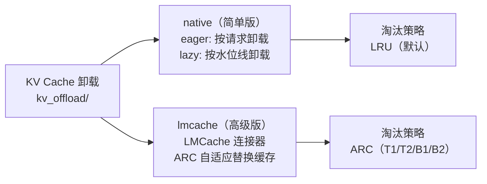
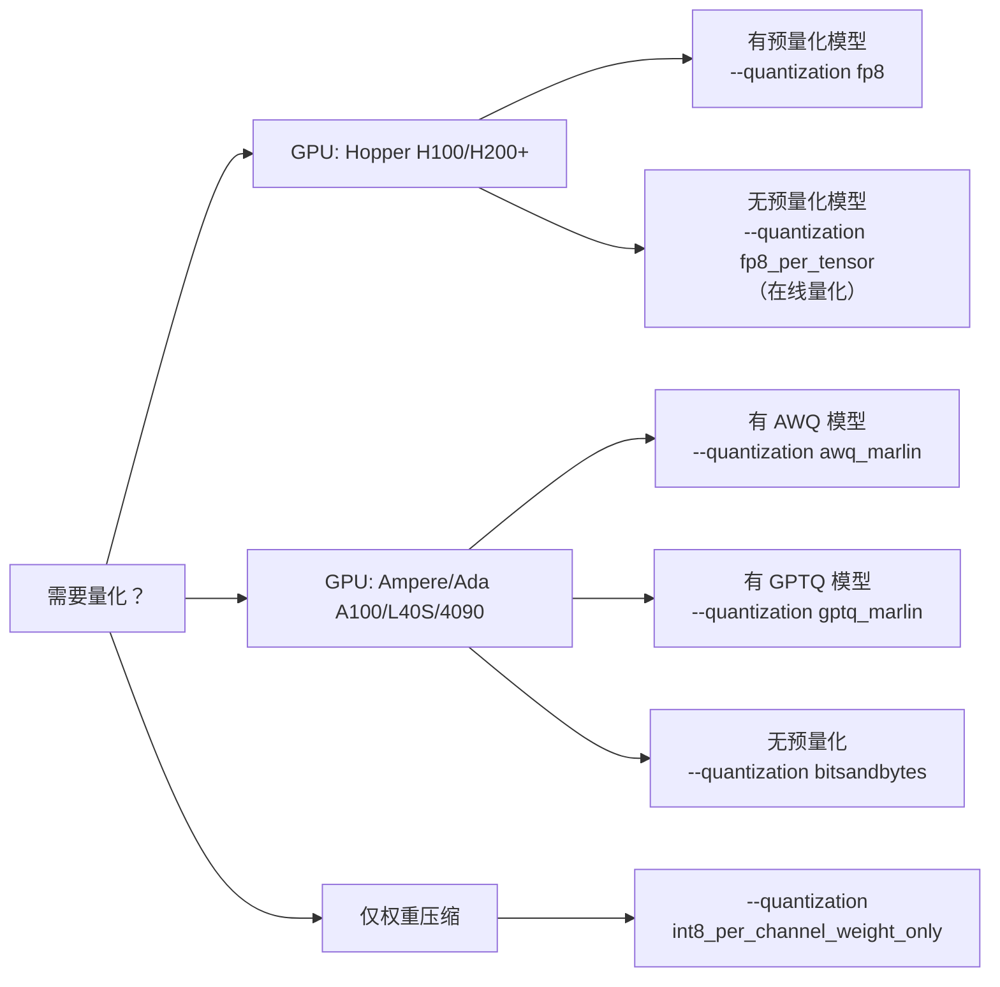
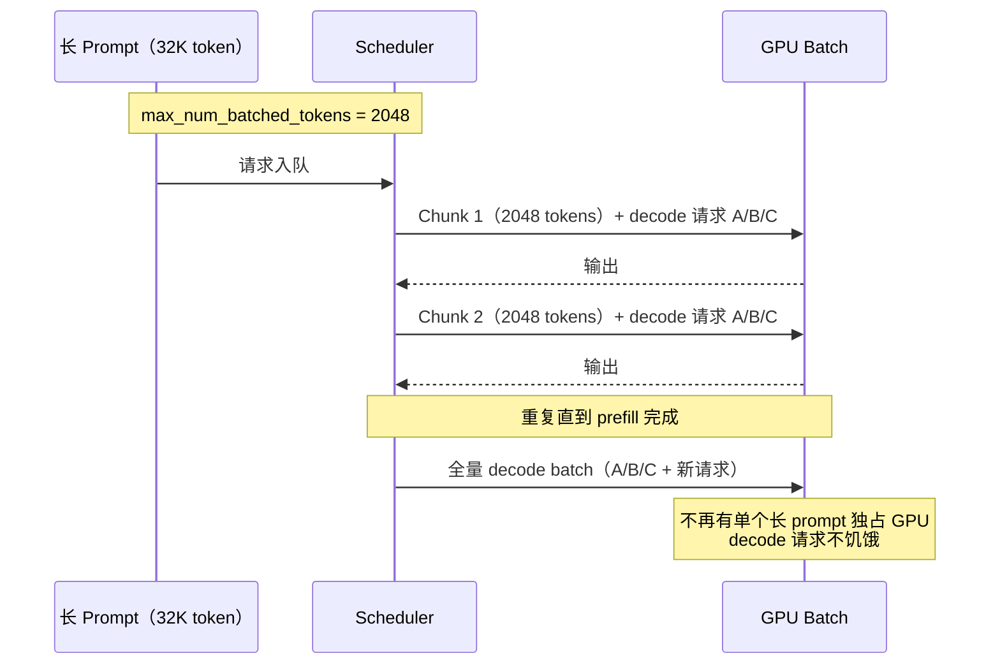
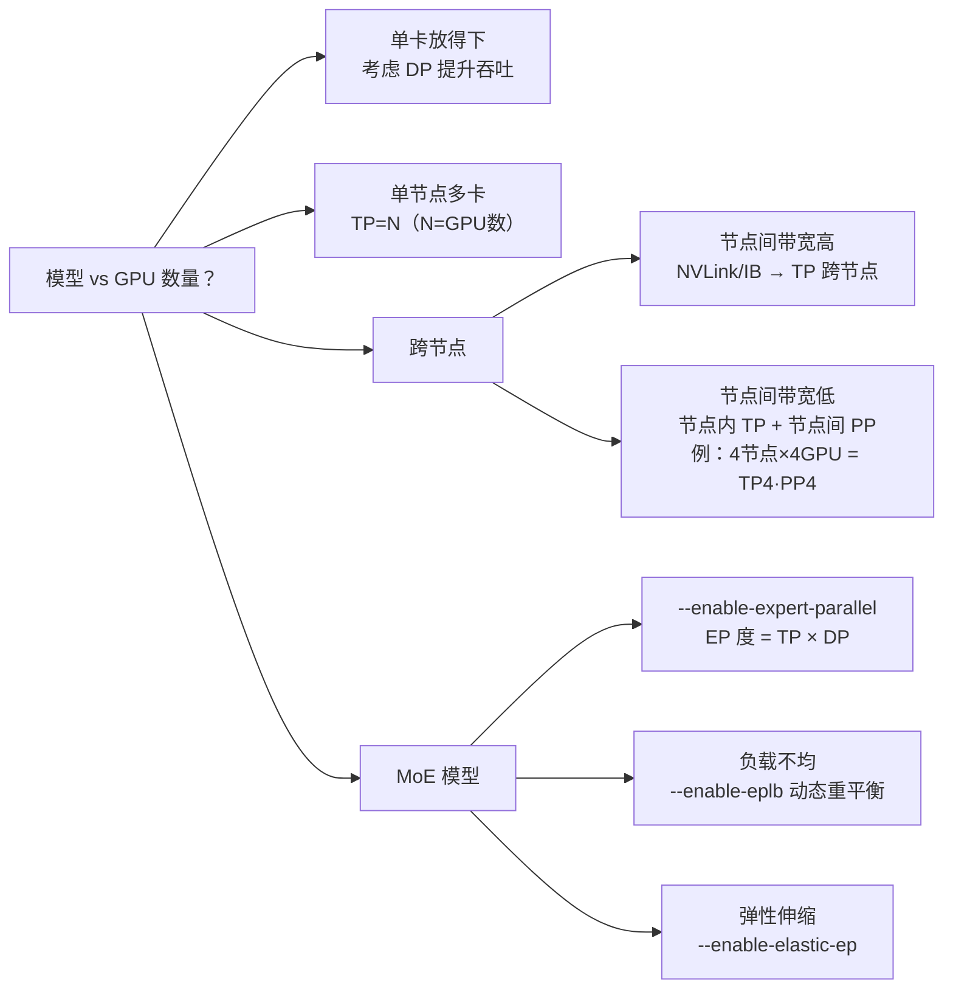

## 引子

部署大模型时，工程师面对的核心矛盾始终是：**显存不够用**和**推理速度不够快**。vLLM v0.20 在这两个维度上提供了系统性的工具箱——从 KV Cache 量化、PagedAttention、前缀缓存，到 CUDA Graph、torch.compile 融合、投机解码，每一层都有可调旋钮。

本文基于 vLLM v0.20 源码，系统梳理各项优化手段、原理与 CLI 用法，帮助工程师快速找到适合自己场景的调优路径。

---

## 一、KV Cache 优化

### 1.1 PagedAttention（分页注意力）

vLLM 的核心显存机制。KV Cache 被切分为固定大小的物理块（类比 OS 虚拟内存分页），按需分配，无需预留完整 `max_model_len` 的连续显存。

| 参数 | 默认值 | 位置 | 说明 |
|------|--------|------|------|
| `block_size` | `16` | `config/cache.py:45` | 每块含 token 数；越大内部碎片越多，越小管理开销越高 |
| `num_gpu_blocks` | 自动计算 | `config/cache.py:143` | GPU 物理块数量，profiling 后自动设定 |

**内部实现**（`v1/core/block_pool.py`）：
- 所有块预分配为 `KVCacheBlock`，用 `FreeKVCacheBlockQueue`（双向链表）管理
- **LRU 淘汰**：释放的块加入队尾（最近使用），分配时从队首取（最久未用）
- Block 0 保留为 null_block 占位符

### 1.2 Prefix Caching（前缀缓存）

相同 prompt 前缀的 KV Cache 可被多请求复用，跳过重复计算。v0.20 **默认开启**。

| 参数 | 默认值 | 说明 |
|------|--------|------|
| `enable_prefix_caching` | `True` | 默认开启 |
| `prefix_caching_hash_algo` | `"sha256"` | 哈希算法：`sha256` / `xxhash` / `*_cbor` |

**命中机制**（`block_pool.py:184-320`）：
- 每个物理块按 `(parent_hash, token_ids, extra_keys)` **链式哈希**
- `BlockHashToBlockMap` 维护 `hash → block` 映射
- 全部 KV group 命中 → 跳过计算直接复用；否则从头计算
- 淘汰时自动从哈希表移除

**最适合的场景**：长 System Prompt 多请求共享、RAG 同文档上下文、多轮对话共享历史。

### 1.3 KV Cache 量化

降低 KV Cache 精度，理论节省 **50%–81%** 显存。

| `cache_dtype` | 精度 | 显存节省 | 说明 |
|---------------|------|----------|------|
| `"auto"` | 跟随模型 dtype | 0% | 默认 |
| `"fp8"` / `"fp8_e4m3"` | 8-bit | ~50% | 最成熟，**推荐首选** |
| `"fp8_e5m2"` | 8-bit | ~50% | 更大动态范围，精度略低 |
| `"turboquant_k8v4"` | K:8-bit V:4-bit | ~62% | TurboQuant 混合精度 |
| `"turboquant_4bit_nc"` | 4-bit | ~75% | 4-bit 非连续布局 |
| `"turboquant_3bit_nc"` | 3-bit | ~81% | 极致压缩，精度损失较大 |
| `"nvfp4"` | 4-bit FP | ~75% | NVIDIA FP4（需 FlashInfer） |
| `"fp8_ds_mla"` | 8-bit | ~50% | DeepSeek MLA 专用 |

`kv_cache_dtype_skip_layers` 可跳过特定层的量化（如滑动窗口层）以减少精度损失。

```bash
# FP8 KV Cache（推荐起点）
vllm serve <model> --kv-cache-dtype fp8

# 跳过第 0、1 层的量化
vllm serve <model> --kv-cache-dtype fp8 --kv-cache-dtype-skip-layers 0 1
```

### 1.4 KV Cache 卸载到 CPU

将部分 KV Cache 从 GPU 卸载到 CPU 内存，扩展有效上下文容量。

**两种后端对比：**



```bash
# 启用 8 GiB CPU KV Cache 卸载
vllm serve <model> --kv-offloading-size 8
```

---

## 二、量化方案

### 2.1 支持的量化方法（28+ 种）

| 方法 | 精度 | 推荐场景 | 说明 |
|------|------|----------|------|
| **`fp8`** | W8A8 | **推荐首选** | FP8 E4M3，Hopper+ 原生支持 |
| **`awq_marlin`** | W4A16 | Ampere/Ada AWQ | AWQ + Marlin 加速内核 |
| **`gptq_marlin`** | W4A16 | Ampere/Ada GPTQ | 最快的 GPTQ 推理内核 |
| `modelopt_fp4` | W4 FP4 | Blackwell GPU | NVIDIA NV-FP4 |
| `bitsandbytes` | W4/W8 | 便捷量化 | HF BitsAndBytes 兼容 |
| `gguf` | 多种 | llama.cpp 生态 | 直接加载 GGUF 格式 |
| `fp8_per_tensor` | W8A8 | 无预量化模型 | 运行时动态 FP8 在线量化 |
| `experts_int8` / `moe_wna16` | 混合 | MoE 专用 | 专家层独立量化 |

### 2.2 量化方案选择树



```bash
# FP8 权重 + FP8 KV Cache（显存节省最大化）
vllm serve <model> --quantization fp8 --kv-cache-dtype fp8

# AWQ 4-bit + Marlin 加速
vllm serve <model> --quantization awq_marlin
```

---

## 三、推理加速

### 3.1 CUDA Graph

预录制 GPU kernel 调用图，消除 CPU launch overhead。**decode 阶段加速 10–30%**。

| 模式 | 值 | 说明 | 适用场景 |
|------|-----|------|----------|
| `NONE` | 0 | 不使用 | 调试、LoRA 频繁切换 |
| `PIECEWISE` | 1 | 分段录制（注意力除外） | 通用 |
| `FULL` | 2 | 完整录制 | 最大加速 |
| **`FULL_AND_PIECEWISE`** | (2,1) | decode 用 FULL，prefill 用 PIECEWISE | **V1 默认，推荐** |
| `FULL_DECODE_ONLY` | (2,0) | 仅 decode 用 FULL | 保守选择 |

```bash
# 禁用（调试用）
vllm serve <model> --enforce-eager

# 显式指定模式
vllm serve <model> --compilation-config '{"cudagraph_mode": 2}'
```

### 3.2 torch.compile 融合 Pass

V1 引擎默认启用 vLLM 自定义编译后端，通过算子融合减少 kernel launch 次数：

| Pass | 融合操作 | 效果 |
|------|----------|------|
| `fuse_norm_quant` | RMSNorm + FP8 量化 | 减少 kernel |
| `fuse_act_quant` | SiluMul + FP8 量化 | 减少中间张量 |
| `fuse_attn_quant` | Attention/MLA + FP8 | 减少显存带宽 |
| `fuse_gemm_comms` | GEMM + TP AllReduce | 隐藏通信延迟 |
| `fuse_allreduce_rms` | AllReduce + RMSNorm | FlashInfer 加速 |
| `enable_sp` | 序列并行 | 减少通信量 |

### 3.3 Chunked Prefill（分块预填充）

将长 prompt 的 prefill 拆分为多个小块，与 decode 请求混合执行。v0.20 **默认开启**，**降低 TTFT，提升 GPU 利用率**。

| 参数 | 默认值 | 说明 |
|------|--------|------|
| `enable_chunked_prefill` | `True` | 默认开启 |
| `max_num_batched_tokens` | `2048` | 每步 token 预算（= chunk 上限） |
| `max_num_partial_prefills` | `1` | 最大并行 partial prefill 数 |



### 3.4 投机解码（Speculative Decoding）

用小模型快速生成候选 token，大模型一次性验证多个 token。**吞吐提升 1.5–3×**。

| 方法 | 配置 | 说明 |
|------|------|------|
| **EAGLE/EAGLE-3** | `--speculative-method eagle` | 最高接受率，需训练 draft head |
| **MTP** | `--speculative-method deepseek_mtp` | DeepSeek/Qwen3.5 内置 MTP head |
| **N-gram** | `--speculative-method ngram` | 无需额外模型，基于 prompt 统计 |
| **Medusa** | `--speculative-method medusa` | Medusa 多头 |
| **通用 Draft** | `--speculative-model <small_model>` | 任意小模型作为 draft |

```bash
# EAGLE 投机解码
vllm serve <model> \
  --speculative-model <eagle_head_path> \
  --speculative-method eagle \
  --num-speculative-tokens 5

# 零成本 N-gram 投机（无需额外模型）
vllm serve <model> \
  --speculative-method ngram \
  --num-speculative-tokens 5
```

### 3.5 FlashAttention 版本

| 版本 | GPU 架构 | 推荐 |
|------|----------|------|
| **FA2** | 所有 CUDA GPU | 通用回退 |
| **FA3** | Hopper SM90（H100） | 推荐在 H100 使用 |
| **FA4** | Blackwell SM100（B200） | 最新 |

自动选择，也可手动指定：
```bash
vllm serve <model> --attention-config '{"flash_attn_version": 3}'
```

---

## 四、显存管理

### 4.1 核心显存参数

| 参数 | 默认值 | CLI | 说明 |
|------|--------|-----|------|
| `gpu_memory_utilization` | **0.92** | `--gpu-memory-utilization` | GPU 显存使用比例 |
| `max_model_len` | 模型配置 | `--max-model-len` | 最大序列长度，直接影响 KV Cache 大小 |
| `max_num_seqs` | `128` | `--max-num-seqs` | 最大并发序列数 |
| `max_num_batched_tokens` | `2048` | `--max-num-batched-tokens` | 每步最大 token 数 |

### 4.2 显存计算公式

`v1/worker/gpu_worker.py:414-418`：

```
total_memory × gpu_memory_utilization
          ↓
  ┌───────┴────────────────────────────┐
  模型权重 + 激活峰值              KV Cache 可用空间
  + 非 torch 分配                  + CUDA Graph 开销
          ↓
available_kv_cache = requested_memory - non_kv_cache_memory - cudagraph_estimate
num_gpu_blocks = available_kv_cache ÷ kv_cache_block_size_bytes
```

### 4.3 显存调优策略

**OOM（显存不足）场景：**

```bash
--gpu-memory-utilization 0.85    # 留更多给 CUDA runtime
--max-model-len 4096             # 减小序列长度（KV Cache 线性缩减）
--max-num-seqs 32                # 减少并发
--kv-cache-dtype fp8             # KV Cache 节省 50%
--kv-offloading-size 4           # 4 GiB KV 卸载到 CPU
```

**吞吐不足场景：**

```bash
--gpu-memory-utilization 0.95    # 更多给 KV Cache
--max-num-seqs 256               # 增大并发
--max-num-batched-tokens 8192    # 增大 token 预算
--quantization fp8               # 压缩权重，腾出 KV Cache 空间
```

### 4.4 权重卸载

| 后端 | 配置 | 说明 |
|------|------|------|
| UVA | `cpu_offload_gb=<N>` | 部分权重放 CPU，GPU 通过 UVA 访问 |
| Prefetch | `offload_group_size=<N>` | 分层预取：提前加载下一层权重到 GPU |

---

## 五、分布式推理优化

### 5.1 并行策略选择树



| 策略 | 参数 | 通信开销 |
|------|------|----------|
| Tensor Parallel (TP) | `--tensor-parallel-size N` | 每层 AllReduce |
| Pipeline Parallel (PP) | `--pipeline-parallel-size N` | 仅层间传递 |
| Data Parallel (DP) | `--data-parallel-size N` | 每步 DP 同步 |
| Expert Parallel (EP) | `--enable-expert-parallel` | All-to-All |
| Context Parallel (CP) | `--prefill-context-parallel-size N` | Ring Attention |

### 5.2 通信优化

| 机制 | 说明 |
|------|------|
| **Custom AllReduce** | 单节点 2/4/6/8 GPU P2P 直连，绕过 NCCL |
| **Quick AllReduce** | INT4/6/8 量化归约，减少通信量 |
| **Async TP** (`fuse_gemm_comms`) | GEMM 与 AllReduce 重叠执行 |
| **Sequence Parallel** (`enable_sp`) | 在非 TP 维度分片，减少通信 |

### 5.3 EP 负载均衡（EPLB）

MoE 专家激活分布不均匀时，动态重平衡：

```bash
# DeepSeek V3 with EP + EPLB
vllm serve deepseek-ai/DeepSeek-V3 \
  --tensor-parallel-size 8 \
  --enable-expert-parallel \
  --enable-eplb \
  --eplb-config '{"num_redundant_experts": 16, "step_interval": 1000}'
```

策略：`balanced_packing`（贪心装箱）+ `replicate_experts`（热点专家复制）。

---

## 六、实战配置模板

### 小模型（7B）单卡

```bash
vllm serve <7B_model> \
  --max-model-len 8192 \
  --gpu-memory-utilization 0.92 \
  --max-num-seqs 128
```

### 中等模型（70B）4×GPU

```bash
vllm serve <70B_model> \
  --tensor-parallel-size 4 \
  --quantization fp8 \
  --kv-cache-dtype fp8 \
  --max-model-len 16384 \
  --gpu-memory-utilization 0.92 \
  --max-num-seqs 64
```

### 大型 MoE（DeepSeek V3）8×GPU

```bash
vllm serve deepseek-ai/DeepSeek-V3 \
  --tensor-parallel-size 8 \
  --enable-expert-parallel \
  --quantization fp8 \
  --kv-cache-dtype fp8 \
  --max-model-len 32768 \
  --gpu-memory-utilization 0.92
```

---

## 七、优化手段速查表

| 优化手段 | 显存节省 | 对精度 | 对速度 |
|----------|---------|--------|--------|
| FP8 权重量化 | ~50% 权重 | 极小（Hopper+） | 可能加速 |
| AWQ/GPTQ 4-bit | ~75% 权重 | 小 | Marlin 内核加速 |
| FP8 KV Cache | ~50% KV | 小 | 中性 |
| 4-bit KV Cache | ~75% KV | 中等 | 中性 |
| 减小 max_model_len | 线性减少 KV | 无 | 无 |
| KV 卸载到 CPU | 扩展容量 | 无 | 略增延迟 |
| Prefix Caching | 减少重复计算 | 无 | **加速**（缓存命中时） |
| CUDA Graph | 无 | 无 | +10–30%（decode） |
| 投机解码 | 无 | 无 | +1.5–3×（decode 吞吐） |
| Chunked Prefill | 无 | 无 | 降低 TTFT，提升利用率 |
| TP 增加 | 分摊权重 | 无 | 降低延迟（增加通信） |

---

## 八、调优检查清单

1. **CUDA Graph 已启用**：V1 默认启用 `FULL_AND_PIECEWISE`，避免 `--enforce-eager`
2. **Prefix Caching 已启用**：v0.20 默认开启，System Prompt 复用最有效
3. **Chunked Prefill 已启用**：v0.20 默认开启，保持即可
4. **KV Cache FP8 量化**：`--kv-cache-dtype fp8`，几乎零精度损失，节省 50%
5. **合理设置 max_model_len**：按实际最长上下文设，不要用模型默认的 128K
6. **Hopper+ 优先用 FP8 权重量化**：`fp8_per_tensor` 无需预量化模型
7. **MoE 模型开 EP + EPLB**：避免专家激活不均衡导致 GPU 利用率低
8. **监控 GPU 利用率**：`nvidia-smi dmon` 确认 GPU 不在等待 CPU/通信

---

*基于 vLLM v0.20 源码分析，2026-04-30*
