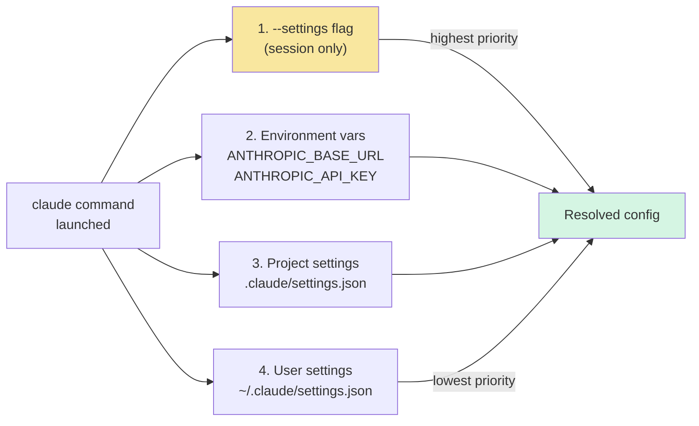

## TL;DR

**Claude Code CLI 支持任意 Anthropic Messages 协议兼容的网关**，只需要两个环境变量 `ANTHROPIC_BASE_URL` + `ANTHROPIC_API_KEY`，或者写到 `~/.claude/settings.json` 的 `env` 段里持久化。全程不需要 Anthropic 官方账号登录。本文覆盖四种配置方式、优先级顺序、多账号切换、以及几个常见坑。

> 配 **Claude Desktop App** 的第三方网关看 [这篇](/posts/claude-desktop-third-party-inference/)；本文专讲 CLI。

---

## 一、前置条件

- Claude Code CLI 已安装（`claude --version` 能跑通）
- 你的网关已启动并暴露了 **Anthropic `/v1/messages` 兼容接口**
- 拿到了网关颁发的 API Key（具体前缀以你的网关为准）

先用 curl 自测网关 5 秒验证：

```bash
curl -sX POST https://gateway.example.com/v1/messages \
  -H "content-type: application/json" \
  -H "anthropic-version: 2023-06-01" \
  -H "x-api-key: <YOUR_API_KEY>" \
  -d '{"model":"claude-sonnet-4-5-20250929",
       "max_tokens":20,
       "messages":[{"role":"user","content":"say OK"}]}'
```

期望返回 HTTP 200 + Anthropic 格式 JSON（有 `"id":"msg_..."` 和 `"content":[{"type":"text","text":"OK"}]` 字段）。如果 curl 都不通，先修网关，别折腾 CLI。

---

## 二、四种配置方式对比



| 方式 | 持久化 | 作用域 | 适用 |
|---|---|---|---|
| A. Shell env vars | ✅ | 整个用户 | 有多 shell 的老式配法 |
| B. `~/.claude/settings.json` `env` 段 | ✅ | 整个用户 | **推荐**，跨 shell 一致 |
| C. `<project>/.claude/settings.json` | ✅ | 单个项目 | 项目用不同网关或不同 key |
| D. `--settings` flag | ❌ | 单次 session | 临时切账号 / 灰度测试 |

---

## 三、方式 A：Shell 环境变量（最快上手）

在 `~/.zshrc` 或 `~/.bashrc` 末尾加：

```bash
export ANTHROPIC_BASE_URL="https://gateway.example.com"
export ANTHROPIC_API_KEY="<YOUR_API_KEY>"
```

然后 `source ~/.zshrc` 或新开终端即可。

**注意**：如果网关用 Bearer 认证而不是 `x-api-key`，Claude Code CLI 当前版本**只用 `x-api-key` header**发送 `ANTHROPIC_API_KEY`。Bearer 认证的网关需要在网关侧兼容 `x-api-key`，或者用下面 D 方法的 `apiKeyHelper` 方案。

---

## 四、方式 B：全局 `~/.claude/settings.json`（推荐）

CLI 本身默认读这个文件。直接写 `env` 段比 shell 变量更稳（跨 shell、不受 `env | grep ANTHROPIC` 命令污染）：

```json
{
  "env": {
    "ANTHROPIC_BASE_URL": "https://gateway.example.com",
    "ANTHROPIC_API_KEY": "<YOUR_API_KEY>",
    "CLAUDE_CODE_DISABLE_EXPERIMENTAL_BETAS": "1"
  }
}
```

第三行**建议开启**：很多自建网关还不支持 Anthropic 的新 beta header（如 `prompt-caching-2024-07-31`、`context-1m-2025-08-07`），关掉能避免网关 422。

启动 `claude` 时会自动加载。验证：

```bash
claude doctor
```

输出里会显示当前使用的 Base URL。

---

## 五、方式 C：项目级 `.claude/settings.json`

如果你在一个 git 项目里想**单独用另一个网关**（比如公司项目用内网网关，开源项目用公网），在项目根目录建 `.claude/settings.json`：

```json
{
  "env": {
    "ANTHROPIC_BASE_URL": "http://127.0.0.1:18966",
    "ANTHROPIC_API_KEY": "<YOUR_API_KEY>"
  }
}
```

**⚠️ 记得把 `.claude/settings.json` 加入 `.gitignore`**，避免 key 提交到仓库。或者用下一节的 `apiKeyHelper` 避开硬编码。

项目配置优先级高于全局，进入此目录运行 `claude` 时就自动切换。

---

## 六、方式 D：`--settings` flag（临时切换）

不改任何持久化文件，单次 session 临时指定：

```bash
claude --settings '{"env":{"ANTHROPIC_BASE_URL":"https://gw2.example.com","ANTHROPIC_API_KEY":"<YOUR_API_KEY>"}}'
```

或者指向一个文件：

```bash
claude --settings ~/.config/claude/backup-gateway.json
```

这个方式特别适合**多账号快速切换**。比如我平时维护三份 settings 文件：

```
~/.config/claude/
├── work.json       # 公司网关
├── personal.json   # 个人自建代理
└── openrouter.json # OpenRouter
```

需要切换就 `claude --settings ~/.config/claude/work.json`，不需要 `unset` 环境变量来回折腾。

### 6.1 进阶：`apiKeyHelper` 动态 key

如果 key 要定期轮转（比如从 Vault / 1Password 拉），用 helper 脚本：

```json
{
  "env": {
    "ANTHROPIC_BASE_URL": "https://gateway.example.com"
  },
  "apiKeyHelper": "/usr/local/bin/get-claude-key.sh"
}
```

`get-claude-key.sh` 要做的只是**输出当前有效的 key 到 stdout**：

```bash
#!/usr/bin/env bash
op read "op://Private/claude-gateway/credential"
# 或 aws secretsmanager get-secret-value --secret-id claude-key --query SecretString --output text
```

这样 key 不出现在任何配置文件里，定期轮转也无感。

---

## 七、验证连通

### 7.1 `claude doctor`

```bash
claude doctor
```

输出示例（关键几行）：

```
Authentication: API Key (from settings.json env)
Base URL: https://gateway.example.com
Model (default): claude-sonnet-4-6
```

### 7.2 跑一个最小会话

```bash
claude -p --model sonnet "reply with only: OK"
```

`-p` 走打印模式不进交互；如果输出 `OK`，链路通了。

### 7.3 Debug 模式看真实请求

```bash
claude --debug api "reply with: OK"
```

会打印每一次 HTTP 请求的 method / URL / status / duration，可以确认目的地真的是你的网关而不是 `api.anthropic.com`。

---

## 八、模型选择

Claude Code CLI 模型可以按优先级来自：

1. `--model <name>` 命令行（最高）
2. `ANTHROPIC_MODEL` 环境变量
3. `settings.json` 的 `model` 字段
4. 内置默认（通常是 sonnet 的最新版）

别名 vs 全名：

```bash
claude --model sonnet        # → 最新 sonnet
claude --model opus          # → 最新 opus
claude --model haiku         # → 最新 haiku
claude --model claude-opus-4-1-20250805   # 精确 id
claude --model claude-sonnet-4-6          # 半短名（网关 Mappings 里能认即可）
```

如果你的网关 Mappings 里没有某个别名，CLI 发出去会被网关返回 `model_not_found`。查网关管理页的 `/v1/models` 列表确认。

---

## 九、常见坑

### 坑 1：`Error: Invalid API key`

```bash
claude: Error: Invalid API key provided
```

三种原因，按出现频率：
1. `ANTHROPIC_API_KEY` 里有 trailing newline（`echo "sk-..." >> key` 这类写法会带）
2. 网关用的 `Authorization: Bearer` 而不是 `x-api-key`，CLI 当前版本只发 `x-api-key`
3. 网关 key 过期 / 被轮转了

排查：

```bash
curl -sI -X POST "$ANTHROPIC_BASE_URL/v1/messages" \
  -H "x-api-key: $ANTHROPIC_API_KEY" \
  -H "anthropic-version: 2023-06-01" \
  -H "content-type: application/json" \
  --data '{"model":"claude-sonnet-4-5-20250929","max_tokens":1,"messages":[{"role":"user","content":"x"}]}'
```

HTTP 200 → 网关 OK，问题在 CLI 侧；其他 → 问题在网关。

### 坑 2：`Error: ECONNREFUSED 127.0.0.1:18966`

网关没启动。如果是本地 BlueRouter 之类的代理，`pgrep -lf bluecode-proxy` 检查进程是否在。

### 坑 3：SSE 流式响应卡住 / 半截

症状：CLI 显示一半就挂住，不报错也不继续。

几乎都是**网关或中间的 HTTP/反向代理做了 response buffering**，导致 SSE `event:` 分帧没 flush 到客户端。检查：
- nginx：`proxy_buffering off;` `proxy_cache off;` `proxy_read_timeout 600s;`
- Cloudflare：开 "Disable Performance" 或关闭对应域名的 rocket loader
- 自写代理：确保对 `text/event-stream` 类型用 `http.Flusher.Flush()` 刷每一帧

### 坑 4：`CLAUDE_CODE_DISABLE_EXPERIMENTAL_BETAS=1` 到底关了什么

Claude Code 会按场景自动带 `anthropic-beta: xxx` header 启用 prompt caching、interleaved-thinking、1M context 等 beta 功能。自建网关上游如果是 Bedrock / 内部代理，**经常不兼容这些 beta header**，会 422。

```
{"error": {"type": "invalid_request_error",
  "message": "unknown beta: context-1m-2025-08-07"}}
```

把环境变量设为 `1` 就不发 beta header，损失是：1h prompt cache 会降级成 5m，interleaved thinking 关掉，1M 上下文变回默认。日常使用多数无感。

### 坑 5：切换了 key 但还是老行为

Claude Code 有 **macOS Keychain + OAuth 缓存**。设了 `ANTHROPIC_API_KEY` 但还在走老账号，是因为 OAuth token 还在。两种办法：

```bash
# 方法 1：用 --bare flag 强制只读 ANTHROPIC_API_KEY
claude --bare -p "hello"

# 方法 2：显式登出再设 key
claude auth logout
```

`--bare` 这个 flag 官方描述是 "strict key-auth mode"：不读 keychain、不走 OAuth、不拉 plugin、跳过 CLAUDE.md 自动发现，适合 CI 或排查环境。

---

## 十、多账号快速切换小技巧

个人日常用到的 shell 函数（放在 `~/.zshrc`）：

```bash
# 用法：cc <alias>
# 预置：~/.config/claude/{work,personal,openrouter}.json
cc() {
  local profile="${1:-personal}"
  local f="$HOME/.config/claude/$profile.json"
  [[ -f "$f" ]] \|\| { echo "no profile: $profile"; return 1; }
  shift
  claude --settings "$f" "$@"
}
```

用起来：

```bash
cc work                          # 进公司账号交互
cc personal -p "fix this bug"    # 个人账号打印模式
cc openrouter --model opus       # 试试别家 opus
```

---

## 十一、配置文件相关路径一览

```
~/.claude/settings.json              # 全局用户配置
~/.claude/settings.local.json        # 本机覆盖（不提交）
<project>/.claude/settings.json      # 项目级
<project>/.claude/settings.local.json  # 本机 × 项目覆盖（不提交）
~/.claude/projects/<slug>/memory/    # 对话记忆（不是配置）
```

**敏感信息建议放 `*.local.json`**，所有 `*.local.json` 默认被 Claude Code 当成不共享的，可以配合 `.gitignore` 双保险。

---

## 参考

### 官方文档

- [Claude Code settings reference](https://docs.claude.com/en/docs/claude-code/settings) — 官方完整 settings.json schema
- [Claude Code CLI flags](https://docs.claude.com/en/docs/claude-code/cli-reference) — 所有命令行参数
- [Amazon Bedrock with Claude Code](https://docs.claude.com/en/docs/claude-code/amazon-bedrock) — Bedrock 原生模式
- [Google Vertex AI with Claude Code](https://docs.claude.com/en/docs/claude-code/google-vertex-ai) — Vertex 原生模式

### 相关文章

- [Claude Desktop for Mac 配置第三方 API Key 和 Base URL 完整指南](/posts/claude-desktop-third-party-inference/)

### 调试命令速查

```bash
claude --version                  # 查当前版本
claude doctor                     # 连通性 + 认证状态
claude --debug api -p "hi"        # 看每次 HTTP 请求
claude --bare -p "hi"             # 最小化环境排查
claude auth logout                # 清空 OAuth token
```

---

**本文基于 Claude Code CLI 2.1.119 实测整理。**
