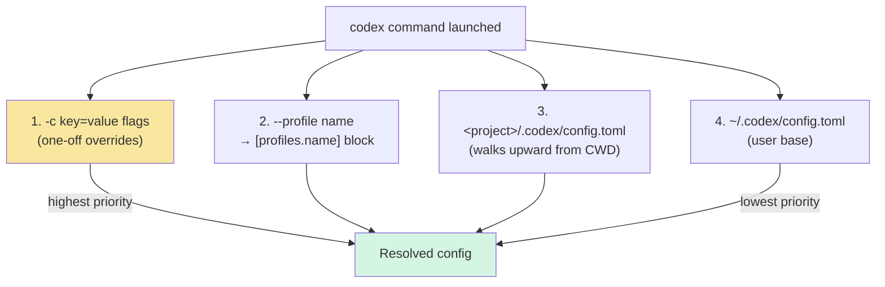

## TL;DR

**OpenAI Codex CLI + Codex 桌面 App 都支持任意 OpenAI Responses API 兼容的网关**，通过 `~/.codex/config.toml` 的 `[model_providers.<id>]` 自定义即可。最简场景只改一行 `openai_base_url` 就能把 built-in openai provider 指向代理；复杂场景可以自定义多个 provider、env header、命令式动态 token、profile 多账号切换。

> 配 **Claude Code CLI** 看 [这篇](/posts/claude-code-cli-third-party-gateway/)；**Claude Desktop App** 看 [这篇](/posts/claude-desktop-third-party-inference/)。本文覆盖 Codex CLI 和 Codex App。

### App 与 CLI 共享配置（反编译验证）

和 Claude Desktop 有独立 "Configure Third-Party Inference" 窗口不同，**Codex 桌面 App 没有自己的 provider 配置 GUI** —— 它直接读 CLI 的 `~/.codex/config.toml`。

反编译 `Codex.app/Contents/Resources/app.asar` 能看到路径解析和 CLI 完全一致：

```js
// 来自 app.asar：Codex 桌面 App 解析 config 目录的逻辑
function Am(e) {
  let t = e ?? (typeof process < "u" ? {} : void 0);
  return t?.CODEX_HOME && t.CODEX_HOME.length > 0
    ? normalize(t.CODEX_HOME)
    : t?.HOME && t.HOME.length > 0
      ? normalize(join(t.HOME, ".codex"))
      : "/.codex";
}
```

且 App 内部初始化 provider 用的是同一套 `model_providers.<id>.{name, base_url, experimental_bearer_token, wire_api}` schema。所以**本文所有配置对 App 和 CLI 都通用**，唯一差别是：

- **CLI 用户**：直接编辑 `~/.codex/config.toml`，或用 `-c key=value` 一次性覆盖
- **App 用户**：同样编辑 `~/.codex/config.toml`，然后重启 App。`-c` CLI flag 在 `codex app` 启动时也支持，会透传给 App

---

## 零、官方文档速查

动手之前先把官方给的两条路径和 schema 关键字段过一遍，后面每一节都是围绕这些展开的。详细说明请看 [Config Advanced](https://developers.openai.com/codex/config-advanced) 和 [Configuration Reference](https://developers.openai.com/codex/config-reference)。

### 第三方 gateway — 官方给的两条路径

**路径 1：只换 URL**（[docs 推荐最简方案](https://developers.openai.com/codex/config-advanced#config-and-state-locations)）

> *"If you just need to point the built-in OpenAI provider at an LLM proxy, router, or data-residency enabled project, set `openai_base_url` in `config.toml` instead of defining a new provider."*

```toml
openai_base_url = "https://us.api.openai.com/v1"
```

对应本文[方式 A](#三方式-a只改-built-in-openai-provider-的-base-url最简)。

**路径 2：自建 `[model_providers.<id>]`**（[docs: Custom model providers](https://developers.openai.com/codex/config-advanced#custom-model-providers)）

```toml
model = "gpt-5.4"
model_provider = "proxy"

[model_providers.proxy]
name = "OpenAI using LLM proxy"
base_url = "http://proxy.example.com"
env_key = "OPENAI_API_KEY"
```

对应本文[方式 B](#四方式-b自定义-model_providersid完整方案)。Header / query / 动态 token 扩展见[方式 C](#五方式-c自定义-http-headers) / [方式 D](#六方式-d命令式动态-token高阶)。

### 第三方模型 — 两种常用落地

1. **任意 OpenAI 兼容后端**：自建 provider + `base_url` + `env_key`（DeepSeek、Moonshot、阿里百炼、第三方聚合网关等都落这类）
2. **本地 Ollama / LM Studio**：保留 ID `ollama` / `lmstudio`，或用 `--oss` 模式 + 顶层 `oss_provider = "ollama"` 做默认

### Schema 关键字段（[完整清单](https://developers.openai.com/codex/config-reference#model-providersid)）

| 字段 | 默认值 | 说明 |
|---|---|---|
| `wire_api` | `"responses"` | 目前唯一支持的值，**可省略** |
| `request_max_retries` | `4` | HTTP 请求重试次数 |
| `stream_max_retries` | `5` | SSE 流中断重试次数 |
| `stream_idle_timeout_ms` | `300000` | SSE 空闲超时（5 min）|
| `supports_websockets` | `false` | Responses API WebSocket 传输，默认关，一般不用显式写 |
| `requires_openai_auth` | `false` | 用 ChatGPT OAuth token 作 bearer，与 `env_key` / `auth.command` 互斥 |

**保留 provider ID 有四个**：`openai`、`ollama`、`lmstudio`、`amazon-bedrock`，自建 provider 不能重名。

---

## 一、重要前置：你的网关必须支持 Responses API

这是 Codex 和 Claude Code 最大的差异点：

| CLI | 要求网关支持的协议 |
|---|---|
| Claude Code | Anthropic `/v1/messages` |
| **Codex** | **OpenAI `/v1/responses` (Responses API)** |

Codex 的 `wire_api` 字段默认就是 `responses`，也是[官方 schema](https://developers.openai.com/codex/config-reference#model-providersidwire_api) 目前**唯一支持的值**（早期版本有过 `chat` 分支，已移除），不支持 Chat Completions (`/v1/chat/completions`)。很多自建网关（如 one-api、LiteLLM 某些版本、OpenRouter 旧版）**默认只开 Chat Completions**，需要你：
- 确认网关版本支持 Responses API，或
- 在网关前加转换层（较新版 LiteLLM 支持 `/v1/responses` 适配），或
- 升级网关

先用 curl 验证你的网关（`/v1/responses` 这个路径必须通）：

```bash
curl -sN -X POST https://gateway.example.com/v1/responses \
  -H "Authorization: Bearer <YOUR_API_KEY>" \
  -H "content-type: application/json" \
  -d '{
    "model": "gpt-5.4",
    "input": "say OK"
  }' | head -20
```

返回含 `"type":"response.output_text.delta"` / `"type":"response.completed"` 就说明网关 OK。如果返回 `"message":"This endpoint is not supported"` 之类，就是不支持。

---

## 二、配置文件层级



关键点：
- **项目级 `.codex/config.toml`** 只在 "trusted" 项目里生效（Codex 有信任列表机制，防止恶意 repo 提 PR 偷改配置）
- **`-c key=value`** 的 value 会按 TOML 解析（字符串要自己加引号），不是 JSON
- **`CODEX_HOME`** 环境变量可以换掉 `~/.codex` 整个目录，适合 CI

---

## 三、方式 A：只改 built-in openai provider 的 Base URL（最简）

如果你的网关就是个 OpenAI Responses API 的转发层，用默认 provider，只改 URL：

```toml
# ~/.codex/config.toml
openai_base_url = "https://gateway.example.com/v1"
```

API key 仍走标准 env var `OPENAI_API_KEY`：

```bash
export OPENAI_API_KEY="<YOUR_API_KEY>"
codex "hello"
```

**适用**：单个代理、对所有 OpenAI 请求统一加 URL prefix、数据驻留项目。

**不适用**：同时用多个 provider、每个 provider 不同 key / header、需要动态 token。

> 官方文档原话：*"If you just need to point the built-in OpenAI provider at an LLM proxy, router, or data-residency enabled project, set `openai_base_url` in config.toml instead of defining a new provider."*

---

## 四、方式 B：自定义 `[model_providers.<id>]`（完整方案）

下面是我自己正在用的真实配置（本地起了个 BlueRouter 网关在 `127.0.0.1:18966`，后面所有 Codex 请求都走它）：

```toml
# ~/.codex/config.toml
model = "gpt-5.5"
model_reasoning_effort = "medium"
profile = "bluerouter"                  # 顶层 profile：默认启用下面的 [profiles.bluerouter]

[model_providers.bluerouter]
name = "BlueRouter"
base_url = "http://127.0.0.1:18966/v1"
env_key = "BLUEROUTER_API_KEY"          # 从环境变量读 key
wire_api = "responses"                  # 目前只能是 responses
request_max_retries = 2
stream_idle_timeout_ms = 300000
supports_websockets = false
notification_condition = "always"
```

Shell 里 `export BLUEROUTER_API_KEY=...`，`codex` 启动时就会带上 `Authorization: Bearer $BLUEROUTER_API_KEY` 并把所有请求打到 `127.0.0.1:18966/v1/responses`。

> macOS 下要额外注意：Codex App 是 GUI 进程，可能拿不到你 shell 里的临时 `export`。如果 App 侧出现 `401 invalid api key`，可把变量注入到 launchd 会话环境：
>
> ```bash
> launchctl setenv BLUEROUTER_API_KEY "$BLUEROUTER_API_KEY"
> # 可选：如果你临时走 built-in openai provider，也同步一份
> launchctl setenv OPENAI_API_KEY "$BLUEROUTER_API_KEY"
> ```

几个这份配置里值得单独说的字段：

- `supports_websockets = false`：本地简易网关通常不实现 WebSocket，显式关掉，省得 Codex 尝试升级协议后报错。
- `notification_condition = "always"`：配合 `notify` 钩子，每一轮 turn 结束都触发桌面通知，对 `approval_policy = "never"` 的长跑任务特别有用。
- `request_max_retries = 2`：本地网关重试 4 次没意义，失败就失败，降到 2 减少调试时的噪声。

**为什么推荐用 `env_key` 而不是 `experimental_bearer_token`**：后者把 key 硬编码在 config 里，config 有机会被 backup / 同步 / 共享，泄露风险高。官方文档也明确标 `experimental_bearer_token` 为 *"discouraged; use env_key"*。

---

## 五、方式 C：自定义 HTTP Headers

有些企业网关需要额外的 `X-Organization-Id` / `X-Project-Id` / 自己的 `X-Api-Key` 等 header。有两种写法：

### 静态 header（固定值）

```toml
[model_providers.proxy]
base_url = "https://gateway.example.com/v1"
env_key = "PROXY_API_KEY"
http_headers = { "X-Organization-Id" = "org_xxx", "X-Project-Id" = "proj_yyy" }
```

### 环境变量驱动的 header（动态值）

```toml
[model_providers.proxy]
base_url = "https://gateway.example.com/v1"
env_key = "PROXY_API_KEY"
env_http_headers = { "X-User-Id" = "CODEX_USER_ID", "X-Session-Id" = "CODEX_SESSION_ID" }
```

运行时会查找对应 env var 的值填进 header。env var 不存在就不发这个 header（不是发空字符串，是整个 header 省略）。

---

## 六、方式 D：命令式动态 token（高阶）

适合 key 频繁轮转的场景（1Password / Vault / AWS Secrets Manager / 内部 SSO exchange）：

```toml
[model_providers.proxy]
name = "My LLM Proxy"
base_url = "https://gateway.example.com/v1"
wire_api = "responses"

[model_providers.proxy.auth]
command = "/usr/local/bin/fetch-codex-token"
args = ["--audience", "codex"]
timeout_ms = 5000
refresh_interval_ms = 300000       # 5 min 主动刷新；设 0 则只在 401 后刷新
```

`fetch-codex-token` 脚本只需要**把当前 token 打到 stdout**：

```bash
#!/usr/bin/env bash
# 示例：从 1Password 拉
op read "op://Private/codex-gateway/credential"

# 示例：从 AWS Secrets Manager 拉
# aws secretsmanager get-secret-value \
#   --secret-id codex-gateway-token \
#   --query SecretString --output text
```

**注意**：`auth.command` 不能和 `env_key` / `experimental_bearer_token` / `requires_openai_auth` 同时使用，互斥。

---

## 七、`shell_environment_policy`：让 sandbox 里的命令也能看到你的 API key

这是一个**很容易被忽略、但配错 100% 中招**的配置。`env_key = "BLUEROUTER_API_KEY"` 读的是 **Codex 进程自己**的环境变量；但当 Codex 执行 shell 工具（比如你让它跑 `curl`、`claude`、`git` 或任何 bash 命令）时，**子进程能看到哪些 env var** 由 `[shell_environment_policy]` 决定，默认策略相当严格。

我的实际配置：

```toml
[shell_environment_policy]
inherit = "core"                 # 只继承 PATH / HOME / USER / LANG 等核心变量
include_only = [
    "BLUEROUTER_API_KEY",        # Codex 自己要 + 子进程里跑的工具也要
    "ANTHROPIC_API_KEY",         # 子进程里调 Claude Code CLI 时要
    "ANTHROPIC_BASE_URL",
    "OPENAI_API_KEY",
]

[shell_environment_policy.set]
# 直接在 config 里写死 —— 等价于为每个子进程预置 export
ANTHROPIC_API_KEY = "sk-bp-xxxxxxxxxxxxxxxxxxxxxxxx"
ANTHROPIC_BASE_URL = "http://127.0.0.1:18966"
CLAUDE_CODE_DISABLE_EXPERIMENTAL_BETAS = "1"
hasCompletedOnboarding = "true"
```

几条规则记牢：

| 字段 | 含义 |
|---|---|
| `inherit` | 从哪个基准拿变量。`all` 全继承、`core` 只继承核心、`none` 全不继承 |
| `include_only` | 白名单：只有列在这里的变量会被透传到子进程 |
| `exclude` | 黑名单：列在这里的变量会被剔除（和 `include_only` 互斥使用） |
| `set` | 直接在 config 里设置固定值，优先级高于继承 |

⚠️ 把 key 写进 `[shell_environment_policy.set]` 等于**把明文 key 硬编码进 config.toml** —— 和 `experimental_bearer_token` 一样有泄漏风险。如果你的 config 会被 git / 同步，请只在 `include_only` 里列名字，让 shell 的 `export` 来提供实际值，不要走 `set`。

---

## 八、多账号：Profiles

给不同网关起不同名字，用 `--profile` 切换。我本机的 profile 就只定义了一个 `bluerouter`，但把它设为顶层默认：

```toml
# ~/.codex/config.toml
model = "gpt-5.5"                 # 顶层兜底
profile = "bluerouter"            # 顶层默认 profile，不传 --profile 时也用这个

[profiles.bluerouter]
approval_policy = "never"
model = "gpt-5.4"                 # profile 内覆盖顶层
model_provider = "bluerouter"     # 绑定到上面定义的 [model_providers.bluerouter]
model_reasoning_effort = "medium"

# profile 还可以嵌套 features 子表，按 profile 打开/关闭功能
[profiles.bluerouter.features]
external_migration = false
memories = false
prevent_idle_sleep = false
terminal_resize_reflow = true
```

想再加一个「官方账号 + 高推理强度」的 profile 做对照：

```toml
[profiles.official]
model_provider = "openai"
model = "gpt-5-pro"
model_reasoning_effort = "high"
approval_policy = "on-request"
```

用：

```bash
codex "use default"             # 不指定 profile 就用顶层 profile = "bluerouter"
codex --profile official "..."  # 临时切回官方账号
```

关键点：`[profiles.X.features]` 是 **profile 级 feature flag**，和顶层 `[features]` 合并，profile 的值优先。比如全局开了 `memories = true`，但某个 profile 里 `memories = false`，进这个 profile 就自动关掉记忆。

---

## 八-bis、配置文件作用域 & 官方/第三方切换

在官方和第三方网关之间来回切的时候，踩坑大多不是"怎么配"，而是"切回来没切干净"。先看清每个配置文件各管什么，再挑合适的切换方式。

### 1. 每个文件 / 字段的作用域

| 文件 / 字段 | 管什么 | 切网关时是否要动 |
|---|---|---|
| `~/.codex/auth.json` | 认证：`auth_mode`（`chatgpt` OAuth 或 `apikey`）、缓存 token、`last_refresh` | 通常不用动，ChatGPT OAuth 登录后一直有效 |
| `config.toml` 顶层 `openai_base_url` | 改 built-in `openai` provider 的 URL | 方式 A 才用，切回官方要删掉 |
| `config.toml` `[model_providers.<id>]` | 新建一个独立 provider | 方式 B 用，切回官方不用删，留着不影响 |
| `config.toml` 顶层 `model_provider` / `profile` | 当前默认走哪个 provider / profile | 切换时真正要动的就是这两行 |
| `config.toml` `[shell_environment_policy]` | 子进程能看到哪些 env var | 跟 provider 无关，配一次基本不再动 |

简单记：**`auth.json` 管你是谁，`config.toml` 管请求打去哪里、带什么 key**。大多数场景切回官方只要改 config.toml 的默认指针，`auth.json` 不用动。

### 2. 方式 A 和方式 B 在"切回来"这件事上差很多

**方式 A（`openai_base_url` + `OPENAI_API_KEY`）**：一行搞定，但你改的是 built-in `openai` 本身。切回官方必须把 `openai_base_url` 从 config 里删掉，可能还要把 `OPENAI_API_KEY` 从代理 key 改回官方 key。两套配置没法共存。

**方式 B（自建 `[model_providers.bluerouter]` + `[profiles.bluerouter]`）**：新 provider 独立存在，built-in `openai` 不受影响。切回官方只改顶层 `profile`，或者 `-c model_provider="openai"` 跑一次都行。两套配置可以长期放在同一份 config 里。

一句话：只试一下某个网关就删，方式 A 够了；要长期来回切，直接上方式 B。

### 3. 三种切法怎么选

**Profile 切换** —— 首选

```bash
codex --profile bluerouter "..."
codex --profile official "..."
```

两边都稳定了之后的日常切换用这个，不改任何文件。

**`-c` 一次性覆盖** —— 临时

```bash
codex -c 'model_provider="openai"' "just this one turn"
```

只想这一次走别的 provider，不想写 profile，也不想改文件。

**文件级备份替换** —— 兜底

方式 A 配乱了想回滚，或者改出一份不知道坏在哪的 config 想回到已知好的快照，才用这个。日常切换不用这个方式。

要存 bak 的话，起个能看懂的名字：

```bash
# 看得懂
config.toml.bluecode_20260509-112045
config.toml.official_20260324-101200

# 半年后自己都猜不出
config.toml.bak
config.toml.bak-1778125474
```

写成 shell 函数省事：

```bash
codex-snap() { cp -p ~/.codex/config.toml ~/.codex/config.toml.${1:-snap}_$(date +%Y%m%d-%H%M%S); }
codex-snap bluecode    # → config.toml.bluecode_20260509-112045
```

### 4. 几个常见踩法

- 切回官方时去 `codex login`。其实 `auth.json` 里的 OAuth token 一直有效，问题在 `config.toml` 指针。
- 方式 A 下 `OPENAI_API_KEY` 被换成代理 key，切回官方忘了改回来，下次跑直接 401（见坑 2.1）。
- 顶层默认写死 `profile = "bluerouter"`，以为 `--profile official` 能盖住就行。能盖住，但忘了带 `--profile` 就默默走回第三方。建议顶层不设 `profile`，每次显式传，或者在 shell 里准备两个 alias。

---

## 九、单次一次性覆盖：`-c/--config`

临时拿别的网关或别的 key 跑一次，不想写 profile：

```bash
# 换个 base_url 跑
codex -c 'model_providers.tmp.base_url="https://other.example.com/v1"' \
      -c 'model_providers.tmp.env_key="TMP_API_KEY"' \
      -c 'model_provider="tmp"' \
      "hello"

# 只换模型
codex --model gpt-5.4

# 嵌套键
codex -c 'mcp_servers.context7.enabled=false'

# 布尔
codex -c 'sandbox_workspace_write.network_access=true'
```

⚠️ `-c` 的 value 是 **TOML**，不是 JSON。字符串要**显式加引号**，否则会被当成普通 string，可能不是你想要的。

---

## 十、验证连通

```bash
codex login status           # 看当前认证来源
codex --model gpt-5.4 exec "reply with only: OK"   # 非交互跑一次
```

看完整请求链路，开 TRACE 日志（Codex 用 `RUST_LOG`）：

```bash
RUST_LOG=codex=trace codex exec "hi" 2>&1 | grep -E "base_url|provider|POST"
```

应该能看到 `POST https://gateway.example.com/v1/responses` 这样的行，确认是你的网关而不是 `api.openai.com`。

---

## 十一、常见坑

### 坑 1：`unknown endpoint /v1/responses`

你的网关只支持 Chat Completions，不支持 Responses API。目前 Codex 绕不过去。选择：
- 升级网关（新版 LiteLLM / one-api 都在补 Responses 支持）
- 在网关前加一层 Responses ↔ Chat Completions 转换
- 换用 Codex 的 `--oss` 模式走本地 Ollama / LM Studio（这两个支持 Responses）

### 坑 2：`401 Unauthorized`，但 env var 看起来是对的

检查：
1. CLI 下 shell 是否拿到变量 → `echo $BLUEROUTER_API_KEY` 验证
2. `env_key` 写的是不是 **env var 名**（`"BLUEROUTER_API_KEY"`），不是 **值**
3. Codex App（GUI 进程）是否继承到变量：macOS 上必要时执行 `launchctl setenv BLUEROUTER_API_KEY ...`
4. 网关用 `Authorization: Bearer <key>` 还是自定义 header？Codex 默认发 Bearer。如果网关用其他 header（如 `X-Api-Key`），需要把 `env_key` 注释掉，改用 `env_http_headers = { "X-Api-Key" = "BLUEROUTER_API_KEY" }`

### 坑 2.1：`Reconnecting...` + `unexpected status 401`（App 常见）

典型报错：

```text
Reconnecting... 5/5
unexpected status 401 Unauthorized: {"error":"invalid api key"}, url: http://127.0.0.1:18966/v1/responses
```

这通常不是网关挂了，而是 **Codex App 用的 provider 与你设置的 env var 不匹配**：

- `model_provider = "bluerouter"` 时，Codex 会读 `env_key = "BLUEROUTER_API_KEY"`
- `model_provider = "openai"` 时，Codex 会读 `OPENAI_API_KEY`

如果你把 provider 临时切成 `openai`，但只设置了 `BLUEROUTER_API_KEY`，就会稳定 401。  
实战建议：要么保持自定义 provider；要么确保 `OPENAI_API_KEY` 也同步注入。

### 坑 2.2：`supports_websockets` 被显式打开导致重连抖动

`supports_websockets` 默认就是 `false`（见 [schema](https://developers.openai.com/codex/config-reference#model-providersidsupports_websockets)），通常不用写这行。如果你之前为了某个云厂商把它打开过，而当前网关只兼容 HTTP/SSE，会触发反复升级失败。显式关掉或删除这一行即可：

```toml
[model_providers.bluerouter]
supports_websockets = false   # 其实默认就是 false，留这行只为可读性
```

### 坑 3：SSE 流式响应卡住

和 Claude Code 的情况一样 —— 中间有反向代理在 buffer：
- nginx：`proxy_buffering off; proxy_cache off; proxy_read_timeout 600s;`
- Cloudflare：关对应域名的 Rocket Loader / 缓存

也可能是 `stream_idle_timeout_ms` 太短（默认 300000=5min），大模型慢生成时被杀：

```toml
[model_providers.proxy]
stream_idle_timeout_ms = 900000   # 15 min
stream_max_retries = 10
```

### 坑 4：内置 `openai` / `ollama` / `lmstudio` 这几个 provider ID 改不了

官方写死的保留 ID（见 [docs](https://developers.openai.com/codex/config-advanced#custom-model-providers)：*"Custom providers can't reuse the reserved built-in provider IDs"*），自建 provider 重名会被忽略。想改 built-in openai 的 URL 走 `openai_base_url` 顶层键，不要建 `[model_providers.openai]`。

### 坑 4.1：Codex App 的模型下拉不是“后端返回啥就显示啥”

实测（反解 `Codex.app` 的 `app.asar`）发现：Desktop UI 在 `list-models-for-host` 返回后，会再做一层客户端过滤。核心条件是：

- 若命中可用性 allowlist，则只显示 allowlist 命中的模型 ID
- 否则仅显示 `hidden != true` 的模型

这意味着：你的网关即使返回了很多模型，App 里也可能只显示 `gpt-5.5` / `gpt-5.4` 这类少数条目。

### 坑 4.2：`model_catalog_json` 在 Desktop 端存在已知显示限制

`model_catalog_json` 对 CLI 很有用，但 Desktop 目前存在“模型被 picker 过滤掉”的已知问题。  
参考上游 issue：<https://github.com/openai/codex/issues/19694>

所以在 App 场景里，实际可用策略通常是：

- 用少量“可见模型 ID”（如 `gpt-5.5` / `gpt-5.4`）作为入口
- 在网关内按 `reasoning.effort` 做二级路由，把请求分发到你真正想用的后端模型

### 坑 5：项目 `.codex/config.toml` 没生效

Codex 有**项目信任机制**：untrusted 项目的 `.codex/` 层会整个被忽略（防止恶意 repo 提 PR 偷改 config）。第一次在某项目里运行 `codex`，它会弹确认框问是否信任。或者手动加到 config：

```toml
[projects."/Users/<you>/path/to/proj"]
trust_level = "trusted"
```

### 坑 6：`-c` 参数 shell 展开被吞

```bash
# ❌ shell 会把 " 吃掉
codex -c model_providers.tmp.base_url="https://x.com/v1"

# ✅ 整个包起来
codex -c 'model_providers.tmp.base_url="https://x.com/v1"'
```

---

## 十二、和 Claude Code CLI 的异同小结

| 特性 | Claude Code CLI | Codex CLI |
|---|---|---|
| 配置文件 | JSON (`~/.claude/settings.json`) | TOML (`~/.codex/config.toml`) |
| 网关协议要求 | Anthropic `/v1/messages` | OpenAI `/v1/responses` |
| 多账号切换 | `--settings <file>` | `--profile <name>` |
| 动态 token | `apiKeyHelper` 脚本 | `[provider.auth]` 命令 |
| 项目级 config | `<proj>/.claude/settings.json` | `<proj>/.codex/config.toml` (trust) |
| 临时覆盖 | `--settings '<json>'` | `-c key=value` (TOML) |
| Env var 认证 | `ANTHROPIC_API_KEY` | `env_key = "XXX"` 按 provider 配 |
| 自定义 header | 网关侧处理 | `http_headers` / `env_http_headers` |

两者设计哲学的核心差别：**Claude Code 用一个全局 env**，Codex **把 provider 作为一等公民**，原生支持多 provider 并存。

---

## 参考

### 官方文档

- [Codex Configuration Reference](https://developers.openai.com/codex/config-reference) — 完整 config.toml key 清单
- [Codex Configuration Basic](https://developers.openai.com/codex/config-basic) — 入门配置
- [Codex Configuration Advanced](https://developers.openai.com/codex/config-advanced) — 自定义 provider / profiles / CLI 覆盖详细示例
- [Codex Authentication](https://developers.openai.com/codex/authentication) — 凭据存储模式

### 相关文章

- [Claude Code CLI 接入第三方 API Key 和 Base URL 实战指南](/posts/claude-code-cli-third-party-gateway/)
- [Claude Desktop for Mac 配置第三方 API Key 和 Base URL 完整指南](/posts/claude-desktop-third-party-inference/)

### 调试命令速查

```bash
codex --version                              # 版本
codex login status                           # 查认证来源
codex -c 'model="gpt-5.4"' exec "hi"         # 一次性覆盖 + 非交互
RUST_LOG=codex=trace codex exec "hi"         # 看每一次 HTTP 请求
codex --profile work ...                     # 切 profile
```

---

**本文基于 Codex CLI 0.121.0 + Codex.app 26.422.62136 + OpenAI developers 官方文档整理。**
