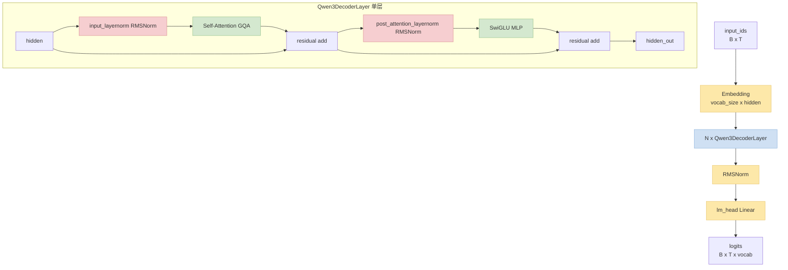
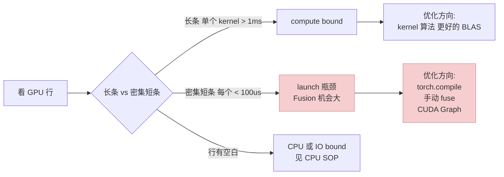
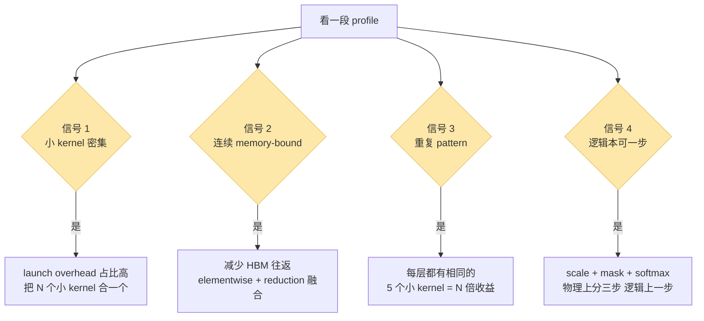

> 姊妹篇：[高效 CLI 工具栈](/posts/training-inference-engineer-cli-toolkit/) · [GPU/NCCL 侧 SOP](/posts/training-inference-acceleration-troubleshooting-sop/) · [Python CPU 侧 SOP](/posts/python-cpu-bottleneck-troubleshooting-sop/)
>
> 前面三篇讲"定位问题 + 调参"，这篇开始讲**"读懂模型 + 改模型"**：从 Qwen3 的源码和 profile 里识别算子融合机会。下篇讲"如果现成的 fusion 库也不够，怎么自己写 Triton kernel"。

---

## 零、本文骨架

| 小节 | 主题 | 产出 |
|---|---|---|
| §一 | 引子：三步循环 | 看懂 → 看出机会 → 动手换 |
| §二 | 静态读：看懂 Qwen3 | `print(model)` / `torchinfo` / 源码路径 / FX trace |
| §三 | 动态读：Runtime Profile | `torch.profiler` + Perfetto + 访存比 / Roofline |
| §四 | 识别 Fusion 机会的 4 个信号 | launch overhead / 低 AI 堆叠 / 重复 pattern / 可一步 |
| §五 | Qwen3 经典可融合点清单 | RMSNorm / RoPE / SwiGLU / QKV 合并 / attention softmax |
| §六 | 自动 Fusion | `torch.compile` + Inductor + `TORCH_LOGS=output_code` |
| §七 | 自动 fusion 也不够 | 预告下一篇 Triton kernel |
| §八 | 权威参考 | PyTorch / HuggingFace / Triton / Liger 等 |

---

## 一、引子：看懂 → 看出机会 → 动手换

大多数"我们这个训练太慢了"的结论都止步于"加 batch / 换卡"。但**训练一步里 70%~80% 时间都花在 kernel launch 和 memory 往返上**——这些大概率可以通过**算子融合**抹平。

问题是：

1. **看不懂模型**就不知道哪里有冗余
2. **看不懂 profile** 就不知道哪个冗余值得改
3. **知道了也不敢改**就只能靠 `torch.compile` 随缘

这一篇把前两步捋通，让你**三分钟定位到 Qwen3 训练里最值得融合的 5 个点**。下一篇讲第三步（手写 Triton kernel）。

---

## 二、静态读：看懂 Qwen3 模型结构

### 2.1 `print(model)` 和 `torchinfo.summary()`

最朴素也最高效的两步：

```python
from transformers import AutoModelForCausalLM
model = AutoModelForCausalLM.from_pretrained("Qwen/Qwen3-8B", torch_dtype="bfloat16")

# 1. 朴素 print: 看层级
print(model)
# Qwen3ForCausalLM(
#   (model): Qwen3Model(
#     (embed_tokens): Embedding(151936, 4096, padding_idx=151643)
#     (layers): ModuleList(
#       (0-35): 36 x Qwen3DecoderLayer(
#         (self_attn): Qwen3Attention(
#           (q_proj): Linear(4096, 4096, bias=False)
#           (k_proj): Linear(4096, 1024, bias=False)    # GQA: kv 缩小
#           (v_proj): Linear(4096, 1024, bias=False)
#           (o_proj): Linear(4096, 4096, bias=False)
#         )
#         (mlp): Qwen3MLP(
#           (gate_proj): Linear(4096, 12288, bias=False)
#           (up_proj): Linear(4096, 12288, bias=False)
#           (down_proj): Linear(12288, 4096, bias=False)
#           (act_fn): SiLU()
#         )
#         (input_layernorm): Qwen3RMSNorm()
#         (post_attention_layernorm): Qwen3RMSNorm()
#       )
#     )
#     (norm): Qwen3RMSNorm()
#   )
#   (lm_head): Linear(4096, 151936, bias=False)
# )
```

```python
# 2. torchinfo: 看每层参数量 / 输出形状 / FLOPs 粗估
from torchinfo import summary
summary(model, input_data=torch.randint(0, 1000, (1, 512)), depth=3)
```

**从 `print` 就能看出来几个关键事实**：

- GQA（`k_proj` / `v_proj` 输出 1024 ≠ `q_proj` 4096）—— 4:1 的 head 分组
- MLP 用 **SwiGLU**（`gate_proj * silu(up_proj)`）—— `gate + up + down` 三个 linear
- 每层两个 **RMSNorm**（input / post_attention）
- **无 bias**（所有 Linear `bias=False`）—— 少一些 add kernel

每一点都对应一个潜在 fusion 点，我们在 §五展开。

### 2.2 Qwen3 层级一览（结构图）



一眼看清：36 个一模一样的 block，每个 block 内部是"**RMSNorm → Attn → add → RMSNorm → MLP → add**"八步流水——这就是后面找 fusion 点的骨架。

### 2.3 源码阅读路径

读 HuggingFace `transformers` 的 Qwen3 实现有套路：

```
src/transformers/models/qwen3/modeling_qwen3.py
├── class Qwen3RMSNorm                  # 第一站：最简单的可融合点
├── class Qwen3RotaryEmbedding          # RoPE 实现
├── def apply_rotary_pos_emb            # 独立函数
├── def repeat_kv                       # GQA 扩展
├── class Qwen3Attention                # Attention 主体
├── class Qwen3MLP                      # SwiGLU
├── class Qwen3DecoderLayer             # 单层组装
├── class Qwen3Model                    # 堆叠 N 层
└── class Qwen3ForCausalLM              # + lm_head
```

**首次读推荐顺序**：`RMSNorm` → `apply_rotary_pos_emb` → `MLP` → `Attention.forward` → `DecoderLayer.forward`——**从最小叶子模块往外走**，每读一个就回头对照 §2.1 的 `print(model)` 结构。

### 2.4 `torch.fx.symbolic_trace`：拿到算子级图

`print(model)` 看到的是 `nn.Module` 层级，但训练时真正跑的是**算子图**——这才是 fusion 的对象。`torch.fx` 做 symbolic tracing，展开成 graph：

```python
import torch.fx as fx
gm: fx.GraphModule = fx.symbolic_trace(model.model.layers[0])

for node in gm.graph.nodes:
    print(node.op, node.name, node.target)
# placeholder hidden_states hidden_states
# call_module input_layernorm input_layernorm
# call_module self_attn self_attn
# call_function add_1 <built-in function add>
# call_module post_attention_layernorm post_attention_layernorm
# call_module mlp mlp
# call_function add_2 <built-in function add>
# output output output
```

注意：

- `torch.fx` **不能跟踪动态控制流**（`if attention_mask is not None:` 这类），Qwen3 的 attention `forward` 里有这类分支，会报错
- 解决：对能 trace 的子 module 单独 trace；或用 `torch._dynamo.export()`（torch.compile 的 tracer，支持控制流）

FX trace 的主要用处**不是**直接修改，而是拿到 graph 后**做模式匹配**找可融合点——下一节聊。

---

## 三、动态读：Runtime Profile 看 Qwen3 训练

静态看得到"有哪些算子"，但**算子的时间消耗**只有跑起来才知道。

前置：`torch.profiler` 用法见 [GPU/NCCL 侧 SOP §4.5](/posts/training-inference-acceleration-troubleshooting-sop/)、[CLI toolkit §4.5 Trace 可视化](/posts/training-inference-engineer-cli-toolkit/)。

### 3.1 采一段 trace

```python
from torch.profiler import profile, ProfilerActivity, schedule

with profile(
    activities=[ProfilerActivity.CPU, ProfilerActivity.CUDA],
    schedule=schedule(wait=1, warmup=2, active=3, repeat=1),
    on_trace_ready=torch.profiler.tensorboard_trace_handler("./log/qwen3_baseline"),
    record_shapes=True, with_stack=True, profile_memory=True,
) as prof:
    for step, batch in enumerate(loader):
        out = model(**batch)
        out.loss.backward()
        optimizer.step()
        prof.step()
        if step >= 6: break

# → ./log/qwen3_baseline/*.pt.trace.json
# 拖到 https://ui.perfetto.dev/
```

### 3.2 在 Perfetto 里要看什么

打开 trace 后，按 "GPU stream" → "kernels" 这一行横向扫：



Qwen3 训练典型状态：**Attention / MLP 的矩阵乘是长条**（compute 占满），而 **RMSNorm / RoPE / residual add / silu 的 kernel 密集而短**——这些短 kernel 就是 fusion 最大收益区。

### 3.3 量化 launch overhead 占比

Perfetto 的 SQL 面板一行算出**每个 kernel 的平均 dur**：

```sql
SELECT name, COUNT(*) cnt, AVG(dur) avg_us, SUM(dur) total_us
FROM slice
WHERE category = 'kernel'
GROUP BY name
ORDER BY total_us DESC
LIMIT 20;
```

**规律**：一个 kernel launch 在 H100 上的固定开销约 3~10μs。如果某 kernel 平均 dur < 50μs 却被调用几千次，**launch overhead 就超过了 20%**——这就是可融合的强信号。

### 3.4 访存比（Arithmetic Intensity）与 Roofline

Launch overhead 是**小 kernel 之间**的浪费，但单个 kernel 本身"吃没吃满 GPU"要看另一个维度——**访存比**（Arithmetic Intensity, AI）：

```
AI = FLOPs ÷ Bytes accessed
```

举例：一个 elementwise `add`，每个 bf16 元素 2 bytes 读 + 2 bytes 写 = 4 bytes，FLOPs = 1 → **AI = 0.25**。极低。

**Roofline 直觉**：GPU 有两个极限——HBM 带宽 和 峰值算力。
- AI **小于** 两者比值（Ridge Point） → **memory-bound**，受带宽限制，算力闲置
- AI **大于** Ridge Point → **compute-bound**，吃满算力

H100 为例：HBM3 带宽 ~3 TB/s，bf16 Tensor Core ~989 TFLOPS → **Ridge Point ≈ 330 FLOPs/byte**。低于这个值就是 memory-bound。

**Qwen3 里几个典型算子的 AI**（bf16、B=1、seqlen=4096、hidden=4096）：

| 算子 | FLOPs/byte | 类型 | Ridge 占比 |
|---|---|---|---|
| **RMSNorm** | ~0.5 | 严重 memory-bound | <1% |
| **RoPE apply** | ~2 | memory-bound | <1% |
| **SwiGLU 的 silu×up 那步** | ~0.5 | memory-bound | <1% |
| **Residual add** | ~0.25 | memory-bound | <1% |
| **Attention Q@K^T** | ~40 | 偏 memory-bound | ~12% |
| **MLP gate_proj matmul (4096→12288)** | ~500 | **compute-bound** | >150%（打满） |

**关键洞察**：

1. **memory-bound 算子合起来融合最划算**——它们本来就在等 HBM，fuse 一次读写就完事
2. **compute-bound 算子（大 matmul）fusion 收益很小**——算力本来就是瓶颈，读写只占一小部分
3. **提高 AI 本身就是 fusion 的目标**：N 个 memory-bound kernel 合 1 个 = FLOPs 不变、Bytes 减少 → AI 线性提升 → 从"等带宽"挪向"吃算力"

这就是为什么 §五 那张清单里**收益最大的 fusion 点（RMSNorm / RoPE / SwiGLU / residual）全是低 AI 算子**——它们是 fusion 的天然靶子。**看到 AI < 10 的算子连续出现，就是在白烧 HBM 带宽**。

---

## 四、识别 Fusion 机会的 4 个信号



### 信号 1：小 kernel 密集

- **特征**：profile 的 GPU 行上一串密集的短条，每个 < 100μs
- **为啥值得融合**：每次 launch 的固定开销 3~10μs，连续 10 个小 kernel 相当于白扔 30~100μs
- **例子**：Qwen3 每个 RMSNorm 是 2~3 个 kernel（square, mean, rsqrt, mul）

### 信号 2：连续 memory-bound ops（低 AI 堆叠）

- **特征**：elementwise / reduction 紧挨着，每个算子的 AI 都 < 10（见 §3.4）
- **为啥值得融合**：每个 kernel 都得从 HBM 读 tensor + 算 + 写回。**连续 N 步其实读写 N 次 HBM**，融合后只读写 1 次——相当于 N 倍的 AI 提升
- **例子**：SiLU(gate_proj) * up_proj —— 两个 matmul + 一个 silu + 一个 mul，中间的 `silu(gate)` tensor 本可不落 HBM

### 信号 3：重复 pattern

- **特征**：同一段算子序列在每层都出现
- **为啥值得融合**：N 层 × 每层的浪费 = 线性放大。Qwen3-8B 有 36 层，每层省 100μs → 整步省 3.6ms
- **例子**：每层都有"RMSNorm → 3 个 proj"，融合一次收益 ×36

### 信号 4：逻辑上本可一步

- **特征**：一个公式在代码里被拆成 3~4 个 tensor 操作
- **为啥值得融合**：数学上是原子操作，物理上没必要分
- **例子**：`attn = softmax((Q @ K.T / sqrt(d) + mask))`——数学一步，实现里变成 `matmul → div → add → softmax` 四个 kernel（被 Flash-Attention 一次解决）

---

## 五、Qwen3 里的经典可融合点清单

下表是**按收益从大到小**排的 Qwen3 典型 fusion 点。每项都标了"现成轮子"对应的下一篇 survey。

| 可融合点 | 原始实现（几个 kernel） | 融合后 | 收益量级 | 现成轮子 |
|---|---|---|---|---|
| **Attention (Q/K/V + softmax + dropout)** | 5~7 | 1 | 2~4x | Flash-Attention |
| **SwiGLU MLP** | 3 matmul + silu + mul = 5 | 融合 silu*up + down | 10~20% | Liger / 自写 Triton |
| **RMSNorm** | 2~3 | 1 | 5~15% | Apex / Liger / 自写 |
| **RoPE apply** | 2 matmul + sin + cos + mul | 1 | 5~10% | Liger / xFormers |
| **QKV 合并投影** | 3 个 Linear | 1 个 Linear + split | 5~8% | 改模型定义即可 |
| **Residual add + next RMSNorm** | 2 | 1 | 2~5% | Liger fused_add_norm |
| **CrossEntropy (lm_head + softmax + nll)** | 3 | 1 | 5~10%（长序列尤其） | Liger fused_linear_ce |

**读法**：数字是相对"baseline eager mode"的训练 step 时间减少比例，H100 + bf16 + batch=4 + seqlen=4096 实测量级。你的数字会有 ±30% 波动，但**相对排序非常稳定**。

### 几个看懂代码就能发现的例子

**例 1：RMSNorm 的 3 个 kernel**

HuggingFace 原生实现（简化版）：

```python
class Qwen3RMSNorm(nn.Module):
    def forward(self, x):
        variance = x.pow(2).mean(-1, keepdim=True)    # kernel 1: square + mean
        x = x * torch.rsqrt(variance + self.eps)      # kernel 2: rsqrt + mul
        return self.weight * x.to(self.weight.dtype)  # kernel 3: mul (+ dtype cast)
```

3 个 kernel、3 次 HBM 读 + 2 次 HBM 写。可以融合成 1 个 kernel、1 次读 + 1 次写。

**例 2：SwiGLU MLP 中间 tensor**

```python
class Qwen3MLP(nn.Module):
    def forward(self, x):
        return self.down_proj(self.act_fn(self.gate_proj(x)) * self.up_proj(x))
        #                    └── silu ──┘   └ gate ─┘    └ mul ─┘   └ up ─┘
```

`self.act_fn(gate) * up` 这一步**中间结果 `silu(gate)` 要落 HBM 再被 mul 读回来**。可以融合 `silu * up` 避免落盘，对 hidden_size=4096、intermediate=12288 的 Qwen3-8B，这块 tensor 每层约 100MB。

**例 3：Attention 里的 scale + mask + softmax**

```python
# simplified
scores = (q @ k.transpose(-1, -2)) / math.sqrt(head_dim)   # matmul + div
scores = scores + attention_mask                            # add
scores = F.softmax(scores, dim=-1)                          # softmax
scores = F.dropout(scores, p=0.0, training=self.training)   # dropout (training mode)
out = scores @ v                                            # matmul
```

数学上是一个函数，代码里 5 步。Flash-Attention 把它们融合成一个 kernel + tile 化，训练 attention 块加速 2~4x。

---

## 六、自动 Fusion：torch.compile + Inductor

写任何手动 fusion 之前**先试 `torch.compile`**——很多情况它已经够用了。

### 6.1 一行接入

```python
model = AutoModelForCausalLM.from_pretrained("Qwen/Qwen3-8B", torch_dtype="bfloat16")
model = torch.compile(model, mode="max-autotune")
# 第一步慢（编译），之后步步快
```

### 6.2 看 Inductor 生成了什么

`torch.compile` 背后是 **Inductor**，会把算子图编译成 **Triton** 代码。一行环境变量就能打出来：

```bash
TORCH_LOGS="output_code" python train.py 2>&1 | tee compile.log

# 在 compile.log 里 grep triton kernel 定义
grep -A 50 "@triton.jit" compile.log | head -80
```

能看到类似：

```python
@triton.jit
def triton_red_fused__to_copy_add_mean_mul_pow_rsqrt_0(
    in_ptr0, in_ptr1, out_ptr0, ...
):
    # ... 自动融合了 to_copy + add + mean + mul + pow + rsqrt
```

名字里有 `fused_mul_pow_mean_rsqrt` 就是 Inductor 把 RMSNorm 的 3 个 kernel 合一了。

### 6.3 看收益

```python
# 简单 benchmark
import time
def bench(fn, n=20):
    # warmup
    for _ in range(3): fn()
    torch.cuda.synchronize()
    t = time.time()
    for _ in range(n): fn()
    torch.cuda.synchronize()
    return (time.time() - t) / n * 1000

baseline_ms = bench(lambda: model_eager(**batch).loss.backward())
compiled_ms = bench(lambda: model_compiled(**batch).loss.backward())
print(f"eager: {baseline_ms:.1f}ms, compiled: {compiled_ms:.1f}ms")
# 典型输出: eager: 412.3ms, compiled: 325.8ms  → 21% 提速
```

Qwen3-8B bf16 + seqlen=4096 在 H100 上，`torch.compile` 对训练典型带来 **15%~30% step time 下降**。

---

## 七、如果 `torch.compile` 也不够

自动 fusion 有边界：

- Graph break 会让优化区间碎片化（见 [GPU SOP §七](/posts/training-inference-acceleration-troubleshooting-sop/)）
- Inductor 模板能覆盖的 pattern 有限，对 **attention / SwiGLU / 跨层 fusion** 经常打不过手写
- 长序列的 attention 还是得靠 Flash-Attention 级别的专用实现

这时候进入"手动领域"——要么用**成熟的 fused kernel 库**（Liger / Flash-Attn / Unsloth），要么**自己写 Triton kernel**。

**下一篇**：[从"调包"到"手写"——Triton Kernel 实战](#)（含 forward + backward + autograd.Function 封装 + 数值验证）。

---

## 八、权威参考

- [Qwen3 HuggingFace 模型卡](https://huggingface.co/Qwen/Qwen3-8B)
- [transformers modeling_qwen3.py 源码](https://github.com/huggingface/transformers/blob/main/src/transformers/models/qwen3/modeling_qwen3.py)
- [PyTorch `torch.fx` 文档](https://pytorch.org/docs/stable/fx.html)
- [PyTorch `torch.compile` Tutorial](https://pytorch.org/tutorials/intermediate/torch_compile_tutorial.html)
- [TorchInductor 设计文档](https://dev-discuss.pytorch.org/t/torchinductor-a-pytorch-native-compiler-with-define-by-run-ir-and-symbolic-shapes/747)
- [PyTorch Profiler Recipe](https://pytorch.org/tutorials/recipes/recipes/profiler_recipe.html)
- [Perfetto UI](https://ui.perfetto.dev/)
- [Horace He — Making Deep Learning Go Brrrr](https://horace.io/brrr_intro.html)
- [NVIDIA 关于 memory-bound vs compute-bound 的白皮书](https://docs.nvidia.com/deeplearning/performance/dl-performance-gpu-background/index.html)
- [Flash-Attention 论文](https://arxiv.org/abs/2205.14135)
- [Liger Kernel GitHub](https://github.com/linkedin/Liger-Kernel)
- 前篇姊妹系列：
  - [高效 CLI 工具栈](/posts/training-inference-engineer-cli-toolkit/)
  - [GPU/NCCL 侧 SOP](/posts/training-inference-acceleration-troubleshooting-sop/)
  - [Python CPU 侧 SOP](/posts/python-cpu-bottleneck-troubleshooting-sop/)

---

> **一句话总结**：看懂模型是"静态读源码 + 动态读 profile"两条腿。识别 fusion 机会只需要 4 个信号对着 profile 扫一遍。80% 的情况 `torch.compile` 能帮你落地——剩下 20% 进下一篇。
