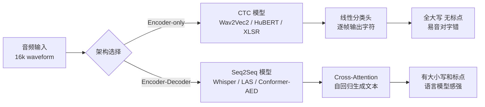
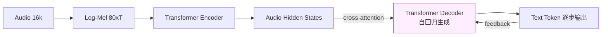
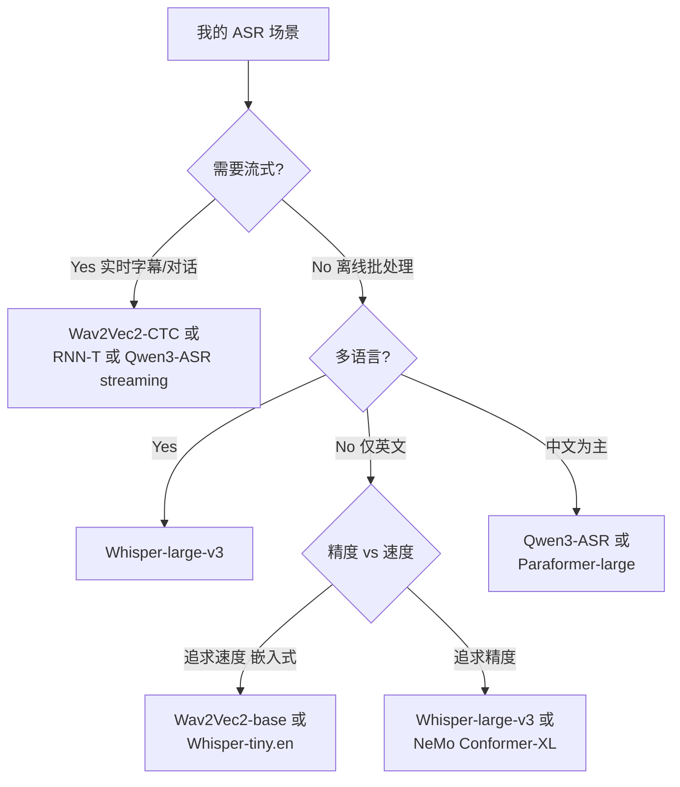
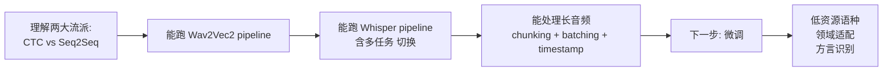

> 本文是"语音模型三部曲"的**基础篇**。前两篇分别讲 [预处理与术语](/2026/05/07/speech-model-preprocessing-glossary.html)（讲输入怎么来）和 [架构演进](/2026/05/07/speech-recognition-architecture-evolution.html)（讲模型代际）。这一篇换个视角——**动手用预训练 ASR 模型**，把两大经典架构 Wav2Vec2（CTC）和 Whisper（Seq2Seq）的特性、差异、长音频处理全跑一遍。
>
> 内容整合自 [HuggingFace Audio Course Unit 5](https://huggingface.co/learn/audio-course/en/chapter5/asr_models)，用中文重写并补充 mermaid 流程图与实战坑点。

---

## 一、开场：两大流派

语音识别（ASR）模型主要分两派：



**CTC 派**（2022 以前主流）：encoder-only，头上接一个线性分类层做 CTC 解码。预训练 + 10 分钟标注数据就能微调出强性能的下游 ASR——这是 Wav2Vec2、HuBERT、XLSR 崛起的关键。

**Seq2Seq 派**（2022 后主流）：encoder-decoder，decoder 本身兼任语言模型。代表作是 Whisper，680,000 小时带转录数据预训练，一步到位，不需要微调也能用。

下面按"先 CTC 后 Seq2Seq"的顺序走一遍。

---

## 二、探秘 CTC 模型：Wav2Vec2 实战

先载入 LibriSpeech 的一个小切片：

```python
from datasets import load_dataset

dataset = load_dataset(
    "hf-internal-testing/librispeech_asr_dummy", "clean", split="validation"
)
print(dataset)
# Dataset({
#     features: ['file', 'audio', 'text', 'speaker_id', 'chapter_id', 'id'],
#     num_rows: 73
# })
```

取第 3 个样本听一下：

```python
from IPython.display import Audio

sample = dataset[2]
print(sample["text"])
Audio(sample["audio"]["array"], rate=sample["audio"]["sampling_rate"])
```

**参考文本**：

```
HE TELLS US THAT AT THIS FESTIVE SEASON OF THE YEAR WITH CHRISTMAS
AND ROAST BEEF LOOMING BEFORE US SIMILES DRAWN FROM EATING AND ITS
RESULTS OCCUR MOST READILY TO THE MIND
```

圣诞节和烤牛肉 🎄。用官方的 `wav2vec2-base-100h` 跑一下：

```python
from transformers import pipeline

pipe = pipeline("automatic-speech-recognition", model="facebook/wav2vec2-base-100h")
pipe(sample["audio"].copy())
```

**预测输出**：

```
{'text': 'HE TELLS US THAT AT THIS FESTIVE SEASON OF THE YEAR WITH CHRISTMAUS
AND ROSE BEEF LOOMING BEFORE US SIMALYIS DRAWN FROM EATING AND ITS
RESULTS OCCUR MOST READILY TO THE MIND'}
```

### 2.1 CTC 的"音对字错"现象

肉眼 diff：

| 参考 | 预测 | 差异 |
|---|---|---|
| CHRISTMAS | **CHRISTMAUS** | 多了个 U |
| ROAST | **ROSE** | 元音拼错 |
| SIMILES | **SIMALYIS** | 辅元音位置错 |

三个错词**发音都对，拼写都错**。原因写在 CTC 架构里：


*图：CTC 解码流程——encoder 输出每帧的字符概率，blank 符号 `-` 用于对齐连续和重复字符。但整个过程是"纯声学"的，没有 decoder 端的语言模型约束。来源：HuggingFace Blog*

CTC 本质是一个"**acoustic-only**"模型：


对比真正"聪明的模型"会意识到 `CHRISTMAUS` 不是合法英文单词，自动纠正为 `CHRISTMAS`——但 CTC 没有这个能力，因为它缺少 decoder 端的语言建模上下文。

**CTC 的两个硬伤**：

1. 音素级拼写错误（如上所述）
2. 输出**全大写、无标点**——工业可用度直接打七折

---

## 三、升级到 Seq2Seq：Whisper 登场

Seq2Seq 模型长这样：



Decoder 本身就是语言模型，边看 encoder 的声学隐状态、边看已生成的文本前缀——**边听边想边写**。这个"全局上下文"让它能边转录边改错。


*图：Whisper 把"转录 / 翻译 / VAD / 语种识别"全部用特殊 token 统一成同一套 Decoder 生成任务。来源：OpenAI Whisper GitHub*

### 3.1 Seq2Seq 的两个代价

| 代价 | 具体表现 |
|---|---|
| 推理慢 | 自回归逐 token 生成，不能一次出全部结果 |
| 数据饥渴 | 需要海量带标注数据才能训得动 |

第二条是历史痛点——直到 Whisper 出现。Whisper 不依赖无监督预训练（像 Wav2Vec2 那样），而是**直接用 680,000 小时带字幕的互联网音频**做监督训练，其中 117,000 小时是非英语数据，覆盖 96+ 语种。数据量级比 Wav2Vec2 那一代的 60,000 小时无标签语音大了一个数量级。

### 3.2 Whisper 的五档尺寸

所有 9 个 checkpoint 都在 [Hugging Face Hub](https://huggingface.co/models?search=openai/whisper)：

| Size | 参数量 | VRAM / GB | 相对速度 | 英语专用 | 多语言 |
|---|---|---|---|---|---|
| tiny | 39M | 1.4 | 32× | ✓ | ✓ |
| base | 74M | 1.5 | 16× | ✓ | ✓ |
| small | 244M | 2.3 | 6× | ✓ | ✓ |
| medium | 769M | 4.2 | 2× | ✓ | ✓ |
| large | 1550M | 7.5 | 1× | ✗ | ✓（v2/v3） |

**选型建议**：手机端和边缘设备选 `tiny.en` / `base.en`；CPU 离线转录选 `small`；GPU 高精度场景直接上 `large-v3`。

### 3.3 跑一次 Whisper

```python
import torch
from transformers import pipeline

device = "cuda:0" if torch.cuda.is_available() else "cpu"
pipe = pipeline(
    "automatic-speech-recognition",
    model="openai/whisper-base",
    device=device,
)

pipe(sample["audio"], max_new_tokens=256)
```

**输出**：

```
{'text': ' He tells us that at this festive season of the year, with
Christmas and roast beef looming before us, similarly is drawn from
eating and its results occur most readily to the mind.'}
```

对比一下：

| 参考 | Whisper 预测 |
|---|---|
| CHRISTMAS | **Christmas** ✅ |
| ROAST | **roast** ✅ |
| SIMILES | ~~similarly~~ ❌（仍错，但已是合法英文单词） |

三处 Wav2Vec2 拼错的地方，Whisper 纠正了两个——而且**自动加了大小写和标点**，立即可用的工业级产出。剩下那个 `similarly`（其实应该是 `similes`）用更大的 `whisper-large-v3` 也能修掉，代价是推理成本翻倍。

### 3.4 96 语种 & 任务切换

Whisper 能在"转录"和"翻译到英文"之间切换，只要改一个 `generate_kwargs`：

```python
# 西语数据
dataset = load_dataset(
    "facebook/multilingual_librispeech", "spanish",
    split="validation", streaming=True,
)
sample = next(iter(dataset))

# 任务 1：西语转录为西语文本
pipe(sample["audio"].copy(), max_new_tokens=256,
     generate_kwargs={"task": "transcribe"})
# → 'Entonces te deleitarás en Jehová y yo te haré subir sobre las
#    alturas de la tierra ...'

# 任务 2：西语转录 + 翻译为英文
pipe(sample["audio"], max_new_tokens=256,
     generate_kwargs={"task": "translate"})
# → 'So you will choose in Jehovah and I will raise you on the heights
#    of the earth ...'
```

同一套权重、同一段音频，`task="transcribe"` 还是 `task="translate"` 一念之差。这是 Whisper "多任务 prompt 训练"的直接红利。

---

## 四、长音频转录：Chunking + Batching

### 4.1 为什么不能直接喂长音频？

Whisper 的两个硬性限制：

1. **30 秒输入窗口**：训练时全部 pad/truncate 到 30 秒。直接输入 5 分钟音频，只会拿到前 30 秒的转录
2. **Attention 复杂度 O(n²)**：序列翻倍显存翻四倍，超长音频必然 OOM

### 4.2 解决方案：切片 + 重叠

HuggingFace `pipeline()` 内置的长音频方案：

```mermaid
gantt
    title 长音频 Chunking + Batching 时序（5 分钟音频，30s chunk）
    dateFormat X
    axisFormat %Ss

    section Chunk 切片
    chunk_0 (0-30s)       :a1, 0, 30
    chunk_1 (25-55s)      :a2, 25, 55
    chunk_2 (50-80s)      :a3, 50, 80
    chunk_3 (75-105s)     :a4, 75, 105
    chunk_4 (100-130s)    :a5, 100, 130
    chunk_5 (...)         :a6, 125, 155

    section 并行推理
    GPU batch=8 并行处理 :crit, b1, 0, 60

    section 拼接
    重叠区去重 + merge    :c1, 60, 80
```



**关键原则**：

- **相邻 chunk 有重叠 (stride)**：让边界单词不会被切成两半
- **无状态**：每个 chunk 独立转录，可以完全并行
- **重叠区融合**：拼接时用 CTC-like 的 overlap merge 去重


*图：chunk 之间故意留一段重叠 (stride)，转录时每个 chunk 独立跑，拼接时用重叠区对齐——保证边界单词不丢。来源：HuggingFace Blog*


*图：chunk 拼接的"left stride + center + right stride"三段式——只保留 center 区，left/right 用于处理边界。这让 chunking 算法成为完全无状态的并行操作。来源：HuggingFace Blog*

### 4.3 代码：一行激活

```python
import numpy as np

# 构造 5 分钟长音频（拼接多个短样本）
sampling_rate = pipe.feature_extractor.sampling_rate  # 16000
target = 5 * 60 * sampling_rate
long_audio = []
for s in dataset:
    long_audio.extend(s["audio"]["array"])
    if len(long_audio) > target:
        break
long_audio = np.asarray(long_audio)
print(f"长度：{len(long_audio) / 16000:.1f} 秒")  # 317.22 秒

# 一键长音频转录：chunk_length_s=30 + batch_size=8
result = pipe(
    long_audio,
    max_new_tokens=256,
    generate_kwargs={"task": "transcribe"},
    chunk_length_s=30,
    batch_size=8,
)
```

**性能数字**（来自 HF 官方 benchmark）：

- 16GB V100 GPU：约 **3.45 秒**处理 317 秒音频（RTF ≈ 0.011，92 倍实时）
- CPU：约 **30 秒**（RTF ≈ 0.1）

### 4.4 带时间戳的长音频

字幕场景需要时间戳——加一个 `return_timestamps=True` 就够了：

```python
segments = pipe(
    long_audio,
    max_new_tokens=256,
    generate_kwargs={"task": "transcribe"},
    chunk_length_s=30,
    batch_size=8,
    return_timestamps=True,
)["chunks"]

for seg in segments[:3]:
    print(seg["timestamp"], seg["text"][:60], "...")

# (0.0, 26.4)  Entonces te deleitarás en Jehová, y yo te haré subir sobre ...
# (26.4, 32.48) mas Jehová cargó en él el pecado de todos nosotros. ...
# (32.48, 38.4) hambriento y a los hombres herrantes metas en casa ...
```

**注意**：Whisper 的时间戳是**片段级**（segment-level），精度 ~200ms。要字级时间戳需要额外跑 forced aligner（例如 Qwen3-ForcedAligner、WhisperX、Montreal Forced Aligner）。

---

## 五、Wav2Vec2 vs Whisper 对照表

| 维度 | Wav2Vec2-base | Whisper-base |
|---|---|---|
| 架构 | Encoder + CTC | Encoder + Decoder (Seq2Seq) |
| 参数量 | 95M | 74M |
| 预训练数据 | 60,000 h **无标签**（LibriVox） | 680,000 h **带字幕**（互联网） |
| 微调数据 | 100 h LibriSpeech | 无需微调直接用 |
| 大小写 / 标点 | ❌ | ✅ |
| 多语言 | 需 XLSR 或 MMS 变种 | 原生 96 语种 |
| 翻译能力 | ❌ | ✅ (translate to en) |
| 流式友好 | ✅（CTC 天然） | ❌（自回归） |
| 典型 WER (test-clean) | 6.1% | 5.0% |
| 音对字错 | 常见 | 少见 |

**一图流结论**：



---

## 六、典型翻车清单（工程侧）

刚接触 HF ASR pipeline 最常踩的坑：

1. **`sample["audio"]` 是一次性迭代器**：pipeline 会消耗掉，需要 `.copy()` 才能复用
2. **采样率不匹配**：`pipeline` 会自动重采样到模型要求的 16k，但 torchaudio 加载出来的可能是 44.1k。最好**先手动 resample** 再走 pipeline，可避免 silent 错误
3. **`max_new_tokens` 忘设**：Whisper 默认不限制，短音频没事，长音频没结束就被 generate 的硬上限截了
4. **`chunk_length_s` 不是越大越好**：超过 30 秒会超出 Whisper 训练窗口，反而**性能急剧下降**
5. **返回的时间戳相对 chunk 内部**：连接成完整时间轴已经由 pipeline 处理好，但如果自己手写 chunk loop 要注意 offset
6. **低资源语种精度崩塌**：Whisper 在西班牙语、法语、德语上很强，但在部分小语种（冰岛语、斯瓦希里语）WER 可能 > 50%。这时候就要微调
7. **"幻觉"**：纯静音段 Whisper 会吐 `"you"`、`"Thanks for watching!"` 这类训练集里常见的 YouTube 字幕残留。生产环境需要先用 VAD 过滤静音

---

## 七、小结 & 下一步



**本篇掌握的核心**：

- CTC 的"音对字错"短板与 Seq2Seq 的语言模型优势
- 用 HuggingFace `pipeline()` 一行跑通两大模型
- Whisper 的 96 语种 + task 切换
- 长音频 chunking 的原理、代码和性能表现
- 实战中最常踩的 7 个坑

**Whisper 做不好的场景**：

- 低资源语言（训练数据稀少）
- 特殊口音 / 方言（印度英语、苏格兰英语，或中文各方言）
- 特定领域术语（医学、法律、金融）
- 不同性别 / 年龄 / 人群的公平性（Whisper paper 附录有详细分析）

这些问题的解药统一是——**微调 (fine-tuning)**。下一篇会展开：只要 10 小时额外数据就能在低资源语种上让 Whisper 性能翻倍。

---

## 八、参考资料

- [Hugging Face Audio Course – Chapter 5: ASR Models](https://huggingface.co/learn/audio-course/en/chapter5/asr_models)
- [Making automatic speech recognition work on large files with chunking (HF Blog)](https://huggingface.co/blog/asr-chunking)
- [Whisper Paper (Radford et al., 2022)](https://arxiv.org/abs/2212.04356)
- [Wav2Vec 2.0 Paper (Baevski et al., 2020)](https://arxiv.org/abs/2006.11477)
- [OpenAI Whisper GitHub](https://github.com/openai/whisper)
- [Whisper Model Card – Usage](https://huggingface.co/openai/whisper-base#usage)
- [前篇（一）：语音模型预处理流程及常用术语详解](/2026/05/07/speech-model-preprocessing-glossary.html)
- [前篇（二）：语音识别模型架构演进：从 HMM-GMM 到 Whisper 到 Qwen3-ASR](/2026/05/07/speech-recognition-architecture-evolution.html)

---

> **一句话总结**：CTC 给你一个快但"耳聪目不明"的写手，Seq2Seq 给你一个慢但"边听边想"的写手——而 Whisper 之后，慢那一派靠数据规模暴力翻盘。作为工程师，今天遇到"离线转录"场景，先试 Whisper；遇到"实时流式"场景，先试 CTC/RNN-T 家族。
