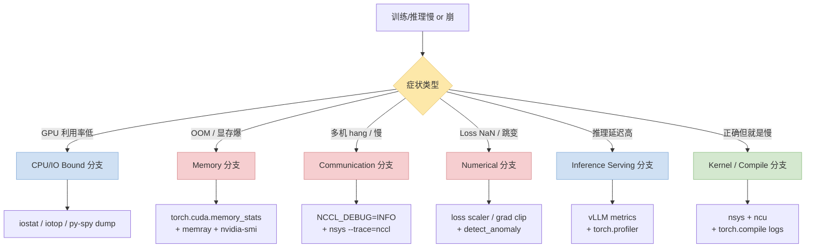
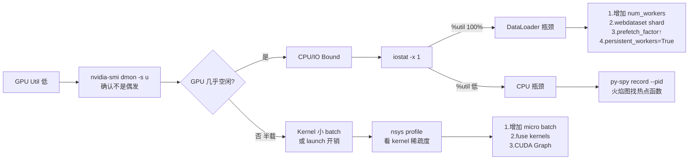
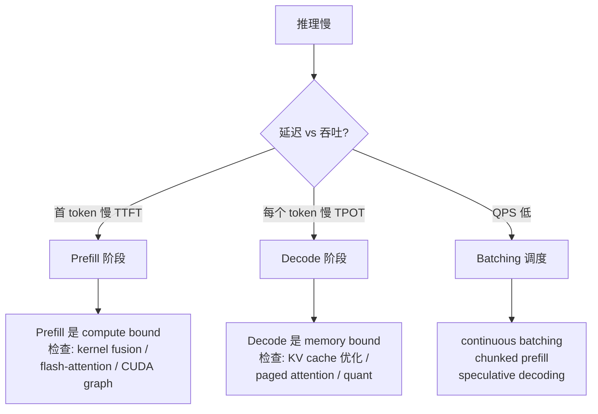

> 这是 [《训推工程师 & AI Agent 时代的高效 CLI 工具栈》](/posts/training-inference-engineer-cli-toolkit/) 的姊妹篇。
>
> 前一篇讲"**用什么工具**"，这一篇讲"**遇到问题怎么从症状一路打到根因**"——训推工程师的排障地图。每个症状下给出定位动线 + 对应工具 + 关键决策点 + 权威资料链接。
>
> 所有 SOP 都**刻意写成可以粘到 `AGENTS.md` 给 AI Agent 看**的形式——不是人读才能跑的流程。

---

## 零、这篇 post 怎么用

| 你现在是... | 推荐阅读路径 |
|---|---|
| **正在踩坑**（训练挂了 / 推理慢） | §一 决策总图 → 对应症状小节 → 跑命令 → 看参考资料 |
| **想系统升级排障能力** | 从 §二 顺读到 §七，每节跑一遍命令熟悉一遍工具 |
| **给团队写规范 / AGENTS.md** | 直接抄 §八 Agent SOP + §九 权威资料速查表 |

所有命令默认在 PyTorch 2.x + CUDA 12 + NCCL 2.20+ 环境下验证过；个别命令版本差异见每节注释。

### 0.1 文章骨架一览

| 小节 | 主题 | 产出形式 |
|---|---|---|
| §一 | 6 条症状 → 根因决策总图 | mermaid + HF pastel 配色（警示用粉红、可优化用淡蓝、成功用淡绿） |
| §二 | GPU 利用率低（最常见） | SOP 决策树 + 4 条体检命令 + 3 篇权威参考 |
| §三 | OOM / 显存爆炸 | 分诊表（按出错位置 5 种情形）+ PyTorch Memory Viz + `PYTORCH_CUDA_ALLOC_CONF` |
| §四 | NCCL / 多机 hang | 立即上手的 env var + flight recorder + 6 行常见坑速查表 |
| §五 | Loss NaN / 精度异常 | 代码片段 + 5 行数值坑速查（bf16 / MoE router / attention softmax） |
| §六 | 推理延迟 / 吞吐 | Prefill vs Decode 分支图 + vLLM 完整生产调参命令 + metrics 拉取 |
| §七 | torch.compile / graph break | 4 条调试 env var + 常见触发器清单 |
| §八 | Agent 版完整 SOP prompt | 可直接粘进 AGENTS.md 的 5 步流程 |
| §九 | 11 类综合参考资料速查表 | 按主题整齐分组的权威链接索引 |

### 0.2 本文的"Know-how"分布原则

- **立即能用**：每个症状节都有 2~6 条命令，复制即跑（`nvidia-smi dmon -s u`、`memray run`、`NCCL_DEBUG=INFO` 全套）
- **分诊表风格**：OOM / NCCL / 数值问题全部用"**症状 → 可能原因 → 修复方案**"三列表，按表格对照着跑
- **和 CLI toolkit 姊妹篇联动**：§八 专门给出 Agent 版 SOP，复用前文 §11 的规则（markdown 表、禁止散文）
- **权威来源分层**：每小节内嵌最相关 3~5 篇，§九 最后做全景索引，总计 **40+ 个官方 / 权威资料链接**

### 0.3 覆盖的工具生态

PyTorch tuning guide · NVIDIA DL Performance Docs · Horace He "Brrr" blog · vLLM · SGLang · TensorRT-LLM · DeepSpeed · Megatron-LM · Flash-Attention (Tri Dao) · HuggingFace transformers perf · Brendan Gregg USE method · PyTorch GPT-Fast 博客 —— 覆盖 2026 年主流训推加速的官方 / 权威资料，基本不用去别处找。

---

## 一、症状 → 根因决策总图



---

## 二、GPU 利用率低（最常见）

**症状**：`nvidia-smi` 看 Util 长期 <70%（理想 >90%），训练步长明显慢于理论值。

**SOP**：



**关键命令**：

```bash
# 1. 实时采样 GPU util
nvidia-smi dmon -s u -c 60          # 60 秒采样，看 sm/mem/enc 利用率

# 2. 确认 I/O 瓶颈
iostat -xm 1                        # %util > 80% 基本就是 IO bound

# 3. Python 热点
py-spy record -o flame.svg --pid $PID --duration 30

# 4. 端到端 trace
nsys profile -o train.nsys-rep --trace=cuda,nvtx python train.py
```

**权威参考**：
- [PyTorch Performance Tuning Guide](https://pytorch.org/tutorials/recipes/recipes/tuning_guide.html)
- [NVIDIA Deep Learning Performance — Getting Started](https://docs.nvidia.com/deeplearning/performance/dl-performance-getting-started/index.html)
- [Horace He — Making Deep Learning Go Brrrr From First Principles](https://horace.io/brrr_intro.html)

---

## 三、OOM / 显存爆炸

**症状**：`CUDA out of memory`、`Tried to allocate X GB`、训练到某个 step 突然挂。

**分诊表**：

| 出错位置 | 第一步检查 | 典型原因 | 典型修复 |
|---|---|---|---|
| 训练一启动 | `torch.cuda.memory_allocated()` | batch_size 太大 / model 太大 | 减 batch / gradient accumulation / ZeRO-3 |
| 进 training 循环后 | 运行中 `nvidia-smi` | activation / optimizer state | activation checkpointing / offload optimizer |
| 某固定 step | 同 step 数 reproduce | 特定输入长度爆炸 | 限 max_seq_len / packing / sort_by_length |
| 随机 step | 日志对比 free 显存曲线 | 显存碎片 | `PYTORCH_CUDA_ALLOC_CONF=expandable_segments:True` |
| 反向传播时 | `torch.cuda.empty_cache()` 前后对比 | 中间 tensor 未释放 | 检查 `torch.no_grad()` / `.detach()` |

**关键工具链**：

```bash
# 1. PyTorch 原生显存快照（推荐先跑这个）
python -c "
import torch
torch.cuda.memory._record_memory_history(max_entries=100000)
# ... run your code ...
torch.cuda.memory._dump_snapshot('mem.pickle')
"
# 然后 https://pytorch.org/memory_viz 拖进去看

# 2. Memray：按进程抓内存火焰图
memray run -o mem.bin train.py
memray flamegraph mem.bin

# 3. 防碎片（长序列训练 / MoE 训练必备）
export PYTORCH_CUDA_ALLOC_CONF=expandable_segments:True,max_split_size_mb:512
```

**权威参考**：
- [PyTorch Memory Visualizer + 官方文档](https://pytorch.org/blog/understanding-gpu-memory-1/)
- [PyTorch `PYTORCH_CUDA_ALLOC_CONF` 文档](https://pytorch.org/docs/stable/notes/cuda.html#memory-management)
- [HuggingFace — Methods and tools for efficient training](https://huggingface.co/docs/transformers/perf_train_gpu_one)
- [DeepSpeed ZeRO 显存计算](https://www.deepspeed.ai/tutorials/zero/)

---

## 四、多机训练 hang / NCCL 慢

**症状**：`AllReduce` 超时、rank=0 卡死、`watchdog caught collective operation timeout`、scaling efficiency < 70%。

**第一时间要做的事**：

```bash
# 1. 开 NCCL 详细日志（每个 rank 都要）
export NCCL_DEBUG=INFO
export NCCL_DEBUG_SUBSYS=ALL
export TORCH_NCCL_DUMP_ON_TIMEOUT=1
export TORCH_NCCL_TRACE_BUFFER_SIZE=10485760   # 启用 flight recorder

# 2. 看每个 rank 的 py-spy dump（确定卡在哪一行）
for pid in $(pgrep -f 'train.py'); do
    py-spy dump --pid $pid > dump_$pid.txt
done
# 然后 rg "all_reduce\|barrier" dump_*.txt 看堆栈

# 3. 带 NCCL trace 的 nsys
nsys profile --trace=cuda,nvtx,nccl,osrt -o nccl.nsys-rep python train.py
```

**常见 NCCL 坑速查**：

| 症状 | 根因 | 修复 |
|---|---|---|
| 启动 N 分钟才通 | 发现拓扑慢 | `NCCL_TOPO_DUMP_FILE=topo.xml` 查 |
| IB 不通退回 TCP | IB 驱动 / HCA 问题 | `NCCL_IB_HCA=mlx5` 指定 |
| PCIe 慢 | 没走 NVLink | `NCCL_P2P_DISABLE=0` 确认开启 |
| 超时 30 min | 某 rank 处理慢致错位 | `TORCH_NCCL_BLOCKING_WAIT=1` + flight recorder |
| 大小 tensor 混合慢 | 调度差 | `NCCL_ALGO=Ring` / `Tree` 试 |
| 跨机带宽不足 | 网络拓扑 | `nvbandwidth` 实测 + topology-aware scheduler |

**权威参考**：
- [NCCL Troubleshooting 官方](https://docs.nvidia.com/deeplearning/nccl/user-guide/docs/troubleshooting.html)
- [NCCL 环境变量 reference](https://docs.nvidia.com/deeplearning/nccl/user-guide/docs/env.html)
- [PyTorch Distributed Debugging](https://pytorch.org/docs/stable/distributed.html#debugging)
- [PyTorch NCCL Flight Recorder](https://pytorch.org/tutorials/prototype/flight_recorder_tutorial.html)
- [DeepSpeed — Debugging](https://www.deepspeed.ai/tutorials/troubleshooting/)

---

## 五、Loss NaN / 精度异常

**症状**：loss 变 NaN、训练爆炸、推理输出 garbage、bf16/fp16 下精度比 fp32 差很多。

**快速分诊**：

```bash
# 1. 开异常检测（只在定位时用，会慢 30%）
torch.autograd.set_detect_anomaly(True)

# 2. 在训练 loop 里埋点
torch.nan_to_num_(loss, nan=0.0, posinf=1e9, neginf=-1e9)   # 应急
if torch.isnan(loss) or torch.isinf(loss):
    # 快照上一 step 的梯度和 activation stats
    ...

# 3. grad norm 监控
total_norm = torch.nn.utils.clip_grad_norm_(model.parameters(), max_norm=1.0)
logger.info(f"grad_norm={total_norm:.4f}")

# 4. 混精调参
from torch.cuda.amp import GradScaler
scaler = GradScaler(init_scale=2**16, growth_interval=2000)
```

**常见数值坑速查**：

| 现象 | 可能原因 | 修复 |
|---|---|---|
| step 几百后 loss NaN | fp16 overflow（softmax / log） | 换 bf16 / 降 lr / grad clip 0.5 |
| bf16 收敛比 fp32 慢 | bf16 mantissa 只有 7 bit | optimizer 用 fp32 master weights（ZeRO） |
| attention softmax NaN | 长序列 numerical instability | 用 flash-attention / 手动 `softmax_fp32` |
| embedding grad NaN | 词表查 embed padding 不一致 | `padding_idx=0` + `scale_grad_by_freq` |
| MoE router NaN | expert idle → softmax 0/0 | load balance loss + router dtype=fp32 |

**权威参考**：
- [PyTorch Autograd Anomaly Detection](https://pytorch.org/docs/stable/autograd.html#anomaly-detection)
- [PyTorch AMP Best Practices](https://pytorch.org/docs/stable/notes/amp_examples.html)
- [Training Neural Networks with Mixed Precision (NVIDIA)](https://docs.nvidia.com/deeplearning/performance/mixed-precision-training/index.html)
- [Flash-Attention 论文（讲 softmax numerical stability）](https://arxiv.org/abs/2205.14135)

---

## 六、推理延迟 / 吞吐

**症状**：LLM 推理 TTFT / TPOT 高、QPS 达不到、batching 效率低。

**分层排查**：



**vLLM / SGLang 调参关键**：

```bash
# vLLM 常用优化
vllm serve my-model \
    --gpu-memory-utilization 0.92 \
    --max-model-len 32768 \
    --enable-prefix-caching \
    --enable-chunked-prefill \
    --max-num-batched-tokens 8192 \
    --quantization fp8 \
    --speculative-model speculator-0.5b \
    --num-speculative-tokens 5

# 拉 metrics 看分布
curl localhost:8000/metrics | rg "time_to_first_token|time_per_output_token"
```

**权威参考**：
- [vLLM Performance Tuning Guide](https://docs.vllm.ai/en/latest/models/performance.html)
- [SGLang Benchmarking Docs](https://sgl-project.github.io/references/benchmark_and_profiling.html)
- [NVIDIA TensorRT-LLM Best Practices](https://nvidia.github.io/TensorRT-LLM/performance/perf-best-practices.html)
- [HuggingFace TGI Optimization](https://huggingface.co/docs/text-generation-inference/conceptual/quantization)
- [PyTorch 官方 — GPT-Fast 博客（速度理论上限推导）](https://pytorch.org/blog/accelerating-generative-ai-2/)

---

## 七、torch.compile / Graph Break 排查

**症状**：`torch.compile` 加了速度反而慢 / 没加速 / 报错 `graph break`。

```bash
# 1. 打印所有 graph break（这一条必用）
export TORCH_LOGS="recompiles,graph_breaks"
python train.py 2>&1 | rg "graph break"

# 2. 更详细：每次编译的原因
export TORCH_LOGS="+dynamo"

# 3. 看最终 triton 代码
export TORCH_COMPILE_DEBUG=1
# 会在 ./torch_compile_debug/ 下产出每个编译单元的中间表示

# 4. fullgraph=True 硬限：不允许 graph break
torch.compile(model, fullgraph=True, mode="max-autotune")
```

**常见 graph break 触发器**：
- Python `print` / `logger.info` 嵌在 forward 里
- 动态形状（不同 batch 长度、dtype 切换）
- `tensor.item()` / `tensor.tolist()` / `.cpu()` 在 forward 里
- Python try/except / 大量控制流
- `.shape` 用于控制流判断（要用 `torch._dynamo.mark_dynamic`）

**权威参考**：
- [PyTorch Dynamo Troubleshooting](https://pytorch.org/docs/stable/torch.compiler_troubleshooting.html)
- [torch.compile 官方 Tutorial](https://pytorch.org/tutorials/intermediate/torch_compile_tutorial.html)
- [PyTorch 2.0 Paper](https://pytorch.org/assets/pytorch2-2.pdf)

---

## 八、让 AI Agent 跑完整 SOP 的一段 prompt

把下面这段塞进 `AGENTS.md`，配合 CLI toolkit 文里的 [§11.6 Trace 分析规则](/posts/training-inference-engineer-cli-toolkit/#116-让-agent-分析性能-trace)，Agent 能从"出症状"一路走到"定位 + 建议"：

````markdown
# Training/Inference Performance Triage SOP

当用户说"训练慢 / OOM / 多机 hang / loss NaN / 推理慢"时，按以下 SOP 执行：

1. **先问症状分类**（如果用户没明说）：
   - GPU 利用率低？→ GPU-Util 路径
   - OOM？→ Memory 路径
   - 多机 hang？→ NCCL 路径
   - Loss NaN？→ Numerical 路径
   - 推理延迟？→ Inference 路径
   - Compile 问题？→ torch.compile 路径

2. **无脑跑几个"体检命令"**（不要等用户描述细节）：
   - `nvidia-smi --query-gpu=index,utilization.gpu,memory.used --format=csv`
   - `iostat -xm 1 3`
   - `ps -eo pid,pcpu,pmem,cmd | rg python | head -20`
   - `rg -i "error|oom|nan|timeout|cuda" <log path> | tail -100`

3. **根据体检结果锁定分支**，按对应小节的 SOP 跑工具

4. **产出**：markdown 表格 (症状 / 根因 / 证据 / 修复建议 / 验证步骤)
   — 禁止散文化报告

5. **引用权威资料**：每个建议至少带一个官方 / 权威 blog 链接
````

**给 Agent 的 6 条硬性规则**：

- ❌ 不允许 `cat` 大 trace 文件（>50MB）
- ❌ 不允许打开任何 GUI / TUI（Nsight UI / Perfetto UI / nvitop / htop）
- ❌ 不允许 `watch -n` 这类永不退出的命令
- ✅ 所有 git 命令带 `--no-pager`
- ✅ 所有结构化输出优先 `--json` / `--format=csv` / `--porcelain`
- ✅ 最终产出统一 markdown 表 + 3 句话结论

---

## 九、综合参考（分门别类速查）

| 主题 | 权威资料 |
|---|---|
| **总论** | [PyTorch Performance Tuning Guide](https://pytorch.org/tutorials/recipes/recipes/tuning_guide.html) · [NVIDIA DL Performance Docs](https://docs.nvidia.com/deeplearning/performance/) · [Horace He — Brrr Intro](https://horace.io/brrr_intro.html) |
| **PyTorch** | [Profiling Recipe](https://pytorch.org/tutorials/recipes/recipes/profiler_recipe.html) · [Memory Viz](https://pytorch.org/blog/understanding-gpu-memory-1/) · [Distributed Debugging](https://pytorch.org/docs/stable/distributed.html) |
| **混精** | [Training with Mixed Precision (NVIDIA)](https://docs.nvidia.com/deeplearning/performance/mixed-precision-training/index.html) · [PyTorch AMP](https://pytorch.org/docs/stable/notes/amp_examples.html) |
| **NCCL / 分布式** | [NCCL Troubleshooting](https://docs.nvidia.com/deeplearning/nccl/user-guide/docs/troubleshooting.html) · [Flight Recorder](https://pytorch.org/tutorials/prototype/flight_recorder_tutorial.html) · [DeepSpeed Debugging](https://www.deepspeed.ai/tutorials/troubleshooting/) |
| **DataLoader / IO** | [PyTorch DataLoader](https://pytorch.org/docs/stable/data.html) · [webdataset](https://github.com/webdataset/webdataset) · [HuggingFace Data Loading](https://huggingface.co/docs/datasets/use_with_pytorch) |
| **Kernel / Compile** | [torch.compile 官方](https://pytorch.org/docs/stable/torch.compiler.html) · [PyTorch 2.x Paper](https://pytorch.org/assets/pytorch2-2.pdf) · [Triton Tutorial](https://triton-lang.org/main/getting-started/tutorials/index.html) |
| **Flash-Attention** | [Tri Dao 博客](https://tridao.me/publications/) · [flash-attention GitHub](https://github.com/Dao-AILab/flash-attention) |
| **vLLM / 推理** | [vLLM Performance Tuning](https://docs.vllm.ai/en/latest/models/performance.html) · [vLLM Production Stack](https://docs.vllm.ai/en/latest/serving/production_stack.html) · [SGLang Benchmark](https://sgl-project.github.io/references/benchmark_and_profiling.html) |
| **TensorRT-LLM** | [TensorRT-LLM Best Practices](https://nvidia.github.io/TensorRT-LLM/performance/perf-best-practices.html) |
| **Megatron / MoE** | [Megatron-LM Performance](https://github.com/NVIDIA/Megatron-LM#performance) · [DeepSpeed MoE](https://www.deepspeed.ai/tutorials/mixture-of-experts/) |
| **系统与 IO** | [Linux Performance (Brendan Gregg)](https://www.brendangregg.com/linuxperf.html) · [USE Method](https://www.brendangregg.com/usemethod.html) |
| **HuggingFace 系** | [Perf Train GPU One](https://huggingface.co/docs/transformers/perf_train_gpu_one) · [Perf Train GPU Many](https://huggingface.co/docs/transformers/perf_train_gpu_many) · [Perf Infer GPU](https://huggingface.co/docs/transformers/perf_infer_gpu_one) |
| **博客 / 课程** | [PyTorch 2.x GPT-Fast 系列博客](https://pytorch.org/blog/accelerating-generative-ai-2/) · [HuggingFace Efficiency Course](https://huggingface.co/learn/cookbook/en/optimizing_transformers) |

---

## 十、相关文章

- [训推工程师 & AI Agent 时代的高效 CLI 工具栈](/posts/training-inference-engineer-cli-toolkit/)（本篇姊妹篇：讲工具）
- [语音模型预处理流程及常用术语详解](/posts/speech-model-preprocessing-glossary/)
- [语音识别模型架构演进：从 HMM-GMM 到 Whisper 到 Qwen3-ASR](/posts/speech-recognition-architecture-evolution/)

---

> **一句话总结**：训推加速的 99% 问题都能用"**体检命令 → 根据现象锁定分支 → 跑专用工具 → 查权威资料**"这四步闭环拿下。真正的专家，不是背下所有技巧，而是能**第一时间跑对体检命令 + 第一时间找对权威参考**。
