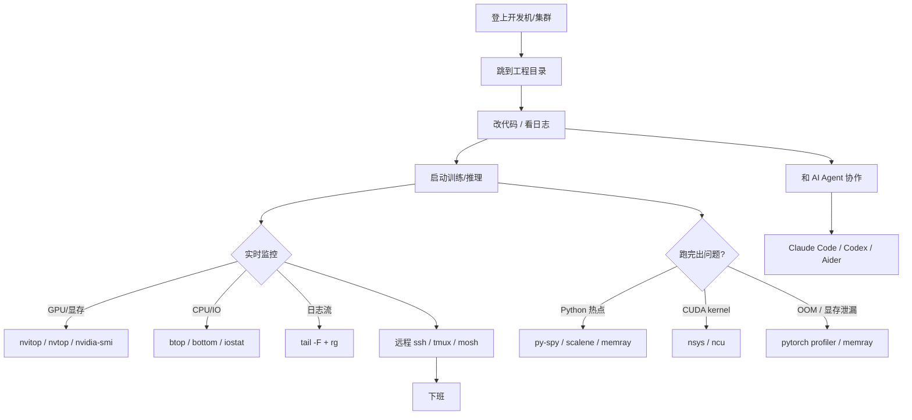
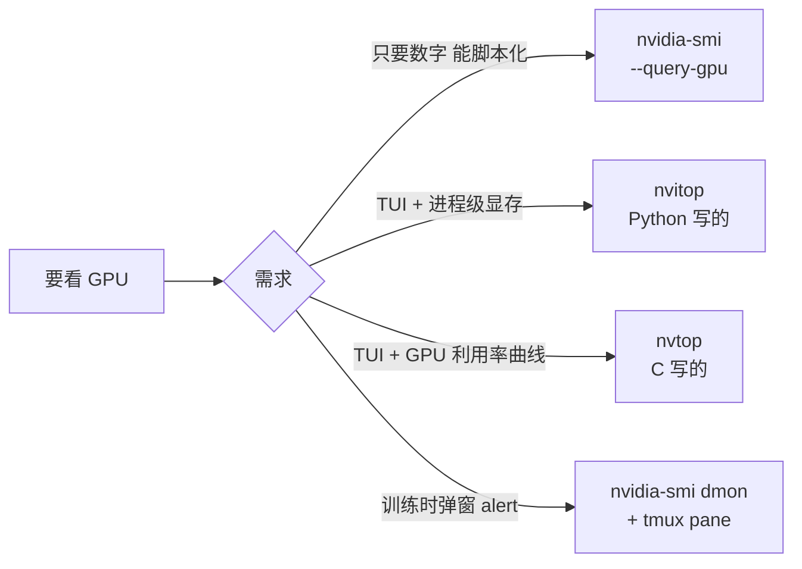
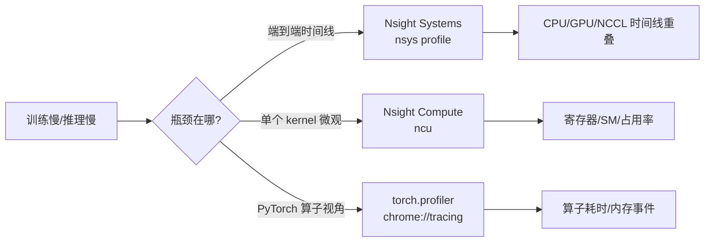
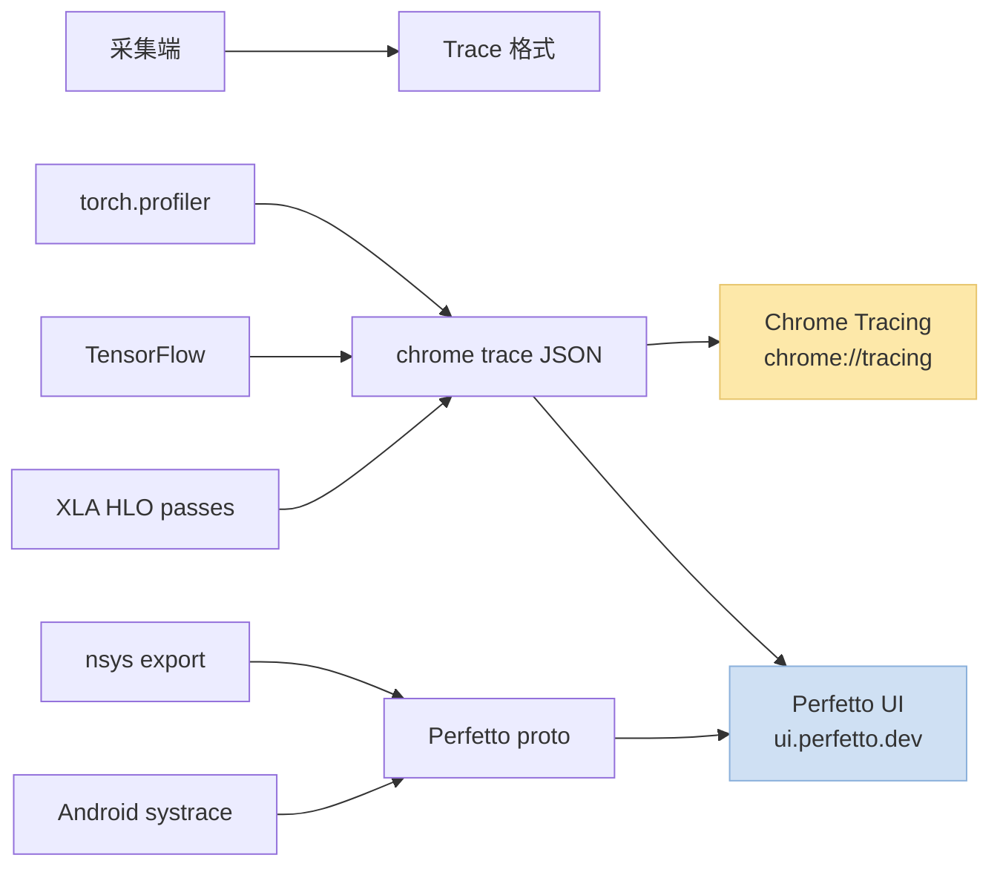
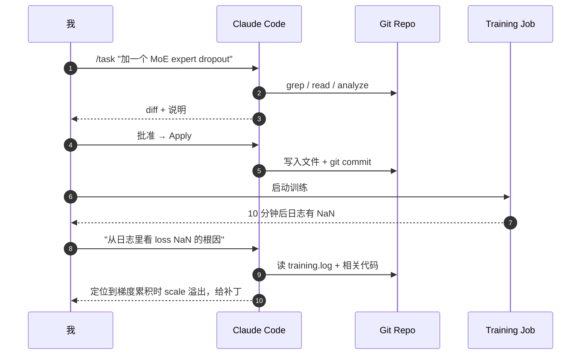
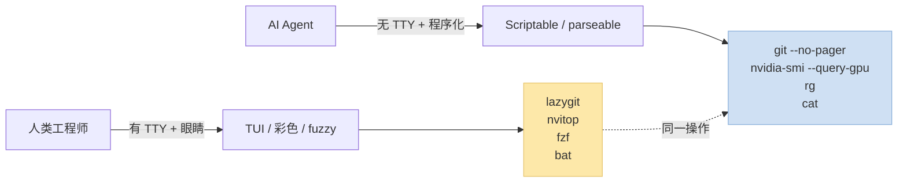
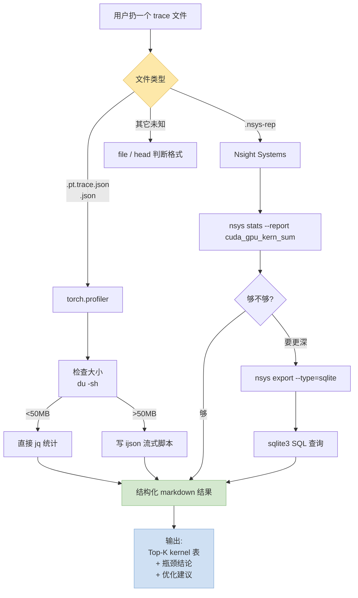

> 写给一手训模型 / 调推理 / 和 AI Agent 协作编程的工程师。全文不堆砌 "100 个 CLI 工具" 清单，而是按**真实工作流的动线**给出每个阶段的首选+备选，再配 mermaid 动线图和实测截图。**能实测的我自己用过，不能实测的标"未实测"。**
>
> 参考: [豆包总结的高效 CLI 工具清单](https://www.doubao.com/thread/wab7643019a77af82)。本文在它基础上做了大量筛选 + 训推/Agent 视角的重构。

---

## 一、先把动线画出来

训推工程师一天的命令行动线，大致这样：



这张图决定了本文的章节结构：**Navigation → Code → 启动 → 监控 → 性能分析 → AI Agent → 远程 & Shell**。每一段挑 2~4 个最核心的工具讲透。

---

## 二、Navigation & Search：三件套核心

### 2.1 zoxide — 训推工程师最高 ROI 的单工具

经典场景：

```bash
# 以前
cd /data/users/austin/experiments/moe-perf-2026/iter3/configs/16b

# 用 zoxide 之后
z 16b      # 自动跳转到访问过的最匹配的路径
```

在一台集群 gateway 机上，项目目录往往嵌套很深（`/data/xxx/yyy/zzz/expXX/configs/...`）。zoxide 按**访问频率+时间衰减**打分，敲 1~2 个字就跳对——**无需 cd，无需记路径**。

安装 + alias：

```bash
# macOS
brew install zoxide

# shell 注入（zsh 示例）
echo 'eval "$(zoxide init zsh)"' >> ~/.zshrc

# 最常用别名：直接把 cd 替换成 z
alias cd=z
```

### 2.2 ripgrep (rg) — 代替 grep，看 10GB 日志不卡

```bash
# 在整个工程里找某个 OOM 堆栈
rg "CUDA out of memory" -A 20

# 只搜 .py 不看 .pyc / node_modules（rg 默认遵守 .gitignore）
rg "def forward" -t py

# 统计某关键词出现次数
rg -c "training step" training.log
```

**训推场景的杀手级用法**——在几十 GB 的 rank 日志目录里找错：

```bash
rg "rank=0.*Error" /data/logs/moe-0428/
```

同样查询用 `grep -r` 慢 5~10 倍，rg 因为自带 mmap + SIMD 几秒出结果。

### 2.3 fzf — 模糊选择万能胶水

单独的 `fzf` 只是个过滤器，真正强在跟别的命令拼起来。几个一次性记住的组合：

```bash
# Ctrl+R 升级版（shell history 模糊反查）
eval "$(fzf --zsh)"   # 或 --bash

# 切分支
git branch | fzf | xargs git checkout

# 查 conda 环境并激活
conda env list | awk '{print $1}' | fzf | xargs conda activate

# rg + fzf 三连：搜内容 → 选文件 → 用 vim 打开定位到行
rg --line-number "MoE" | fzf --delimiter ':' | awk -F: '{print "+"$2, $1}' | xargs vim
```

**提示**：fzf 的 `--preview` 配 `bat` 做语法高亮预览，是 2026 年工程师终端的标配姿势：

```bash
export FZF_DEFAULT_OPTS="--height 40% --preview 'bat --color=always --style=numbers --line-range=:200 {}'"
```

### 2.4 fd — 代替 find 的现代语法

```bash
find . -name "*.py" -not -path "*/\.*"   # 老写法
fd -e py                                 # 新写法
```

  
*图：fd 的典型用法演示。语法比 find 直观、速度快、默认忽略 hidden 和 .gitignore。来源：sharkdp/fd GitHub*

---

## 三、代码、日志、文件：每天高频用的

| 工具 | 作用 | 替代谁 |
|---|---|---|
| **bat** | `cat` + 语法高亮 + 行号 + git diff mark | cat |
| **eza** (前身 exa) | `ls` + 图标 + tree + git 状态 | ls |
| **delta** | git diff pager，彩色 + syntax | git 默认 diff |
| **dust** | 可视化 `du -sh *`，列出哪个子目录最占空间 | du |
| **duf** | 多彩的 `df -h`，磁盘分区视图 | df |
| **glow** / **mdcat** | 在终端里渲染 markdown | less xxx.md |

常用别名：

```bash
alias cat='bat --paging=never'
alias ls='eza --icons --git'
alias ll='eza -l --icons --git --time-style=long-iso'
alias tree='eza --tree --level=3 --icons'
```

### 3.1 dust 真实场景

训练完剩下一堆 checkpoint + tfevents + rank log，清理前看哪里胖：


*图：dust 输出——横向条形图 + 百分比一目了然，替代 `du -sh * \| sort -h`。来源：bootandy/dust GitHub*

---

## 四、监控与性能分析（训推工程师核心专区）

### 4.1 GPU 监控：nvitop / nvtop / nvidia-smi 选哪个



**nvitop**（推荐日常用）：进程级显存，能直接 kill 僵尸进程


*图：nvitop 的 TUI——上方每块 GPU 的 Util/MemUsed/Temp/Power，下方每个进程的显存占用，按 `T` 可直接终止。来源：XuehaiPan/nvitop*

**nvtop**（补充选择）：长期监控曲线更直观


*图：nvtop 类似 htop 的布局但专为 GPU——GPU Util / VRAM Util 的时间曲线很适合"看训练抖不抖"。来源：Syllo/nvtop*

**一条别名**，避免每次手打 `watch -n 1 nvidia-smi`：

```bash
alias gpu='nvidia-smi --query-gpu=index,name,utilization.gpu,memory.used,memory.total,power.draw --format=csv'
alias gpuw='watch -n 1 "nvidia-smi --query-gpu=index,utilization.gpu,memory.used --format=csv,noheader"'
```

### 4.2 CPU / MEM / IO：bottom + htop + iostat

- **htop**：人尽皆知，F3 搜索、F5 tree、F9 kill——2003 年产物至今坚挺
- **btop / bottom**：更炫的 TUI，能同时看 CPU / MEM / Net / Disk / GPU（bottom 支持 NVIDIA）
- **procs**：现代 `ps`，结果彩色 + 按树分组
- **iostat -xm 1**：看每块磁盘的 `%util / r_await / w_await`，判断 IO 瓶颈的标配
- **iotop**：按进程看磁盘 IO，OOM 之前往往先 IO 异常

训推场景最常踩的坑：DataLoader worker 卡死在磁盘 IO。动线：

```
训练卡顿 → iostat 发现 %util=100% → iotop 定位是 prefetch worker
  → 降 num_workers 或换 webdataset/shard 方案
```

### 4.3 Python Profiling：py-spy / scalene / memray / line_profiler

| 工具 | 采样/侵入 | 看什么 | 典型用法 |
|---|---|---|---|
| **py-spy** | 采样 (no instrument) | 活进程 CPU 火焰图 | `py-spy record -o out.svg --pid $PID` |
| **scalene** | 采样 + 精确 | CPU + GPU + 内存三张图 | `scalene train.py` |
| **memray** | 精确 | 内存分配火焰图 | `memray run train.py` → `memray flamegraph out.bin` |
| **line_profiler** | 精确 (装饰器) | 行级 CPU 时间 | `@profile` 装饰 + `kernprof -l -v train.py` |
| **cProfile** | 精确 | 老牌函数级 | `python -m cProfile -o out.pstats train.py` |

**`py-spy record --pid`** 是训推工程师的"救命稻草"——模型训到一半 CPU 主进程卡死，不用重启，直接对 PID 采样输出火焰图，几秒定位瓶颈。

### 4.4 NVIDIA Nsight Systems / Compute

进入 GPU 性能世界：



最常用姿势：

```bash
# 采集 30 秒端到端时间线（不要裹到训练脚本外部启停，直接在训练脚本里用 cudaProfilerStart）
nsys profile -o train.nsys-rep --trace=cuda,nvtx,cudnn,cublas,osrt python train.py

# 在 Nsight Systems UI 或用 nsys stats 快速看
nsys stats train.nsys-rep --report cuda_gpu_kern_sum
```

**配套工具**：
- `dcgm-exporter` → Prometheus：长期集群级别监控
- `nvbandwidth`：P2P / NVLink 带宽实测
- `cuda-gdb` / `compute-sanitizer`：Kernel 级调试

### 4.5 Trace 可视化：chrome tracing / Perfetto（不是 CLI 但必备）

训推工程师的"看时间线"工作流里，**最终是要把各种 profiler 的输出扔进 Web 可视化工具**——nsys 能在本地 UI 打开，但 PyTorch profiler、XLA、TensorFlow、Android 系统 trace 这些的通用落地格式是 **Chrome Trace Event Format (JSON)** 或 **Perfetto proto**。



**两个可视化器的选择**：

| | chrome://tracing | [ui.perfetto.dev](https://ui.perfetto.dev/) |
|---|---|---|
| 出身 | Chrome 早期 devtool | Google 新一代 trace 平台（推荐） |
| 打开方式 | Chrome 浏览器地址栏敲 `chrome://tracing` | 直接访问 https://ui.perfetto.dev/ ，本地不上传 |
| 格式支持 | Chrome JSON | Chrome JSON + Perfetto proto + Android ftrace |
| 大 trace 性能 | > 200MB 就卡 | 支持 GB 级 trace（内置 SQL 后端） |
| SQL 查询 | ❌ | ✅（`PerfettoSQL` 直接跑 SQL 找瓶颈） |
| 社区现状 | 维护模式 | 活跃，Chrome 官方现在推这个 |

**一个 PyTorch 标准流程**：

```python
import torch
from torch.profiler import profile, ProfilerActivity, schedule

with profile(
    activities=[ProfilerActivity.CPU, ProfilerActivity.CUDA],
    schedule=schedule(wait=1, warmup=1, active=3, repeat=2),
    on_trace_ready=torch.profiler.tensorboard_trace_handler("./log"),
    record_shapes=True,
    with_stack=True,
) as prof:
    for step, batch in enumerate(loader):
        train_step(batch)
        prof.step()

# 产出 ./log/*.pt.trace.json
# → 拖到 ui.perfetto.dev 即可看时间线
```

**怎么"看"trace（给新手的 3 条心法）**：

1. **先看 GPU 行的空隙**：连续空白段通常是 CPU bound（DataLoader、Python GIL、scheduler）
2. **对齐 NCCL / all_reduce 的长条**：通信和计算是否 overlap，决定分布式 scaling 效率
3. **找最宽的 kernel**：不是最频繁的——最宽的一个 kernel 往往是优化首选（fused kernel / flash attention）

**Tips**：
- nsys 的 `.nsys-rep` 可以 `nsys export --type=perfetto ...` 直接转 Perfetto proto，一次采集两处都能看
- Perfetto UI 的 SQL 控制台能跑 `SELECT name, SUM(dur) FROM slice GROUP BY name ORDER BY 2 DESC LIMIT 20;` 直接查"吃掉最多时间的函数 TOP20"
- 内部机器跑的 trace 不方便上传云 UI，可以 `docker run -p 10000:10000 perfettodev/perfetto-ui` 自建一个本地实例

### 4.6 调试：gdb / pdb / ipdb / debugpy

```bash
# 活进程 attach（分布式训练 rank=0 卡死）
sudo gdb -p $PID                 # C 层栈
py-spy dump --pid $PID           # Python 栈（无需侵入）

# 更现代的 pdb 替代
pip install ipdb
python -c "import ipdb; ipdb.set_trace()"

# VSCode / Cursor 远程调试
pip install debugpy
python -m debugpy --listen 0.0.0.0:5678 --wait-for-client train.py
```

`py-spy dump --pid` 是活训练 debug 的**银弹**：不用 attach gdb、不用改代码，直接拿到所有线程的 Python 堆栈。

---

## 五、Git + 容器

### 5.1 lazygit：让分布式协作少 80% 敲字

```bash
brew install lazygit      # macOS
lg                        # 推荐 alias lg=lazygit
```

常用快捷键：
- `space` 暂存 / 取消暂存
- `c` commit（支持 subject+body）
- `P` push / `p` pull
- `d` diff 当前行（左边 status，右边 diff，回车进入）

### 5.2 delta：git diff 彩色升级

`~/.gitconfig`：

```ini
[core]
    pager = delta
[interactive]
    diffFilter = delta --color-only
[delta]
    navigate = true
    line-numbers = true
    syntax-theme = Dracula
```

### 5.3 容器：lazydocker + dive

**lazydocker**：容器 TUI，一键看日志、attach、重启


*图：lazydocker 的交互界面——鼠标键盘都能用，训练容器 + Redis + Postgres 堆一起也一眼看完。来源：jesseduffield/lazydocker*

**dive**：审查镜像的每一层大小，减小镜像的神器


*图：dive 分层显示 Docker 镜像，每一层带来的文件变化一目了然——删掉一层里的 `pip cache` 能省几个 GB。来源：wagoodman/dive*

---

## 六、AI Agent 时代的命令行

### 6.1 Coding Agent 三选一

| Agent | 定位 | 适合 |
|---|---|---|
| **Claude Code** (Anthropic CLI) | 通用软件工程 | 长链路任务、文件批量改、复杂重构 |
| **Codex CLI** (OpenAI) | 脚本 + 编辑 | 快速改小段、跟 IDE 结合 |
| **Aider** | Pair programming | git commit 粒度明确、轻代码库 |
| **Gemini CLI** | 长上下文 | 整仓 RAG 类任务、文档问答 |

典型动线：



**关键经验**：把 Agent 配成 `tmux` 的一个 pane，**保持训练日志 pane 与 Agent pane 同屏**，异步对谈。

### 6.2 自家 LLM 调用：llm / ollama / aichat

- **`llm`** (Simon Willison)：pip 安装即用，支持所有主流 API，`llm -m gpt-5 '解释这段'`
- **ollama**：本地跑模型，`ollama run qwen3:8b`，接 API 兼容 OpenAI
- **aichat**：Rust CLI，支持多轮、RAG、function calling

### 6.3 Claude Code 和 Codex CLI 的第三方网关

不再展开——见本站：
- [Claude Code CLI 第三方网关](/posts/claude-code-cli-third-party-gateway/)
- [Codex CLI 第三方网关](/posts/codex-cli-third-party-gateway/)
- [Cursor Free Plan BlueRouter（WIP）](/posts/cursor-free-plan-bluerouter-gateway-wip/)

---

## 七、远程 / 多路复用 / Shell 外壳

### 7.1 tmux vs zellij

| | tmux | zellij |
|---|---|---|
| 哲学 | 经典 Unix 风 | 现代化 + 内置 plugin |
| 上手 | 需学习 `Ctrl-b` | 开箱即用，下方 hint |
| 插件 | TPM 管理 | 内置 layouts + plugins |
| 训推推荐 | ✅ 集群上普遍装 | ✅ 新环境强烈推荐 |

训推典型 layout：

```
┌─────────────┬─────────────┐
│ 左上: code  │ 右上: nvitop│
├─────────────┼─────────────┤
│ 左下: 训练  │ 右下: log   │
│         日志│   tail -F   │
└─────────────┴─────────────┘
```

### 7.2 atuin — shell 历史的革命

```bash
curl --proto '=https' --tlsv1.2 -LsSf https://setup.atuin.sh | sh
atuin import auto
```

装完 `Ctrl-R` 变成多机同步的模糊历史搜索——换一台机器也能搜到昨天那条奇葩命令。

### 7.3 mosh — 弱网 SSH

高铁 / 跨境专线下 ssh 经常断。mosh 用 UDP + 预测回显，**网络抖动完全无感**。

```bash
mosh user@gateway.example.com
```

### 7.4 starship — 跨 shell 的彩色提示符


一个 `~/.config/starship.toml` 统管所有 shell。训推工程师推荐开启：
- `aws` / `gcloud` module（防止 deploy 到错的环境）
- `python` module（venv 名字）
- `custom.cuda`（自己写一个显示 `CUDA_VISIBLE_DEVICES`）

---

## 八、生产力锦囊：几条高价值别名

贴到 `~/.zshrc` 当场提效：

```bash
# Jump + 搜
alias cd=z
alias ..='cd ..'
alias cdr='cd $(git rev-parse --show-toplevel)'     # 跳回 repo 根

# 更好的默认
alias cat='bat --paging=never'
alias ls='eza --icons --git'
alias ll='eza -l --icons --git --time-style=long-iso'
alias df='duf'
alias du='dust'

# Git
alias lg='lazygit'
alias gp='git pull --rebase && git status'
alias gcm='git commit -m'

# GPU
alias gpu='nvidia-smi --query-gpu=index,utilization.gpu,memory.used,memory.total,power.draw --format=csv'
alias gpuw='watch -n 1 "nvidia-smi --query-gpu=index,utilization.gpu,memory.used --format=csv,noheader"'

# Docker
alias ld=lazydocker

# 快速拉 / 上传 HF 模型
alias hfdl='huggingface-cli download'
alias hfup='huggingface-cli upload'

# py-spy 一键
alias pyspy-dump='sudo py-spy dump --pid'
```

---

## 九、上手路径：渐进计划

```mermaid
%%{init: {
  "theme": "base",
  "themeVariables": {
    "fontFamily": "-apple-system, Source Sans Pro, sans-serif",
    "primaryTextColor": "#374151",
    "textColor": "#374151",
    "titleColor": "#374151",
    "lineColor": "#9CA3AF",
    "sectionBkgColor": "#FAFAF7",
    "altSectionBkgColor": "#F3F4F0",
    "gridColor": "#E5E7EB",
    "taskBkgColor": "#FDE8A9",
    "taskBorderColor": "#E7C56D",
    "taskTextColor": "#374151",
    "taskTextOutsideColor": "#374151",
    "taskTextLightColor": "#374151",
    "activeTaskBkgColor": "#CFE0F3",
    "activeTaskBorderColor": "#8AB0DB",
    "doneTaskBkgColor": "#D4E8CF",
    "doneTaskBorderColor": "#94C18A",
    "critBkgColor": "#F6CED0",
    "critBorderColor": "#D98F92"
  },
  "gantt": {
    "barHeight": 22,
    "barGap": 6,
    "topPadding": 75,
    "bottomPadding": 40,
    "leftPadding": 150,
    "rightPadding": 30,
    "gridLineStartPadding": 40,
    "titleTopMargin": 30,
    "fontSize": 13,
    "sectionFontSize": 14,
    "numberSectionStyles": 4
  }
}}%%
gantt
    title CLI 能力升级计划（训推工程师版）
    dateFormat X
    axisFormat Day %d

    section 🧭 导航与搜索
    zoxide basics            :a1, 0, 2d
    fzf (Ctrl-R + file)      :a2, 1, 3d
    rg replaces grep         :a3, 2, 2d

    section 📝 日常替换
    bat / eza / dust         :b1, 3, 2d
    delta (git diff)         :b2, 5, 1d
    lazygit                  :b3, 6, 2d

    section 📊 监控 & 性能
    nvitop / nvtop           :active, c1, 7, 2d
    btop / iostat            :active, c2, 8, 2d
    py-spy hands-on          :crit, c3, 10, 3d
    Nsight Systems intro     :crit, c4, 13, 3d

    section 🤖 Agent & 远程
    Claude Code / Codex      :active, d1, 16, 2d
    tmux / zellij            :d2, 17, 2d
    atuin                    :d3, 19, 2d

    section ✨ 沉淀
    alias tune + sync        :done, e1, 20, 1d
```



**渐进要点**：前 3 天只装 `zoxide + fzf + rg + bat`，别贪多；第二周才开始换 lazygit、learn nvitop；第三周接入 Claude Code + atuin 做长期固化。一次装 20 个工具三天就 rollback 了，亲测。

---

## 十、完整工具总表（按领域速查）

| 领域 | 必装 ★ | 强推荐 | 进阶 |
|---|---|---|---|
| 导航 / 搜索 | zoxide ★ / fzf ★ / rg ★ / fd | sk (skim) | broot / nnn |
| 文件 / 目录 | bat ★ / eza ★ | dust / duf / glow | yazi / ranger |
| Git | lazygit ★ / delta ★ | gh / tig | git-absorb |
| 容器 | lazydocker ★ | dive | |
| GPU 监控 | nvitop ★ / nvidia-smi ★ | nvtop | dcgm-exporter |
| 系统 / CPU | htop ★ / btop | procs / bottom | bandwhich |
| IO / 磁盘 | iostat ★ / iotop | dust / duf / gdu | ncdu |
| Python 性能 | py-spy ★ / scalene ★ | memray / line_profiler | viztracer |
| CUDA 性能 | nsys ★ / ncu | torch.profiler | compute-sanitizer |
| 调试 | ipdb / debugpy ★ | gdb / lldb | rr (record-replay) |
| HTTP / API | curl / httpie ★ | xh / curlie | oha (load test) |
| 文本处理 | jq ★ / yq | sd / gron | hexyl |
| 归档 / 压缩 | zstd / tar | pigz / pixz | |
| 同步 / 备份 | rsync ★ | rclone / restic | borg |
| Terminal 外壳 | tmux ★ / starship ★ | zellij / atuin ★ | ohmyposh |
| 会话 / 远程 | ssh ★ / mosh | tailscale | |
| 文档 / 渲染 | glow / mdcat | rich-cli | mdbook |
| AI Agent | Claude Code ★ / Codex | Aider / Gemini CLI | llm / aichat |
| 本地 LLM | ollama ★ | llama.cpp | vllm |
| 杂项 | tldr / hyperfine | navi / just | gum |

★ = 日用高频、值回装机时间。

---

## 十一、给 AI Agent 的 CLI 优先使用指引

本文列的工具里有**相当一部分不适合 AI Agent 使用**——Agent 要的是"可脚本化、可解析、无 pager、非交互"的输出，而 TUI / 彩色 / 交互式工具对它反而是噪声。

如果你在给 Claude Code、Codex、Cursor Agent 写 `AGENTS.md` 或 `.claude/settings.json`，把下面这几条复制过去：

### 11.1 Agent-Safe vs Agent-Unsafe

| 任务 | ✅ Agent 首选 | ❌ Agent 禁用 | 原因 |
|---|---|---|---|
| 文本搜索 | `rg "pat" -n --no-heading` | `grep -r` / `fzf` | rg 快 + 遵守 .gitignore；fzf 是交互 TUI |
| 找文件 | `fd -t f 'pattern'` 或 `find` | `fzf` 选择 | 交互 UI 在 agent 里直接挂起 |
| 查看文件 | `cat` / `sed -n 'A,Bp'` / `head/tail` | `bat`（默认开 paging） | bat 需 `--paging=never --style=plain`，否则输出 ANSI 码污染上下文 |
| 列目录 | `ls -1` / `ls -la` | `eza`（icons） | 图标字符会干扰 agent 解析 |
| Git diff | `git --no-pager diff` | `delta` | pager 和颜色对 agent 是噪声 |
| GPU 状态 | `nvidia-smi --query-gpu=... --format=csv` | `nvitop` / `nvtop` / `htop` | TUI 全部不可用 |
| 进程状态 | `ps -eo pid,etime,cmd \| rg ...` | `htop` / `btop` / `procs` | 同上 |
| 磁盘占用 | `du -sh * \| sort -h` | `dust` / `duf` | dust 输出对齐用特殊字符，解析不稳 |
| Docker | `docker ps --format '{{json .}}'` | `lazydocker` | 非交互 + JSON 输出最友好 |
| Git 操作 | `git status --porcelain` / `git log --oneline -n 20` | `lazygit` / `tig` | 同上 |
| Python profile | `py-spy dump --pid $PID`（一次性输出） | `py-spy top` / `scalene` | `dump` 非交互，`top` 是 TUI |
| Python 调试 | `python -c "..."` / 读 stack trace | `pdb.set_trace()` | 交互 REPL 会阻塞 agent |
| 远程命令 | `ssh host 'command'`（带显式命令） | `mosh` / 裸 `ssh` 进交互 shell | agent 不能实时交互 |

### 11.2 关键环境变量（写进 shell init 或 agent 的环境）

```bash
# 让所有分页器默认不分页（agent 不能按空格翻页）
export PAGER=cat
export GIT_PAGER=cat
export SYSTEMD_PAGER=cat
export LESS='-F -X -R'   # -F 内容不满屏自动退出，-X 不清屏

# 让彩色命令在非 TTY 下自动关闭（大多数工具已默认，但强制一遍）
export CLICOLOR=0
export NO_COLOR=1

# rg / bat 的静默默认
export BAT_PAGER=""
export BAT_STYLE="plain"

# 避免 agent 在个人 alias 下拿到意料外行为
# （在 AGENTS.md 里提醒 agent，执行命令前用 `command xxx` 或 `\xxx` 跳过 alias）
```

### 11.3 典型"改写规则"（可以直接告诉 agent）

```
When executing shell commands:

1. If the user task asks you to "search code / find pattern / locate usage":
   → Use `rg "pattern" -n` first. Fall back to `grep -rn` only when rg is unavailable.

2. If reading a file or file slice:
   → Use `cat`, `sed -n '10,50p'`, `head -n`, `tail -n` — never bat/less/more.
   → For very large files (>1MB), read by line range, not the whole file.

3. If you want to inspect JSON / YAML output:
   → Pipe through `jq` (JSON) or `yq` (YAML). Never assume human-readable output.

4. If you want GPU info:
   → `nvidia-smi --query-gpu=index,name,utilization.gpu,memory.used,memory.total --format=csv,noheader`
   → Never spawn nvitop / nvtop / watch -based TUIs.

5. If you want to run git:
   → Prefix with `git --no-pager` or export GIT_PAGER=cat.
   → Use porcelain/json formats: `git status --porcelain`, `git log --oneline`, `gh pr list --json`.

6. Never launch:
   - Interactive TUIs (htop, btop, nvitop, lazygit, lazydocker, fzf, yazi, ranger, vim, nano, less, more)
   - Commands that block on stdin (read, pdb, ipdb, python REPL without -c)
   - Pagers (less, more) — they require keypress to exit
   - `watch -n` loops — they never terminate
   - `mosh`, interactive `ssh` without a `-o` batch command

7. For any long-running command (train, serve, build):
   - Run in background: append `&` or use the agent's built-in background-run primitive
   - Stream output to a file and tail it later with `tail -n 200`
   - Never rely on streaming TTY output to stay attached

8. Parse-friendly output conventions:
   - Always add format flags: `--json`, `--format=csv`, `--porcelain`, `-o json`
   - Always limit output: `rg ... -m 50`, `head -n 100`, `| head`
   - Prefer `--no-heading` / `--no-color` / `--quiet` if available
```

### 11.4 Agent vs 人类的"镜像工具栈"

可以理解为**两套并行的 CLI 习惯**：



**给同一个 repo 的 `AGENTS.md` 写清楚两套行为模式**，比把"人类偏好"灌给 agent 要有效得多。

### 11.5 配到 Claude Code / Codex 的最小化建议

在 `~/.claude/CLAUDE.md` 或项目根 `AGENTS.md` 粘贴下面几行：

```markdown
# CLI 规则

- 搜索：rg > grep。默认 `rg -n --no-heading`
- 文件读取：cat / head / tail / sed -n 'A,Bp'。**不要用 bat / less / more**
- Git：所有 git 命令加 `--no-pager`，或在环境里 `export GIT_PAGER=cat`
- GPU：只用 `nvidia-smi --query-gpu=... --format=csv`，不要 nvitop / nvtop
- 长任务：后台运行 + tail 日志，不要依赖 TTY 流
- 禁止：一切 TUI、交互式 REPL、阻塞式 pager、永不退出的 `watch -n`
```

### 11.6 让 Agent 分析性能 trace（torch.profiler JSON / nsys-rep）

这是实战里最高频的 agent 应用场景——扔一个 trace 让 agent 给出瓶颈结论。但 **Perfetto UI / Nsight Systems UI 都是 GUI**，agent 用不了。必须让 agent 走 CLI / SQL 路线。

#### 11.6.1 torch.profiler 的 `.pt.trace.json`（Chrome Trace Event Format）

这是一个大 JSON，顶层结构：

```json
{
  "traceEvents": [
    {"ph": "X", "name": "aten::matmul", "ts": 12345, "dur": 678, "pid": 0, "tid": 1, "args": {...}},
    {"ph": "X", "name": "ncclAllReduce", "ts": ...},
    ...
  ],
  "schemaVersion": 1
}
```

**给 Agent 的 prompt 模板**（直接粘到 Claude Code / Codex）：

````markdown
我有一个 torch.profiler 产出的 trace: `./log/moe_train.pt.trace.json` (大小 340MB)。
请用 Python + ijson（流式解析，避免一次加载到内存）分析并输出：

1. **Top-20 最耗时的 kernel**（按 `dur` 求和、`name` 分组；只统计 `ph=="X"` 的事件）
2. **CPU vs GPU 总耗时**（`pid` / `tid` 能区分 CPU 线程和 CUDA stream，参考 `args.cat` 字段）
3. **GPU idle 时长**：相邻 GPU kernel 之间 gap > 1ms 的段累加
4. **NCCL 通信占比**：`name` 匹配 `nccl*` 的事件 dur 之和 / 总 GPU 时长
5. **最宽的单次 kernel 调用** 及其 stack trace（从 `args.external id` 关联 python stack）

输出格式：markdown 表格 + 3 句话结论（瓶颈在哪、优化建议、下一步验证方案）。
脚本写到 `analyze_trace.py`，跑完把表格结果贴在聊天里。
````

**关键提示**（给 agent 的 guardrails）：
- **一定要用流式解析**（`ijson`、`json.JSONDecoder().raw_decode()` 按块），否则 1GB+ 的 trace 会 OOM
- **sample 采样**：遇到上万个 events 时，可以先 `head -c 100MB` 截取头部粗看，再跑全量
- **不要 `cat file.json`**——几百 MB 会直接占满 agent context window
- 最终结论让 agent 生成 **markdown 表格**，而不是随意散文

**一条就能跑的 jq 快速看**（适合 agent 先探一眼）：

```bash
# 看 Top-20 耗时最大的事件名
jq -r '.traceEvents[]
  | select(.ph == "X" and .dur)
  | "\(.dur)\t\(.name)"' trace.json \
  | awk -F'\t' '{sum[$2]+=$1; cnt[$2]++} END {
      for (k in sum) printf "%12d  %6d  %s\n", sum[k], cnt[k], k
    }' \
  | sort -rn | head -20
```

#### 11.6.2 Nsight Systems 的 `.nsys-rep`

`.nsys-rep` 是二进制，**agent 绝不能 cat / head**。正确路径是用 `nsys` 的子命令：

```bash
# 1. 最快看结论：kernel 时间 Top-N（一行搞定）
nsys stats --report cuda_gpu_kern_sum --format csv train.nsys-rep | head -30

# 2. 列出所有可用报告（30+ 种，按需选）
nsys stats --help-reports

# 3. 最有用的 5 个 report
nsys stats --report cuda_gpu_kern_sum train.nsys-rep    # kernel 时间排行
nsys stats --report cuda_gpu_mem_time_sum train.nsys-rep # memcpy 时间
nsys stats --report nvtx_sum train.nsys-rep              # NVTX range（训练 step 边界）
nsys stats --report cuda_api_sum train.nsys-rep          # CUDA API 调用（launch 开销）
nsys stats --report nccl_sum train.nsys-rep              # NCCL 通信时间

# 4. 深度分析：导出 sqlite 让 agent 跑 SQL
nsys export --type=sqlite -o train.sqlite train.nsys-rep
# 之后 agent 可以：
sqlite3 train.sqlite "SELECT name, SUM(end-start)/1e6 AS ms FROM CUPTI_ACTIVITY_KIND_KERNEL
                      JOIN StringIds ON shortName=id
                      GROUP BY name ORDER BY ms DESC LIMIT 20;"
```

**给 Agent 的 prompt 模板**（`.nsys-rep` 版）：

````markdown
我有一个 Nsight Systems 采集的 trace: `./prof/train_16b.nsys-rep` (1.2GB)。
**不要试图打开 UI，也不要 cat 这个文件。** 执行以下步骤：

1. 跑 `nsys stats --report cuda_gpu_kern_sum --format csv ./prof/train_16b.nsys-rep | head -50`
   拿到 kernel 耗时 Top-50
2. 跑 `nsys stats --report nccl_sum --format csv ...` 算通信占比
3. 跑 `nsys stats --report nvtx_sum --format csv ...` 看每个 training step 耗时分布
4. 若以上不够：`nsys export --type=sqlite -o train.sqlite ...` 然后用 sqlite3 查：
   - Top-10 kernel 的 `(name, SUM(dur), COUNT(*), AVG(dur))`
   - GPU idle 时间（kernel 之间 gap > 100μs 的累加）
   - CPU/GPU 时间重叠率

输出 markdown 表格 + 结论（瓶颈 / 优化建议 / 验证实验设计）。
````

#### 11.6.3 Agent 分析 trace 的 SOP（可以固化到 AGENTS.md）



**固化到项目 AGENTS.md 的几行规则**：

```markdown
# Performance Trace 分析规则

- `.pt.trace.json` / 任何 torch profiler 输出：
  - 先 `du -sh`；< 50MB 直接 jq；否则写 ijson 流式脚本
  - 禁止 `cat` / `jq '.'` 全量输出
  - 必出 Top-K kernel 表 + CPU/GPU 重叠率 + NCCL 占比

- `.nsys-rep` / Nsight Systems 输出：
  - 永远先 `nsys stats --report cuda_gpu_kern_sum --format csv | head -50`
  - 需要 SQL 时 `nsys export --type=sqlite` 后用 sqlite3
  - 禁止 `cat`（二进制文件）
  - 禁止打开 nsys GUI（无 TTY）

- 所有 trace 分析都以 **markdown 表格 + 结论段** 形式产出，不要散文
- 瓶颈判定顺序：GPU idle → NCCL → memcpy → 最宽 kernel
```

---

## 十二、训推加速问题定位（姊妹篇已拆出）

这一章原本写在本文里，内容量涨到 9 个子节 + 40+ 条权威参考后，已经够独立成文。完整版见：

👉 **[训推加速问题定位 SOP 与 Know-how：从 GPU 低利用率到 NCCL hang 到推理吞吐](/posts/training-inference-acceleration-troubleshooting-sop/)**

覆盖 6 条主流症状的排障 SOP：GPU Util 低 / OOM / NCCL hang / Loss NaN / 推理延迟 / torch.compile，每节都给了体检命令 + 分诊表 + 权威资料。最后一节是可以直接粘进 `AGENTS.md` 的 Agent 版完整 Triage SOP。

---

## 十三、参考资料

- [豆包：介绍高效 CLI 工具栈](https://www.doubao.com/thread/wab7643019a77af82)（本文参考原清单）
- [zoxide GitHub](https://github.com/ajeetdsouza/zoxide)
- [junegunn/fzf](https://github.com/junegunn/fzf)
- [BurntSushi/ripgrep](https://github.com/BurntSushi/ripgrep)
- [sharkdp/bat](https://github.com/sharkdp/bat) / [sharkdp/fd](https://github.com/sharkdp/fd)
- [eza-community/eza](https://github.com/eza-community/eza)
- [bootandy/dust](https://github.com/bootandy/dust)
- [jesseduffield/lazygit](https://github.com/jesseduffield/lazygit)
- [jesseduffield/lazydocker](https://github.com/jesseduffield/lazydocker)
- [wagoodman/dive](https://github.com/wagoodman/dive)
- [XuehaiPan/nvitop](https://github.com/XuehaiPan/nvitop)
- [Syllo/nvtop](https://github.com/Syllo/nvtop)
- [benfred/py-spy](https://github.com/benfred/py-spy)
- [plasma-umass/scalene](https://github.com/plasma-umass/scalene)
- [bloomberg/memray](https://github.com/bloomberg/memray)
- [NVIDIA Nsight Systems](https://developer.nvidia.com/nsight-systems)
- [atuinsh/atuin](https://github.com/atuinsh/atuin)
- [zellij-org/zellij](https://github.com/zellij-org/zellij)
- [starship.rs](https://starship.rs/)
- [Anthropic Claude Code](https://docs.anthropic.com/en/docs/claude-code)
- [OpenAI Codex CLI](https://github.com/openai/codex)
- [Simon Willison's `llm`](https://github.com/simonw/llm)
- [Ollama](https://ollama.com/)

---

> **一句话总结**：训推工程师的 CLI 不是"酷玩"，是每天节省 1~2 小时的核心基础设施。装工具的原则只有一条——**每个工具进 `alias` 的那一刻起，就和原工具告别；否则它就不属于你的工作流**。
