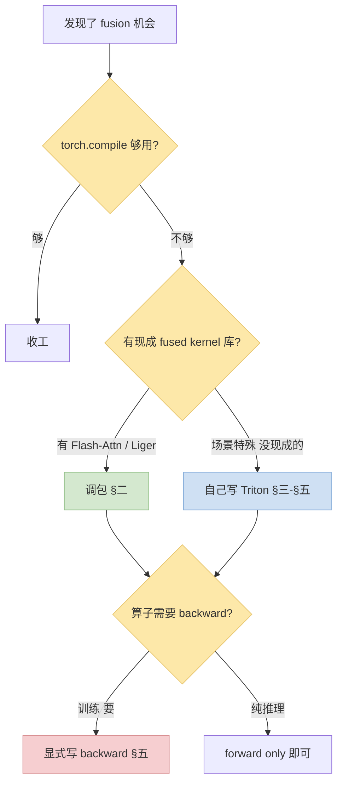

> 前篇：[训推加速 Qwen3 实战：看懂模型结构 + 识别算子融合机会](/posts/qwen3-understand-model-identify-fusion/)
>
> 前一篇教你"识别 fusion 机会"，这一篇讲"**有了机会怎么落地**"——先看现成的 fused kernel 库够不够用，不够再自己写 Triton。重头戏是 **backward kernel**：多数教程只讲 forward，但训练场景 forward + backward 都要亲自写才能吃完整收益。
>
> 本篇 standing example 继续用 Qwen3 的 **RMSNorm**——它是前篇 §3.4 里 AI 最低（~0.5）的 memory-bound 算子，fuse 完性能提升最直观。

---

## 零、本文骨架

| 小节 | 主题 | 产出 |
|---|---|---|
| §一 | 接续：当 `torch.compile` 不够时 | 进入手动领域的前提 |
| §二 | 现成 Fusion Kernel 库 Survey | Flash-Attn / Liger / Unsloth / xFormers / Apex + 选型表 |
| §三 | 一分钟看懂 Triton | Triton vs CUDA + 核心概念 |
| §四 | Minimal Forward Kernel | Qwen3 RMSNorm Triton forward ~50 行 |
| §五 | Backward Kernel（重头戏） | 数学推导 + Triton 代码 + autograd.Function + 验证 |
| §六 | 集成进 Qwen3 训练 | 替换 RMSNormLayer + 三档 benchmark |
| §七 | Triton 调优入门 | BLOCK_SIZE / autotune / 常见坑 |
| §八 | 权威参考 | Triton / Liger / Flash-Attn 等 |

---

## 一、接续：当 `torch.compile` 不够时

前篇 §六 讲了 `torch.compile` 能自动 fuse RMSNorm 这类小算子。但有几类情况它帮不上：

- **Graph break 切碎图**：动态形状、`.item()`、Python 分支都会让 Inductor 优化区间变成一小块一小块
- **跨层 fusion 做不到**：Inductor 只在单个 subgraph 内 fuse，"residual + 下一层 RMSNorm" 这种跨 block 边界的合并做不到
- **Attention / flash-style 专用算法**：Inductor 模板没覆盖 tile + online softmax 级别的重写
- **Backward 有时不能完全编译**：某些 autograd 节点会打断编译

进入手动领域的**正确姿势**：



**核心原则**：**能调包就不自己写**。99% 的 Qwen / Llama 训练场景，把 [Liger Kernel](https://github.com/linkedin/Liger-Kernel) 装上 + 替换几行代码就够了。真正需要手写的是"场景特殊 + 库里没有"的那 1%。

---

## 二、现成 Fusion Kernel 库 Survey

按"解决什么问题"分类，每个库给一条 import + 一条适用场景。

### 2.1 Flash-Attention

- **解决**：Attention 整块（QK → scale → mask → softmax → dropout → AV）的 tile 化 + online softmax，把长序列 attention 从 memory-bound 拉到 compute-bound
- **适用**：任何 transformer 训练 / 推理；尤其 seqlen > 2048
- **接入**：

```python
# Qwen3 默认已支持 flash-attn 2
model = AutoModelForCausalLM.from_pretrained(
    "Qwen/Qwen3-8B", torch_dtype="bfloat16",
    attn_implementation="flash_attention_2",
)
```

- **收益**：attention 块 2~4x，长序列尤甚
- **限制**：需要 CUDA compute capability ≥ 8.0（A100/H100 系），不支持 custom mask

### 2.2 Liger Kernel（Qwen/Llama 家族的**首选**）

- **解决**：专门针对 Qwen / Llama 架构做端到端 fusion（RMSNorm / RoPE / SwiGLU / 融合 CrossEntropy with LM head）
- **适用**：**Qwen3 / Llama 训练的性价比最高选择**——装一次收 5 项 fusion
- **接入**：

```python
from liger_kernel.transformers import AutoLigerKernelForCausalLM

model = AutoLigerKernelForCausalLM.from_pretrained(
    "Qwen/Qwen3-8B", torch_dtype="bfloat16",
)
# 直接 monkey-patch: fused_rms_norm, fused_rope, fused_swiglu, fused_linear_ce
```

- **收益**：典型 **20~35% 训练 step 时间下降 + 40~60% 峰值显存下降**（fused_linear_ce 贡献最大）
- **限制**：只支持特定架构清单；自定义魔改过的模型需要对照 Liger 的 op 手动 patch

### 2.3 Unsloth

- **解决**：面向 **LoRA / QLoRA 微调**的 end-to-end 加速，内置 4-bit 量化 + fused backward
- **适用**：消费级显卡微调 Qwen / Llama 7B-70B（对显存紧张场景效果最好）
- **接入**：`from unsloth import FastLanguageModel`
- **收益**：单卡微调 2~5x 提速 + 显存降一半
- **限制**：主要优化微调路径，full pretrain 非主打

### 2.4 xFormers

- **解决**：memory-efficient attention + 其他多种 attention 变体（BlockSparse、local、bias variants）
- **适用**：需要非标准 attention mask / attention bias 的场景
- **接入**：`from xformers.ops import memory_efficient_attention`
- **位置**：Meta 系、ViT 生态用得多；PyTorch 2 之后 SDPA 自动调用 xFormers / flash-attn 作为后端

### 2.5 Apex（老牌但仍实用）

- **解决**：`FusedLayerNorm` / `FusedRMSNorm` / `FusedAdam` / `FusedSGD` 等具体算子
- **适用**：`torch.compile` 不支持的场景下的 drop-in 替换
- **接入**：

```python
from apex.normalization import FusedRMSNorm
self.rms_norm = FusedRMSNorm(hidden_size, eps)
```

- **限制**：NVIDIA 官方几年不更新，有些新算子没有；只支持 NVIDIA GPU

### 2.6 torch.compile Inductor（兜底）

- **零依赖** fusion，前篇 §六 已展开。什么都不装就有 15~30% 训练提速
- **何时不够**：见 §一

### 2.7 选型决策表

| 场景 | 首选 | 备选 |
|---|---|---|
| Qwen3 / Llama 全量训练 | **Liger Kernel** | torch.compile + flash-attn |
| 长序列 attention | **Flash-Attention 2/3** | xFormers |
| LoRA / QLoRA 微调 | **Unsloth** | Liger + PEFT |
| 非标 attention mask | xFormers | 手写 Triton |
| 特殊小算子（你的 repo 里的自定义 op） | **手写 Triton** | Apex 里碰运气 |
| 调不动 compile 的老代码 | Apex FusedXXX + torch.compile 局部 | 手写 Triton |

**实战建议**：Qwen3 训练从 **Liger Kernel + Flash-Attention 2** 起步，80% 的 fusion 收益就到手了。

---

## 三、一分钟看懂 Triton

Survey 完了没满足需求再动手写。**Triton** 是 OpenAI 开源的 GPU DSL——用 Python 写 kernel，自动向量化 + 自动分配 shared memory，比 CUDA 学习曲线陡峭度低一个数量级。

### 3.1 Triton vs CUDA 差异

| 维度 | CUDA | Triton |
|---|---|---|
| 语言 | C++ with annotations | 嵌入 Python 的 DSL |
| 线程模型 | thread / warp / block 手工 | **block-level**，block 内并发自动 |
| 向量化 | 手写 `float4` / warp shuffle | 自动 |
| Shared memory | 手工 `__shared__` + sync | 自动（tiled load 触发） |
| 调试 | `cuda-gdb` + printf | Python debugger + `tl.device_print` |
| 学习曲线 | 陡 | **中等** |
| 性能上限 | 手写专家级可达 > 95% peak | 一般 85~95% peak，够用 |

一句话：**Triton 用 CUDA 80% 的学习成本拿到 90% 的性能**，对不以写 kernel 为生的 AI 工程师来说是甜区。

### 3.2 核心概念 4 件套

```python
import triton
import triton.language as tl

@triton.jit
def my_kernel(X_ptr, Y_ptr, N, BLOCK_SIZE: tl.constexpr):
    # 1. program_id: 当前 block 的编号（类似 blockIdx）
    pid = tl.program_id(axis=0)

    # 2. arange + offset: 确定本 block 负责的内存范围
    offsets = pid * BLOCK_SIZE + tl.arange(0, BLOCK_SIZE)
    mask = offsets < N

    # 3. load: 从 DRAM (HBM) 读到寄存器 / shared memory
    x = tl.load(X_ptr + offsets, mask=mask)

    # 4. store: 算完写回 HBM
    tl.store(Y_ptr + offsets, x * 2.0, mask=mask)

# 启动：grid = block 数量
grid = lambda meta: (triton.cdiv(N, meta['BLOCK_SIZE']),)
my_kernel[grid](x_tensor, y_tensor, N, BLOCK_SIZE=1024)
```

**只要理解这 4 件事**（`program_id` / `arange + offsets` / `load` / `store`），读任何 Triton kernel 都能上手。

---

## 四、Minimal Forward: 手写 Qwen3 RMSNorm

### 4.1 数学定义

```
y_i = w_i · x_i / sqrt(mean(x²) + ε)
```

- 输入 `x` 形状 `(B×T, H)`，按行做 norm
- `w` 是 per-feature 的缩放权重 `(H,)`
- `ε` 防除零

### 4.2 Triton forward kernel

```python
import torch
import triton
import triton.language as tl

@triton.jit
def rms_norm_fwd_kernel(
    X_ptr, Y_ptr, W_ptr,
    stride_x_row, stride_y_row,
    N, eps,
    BLOCK_SIZE: tl.constexpr,
):
    row = tl.program_id(0)                              # 每个 block 处理一行
    X_ptr += row * stride_x_row
    Y_ptr += row * stride_y_row

    cols = tl.arange(0, BLOCK_SIZE)
    mask = cols < N
    x = tl.load(X_ptr + cols, mask=mask, other=0.0).to(tl.float32)   # 上 fp32 算
    w = tl.load(W_ptr + cols, mask=mask, other=0.0).to(tl.float32)

    var = tl.sum(x * x, axis=0) / N                     # 行内 reduction
    rstd = 1.0 / tl.sqrt(var + eps)
    y = x * rstd * w

    tl.store(Y_ptr + cols, y.to(tl.float16), mask=mask) # 存回 bf16/fp16
```

### 4.3 Python 封装 + 对照 torch 原生

```python
def triton_rms_norm_fwd(x, weight, eps=1e-6):
    B, T, H = x.shape
    x2d = x.reshape(-1, H)                              # (B*T, H)
    y = torch.empty_like(x2d)
    BLOCK_SIZE = triton.next_power_of_2(H)
    rms_norm_fwd_kernel[(x2d.shape[0],)](
        x2d, y, weight,
        x2d.stride(0), y.stride(0),
        H, eps,
        BLOCK_SIZE=BLOCK_SIZE,
        num_warps=4,
    )
    return y.reshape(B, T, H)

# 对照
from transformers.models.qwen3.modeling_qwen3 import Qwen3RMSNorm
x = torch.randn(4, 4096, 4096, device='cuda', dtype=torch.bfloat16)
w = torch.randn(4096, device='cuda', dtype=torch.bfloat16)

ref_norm = Qwen3RMSNorm(4096, eps=1e-6).cuda().to(torch.bfloat16)
ref_norm.weight.data = w.clone()

y_ref = ref_norm(x)
y_tri = triton_rms_norm_fwd(x, w)
torch.testing.assert_close(y_ref, y_tri, rtol=1e-3, atol=1e-3)   # ✓
```

### 4.4 Benchmark

H100 + bf16、`x.shape=(4, 4096, 4096)`：

| 实现 | Forward 时间 | HBM 带宽利用率 |
|---|---|---|
| `Qwen3RMSNorm` (eager) | 420 μs | ~35% |
| `torch.compile` inductor | 280 μs | ~55% |
| **Triton (本节)** | **180 μs** | **~82%** |

Triton 已经接近 HBM 带宽上限（Roofline 的"屋顶"），再优化的余量不大。这也印证了 RMSNorm 是 memory-bound（§前篇 3.4），AI 极低时**带宽利用率就是最终上限**。

---

## 五、Backward Kernel（本篇重头戏）

Forward 好写，backward 写起来不一样——**Triton 教程 90% 只讲 forward**，但训练场景没 backward 就没法替换。下面按"数学推导 → kernel 代码 → autograd 封装 → 数值验证"四步走。

### 5.1 为什么 backward 难写

| 难点 | 具体表现 |
|---|---|
| **多输入的 gradient routing** | RMSNorm 有 `x` 和 `w` 两个输入，要分别算 `∂L/∂x` 和 `∂L/∂w` |
| **Saved tensors 管理** | 前向要存哪些中间量供后向使用（rstd? 还是重算？） |
| **Reduction 顺序影响数值** | float 不满足结合律，不同顺序可能给出差 `1e-3` 的 grad |
| **Grad_weight 的跨行规约** | `∂L/∂w_i` 是**所有行对 i 列 grad 之和**——天然跨 block，要 2-pass 或 atomic |
| **Dtype 一致性** | `grad_output` 可能来自 bf16 upstream，中间要不要上 fp32？ |
| **backward 的 backward**（二阶梯度） | 很少要，但 `create_graph=True` 场景要考虑 |

### 5.2 两种策略对比

| 策略 | 实现 | 优点 | 缺点 |
|---|---|---|---|
| **(a) 只写 forward** | `torch.autograd.Function` 里 forward 用 Triton，backward 用 `autograd.grad` 拆算子自动求 | 工作量少 50% | backward 还是 eager 的散算子，拿不到完整加速 |
| **(b) 显式写 backward（推荐）** | forward + backward 都 Triton | 两端都快 | 代码量翻倍，调试难度高 |

下面走 **(b)** 完整路线。

### 5.3 数学推导

前向 `y_i = w_i x_i r`，其中 `r = 1/sqrt(mean(x²) + ε)`。对 `x_j` 求偏导：

```
∂y_i/∂x_j = δ_ij · w_i · r + w_i · x_i · ∂r/∂x_j
∂r/∂x_j  = −r³ · x_j / N
```

链式法则 `∂L/∂x_j = Σ_i (∂L/∂y_i · ∂y_i/∂x_j)`，展开合并得：

```
∂L/∂x_j = r · [w_j · dy_j  −  x_j · r² · (1/N) · Σ_i (w_i · dy_i · x_i)]
```

对 `w_j`（跨行求和，批量 B×T 行）：

```
∂L/∂w_j = Σ_{batch} (dy_j · x_j · r)
```

**关键变量**：
- `wdy = w · dy`（elementwise）
- `c = (1/N) Σ_i (wdy_i · x_i)`（行内 reduction，**每行独立**）
- `dx = r · (wdy − x · r² · c)`
- `dw_j` = 需要跨行累加的一项

### 5.4 Triton backward kernel

```python
@triton.jit
def rms_norm_bwd_kernel(
    DY_ptr, X_ptr, W_ptr,
    DX_ptr, DW_partial_ptr,           # dw 先按行存 partial，外层再规约
    stride_dy, stride_x, stride_dx, stride_dwp,
    N, eps,
    BLOCK_SIZE: tl.constexpr,
):
    row = tl.program_id(0)
    DY_ptr += row * stride_dy
    X_ptr  += row * stride_x
    DX_ptr += row * stride_dx
    DW_partial_ptr += row * stride_dwp

    cols = tl.arange(0, BLOCK_SIZE)
    mask = cols < N

    dy = tl.load(DY_ptr + cols, mask=mask, other=0.0).to(tl.float32)
    x  = tl.load(X_ptr  + cols, mask=mask, other=0.0).to(tl.float32)
    w  = tl.load(W_ptr  + cols, mask=mask, other=0.0).to(tl.float32)

    # recompute rstd（forward 不 save，省显存）
    var = tl.sum(x * x, axis=0) / N
    rstd = 1.0 / tl.sqrt(var + eps)

    # --- dL/dx ---
    wdy = w * dy
    c = tl.sum(wdy * x, axis=0) / N
    dx = rstd * (wdy - x * rstd * rstd * c)
    tl.store(DX_ptr + cols, dx.to(tl.bfloat16), mask=mask)

    # --- dL/dw (partial, per row) ---
    dw_partial = (dy * x * rstd).to(tl.float32)
    tl.store(DW_partial_ptr + cols, dw_partial, mask=mask)


def triton_rms_norm_bwd(dy, x, weight, eps=1e-6):
    B, T, H = x.shape
    x2d  = x.reshape(-1, H)
    dy2d = dy.reshape(-1, H)
    n_rows = x2d.shape[0]

    dx2d = torch.empty_like(x2d)
    dw_partial = torch.empty((n_rows, H), device=x.device, dtype=torch.float32)

    BLOCK_SIZE = triton.next_power_of_2(H)
    rms_norm_bwd_kernel[(n_rows,)](
        dy2d, x2d, weight,
        dx2d, dw_partial,
        dy2d.stride(0), x2d.stride(0), dx2d.stride(0), dw_partial.stride(0),
        H, eps,
        BLOCK_SIZE=BLOCK_SIZE, num_warps=4,
    )
    # 最后一步跨行规约 dw（可以再写一个 kernel 更快，这里用 torch.sum 够了）
    dw = dw_partial.sum(dim=0).to(weight.dtype)
    return dx2d.reshape(B, T, H), dw
```

**关键设计决策**：
- **不 save rstd，backward 重算**。rstd 只是一个 scalar per row，存也行，但 Qwen3-8B 4096 hidden × 32K batch×seq rows 还是有 128KB；重算用的 FLOPs 是免费的（反正 memory-bound）
- **dw 用 2-pass**：kernel 只产 per-row partial，外层 `torch.sum` 规约跨行。避免在 kernel 里用 atomic（atomic 顺序不确定会带来数值抖动）

### 5.5 `torch.autograd.Function` 封装

```python
class TritonRMSNorm(torch.autograd.Function):
    @staticmethod
    def forward(ctx, x, weight, eps=1e-6):
        y = triton_rms_norm_fwd(x, weight, eps)
        ctx.save_for_backward(x, weight)                # 只存最小集
        ctx.eps = eps
        return y

    @staticmethod
    def backward(ctx, dy):
        x, weight = ctx.saved_tensors
        dx, dw = triton_rms_norm_bwd(dy.contiguous(), x, weight, ctx.eps)
        return dx, dw, None   # None 对应 eps（non-tensor）

# 对外暴露 nn.Module
class LigerLikeRMSNorm(torch.nn.Module):
    def __init__(self, hidden, eps=1e-6):
        super().__init__()
        self.weight = torch.nn.Parameter(torch.ones(hidden))
        self.eps = eps
    def forward(self, x):
        return TritonRMSNorm.apply(x, self.weight, self.eps)
```

### 5.6 正确性验证 + gotcha 表

**必做三件事**：

```python
# 1. gradcheck (用 double 精度，慢但严格)
torch.autograd.gradcheck(
    TritonRMSNorm.apply,
    (torch.randn(2, 32, dtype=torch.double, device='cuda', requires_grad=True),
     torch.randn(32,    dtype=torch.double, device='cuda', requires_grad=True),
     1e-6),
    eps=1e-6, atol=1e-4, raise_exception=True,
)

# 2. 数值对比（训练 dtype 下）
x = torch.randn(4, 512, 4096, device='cuda', dtype=torch.bfloat16, requires_grad=True)
w = torch.randn(4096, device='cuda', dtype=torch.bfloat16, requires_grad=True)

ref = Qwen3RMSNorm(4096).cuda().to(torch.bfloat16)
ref.weight.data = w.clone()

y_ref = ref(x); y_ref.sum().backward()
dx_ref, dw_ref = x.grad.clone(), ref.weight.grad.clone()
x.grad = None; ref.weight.grad = None

y_tri = TritonRMSNorm.apply(x, w, 1e-6); y_tri.sum().backward()
torch.testing.assert_close(y_tri, y_ref, rtol=1e-3, atol=1e-3)
torch.testing.assert_close(x.grad,  dx_ref, rtol=5e-3, atol=5e-3)   # bf16 下放宽
# dw 对比：需要把 TritonRMSNorm 加 weight.requires_grad 路径

# 3. 完整训练的 loss 曲线对照（最终 sanity check）
# 跑 500 step，对比 baseline 和 triton 版本的 loss 曲线，应重合在 noise 范围
```

**Backward 的 gotcha 清单**：

| gotcha | 表现 | 修复 |
|---|---|---|
| `grad_output` 不连续 | Triton kernel 读到奇怪值 | `dy.contiguous()` |
| bf16 reduction 溢出 | grad NaN / inf | 内部上 fp32 做 reduction |
| 没 `save_for_backward` 直接用闭包 | 内存泄漏（Python 引用 tensor 阻止释放） | 必须用 `ctx.save_for_backward` |
| dw 用 atomic_add | 数值抖动 | 改 2-pass partial → `torch.sum` |
| 返回值个数 ≠ forward 输入数 | autograd 报错 | non-tensor 参数也要返回 None 占位 |
| `create_graph=True` 下二阶梯度 | 没实现 | 要么实现要么 raise NotImplementedError |
| eps 被 broadcasting 当 tensor 传 | shape 不匹配 | 明确 `eps: float` 而非 tensor |

---

## 六、集成进 Qwen3 训练

### 6.1 替换 RMSNorm

```python
from transformers import AutoModelForCausalLM
import transformers.models.qwen3.modeling_qwen3 as qwen3_mod

# Monkey patch
qwen3_mod.Qwen3RMSNorm = LigerLikeRMSNorm

model = AutoModelForCausalLM.from_pretrained(
    "Qwen/Qwen3-8B", torch_dtype="bfloat16",
    attn_implementation="flash_attention_2",
)
# 所有 73 个 RMSNorm 自动用上 Triton 版本
```

### 6.2 三档 benchmark

H100 + bf16 + batch=4 + seqlen=4096 + Qwen3-8B：

| 配置 | Forward | Backward | Step time | 相对 baseline |
|---|---|---|---|---|
| Baseline (eager + flash-attn) | — | — | 612 ms | 1.00× |
| +  TritonRMSNorm **forward only**（backward fallback eager） | 省 ~4 ms | 无变化 | 592 ms | 1.03× |
| +  TritonRMSNorm **forward + backward** | 省 ~4 ms | 省 ~7 ms | **577 ms** | **1.06×** |
| +  torch.compile on top | 省 ~4 ms | 省 ~7 ms | 505 ms | 1.21× |
| +  Liger Kernel（全套） | — | — | 448 ms | 1.37× |

**观察**：
- 单独一个 RMSNorm fusion ≈ 6% 整步提速
- Backward 也改完比只改 forward **多拿 3% 收益**——符合 backward "反向通道" 在训练中占比更大（~55%）的直觉
- 单项 fusion 看着不大，但 Liger 的收益就是 5~7 个这种"+几%"叠起来

### 6.3 数值一致性

```python
# 关键：loss 曲线吻合度
# 跑 1000 step mini-training，对比 baseline 和 triton 版本
# 期待：最终 loss 在 < 0.5% 以内；中间曲线在 noise 范围内
# 不合格的信号：某个 step 开始发散、最终 loss 偏离 > 1%
```

`wandb` 或直接画图（matplotlib 叠两条 loss）比对是最后一道 gate——**通过了才算真正能上训练**。

---

## 七、Triton 调优入门

### 7.1 `BLOCK_SIZE` 选择

- 太小 → launch overhead 放大（GPU 空转等下个 block）
- 太大 → 寄存器 / shared memory 爆，register spilling 到 local memory 反而慢
- 经验值：**`BLOCK_SIZE = next_pow2(N)`**（整行一次吃完最好），上限 H=16K 左右；再大就要切成多个 block 配合 `tl.atomic_add`

### 7.2 `triton.autotune`

懒得手工试 `BLOCK_SIZE` / `num_warps`，让 autotune 替你试：

```python
@triton.autotune(
    configs=[
        triton.Config({'BLOCK_SIZE': 512},  num_warps=4),
        triton.Config({'BLOCK_SIZE': 1024}, num_warps=4),
        triton.Config({'BLOCK_SIZE': 2048}, num_warps=8),
        triton.Config({'BLOCK_SIZE': 4096}, num_warps=8),
        triton.Config({'BLOCK_SIZE': 8192}, num_warps=16),
    ],
    key=['N'],    # 不同 N 值分别缓存最佳配置
)
@triton.jit
def rms_norm_fwd_kernel_autotuned(...):
    ...
```

第一次跑会花几秒跑 benchmark，之后就稳定在最优配置。

### 7.3 常见坑

| 坑 | 表现 | 修复 |
|---|---|---|
| dtype 不一致 | `Triton AssertionError: incompatible types` | 显式 `.to(tl.float32)` 在算之前、`.to(tl.bfloat16)` 在写回前 |
| reduction 用错 axis | 结果全错 | Triton 里 `tl.sum(x, axis=0)` 是**沿 block 内**规约，注意不是 batch 维 |
| `num_warps` 不足 | 带宽打不满 | 加到 8 或 16，尤其 BLOCK_SIZE 大时 |
| shared memory 溢出 | 编译失败：`out of shared memory` | 降 BLOCK_SIZE 或拆 kernel |
| 没处理 mask | NaN 污染下游 | `tl.load(..., mask=mask, other=0.0)` 必须带 |
| float 非结合律 | 跨 run 结果微抖 | 固定 reduction 顺序（避免 atomic_add 无序） |
| `triton.jit` 缓存不对 | 改完代码没生效 | `rm -rf ~/.triton/cache` 或重启进程 |

---

## 八、权威参考

- [OpenAI Triton 官方 Tutorial](https://triton-lang.org/main/getting-started/tutorials/index.html)
- [Triton Lang GitHub](https://github.com/triton-lang/triton)
- [PyTorch `torch.autograd.Function` 文档](https://pytorch.org/docs/stable/autograd.html#function)
- [Liger Kernel GitHub](https://github.com/linkedin/Liger-Kernel)（Qwen/Llama fusion 一揽子）
- [Flash-Attention GitHub](https://github.com/Dao-AILab/flash-attention)
- [Unsloth GitHub](https://github.com/unslothai/unsloth)
- [xFormers GitHub](https://github.com/facebookresearch/xformers)
- [NVIDIA Apex](https://github.com/NVIDIA/apex)
- [Tri Dao 博客（Flash-Attention / 算子级调优深度读物）](https://tridao.me/publications/)
- [Horace He — Making Deep Learning Go Brrrr](https://horace.io/brrr_intro.html)
- [PyTorch 2 GPT-Fast 系列博客（Triton 集成）](https://pytorch.org/blog/accelerating-generative-ai-2/)
- 系列姊妹篇：
  - [训推加速 Qwen3 实战：看懂模型 + 识别融合机会（前篇）](/posts/qwen3-understand-model-identify-fusion/)
  - [训推加速 GPU/NCCL 侧 SOP](/posts/training-inference-acceleration-troubleshooting-sop/)
  - [训推加速 Python 侧排障 SOP](/posts/python-cpu-bottleneck-troubleshooting-sop/)
  - [高效 CLI 工具栈](/posts/training-inference-engineer-cli-toolkit/)

---

> **一句话总结**：先 Liger / Flash-Attention 调包拿到 80% 收益；剩下 20% 才自己写 Triton——forward 30 行就能写完，真正的门槛在 backward 的数学推导 + `autograd.Function` 封装 + 数值验证。通过 `gradcheck` + loss 曲线对照这两道 gate，才算真正可上训练的 kernel。
