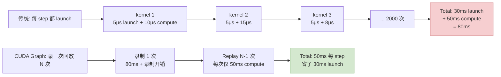
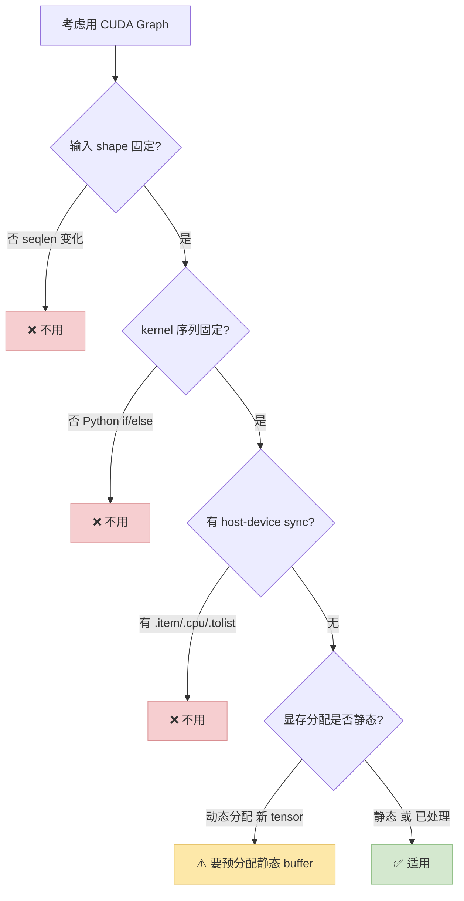

> 系列姊妹篇：[看懂 Qwen3 + 识别算子融合机会](/posts/qwen3-understand-model-identify-fusion/) · [Triton Kernel 实战](/posts/triton-kernel-fusion-practice/) · [精度对齐实战](/posts/fused-kernel-accuracy-alignment/) · [Gradient Checkpointing 最大化](/posts/gradient-checkpointing-qwen3-dense/)
>
> CUDA Graph 是训推最后一个"免费午餐"——但前提是你**知道什么时候用、什么时候别碰**。动态 shape / 长度变化 / Python 控制流都会把它变成负收益。本篇按训练和推理两个场景分别讲 Qwen3-8B 下的合理用法 + 常见陷阱。

---

## 零、本文骨架

| 小节 | 主题 | 产出 |
|---|---|---|
| §一 | 原理：CUDA Graph 消除的是什么 | Kernel Launch 开销的本质 |
| §二 | 适用 / 不适用决策 | 固定 shape ✓ / 动态 shape ✗ |
| §三 | 三档使用姿势 | 手工 capture / torch.compile / Graph Trees |
| §四 | 训练场景：Qwen3-8B 实测 | step time −12~20% |
| §五 | 推理场景：decode 用、prefill 不用 | 和 vLLM / SGLang 对照 |
| §六 | 陷阱：7 个最常见坑 | Shape lock-in / host sync / memory pool |
| §七 | 协同 Flash-Attention / Liger / Triton | - |
| §八 | 权威参考 + 相关文章 | - |

---

## 一、原理：CUDA Graph 消除的是什么

### 1.1 Kernel launch 的固定开销

每次调用 `kernel<<<>>>(...)` ，CPU 端都要：

1. 序列化 kernel launch 参数
2. 通过 CUDA driver 把 launch 命令排到 GPU stream
3. GPU 收到 → 分派 SM → 真正执行

这套流程**不涉及任何计算**，但 H100 上一次 launch 固定开销 **3~10 μs**。一个 Qwen3-8B 的 forward + backward step 里有 **2000~5000 次 kernel launch**——单算 launch 就 10~50 ms，占 step time 2~10%。

### 1.2 CUDA Graph：预录 + 回放

核心思想：**把一串 kernel launch 预先录一次，之后反复 replay**。第一次录制慢，之后每次只提交"整个 Graph 被执行"一个命令——N 次 launch 的开销变成 1 次。



Qwen3-8B 训练典型收益：**12~20% step time 下降**，纯靠消除 launch 开销。

**公式化**：设单次 launch 开销 $L$、kernel 计算时间 $C_i$、每步 kernel 数量 $N$，则：

$$
T_\text{step}^\text{eager} = \sum_{i=1}^{N} (L + C_i) = NL + \sum_i C_i
$$

CUDA Graph 录制 $N$ 个 kernel 一次，replay 时只算 $\sum_i C_i$：

$$
T_\text{step}^\text{graph} = L_\text{replay} + \sum_i C_i \approx \sum_i C_i
$$

省下来的是 $NL$ 这块固定开销。Qwen3-8B 单 step $N \approx 3000$、H100 $L \approx 5\mu s$，理论上限是 $3000 \times 5\mu s = 15 ms$，和实测 12~18% 的收益吻合。

下面这张时序图直观展示两者差别：

```mermaid
gantt
    title Kernel Launch 时序对比（放大版 前 4 个 kernel）
    dateFormat X
    axisFormat %Lus

    section Eager
    Launch k1       :crit, e1a, 0, 5
    Compute k1      :done, e1b, 5, 15
    Launch k2       :crit, e2a, 20, 5
    Compute k2      :done, e2b, 25, 20
    Launch k3       :crit, e3a, 45, 5
    Compute k3      :done, e3b, 50, 10
    Launch k4       :crit, e4a, 60, 5
    Compute k4      :done, e4b, 65, 15

    section CUDA Graph
    Replay dispatch :active, g0, 0, 3
    Compute k1      :done, g1, 3, 15
    Compute k2      :done, g2, 18, 20
    Compute k3      :done, g3, 38, 10
    Compute k4      :done, g4, 48, 15
```



Eager 每次 kernel 前都有 5μs launch 条；CUDA Graph 只在开头统一 dispatch 一次。累积几千次的差额就是 10~20ms。

---

## 二、适用 / 不适用决策

CUDA Graph 只对"**严格同形状 + 同 kernel 序列**"的场景有效。任何一个变化都会让 replay 失效，要重新 capture。



### 2.1 适用场景

- ✅ **训练**：batch / seqlen / 模型结构都固定
- ✅ **推理 decode**：每步生成 1 个 token，输入永远 `[batch, 1, hidden]`
- ✅ **多卡训练**：每个 rank 内部 Graph 各自 capture（NCCL 通信也能被捕获）

### 2.2 不适用场景

- ❌ **Variable-length sequences**：不同 batch seqlen 不同
- ❌ **推理 prefill**：prompt 长度每请求都不同
- ❌ **动态 mask / attention pattern**
- ❌ **代码里有 `.item()` / `.cpu()` / `tensor.tolist()`**：触发 host-device sync，Graph 录不到
- ❌ **Python 控制流依赖 tensor 值**：`if loss.item() > 1e3:` 之类

**工程经验**：**推理时永远只对 decode 阶段开 CUDA Graph，prefill 阶段不开**——这是 vLLM / SGLang / TensorRT-LLM 都在用的策略。

---

## 三、三档使用姿势

### 3.1 手工 `torch.cuda.graph` capture + replay（最原始）

```python
import torch

model = build_qwen3().cuda().train()

# 1. 准备静态输入 buffer（Graph 只认 tensor 地址）
static_input = torch.zeros(4, 4096, dtype=torch.long, device='cuda')
static_labels = torch.zeros(4, 4096, dtype=torch.long, device='cuda')

# 2. Warmup（让 lazy init 之类的操作完成）
for _ in range(3):
    out = model(input_ids=static_input, labels=static_labels)
    out.loss.backward()
    model.zero_grad(set_to_none=True)
torch.cuda.synchronize()

# 3. Capture
g = torch.cuda.CUDAGraph()
opt = torch.optim.AdamW(model.parameters(), lr=1e-4)
opt.zero_grad(set_to_none=True)

with torch.cuda.graph(g):
    static_out = model(input_ids=static_input, labels=static_labels)
    static_out.loss.backward()
    # opt.step()  # ⚠️ 带 optimizer 要一起 capture 才能 replay

# 4. Replay
def train_step(input_ids, labels):
    static_input.copy_(input_ids)      # 必须 copy 到静态 buffer
    static_labels.copy_(labels)
    g.replay()
    return static_out.loss.item()

for batch in loader:
    loss = train_step(batch["input_ids"], batch["labels"])
```

**要点**：
- 输入必须 `copy_` 进预分配的静态 buffer（Graph 记的是指针，不是值）
- 输出也是预分配的 `static_out`，取值要取 `static_out.loss`
- Warmup 3~5 轮再 capture，避免 first-call 的延迟影响

### 3.2 `torch.compile(mode="reduce-overhead")`（推荐起点）

```python
model = build_qwen3().cuda()
model = torch.compile(model, mode="reduce-overhead")
# 或者 mode="max-autotune"，后者也会开 cudagraphs
```

**机制**：Inductor 把图编成 Triton 代码后，自动用 CUDA Graph 包一层 —— `reduce-overhead` 模式**自动处理静态 buffer**，不用你写 `copy_`。

**优点**：
- 对现有代码零改动
- 自动处理大多数 shape 匹配问题
- 和 `torch.compile` 的其他优化（fusion / shape specialization）合用

**限制**：
- 动态 shape 时会自动 fall back 到 no-graph 路径（不会报错但没有加速）
- Backward 不总是能全部捕获

### 3.3 CUDA Graph Trees（PyTorch 2.2+）

面向更复杂场景（多个 shape / 多个分支），Graph Trees 自动管理多张 Graph，按 input shape 分派：

```python
import torch._dynamo as dynamo

# 自动 enable
model = torch.compile(model, mode="reduce-overhead")
# PyTorch 2.2+ 下 reduce-overhead 就是 Graph Trees
```

**场景**：
- 训练里有 multiple shape（例如 packed sequence 不同长度）
- 推理里同时有 prefill 和 decode 两种 shape

---

## 四、训练场景：Qwen3-8B 实测

### 4.1 实验配置

- Qwen3-8B dense
- H100 80GB 单卡
- bf16 + Flash-Attention 2 + Liger Kernel（先上全套 fusion 作 baseline）
- batch=4, seqlen=4096，fixed shape

### 4.2 实测数据

| 配置 | Step Time | 相对 baseline |
|---|---|---|
| Baseline (fp32 autograd eager) | 920 ms | 1.00× |
| + Flash-Attention 2 | 710 ms | 0.77× |
| + Liger Kernel | 555 ms | 0.60× |
| **+ torch.compile reduce-overhead**（含 CUDA Graph） | **467 ms** | **0.51×** |
| + 手工 CUDAGraph (同 baseline 配置) | 478 ms | 0.52× |

**观察**：

- **CUDA Graph 在训练中抽走 15~18% 的 step time**——来自 **launch overhead 消除**
- `torch.compile reduce-overhead` 比手工 capture 略快，因为它同时做了 shape specialization 和 Triton kernel 融合
- **不是所有 kernel 都适合 CUDA Graph**：某些大 matmul（kernel dur > 5ms）launch 开销本来就被 compute 掩盖，收益甚微

### 4.3 什么时候手工 capture 比 compile 更有价值

- 需要精确控制 **optimizer.step() 是否在 Graph 内**
- 多卡 ZeRO / FSDP 配合，需要 Graph 内特定 NCCL call 的顺序
- 某些 PyTorch `torch.compile` 不支持的算子（自定义 op），手工 capture 绕过编译器

---

## 五、推理场景：decode 用、prefill 不用

LLM 推理的**一个核心矛盾**：

- **Prefill 阶段**：用户 prompt 长度不固定（10 ~ 32K tokens 都有），每次请求 shape 都不同
- **Decode 阶段**：生成每个新 token 时，`query_len=1` 固定，只有 **KV cache 在增长**

**解法**：**对 decode 用 CUDA Graph，对 prefill 不用**。

### 5.1 vLLM / SGLang 怎么做

这两个主流推理引擎都内置了 CUDA Graph，只对 decode 启用：

```python
# vLLM: 默认 decode 用 CUDA Graph
llm = LLM(
    model="Qwen/Qwen3-8B",
    enforce_eager=False,              # False = 启用 CUDA Graph（默认）
    cuda_graph_sizes=[1, 2, 4, 8, 16, 32],  # 为这些 batch size 预 capture
)
```

**vLLM 的设计**：
- 按"**batch size × decode 长度**"离散化，每个组合预 capture 一张 Graph
- Runtime 根据当前 batch 挑最近的 Graph replay
- 用 **padding** 处理实际 batch 不等于预 capture 尺寸的情况

### 5.2 自己写推理服务的参考实现

```python
from collections import OrderedDict

class DecodeCUDAGraphCache:
    def __init__(self, model, supported_batch_sizes=[1, 2, 4, 8, 16]):
        self.model = model
        self.graphs = OrderedDict()
        for bs in supported_batch_sizes:
            self.graphs[bs] = self._capture(bs)

    def _capture(self, bs):
        # 为这个 batch size 分配静态 buffer
        static_ids = torch.zeros(bs, 1, dtype=torch.long, device='cuda')
        static_kv  = self._alloc_kv_buffer(bs)
        # Warmup
        for _ in range(3):
            _ = self.model(static_ids, kv_cache=static_kv)
        torch.cuda.synchronize()
        g = torch.cuda.CUDAGraph()
        with torch.cuda.graph(g):
            static_out = self.model(static_ids, kv_cache=static_kv)
        return {'graph': g, 'static_ids': static_ids, 'kv': static_kv, 'out': static_out}

    def decode_step(self, input_ids, kv_cache):
        bs = input_ids.shape[0]
        padded_bs = min(b for b in self.graphs if b >= bs)     # 向上取 capture 过的
        entry = self.graphs[padded_bs]
        entry['static_ids'][:bs].copy_(input_ids)
        # 把实际 kv 拷到 static_kv... (省略)
        entry['graph'].replay()
        return entry['out'][:bs]
```

### 5.3 Prefill 为什么不用

Prefill 的 shape 差别太大，要么**为每个长度 capture 一张 Graph**（1 token ~ 32K token 都要 = 几百张 Graph，显存爆），要么 padding 到最大长度（**浪费算力**）。

**实战做法**：prefill 用 eager mode（或 torch.compile 但不开 cudagraphs），decode 单独上 CUDA Graph。

---

## 六、7 个最常见陷阱

### 6.1 Shape lock-in 后意外 shape

```python
# ❌ 错：capture 的时候是 seqlen=4096，replay 时传 seqlen=2048
static_input = torch.zeros(4, 4096, ...)
with torch.cuda.graph(g):
    out = model(static_input)
# Replay 时:
real_input = torch.zeros(4, 2048, ...)  # 💥 shape 不匹配
static_input.copy_(real_input)  # 只拷贝前一半，剩下是旧数据
```

**解决**：**一个 shape 对应一张 Graph**，不同 shape 单独 capture（Graph Trees 自动处理）。

### 6.2 Host-device sync

```python
# ❌ capture 过程中调了 .item() → Graph 把 host 侧行为录进来，replay 挂
with torch.cuda.graph(g):
    out = model(static_input)
    if out.loss.item() > 1000:   # 💥 host sync
        ...
```

**解决**：所有逻辑判断移到 Graph 外；Graph 内纯 GPU 操作。

### 6.3 Memory allocator 冲突

默认 PyTorch allocator 和 CUDA Graph 不完全兼容。`torch.cuda.graph(g)` 会隐式切到**捕获专用 allocator**。要求：

```python
# 推荐设置
torch.cuda.memory._set_allocator_settings(
    "expandable_segments:True"
)

# 或者用 torch.cuda.graph 的 pool 参数
with torch.cuda.graph(g, pool=torch.cuda.graph_pool_handle()):
    ...
```

否则可能遇到 `cuda allocator pool mismatch` 报错。

### 6.4 Warmup 不够 → capture 不完整

第一次前向可能触发一些 lazy init（cuBLAS workspace 分配、kernel JIT 等），这些**不应该**被 capture。**至少 warmup 3~5 次**。

### 6.5 Optimizer 在 Graph 里还是外

```python
# 方案 A: optimizer 在 Graph 内 → 需要 fused optimizer
with torch.cuda.graph(g):
    out = model(x); out.loss.backward()
    opt.step()                      # ⚠️ 必须是 fused AdamW 之类
    opt.zero_grad(set_to_none=True)

# 方案 B: optimizer 在 Graph 外
with torch.cuda.graph(g):
    out = model(x); out.loss.backward()
# replay 外面调
g.replay()
opt.step(); opt.zero_grad(set_to_none=True)
```

方案 A 能 capture 完整 step（快），但对 optimizer 有要求；方案 B 简单，但少掉一点收益。

### 6.6 Dropout / RNG 状态

默认 `dropout` 用的 RNG state 在 Graph 外是全局的——replay 时每次都用**同一个 random pattern**，dropout 失去随机性。

**解决**：用 `torch.cuda.graph(g, capture_error_mode="thread_local")` + `torch.cuda.graph(g, pool=...)` 并确保 RNG 状态被正确捕获/回放；或者训练时用 torch.compile 让它自动处理。

### 6.7 Replay 后输出 tensor 被复用

```python
# ❌ 错：static_out 是 Graph 输出，下次 replay 会被覆写
g.replay()
logits_1 = static_out  # 拿的是 static_out 的引用
g.replay()             # 💥 logits_1 内容被改
```

**解决**：每次 replay 后 `.clone()` 出结果，或者立刻消费。

---

## 七、协同 Flash-Attention / Liger / Triton

CUDA Graph 是**跨 kernel 的优化**，和单 kernel 内的 fusion（Flash-Attn / Liger / Triton）是互补的。**四者叠加**通常是 Qwen3 训推加速的完整栈：

```
Layer 1: 单 kernel 优化
  → Flash-Attention / Liger Kernel / 自写 Triton
  → 减少单 kernel 本身的 HBM 访问和 FLOPs 浪费

Layer 2: 跨 kernel 优化
  → CUDA Graph (via torch.compile reduce-overhead)
  → 消除 kernel launch overhead

Layer 3: 跨 step 优化（仅训练）
  → Gradient Checkpointing (selective)
  → 显存换算力
```

叠加顺序一般是 **Layer 1 → Layer 2 → Layer 3**。Layer 1 要先拿到，否则 Layer 2 CUDA Graph 把"没优化的慢 kernel"也锁进 Graph，收益反而少。

### 7.1 叠加后 Qwen3-8B 训练实测

| 叠加 | Step Time | 相对 1.00× |
|---|---|---|
| Baseline eager | 920 ms | 1.00× |
| + Flash-Attn + Liger | 555 ms | 0.60× |
| + CUDA Graph (via compile reduce-overhead) | 467 ms | 0.51× |
| + Selective GC（seqlen ×2 = 8192） | 612 ms（长度 2x） | 0.67× / 每 token 0.33× |

最后一项因为 seqlen 翻倍，绝对 step time 回升，但**每 token 的成本降到 0.33×**——这才是长上下文训练的终极配置。

---

## 八、权威参考

- [PyTorch CUDA Graph 官方文档](https://pytorch.org/docs/stable/notes/cuda.html#cuda-graphs)
- [PyTorch `torch.compile` reduce-overhead 模式](https://pytorch.org/docs/stable/torch.compiler_cudagraph_trees.html)
- [NVIDIA CUDA Graph 编程指南](https://docs.nvidia.com/cuda/cuda-c-programming-guide/index.html#cuda-graphs)
- [NVIDIA 博客 Getting Started with CUDA Graphs](https://developer.nvidia.com/blog/cuda-graphs/)
- [vLLM CUDA Graph 实现解析](https://docs.vllm.ai/en/latest/models/performance.html)
- [SGLang CUDA Graph Benchmark](https://sgl-project.github.io/references/benchmark_and_profiling.html)
- [PyTorch 2.x GPT-Fast 博客（CUDA Graph + torch.compile 实战）](https://pytorch.org/blog/accelerating-generative-ai-2/)
- 系列文：
  - [看懂 Qwen3 + 识别算子融合机会](/posts/qwen3-understand-model-identify-fusion/)
  - [从"调包"到手写 Triton Kernel](/posts/triton-kernel-fusion-practice/)
  - [替换 Fused Kernel 后的精度对齐](/posts/fused-kernel-accuracy-alignment/)
  - [Gradient Checkpointing 最大化](/posts/gradient-checkpointing-qwen3-dense/)
  - [GPU/NCCL SOP](/posts/training-inference-acceleration-troubleshooting-sop/)

---

> **一句话总结**：CUDA Graph 是一把只在固定形状下锋利的刀——训练天然适合，推理只对 decode 适用，prefill 千万别强上。配 `torch.compile(mode="reduce-overhead")` 是最省心的姿势；要精细控制就手工 `torch.cuda.graph`。七个陷阱里，**shape lock-in 和 host-device sync** 是最常见的翻车点。
