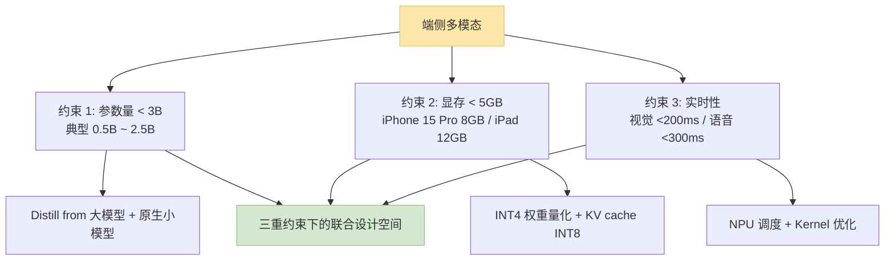
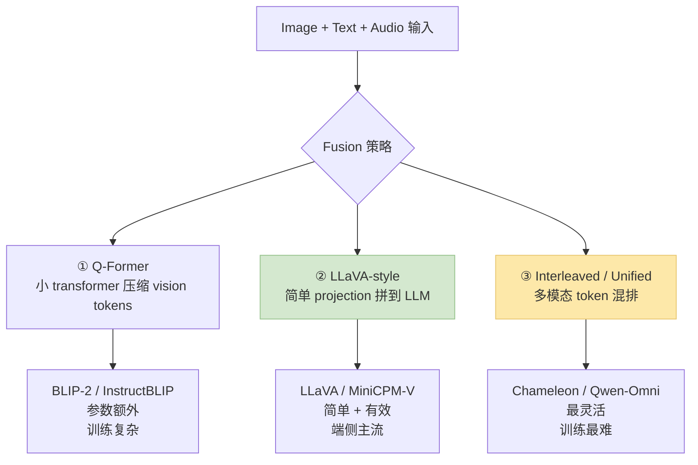
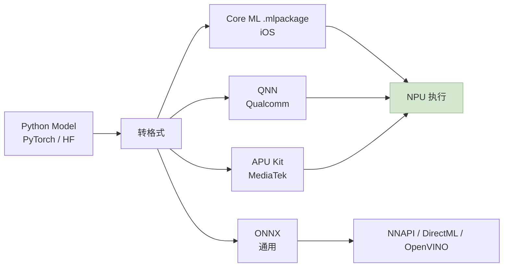
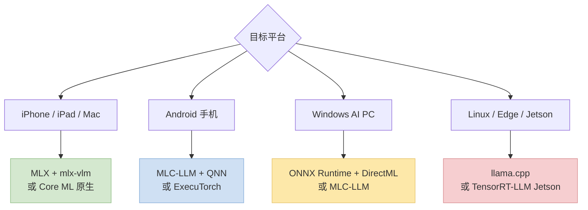

> 训推加速系列深化之"端侧多模态"专题。2024~2026 多模态模型从"云端专属"下沉到"手机 / 笔记本 / 嵌入式"——**<3B 参数 + <5GB 显存 + 实时性** 三重约束下的端到端多模态加速栈。
>
> 姊妹篇：[训推加速技术地图](/posts/training-inference-acceleration-map/) · [语音 / 音频加速](/posts/speech-audio-acceleration-stack/) · [MoE→Dense 蒸馏](/posts/moe-to-dense-distillation/)
>
> ⚠️ **时效声明（最后更新：2026-05-08）**：MiniCPM-o 4.0 / Gemma 3n / Qwen3-Omni 手机端都是 2025~2026 的新东西，本文反映 2026 年中快照。

---

## 零、本文骨架

| 小节 | 主题 | 产出 |
|---|---|---|
| §一 | 端侧多模态的 3 个硬约束 | 参数 / 显存 / 延迟 |
| §二 | 视觉侧加速 | SigLIP / DINOv3 INT8 / Token Pruning |
| §三 | 语音侧加速 | Mimi / XCodec 双流 tokenizer 在端侧 |
| §四 | LLM 侧加速 | 端侧 3B 以下模型 + INT4 量化 |
| §五 | 多模态 fusion 策略 | Q-Former / LLaVA / Interleave |
| §六 | **NPU 调度**：ANE / Hexagon / APU | 硬件端到端 |
| §七 | 框架选型：MLX / MLC-LLM / ExecuTorch / llama.cpp | 矩阵对比 |
| §八 | 案例：MiniCPM-o 在 iPhone 上的拆解 | 延迟预算 |
| §九 | 2026 端侧多模态 SOTA 配置 | 按设备 |
| §十 | 权威参考 | - |

---

## 一、端侧多模态的 3 个硬约束



### 1.1 参数量约束的现实

| 设备 | 实际可跑最大 LLM | 推荐多模态模型参数 |
|---|---|---|
| iPhone 15/16 Pro | 3B (INT4) | 2B |
| M2 MacBook | 7B | 4B |
| 高通骁龙 8 Gen 3 手机 | 3B | 2B |
| 联发科天玑 9400 | 7B | 4B |
| Raspberry Pi 5 | 1B | 0.5B |

### 1.2 显存账本

一个 2B 多模态模型的端侧显存：

| 组成 | 大小 |
|---|---|
| 权重 (INT4) | ~1.2 GB |
| KV cache (INT8, 4K ctx) | ~500 MB |
| Vision encoder (INT8) | ~300 MB |
| Audio tokenizer (INT8) | ~100 MB |
| Activation / workspace | ~500 MB |
| **Total** | **~2.5 GB** |

再加 OS / 其它 app ~2GB，**8GB 手机刚好能跑**。

### 1.3 实时性约束

用户体感的延迟阈值：

- **视觉 QA**：输入图 + 问 → < 2s 输出
- **语音对话**：语音输入 → < 300ms TTFT + < 50ms ITL
- **图生文**：< 500ms 内见第一个 token

---

## 二、视觉侧加速

### 2.1 视觉 encoder 选型

| Encoder | 参数 | 输出 token 数 (224px) | 质量 | 端侧友好 |
|---|---|---|---|---|
| CLIP ViT-L/14 | 300M | 256 | 基线 | 一般 |
| **SigLIP** | 300M~400M | 256 | 好 | ✅ |
| **SigLIP 2** (2025) | 300M~900M | 256 | **SOTA** | ✅ |
| **DINOv3** (2025) | 1B | 可变 | 强（细粒度） | ⚠️ 大 |

**2026 端侧默认**：**SigLIP 2 base / large** INT8，占 ~200~400MB。

### 2.2 INT8 量化

视觉 encoder 几乎**都是 compute-bound**（ViT）——INT8 量化在 NPU 上直接 2~4× 吞吐。

```python
# Apple MLX 示例
from mlx_vlm import load, apply_int8_quantization
model, processor = load("mlx-community/SigLIP2-large-patch16-224-int8")
```

### 2.3 Token Pruning（视觉特有）

SigLIP 输出 256 tokens 给 LLM。但**很多 token 是冗余**的（图像的背景 / 空白区）。

**Token Pruning** 思路：
- Attention rollout 算各 token 对 [CLS] 的贡献
- 保留 Top-K 重要的（典型 K=64 or 128）
- LLM 输入序列从 256 → 64，**4× 加速**

2024~2025 主流方案：
- **ToMe**（Token Merging）
- **LLaVA-PruMerge**（50~95% 减）
- **FastV**（推理时在特定 layer 砍 token）

---

## 三、语音侧加速

### 3.1 端侧 Audio Tokenizer

端侧多模态处理语音有两种路径：

| 路径 | 代表 | 优缺点 |
|---|---|---|
| **传统 ASR + LLM + TTS 级联** | Whisper-tiny + LLM + Kokoro | 简单，但延迟累加 |
| **端到端 Audio Token**（推荐） | Mimi / XCodec + Omni LLM | 首字延迟低 |

### 3.2 Mimi / XCodec 在端侧

Mimi / XCodec 是 ~80~200M 参数的 codec，**端侧完全跑得起来**：

- 编码器 INT8 → ~50MB
- 解码器 INT8 → ~50MB
- 单路音频 encode: <50ms @ M2
- 单路 decode: <30ms @ M2

### 3.3 端侧 Full-duplex 的可行性

2025 已有 demo：
- **Moshi on M2 Max**：4B 参数版本可以在笔记本上跑 full-duplex，< 400ms TTFT
- **Qwen2.5-Omni 7B INT4 on iPad M4**：语音对话接近实时

手机上 full-duplex 还在探索中，典型做法是**语义流跑 LLM，声学流外挂**。

---

## 四、LLM 侧加速

### 4.1 端侧小模型候选

| 模型 | 参数 | 量化后大小 (INT4) | 多模态 |
|---|---|---|---|
| **Qwen3-0.5B** | 0.5B | ~300 MB | 需适配 |
| **Qwen3-1.8B** | 1.8B | ~1.1 GB | 需适配 |
| **SmolLM2 1.7B** | 1.7B | ~1 GB | ❌ 纯文本 |
| **Phi-4-mini (3.8B)** | 3.8B | ~2.3 GB | ⚠️ 文本强 |
| **Gemma 3n (E2B, E4B)** | 1.5B / 3B | ~1~2 GB | ✅ 原生多模态 |
| **MiniCPM-o 2.6** | 8B | ~5 GB (INT4) | ✅ Omni |
| **MiniCPM-o 4.0**（推测） | 2~4B | ~2 GB | ✅ 下一代 |
| **Qwen3-Omni small**（推测） | 3B | ~2 GB | ✅ Omni |

### 4.2 INT4 量化

| 算法 | 典型掉点 | 适用 |
|---|---|---|
| **AWQ** | < 0.3 perplexity | 通用首选 |
| **GPTQ** | < 0.5 | 也很常见 |
| **GGUF Q4_K_M** | < 0.3 | llama.cpp 生态默认 |
| **NF4**（QLoRA）| 稍大 | 训练 + 推理一体 |
| **MLX 4-bit** | 接近 AWQ | Apple 系 |

### 4.3 Speculative Decoding 在端侧

端侧也能上 SD——用 **DFlash**（轻量 fused kernel 变体）：
- Target: 1.8B 主模型
- Draft: 0.5B 更小模型
- Accept rate ~0.7
- 实测 M2 上 **decode 1.5~2× 加速**

---

## 五、多模态 fusion 策略

### 5.1 三种主流 fusion



### 5.2 端侧首选：LLaVA-style + projection

```
Vision encoder (SigLIP-Base, 86M INT8, ~40MB)
    ↓
Projection MLP (2-layer, ~5M)
    ↓ (256 tokens → LLM embedding 空间)
LLM (Qwen3-1.8B INT4, ~1GB)
    ↓
Output
```

**为什么端侧首选这个**：
- 部署简单：vision / projection / LLM 可独立量化
- 训练成本低：fine-tune projection 即可
- 模态之间弱耦合：可以 vision off-loading 或 streaming

### 5.3 2026 端侧 Omni 模型路线

- **Gemma 3n**：Google 的"matryoshka" design，**一个模型多个有效子模型**，按设备能力激活不同子集
- **MiniCPM-o 4.0**：面壁路线，Audio + Vision + Text 统一 tokenizer
- **Qwen3-Omni small**：阿里推测路线

---

## 六、NPU 调度：硬件端到端加速

### 6.1 三大移动 NPU 架构

| 厂商 | NPU | 算力 (INT8) | 用于 |
|---|---|---|---|
| Apple | **ANE (Neural Engine)** | ~38 TOPS (A18 Pro) | iPhone / iPad / Mac |
| Qualcomm | **Hexagon NPU** | ~45 TOPS (8 Elite) | 安卓旗舰 |
| MediaTek | **APU** | ~60 TOPS (天玑 9400) | 安卓中高端 |
| Intel | **NPU (Core Ultra)** | ~40 TOPS | Windows AI PC |
| AMD | **XDNA** | ~50 TOPS | Ryzen AI 笔记本 |

### 6.2 NPU 调度的坑

**NPU 很强但有前提**：
- **只支持固定 shape + INT8 kernels**（动态 shape / FP16 要降级 CPU / GPU）
- **Transformer 算子支持有限**，GQA / RoPE 等新算子可能不原生
- **模型必须 compile 成 NPU-friendly 格式**（Core ML / QNN / AFM）

### 6.3 端到端优化



**工程链路**：
- PyTorch → `coremltools` → `.mlpackage` → ANE
- PyTorch → QNN SDK → `.bin` → Hexagon

---

## 七、框架选型：MLX / MLC-LLM / ExecuTorch / llama.cpp

### 7.1 对比矩阵

| 框架 | 出品 | 主打 | 多模态支持 | NPU 加速 |
|---|---|---|---|---|
| **llama.cpp** | ggerganov | CPU-first，GGUF | ⚠️ Vision 需 llava.cpp | 部分 |
| **MLX** | Apple | Apple 硬件原生 | ✅ mlx-vlm | ✅ ANE |
| **MLC-LLM** | CMU / TVM | 跨平台编译 | ✅ | ✅ |
| **ExecuTorch** | PyTorch | 官方端侧运行时 | ✅ | ✅ |
| **ONNX Runtime** | Microsoft | 通用 | ✅ | ✅ |
| **TensorRT-LLM** | NVIDIA | Jetson 端 | ✅ | ⚠️ |

### 7.2 按平台选择



### 7.3 实战样例

**iPhone（MLX 路线）**：

```python
from mlx_vlm import load, generate
model, processor = load("mlx-community/MiniCPM-V-2.6-mlx-int4")

response = generate(model, processor,
    image="photo.jpg",
    prompt="描述这张图",
    max_tokens=100,
)
```

**Android（MLC-LLM 路线）**：

```bash
# 1. 模型编译
python3 -m mlc_llm compile Qwen3-1.8B-Instruct \
    --quantization q4f16_1 \
    --device qualcomm \
    --output qwen3.bin

# 2. Android app 加载 + 推理（Kotlin / Swift）
```

---

## 八、案例：MiniCPM-o 在 iPhone 上的拆解

### 8.1 模型概览

MiniCPM-o 2.6（8B 参数，INT4）已在 iPhone 15 Pro / iPad M4 跑通：
- 视觉 encoder: SigLIP-SO400M
- Audio encoder: Whisper-like
- LLM: Qwen2-7B base
- Total INT4: ~5 GB

### 8.2 端侧延迟 budget（实测量级）

```mermaid
gantt
    title MiniCPM-o 2.6 一轮图片问答延迟（iPhone 15 Pro, 示意）
    dateFormat X
    axisFormat %Lms

    section 处理流
    图片预处理 resize       :done, p1, 0, 50
    Vision encode ANE       :active, p2, 50, 150
    Vision-to-LLM project   :done, p3, 200, 20
    LLM prefill (prompt 100 token)   :crit, p4, 220, 400
    LLM decode 第 1 token   :p5, 620, 60

    section 总体
    用户感受 TTFT           :milestone, m1, 680, 0
```



**总 TTFT ~680ms**——接近实时。

### 8.3 关键优化点

- **Vision encoder 跑 ANE**（不是 GPU）：快 ~2×
- **LLM 跑 Metal GPU**：ANE 不支持某些 attention 变体
- **Audio tokenizer INT8 on ANE**
- **KV cache INT8 + Paged**

---

## 九、2026 端侧多模态 SOTA 配置

### 9.1 iPhone 15/16 Pro / iPad M4

```
模型: MiniCPM-o 4.0 / Qwen3-Omni-small (~3B 激活)
量化: INT4 权重 + INT8 KV cache + INT8 Vision
框架: MLX + mlx-vlm
NPU: ANE 处理 vision encoder + 部分 LLM
期望: 图片问答 TTFT < 800ms；语音对话 TTFT < 500ms
```

### 9.2 Android 旗舰（8 Elite / 天玑 9400）

```
模型: Gemma 3n (E4B) 或 Qwen3-1.8B + vision adapter
量化: INT4 AWQ / GGUF Q4_K_M
框架: MLC-LLM + QNN（骁龙）或 MTK APU Kit
NPU: Hexagon / APU
期望: 图片 TTFT < 1s；简单对话接近实时
```

### 9.3 Windows AI PC

```
模型: Phi-4-mini / Qwen3-3B
量化: INT4 + ONNX / DirectML
框架: ONNX Runtime + DirectML
NPU: Intel / AMD NPU
期望: 接近云端体验
```

### 9.4 嵌入式（树莓派 / Jetson Nano）

```
模型: Qwen3-0.5B + SigLIP-Tiny
量化: INT4 GGUF
框架: llama.cpp + llava.cpp
NPU: 无 / Jetson GPU
期望: 可用 but 延迟 2~5s
```

---

## 十、权威参考

**论文 / 技术报告**：
- [MiniCPM-o 2.6 Technical Report (面壁)](https://openbmb.vercel.app/minicpm-o-2_6)
- [Gemma 3 / Gemma 3n (Google)](https://blog.google/technology/developers/gemma-3/)
- [SigLIP 2 (Google, 2025)](https://arxiv.org/abs/2502.14786)
- [DINOv3 (Meta, 2025)](https://arxiv.org/abs/2508.10104)
- [LLaVA 系列](https://arxiv.org/abs/2304.08485)
- [Token Merging (Meta, 2022)](https://arxiv.org/abs/2210.09461)
- [FastV (2024)](https://arxiv.org/abs/2403.06764)

**框架**：
- [Apple MLX](https://github.com/ml-explore/mlx)
- [mlx-vlm](https://github.com/Blaizzy/mlx-vlm)
- [MLC-LLM](https://github.com/mlc-ai/mlc-llm)
- [ExecuTorch](https://github.com/pytorch/executorch)
- [llama.cpp](https://github.com/ggerganov/llama.cpp)
- [llava.cpp (multimodal)](https://github.com/ggerganov/llama.cpp/tree/master/examples/llava)
- [Core ML Tools](https://github.com/apple/coremltools)
- [ONNX Runtime](https://github.com/microsoft/onnxruntime)

**模型仓库**：
- [MiniCPM-o](https://github.com/OpenBMB/MiniCPM-o)
- [Qwen-VL / Qwen2.5-Omni](https://github.com/QwenLM/Qwen2.5-Omni)
- [Gemma 3n Hugging Face](https://huggingface.co/google/gemma-3n-E4B-it)

**系列文**：
- [训推加速技术地图](/posts/training-inference-acceleration-map/)
- [语音 / 音频加速](/posts/speech-audio-acceleration-stack/)
- [MoE → Dense 蒸馏](/posts/moe-to-dense-distillation/)（端侧模型往往是 MoE 蒸馏出来的）

---

> **一句话总结**：端侧多模态 2026 的 SOTA 配方 = **小模型（< 3B 激活）+ INT4 量化 + NPU 调度 + Vision Token Pruning**。iPhone 15 Pro / M4 iPad 已经能跑接近实时的图片问答 / 语音对话；真正的普及要靠 **Gemma 3n / MiniCPM-o 4.0 / Qwen3-Omni-small** 这批 2B~4B 原生多模态小模型的迭代。
