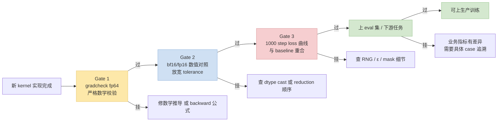
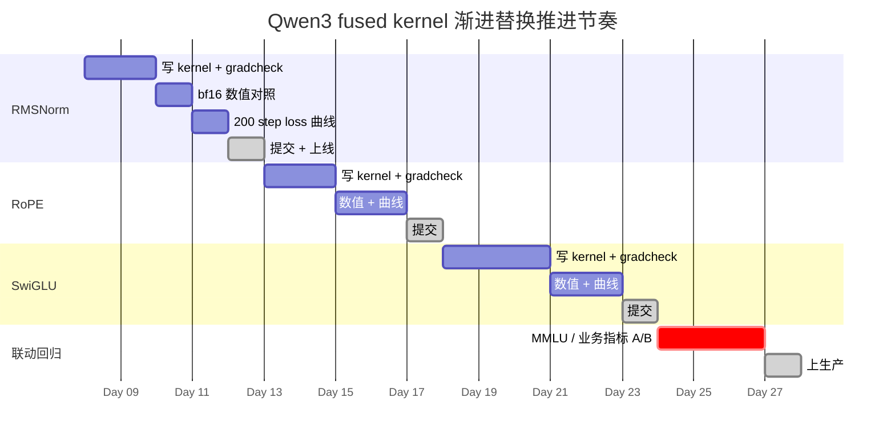

> 系列姊妹篇：[从"调包"到手写 Triton Kernel](/2026/05/07/triton-kernel-fusion-practice.html) · [看懂 Qwen3 + 识别算子融合机会](/2026/05/07/qwen3-understand-model-identify-fusion.html) · [GPU/NCCL SOP](/2026/05/07/training-inference-acceleration-troubleshooting-sop.html) · [Python CPU SOP](/2026/05/07/python-cpu-bottleneck-troubleshooting-sop.html)
>
> 前篇教你怎么**写** fused kernel，这篇教你怎么**验证它和原版数值一致**——这是替换后能不能真正上训练的最后一关。最常见的翻车场景：kernel 写对了、loss 能收敛，但下游任务指标偷偷掉了 1~2 个点，等跑完 100B tokens 才发现就晚了。

---

## 零、本文骨架

| 小节 | 主题 | 产出 |
|---|---|---|
| §一 | 为什么替换后可能掉点 | 精度差异的 7 类来源 |
| §二 | 三道 Gate 验证法 | gradcheck → bf16 数值 → loss 曲线 |
| §三 | 事后：业务指标 Gate | Eval loss / MMLU / 生成质量 |
| §四 | 8 个实用技巧 | A/B 开关 / Golden 输入 / 层级 hook 等 |
| §五 | 抄作业：Liger Kernel 的 CI 策略 | 工业级验证 SOP |
| §六 | 权威参考 + 相关文章 | - |

---

## 一、为什么替换后可能掉点

浮点不是实数，float 运算**不满足结合律**（`(a+b)+c ≠ a+(b+c)`）。任何 kernel 改写只要运算顺序或精度路径变了，数值就会漂——这不是 bug，是数学事实。问题在于"漂得有多重"和"会不会被下游放大"。


*图：bfloat16 = 1 sign + 8 exponent + 7 mantissa。只有 7 bit 尾数意味着相对精度约 `2^-7 ≈ 0.78%`——这直接决定了 Gate 2 的 tolerance 至少要放宽到 `1e-3`。来源：Wikimedia Commons*

**非结合律的数学事实**：在 $\mathbb{R}$ 中 $(a+b)+c = a+(b+c)$，但在 IEEE 754 浮点集合 $\mathbb{F}$ 中，令 $\oplus$ 表示浮点加法：

$$
(a \oplus b) \oplus c \ne a \oplus (b \oplus c)
$$

一般不等。例如 bf16 下 $a=10^4, b=-10^4, c=1$：$(a\oplus b)\oplus c = 1$，而 $a\oplus(b\oplus c) = 0$（$b\oplus c$ 下溢到 $-10^4$）。Kernel 里改一下 reduction 顺序就可能触发这种差异。

### 1.1 7 类常见差异来源

| # | 差异来源 | 原理 | 典型 magnitude（bf16） |
|---|---|---|---|
| 1 | **Reduction 顺序不同** | 求和顺序变了，结果微抖 | 单步 `1e-4 ~ 1e-3` 相对误差 |
| 2 | **中间是否上 fp32** | Reference 可能全程 bf16，你的 kernel 中间上 fp32 → 更准但**不一致** | 同上 |
| 3 | **Atomic add 顺序不确定** | 多 block 对同一地址累加，每次运行顺序都可能变 | 每次运行都抖，难复现 |
| 4 | **Dtype cast 时机** | `x.to(fp32) * w` vs `(x * w).to(fp32)` 结果不同 | `1e-4 ~ 5e-3` |
| 5 | **ε 的位置** | `1/sqrt(var + ε)` vs `1/sqrt(var) + ε` vs $$1/(sqrt(var)+\varepsilon)$$ 物理含义不同 | `1e-6 ~ 1e-3`（var 小时差距明显） |
| 6 | **RNG 状态** | Triton 的 PRNG 和 `torch.cuda.manual_seed` 不同流 | Dropout 位置完全不同 |
| 7 | **Mask / 边界** | Causal mask 用 `-inf` 还是 `-1e9`？下标差一位？ | 第一个 token 可能整个错 |

**经验规则**：Gate 1/2 能接住前 4 类；后 3 类（RNG / ε / mask）往往 gradcheck 也过得了，要靠 Gate 3 的**完整 loss 曲线对照**才能暴露。

### 1.2 一个容易忽视的点：fp32 master weight

优化器（AdamW / Adafactor）的状态是 **fp32**。前向 bf16 算完 grad 是 bf16 → 传回主权重前会被 cast 到 fp32。你手写的 backward 如果**直接产出 bf16 grad 不注意精度**，主权重累积会比 reference 掉数量级。

形式化：设 $w^{(t)} \in \mathbb{F}_{32}$ 是 fp32 master weight，step $t$ 的 bf16 梯度 $g^{(t)}$ 在上抛 fp32 再累加：

$$
w^{(t+1)} = w^{(t)} - \eta \cdot \mathrm{cast}_{\text{fp32}}(g^{(t)})
$$

如果你的 kernel 内部规约提前把中间量塞成 bf16，$g^{(t)}$ 本身就已经丢精度；再 cast 回 fp32 也救不回。**规则**：kernel 内部**所有 reduction 用 fp32 buffer**，输出 bf16 之前保留 fp32 一次。

```python
# ❌ Backward 里 dw 全程 bf16 累加
dw = (dy * x * rstd).to(tl.bfloat16).sum(dim=0)

# ✅ 中间保持 fp32，最后根据 weight.dtype cast
dw_partial = (dy * x * rstd).to(tl.float32)   # fp32 reduction
dw = dw_partial.sum(dim=0).to(weight.dtype)
```

---

## 二、三道 Gate 验证法



### Gate 1：`torch.autograd.gradcheck`（fp64 严格）

`gradcheck` 的原理：用数值微分 $\tilde{g}$ 近似真实梯度 $g$，对照你的解析 backward 的输出：

$$
\tilde{g}_i = \frac{f(x + \varepsilon e_i) - f(x - \varepsilon e_i)}{2\varepsilon}, \quad \varepsilon = 10^{-6}
$$

对每个维度 $i$ 和解析 grad $g_i$ 比较 $\|\tilde{g}_i - g_i\| < \text{atol} + \text{rtol}\cdot|g_i|$。只在 fp64 下做才能保证 $\varepsilon=10^{-6}$ 不被浮点截断。


```python
from torch.autograd import gradcheck

x = torch.randn(2, 32, dtype=torch.double, device='cuda', requires_grad=True)
w = torch.randn(32,    dtype=torch.double, device='cuda', requires_grad=True)

ok = gradcheck(TritonRMSNorm.apply, (x, w, 1e-6),
               eps=1e-6, atol=1e-4, raise_exception=True)
print("Gate 1:", ok)
```

- **用 `double` 不是 bf16**：`gradcheck` 用数值微分和解析 grad 对比，要 fp64 精度才够稳
- **过不了**说明**数学推导或 backward 代码本身**有 bug——不是 dtype / 精度问题

### Gate 2：训练 dtype 下数值对照（放宽 tolerance）

```python
x = torch.randn(4, 512, 4096, device='cuda', dtype=torch.bfloat16, requires_grad=True)
w_ref = torch.randn(4096, device='cuda', dtype=torch.bfloat16, requires_grad=True)
w_tri = w_ref.clone().detach().requires_grad_(True)

# Baseline
y_ref = reference_rms_norm(x, w_ref)
y_ref.sum().backward()
dx_ref, dw_ref = x.grad.clone(), w_ref.grad.clone()

x.grad = None

# Triton
y_tri = TritonRMSNorm.apply(x, w_tri, 1e-6)
y_tri.sum().backward()
dx_tri, dw_tri = x.grad, w_tri.grad

torch.testing.assert_close(y_tri, y_ref, rtol=1e-3, atol=1e-3)
torch.testing.assert_close(dx_tri, dx_ref, rtol=5e-3, atol=5e-3)
torch.testing.assert_close(dw_tri, dw_ref, rtol=5e-3, atol=5e-3)
```

- **Tolerance 放宽**：bf16 mantissa 只有 7 bit，单步误差 `1e-3` 正常
- **`dx` 比 `y` 宽容**，`dw` 因为跨 batch 累加通常更宽容
- **过不了 Gate 2 但过了 Gate 1**：dtype cast 位置错 / reduction 顺序换了

### Gate 3：loss 曲线对照（最严格）

前两道 Gate 能过但训练跑起来 loss 漂，典型漏检场景是 **RNG / mask / ε 细节**。

```python
def mini_train(model_factory, n_steps=1000, seed=42):
    torch.manual_seed(seed)
    torch.cuda.manual_seed(seed)
    model = model_factory().cuda().train()
    opt = torch.optim.AdamW(model.parameters(), lr=1e-4)
    losses = []
    for step, batch in enumerate(iter(dataset)):
        if step >= n_steps: break
        opt.zero_grad()
        loss = model(batch).loss
        loss.backward(); opt.step()
        losses.append(loss.item())
    return losses

losses_ref = mini_train(lambda: build_qwen3_eager())
losses_tri = mini_train(lambda: build_qwen3_with_triton())

import numpy as np
end_diff_pct = abs(np.mean(losses_ref[-50:]) - np.mean(losses_tri[-50:])) \
             / np.mean(losses_ref[-50:]) * 100
print(f"末 50 步 loss 相对差: {end_diff_pct:.3f}%")
# 期待: < 0.5% 即 Gate 3 过
```

- **必须固定 seed**：不固定 seed 对比的只是"噪声"
- **数据要同一 batch 顺序**：不然看到的是 dataloader 随机性
- **建议跑两次不同 seed**：如果只有一次曲线吻合，可能是碰巧

---

## 三、事后：业务指标 Gate

**训练 loss 收敛不代表下游任务指标一致**。真正"对齐"的定义应该是：

| 维度 | 阈值 |
|---|---|
| Eval loss (val set) | 相对差 < 0.3% |
| 下游任务（MMLU / GSM8K / HumanEval 等） | 绝对差 < 0.5% |
| 长链路生成：重复率 / 冗余度 / 幻觉率 | 人工抽样无明显退化 |
| 稳定性：3 个不同 seed 跑出的指标抖动 | 在 ±0.3% 以内 |

**为什么这一关不能跳过**：见过真实 case——Gate 1~3 全过、训练 loss 完全吻合，但 MMLU 掉了 1.8 点。追了一周才定位到 RoPE 实现里 `cos/sin` 缓存精度问题。**`loss 吻合 ⊂ 效果一致`，不是等号**。

---

## 四、8 个实用技巧

### 4.1 A/B 运行时切换开关

```python
import os
USE_TRITON = os.getenv("USE_TRITON_RMSNORM", "0") == "1"

class Qwen3RMSNorm(nn.Module):
    def forward(self, x):
        if USE_TRITON:
            return TritonRMSNorm.apply(x, self.weight, self.eps)
        return self._reference_forward(x)
```

一键回退，线上 A/B 对比 loss、灰度上线都方便。

### 4.2 Golden 输入：固定输入的回归测试集

```python
torch.manual_seed(1234)
cases = {
    'small':   (torch.randn(2, 64, 4096, device='cuda').bfloat16(),
                torch.randn(4096, device='cuda').bfloat16()),
    'long':    (torch.randn(1, 8192, 4096, device='cuda').bfloat16(),
                torch.randn(4096, device='cuda').bfloat16()),
    'batchy':  (torch.randn(16, 512, 4096, device='cuda').bfloat16(),
                torch.randn(4096, device='cuda').bfloat16()),
}
torch.save(cases, "golden_inputs.pt")

# 每次改 kernel 跑一遍
cases = torch.load("golden_inputs.pt")
for name, (x, w) in cases.items():
    check_equivalence(name, x, w)
```

改完 kernel 30 秒能跑一遍，比每次都跑 1000 step loss 快得多。

### 4.3 分层 Hook 找第一处偏差

```python
refs, tris = {}, {}

def hook_ref(name):
    def _h(mod, inp, out):
        refs[name] = out.detach()
    return _h

def hook_tri(name):
    def _h(mod, inp, out):
        tris[name] = out.detach()
    return _h

for i, layer in enumerate(model_ref.layers):
    layer.register_forward_hook(hook_ref(f"L{i}.out"))
for i, layer in enumerate(model_tri.layers):
    layer.register_forward_hook(hook_tri(f"L{i}.out"))

_ = model_ref(batch); _ = model_tri(batch)
for name in refs:
    diff = (refs[name] - tris[name]).abs().max().item()
    print(f"{name}: max_abs_diff={diff:.4e}")
# 某一层开始 diff 陡增 → 这层是 bug 源头
```

### 4.4 渐进式替换

**一次只换一个算子**。全套换完只能靠二分排查。典型 4 周替换节奏：



**节奏要点**：每个算子替换至少留一天缓冲跑 loss 曲线；三个算子换完统一跑一次业务指标回归，**不要每换一个就上生产**——可能三个累计才出现指标下掉。

### 4.5 Baseline 自身先可复现

```python
torch.manual_seed(42)
torch.cuda.manual_seed(42)
torch.backends.cudnn.deterministic = True
torch.backends.cudnn.benchmark = False
torch.use_deterministic_algorithms(True, warn_only=True)
```

否则你看到的曲线差异可能来自 **baseline 自己的噪声**，根本不是你 kernel 的问题。

### 4.6 对齐 Liger 而非 HF 原生

Liger Kernel 是**工业级验证过的** fused kernel 集合。如果你自己的实现和 Liger 数值对得上，比"对得上 HF 原生"更有说服力——因为 Liger 已经在 `test/` 下有完整的 pytest 套件可以复用。

```bash
# 安装 liger_kernel 后
pytest /path/to/liger_kernel/test/transformers/test_rms_norm.py -v
# 借它的测试文件改成对自己的 kernel 跑
```

### 4.7 用 `torch.compile(fullgraph=True)` 作对照

自己写的 Triton 和 `torch.compile` Inductor 生成的 Triton **输出数值应该一致**。不一致说明你实现偏了 Inductor 通用模板——这是 sanity check。

### 4.8 分离"训练"和"推理"验证

- **推理**：只看 forward 数值（Gate 2 的前向部分 + Gate 3 的 `eval()` 模式 forward 对照）
- **训练**：forward + backward 都要过

别把推理场景卡在 backward 验证上——**推理不跑 backward**。

---

## 五、抄作业：Liger Kernel 的 CI 策略

Liger Kernel 的测试策略非常值得复用：

```
1. 每个 kernel 一个 test_xxx.py (pytest)
   - test_forward: 多种 shape, dtype, 对照 HF reference
   - test_backward: 对应的 gradient 对照
   - test_gradcheck: fp64 严格 gradcheck
   - test_dtype_mix: bf16 + fp32 master weight 场景

2. CI 在 A100 + H100 两套硬件都跑
   (不同硬件 reduction 顺序可能不同)

3. Pre-release 必做:
   跑一次完整 Llama-1B / TinyLlama 的 5 epoch fine-tune
   对比 loss 曲线和 eval 指标

4. Cover 极端 shape:
   - H = 1 (边界)
   - H 非 2 的幂
   - 超长 sequence (seqlen=32K)
```

**对个人项目简化版**：

```
✅ gradcheck (必)
✅ 3 组 golden 输入 (必)
✅ 200 step mini train loss 对照 (必)
⬜ MMLU / GSM8K 抽测 (推荐，大 kernel 替换前必做)
⬜ 多硬件 CI (大团队才需要)
```

---

## 六、权威参考

- [PyTorch `torch.autograd.gradcheck` 文档](https://pytorch.org/docs/stable/generated/torch.autograd.gradcheck.html)
- [PyTorch 数值复现性（reproducibility）指南](https://pytorch.org/docs/stable/notes/randomness.html)
- [Liger Kernel test 目录](https://github.com/linkedin/Liger-Kernel/tree/main/test)
- [NVIDIA Training with Mixed Precision](https://docs.nvidia.com/deeplearning/performance/mixed-precision-training/index.html)
- [Flash-Attention 论文 — Softmax 数值稳定性讨论](https://arxiv.org/abs/2205.14135)
- 系列文：
  - [训推加速 Qwen3 实战：看懂模型 + 识别融合机会](/2026/05/07/qwen3-understand-model-identify-fusion.html)
  - [从"调包"到手写 Triton Kernel（含 backward）](/2026/05/07/triton-kernel-fusion-practice.html)
  - [GPU/NCCL SOP](/2026/05/07/training-inference-acceleration-troubleshooting-sop.html)
  - [Python CPU SOP](/2026/05/07/python-cpu-bottleneck-troubleshooting-sop.html)

---

> **一句话总结**：替换 fused kernel 最大的风险不是"能不能写对"，是"**写对了但没验对齐**"。三道 Gate 从严到宽、从点到面：gradcheck 管数学、bf16 数值管实现细节、loss 曲线管 RNG / ε / mask、业务指标管下游。每一道都有不同的漏网之鱼——缺一不可。
