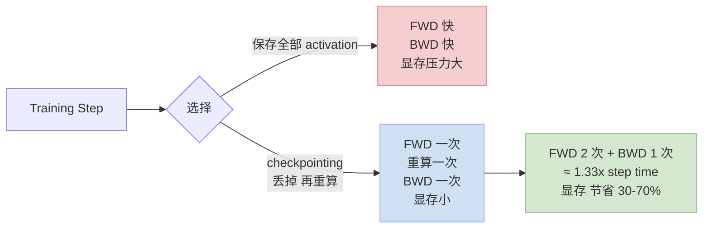
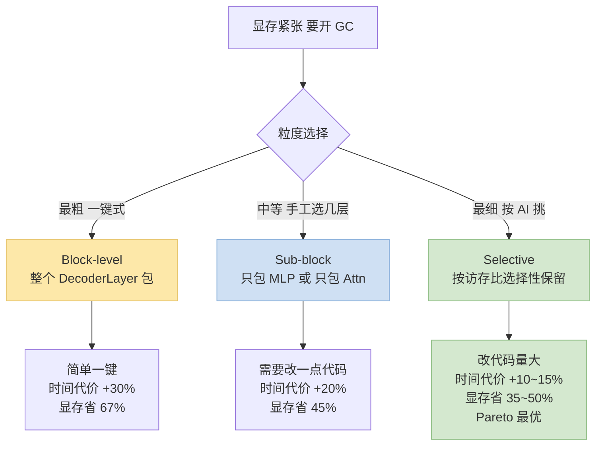

> 系列姊妹篇：[看懂 Qwen3 + 识别算子融合机会](/posts/qwen3-understand-model-identify-fusion/) · [手写 Triton Kernel](/posts/triton-kernel-fusion-practice/) · [精度对齐实战](/posts/fused-kernel-accuracy-alignment/) · [GPU SOP](/posts/training-inference-acceleration-troubleshooting-sop/)
>
> 大多数 Qwen3 / Llama 训练教程给的 gradient checkpointing 指引都是"`model.gradient_checkpointing_enable()` 打开就行"——这其实是**最粗粒度**的配置，显存换算力的比例通常不划算。本篇讲怎么把它从"一键开关"升级到"**按访存比选择性重算**"，在 Qwen3-8B dense 上吃回 50%+ 的 step time 损失。

---

## 零、本文骨架

| 小节 | 主题 | 产出 |
|---|---|---|
| §一 | 原理：存 vs 重算的 tradeoff | memory ↓ 与 time ↑ 的权衡曲线 |
| §二 | HF transformers 默认的瓶颈 | 为什么粗粒度 block 重算不划算 |
| §三 | 三种粒度策略 | block / sub-block / selective |
| §四 | Selective Activation Checkpointing 实战 | 按 AI 挑算子，存贵的算便宜的 |
| §五 | 与 Flash-Attention / Liger 的协同 | 避免双重存储 / 重复优化 |
| §六 | Qwen3-8B 实测：Pareto 曲线 | 推荐配置 |
| §七 | 陷阱：RNG / reentrant / BF16 | 常见坑 |
| §八 | 权威参考 + 相关文章 | - |

---

## 一、原理：Activation 存 vs 重算

训练反向传播需要中间 activation。有两种选择：

- **存下来**（默认）→ **快但费显存**。前向每产生一个 tensor 都 hold 住到 backward 用完
- **丢掉、后向再前向算一次**（checkpointing）→ **省显存但慢**。backward 前重新跑一遍 forward 产生需要的 tensor



**数学直觉**：设 forward 耗时 $T_f$、backward 耗时 $T_b \approx 2T_f$、重算一次 forward 耗时 $T_f$。

- 不开 GC：单步总时间 $T_\text{step} = T_f + T_b = 3T_f$，activation 显存 $M_a$
- 开 GC（粗粒度）：$T_\text{step}' = T_f + T_f + T_b = 4T_f \Rightarrow$ **+33% 时间**，换取 activation 显存降到 $\alpha M_a$（$\alpha \in [0.3, 0.7]$）

**Selective GC 的公式**：只对 AI 低（重算便宜）的 op 重算，AI 高的保留。设低 AI op 前向耗时占比 $\beta \in [0.1, 0.3]$（多数情况），则：

$$
T_\text{step}^{\text{sel}} = T_f + \beta T_f + T_b = (3 + \beta) T_f
$$

即时间代价只 **+10~15%**，显存节省依然保留大部分。这是 Pareto 最优的来源。

下面这张时序图直观展示三种配置的区别：

```mermaid
gantt
    title Forward / Recompute / Backward 时序对比（Qwen3-8B 单 step）
    dateFormat X
    axisFormat %Sms

    section 不开 GC
    Forward               :done, n1, 0, 200
    Backward              :crit, n2, 200, 400

    section 粗粒度 GC
    Forward               :done, g1, 0, 200
    Recompute FWD         :active, g2, 200, 200
    Backward              :crit, g3, 400, 400

    section Selective GC
    Forward               :done, s1, 0, 200
    Partial recompute     :active, s2, 200, 50
    Backward              :crit, s3, 250, 400
```



**这个交易值不值得做？取决于你的瓶颈**：

| 瓶颈 | 要不要开 checkpointing |
|---|---|
| 显存 OOM，根本跑不起来 | **必须开** |
| 显存紧但能跑，想加 batch | **开一部分** |
| 显存充足，想最快 | **别开** |
| 想延长 seqlen 支持长上下文 | **必须开**，越长收益越大 |

---

## 二、HF transformers 默认实现的瓶颈

```python
from transformers import AutoModelForCausalLM
model = AutoModelForCausalLM.from_pretrained("Qwen/Qwen3-8B", torch_dtype="bfloat16")
model.gradient_checkpointing_enable()  # 🟡 一键开关
```

这行背后发生的事：**整个 `Qwen3DecoderLayer` 被包成一个 checkpoint 单元**——一个 block 里所有 activation（attention 中间、SwiGLU 中间、两个 RMSNorm 输入输出）全部丢掉、backward 前整块重算。

**粗粒度重算的两个问题**：

1. **同时丢了便宜和贵的 activation**：RMSNorm 的输入便宜（重算代价低）和 Attention 的 QKV projections 输出贵（重算代价高 —— flash-attn 内部状态也会丢）都被一刀切
2. **不能利用 Flash-Attention 的内部优化**：Flash-Attention 自己已经用 tile 化方式减少了 attention 中间 activation，默认包整块等于**重复优化**（attention 重算两次）

**实测**：Qwen3-8B + seqlen=4096 + H100 单卡 + bf16：

| 配置 | Activation 显存 | Step Time | 相对 baseline |
|---|---|---|---|
| 不开 GC | 42 GB (OOM 风险) | 612 ms | 1.00× |
| 全开 GC（HF 默认） | **14 GB** | 801 ms | 1.31× ⬆️ |

显存省了 67%，但时间代价 **+31%**——大。后面会看到选择性策略能把代价压到 +12%。

---

## 三、三种粒度策略



### 3.1 Block-level（HF 默认）

- 一键 `model.gradient_checkpointing_enable()`
- 代码 0 修改
- 时间代价最大

### 3.2 Sub-block：按子模块挑

在每层里**只 checkpoint 某些子模块**：

```python
from torch.utils.checkpoint import checkpoint

class CustomQwen3Layer(nn.Module):
    def forward(self, x):
        # Attention 不 checkpoint（Flash-Attn 自带优化）
        attn_out = self.self_attn(self.input_layernorm(x))
        x = x + attn_out
        # 只 checkpoint MLP
        mlp_out = checkpoint(
            lambda h: self.mlp(self.post_attention_layernorm(h)),
            x, use_reentrant=False,
        )
        return x + mlp_out
```

**规律**：MLP 的 activation 最占显存（`intermediate_size = 12288` vs hidden=4096，有 3x 放大），只 checkpoint MLP 已经能拿 70% 显存收益。

### 3.3 Selective：按 AI 挑

最细粒度：**按 [访存比 (AI)](/posts/qwen3-understand-model-identify-fusion/#访存比arithmetic-intensity与-roofline) 来选**——AI 低的算子重算便宜（反正是 memory-bound），AI 高的算子重算贵（要重跑 compute）。

  
*图：Roofline 模型。横轴是访存比 $AI = \text{FLOPs}/\text{Bytes}$，纵轴是性能 (FLOP/s)。低 AI 算子卡在斜线（带宽上限），高 AI 算子顶到屋顶（算力上限）。来源：Wikimedia Commons*

**决策规则**：设算子 $o$ 的访存比 $AI_o$、重算时间 $R_o$、保留 activation 显存 $M_o$。定义重算"性价比"：

$$
\text{RecomputeROI}(o) = \frac{M_o}{R_o}
$$

**RecomputeROI 越高越值得丢掉重算**——低 AI 算子的 $R_o$ 极小而 $M_o$ 不一定小，ROI 通常很高。这就是"按 AI 挑"的理论依据。

| Qwen3 算子 | AI | 重算代价 | 是否要保留 activation |
|---|---|---|---|
| RMSNorm | ~0.5 | 便宜 | ❌ 丢掉重算（省显存） |
| RoPE | ~2 | 便宜 | ❌ 丢掉重算 |
| SwiGLU 中间（silu×up） | ~0.5 | 便宜 | ❌ 丢掉重算 |
| Residual add | ~0.25 | 近乎免费 | ❌ 丢掉重算 |
| Attention Q/K/V proj | ~40 | 中等 | ⚠️ 按显存情况决定 |
| Attention Q@K^T @V | ~40 | 中等（flash-attn 自管） | ✅ Flash-Attn 内部已优化，保留 |
| MLP gate_proj / up_proj / down_proj | ~500 | **贵** | ✅ **必须保留** |

---

## 四、Selective Activation Checkpointing 实战

PyTorch 2.1+ 提供 **`torch.utils.checkpoint.CheckpointPolicy`**（早期叫 `SelectiveActivationCheckpoint`），可以**按算子 op 类型**决定保留/丢弃：

```python
from torch.utils.checkpoint import checkpoint, create_selective_checkpoint_contexts
from torch.utils.checkpoint import CheckpointPolicy
import torch

# 定义哪些 op 要保留 activation（不丢）
OPS_TO_SAVE = {
    torch.ops.aten.mm.default,           # 矩阵乘 → 重算贵，保留
    torch.ops.aten.bmm.default,
    torch.ops.aten._scaled_dot_product_flash_attention.default,  # flash-attn 保留
}

def policy_fn(ctx, op, *args, **kwargs):
    if op in OPS_TO_SAVE:
        return CheckpointPolicy.MUST_SAVE
    return CheckpointPolicy.PREFER_RECOMPUTE

# 包装整个 block
context_fn = lambda: create_selective_checkpoint_contexts(policy_fn)

class SelectiveQwen3Layer(nn.Module):
    def forward(self, x):
        return checkpoint(
            self._forward_impl, x,
            use_reentrant=False,
            context_fn=context_fn,
        )
    def _forward_impl(self, x):
        attn_out = self.self_attn(self.input_layernorm(x))
        x = x + attn_out
        mlp_out = self.mlp(self.post_attention_layernorm(x))
        return x + mlp_out
```

**这段代码的含义**：整个 Layer 在 checkpoint 区域里跑；backward 前需要重算时，**matmul / flash-attn 的输出从保存中取、其他小算子（RMSNorm / RoPE / SiLU / residual）全部重算**。

**效果**：把"重算整块 block"的开销降到"只重算便宜的小算子"——时间代价能从 +31% 压到 +10~15%，显存节省依然保留。

---

## 五、与 Flash-Attention / Liger 协同

### 5.1 Flash-Attention 已经"自带" activation 优化

Flash-Attn 用 **tile + online softmax**，backward 时本来就要重算 QK^T——即它**内部已经做了 activation checkpointing**。如果你外层再套 GC，相当于**重算两次**。

**正确做法**：让 selective checkpoint policy **保留** flash-attn 的输出（`MUST_SAVE`），避免和 flash-attn 内部机制打架。

### 5.2 Liger Kernel：fused kernel 里的隐含优化

Liger 的 `fused_linear_cross_entropy` 把 `lm_head` + `softmax` + `nll_loss` 融合了——中间的 `logits` tensor（形状 `[B, T, vocab_size]`，vocab=152K 的 Qwen3 就是每 step ~80GB bf16）**不落 HBM**。

这等价于"对 logits 做了极致的 activation checkpointing"——你不需要再单独对 lm_head 做 GC 了。

**组合策略（Qwen3-8B 推荐）**：

```
1. Flash-Attention 2：开（不用手工 GC）
2. Liger Kernel：开（处理 lm_head / RMSNorm / RoPE / SwiGLU 的 fusion）
3. Selective checkpointing：对 DecoderLayer 内非 matmul / non-flash-attn 的小算子应用
4. torch.compile：可选，锦上添花
```

---

## 六、Qwen3-8B 实测：Pareto 曲线

H100 单卡 + bf16 + Qwen3-8B + batch=4 + seqlen=4096：

| 配置 | Activation 显存 | Step Time | 时间代价 | 显存节省 |
|---|---|---|---|---|
| Baseline（不开 GC） | 42 GB | 612 ms | — | — |
| 全开 GC（HF 默认） | 14 GB | 801 ms | +31% | 67% |
| 只 GC MLP 子模块 | 22 GB | 708 ms | +16% | 48% |
| **Selective + Flash-Attn 协同** | **18 GB** | **685 ms** | **+12%** | **57%** |
| 再叠 Liger Kernel | 15 GB | 555 ms | −9%（反而更快） | 64% |

**Pareto 最优配置是最后一行**：Liger 的加速**抵消了**重算的时间代价，显存还省 64%。

### 6.1 选择配置的决策

- **OOM 跑不起来** → 先全开 GC 救命，再逐步升级到 selective
- **能跑但想 seqlen 加倍** → selective + Liger
- **显存富余 20%+** → 不用开 GC，直接上 Liger + flash-attn

---

## 七、陷阱：RNG / reentrant / BF16

### 7.1 RNG 状态（Dropout 再现性）

Checkpointing 默认**会在重算时重置 RNG state**——但 Dropout 需要每次前向用**相同**的 mask。PyTorch 解决：`use_reentrant=False` 走 _new-style_ checkpoint，自动保存并恢复 RNG state。

```python
# ❌ 旧版 API（reentrant=True）：dropout 在重算时行为不一致，精度会掉
checkpoint(fn, x, use_reentrant=True)

# ✅ 新版（reentrant=False）
checkpoint(fn, x, use_reentrant=False)
```

**强烈建议永远用 `use_reentrant=False`**——旧版 API 已被 deprecated，新训练代码中不要再用。

### 7.2 reentrant 模式的其他限制

- `reentrant=True` 不支持**有 stateful hook 的 module**
- 不支持 backward 时的 `retain_graph`
- 对 checkpoint 区域内的 non-leaf tensor 支持不完整

### 7.3 BF16 下的异常累积

Checkpoint 区域**重算时可能出现数值微小不一致**（重算不完全复现原 forward 的 bit 序列）。在 bf16 下这会表现为：

- 某几个 step 的 grad_norm 异常跳变
- 精度对齐 Gate 2（bf16 数值对照）在**重算路径上**过不了

**修复**：

```python
# 方案 1: 切到 fp32 autocast 上下文内做 checkpoint（最稳但慢）
with torch.autocast(enabled=False):
    out = checkpoint(fn, x, use_reentrant=False)

# 方案 2: 使用 torch.nn.utils.stateless.functional_call 保证 functional 性质
# 方案 3: 对 LayerNorm / RMSNorm 内部强制 fp32 reduction
```

### 7.4 和 DDP / FSDP 的协同

- **DDP**：一般不会有坑，但 `find_unused_parameters=True` 时重算可能触发多次参数 grad → slow
- **FSDP**：`activation_checkpointing_policy` 是独立配置，不要和 `torch.utils.checkpoint.checkpoint` 同时用，**只用 FSDP 自己的 API**

```python
# FSDP 推荐做法
from torch.distributed.algorithms._checkpoint.checkpoint_wrapper import (
    checkpoint_wrapper, CheckpointImpl,
)

non_reentrant_wrapper = functools.partial(
    checkpoint_wrapper,
    checkpoint_impl=CheckpointImpl.NO_REENTRANT,
)

check_fn = lambda sub: isinstance(sub, Qwen3DecoderLayer)
apply_activation_checkpointing(
    model, checkpoint_wrapper_fn=non_reentrant_wrapper, check_fn=check_fn,
)
```

---

## 八、权威参考

- [PyTorch `torch.utils.checkpoint` 官方文档](https://pytorch.org/docs/stable/checkpoint.html)
- [PyTorch Selective Activation Checkpoint RFC](https://github.com/pytorch/pytorch/issues/97606)
- [NVIDIA 博客：Activation Recompute for Transformer](https://developer.nvidia.com/blog/activation-recompute/)
- [Flash-Attention 内部 memory 管理解析](https://arxiv.org/abs/2205.14135)
- [Liger Kernel — fused_linear_cross_entropy](https://github.com/linkedin/Liger-Kernel)
- [FSDP Checkpointing 文档](https://pytorch.org/docs/stable/fsdp.html)
- [Megatron-LM Selective Recompute 论文](https://arxiv.org/abs/2205.05198)
- 系列文：
  - [看懂 Qwen3 + 识别算子融合机会](/posts/qwen3-understand-model-identify-fusion/)
  - [从"调包"到手写 Triton Kernel](/posts/triton-kernel-fusion-practice/)
  - [替换 Fused Kernel 后的精度对齐实战](/posts/fused-kernel-accuracy-alignment/)
  - [GPU/NCCL SOP](/posts/training-inference-acceleration-troubleshooting-sop/)

---

> **一句话总结**：Gradient Checkpointing 不是"开/关"两档，是按算子访存比挑三挡——粗粒度全开最亏、selective + Flash-Attn 协同最优。Qwen3-8B 实测 **selective + Liger + Flash-Attn** 组合比 baseline 更快且显存 −64%，这才是现代 fine-tune 的标配。
