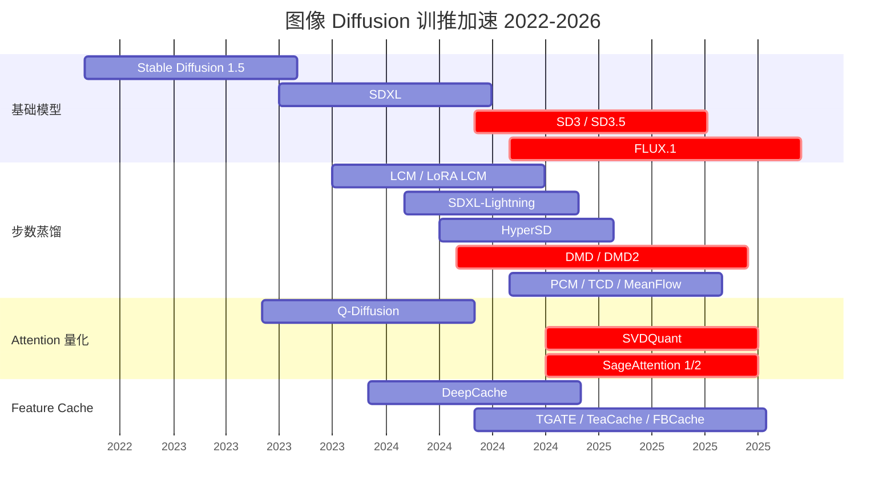
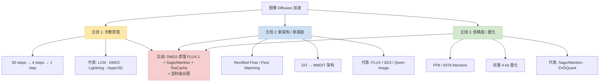
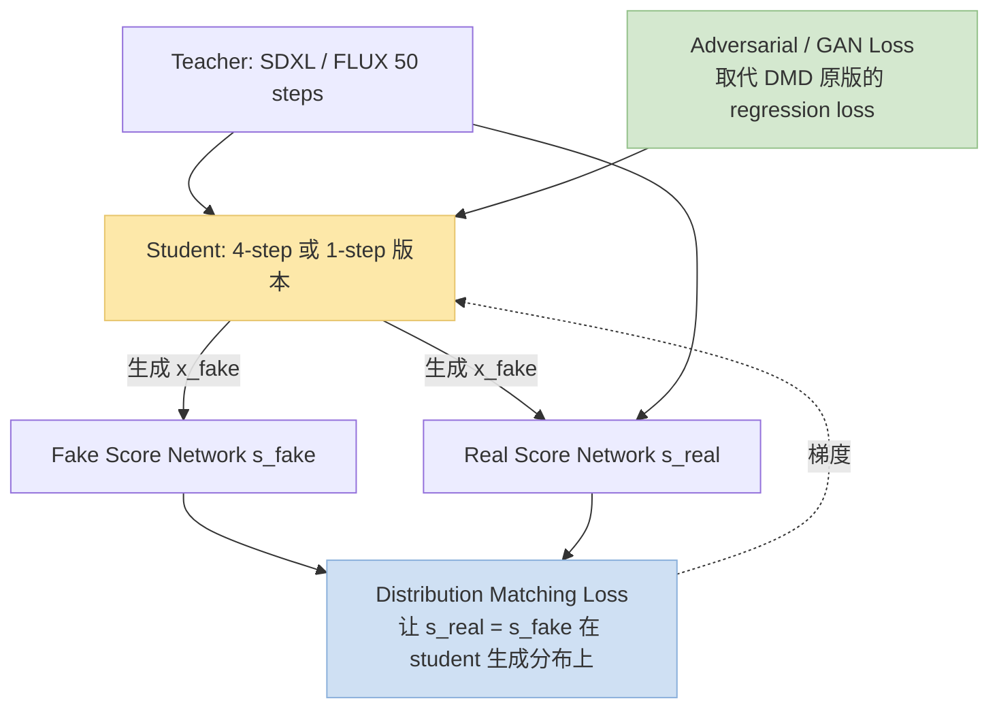
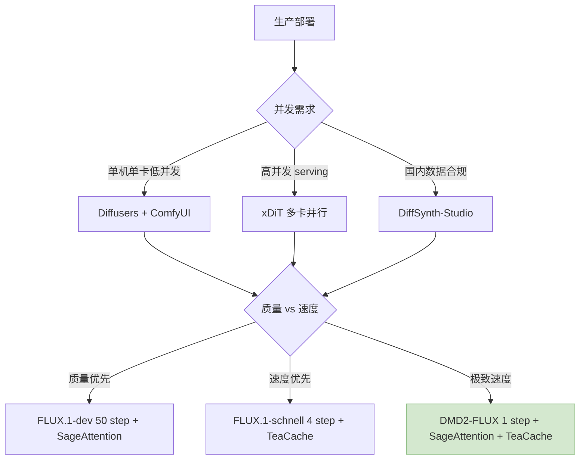

> 训推加速系列深化之"图像 Diffusion 专题"。2024~2026 图像扩散领域同时上演三条加速主线——**步数蒸馏**（DMD2 / LCM 系）、**新架构**（DiT / MMDiT / Rectified Flow）、**低精度 Attention**（SageAttention / SVDQuant）。本文聚焦**图像**（视频 / 3D 扩散见下一篇）。
>
> 姊妹篇：[训推加速技术地图](/posts/training-inference-acceleration-map/) · [Speculative Decoding + EAGLE-3](/posts/speculative-decoding-eagle3-vllm/) · [MoE → Dense 蒸馏](/posts/moe-to-dense-distillation/)
>
> ⚠️ **时效声明（最后更新：2026-05-08）**：Diffusion 加速在 2024~2026 两年迭代极快（FLUX.1 / SD3.5 / DMD2 / Wan 2.2 / SageAttention / Flash-SD3 都是这两年出来的），本文反映 2026 年中快照。

---

## 零、本文骨架

| 小节 | 主题 | 产出 |
|---|---|---|
| §一 | Diffusion 训推演进时间线 | gantt + 三条主线 |
| §二 | 三条主线详解 | 步数蒸馏 / DiT 新架构 / FP8 Attention |
| §三 | Flow Matching：FLUX 为什么 4 步就够 | ODE 数学 + Rectified Flow |
| §四 | **DMD2 深度拆解** | 训练 pipeline + 数学推导 |
| §五 | Attention 量化三选：SageAttention vs SVDQuant vs Q-Diffusion | 实测对比 |
| §六 | Feature Caching：DeepCache / TeaCache / FBCache | 推理侧免费加速 |
| §七 | 工程化：ComfyUI / Diffusers / xDiT 部署 | 实战 |
| §八 | 评测：FID / CLIP score / 主观 Arena | 公式 |
| §九 | 2026 SOTA 推荐配置 | 按场景 |
| §十 | 权威参考 | - |

---

## 一、Diffusion 训推演进时间线



**三条主线彼此正交，可叠加使用**——这是 Diffusion 加速相对 LLM 的独特之处。

---

## 二、三条主线详解



**为什么三条能叠加**：
- 主线 1 改**推理步数**（从 50 → 4）
- 主线 2 改**单步模型容量 / 质量**
- 主线 3 改**单步 kernel 速度**

三个维度相互独立，所以 DMD2 蒸馏 FLUX.1 + SageAttention + TeaCache 是现在消费级图像生成最快的组合。

  
*图 1：DMD2 把 SDXL 从 50 步蒸馏到 4 步，质量基本无损。右图是 1-step 版本——单步出图。来源：tianweiy/DMD2 GitHub*

---

## 三、Flow Matching：FLUX 为什么 4 步就够

### 3.1 Diffusion vs Flow Matching

**传统 Diffusion**（DDPM / DDIM）：学一个**去噪方向**

$$
x_{t-1} = \mu_\theta(x_t, t) + \sigma_t \epsilon
$$

要迭代 50~1000 步从完全噪声 $x_T$ 降到清晰图 $x_0$。

**Flow Matching (FM)**：学一个**速度场**，从噪声 $x_0$ 沿时间 $t \in [0,1]$ 沿 ODE 积分到目标 $x_1$

$$
\frac{dx_t}{dt} = v_\theta(x_t, t, \text{condition})
$$

训练目标：回归到目标速度 $v^*(x_t, t) = x_1 - x_0$（Rectified Flow 条件下）

$$
\mathcal{L}_\text{FM} = \mathbb{E}_{t, x_0, x_1} \left[ \| v_\theta(x_t, t) - (x_1 - x_0) \|^2 \right]
$$

### 3.2 为什么 FM 只需 4 步

**直觉**：ODE 比 SDE 的积分路径**直**得多——rectified flow 训练里设定 $x_t = (1-t) x_0 + t x_1$（直线），学好后用 Euler 法 4 步足够：

$$
x_{t + \Delta t} = x_t + \Delta t \cdot v_\theta(x_t, t)
$$

**FLUX.1 [schnell]** 就是在 FLUX.1 [dev] 基础上用 LCM 式蒸馏做到 4 步出图——4 步 × FLUX 单步 ≈ 1~2 秒出图。

### 3.3 MMDiT 架构（SD3 / FLUX 共用）

  
*图 2：FLUX.1 [dev] 生成样例。FLUX 用的是 MMDiT（Multi-Modal DiT）——文本 / 图像双流 attention，每层交叉交互。来源：Black Forest Labs FLUX GitHub*

**MMDiT 关键设计**：
- 文本 token 和图像 patch token **各自有独立的 projection 矩阵**
- 在 attention 里两流 **拼接后做 joint attention**
- 相比 Cross-attention 式（SD 1.5/SDXL），**文本能更好地修改图像细节**

---

## 四、DMD2 深度拆解

### 4.1 DMD2 要解决的问题

**一步扩散**（Single-step Diffusion）已经有很多尝试：LCM / SDXL-Lightning / HyperSD。但它们都有短板：

- LCM：质量损失明显
- Lightning：需要大量 MSE regression 训练，不够泛化
- HyperSD：依赖训练技巧，复现难

**DMD / DMD2**（Distribution Matching Distillation）的核心：**让 student 的分布和 teacher 的分布对齐**，而不是逐 sample regression。

### 4.2 DMD2 训练 pipeline



### 4.3 核心数学

设 $p_\text{real}$ 是 teacher 的分布，$p_\text{fake}$ 是 student 的分布。DMD 的目标：

$$
\min_\theta D_\text{KL}(p_\text{fake}^\theta \| p_\text{real})
$$

用 score function 表达（$s(x) = \nabla_x \log p(x)$），DMD 的梯度：

$$
\nabla_\theta \mathcal{L}_\text{DMD} = \mathbb{E}_{x \sim p_\text{fake}^\theta} \left[ (s_\text{fake}(x) - s_\text{real}(x)) \cdot \nabla_\theta x \right]
$$

**直觉**：在 student 当前生成的分布上，**让 student 把质量往 teacher 的 score 方向推**。

### 4.4 DMD → DMD2 的改进

| 维度 | DMD v1 | DMD v2 |
|---|---|---|
| 额外 loss | Regression MSE 对 teacher 生成 pair | **GAN loss 替代** |
| 分布匹配 | KL 单向 | KL + adversarial |
| 训练稳定性 | 需要复杂调度 | 简化 |
| 单步质量 | 不够 | 明显提升 |

**DMD2 最大贡献**：**去掉 regression loss**——让 student 不再被迫复现 teacher 的具体 sample，而是学整个分布的**可能性**。

### 4.5 DMD2 + FLUX 的实战

```python
# 伪代码
teacher = FluxPipeline.from_pretrained("black-forest-labs/FLUX.1-dev")
student = FluxPipeline.from_pretrained("black-forest-labs/FLUX.1-dev")  # 初始化相同

s_fake = init_score_network(student)  # 可训练
s_real = teacher  # 冻结

for step in training_loop:
    # Student 生成
    x_fake = student.generate_fewsteps(n_steps=4)

    # 更新 fake score (辅助网络)
    update_s_fake(s_fake, x_fake)

    # DMD loss
    loss_dmd = compute_dmd_loss(s_fake, s_real, x_fake)

    # GAN loss (DMD2 关键)
    loss_gan = discriminator(x_fake, real_images)

    # 总 loss
    (loss_dmd + lambda_gan * loss_gan).backward()
```

**训练成本**：~数千 H100 小时（蒸馏 FLUX-dev 到 4-step）。开源社区已有直接可用的 DMD2-FLUX checkpoint。

---

## 五、Attention 量化三选

### 5.1 为什么 Diffusion Attention 要量化

- DiT / MMDiT 里 attention 占 **50~70% FLOPs**
- 单张 1024×1024 图像 → 16K tokens → attention $O(N^2)$ = 2.5 亿 FLOPs
- FP8 attention 推理速度 **1.5~2× 提升**，质量损失极小

### 5.2 三选对比

| 方案 | 量化位宽 | 训练侧 vs 推理侧 | 适用模型 | 质量 |
|---|---|---|---|---|
| **SageAttention 2** | FP8 Attention | 纯推理侧 | SD3 / FLUX / 视频 DiT | 几乎无损 |
| **SVDQuant** | 4-bit weight + activation | 需要 PTQ | SD3 / Flux | 轻微 |
| **Q-Diffusion** | 混合精度 PTQ | 推理侧 | SDXL | 明显但可接受 |

**2026 推荐**：
- **默认 SageAttention 2**——无需训练，drop-in 替换 PyTorch attention
- **显存极紧** → SVDQuant 4-bit 方案
- **仅 SD 1.5 / SDXL 场景** → Q-Diffusion 老方案

### 5.3 SageAttention 用法

```python
# 一行替换
from sageattention import sageattn
torch.nn.functional.scaled_dot_product_attention = sageattn

# 然后正常 diffusion 推理, attention 自动走 FP8 kernel
```

实测：H100 + FLUX.1 1024×1024 + 20 steps：
- Baseline (fp16 attn): 8.1 s
- + SageAttention 2: **5.2 s**（-36%）
- + SageAttention 2 + TeaCache: **3.4 s**（-58%）

---

## 六、Feature Caching：推理侧免费加速

### 6.1 观察

Diffusion 相邻 step 的中间特征**非常相似**——相邻两步只差一点去噪量。Feature Caching 的核心：**跳过某些步骤的计算，复用上一步的特征**。


"完整 vs 复用"的比例由调度决定，典型省 30~50% FLOPs。

### 6.2 主流方案对比

| 方案 | 机制 | 适用 | 加速比 |
|---|---|---|---|
| **DeepCache**（2024） | block-level cache，按 level 跳 | SDXL / SD3 | 1.5~2× |
| **TGATE**（2024） | 早期跳 cross-attn（text 早期固定） | SD / SDXL | 1.3~1.5× |
| **TeaCache**（2024） | 自适应 cache，学 step 之间的 similarity threshold | FLUX / Wan 2.1 | 1.5~2× |
| **FBCache**（2025） | Feature Block Cache，更激进块级跳过 | DiT 系列 | 1.8~2.2× |

### 6.3 组合经验

Feature Caching 和步数蒸馏 / Attention 量化**可以叠加**：

```
Baseline:    FLUX.1-dev 50 steps            → 25s
+ DMD2-4step:                               → 2s
+ SageAttention 2:                          → 1.4s
+ TeaCache:                                 → 1s（亚秒级！）
```

---

## 七、工程化：部署

### 7.1 主流框架对比

| 框架 | 定位 | 最适合 |
|---|---|---|
| **Diffusers** (HuggingFace) | 官方 Python SDK | 算法原型 / 研究 |
| **ComfyUI** | 节点式 workflow | 创作者 / pipeline 组合 |
| **kohya_ss / sd-scripts** | SD / SDXL / FLUX LoRA 训练事实标准 | 个人 / 社区 LoRA / DreamBooth 微调 |
| **xDiT** | DiT 多卡并行 | 生产服务高并发 |
| **DiffSynth-Studio** (魔搭) | 训推一站式，Wan/FLUX/SD3 | 国内生产部署 |
| **Flash-SD3** | SD3 专用 one-step 方案 | 极致速度 |
| **OneTrainer** | Diffusion 训练 GUI + 配置 | 初学者 / 无代码微调 |

**补充说明**：**kohya_ss**（基于 sd-scripts）是社区 LoRA / DreamBooth / Full Fine-Tune 训练的**事实标准**。FLUX / SD3 / SDXL 的大部分开源 LoRA 都是用它训的。训练时的加速要点：
- 支持 **bitsandbytes 8-bit AdamW** → 显存减半
- 支持 **Gradient Checkpointing + xformers / SDPA / Flash-Attn**
- 支持 **分层学习率**（U-Net / Text Encoder 分开）
- FLUX 侧配套 **FLUX-Kohya scripts**，专门处理 FLUX 的双文本 encoder 和新 VAE

### 7.2 生产服务部署决策



### 7.3 生产监控指标

- **Generation Latency P99**：单图耗时 99 分位
- **Throughput (images/sec)**：并发下的吞吐
- **CLIP score**：文图对齐质量
- **用户 win rate**：A/B 测新版 vs 旧版的胜率

---

## 八、评测：FID / CLIP score / 主观 Arena

### 8.1 FID (Fréchet Inception Distance)

$$
\text{FID} = \| \mu_r - \mu_g \|^2 + \mathrm{Tr}\left(\Sigma_r + \Sigma_g - 2(\Sigma_r \Sigma_g)^{1/2}\right)
$$

- $\mu_r, \Sigma_r$: 真实图片 Inception-v3 特征的均值 / 协方差
- $\mu_g, \Sigma_g$: 生成图片同样特征

**越低越好**。FLUX.1 在 COCO 30K 上 FID ≈ 15（示意）。

**加速前后 FID 对比**：
- Baseline FLUX.1-dev 50 step: FID 15.0
- + DMD2 4 step: 15.3（几乎无损）
- + DMD2 1 step: 16.5（轻微下降）
- + SageAttention 2: 无变化
- + TeaCache: 15.4

### 8.2 CLIP score（文图对齐）

$$
\text{CLIPscore} = \max\left(0, 100 \times \frac{\text{CLIP}(I) \cdot \text{CLIP}(T)}{\|\text{CLIP}(I)\|\|\text{CLIP}(T)\|}\right)
$$

- CLIP 图像 / 文本 embedding 余弦相似度 × 100

典型值 30~35 为好。

### 8.3 主观 Arena

**GenAI Arena / Imagen Arena**：两张生成图并排 → 人投票更好的 → Elo 排名。2024+ 成为 SOTA 模型的必争之地，比客观 FID 更反映真实用户偏好。

---

## 九、2026 SOTA 推荐配置

### 9.1 消费级 GPU（RTX 4090 / 5090）

```
模型: FLUX.1-schnell（4 步） 或 DMD2-FLUX 1-step
Attention: SageAttention 2
Cache: TeaCache
框架: Diffusers 或 ComfyUI
期望: 1024×1024 < 1.5s
```

### 9.2 服务端高并发

```
模型: FLUX.1-dev 或 SD3.5-Large（质量优先）
并行: xDiT 多卡（Sequence Parallel）
Attention: SageAttention 2
Cache: TeaCache + DeepCache
批大小: 4~8 per GPU
期望吞吐: 2~4 images/sec/GPU
```

### 9.3 端侧（手机 / 笔记本 M2）

```
模型: SDXL-Turbo / FLUX.1-schnell (W4A16 量化)
框架: Core ML / MLX / MLC-LLM Diffusion 扩展
量化: SVDQuant 4-bit
期望: 512×512 < 5s（M2 Pro）
```

### 9.4 视频扩展

见下一篇专题（视频 & 3D 扩散）。Wan 2.2 + FastWan + VSA + DMD2 组合是 2026 视频生成的 SOTA 配方。

---

## 十、权威参考

**论文**：
- [FLUX.1 Technical Report (BFL, 2024)](https://blackforestlabs.ai/announcing-black-forest-labs/)
- [Stable Diffusion 3 Paper (SAI, 2024)](https://arxiv.org/abs/2403.03206)
- [DMD2 (Yin et al., 2024)](https://arxiv.org/abs/2405.14867)
- [DMD Original (Yin et al., 2023)](https://arxiv.org/abs/2311.18828)
- [Rectified Flow (Liu et al., 2022)](https://arxiv.org/abs/2209.03003)
- [Flow Matching (Lipman et al., 2023)](https://arxiv.org/abs/2210.02747)
- [SageAttention 2 (Zhang et al., 2024)](https://arxiv.org/abs/2411.10958)
- [SVDQuant (MIT, 2024)](https://arxiv.org/abs/2411.05007)
- [DeepCache (Ma et al., 2024)](https://arxiv.org/abs/2312.00858)
- [TeaCache (2024)](https://arxiv.org/abs/2411.19108)
- [SDXL-Lightning (ByteDance, 2024)](https://arxiv.org/abs/2402.13929)
- [HyperSD (ByteDance, 2024)](https://arxiv.org/abs/2404.13686)

**代码**：
- [Diffusers](https://github.com/huggingface/diffusers)
- [ComfyUI](https://github.com/comfyanonymous/ComfyUI)
- [kohya_ss / sd-scripts](https://github.com/kohya-ss/sd-scripts)（LoRA / FineTune 事实标准）
- [OneTrainer](https://github.com/Nerogar/OneTrainer)
- [DiffSynth-Studio](https://github.com/modelscope/DiffSynth-Studio)
- [xDiT](https://github.com/xdit-project/xDiT)
- [SageAttention](https://github.com/thu-ml/SageAttention)
- [DMD2 Official](https://github.com/tianweiy/DMD2)
- [FLUX Official](https://github.com/black-forest-labs/flux)
- [TeaCache](https://github.com/ali-vilab/TeaCache)

**系列文**：
- [训推加速技术地图](/posts/training-inference-acceleration-map/)
- [Speculative Decoding + EAGLE-3](/posts/speculative-decoding-eagle3-vllm/)
- [MoE→Dense 蒸馏](/posts/moe-to-dense-distillation/)

---

> **一句话总结**：图像 Diffusion 加速三条主线——**步数蒸馏**（DMD2 让 FLUX 从 50 步降到 1 步）+ **新架构**（Flow Matching / MMDiT 让 4 步够用）+ **低精度 Attention**（SageAttention 省 40%）——彼此正交可叠加。2026 消费级生图的 SOTA 组合是 **DMD2-FLUX + SageAttention 2 + TeaCache**，亚秒出图。
