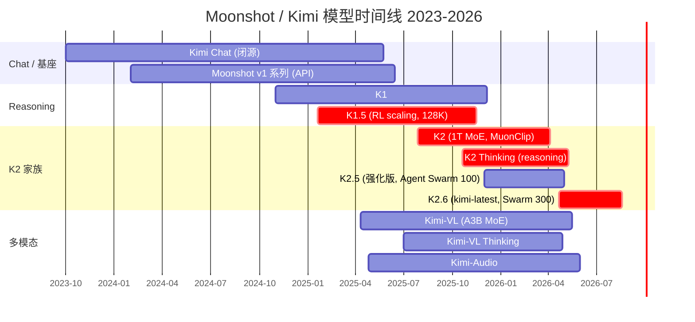
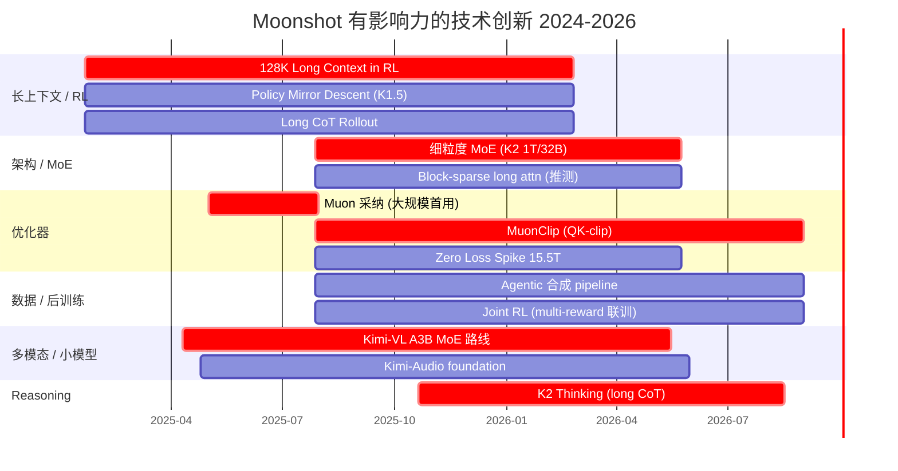
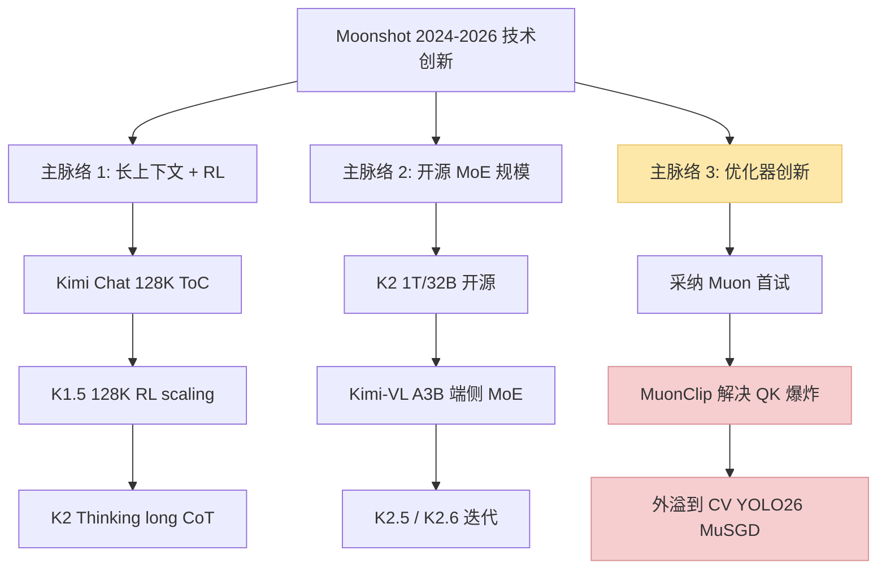
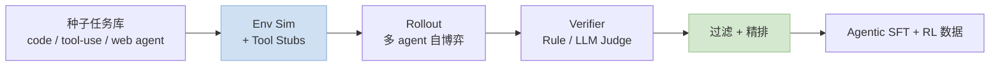

> 一篇公司技术洞察。内容基于公开论文 / 技术报告 / HuggingFace / GitHub 的可核实材料整理，细节以 Moonshot 官方发布为准。
>
> 姊妹篇：[训推加速技术地图](/posts/training-inference-acceleration-map/) · [MoE 训练加速](/posts/moe-training-acceleration-deepep-qwen3/) · [RL 训练加速](/posts/rl-training-qwen3-vllm-verl/)
>
> **最后更新：2026-05-08**

---

## 零、一句话背景

Moonshot AI（月之暗面）创立于 2023，杨植麟等清华背景创始团队，产品品牌 **Kimi**。2024~2025 靠 **长上下文（128K ~ 200K）** 和 **Kimi Chat** 打响中国市场，2025 年 Q3 开源 **K2（1T MoE）** 进入全球开源最前排，独创 **MuonClip 优化器** 是目前 2026 最受关注的训练侧创新之一。

K2 技术报告对自身贡献的总结三条：

> We present **MuonClip**, a novel optimizer that integrates the token-efficient Muon algorithm with a stability-enhancing mechanism called QK-Clip. Using MuonClip, we successfully pre-trained Kimi K2 on 15.5 trillion tokens without a single loss spike.
>
> We introduce a **large-scale agentic data synthesis pipeline** that systematically generates tool-use demonstrations via simulated and real-world environments.
>
> We design a **general reinforcement learning framework** that combines verifiable rewards (RLVR) with a self-critique rubric reward mechanism.
>
> — *Kimi K2 Technical Report, §1 Introduction*

---

## 一、产品 & 模型时间线



### 1.1 核心产品对照

| 发布 | 模型 | 参数 | 定位 | 开源 |
|---|---|---|---|---|
| 2023 Q4 | Kimi Chat | 闭源 | 长上下文 ToC 对话 | ❌ |
| 2024 Q4 | K1 | 闭源 | 推理雏形 | ❌ |
| **2025-01** | **K1.5** | 闭源（有技术报告） | **RL + 128K reasoning** | 部分（技术报告 + 代码片段）|
| 2025-04 | Kimi-VL | **A3B MoE**（3B active） | 多模态小模型 | ✅ 权重 |
| 2025-04 | Kimi-Audio | 7B | 音频 foundation | ✅ 权重 |
| **2025-07** | **K2** | **1T / 32B active MoE** | **开源旗舰 agentic** | ✅ 权重 + 技术报告 |
| 2025-10 | K2 Thinking | 同基座 | 长 reasoning 变体 | ✅ |
| 2025-12 | K2.5 | 推测与 K2 同量级 | 强化 | ✅ 权重 |
| **2026-04** | **K2.6** | **1T / 32B active + 384 experts + 256K + MoonViT** | **Agent Swarm 旗舰** | ✅ Modified MIT |

---

## 一·五、技术创新时间线（有影响力的创新点 + 关联论文）

### 1.5.1 时间线



### 1.5.2 创新点清单：按影响力排序

| # | 创新点 | 所在模型 | 关联论文 / 来源 | 业界影响 |
|---|---|---|---|---|
| **1** | **MuonClip 优化器**（Muon + QK-clip）| K2 | [K2 报告 (2507.20534)](https://arxiv.org/abs/2507.20534) · [Muon 原文](https://kellerjordan.github.io/posts/muon/) | **Adam 之后被讨论最多的优化器**；YOLO26 的 **MuSGD** 直接点名引用 |
| **2** | **15.5T tokens Zero Loss Spike** | K2 | K2 报告 §3 | 1T MoE 训练稳定性里程碑，证明 Muon 系可驾驭 |
| **3** | **长上下文 + RL Scaling** | K1.5 | [K1.5 (2501.12599)](https://arxiv.org/abs/2501.12599) | 与 OpenAI o1 同期，**开源第一个证明 RL 可 scale 到 128K CoT** |
| **4** | **Policy Mirror Descent (PMD) 替代 PPO** | K1.5 | K1.5 报告 §4 | 为 RL 稳定性提供新思路 |
| **5** | **Agentic 大规模数据合成** | K2 | K2 报告 §5 | 开源 SWE-Bench Verified 65.8，被 veRL / OpenRLHF 借鉴 |
| **6** | **Joint RL 多 reward 联合训练** | K2 | K2 报告 §5.3 | 避免多阶段漂移 |
| **7** | **1T / 32B 细粒度 MoE 开源** | K2 | K2 报告 §2 | 和 DeepSeek-V3 671B/37B 共撑开源 MoE 天花板 |
| **8** | **A3B MoE 小模型多模态路线** | Kimi-VL | [Kimi-VL 报告 (2504.07491)](https://arxiv.org/abs/2504.07491) | MoE 做端侧 VLM 的典型，和 Gemma 3n / MiniCPM-o 形成三足 |
| **9** | **Kimi-Audio foundation** | Kimi-Audio | [GitHub](https://github.com/MoonshotAI/Kimi-Audio) | 开源音频 LLM 栈，和 Qwen2.5-Omni 同期 |
| **10** | **K2 Thinking 长 CoT 推理** | K2-Thinking | [HF model card](https://huggingface.co/moonshotai/Kimi-K2-Thinking) | 开源 reasoning 重要节点 |

### 1.5.3 三条主脉络



**影响力最大的一条**：**优化器主脉络（Muon → MuonClip → MuSGD 外溢）**——这是 2026 能看到跨领域传播的 LLM 技术。

---

## 二、核心结构创新

### 2.1 K2：1T MoE + MLA 架构

K2 技术报告对架构的明确表述：

> The model architecture follows an **ultra-sparse MoE** with **multi-head latent attention (MLA)** similar to DeepSeek-V3, derived from empirical scaling law analysis.
>
> — *K2 Technical Report, §2 Pre-training*

- **总参数 1T，激活 32B**
- **Ultra-sparse MoE + MLA**（multi-head latent attention）——**明确声明结构上"similar to DeepSeek-V3"**
- **15.5T tokens 预训练**，全程 **zero loss spike**（Figure 3 loss 曲线单调下降）
- Post-training：多阶段 + **大规模 agentic 数据合成** + **RLVR + self-critique 联合 RL**

### 2.2 Kimi-VL：MoonViT + A3B MoE 的组合拳

Kimi-VL 技术报告（[arxiv 2504.07491](https://arxiv.org/abs/2504.07491)）：

- **LLM decoder**：MoE，总参 ~16B，**激活 2.8B**（所以名字叫 A3B）
- **Vision encoder: MoonViT**（Moonshot 自研），**原生分辨率**——**不走 tile-padding**，直接吃任意分辨率
- **128K 上下文**
- 官方原文：

> Its **native-resolution vision encoder, MoonViT**, further allows it to see and understand ultra-high-resolution visual inputs, achieving 83.2 on InfoVQA and 34.5 on ScreenSpot-Pro, while maintaining lower computational cost for common tasks.
>
> — *Kimi-VL Technical Report*

关键设计取舍：
- **MoonViT** 是 Kimi 视觉栈的骨干，**不仅 Kimi-VL 用，K2.6 内部视觉能力也基于它的升级版**（见 §7.4）
- **A3B 路线**和 Gemma 3n、MiniCPM-o 形成端侧多模态三足
- **Kimi-VL-Thinking / Thinking-2506** 延续 K2 Thinking 的 long CoT：64.0 MMMU、46.3 MMMU-Pro，是开源 VLM reasoning 的第一档

### 2.3 Kimi-Audio：连续输入 + 离散输出的混合 tokenizer

Kimi-Audio 技术报告（[arxiv 2504.18425](https://arxiv.org/abs/2504.18425)）给出 Moonshot 独特的音频 tokenizer 架构。原文：

> Specifically, we leverage a **12.5Hz audio tokenizer**, design a novel LLM-based architecture with **continuous features as input and discrete tokens as output**, and develop a **chunk-wise streaming detokenizer based on flow matching**. We curate a pre-training dataset that consists of **more than 13 million hours** of audio data covering a wide range of modalities including **speech, sound, and music**.
>
> — *Kimi-Audio Technical Report*

拆开来看几个工程选择：
- **12.5 Hz tokenizer**：比 Mimi 的 12.5 Hz 级别接近，比 DAC 50 Hz 低 4×，**专门为 LLM 序列长度优化**
- **混合 I/O**：**输入 = 连续特征**（保信息量）/ **输出 = 离散 token**（LLM 生成友好）——这是与多数统一 Audio LLM 的一个明显分歧
- **Flow Matching detokenizer**：和 §音乐生成篇的 π0 Audio 路线同 family，**chunk-wise streaming** 让实时性可用
- **从预训练 LLM 初始化**再 continual pretrain（节省从头训成本）
- 13M hours 数据规模和 Qwen2.5-Omni 同级

### 2.4 K1.5：Scaling RL with LLMs

K1.5 技术报告（arxiv 2501.12599）讲的不是架构而是 **RL 配方**：
- **128K 上下文** 下做 long reasoning RL
- **Policy Mirror Descent**（改 PPO 稳定性）
- Rollout 长 CoT 轨迹 + reward shaping
- 与 OpenAI o1 同期，给开源社区"**RL 真的 scale**"的第二例证

---

## 三、优化器创新：Muon → MuonClip

这是 Moonshot 对 LLM 训练领域影响最大的贡献，值得单独拿出来说。

### 3.1 Muon 背景

**Muon**（Jordan Keller 等 2024）是基于 **正交化 momentum**（Newton-Schulz 矩阵迭代）的优化器：

$$
M_t = \beta M_{t-1} + G_t, \quad O_t = \mathrm{NewtonSchulz}(M_t), \quad \theta_{t+1} = \theta_t - \eta \, O_t
$$

相比 AdamW 的优点：
- **Token efficiency 高**（同样 step 学到更多）
- 对宽层（hidden_dim 大）效果尤其好
- 内存只需 momentum（比 Adam 省一倍）

缺点：**大规模训练不稳定**——Attention logit 容易爆。

### 3.2 MuonClip：Muon + QK-Clip

K2 的核心创新。原文对问题的描述：

> Despite its efficiency, scaling up Muon training reveals a challenge: training instability due to **exploding attention logits**, an issue that occurs more frequently with Muon but less with AdamW in our experiments. Existing mitigation strategies are insufficient. For instance, **logit soft-cap directly clips the attention logits, but the dot products between queries and keys can still grow excessively before capping is applied**. On the other hand, **Query-Key Normalization (QK-Norm) is not applicable to multi-head latent attention (MLA), because its Key matrices are not fully materialized during inference**.
>
> — *K2 Technical Report, §2.1*

这段引文特别重要：**QK-Norm 用不了的原因是 MLA 在推理期 K 不完全显式化**——这也解释了为什么 K2（用了 MLA）必须发明新招而不能直接套现成 QK-Norm。

#### 3.2.1 QK-Clip 定义

定义 per-head max logit 为 batch $B$ 内所有 token 对的最大 softmax 输入：

$$
S_\text{max}^h = \frac{1}{\sqrt{d}} \max_{\mathbf{X} \in B} \max_{i, j} Q_i^h (K_j^h)^\top
$$

当 $S_\text{max}^h > \tau$ 时，按 $\gamma = \tau / S_\text{max}^h$ 对该 head 的 Q / K 权重做 rescale：

$$
W_q^h \leftarrow \gamma^\alpha W_q^h, \quad W_k^h \leftarrow \gamma^{1-\alpha} W_k^h
$$

典型 $\alpha = 0.5$（对称），**只对超阈值的 head 生效**（大部分 head 不动）。

#### 3.2.2 MLA 专用细节

因为 MLA 的 Q/K 由"共享部分 + head-specific 部分 + rotary"组成，QK-Clip 对不同分量策略不同：

> - $q^C$ and $k^C$ (head-specific components): each scaled by $\sqrt{\gamma_h}$
> - $q^R$ (head-specific rotary): scaled by $\gamma_h$
> - $k^R$ (shared rotary): **left untouched to avoid effect across heads**
>
> — *K2 Technical Report, §2.1*

**关键 trade-off**：shared rotary $k^R$ 绝不动，否则一个 head 的数值问题会污染所有 head。

#### 3.2.3 完整算法（MuonClip = Muon + per-head QK-Clip）

```
Algorithm 1 MuonClip Optimizer
1: for each training step t do
2:   # 1. Muon step
3:   for each weight W do
4:     M_t = μ M_{t-1} + G_t
5:     O_t = NewtonSchulz(M_t) · sqrt(max(n,m)) · 0.2  # Match Adam RMS
6:     W_t = W_{t-1} - η (O_t + λ W_{t-1})
7:   end for
8:   # 2. QK-Clip
9:   for each attention head h do
10:    if S_max^h > τ then
11:      γ = τ / S_max^h
12:      W_qc^h ← W_qc^h · sqrt(γ)
13:      W_kc^h ← W_kc^h · sqrt(γ)
14:      W_qr^h ← W_qr^h · γ
15:    end if
16:  end for
17: end for
```

（来自 K2 技术报告 Algorithm 1，Newton-Schulz 矩阵迭代部分对应 Muon 原作）

#### 3.2.4 实测效果

技术报告给出两张关键对照图：

> During a mid-scale training run, **attention logits rapidly exceed 1000**, which could lead to potential numerical instabilities and even training divergence. ... Maximum logits for Kimi K2 with MuonClip and **τ = 100** over the entire training run. **The max logits rapidly increase to the capped value of 100, and only decay to a stable range after approximately 30% of the training steps**, demonstrating the effective regulation effect of QK-Clip.
>
> — *K2 Technical Report, Figure 2*

翻译要点：
- **对照实验**：9B active / 53B total MoE + vanilla Muon，训到一半 logit > 1000，训练发散
- **K2 + MuonClip + τ = 100**：logit 触顶被按住，**前 30% 训练 QK-Clip 持续生效**，之后自然回落到安全区
- Loss 曲线（Figure 3）**整个 15.5T token 训练 zero spike**

**这意味着**：QK-Clip 不是一种永久约束，而是**前期稳定 → 后期自稳**的脚手架——30% 之后模型自己学会了不越界。

### 3.3 MuonClip 的行业影响

2025~2026 迅速外溢：
- **YOLO26**（Ultralytics, 2025 Q3）的 **MuSGD 优化器**（SGD + Muon 混合）直接点名 Kimi K2 为灵感来源
- 多个开源 MoE 训练栈集成 Muon/MuonClip（Megatron-LM、NanoGPT 社区）
- **成为 2026 年 Adam 之后最被讨论的替代优化器**

---

## 四、训练工程创新

### 4.1 Zero Loss Spike 的工程意义

1T 模型训练最贵的不是算力，而是**炸炉重启**。K2 声称 15.5T token 全程没炸过，意味着：
- MuonClip + 并行策略 + 学习率 schedule 高度协同
- **训练 MFU 接近理论上限**（无 rollback 损失）
- 同等预算可多训 10~20% 有效 token

### 4.2 数据 Rephrasing：Token Utility 的新路线

K2 在预训练数据策略上引入了针对 token utility 的 rephrasing pipeline：

> A key advancement in the pre-training data of Kimi K2 over Kimi K1.5 is the introduction of a synthetic data generation strategy to increase token utility. Specifically, a carefully designed **rephrasing pipeline** is employed to amplify the volume of high-quality tokens without inducing significant overfitting.
>
> — *K2 Technical Report, §2.2*

#### 4.2.1 Knowledge Data Rephrasing 三要素

报告直接给出方案：

- **Style- and perspective-diverse prompting**（受 WRAP 启发，多风格、多视角改写以保持事实完整）
- **Chunk-wise autoregressive generation**（长文本切 chunk 改写再拼接，避免 LLM 输出长度限制带来的信息截断）
- **Fidelity verification**（语义一致性核验，作为训练前的质量门）

#### 4.2.2 关键证据：Table 1 SimpleQA

报告 Table 1 的对比实验（同一 early checkpoint，三种训练策略）：

| 策略 | # Rephrasings | # Epochs | SimpleQA Accuracy |
|---|---|---|---|
| 原始 wiki 反复 | 0 | 10 | 23.76 |
| 改写 1 次反复 | 1 | 10 | 27.39 |
| **改写 10 次单 epoch** | **10** | **1** | **28.94** |

工程洞察：
- **同样 token 预算下，多次改写 > 多次 repeat**
- 验证了"**token utility > token count**"在 2025~2026 的实践价值——高质量 token 稀缺时，合成改写是比 multi-epoch 更有效的补偿
- 报告还提到 Mathematics 领域也有类似专门改写策略

### 4.3 Agentic 数据合成 Pipeline

K2 的后训练最大贡献之一是 **大规模 agentic 轨迹合成**：



- 工具使用、多跳 web 交互、代码 agent 三条主线
- 合成数据 + 真实轨迹混训
- 对应评测：Tau2-Bench 66.1 / ACEBench 76.5 / SWE-Bench Verified 65.8（非 thinking）

### 4.4 Joint RL Stage：RLVR + Self-Critique Rubric Reward

K2 的 RL 框架是**两种 reward 联合**：

> We design a general reinforcement learning framework that combines **verifiable rewards (RLVR)** with a **self-critique rubric reward mechanism**. The model learns not only from externally defined tasks but also from evaluating its own outputs, extending alignment from static to open-ended domains.
>
> — *K2 Technical Report, §1*

两种 reward 组合的工程含义：
- **RLVR**（可验证任务）：code 通过单测 / 数学答案匹配 → 反馈精确
- **Self-critique rubric**：模型自己对自己的输出按 rubric 打分 → 覆盖开放问答 / 创意等没有 hard verifier 的场景
- **一次 joint 训练**避免"先 SFT 再 RL"的多阶段漂移

### 4.5 长上下文训练：K1.5 的 128K 配方

- **YARN / RoPE 外推**做位置编码扩展
- **Chunk-based RL rollout**：长 CoT 轨迹切块训练
- **Flash Attention + Sequence Parallel** 必备
- 内存账本：128K × 32B active ≈ 需要 ZeRO-3 + activation checkpointing

---

## 五、推理工程创新

### 5.1 K2 的推理挑战

1T MoE 推理不是 trivial 工程：
- **专家路由 + EP 并行** 必备
- 部署默认走 **vLLM / SGLang + DeepEP** 风格 all-to-all
- Moonshot 内部推理栈未完全开源，但 HuggingFace 权重 + vLLM v0.7+ 已支持

### 5.2 MoE 推理特化

K2 推理栈的（社区推测 + 部分可见）关键点：
- **FP8 权重**（HF 有 FP8 variant）
- **Block-sparse attention** on long context
- **Prefix Cache**：agent 场景同 system prompt 复用
- **Speculative Decoding**：社区已有 EAGLE/ Medusa 适配

### 5.3 K2 Thinking 的长 CoT 推理

Thinking 变体输出可达数万 token 链路：
- **流式输出 + 思维段折叠** UI
- 推理时 reasoning budget 可调
- 和 OpenAI o-series / Qwen Thinking 路线类似

### 5.4 开源生态集成

截至 2026-05：
- vLLM（原生支持 K2 MoE）
- SGLang（Agentic tool-use 首选）
- llama.cpp（Q4/Q5 量化跑单机 256GB CPU 也能跑 K2）
- NVIDIA NeMo-AutoModel（Kimi-VL 官方集成）

---

## 六、K2.6（2026-04-20 最新发布）

K2.6 是 Moonshot 2026-04-20 发布的旗舰新版本，**Modified MIT 开源协议**，品牌名"**kimi-latest**"指向的就是它。

### 6.1 规格

| 维度 | 值 |
|---|---|
| 架构 | **Ultra-sparse MoE + MLA**（延续 K2）|
| 总参数 | 1T |
| 激活参数 | 32B / token |
| **Experts** | **384 总专家，每 token 选 8 + 1 shared expert** |
| 层数 | **61 layers** |
| **上下文窗口** | **262,144 tokens（256K）** |
| **Vision encoder** | **MoonViT 400M**（从 Kimi-VL 迭代）|
| 量化 | **原生 INT4 / FP4**（高并发部署）|
| 推理引擎 | vLLM / SGLang / **KTransformers** |

**架构延续 K2.x 家族 MLA**；主要升级在 **专家数量细化（384/8）、层数加深（61）、上下文扩展到 256K、原生低比特**——都是"规模扩展 + 部署友好"方向的工程进化。

### 6.2 Agent Swarm：多 agent orchestration

K2.6 最显著的能力升级来自 **Agent Swarm 系统**：

| 能力 | K2.5 | **K2.6** |
|---|---|---|
| sub-agent 数 | 100 | **300 domain-specialized** |
| 单次自主执行步数 | 1,500 | **4,000 coordinated steps** |
| 持续运行时长 | — | **12+ 小时 + 数千次工具调用** |

> The orchestration layer decomposes complex prompts into parallel subtasks and synthesizes outputs into finished deliverables such as research documents, functional websites, or spreadsheets.
>
> — *K2.6 tech overview (DeepInfra, 2026-04)*

这是把 K2 "agentic intelligence" 主题推到**多 agent 自治**范式，显著超出单 agent tool-use 范畴。

### 6.3 K2.6 Benchmark（2026-04）

所有数据为 **thinking mode**；带 * 的是 Moonshot 在同条件下重新评测的对照值：

| 类别 | Benchmark | **K2.6** | GPT-5.4 | Claude Opus 4.6 | Gemini 3.1 Pro |
|---|---|---|---|---|---|
| Agentic | HLE-Full (w/ tools) | **54.0** | 52.1 | 53.0 | 51.4 |
| Agentic | DeepSearchQA (Acc) | **83.0** | 63.7 | 80.6 | 60.2 |
| Coding | SWE-Bench Pro | **58.6** | 57.7 | 53.4 | 54.2 |
| Coding | SWE-Bench Verified | 80.2 | — | 80.8 | — |
| Coding | LiveCodeBench v6 | 89.6 | — | 88.8 | 91.7 |
| Coding | BrowseComp (Swarm) | **86.3** | — | — | — |
| Reasoning | AIME 2026 | 96.4 | **99.2** | 96.7* | 98.3* |
| Reasoning | GPQA-Diamond | 90.5 | **92.8** | — | — |
| Reasoning | IMO-AnswerBench | **86.0** | — | 75.3 | — |
| Vision | MathVision (w/ Py) | 93.2 | **96.1*** | 84.6* | 95.7* |

**解读**：
- **Agentic / Coding / DeepSearch** 是 K2.6 的强项——**开源首次和 Claude Opus 4.6 / GPT-5.4 正面竞争**
- **纯数学推理**（AIME / GPQA）GPT-5.4 仍领先 2~3 个点
- **BrowseComp 单 agent 83.2 / Swarm 86.3** 直接证明 Agent Swarm 的额外收益

### 6.4 MoonViT 在 K2.6 中的角色

K2.6 是 **native multimodal**：MoonViT 被内嵌进主模型，但**图像输入在当前 API 不直接暴露**——内部用于 coding-driven design（文字 + mockup → 可运行界面）等下游能力。这和 Kimi-VL 的独立模型路线形成互补：

- **Kimi-VL-A3B**：外部可调用的独立 VLM
- **K2.6 内置 MoonViT**：主模型原生多模态能力，通过特定下游任务体现

---

## 七、MuonClip 在不同 domain 的实测与外溢

MuonClip 是 2025~2026 从 Moonshot 外溢到最多领域的创新。公开可查的实测 / 引用：

### 7.1 CV：YOLO26 的 MuSGD

- Ultralytics **YOLO26**（2025-09，[arxiv 2509.25164](https://arxiv.org/abs/2509.25164)）引入 **MuSGD 优化器 = SGD + Muon 混合**
- 官方文档直接点名：*"Inspired by Moonshot AI's Kimi K2 breakthroughs in LLM training"*
- 实测：CPU 推理比 YOLO11 快 43%（部分来自训练得到的更小 / 更稀疏权重）
- **这是 Muon 家族首次在非 Transformer 架构上的大规模应用**

### 7.2 LLM fine-tune 社区对比

HuggingFace 博客《Muon vs MuonClip vs Muon+AdamW for Fine-Tuning》（社区实测，非官方）给出了一组关键对照实验：

  

**实测结论**（引自原文）：

> Muon and Muon+AdamW have **outperformed the MuonClip**. We can clearly see they are outperforming MuonClip in convergence, the main reason is the Clipping. As the clipping is more optimal and stable for **longer training duration**.
>
> That's also the reason the **mean token accuracy of MuonClip is also low**.
>
> As we can see in starting the **Muon Only is converging faster initially** than Muon+AdamW catch up.
>
> — *HF blog: Muon vs MuonClip vs Muon+AdamW for Fine-Tuning*

**工程洞察**：
- **短 SFT 场景 MuonClip 反而吃亏**：QK-Clip 抑制 logit 增长，在 fine-tune 几百~几千 step 的短训中体现为 *更慢的收敛 + 更低的 mean token accuracy*
- **Muon only 初期最快**：不加 AdamW 也不加 clip，在短步数下纯矩阵更新最直接
- **Muon + AdamW 混合最稳**：Muon 管矩阵权重 / AdamW 管 embedding / norm，初期略慢但后段追上
- **MuonClip 的价值窗口在"长训 + 大规模"**：K2 的 15.5T token 预训练正是其诞生动机；短训配方里用它反而得不偿失

所以 **MuonClip 不是"全场景更好的 Muon"**，而是**专门为超大规模预训练稳定性设计的变体**——选型时要严格按任务规模匹配。

### 7.3 长尾学习与多 domain 研究

- OpenReview 《Long-tailed Learning with Muon Optimizer》：Muon 在长尾分布任务上**token efficiency 优于 Adam**
- 韩国期刊对比研究（koreascience 2025）：**MuonClip vs Adam 在视觉分类 fine-tune 的数值稳定性对比**
- 社区共识：**Muon 本体主要适用 Transformer / 矩阵权重**，对 CNN 早期层 / embedding 等效果有限

### 7.4 推荐 & 语音 domain

截至 2026-05，**公开的推荐系统 / 语音大模型 MuonClip 实测数据仍很少**——可能原因：
1. 推荐系统多用 embedding + sparse tensor，Muon 的矩阵正交化前提不直接适用
2. 语音领域主流（Kimi-Audio 自家例外）还没批量迁移

Moonshot 自家 **Kimi-Audio / Kimi-VL** 是否用 MuonClip，**公开资料未明确披露**——但考虑到同公司，大概率复用了优化器栈。

### 7.5 一句话总结 MuonClip 的 2026 位势

> 预训练 / 超大规模训练：**MuonClip 是 Adam 之外最值得尝试的替代**
>
> SFT / 小模型 / 短训：**Muon + AdamW 混合** 更实际
>
> CV 迁移：**YOLO26 是标志性案例**，后续能否扩散仍待观察

---

## 八、2026 行业影响洞察

### 8.1 三条影响力主线

1. **MuonClip 成为 Adam 之外最被讨论的优化器** — 已外溢到 CV（YOLO26）
2. **1T MoE 开源标杆** — 把"开源追得上闭源"这件事继续往前推
3. **Agentic 合成数据配方** — 用 RL + 自博弈做 agent 能力的范式被 veRL / OpenRLHF 社区借鉴

### 8.2 与其它开源玩家的对照

| 维度 | Kimi K2 | DeepSeek-V3 | Qwen3-MoE |
|---|---|---|---|
| 规模 | **1T / 32B active** | 671B / 37B active | 235B / 22B active |
| 优化器 | **MuonClip** | AdamW + **Aux-Loss-Free** | AdamW |
| 定位 | **Agentic** | 通用 reasoning | 通用 + 工具 |
| 训练 token | **15.5T** | ~14.8T | ~18T (推测) |
| 独特卖点 | **zero spike + Muon** | FP8 训练 + 细粒度 MoE | 多尺寸家族 |

### 8.3 可能的下一步（观察清单）

- **K3 / 新一代基座**：是否继续押 Muon 路线
- **多模态与 K2 融合**：Kimi-VL Thinking 是否升级到 K2 级别基座
- **端侧 Kimi**：Kimi-VL-A3B 之后是否有更小的 A0.5B / A1B 端侧版本
- **Agent 评测权威化**：Moonshot 是否会推出行业 agent benchmark

---

## 九、权威参考

**Moonshot 官方 & 论文**：
- [Moonshot AI 官网](https://www.moonshot.ai/)
- [Kimi K2 技术报告 (arxiv 2507.20534)](https://arxiv.org/abs/2507.20534)
- [Kimi K2 项目页](https://moonshotai.github.io/Kimi-K2/)
- [Kimi K1.5 技术报告 (arxiv 2501.12599)](https://arxiv.org/abs/2501.12599)
- [Kimi-VL 技术报告 (arxiv 2504.07491)](https://arxiv.org/abs/2504.07491)
- [Kimi-Audio 技术报告 (arxiv 2504.18425)](https://arxiv.org/abs/2504.18425)

**HuggingFace**：
- [moonshotai (组织主页)](https://huggingface.co/moonshotai)
- [Kimi-K2-Thinking](https://huggingface.co/moonshotai/Kimi-K2-Thinking)
- [Kimi-VL-A3B-Instruct](https://huggingface.co/moonshotai/Kimi-VL-A3B-Instruct)

**GitHub**：
- [Kimi-K2](https://github.com/MoonshotAI/Kimi-K2)
- [Kimi-K2.5](https://github.com/MoonshotAI/Kimi-K2.5)
- [Kimi-k1.5](https://github.com/MoonshotAI/kimi-k1.5)
- [Kimi-VL](https://github.com/MoonshotAI/Kimi-VL)
- [Kimi-Audio](https://github.com/MoonshotAI/Kimi-Audio)

**Muon 相关**：
- [Muon 原始讨论 (Jordan Keller, 2024)](https://kellerjordan.github.io/posts/muon/)
- [MuonClip 解读 (Fireworks)](https://fireworks.ai/blog/muonclip)
- [Muon vs MuonClip vs Muon+AdamW for Fine-Tuning (HF 社区)](https://huggingface.co/blog/KingNish/optimizer-part1)
- [Long-tailed Learning with Muon Optimizer (OpenReview)](https://openreview.net/forum?id=go388T3QjQ)

**K2.6 相关**：
- [K2.6 官方博客](https://www.kimi.com/blog/kimi-k2-6)
- [K2.6 in Microsoft Foundry](https://techcommunity.microsoft.com/blog/azure-ai-foundry-blog/introducing-kimi-k2-6-in-microsoft-foundry/4513125)
- [K2.6 on DeepInfra 技术概览](https://deepinfra.com/blog/kimi-k2-6-model-overview)

**第三方分析**：
- [Nathan Lambert — 5 Thoughts on Kimi K2 Thinking](https://www.interconnects.ai/p/kimi-k2-thinking-what-it-means)
- [IntuitionLabs — K2 Technical Deep Dive](https://intuitionlabs.ai/articles/kimi-k2-technical-deep-dive)

**系列文**：
- [训推加速技术地图](/posts/training-inference-acceleration-map/)
- [MoE 训练加速](/posts/moe-training-acceleration-deepep-qwen3/)
- [RL 训练加速](/posts/rl-training-qwen3-vllm-verl/)

---

> **一句话总结**：Moonshot Kimi 在 2024~2026 的三条硬技术线——**长上下文（K1.5 128K RL）+ MoE 规模（K2 1T）+ 优化器创新（MuonClip）**。MuonClip 的外溢效应（甚至到 YOLO26 这样的 CV 模型）说明其已跨出 LLM 语境，成为 2026 训练侧最值得关注的优化器创新之一。
