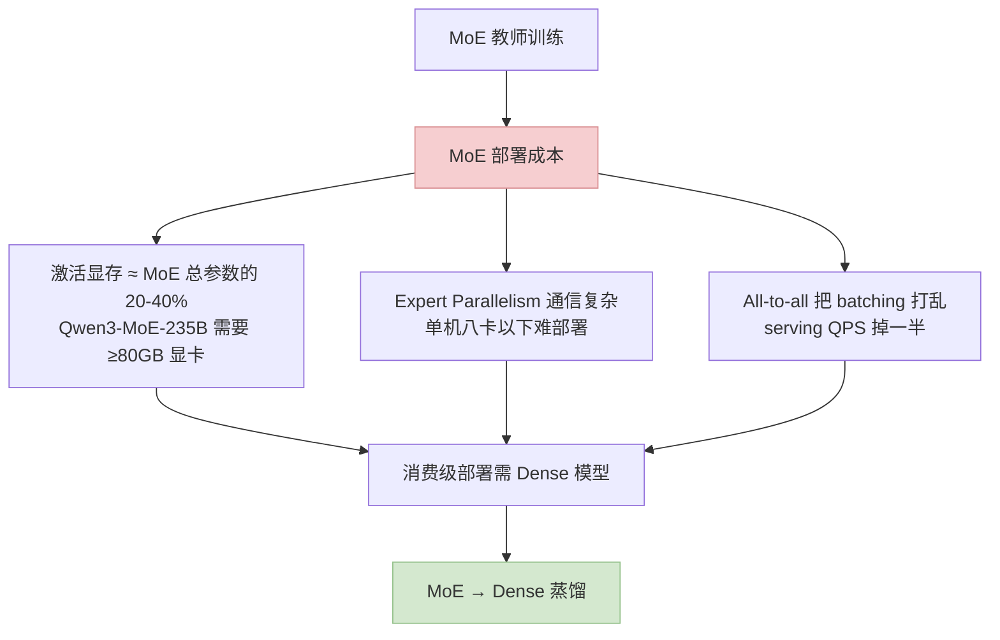
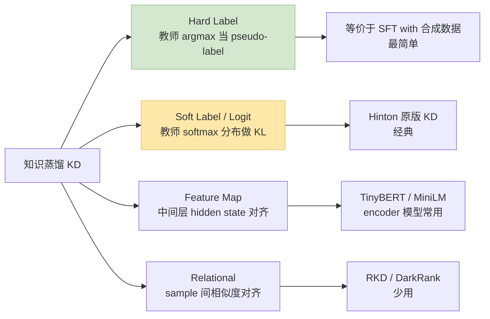
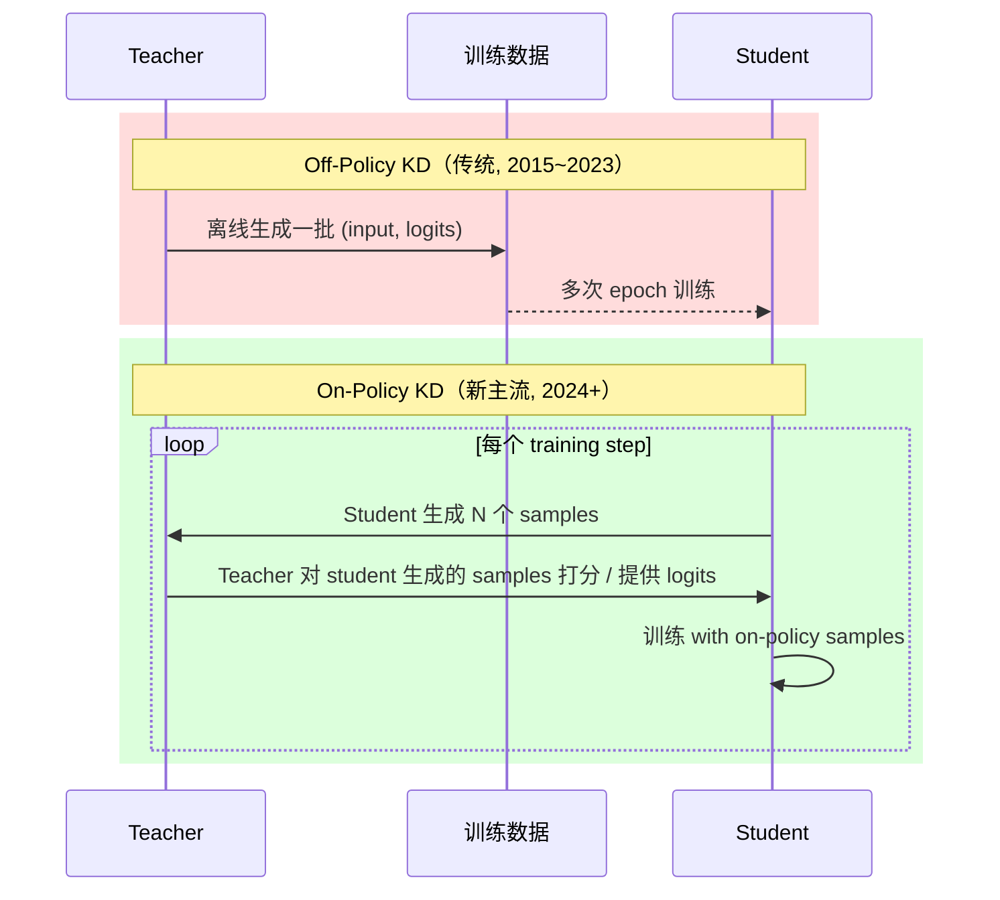
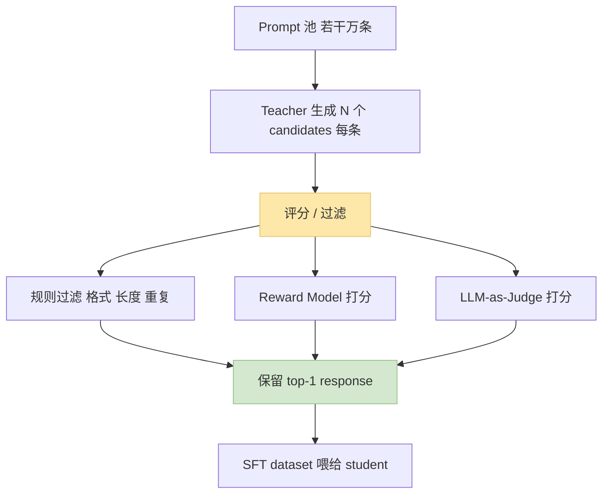
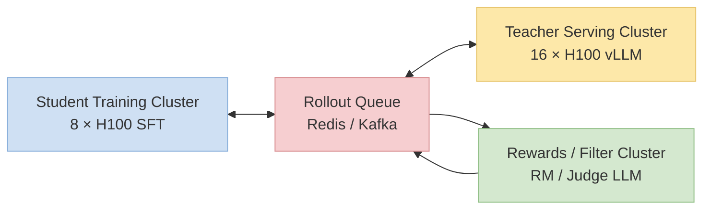
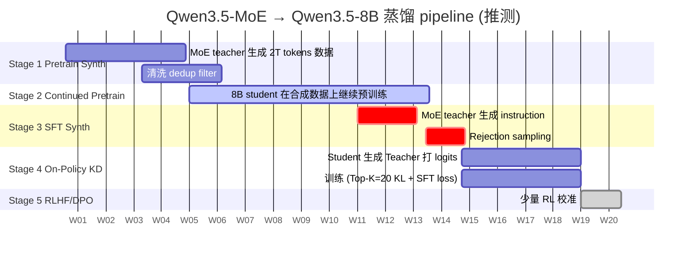

> 训推加速系列深化之"MoE → Dense 蒸馏"专题。2024~2026 开源社区最成功的一条落地路线——**先用巨大 MoE 预训练到 SOTA，再蒸馏成消费级 Dense 模型**。代表作：Qwen3-MoE → Qwen3-Dense / Gemma-Large → Gemma-3n / DeepSeek-V3 → DeepSeek-R1-Distill 系列。
>
> 姊妹篇：[训推加速技术地图](/posts/training-inference-acceleration-map/) · [Speculative Decoding 实战](/posts/speculative-decoding-eagle3-vllm/) · [效果指标全景](/posts/training-inference-quality-metrics/)
>
> ⚠️ **时效声明（最后更新：2026-05-08）**：蒸馏方法论在 2024~2026 快速演进，On-Policy KD + vLLM 批量 rollout 是当前事实标准，本文以此为基线。

---

## 零、本文骨架

| 小节 | 主题 | 产出 |
|---|---|---|
| §一 | 为什么要"MoE 教师→Dense 学生" | 三个现实约束 |
| §二 | 知识蒸馏基础 | Hard / Soft / Feature / Logit 四类 |
| §三 | On-Policy vs Off-Policy KD | **核心区别 + 为什么 On-Policy 胜出** |
| §四 | Top-K Logit 蒸馏 | 工程优化 + 数学 |
| §五 | Rejection Sampling SFT + 合成数据 | 现代 pipeline 的筋骨 |
| §六 | vLLM / SGLang 批量 rollout | Teacher 推理的 10× 加速 |
| §七 | Qwen3.5-MoE → Qwen3.5-8B 推测路径 | 结合公开信息推演完整 pipeline |
| §八 | 蒸馏效果评估 | 能否保留教师推理 / 代码 / 长上下文 |
| §九 | 常见陷阱 + 调参清单 | 7 条工程教训 |
| §十 | 权威参考 | - |

---

## 一、为什么要"MoE 教师 → Dense 学生"

2024 年后，开源社区顶尖模型都是 MoE（DeepSeek-V3 / Qwen3-MoE / Mixtral 大尺寸）。但 **MoE 训得好 ≠ MoE 能部署**——三个现实约束让"MoE 教师 + Dense 学生"成为主流：



**蒸馏范式的三大收益**：

1. **保留 MoE 教师的推理 / 代码能力**（不蒸馏直接训 Dense 通常差 1~3 个 benchmark 点）
2. **合成数据质量 > 人工数据**（教师产出比 Reddit / 论坛数据干净得多）
3. **可迭代**：教师本身可以越来越强，学生跟着升级

---

## 二、知识蒸馏基础（4 类）



### 2.1 Hard Label KD（SFT with 合成数据）

$$
\mathcal{L}_\text{hard} = -\sum_i \log P_\text{student}(y_i^* \mid x_i)
$$

其中 $y_i^* = \arg\max P_\text{teacher}(\cdot \mid x_i)$。本质就是"用教师的输出做 SFT 数据"。

### 2.2 Soft Label / Logit KD（Hinton 经典）

$$
\mathcal{L}_\text{soft} = \tau^2 \cdot D_\text{KL}\left(\sigma\left(\tfrac{z_\text{teacher}}{\tau}\right) \Big\| \sigma\left(\tfrac{z_\text{student}}{\tau}\right)\right)
$$

- $\tau$：温度，典型 1~4
- $\sigma$：softmax
- $\tau^2$ 系数是为了保持梯度量级

**直觉**：不止告诉学生"正确答案"，还告诉它"每个错误答案有多错"——信息量 > Hard Label。

### 2.3 Feature Map KD（中间层对齐）

$$
\mathcal{L}_\text{feat} = \sum_\ell \| h_\ell^\text{student} - W_\ell h_\ell^\text{teacher} \|_2^2
$$

- $W_\ell$：projection 矩阵（因为学生维度通常 < 教师）

**LLM 不常用**：不同层的语义对应不稳定，维度差异大。更多在 encoder 模型（BERT 蒸 MiniLM）上用。

### 2.4 组合 Loss（工业通用）

$$
\mathcal{L} = \alpha \mathcal{L}_\text{hard} + \beta \mathcal{L}_\text{soft} + \gamma \mathcal{L}_\text{feat}
$$

典型 $\alpha=0.3, \beta=0.7, \gamma=0$（LLM 蒸馏）。

---

## 三、On-Policy vs Off-Policy KD

**2024 年最重要的认知升级**——KD 分 On-Policy 和 Off-Policy 两派，效果天差地别。



### 3.1 Off-Policy：教师生成，学生学

- **流程**：Teacher 先跑一遍所有输入数据，存下 logits / samples → Student 从中学
- **优点**：Teacher 只跑一次，计算成本低
- **缺点**：**分布失配**——学生生成的 distribution 随训练而变，训练中期 student 的 distribution 已经和固定数据集差远了，学不到新东西

### 3.2 On-Policy：学生生成，教师指导

- **流程**：每个 step 学生生成 → 教师**实时**打分 / 提供 logits → 学生用这些 fresh label 训练
- **优点**：**teacher 永远在 student 当前的 distribution 上提供信号**，永远学得到新东西
- **缺点**：**Teacher 每个 step 都要跑推理**——计算成本 10~50×

**2024 年的工程突破让 On-Policy 胜出**：**vLLM / SGLang 的批量推理**把 Teacher rollout 成本压到可接受——**这是为什么 Qwen3-Distill / Gemma-Distill 全走 On-Policy**。

### 3.3 直观对比表

| 维度 | Off-Policy | On-Policy |
|---|---|---|
| Teacher 推理次数 | 一次性 | 每 step |
| 训练 loss 曲线 | 平 | 更陡下降 |
| 最终效果 | 差 2~5% | SOTA 基线 |
| 工程复杂度 | 低 | 需要 teacher serving |
| 显存需求 | 低（无 teacher） | 高（teacher + student 同卡 or 独立集群） |
| 2024+ 推荐 | ❌ | ✅ |

---

## 四、Top-K Logit 蒸馏（工程优化）

**问题**：Qwen3 vocab ≈ 150,000。完整 logits 一个 token 就要 300KB（bf16）。一条 4k 序列的完整 logits = **1.2GB**。存盘训练完全不现实。

**解法**：只存 **Top-K 概率最高**的 logits（典型 K=10~50）。

### 4.1 Top-K KL 公式

$$
\mathcal{L}_\text{topK} = \sum_{k \in \text{TopK}} p_\text{teacher}(k) \cdot \log\frac{p_\text{teacher}(k)}{p_\text{student}(k)}
$$

对 Top-K 外的 "everything else" 归一化到一个 catch-all bucket，保持概率归一。

### 4.2 带宽节省

| 方案 | 每 token logits 大小 | 1M token 存盘 |
|---|---|---|
| Full logits (bf16) | 300 KB | 300 GB |
| Top-20 logits + indices | ~150 B | 150 MB |
| Top-10 logits + indices | ~80 B | 80 MB |

**节省 1000~4000×**。这就是为什么 Top-K 是工业级蒸馏的事实标准。

### 4.3 对效果的影响

实测（各家 paper / tech report 趋势）：
- K = 1：等价于 Hard Label，降 2~4 个 benchmark 点
- K = 5：大部分场景够用
- **K = 20**：蒸馏 SOTA 常用值，几乎无损
- K = 50+：边际收益很小，带宽翻倍

---

## 五、Rejection Sampling SFT + 合成数据 pipeline

### 5.1 Rejection Sampling SFT 流程



### 5.2 合成数据 pipeline 的 3 个层次

- **L1 Pretraining Synth**：教师产出大量"干净 + 高质量"文本作为预训练数据增强
- **L2 Instruction Synth**：教师演示如何回答 instruction / 做推理
- **L3 Capability-specific Synth**：数学 / 代码 / 长链路工具调用专项数据

Qwen3 / Llama-3 / Gemma-3 的 tech report 都提到 L2+L3 占 SFT 数据的 **70~90%**。人工数据已经退居次席。

### 5.3 接受率数学

设 teacher 对 prompt $x$ 生成 N candidates，经 reward 打分保留 top-1，**接受率**：

$$
\alpha_\text{sft} = P(\text{reward}(y^*) > \theta)
$$

- $y^* = \arg\max_i r(y_i)$ 是最高分 candidate
- $\theta$ 是质量门槛

典型 $\alpha_\text{sft} \in [0.3, 0.6]$ ——意味着要丢掉 40~70% 的教师生成。这是合成数据 pipeline 的核心成本。

---

## 六、vLLM / SGLang 批量 Rollout：Teacher 推理的 10× 加速

### 6.1 为什么 rollout 是瓶颈

On-Policy KD 一个 epoch 的算力分配：

| 阶段 | 占比 | 备注 |
|---|---|---|
| Teacher Rollout | **50~70%** | 大模型推理慢 |
| Student Forward + Backward | 20~30% | |
| Data loading / filter | 5~10% | |

**Teacher rollout 是绝对的瓶颈**——如果教师是 671B 的 DeepSeek-V3 / Qwen3-MoE-235B，每次 rollout 十几秒，整个训练会被它卡住。

### 6.2 vLLM / SGLang 的作用

这两个推理引擎把 teacher rollout 的吞吐提升 10~50× 相对 transformers naive 推理：

- **Continuous batching**：多条 prompt 的 decode 同时进行
- **PagedAttention**：KV cache 碎片化管理
- **Prefix caching**：相同 prompt 前缀的 KV 复用
- **Speculative Decoding**（见 [篇 O](/posts/speculative-decoding-eagle3-vllm/)）：teacher 自己上 EAGLE-3 也能加速

### 6.3 典型 Pipeline 架构



### 6.4 工程经验

- Teacher serving 与 student training **物理解耦**到不同 GPU pool
- 两者通过 **消息队列 + batched API** 解耦
- Teacher 可以挂 **EAGLE-3 / FP8**（见篇 O 和技术地图篇）进一步加速
- Student 训练时 **prefetch** 下一批 rollout data，形成流水线

---

## 七、Qwen3.5-MoE → Qwen3.5-8B 推测路径

基于 Qwen3 / DeepSeek-V3 公开 tech report 推演（非官方，仅作推测）：



### 7.1 五阶段详细分解

| 阶段 | 关键动作 | 教师角色 |
|---|---|---|
| 1. Pretrain Synth | Teacher 生成大量高质量文本 | 充当高质量数据生成器 |
| 2. Continued Pretrain | Student 继续预训练 | 无 |
| 3. SFT Synth | Teacher 演示指令遵循 / 推理 | Rejection Sampling 评分 |
| 4. **On-Policy KD** | Student rollout, teacher 实时打 logits | 提供 Top-K logits 监督信号 |
| 5. RLHF / DPO | 小规模偏好对齐 | 可选作为 reward |

### 7.2 资源预估（推测）

- **Teacher serving**：16~32 × H100 vLLM 集群，常驻几个月
- **Student training**：8~16 × H100（8B 级别）
- **Synth 数据量**：Pretrain ~2T tokens + SFT ~500M tokens
- **总耗时**：3~6 个月

---

## 八、蒸馏效果评估

### 8.1 评测维度

按 [效果指标篇](/posts/training-inference-quality-metrics/) 的分层：

| 维度 | 典型 benchmark | 蒸馏后掉点容忍 |
|---|---|---|
| 通用知识 | MMLU / C-Eval | < 2% |
| 数学推理 | GSM8K / MATH | < 3%（推理最难蒸馏） |
| 代码 | HumanEval / MBPP | < 2% |
| 指令遵循 | IFEval | < 2% |
| 长上下文 | LongBench | < 3% |
| 主观质量 | Chatbot Arena Elo | < 30 Elo |

### 8.2 典型蒸馏效果（各家 tech report 趋势）

| Student 大小 / Teacher | MMLU 保留率 | GSM8K 保留率 | HumanEval 保留率 |
|---|---|---|---|
| 8B dense / 235B MoE | ~95% | ~90% | ~92% |
| 3B dense / 235B MoE | ~90% | ~82% | ~85% |
| 0.5B dense / 235B MoE | ~80% | ~65% | ~75% |

**保留率**（= Student 分 / Teacher 分 × 100%）。**越小的 student 保留率越低**，这是蒸馏的天花板。

### 8.3 On-Policy vs Off-Policy 实测对比（示意）

同一 student（8B）+ 同一 teacher（70B MoE）+ 同一预训练 checkpoint：

| 方法 | MMLU | GSM8K | Elo |
|---|---|---|---|
| 只做 Hard Label SFT | 62.5 | 70.1 | 1080 |
| + Off-Policy Logit KD | 63.2 | 71.8 | 1090 |
| **+ On-Policy KD** | **65.1** | **74.5** | **1115** |
| + On-Policy + Top-20 Logit | 65.3 | 74.9 | 1118 |
| 教师 baseline | 68.2 | 82.0 | 1250 |

On-Policy 相对 Off-Policy 全线 +2~3 点，**这就是为什么 2024 后所有开源 distill 都走 On-Policy**。

---

## 九、常见陷阱 + 调参清单

| # | 陷阱 | 现象 | 解决 |
|---|---|---|---|
| 1 | Teacher / Student 词表不同 | Logit 对齐失败 | 同词表（Qwen3 内部一致） |
| 2 | 温度 $\tau$ 选错 | 分布太尖或太平 | **$\tau = 2.0$ 起步**，在 benchmark 上调 |
| 3 | $\alpha/\beta$ 权重 | 过拟合 hard label | $\beta / \alpha \in [2, 5]$ 经验值 |
| 4 | Teacher rollout 抖动 | 显存 OOM 或超时 | vLLM + EAGLE-3 + batch size=32 |
| 5 | 合成数据多样性不足 | Benchmark 过拟合，通用能力丢 | 多 prompt 源 + 多温度采样 |
| 6 | RejectSample 阈值太严 | 接受率 < 20%，浪费 teacher | 降 threshold 或加人工标注兜底 |
| 7 | 蒸馏不包含长上下文数据 | 学生短文本强 / 长文本崩 | Synth 要专门包含 8K+ 序列样本 |

### 9.1 调参三步

```
Step 1: α=1.0, β=0 (纯 SFT) → baseline
Step 2: α=0.3, β=0.7, τ=2.0, K=20 (Off-Policy logit KD)
Step 3: 切到 On-Policy KD，同参数 → 期望再 +2~3 个 benchmark 点
```

---

## 十、权威参考

**论文**：
- [Distilling the Knowledge in a Neural Network (Hinton, 2015)](https://arxiv.org/abs/1503.02531)
- [MiniLLM (2023)](https://arxiv.org/abs/2306.08543)
- [On-Policy Distillation of Language Models (Google, 2024)](https://arxiv.org/abs/2306.13649)
- [GKD: Generalized Knowledge Distillation (2023)](https://arxiv.org/abs/2306.13649)
- [DeepSeek-R1 Distill 系列 tech report](https://arxiv.org/abs/2501.12948)
- [Gemma 3 Technical Report](https://storage.googleapis.com/deepmind-media/gemma/Gemma3Report.pdf)
- [Qwen3 Technical Report](https://arxiv.org/abs/2412.15115)

**代码**：
- [HuggingFace TRL (DPO/SFT 含 KD)](https://github.com/huggingface/trl)
- [MiniLLM Official](https://github.com/microsoft/LMOps/tree/main/minillm)
- [DistiLLM / DistiLLM-2](https://github.com/jongwooko/distillm)
- [OpenRLHF (支持 KD pipeline)](https://github.com/OpenRLHF/OpenRLHF)
- [Liger Kernel KD loss](https://github.com/linkedin/Liger-Kernel)

**系列文**：
- [训推加速技术地图](/posts/training-inference-acceleration-map/)
- [Speculative Decoding + EAGLE-3](/posts/speculative-decoding-eagle3-vllm/)
- [效率指标 / 效果指标](/posts/training-inference-quality-metrics/)

---

> **一句话总结**：MoE 教师 + Dense 学生是 2024~2026 开源社区性价比最高的落地范式。成功三要素：**On-Policy KD**（胜过 Off-Policy 2~3 点）+ **Top-K Logit**（带宽省 1000×）+ **vLLM 批量 rollout**（Teacher 推理不再是瓶颈）。按这条 pipeline 走，消费级 Dense 模型能保留 MoE 教师 80~95% 的能力。
