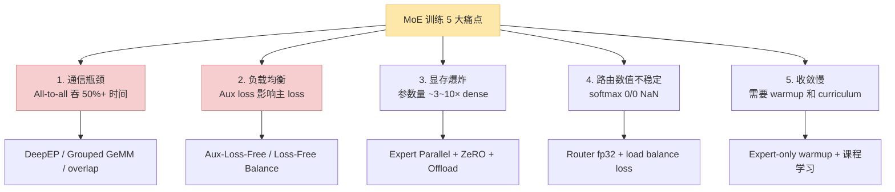
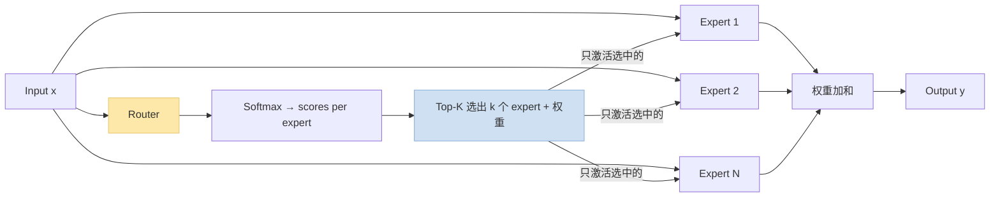
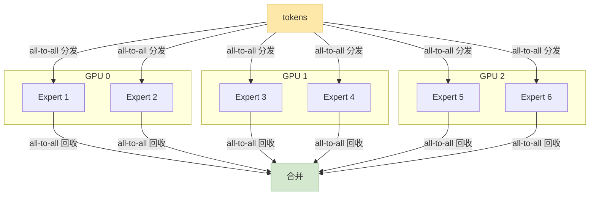
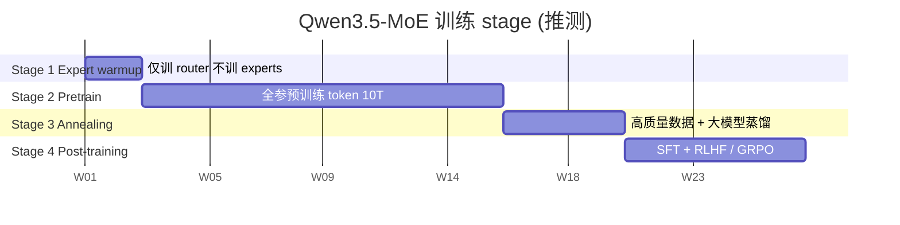

> 训推加速系列深化之"MoE 训练加速"专题。2024~2026 开源 SOTA 基本都走 MoE 路线（DeepSeek-V3 / Qwen3-MoE / Mixtral / GPT-OSS），但 MoE 训练的**通信瓶颈 / 负载均衡 / 路由数值**是三大独立痛点。本篇以 **Qwen3.5 / Qwen3.6 MoE** 级别的训练为 standing example，拆解从 DeepEP 到 Aux-Loss-Free 的完整栈。
>
> 姊妹篇：[训推加速技术地图](/posts/training-inference-acceleration-map/) · [MoE→Dense 蒸馏](/posts/moe-to-dense-distillation/)
>
> ⚠️ **时效声明（最后更新：2026-05-08）**：DeepEP 是 DeepSeek 2025 开源，Aux-Loss-Free 是 DeepSeek-V3 的主要贡献之一。本文反映 2026 年中 SOTA。

---

## 零、本文骨架

| 小节 | 主题 | 产出 |
|---|---|---|
| §一 | MoE 训练的 5 大痛点 | 定位问题 |
| §二 | MoE 基础 & 路由数学 | 通用路由器 + top-k 公式 |
| §三 | **DeepEP：Expert Parallel 通信优化** | 为什么是 MoE 训练栈的底座 |
| §四 | **Grouped GeMM** | Kernel 融合多 expert GeMM |
| §五 | **Aux-Loss-Free Load Balance** | DeepSeek-V3 的关键创新 |
| §六 | Expert 量化 + Offload | 显存手段 |
| §七 | All-to-all / computation 重叠 | 隐藏通信 |
| §八 | Qwen3.5 MoE 推测配方 | 对比 DeepSeek-V3 / Mixtral |
| §九 | 调参清单：capacity / top_k / aux_loss | 工程经验 |
| §十 | 权威参考 | - |

---

## 一、MoE 训练的 5 大痛点



---

## 二、MoE 基础 & 路由数学

### 2.1 MoE Layer 结构



### 2.2 Router 数学

设专家数 $N$、token 特征 $x \in \mathbb{R}^d$、router 参数 $W_r \in \mathbb{R}^{d \times N}$：

$$
g_i(x) = x W_r, \quad \mathrm{scores}(x) = \mathrm{softmax}(g(x))
$$

$$
\mathrm{TopK}: \;\; y = \sum_{i \in \text{top-k}(g(x))} \frac{\mathrm{scores}_i(x)}{\sum_{j \in \text{top-k}} \mathrm{scores}_j} \cdot \mathrm{Expert}_i(x)
$$

典型 $N = 64~256$ experts、$k = 2~8$。

### 2.3 Qwen3.5 / DeepSeek-V3 规格对比

| 模型 | Experts 数 | Top-K | 细粒度 | 激活参数 / 总参数 |
|---|---|---|---|---|
| Mixtral 8x7B | 8 | 2 | 否 | 13B / 46B |
| DeepSeek-V2.5 | 160 | 6 | 是 | 21B / 236B |
| **DeepSeek-V3** | 256 | 8 + **shared expert** | **更细粒度** | 37B / 671B |
| **Qwen3-MoE** | 128 | 8 | 是 | ~22B / ~235B |
| **Qwen3.5-MoE** (推测) | 256+ | 8+ | 细粒度 | — |

**关键趋势**：2024~2026 的 MoE **expert 数越来越多、单个 expert 越来越小（细粒度）**——这让路由更灵活，但通信量陡增。

---

## 三、DeepEP：Expert Parallel 通信优化

### 3.1 Expert Parallelism 是什么

**EP (Expert Parallel)**：把 N 个 expert **分配到 M 个 GPU**，每 token 只 send 到对应 expert 所在的 GPU。和 TP / DP / PP 正交。



### 3.2 为什么 MoE 训练 All-to-all 这么贵

每个 MoE layer 有**两次 all-to-all**：
1. **Dispatch**：把 token 发到对应 expert 所在 GPU
2. **Combine**：expert 算完后把结果收回原 GPU

一个 Qwen3.5-MoE 级别（假设 36 MoE layers）的模型，**单步训练要跑 72 次 all-to-all**。通信量 ~$O(L \cdot B \cdot T \cdot H / \text{k ratio})$——可能 **占训练时间 50%+**。

### 3.3 DeepEP 做了什么

DeepSeek 2025 开源的 **DeepEP** 是针对 MoE all-to-all 做的专门通信库，核心优化：

- **低延迟 all-to-all**（基于 NVSHMEM，绕开 NCCL 的 CPU 调度开销）
- **训练 + 推理双模式**：训练用 "normal" 模式，推理用 "low-latency" 模式（更激进）
- **Prefetch / 通信计算重叠**：send / recv 异步发起，隐藏通信
- **Intranode / Internode 区分优化**：单机内 NVLink / 跨机 IB 分别调度
- **FP8 通信**：传输时数据压到 FP8，带宽 × 2

**实测数据**（示意，取自 DeepSeek 公开 report）：
- H800 集群训练 DeepSeek-V3 的 MoE layer：**all-to-all 时间减少 40~60%**
- 单节点内通信延迟 < 100μs

### 3.4 如何用 DeepEP

```python
# Megatron-Core MoE + DeepEP 集成（示意）
from megatron.core.transformer.moe import GroupedMLP, TokenDispatcher
from deep_ep import Buffer

# Megatron-Core 0.10+ 已内置 DeepEP 后端
moe_config.token_dispatcher_type = "deepep"  # 替代默认的 "alltoall"
moe_config.deepep_mode = "normal"  # "normal" 训练 / "low_latency" 推理
```

**框架支持**：Megatron-Core / SGLang / vLLM 目前都已集成。

---

## 四、Grouped GeMM：Kernel 融合多 expert

### 4.1 为什么需要 Grouped GeMM

MoE forward 的核心：**每个 expert 对分发过来的 tokens 做 GeMM**。

**朴素做法**：for each expert → call cuBLAS GeMM。有 64~256 个 experts 时，**64~256 次独立 kernel launch**——每次 launch 固定开销 3~10μs，累计 200μs~2ms **纯浪费**。

**Grouped GeMM**：用**一个 kernel** 处理 N 个不同 shape 的 GeMM。

### 4.2 数学等价性

朴素：

$$
\forall i \in [1, N]: \;\; y_i = W_i x_i
$$

Grouped：

$$
\begin{pmatrix} y_1 \\ y_2 \\ \vdots \\ y_N \end{pmatrix} = \mathrm{GroupedGeMM}\left(\{x_i\}, \{W_i\}\right)
$$

kernel 内部按 expert 分 tile，避免 N 次独立 kernel launch。

### 4.3 Grouped GeMM 实现来源

| 来源 | 特点 |
|---|---|
| **cuBLAS cublasLtMatmul + strided batch** | 基线，但 expert token 数不等长时效率差 |
| **CUTLASS Grouped GeMM** | NVIDIA 官方高性能实现，Megatron-Core 默认 |
| **Triton Grouped GeMM** | OpenAI Triton 自己写，可定制性强 |
| **FasterTransformer MoE kernel** | 老牌，现代推荐 DeepEP + CUTLASS |

### 4.4 对训练的收益

实测 MoE FFN 部分：
- 朴素逐 expert：**GPU util < 50%**
- Grouped GeMM：**GPU util 80~90%**
- 端到端训练 step 加速 ~10~20%

---

## 五、Aux-Loss-Free Load Balance

### 5.1 负载均衡的老问题

MoE 训练有个"**赢家通吃**"倾向——某些 expert 被选择频繁，另一些被遗弃，最后坍缩成 dense。

### 5.2 传统方案：Auxiliary Loss

**Switch Transformer / GShard** 经典方案：加一个辅助 loss 惩罚负载不均：

$$
\mathcal{L}_\text{aux} = N \cdot \sum_{i=1}^{N} f_i \cdot P_i
$$

- $f_i$: expert $i$ 实际接收的 token 比例
- $P_i$: expert $i$ 的平均 softmax 分数

最终 loss = main loss + $\lambda$ × aux loss。

**问题**：
- $\lambda$ 调不好 → 影响主 loss 收敛
- aux loss 本质是**约束**，强制均衡会牺牲路由质量

### 5.3 DeepSeek-V3 的 Aux-Loss-Free 方案

**核心思想**：**不加 loss**，改而给每个 expert **学一个动态 bias**，让 top-k 选择时考虑当前负载。

$$
g_i(x) = \underbrace{xW_r^i}_\text{原始分数} + \underbrace{b_i}_\text{动态偏置}
$$

- $b_i$ 不参与梯度更新
- **按规则更新**：当 expert $i$ 过载，$b_i \leftarrow b_i - \gamma$；欠载时 $b_i \leftarrow b_i + \gamma$

### 5.4 更新规则

设 expert $i$ 的当前负载 $f_i$，目标负载 $\bar{f} = 1/N$：

$$
b_i^{(t+1)} = b_i^{(t)} + \gamma \cdot \mathrm{sign}(\bar{f} - f_i)
$$

- $\gamma$：bias 更新步长，典型 $10^{-3}$

**好处**：
- 无需改 main loss，不影响收敛
- bias 是 scalar，几乎不增加计算
- **DeepSeek-V3 实测 MFU 比有 aux loss 时高 ~2~3%**

### 5.5 实测对比

| 方案 | Main loss | Load variance | 路由质量 |
|---|---|---|---|
| 无均衡 | 低 | **很高**（坍缩）| 低 |
| Aux loss (Switch) | 被牺牲 | 低 | 中 |
| **Aux-Loss-Free** | **最低** | 低 | **高** |

---

## 六、Expert 量化 + Offload

### 6.1 MoE 的显存分布

Qwen3-MoE-A22B（总 235B）bf16 训练时显存组成：

| 组成 | 占用 |
|---|---|
| 参数 (bf16) | 470 GB |
| 梯度 (bf16) | 470 GB |
| Optimizer (fp32 Adam) | 1880 GB |
| Activation (selective GC) | 200 GB |
| **Total** | **~3 TB** |

**即使用 16 × H100 (80GB) × 8 node = 10TB 显存**，也要精心切分。

### 6.2 Expert 量化

**非激活的 expert** 可以量化到 FP8 / INT8：
- Active 的 top-K expert **保留 bf16** 计算精度
- Inactive expert FP8 存储，dispatch 时再 upcast
- **显存省 30~40%**

### 6.3 Expert Offload

进一步，**不活跃的 expert 权重 offload 到 CPU / NVMe**，需要时再 load。

**风险**：
- NVMe → HBM 传输成本极高（秒级）
- 只对 **expert 访问极度不均** 时收益 positive

实际大 MoE 训练更多用 **ZeRO-3 shard + FSDP**，而非激进的 offload。

---

## 七、All-to-all / computation 重叠

### 7.1 不重叠时序

```mermaid
gantt
    title MoE layer 单步不重叠时序 (示意)
    dateFormat X
    axisFormat %Ss

    section GPU
    Attention forward      :done,   a1, 0, 50
    Router                  :active, r1, 50, 5
    All-to-all dispatch     :crit,   d1, 55, 30
    Expert GeMM forward     :done,   e1, 85, 60
    All-to-all combine      :crit,   c1, 145, 30
    Next layer              :a2, 175, 50
```



**通信占比 ~40%**（dispatch 30 + combine 30 / 总 225）。

### 7.2 重叠后时序

```mermaid
gantt
    title MoE layer 单步重叠时序 (示意)
    dateFormat X
    axisFormat %Ss

    section 计算流
    Attention forward      :done,   a1, 0, 50
    Router                  :active, r1, 50, 5
    Expert GeMM forward     :done,   e1, 55, 60

    section 通信流
    Dispatch A2A            :crit,   d1, 55, 30
    Combine A2A             :crit,   c1, 115, 30

    section Next
    Next layer              :a2, 145, 50
```



通信和 expert 计算**并行**——总时间 145 相对 175 省 ~17%。

### 7.3 实现：双 stream

```python
# 伪代码
compute_stream = torch.cuda.default_stream()
comm_stream = torch.cuda.Stream()

# Dispatch async 到 comm_stream
dispatched_tokens = dispatch_a2a_async(tokens, comm_stream)

with torch.cuda.stream(compute_stream):
    # 一些不依赖 dispatch 的计算
    ...

# Wait dispatch 完成
torch.cuda.current_stream().wait_stream(comm_stream)

# Expert 计算
expert_out = grouped_gemm(dispatched_tokens)

# Combine 也 async
out = combine_a2a_async(expert_out, comm_stream)
```

Megatron-Core / DeepEP 已内置双 stream 调度。

---

## 八、Qwen3.5 MoE 训练推测配方

基于 Qwen3 tech report + DeepSeek-V3 公开信息推演：



### 8.1 关键配置（推测）

| 项 | 参考 DeepSeek-V3 | 推测 Qwen3.5-MoE |
|---|---|---|
| Experts | 256 | 256+ |
| Top-K | 8 + shared | 8~12 |
| 并行 | TP=2 + EP=64 + PP=16 + DP | 类似组合 |
| 并行库 | Megatron-Core + DeepEP | Megatron-Core + DeepEP |
| Router | 细粒度 + Aux-Loss-Free | 沿用 |
| Precision | FP8 训练 + bf16 activation | 同 |
| Capacity factor | 1.0 (严格 load balance) | 1.0 |

### 8.2 集群规模

- 典型 2000~5000 × H100 GPU × 数周
- 数据量 10~20T tokens
- 总训练成本 ~$10M~$30M

### 8.3 Post-training

**Qwen3.5-MoE 训好后通常**：
1. SFT（合成 + 人工指令数据）
2. RLHF / GRPO / DAPO（见 [篇 N](/posts/rl-training-qwen3-vllm-verl/)）
3. **蒸馏到小 Dense**（见 [篇 K](/posts/moe-to-dense-distillation/)）

---

## 九、调参清单

### 9.1 核心超参

| 参数 | 范围 | 说明 |
|---|---|---|
| **capacity_factor** | 1.0~1.5 | 每 expert 允许超过 $\bar{f}$ 的倍数；1.0 严格 / 1.5 宽松（容忍不均）|
| **top_k** | 2, 4, 8 | 每 token 激活 expert 数；多则质量好但通信贵 |
| **router_z_loss** | 1e-3 | 防止 router logits 爆炸 |
| **aux_loss_weight** $\lambda$ | 0.01 | 用 aux loss 时的权重；**Aux-Loss-Free 可设为 0** |
| **num_experts** | 64~256 | 更多 expert 更灵活，但通信贵 |
| **shared_experts** | 0~2 | 所有 token 都走的专家（DeepSeek-V3 用 1）|
| **bias_update_rate** $\gamma$（Aux-Loss-Free）| 1e-3 | Bias 调整步长 |
| **precision** | FP8 fwd + bf16 activation | 常用 FP8 训练 |

### 9.2 典型问题诊断

| 问题 | 可能原因 | 解决 |
|---|---|---|
| Load variance 高 | 无 balance 机制 / $\lambda$ 太小 | 上 Aux-Loss-Free |
| Train loss 跳跃 | Router NaN | Router 上 fp32 + z-loss |
| MFU 低 | All-to-all 阻塞 | 用 DeepEP + 重叠 |
| OOM | Expert 未 shard | Expert Parallel + ZeRO |
| 训练慢但 compute 吃不满 | 通信瓶颈 | profile all-to-all 占比 |

---

## 十、权威参考

**论文**：
- [Switch Transformer (Google, 2021)](https://arxiv.org/abs/2101.03961)
- [GShard (Google, 2020)](https://arxiv.org/abs/2006.16668)
- [Mixtral 8x7B (Mistral, 2024)](https://arxiv.org/abs/2401.04088)
- [DeepSeekMoE (2024)](https://arxiv.org/abs/2401.06066)
- [DeepSeek-V3 (2024)](https://arxiv.org/abs/2412.19437)
- [Aux-Loss-Free Balance (DeepSeek)](https://arxiv.org/abs/2408.15664)
- [Qwen3 Technical Report](https://arxiv.org/abs/2412.15115)

**代码**：
- [DeepEP (DeepSeek)](https://github.com/deepseek-ai/DeepEP)
- [Megatron-Core MoE](https://github.com/NVIDIA/Megatron-LM/tree/main/megatron/core/transformer/moe)
- [Tutel (Microsoft)](https://github.com/microsoft/tutel)
- [FastMoE](https://github.com/laekov/fastmoe)
- [vLLM MoE 支持](https://github.com/vllm-project/vllm)

**系列文**：
- [训推加速技术地图](/posts/training-inference-acceleration-map/)
- [MoE→Dense 蒸馏](/posts/moe-to-dense-distillation/)
- [RL 训练加速](/posts/rl-training-qwen3-vllm-verl/)

---

> **一句话总结**：MoE 训练的三大加速支柱——**DeepEP（all-to-all 省 40%~60%）+ Grouped GeMM（GPU util 50→85%）+ Aux-Loss-Free（MFU +2~3%）**。Qwen3.5-MoE 级别的训练离不开这三件，加上 FP8 训练 + EP/TP/PP/DP 四维并行，2000+ GPU 规模才能跑得起来。
