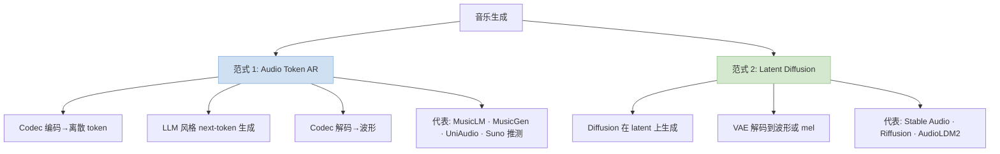
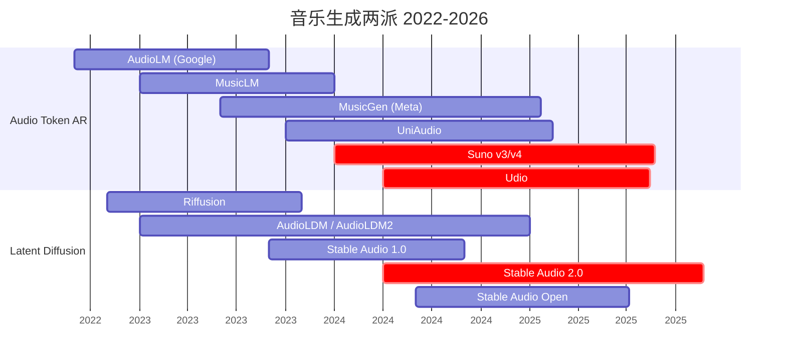
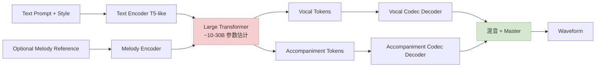
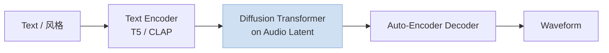

> 训推加速系列深化之"音乐生成"专题。音乐生成是个独立于 TTS 的生成方向——**多轨 / 长序列 / 高保真 / 风格多样**是它独有的挑战。本篇拆解 2024~2026 的两大范式（Audio Token AR vs Latent Diffusion）、加速专项、主流系统。
>
> 姊妹篇：[训推加速技术地图](/posts/training-inference-acceleration-map/) · [语音 / 音频加速](/posts/speech-audio-acceleration-stack/)（补前置概念）
>
> ⚠️ **时效声明（最后更新：2026-05-08）**：音乐生成领域 2024-2026 闭源（Suno / Udio）遥遥领先开源，本文开源栈侧重 MusicGen / UniAudio / Stable Audio Open；闭源侧基于公开技术推测。

---

## 零、本文骨架

| 小节 | 主题 | 产出 |
|---|---|---|
| §一 | 音乐生成 ≠ TTS | 独特挑战 |
| §二 | 两大范式：Audio Token AR vs Latent Diffusion | 核心对比 |
| §三 | 核心基建：高保真音频 codec | DAC / EnCodec high-rate / BigCodec |
| §四 | Suno / Udio 路线推测 | Audio LLM + RVQ + 长序列 |
| §五 | MusicGen / AudioGen / UniAudio 开源方案拆解 | - |
| §六 | Stable Audio Open 2.0 / Riffusion 等 Diffusion 路线 | - |
| §七 | 加速专项：长序列 / 多轨 / 速度 vs 保真 | - |
| §八 | 评测：FAD / CLAP / 主观 Elo | 公式 |
| §九 | 2026 SOTA 推荐配置 | - |
| §十 | 权威参考 | - |

---

## 一、音乐生成 ≠ TTS

### 1.1 独特挑战对比

| 维度 | TTS | 音乐生成 |
|---|---|---|
| 时长 | 1~30 秒 | **30 秒~5 分钟** |
| 采样率 | 22k / 24k Hz | **44.1k / 48k Hz**（高保真）|
| 频谱复杂度 | 单一音色（人声）| **多轨 / 多乐器 / 人声混合** |
| 连贯性要求 | 发音清晰 | **旋律 / 和声 / 节奏 / 风格**全维度 |
| 长距离依赖 | 几秒内 | **几分钟**（主题再现）|
| 语义约束 | 文本转录 | 文本风格描述（更模糊）|

### 1.2 这些差异带来的加速挑战

- **长序列**：3 分钟 44.1k 音频 = 800 万采样点 → 用 codec 压缩后仍 ~9000 tokens（codec ~50 Hz × 180s）
- **高码率**：保真度要求让 codec 层数 / 码率上限拉高（DAC 8 kbps vs TTS 1 kbps）
- **多模态输入**：prompt 不止文本，还有 style reference / melody conditioning
- **评测主观**：没有 WER 那样的客观指标，严重依赖主观听感

---

## 二、两大范式



### 2.1 Audio Token AR 派

**流程**：

$$
\text{text} \to \text{LLM autoregressive} \to \text{audio tokens} \to \text{Codec decoder} \to \text{waveform}
$$

- **优点**：和 LLM 框架复用；可以做长时程一致性
- **缺点**：长序列生成慢（AR 自回归）；高保真需要多层 codec（RVQ hierarchy）
- **代表**：MusicGen / UniAudio / **Suno / Udio**（推测）

### 2.2 Latent Diffusion 派

**流程**：

$$
\text{text} \to \text{Diffusion in latent} \to \text{VAE decoder} \to \text{waveform / mel}
$$

- **优点**：可以并行生成整段（非自回归）
- **缺点**：长音乐需要 long-context diffusion（DiT）；一致性不如 AR
- **代表**：Stable Audio 2.0 / Riffusion / AudioLDM2 / Meta Voicebox/Audiobox

### 2.3 两派的演进趋势



**2024~2026 观察**：Suno / Udio 闭源仍领先；开源侧 Stable Audio Open 2.0 + MusicGen-Melody 是主流。

---

## 三、核心基建：高保真音频 codec

音乐生成的质量下限由 codec 决定。TTS 用 1 kbps 级别（Mimi），音乐至少 6~8 kbps：

| Codec | 码率 | 采样率 | 适合 |
|---|---|---|---|
| EnCodec | 1.5~24 kbps | 24 kHz | 语音 / 音乐（high-rate）|
| **DAC (Descript)** | 8 kbps | 44.1 kHz | **音乐级 SOTA** |
| SoundStream | 3~12 kbps | 24 kHz | 早期方案 |
| **BigCodec** | 1.04 kbps | 16 kHz | 实际更多用于语音 |
| **HiFi-Codec** | 6 kbps | 24 kHz | 音乐 |

### 3.1 DAC 为什么是音乐 SOTA

**Descript Audio Codec (DAC)**（2023）设计目标就是**音乐级保真**：

- 9 层 RVQ，每层 1024 codebook
- 44.1 kHz 重建，几乎人耳不可分辨
- 训练数据覆盖音乐 / 语音 / 环境音
- **被 Stable Audio / UniAudio 广泛采用**

### 3.2 Codec 对 AR 模型的挑战

3 分钟音乐 44.1kHz / DAC 50Hz 下：
- Token 数: 50 × 180 = **9000 tokens per layer**
- 9 层 RVQ: 9 × 9000 = **81000 token 总数**

LLM-style 生成要处理 **8~10 万 token 序列**——这是音乐 AR 生成最大的工程挑战。

---

## 四、Suno / Udio 路线推测

### 4.1 公开信息

Suno / Udio 闭源，仅公开有限信息：

- **Suno v3/v4**：text → 4 分钟歌曲（人声 + 伴奏 + 旋律）
- **Udio v1.5**：132 秒歌曲，风格多样
- **都用 audio token** 路线（从工件分析）
- **人声 + 伴奏分离 tokenize**（多轨 token 并行）

### 4.2 推测架构



### 4.3 推测关键加速

- **多 codec 并行**（人声 / 伴奏分开 tokenize）
- **分层生成**：先生成 semantic，再声学
- **KV cache + 流式 decode**：4 分钟歌 ~1 分钟生成
- **专用硬件集群**

---

## 五、MusicGen / AudioGen / UniAudio 开源拆解

### 5.1 MusicGen (Meta, 2023)

- 架构：Transformer decoder-only
- Codec：EnCodec 32 kHz（4 codebooks）
- 参数：300M / 1.5B / 3.3B
- **关键创新**：**delayed pattern** 让多层 RVQ codebook 并行生成（不用串行）

### 5.2 UniAudio (2023)

- **统一音频生成**：语音 / 音乐 / sound effect / 人声克隆 都同一个模型
- Codec：EnCodec 或 DAC
- 参数：~1B
- 加速关键：**multi-scale transformer**（局部 + 全局）

### 5.3 AudioGen (Meta)

专注 **sound effects**（非音乐），但架构共享。

### 5.4 2024-2026 开源趋势

| 项目 | 特点 | 开源度 |
|---|---|---|
| **MusicGen 家族** | 仍主流开源 baseline | ✅ 完整 |
| **UniAudio 2** | 规模 + 多模态 | ✅ |
| **Stable Audio Open 2.0** | Diffusion 路线，易 fine-tune | ✅ 权重 |
| **YuE (2025)** | 开源长音乐生成尝试 | ✅ |
| **Stable Audio 2.0**（闭源）| 3 分钟 | ❌ |

---

## 六、Latent Diffusion 路线

### 6.1 Stable Audio 2.0 架构



- **Auto-encoder**：把 44.1 kHz 音频压缩到 ~21 Hz latent（压缩率 2000:1）
- **Diffusion**：在 latent 空间跑 DiT，**3 分钟音频 latent ~3800 tokens**（比 AR 路线少 ~20×）
- **采样**：典型 50~100 DDIM 步

### 6.2 Latent Diffusion 的加速

和图像 Diffusion 同技术栈：
- **Flow Matching / Rectified Flow**（Stable Audio 2.0 已用）
- **步数蒸馏**：50 步 → 4~8 步
- **Attention 量化**：SageAttention 适用
- **CFG 优化**

实测 Stable Audio Open 2.0：
- Baseline 100 步：~45s 生成 3 分钟音乐
- + 步数蒸馏（16 步）：~8s
- + SageAttention：~5s

**比 AR 路线快 5~10×**，但一致性略弱。

---

## 七、加速专项

### 7.1 长序列 Attention 稀疏

AR 音乐生成 80K token 是巨大挑战。参考视频 Diffusion 的思路：
- **VSA / SLA** 级别的 sparse attention 也能迁移到音乐 AR
- **Chunked prefill + KV cache 分段**
- **Window Attention**（Mamba / Jamba 路线也能做音乐，处于早期）

### 7.2 多轨并行

Suno / Udio 推测的多轨设计让**人声 / 伴奏** 分 KV cache、并行生成：

$$
T_\text{total} = \max(T_\text{vocal}, T_\text{accomp}) + T_\text{mix}
$$

相比串行 $T_\text{vocal} + T_\text{accomp}$ 省约 40%。

### 7.3 速度 vs 保真 tradeoff

| 场景 | 速度 / 保真 | 方案 |
|---|---|---|
| 创意探索（多版本）| 速度优先 | Stable Audio + 少步蒸馏 |
| 最终产出 | 保真优先 | Suno v4 / MusicGen-Large / 高码率 codec |
| 短音效 | 平衡 | AudioGen |
| 端侧 demo | 超高速 | Kokoro-Music（推测） / 小模型 |

---

## 八、评测

### 8.1 FAD (Fréchet Audio Distance)

音乐版 FID，用 VGGish 或 PANN 特征代替 Inception：

$$
\text{FAD} = \| \mu_r - \mu_g \|^2 + \mathrm{Tr}(\Sigma_r + \Sigma_g - 2(\Sigma_r \Sigma_g)^{1/2})
$$

越低越好。主流模型 FAD（参考）：
- MusicGen-Large: ~4.5
- Stable Audio Open 2: ~3.8
- Suno v3（推测）：~2.5

### 8.2 CLAP Score

CLAP 是 CLIP 的音频版——text / audio embedding 做余弦相似度：

$$
\text{CLAPscore} = \max(0, \cos(\mathrm{CLAP}_t(\text{prompt}), \mathrm{CLAP}_a(\text{audio})))
$$

衡量"生成的音乐和文本描述是否对齐"。

### 8.3 主观 Arena

- **Music AI Arena**（HuggingFace 等）：两段音乐 A/B → 人投票 → Elo
- 2024+ 成为音乐生成的终极评测

### 8.4 结构性评测

- **MOS (Overall Quality)**
- **音乐性 (Musicality)**
- **文本对齐 (Text Alignment)**
- **风格准确 (Style Accuracy)**

---

## 九、2026 SOTA 推荐配置

### 9.1 商业产品对标

```
方向: 内容创作者工具 / 广告背景音 / 短视频 BGM
方案: 直接调 Suno / Udio API
理由: 闭源质量仍领先 1~2 代
```

### 9.2 开源可自建

```
方向: 研究 / 定制训练 / 私有化
SOTA: Stable Audio Open 2.0（步数蒸馏版）+ SageAttention
备选: MusicGen-Large + EnCodec 高码率
框架: Diffusers + ComfyUI Audio 节点
期望: 3 分钟音乐 ~10s 生成 @ H100
```

### 9.3 端侧音乐生成

```
方向: 手机 demo / 个人创作
方案: 小 MusicGen (300M) + GGUF Q4
期望: 30 秒片段 ~10s 生成 @ M2
```

### 9.4 长音乐（> 3 分钟）

```
方向: 完整歌曲 / 配乐
挑战: KV cache 管理 + 主题一致性
方案: Chunk-based + 主题 token 作 global context
代表: Suno v4（闭源实践最佳）
```

---

## 十、权威参考

**论文**：
- [AudioLM (Google, 2022)](https://arxiv.org/abs/2209.03143)
- [MusicLM (Google, 2023)](https://arxiv.org/abs/2301.11325)
- [MusicGen (Meta, 2023)](https://arxiv.org/abs/2306.05284)
- [UniAudio (2023)](https://arxiv.org/abs/2310.00704)
- [Stable Audio 2.0 (Stability, 2024)](https://arxiv.org/abs/2407.14358)
- [DAC Descript Audio Codec (2023)](https://arxiv.org/abs/2306.06546)
- [EnCodec (Meta)](https://arxiv.org/abs/2210.13438)
- [AudioLDM2 (2023)](https://arxiv.org/abs/2308.05734)

**代码**：
- [MusicGen Official](https://github.com/facebookresearch/audiocraft)
- [UniAudio Official](https://github.com/yangdongchao/UniAudio)
- [Stable Audio Open](https://github.com/Stability-AI/stable-audio-tools)
- [DAC Official](https://github.com/descriptinc/descript-audio-codec)
- [Riffusion](https://github.com/riffusion/riffusion)
- [AudioLDM2](https://github.com/haoheliu/AudioLDM2)

**商业产品**：
- [Suno](https://suno.com/)
- [Udio](https://www.udio.com/)
- [AIVA](https://www.aiva.ai/)

**系列文**：
- [训推加速技术地图](/posts/training-inference-acceleration-map/)
- [语音 / 音频加速](/posts/speech-audio-acceleration-stack/)
- [图像 Diffusion 深化](/posts/image-diffusion-acceleration-flux-sd3-dmd2/)（共享 Flow Matching / 步数蒸馏）

---

> **一句话总结**：音乐生成是一套"长序列 + 高码率 codec + 多轨"的独立加速体系。**两大路线并存**——Audio Token AR（Suno / MusicGen，连贯性好）和 Latent Diffusion（Stable Audio，速度快）。2026 开源 SOTA 是 Stable Audio Open 2.0 + DMD 式步数蒸馏；闭源 Suno / Udio 领先，但公开技术细节有限。
