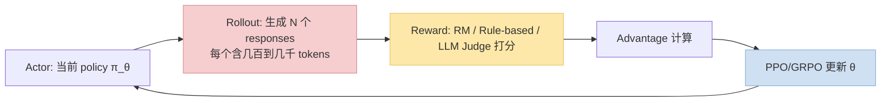
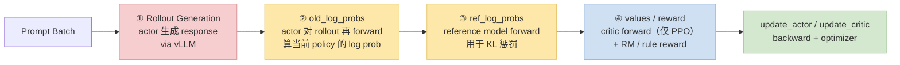
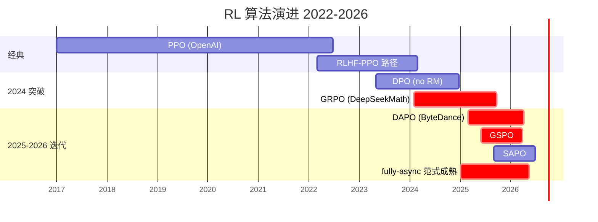
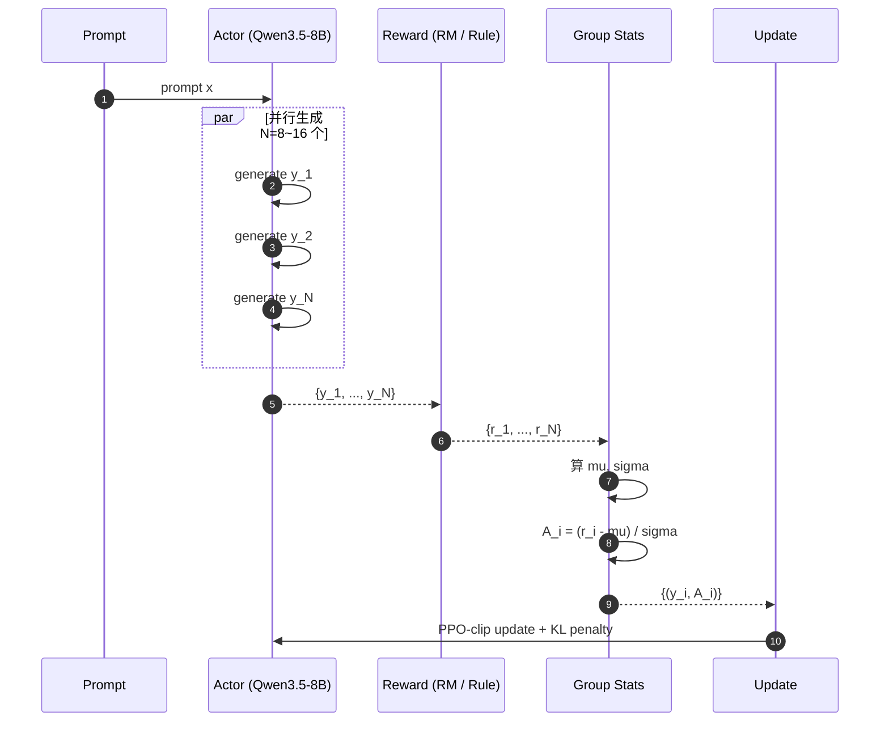
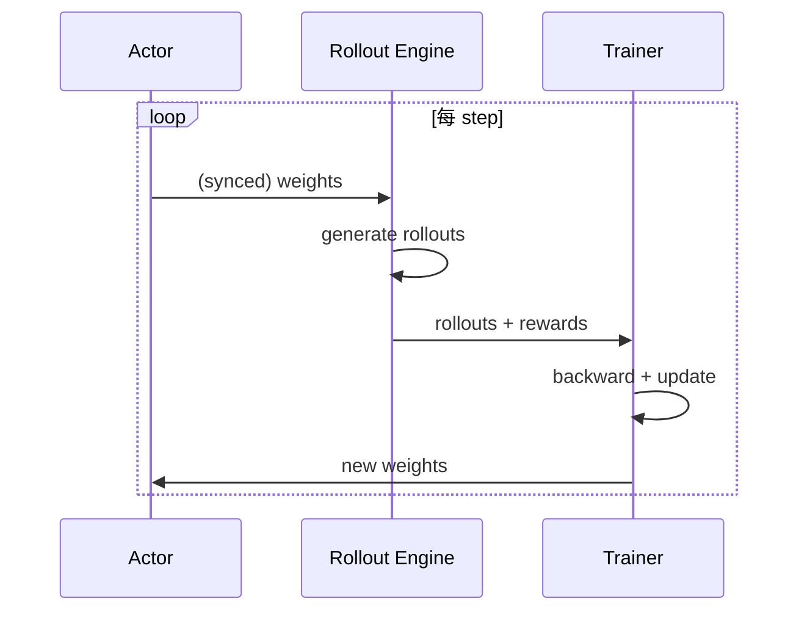
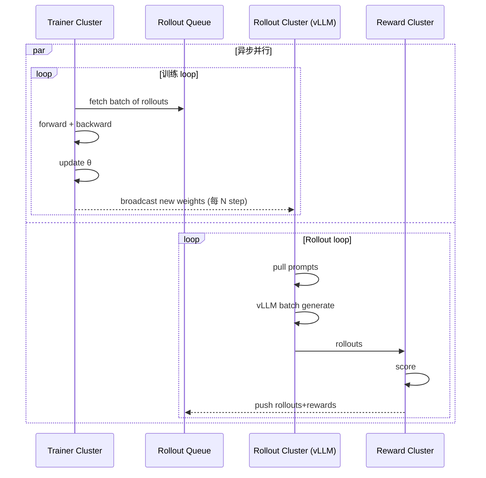
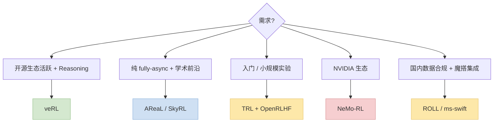
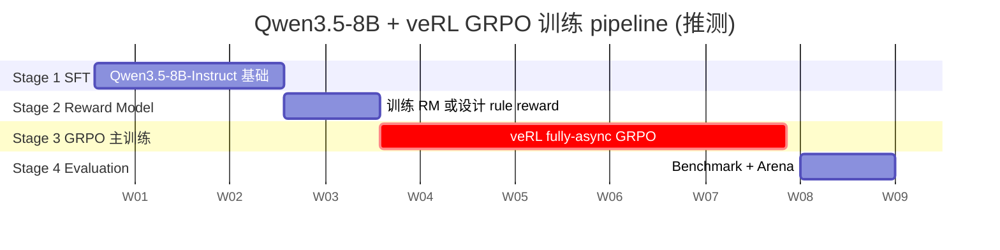

> 训推加速系列深化之"RL 训练"专题。2024~2026 o1 系 reasoning 模型火爆后，**大规模 RL post-training** 成为所有头部实验室的必修课。本篇以 **Qwen3.5 + vLLM + veRL** 为 standing example，讲清 RL 训练的瓶颈、fully-async 架构、GRPO / DAPO / GSPO 等算法、工程陷阱。
>
> 姊妹篇：[训推加速技术地图](/posts/training-inference-acceleration-map/) · [Speculative Decoding + EAGLE-3](/posts/speculative-decoding-eagle3-vllm/) · [MoE→Dense 蒸馏](/posts/moe-to-dense-distillation/)
>
> ⚠️ **时效声明（最后更新：2026-05-08）**：veRL / AReaL / OpenRLHF 都在快速迭代，算法（GRPO 家族）2024~2025 涌现多个变体。本文反映 2026 年中 SOTA 配置。

---

## 零、本文骨架

| 小节 | 主题 | 产出 |
|---|---|---|
| §一 | RL 训练为什么这么贵 | 耗时分布 + rollout 占 70% |
| §二 | RL 算法演进：PPO → GRPO → DAPO / GSPO / SAPO | 时间线 + 公式 |
| §三 | **GRPO 深度拆解**（DeepSeek-R1 用的算法） | 目标函数 + group-relative advantage |
| §四 | Rollout-Train 解耦：fully-async 架构 | sequence 图 + 调度 |
| §五 | **vLLM 在 RL rollout 里的关键作用** | continuous batching + prefix cache |
| §六 | veRL / OpenRLHF / AReaL 框架对比 | 选型建议 |
| §七 | Qwen3.5 + veRL 端到端实战配置 | 从 SFT 到 RL |
| §八 | 工程陷阱：版本不同步 / reward hack / KL 预算 | 7 条 |
| §九 | 评测：sample efficiency / KL / reasoning benchmark | 公式 |
| §十 | 权威参考 | - |

---

## 一、RL 训练为什么这么贵

### 1.1 Pipeline 分解

一个 RL 训练 step 的典型组成：



### 1.2 veRL 的 4 个关键耗时阶段

veRL 把一个 RL training step 拆成**严格的 4 个推理 / 计算阶段** + **2 个更新阶段**，调优前必须搞清楚各自占多少时间。



**典型耗时分布**（Qwen3.5-8B + GRPO + math reasoning，H100 8 卡 实际量级）：

| 阶段 | 占比 | 做什么 | 加速手段 |
|---|---|---|---|
| **① Rollout (generate_sequences)** | **60~70%** | actor 生 N×G 个 responses，长 decode | **vLLM + EAGLE-3 + Prefix Cache** |
| **② old_log_probs** | 5~10% | actor 对 rollouts 再 forward，算 $\pi_{\theta_\text{old}}$ | 用 training-dtype 跑（bf16）|
| **③ ref_log_probs** | 5~10% | reference model forward 算 $\pi_\text{ref}$ | **FP8 ref 模型** / offload 到 CPU / 甚至移除 ref（KL-free 变体）|
| **④ values / reward** | 3~10% | Critic forward（PPO 需要）+ reward 计算 | **GRPO 省 Critic**；Rule-based reward 只要 CPU |
| ⑤ update_actor | 10~15% | actor backward + optimizer step | bf16 + FSDP + GC |
| ⑥ update_critic（若有）| 5~10% | critic backward | 同上，GRPO 不需要 |

### 1.3 为什么这 4 个阶段都是加速目标

每一步都是**独立瓶颈候选**，工程上要逐个 profile：

1. **Rollout**（大头）：vLLM 是必须的，否则直接卡死在这里——下一节专讲
2. **old_log_probs**：容易被忽略——它用的是**训练 dtype 的 actor forward**，和 rollout 用的 vLLM engine **不共享权重和 KV**，需要重算一遍
3. **ref_log_probs**：ref model 只做 forward 不训练，是纯推理负担；但 ref 通常和 actor 同尺寸（7B~70B），占显存 + 算力都大
4. **reward / values**：rule-based reward 很快；RM / Judge 本身是 LLM 推理，接近 rollout 的问题

**工程经验**：①②③ 合起来常占 **80%+** 时间，四个阶段都要针对性优化。

### 1.4 优化各阶段的具体手段

| 阶段 | 具体优化 |
|---|---|
| Rollout | vLLM + Prefix Cache + EAGLE-3 + FP8 KV；high parallelism |
| old_log_probs | 和 actor training 共卡；bf16；分 chunk forward 省显存 |
| ref_log_probs | ref 参数量化 FP8 / INT8；offload；或 **KL-free 变体**（新派 GRPO 直接扔掉 ref，靠 advantage 自身约束）|
| reward | Rule-based 优先；RM 可量化可 offload |
| update | 常规 FSDP / ZeRO 打法，和 SFT 无异 |

### 1.5 时间占比的核心定律

$$
T_\text{RL step} = T_\text{①rollout} + T_\text{②old_lp} + T_\text{③ref_lp} + T_\text{④reward} + T_\text{⑤⑥update}
$$

**Rollout 是瓶颈**——这就是为什么 **vLLM / SGLang 成为 RL 训练的核心组件**。没有它们，Rollout 阶段的吞吐会掉到 transformers naive 推理的 1/10~1/50。

但如果只优化 rollout，②③ 会变相抬升为新瓶颈——典型"**Amdahl 定律**"场景：

$$
\text{Speedup}_\text{overall} = \frac{1}{(1 - p_\text{rollout}) + \frac{p_\text{rollout}}{s_\text{rollout}}}
$$

rollout 占 70%、加速 5× 时，整体只提速到 $\frac{1}{0.3 + 0.14} \approx 2.27\times$——**其他阶段必须跟上**，不然 rollout 越快 ②③④ 的相对占比越大，反而成为新瓶颈。

### 1.3 RL 训练贵的数学本质

设 actor 生成 rollout 耗时 $T_r$，training forward+backward 耗时 $T_t$：

$$
T_\text{RL step} = T_r + T_\text{reward} + T_t
$$

常见比例 $T_r : T_t = 4 : 1$——**你 80% 时间在等 actor 推理，20% 时间在训练**。

所以 RL 训练加速 = **Rollout 推理加速** + **Rollout-Train 重叠**。

---

## 二、RL 算法演进：PPO → GRPO → DAPO / GSPO / SAPO



### 2.1 PPO 回顾

经典 PPO 目标函数：

$$
\mathcal{L}^\text{PPO}(\theta) = \mathbb{E}\left[\min\left(r_t(\theta) \hat{A}_t, \mathrm{clip}(r_t(\theta), 1-\epsilon, 1+\epsilon) \hat{A}_t\right)\right]
$$

- $r_t(\theta) = \frac{\pi_\theta(a_t\|s_t)}{\pi_{\theta_\text{old}}(a_t\|s_t)}$：重要性采样比
- $\hat{A}_t$：GAE 计算的 advantage
- **需要 Critic 模型**估计 value function

**问题**：Critic 和 Actor 同尺寸，double 显存；GAE 噪声大。

### 2.2 GRPO：DeepSeekMath / DeepSeek-R1 的算法

**核心简化**：**不要 Critic**，用 group 内相对 reward 作为 advantage。

对同一 prompt 生成 $G$ 个 responses $\{y_1, ..., y_G\}$，每个获得 reward $r_i$：

$$
\hat{A}_i = \frac{r_i - \mu_r}{\sigma_r}, \quad \mu_r = \frac{1}{G}\sum_i r_i, \quad \sigma_r = \text{std}(r)
$$

然后用 PPO-style clipping：

$$
\mathcal{L}^\text{GRPO}(\theta) = \mathbb{E}\left[\frac{1}{G}\sum_{i=1}^{G} \min\left(r_i(\theta) \hat{A}_i, \mathrm{clip}(r_i(\theta), 1-\epsilon, 1+\epsilon) \hat{A}_i\right) - \beta D_\text{KL}(\pi_\theta \| \pi_\text{ref})\right]
$$

**好处**：
- 省一个 Critic 模型（显存减半）
- Group baseline 比 GAE 更稳
- 在推理 / 数学 / 代码任务上表现超 PPO

### 2.3 DAPO（ByteDance 2025）

DAPO = Decoupled advantage PPO。**对长 reasoning 输出**做了几个关键改进：

1. **Long / Short Advantage 解耦**：长输出和短输出分别归一化，避免长输出被稀释
2. **动态采样**：简单 prompt 少采、难 prompt 多采
3. **Clip-Higher**：放宽正向 clip，鼓励探索

$$
\mathcal{L}^\text{DAPO}(\theta) = \mathbb{E}\left[\frac{1}{G}\sum_{i=1}^{G} \min\left(r_i(\theta) \hat{A}_i, \mathrm{clip}(r_i(\theta), 1-\epsilon_\text{low}, 1+\epsilon_\text{high}) \hat{A}_i\right)\right]
$$

典型 $\epsilon_\text{low} = 0.2, \epsilon_\text{high} = 0.28$。

### 2.4 GSPO（2025）

GSPO = Group-relative advantage with Step-wise weighting。把 GRPO 的 token-level advantage 改为**序列级**再做 step-wise reweighting，稳定性进一步提升。

### 2.5 SAPO（2025）

SAPO = Self-Adaptive PPO。根据当前训练动态调整 clip range / learning rate 等。

### 2.6 工程选型建议

| 算法 | 何时用 |
|---|---|
| **GRPO** | 默认起点（DeepSeek-R1 同款） |
| **DAPO** | 长输出 reasoning（SWE-bench / 长链路 CoT） |
| **GSPO** | GRPO 训不稳时换 |
| **SAPO** | 数据分布变化大 / 混合训练任务 |
| PPO | 只有已经熟悉的团队才要坚持 |
| DPO | 不要 reward 模型的低成本偏好对齐 |

---

## 三、GRPO 深度拆解



### 3.1 Group size 选择

- G = 4：快但噪声大
- **G = 8~16**：最常用，Pareto 最优
- G = 32：接近 population 统计量但 rollout 成本高

### 3.2 KL Penalty 设计

GRPO 的 KL 项相对 reference model（通常是 SFT 后的模型）：

$$
D_\text{KL}(\pi_\theta \| \pi_\text{ref}) = \mathbb{E}_{y \sim \pi_\theta}\left[\log \frac{\pi_\theta(y|x)}{\pi_\text{ref}(y|x)}\right]
$$

**$\beta$ 系数选择**：
- $\beta = 0$：纯 reward 优化，可能 reward hack
- **$\beta = 0.01 \sim 0.04$**：常用，保持基础能力
- $\beta > 0.1$：约束太强，学不动

### 3.3 Reward 设计

GRPO 对 reward 不挑剔，只要能区分同组 samples 就行：

- **Rule-based**（数学 / 代码单元测试）：最稳定，DeepSeek-R1 主力
- **RM-based**：需要先训 RM
- **LLM-as-Judge**：适合没有 ground truth 的场景（创意 / 对话）

---

## 四、Rollout-Train 解耦：fully-async 架构

### 4.1 同步 vs 异步

**传统同步（early OpenRLHF）**：



**问题**：Rollout 跑时，Trainer 空闲；Trainer 跑时，Rollout 空闲。**GPU 利用率 < 50%**。

**fully-async（2025 新范式）**：



**关键点**：
- Trainer 和 Rollout 各占独立 GPU pool
- 通过队列 + 新鲜度 window 解耦
- 新权重广播到 Rollout cluster 的频率 **权衡新鲜度 vs 通信成本**

### 4.2 权重新鲜度（Staleness）

设 rollout 用的是 $\theta_{t-k}$ 版本的 policy（滞后 $k$ 个 step）：

$$
\text{Staleness} = k \in [1, K_\text{max}]
$$

- $k = 1$：几乎同步，GPU 利用率低
- $k = 10~50$：典型 async 设置，**GPU 利用率 > 80%**
- $k > 100$：训练不稳定（off-policy 偏差大）

veRL / AReaL / OpenRLHF 都有 `sync_freq` / `max_staleness` 参数。

### 4.3 fully-async 的收益

实测（示意）：Qwen3.5-8B GRPO 单机 8 × H100：
- 同步 RL：~2.5 hours / 100 steps
- fully-async：**~0.9 hours / 100 steps**（3× 加速）

---

## 五、vLLM 在 RL rollout 里的关键作用

### 5.1 为什么 vLLM 是 RL rollout 首选

| 特性 | 对 RL rollout 的意义 |
|---|---|
| **Continuous batching** | 不同 prompt output 长度不同，vLLM 动态填 batch |
| **Paged Attention** | 多 sample 同 prompt 场景 KV cache 碎片化管理 |
| **Prefix Cache** | GRPO 同 prompt N=16 个 rollouts 共享前缀，省 N× prefill 成本 |
| **Speculative Decoding**（EAGLE-3） | 直接把 decode 速度 ×2~3 |
| **FP8 / INT8** | Rollout 阶段精度要求低，可以量化 |

**Prefix Cache 对 GRPO 的省带效应最明显**：

```
同 prompt N=16 个 rollouts
  不开 Prefix Cache: N × prefill 成本
  开 Prefix Cache:   1 × prefill + N × decode
→ 当 prompt 长、N 大时，省 5~10× rollout 耗时
```

### 5.2 常用配置

```bash
# 启动 vLLM 作为 RL rollout engine
vllm serve Qwen/Qwen3.5-8B \
    --enable-prefix-caching \
    --max-num-seqs 128 \
    --max-num-batched-tokens 16384 \
    --gpu-memory-utilization 0.92 \
    --speculative-config '{"method":"eagle3","num_speculative_tokens":5}' \
    --dtype bfloat16
```

### 5.3 和 SGLang 的对比

| 场景 | vLLM | SGLang |
|---|---|---|
| 标准 RLHF | ✅ 默认 | ✅ |
| 复杂控制流 / 多轮工具调用 | 一般 | ✅ SGLang DSL 更强 |
| Reasoning（长 CoT） | ✅ | ✅ |
| 量化 / 低精度 | FP8/INT8 | FP8 |
| 结社区生态 | veRL 默认 | 也支持 |

**工程经验**：veRL / OpenRLHF 两派都默认 vLLM；SGLang 在 agent / tool-use RL 场景崭露头角。

---

## 六、RL 训练框架对比

### 6.1 2026 主流框架

| 框架 | 出品 | 主打 |
|---|---|---|
| **veRL** | 字节 ByteDance | 开源最活跃，Reasoning / Agent RL 主力 |
| **OpenRLHF** | 开源社区 | 最早 fully-async RLHF 实现之一，Ray-based |
| **AReaL** | 蚂蚁 / 清华 | fully-async 纯异步训练栈 |
| **ROLL** | 阿里 | 和 ms-swift 生态集成 |
| **SkyRL** | UC Berkeley | 学术前沿，fully-async + reasoning |
| **NeMo-RL** | NVIDIA | NeMo 生态的 RL 部分 |
| **TRL** | HuggingFace | 入门友好，但大规模不如其它 |

### 6.2 选型建议



---

## 七、Qwen3.5 + veRL 端到端实战

### 7.1 完整 pipeline



### 7.2 veRL 启动示例（示意）

```bash
# veRL GRPO 配置
python -m verl.trainer.main_ppo \
    actor_rollout_ref.model.path=Qwen/Qwen3.5-8B \
    actor_rollout_ref.rollout.engine=vllm \
    actor_rollout_ref.rollout.tensor_parallel_size=2 \
    actor_rollout_ref.rollout.gpu_memory_utilization=0.85 \
    algorithm.adv_estimator=grpo \
    algorithm.kl_penalty=0.02 \
    data.train_files=[math.parquet] \
    data.max_response_length=4096 \
    reward_model.reward_manager=rule_based \
    trainer.n_gpus_per_node=8 \
    trainer.total_epochs=3
```

### 7.3 关键配置要点

| 参数 | 建议值 | 说明 |
|---|---|---|
| group size (N) | 8~16 | GRPO group 大小 |
| max_response_length | 2048~8192 | Reasoning 任务建议大 |
| kl_penalty β | 0.01~0.04 | 保持 SFT 能力 |
| clip ε | 0.2 / [0.2, 0.28]（DAPO） | PPO clipping |
| rollout TP | 2~4 | vLLM 内部并行 |
| trainer TP | 4~8 | 训练并行 |

---

## 八、工程陷阱

| # | 陷阱 | 现象 | 解决 |
|---|---|---|---|
| 1 | Rollout / Train 版本不同步 | Loss 震荡 | 设 `max_staleness = 10`；高频 sync |
| 2 | Reward hack | Loss 涨但 benchmark 掉 | Rule-based reward + RM cross-check |
| 3 | KL 爆炸 | 训练发散 | 提高 $\beta$ / 降 learning rate |
| 4 | Rollout 吞吐突降 | vLLM prefix cache 失效 | 检查 same prompt 批次是否打乱 |
| 5 | Actor / Critic 显存不均 | Critic OOM | GRPO 直接去 Critic |
| 6 | 长 reasoning 训崩 | GRPO advantage 被稀释 | 换 DAPO / GSPO |
| 7 | Reward 分布退化 | 全组都得高分，区分度丢 | 加 reward normalization 或 RM 重训 |

---

## 九、评测

### 9.1 RL 专用指标

**Sample Efficiency**：每 rollout sample 带来多少 reward 增长。

$$
\text{Sample Eff} = \frac{\Delta R}{N_\text{samples}}
$$

**KL Budget Utilization**：训练消耗的 KL 距离。

$$
\text{KL Budget} = \mathbb{E}\left[D_\text{KL}(\pi_\theta \| \pi_\text{ref})\right]
$$

典型 RL 训练结束时 KL ≈ 5~15 nats。超过 20 nats 通常已经 reward hack。

### 9.2 下游 benchmark

按 [效果指标篇](/posts/training-inference-quality-metrics/#三下游客观指标) 分层：

| 任务类 | Benchmark | Qwen3.5-8B SFT → GRPO 期望提升 |
|---|---|---|
| 数学推理 | GSM8K / MATH | +10~20 绝对点（最有效场景）|
| 代码 | HumanEval / MBPP / LiveCodeBench | +3~8 点 |
| 指令遵循 | IFEval | +2~5 点 |
| 通用知识 | MMLU | 几乎不变 |
| 长上下文推理 | AIME / SWE-bench | +5~15 点 |

**RL 最适合强 verifier 任务**（数学 / 代码），最难处理 verifier 模糊的任务（写作 / 创意）。

---

## 十、权威参考

**论文**：
- [PPO (Schulman et al., 2017)](https://arxiv.org/abs/1707.06347)
- [GRPO / DeepSeekMath (2024)](https://arxiv.org/abs/2402.03300)
- [DeepSeek-R1 Paper](https://arxiv.org/abs/2501.12948)
- [DAPO (ByteDance, 2025)](https://arxiv.org/abs/2503.14476)
- [DPO (Rafailov et al., 2023)](https://arxiv.org/abs/2305.18290)
- [OpenRLHF Paper](https://arxiv.org/abs/2405.11143)
- [AReaL Paper](https://arxiv.org/abs/2505.24298)
- [Kimi K1.5 / o1 替代方案](https://arxiv.org/abs/2501.12599)

**代码**：
- [veRL Official](https://github.com/volcengine/verl)
- [OpenRLHF](https://github.com/OpenRLHF/OpenRLHF)
- [AReaL](https://github.com/inclusionAI/AReaL)
- [TRL](https://github.com/huggingface/trl)
- [SkyRL](https://github.com/NovaSky-AI/SkyRL)
- [NeMo-RL](https://github.com/NVIDIA/NeMo-RL)
- [vLLM](https://github.com/vllm-project/vllm)

**系列文**：
- [训推加速技术地图](/posts/training-inference-acceleration-map/)
- [Speculative Decoding + EAGLE-3](/posts/speculative-decoding-eagle3-vllm/)
- [MoE→Dense 蒸馏](/posts/moe-to-dense-distillation/)
- [效率指标全景](/posts/training-inference-efficiency-metrics/)

---

> **一句话总结**：2024~2026 RL 训练栈的三大支柱——**GRPO 简化算法**（去 Critic）+ **vLLM rollout 加速**（Prefix Cache 省 5~10×）+ **fully-async 架构**（GPU 利用率翻倍）。Qwen3.5 + veRL + vLLM 是开源社区最成熟的落地组合。RL 训练省钱省时的关键不在算法调参，而在 **rollout 推理引擎选型** + **同步 / 异步调度**。
