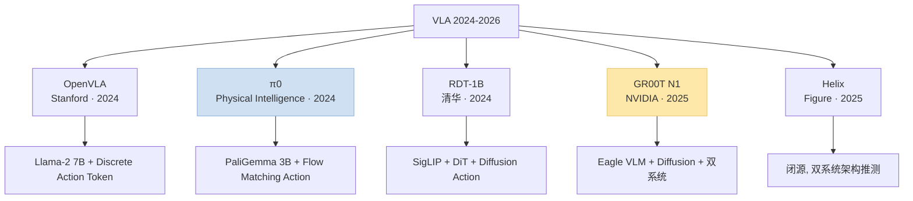
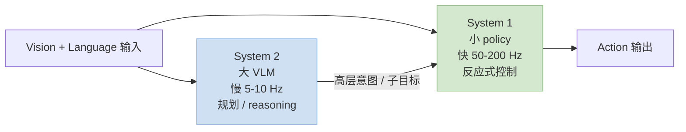
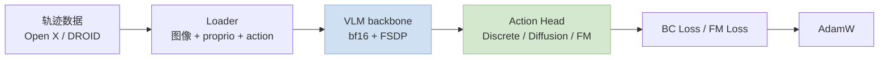
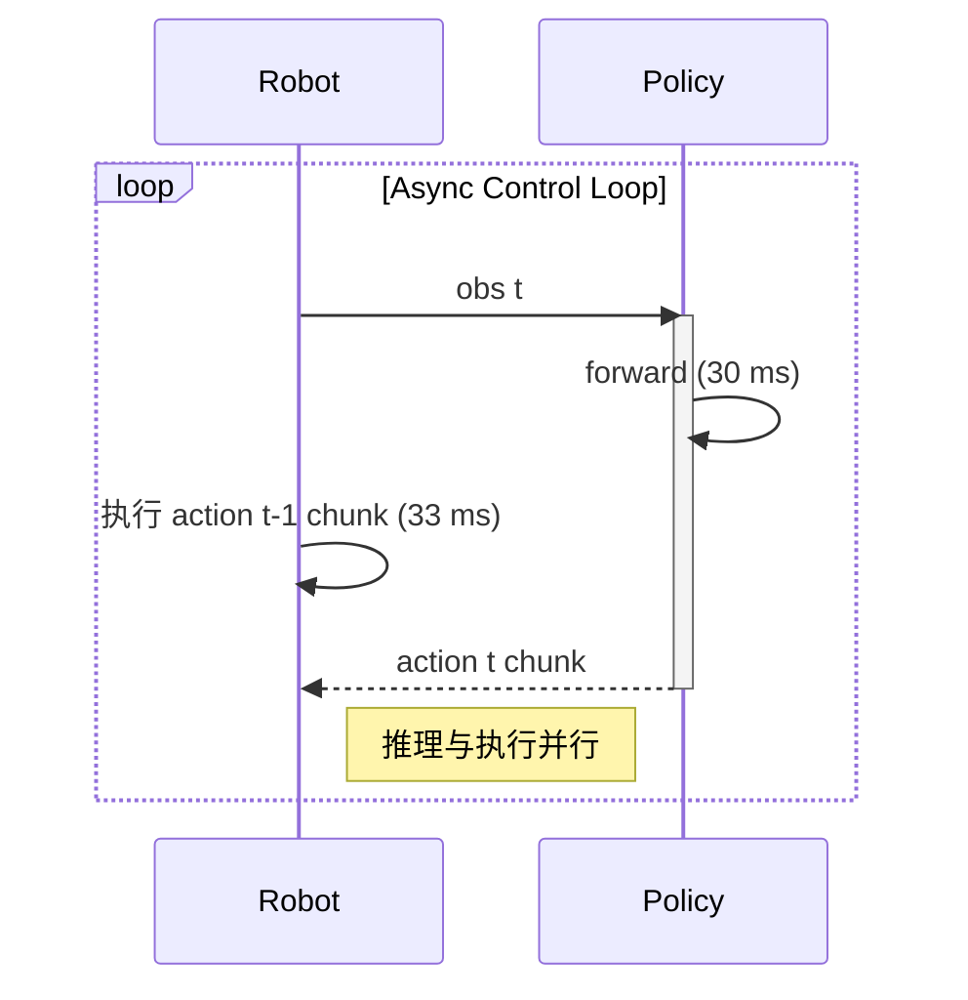

> 训推加速系列深化之"机器人 VLA"专题。**Vision-Language-Action（VLA）模型**是 2024~2026 机器人领域最大范式变化——把 VLM backbone 接上 action head，输出关节 / 末端控制。和对话 LLM 不同，VLA 的加速核心目标不是吞吐而是**控制频率（20~50 Hz）** 和 **sim-to-real 一致性**。
>
> 姊妹篇：[训推加速技术地图](/posts/training-inference-acceleration-map/) · [端侧多模态](/posts/edge-multimodal-end-to-end/) · [RL 训练加速](/posts/rl-training-qwen3-vllm-verl/)
>
> ⚠️ **时效声明（最后更新：2026-05-08）**：OpenVLA / π0 / RDT-1B / GR00T 都是 2024~2025 新东西，本文反映 2026 年中快照，数值为公开资料量级。

---

## 零、本文骨架

| 小节 | 主题 | 产出 |
|---|---|---|
| §一 | VLA ≠ VLM：控制频率是命根 | 独特约束 |
| §二 | 主流 VLA 架构对比 | OpenVLA / π0 / RDT-1B / GR00T |
| §三 | Action Head 设计范式 | Discrete Token / Diffusion / Flow Matching |
| §四 | 延迟预算：端到端 < 50 ms | 逐模块账本 |
| §五 | 训练侧加速 | 大批量模仿学习 + sim-to-real |
| §六 | 推理侧加速 | INT8 / Action Chunk / Async Inference |
| §七 | Benchmark：LIBERO / CALVIN / SimplerEnv | 指标 |
| §八 | 2026 SOTA 配置 | 按部署场景 |
| §九 | 工程陷阱 | - |
| §十 | 权威参考 | - |

---

## 一、VLA ≠ VLM：控制频率是命根

### 1.1 独特约束对比

| 维度 | 对话 VLM | VLA 机器人 |
|---|---|---|
| 输出 | Text token | **关节角 / 末端位姿 / gripper** |
| 频率要求 | 用户可等 秒级 | **20~50 Hz 硬实时** |
| 延迟容忍 | TTFT < 1s | **端到端 < 50ms** |
| 错误代价 | 重新生成 | **可能撞坏硬件 / 伤人** |
| 多模态输入 | Image + Text | **多路相机 + 本体觉 + Text** |
| 评测 | Benchmark 准确率 | **Sim + Real 双栈** |

### 1.2 控制频率的数学约束

机械臂典型控制闭环 20~50 Hz，对应单步推理预算：

$$
T_\text{max} = \frac{1}{f_\text{ctrl}} = \frac{1000}{f_\text{ctrl}} \text{ ms}
$$

- 20 Hz → 50 ms budget
- 30 Hz → 33 ms
- 50 Hz → 20 ms

**这就是 VLA 加速的硬 SLO**——超过就失控或抖动。

---

## 二、主流 VLA 架构对比



### 2.1 关键对比表

| 模型 | 参数 | Backbone | Action Head | 控制频率 | 开源 |
|---|---|---|---|---|---|
| **OpenVLA** | 7B | Llama-2 | Discrete token | ~5 Hz (原版) | ✅ 完整 |
| **π0** | 3B | PaliGemma | **Flow Matching** | 50 Hz | ✅ |
| **π0.5** | 3B | PaliGemma | FM + 泛化增强 | 50 Hz | ✅ 权重 |
| **RDT-1B** | 1B | SigLIP+DiT | Diffusion | ~6 Hz | ✅ |
| **GR00T N1** | - | Eagle VLM | **双系统（快慢）** | 20 Hz | ✅ 权重 |
| **Helix** | - | 闭源 | 双系统 | 200 Hz (快系统) | ❌ |

### 2.2 双系统架构的兴起

2025 趋势：**快慢双系统**（System 1 + System 2），借鉴 Kahneman：



- **GR00T N1 / Helix / Figure** 都走这条路
- System 2 可以 1~5 Hz 跑大模型（reasoning）
- System 1 必须 50~200 Hz（避免抖动 / 碰撞）

---

## 三、Action Head 设计范式

### 3.1 三种主流路线

| 范式 | 代表 | 机制 | 优缺点 |
|---|---|---|---|
| **Discrete Token** | OpenVLA | 离散化动作，LLM next-token | 简单但精度受限 |
| **Diffusion Policy** | RDT-1B / Diffusion Policy | 去噪生成 action 序列 | 多峰分布好，慢 |
| **Flow Matching** | π0 / π0.5 | **一步 / 少步**连续动作 | **最快 + 精度好** |

### 3.2 Flow Matching 为什么快

Diffusion 典型 10~100 步去噪；Flow Matching 训练目标是**匹配速度场**，推理可以**一步出动作**：

$$
a_\text{target} = a_0 + \int_0^1 v_\theta(a_t, t, \text{ctx}) \, dt \approx a_0 + v_\theta(a_0, 0, \text{ctx})
$$

π0 / π0.5 实测单步推理 < 15 ms（含 3B VLM），**是 Diffusion Policy 的 5~10×**。

### 3.3 Action Chunk：一次预测多步

**关键工程 trick**：一次 forward 预测**未来 H=8~16 步**动作，摊薄推理成本：

$$
\text{有效控制频率} = f_\text{推理} \times H
$$

- 推理 10 Hz + H=5 → 有效 50 Hz 控制
- π0 典型 H=50（1 秒预测 50 步）
- 存在风险：长 chunk 对环境变化不 react，配合 **Receding Horizon**（只执行前 K 步再重规划）

---

## 四、延迟预算：端到端 < 50 ms

### 4.1 单步推理时序（示意）

```mermaid
gantt
    title π0 单步 action chunk 推理 (50 Hz control, 示意)
    dateFormat x
    axisFormat %S.%Ls

    section 数据
    相机帧 + 本体觉     :done,   d1, 0, 3
    预处理 / tokenize   :active, d2, 3, 4

    section 模型
    VLM forward (3B)    :crit,   v1, 7, 12
    Flow Matching 1-step :crit,   f1, 19, 8
    Action 反 tokenize  :done,   a1, 27, 2

    section 执行
    ROS / 下发电机      :done,   e1, 29, 3
```



**端到端 ~32 ms** → 支持 30 Hz 控制。

### 4.2 延迟目标 vs 实测（示意量级）

| 平台 | 模型 | 单步推理 | 支持频率 |
|---|---|---|---|
| H100 云端 | OpenVLA 7B bf16 | ~200 ms | ~5 Hz |
| H100 云端 | π0 3B bf16 | ~25 ms | 40 Hz |
| A100 边缘 | π0 3B INT8 | ~15 ms | 60 Hz |
| **Jetson AGX Orin** | **π0.5 INT8** | **~30 ms** | **~30 Hz** |
| Jetson Orin Nano | OpenVLA 7B INT4 | ~150 ms | 6 Hz |

---

## 五、训练侧加速

### 5.1 数据层

- **OpenX-Embodiment**（Google, 2023）：22 机器人、100 万轨迹，统一格式
- **DROID**（Stanford, 2024）：76k 轨迹、564 场景
- **AgiBot World Alpha**（2025）：100 万轨迹、规模 SOTA

### 5.2 模仿学习 pipeline



### 5.3 训练加速 tips

| 技术 | 收益 |
|---|---|
| **FSDP2 + bf16** | backbone 内存 -50% |
| **Action Chunk 预测** | 样本效率 ×H |
| **LoRA fine-tune** | 微调数据小场景首选 |
| **混合精度 Flow Matching loss** | 数值稳定 |
| **Sim 数据增强** | NVIDIA Isaac Sim / MuJoCo 合成轨迹 |

### 5.4 Sim-to-Real

常用组合：
- **Domain Randomization**：随机化纹理 / 光照 / 物理参数
- **DAgger**：在真机 rollout，让老师 re-label
- **Real-data co-training**：sim + real 混合

GR00T N1 用 **神经合成轨迹**（Cosmos 世界模型生成）+ 真机 fine-tune。

---

## 六、推理侧加速

### 6.1 量化

| 方案 | 精度 | 延迟 |
|---|---|---|
| bf16 基线 | 100% | 基线 |
| **INT8 PTQ** | ~98% 成功率保持 | **~1.6×** |
| **INT4 AWQ** (backbone) | ~95% | ~2.5× |
| **FP8 (Hopper)** | ~99% | ~1.8× |

**经验**：Action Head **保持 bf16**（精度敏感），VLM backbone 可积极量化。

### 6.2 Async Inference

边推理边执行：



关键：**推理用上一帧 obs，action chunk 缓冲 2~5 步**，控制环不阻塞。

### 6.3 KV Cache on VLM

VLA 的 VLM 部分可以 **缓存 language instruction 的 KV**（任务级固定），只 prefill 视觉 token——**视觉帧每次变，language token KV 复用**。

典型省 30~50% prefill。

### 6.4 双系统调度

GR00T / Helix 级别：
- **System 2（大 VLM）5 Hz 跑**：给子目标 / waypoints
- **System 1（小 policy ~100M）50~200 Hz 跑**：紧跟子目标 + 反应式

系统间用 **latent embedding** 传递（不是文本），避免 serialization 开销。

---

## 七、Benchmark

### 7.1 主流评测集

| Benchmark | 类型 | 任务 | SOTA 成功率（2026 推测）|
|---|---|---|---|
| **LIBERO** | Sim + 桌面操作 | 130+ 任务 | π0.5 ~90% |
| **CALVIN** | Sim + 长时程操作 | 34 任务链 | ~85% |
| **SimplerEnv** | Sim → Real 可靠代理 | Bridge / Fractal | RDT / π0 ~70% |
| **Real-world eval** | 真机 | 依任务 | 依任务 |

### 7.2 指标公式

**任务成功率**：

$$
\text{Success Rate} = \frac{\text{成功完成任务数}}{\text{总尝试数}}
$$

**长时程任务 compound**：

$$
P_\text{complete-chain} = \prod_{i=1}^{n} p_i
$$

10 步任务每步 95% → 总成功仅 $0.95^{10} \approx 60%$——**长时程是 VLA 最难处**。

**控制抖动**：

$$
\text{Jerk} = \frac{d^3 x}{dt^3}
$$

高频 jerk 指示 policy 不稳定。

---

## 八、2026 SOTA 配置

### 8.1 云端遥操训练

```
模型: π0.5 或 GR00T N1 全参数
硬件: 32 × H100
精度: bf16 + FSDP2
数据: OpenX + DROID + AgiBot + 场景真机
周期: 10~30 天
```

### 8.2 单臂边缘部署

```
平台: Jetson AGX Orin (64 GB)
模型: π0.5 INT8 (backbone) + bf16 (action head)
加速: TensorRT + Triton
目标: 30 Hz 控制，action chunk H=8
```

### 8.3 人形双系统部署

```
System 2: Eagle VLM 7B INT4 @ 5 Hz (reasoning)
System 1: 100M policy bf16 @ 100 Hz (低层控制)
硬件: Orin / Jetson Thor
通信: Shared memory latent (< 1ms)
```

### 8.4 快速 fine-tune 新场景

```
方法: LoRA rank=32 on π0
数据: 10~50 真机 demo
时间: 1~3 小时 on A100
期望: 新任务成功率 > 80%
```

---

## 九、工程陷阱

| # | 陷阱 | 现象 | 解决 |
|---|---|---|---|
| 1 | 推理延迟超 budget | 控制抖动 / 电机报错 | Action chunk + async + 量化 |
| 2 | Sim-to-real gap | Sim 高成功 / 真机失败 | Domain rand + co-training |
| 3 | 量化后精度崩 | Success rate 大掉 | Action head 保 bf16 |
| 4 | 长时程 compound error | 10 步只剩 50% 成功 | 双系统 / 重规划 |
| 5 | KV cache 不复用 | Prefill 吞延迟 | 缓存 language prefix |
| 6 | Flow Matching 数值不稳 | action NaN | 混合精度 + clip 速度场 |
| 7 | ROS 通信 jitter | 实际频率不稳 | RT 内核 + 独立通信线程 |

---

## 十、权威参考

**论文 / 技术报告**：
- [OpenVLA (Stanford, 2024)](https://arxiv.org/abs/2406.09246)
- [π0 (Physical Intelligence, 2024)](https://arxiv.org/abs/2410.24164)
- [π0.5 (2025)](https://arxiv.org/abs/2504.16054)
- [RDT-1B (THU, 2024)](https://arxiv.org/abs/2410.07864)
- [GR00T N1 (NVIDIA, 2025)](https://arxiv.org/abs/2503.14734)
- [Diffusion Policy (2023)](https://arxiv.org/abs/2303.04137)
- [OpenX-Embodiment (2023)](https://arxiv.org/abs/2310.08864)
- [DROID (2024)](https://arxiv.org/abs/2403.12945)
- [AgiBot World (2025)](https://arxiv.org/abs/2503.06669)

**代码**：
- [OpenVLA](https://github.com/openvla/openvla)
- [π0 / openpi](https://github.com/Physical-Intelligence/openpi)
- [RDT](https://github.com/thu-ml/RoboticsDiffusionTransformer)
- [GR00T N1 (NVIDIA)](https://github.com/NVIDIA/Isaac-GR00T)
- [LIBERO](https://github.com/Lifelong-Robot-Learning/LIBERO)
- [SimplerEnv](https://github.com/simpler-env/SimplerEnv)
- [Isaac Sim / Isaac Lab](https://github.com/isaac-sim/IsaacLab)

**商业平台**：
- [Physical Intelligence](https://www.physicalintelligence.company/)
- [Figure](https://www.figure.ai/)
- [1X Technologies](https://www.1x.tech/)

**系列文**：
- [训推加速技术地图](/posts/training-inference-acceleration-map/)
- [端侧多模态](/posts/edge-multimodal-end-to-end/)
- [RL 训练加速](/posts/rl-training-qwen3-vllm-verl/)
- [图像 Diffusion 深化](/posts/image-diffusion-acceleration-flux-sd3-dmd2/)（共享 Flow Matching）

---

> **一句话总结**：VLA 加速的核心约束不是吞吐而是 **20~50 Hz 控制频率**。2026 SOTA 配方 = **Flow Matching action head（一步出动作）+ Action Chunk（摊薄推理）+ 双系统调度（快慢解耦）+ 边缘量化（INT8 backbone / bf16 action head）**。π0.5 / GR00T N1 已能在 Jetson 级硬件上跑 30 Hz 实时控制；长时程 compound error 和 sim-to-real gap 仍是开放难题。
