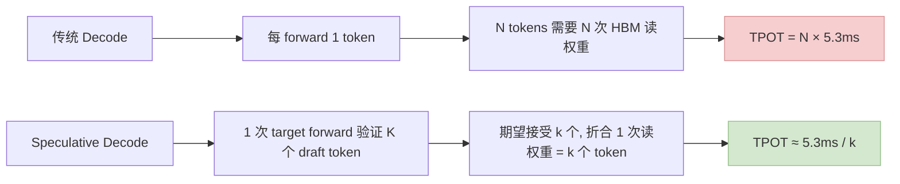
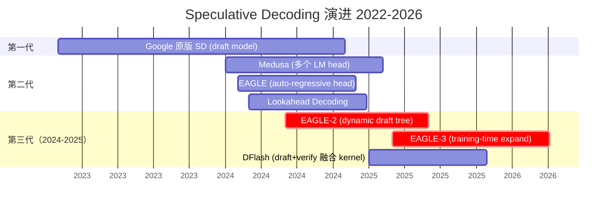
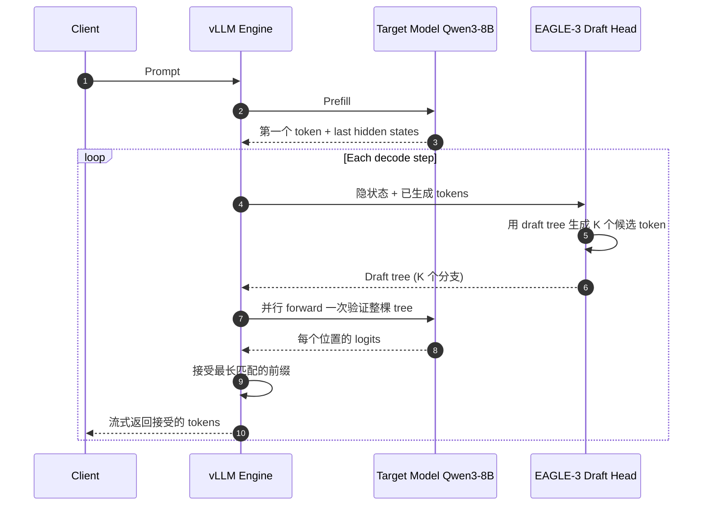
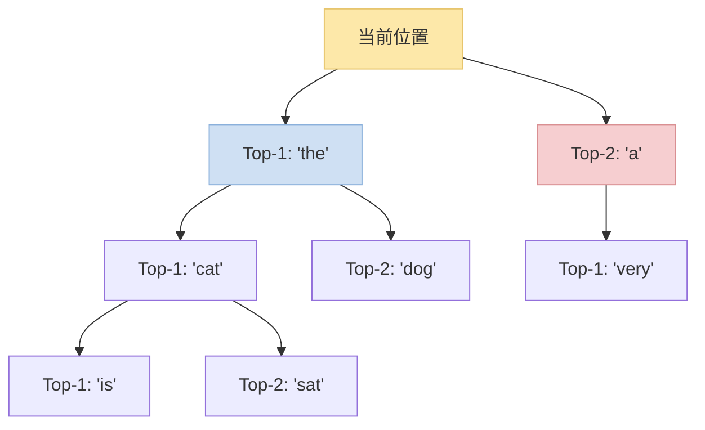
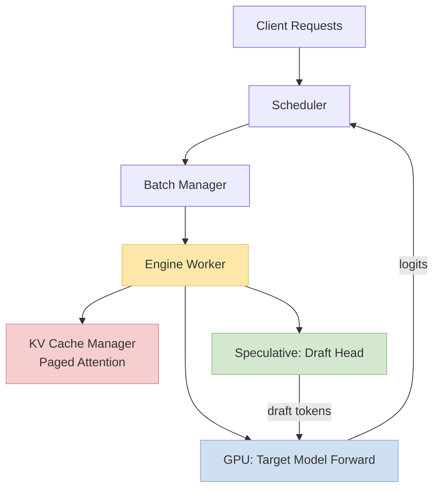
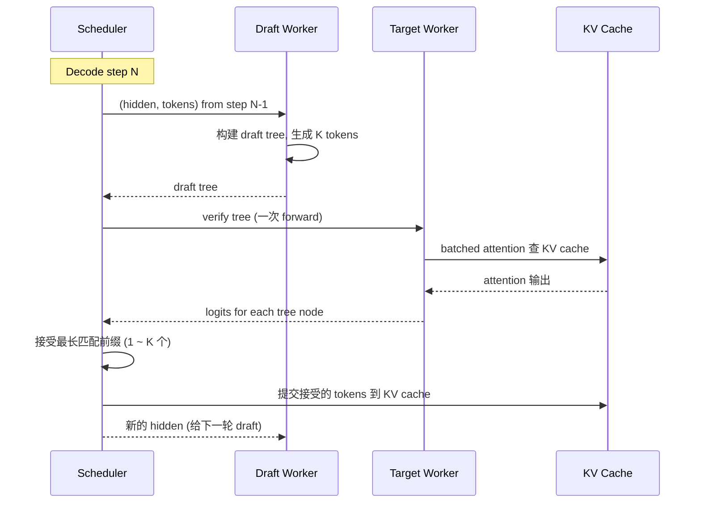

> 训推加速系列深化之"解码优化专题"。以 **vLLM 框架**为基础，拆解 **EAGLE-3** 的原理、数据流、训练 / 推理实战。Speculative Decoding 是 2023~2026 解码加速最重要的一条路线，EAGLE-3 又是这条路线的 2025 SOTA。
>
> 姊妹篇：[训推加速技术地图](/posts/training-inference-acceleration-map/) · [效率指标全景](/posts/training-inference-efficiency-metrics/)（TPOT / Goodput 定义）· [CUDA Graph 实战](/posts/cuda-graph-qwen3-dense/)
>
> ⚠️ **时效声明（最后更新：2026-05-08）**：EAGLE-3 是 2025 发布，vLLM Speculative 相关 API 在 0.6.x~0.7.x 逐步演进。本文以 **vLLM 0.7.x** 为基线；具体命令请以官方文档为准。

---

## 零、本文骨架

| 小节 | 主题 | 产出 |
|---|---|---|
| §一 | 解码阶段的本质瓶颈 | 为什么 decode 是 memory-bound |
| §二 | Speculative Decoding 三代演进 | Google 原版 / Medusa / EAGLE / EAGLE-3 |
| §三 | EAGLE-3 原理深度拆解 | 数据流 + 数学 + 为什么比 EAGLE-2 再快 30~50% |
| §四 | vLLM 中的 Speculative：架构 + 调度 | Draft / Target / Verify 是怎么跑的 |
| §五 | EAGLE-3 + vLLM 实战配置 | 一条命令起服务 |
| §六 | 其它 Speculative 变体速查 | DFlash / PLD / SpecInfer / Ouroboros |
| §七 | Speculative 的数学：接受率 + 期望加速比 | 含公式 |
| §八 | 常见陷阱 + 调优 | 7 条工程教训 |
| §九 | 2026 SOTA 推荐配置 | 按场景 |
| §十 | 权威参考 | - |

---

## 一、解码阶段的本质瓶颈：memory-bound

LLM 推理分两个阶段：

- **Prefill**：吃整段 prompt，一次 forward，**compute-bound**（大矩阵乘）
- **Decode**：逐 token 生成，每步只处理 **1 个新 token**，**memory-bound**（绝大部分时间花在把权重从 HBM 读进计算单元）

Decode 的数学刻画：

$$
\text{TPOT} \approx \frac{N_\text{params} \times \text{bytes_per_param}}{\text{HBM bandwidth}}
$$

Qwen3-8B + bf16 + H100（HBM3 ~3TB/s）：

$$
\text{TPOT}_\text{lower bound} \approx \frac{8 \times 10^9 \times 2}{3 \times 10^{12}} \approx 5.3 \text{ ms}
$$

**这是硬性下界**——不管你怎么优化 kernel，decode 一个 token 不可能快于"把整个模型权重读一遍 HBM 的时间"。

**唯一的破局办法**：**一次 forward 生成多个 token**——这就是 Speculative Decoding。



---

## 二、Speculative Decoding 三代演进



### 2.1 第一代：独立 Draft 模型

Google 2022 的经典范式——**用一个小模型（1B）起草，大模型（70B）验证**。

- 优点：简单，理论清晰
- 缺点：**需要维护两个模型**，两个模型 KV cache 不共享、词表可能不同

### 2.2 第二代：Medusa / EAGLE / Lookahead

**核心思想**：**不要独立 draft 模型**，让大模型自己的最后一层特征**外挂多个 head** 同时预测未来 N 个 token。

- **Medusa**：每个 head 是独立的 MLP，直接预测 `t+1, t+2, ..., t+N`
- **EAGLE**：用一个小 auto-regressive head（类似 mini-transformer），基于大模型的**隐状态**做 draft
- **Lookahead Decoding**：用历史 n-gram 做 draft，无需训练

**EAGLE 关键洞察**：draft 不应该只看 token ID，更应该**直接用大模型的隐状态 feature** 做——这样 draft 天然"知道大模型在想什么"，接受率更高。

### 2.3 第三代：EAGLE-2 / EAGLE-3（2024-2025 SOTA）

| 版本 | 关键改进 |
|---|---|
| **EAGLE-2** | **动态 draft tree**——不再固定 K 个 draft，而是根据置信度动态扩展树形结构 |
| **EAGLE-3** | **训练时特征扩展**（用多层特征而非仅最后一层）+ **训练数据 10 倍扩充** |

**EAGLE-3 相对 EAGLE-2 的数据**（论文 claim）：
- Llama-3.1-8B 上 decode speed +30~50%
- 接受率从 ~0.68 提升到 ~0.78
- 现已成为 vLLM / SGLang 的默认 Speculative 选项

---

## 三、EAGLE-3 原理深度拆解

### 3.1 整体数据流



### 3.2 Draft Head 架构

EAGLE-3 的 draft head **不是**独立小模型，而是：

```
Target Model 最后一层 hidden states ──┐
Target Model 中间若干层 hidden states ─┼── 拼接 → 轻量 Transformer (1~2 层) → 预测下一个 token
已生成 token embeddings ──────────────┘
```

**关键差异（对比 EAGLE-2）**：EAGLE-3 用**多层 hidden states**（不止最后一层），draft head 能看到大模型"更深的思考轨迹"。

### 3.3 Draft Tree 动态扩展

EAGLE-3 推理时构建**树形 draft**，不是线性的：



- 高置信分支多扩几层
- 低置信分支少扩或不扩
- **一次 target forward 验证整棵 tree 上的所有路径**

这是相对线性 Speculative 的最大胜利——**用更少的 target 计算验证更多候选**。

### 3.4 训练

EAGLE-3 draft head 的训练目标：

$$
\mathcal{L} = -\sum_{i=1}^{N} \log P_\text{draft}(y_i \mid h_1, h_2, \ldots, h_L, y_{<i})
$$

- $h_\ell$: target model 第 $\ell$ 层 hidden states
- $y_i$: target model 真正生成的第 i 个 token

**训练数据**：用 target model **自己跑出来的**大量生成序列（self-distillation 思路），比 EAGLE-2 多了 ~10× 数据量。

**收益**：训练好的 draft head 对 target model 的行为"了如指掌"，接受率从 0.68 → 0.78。

---

## 四、vLLM 中的 Speculative：架构 + 调度

### 4.1 vLLM 整体架构速览



**关键点**：vLLM 的 Speculative 不是一个外挂，而是**调度器级别集成**——Draft 生成 + Target 验证是 scheduler 的两个 phase。

### 4.2 调度时序



### 4.3 KV Cache 处理的关键

Speculative 的 KV cache 更复杂——**验证失败的 draft token 占用的 cache 要回滚**。vLLM 的 Paged Attention 天然支持：

- Draft tree 的每个分支用临时 cache block
- 接受的分支 commit 到正式 cache
- 未接受的分支 free 掉 page

**这就是为什么 Paged Attention + Speculative 是绝配**——碎片化分配 + 回滚天然适配。

---

## 五、EAGLE-3 + vLLM 实战配置

### 5.1 一条命令起服务

```bash
# 以 Qwen3-8B 为 target, EAGLE-3 head 为 draft
vllm serve Qwen/Qwen3-8B \
    --speculative-config '{
        "method": "eagle3",
        "model": "yuhuili/EAGLE3-Qwen3-8B-Instruct",
        "num_speculative_tokens": 5,
        "draft_tensor_parallel_size": 1
    }' \
    --max-model-len 8192 \
    --gpu-memory-utilization 0.9 \
    --dtype bfloat16
```

**关键参数**：
- `num_speculative_tokens`：draft tree 深度，典型 4~7
- `method: "eagle3"`（vLLM 0.7.x 后）
- Draft model 必须**匹配 target model**——不同 tokenizer / 不同 hidden dim 都不行

### 5.2 验证效果

```bash
# 压测 decode 速度
vllm benchmark serve --model Qwen/Qwen3-8B \
    --dataset-name sharegpt \
    --num-prompts 200 \
    --max-concurrency 4

# 关注两个指标:
#   TPOT (Time Per Output Token) ← 希望下降 30~50%
#   acceptance_length ← 希望接近 num_speculative_tokens
```

典型 Qwen3-8B + EAGLE-3 + H100 数据（示意，非实测）：

| 配置 | TPOT | 接受率 |
|---|---|---|
| Baseline（无 SD） | ~15 ms | — |
| + EAGLE-2 | ~10 ms | 0.68 |
| + EAGLE-3 | **~6.5 ms** | **0.78** |

**关键直觉**：接受率 0.78 × 5 个 draft = 平均每次 target forward 产出 ~4 个 token，相对 baseline 的 4× 加速理论上限在现实中被通信 / 调度开销打折到 ~2.3×。

---

## 六、其它 Speculative 变体速查

| 方案 | 原理 | 适合 | 相对 EAGLE-3 |
|---|---|---|---|
| **DFlash**（2025）| Draft + Verify **融合到单 kernel**，省调度开销 | 极致轻量部署 | 简单 10~15%，但接受率略低 |
| **PLD (Prompt Lookup)** | 从 prompt 里"复制"作为 draft | 代码 / 问答等 prompt-output 相似场景 | 特定场景超过 EAGLE-3 |
| **SpecInfer** | Tree-based + GPU-friendly kernel | 学术基线 | 被 EAGLE-3 覆盖 |
| **Ouroboros** | Draft 自递归生成 | 长输出 | 独特路线，实测不稳 |
| **Medusa** | 独立多 head 直接预测 | 训练简单 | 被 EAGLE-3 超越，退场 |
| **Lookahead Decoding** | 无训练，n-gram 历史 | 小模型 / 无训练预算 | 质量依赖 prompt |

**2026 推荐**：**默认 EAGLE-3**；代码 / QA 场景补 **PLD**；极致端侧看 **DFlash**。

---

## 七、Speculative 的数学：接受率 + 期望加速比

### 7.1 接受率定义

给定 draft 模型 $q$、target 模型 $p$、draft token $\tilde{y}$：

$$
\alpha = P(\text{accept}) = \min\left(1, \frac{p(\tilde{y})}{q(\tilde{y})}\right)
$$

（**rejection sampling** 原理——保证接受后的分布依然服从 target $p$）

### 7.2 期望加速比

设每轮 draft 生成 $K$ 个 token，接受率 $\alpha$，则期望接受长度：

$$
\mathbb{E}[\text{accepted}] = \sum_{i=0}^{K} \alpha^i = \frac{1 - \alpha^{K+1}}{1 - \alpha}
$$

**理论加速比**（相对无 Speculative）：

$$
\text{Speedup} = \frac{\mathbb{E}[\text{accepted}]}{1 + c}
$$

其中 $c$ 是 draft 相对 target 的**额外开销比例**（EAGLE-3 draft head 极小，$c \approx 0.05$）。

### 7.3 示例计算

Qwen3-8B + EAGLE-3，$\alpha = 0.78$, $K = 5$:

$$
\mathbb{E}[\text{accepted}] = \frac{1 - 0.78^6}{1 - 0.78} \approx \frac{1 - 0.225}{0.22} \approx 3.52
$$

$$
\text{Speedup} \approx \frac{3.52}{1.05} \approx 3.35\times
$$

**实测通常打到理论上限的 60~80%**（2.0~2.7×），gap 来自调度 / KV cache 管理 / kernel launch 开销。

### 7.4 为什么 Acceptance Rate 是**训练侧**指标

这是 Speculative Decoding 一个反直觉的地方——**α 看起来是推理指标，本质却由训练质量 100% 决定**。逻辑链：

$$
\text{Draft 训练质量} \uparrow \;\Rightarrow\; q(y) \approx p(y) \;\Rightarrow\; \min\left(1, \tfrac{p(y)}{q(y)}\right) \to 1 \;\Rightarrow\; \alpha \uparrow \;\Rightarrow\; \text{TPOT} \downarrow
$$

**三个训练决策直接决定推理时的 α**：

| 决策 | 来自训练阶段 | 对 α 的影响 |
|---|---|---|
| **Draft 架构**（多层 feature / draft layer 数） | 训练前定义 | 决定 draft 能"读到大模型多深的思考" |
| **训练数据分布**（self-distillation 数据量 + 覆盖领域） | 训练数据集准备 | EAGLE-3 相对 EAGLE-2 就靠这点把 α 从 0.68 → 0.78 |
| **领域 fine-tune**（代码 / 长对话 / 多语种） | 下游 adapt | 特定场景可再 +15% |

**和常规加速指标的本质区别**：

| 类别 | 指标 | 决定因素 |
|---|---|---|
| 纯推理优化 | TPOT · QPS · P99 | Kernel / 调度 / 显存 |
| 纯训练优化 | Loss · Grad norm · MFU | 优化器 / 并行 / 数据 |
| **Speculative α** | Acceptance rate | **Draft 训练数据 + 架构 + fine-tune** |

**工程结论**：**SD 是少见的"训练侧投入直接换推理侧收益"的技术**。
- 如果 α 已经 > 0.80：推理侧继续调优（KV cache / scheduler / kernel）
- 如果 α < 0.70：别调推理了，回去**扩训练数据 / fine-tune draft head**——收益会大得多

这也解释了为什么 EAGLE-3 论文 60% 篇幅在讲**训练方法**（feature 选择 / 数据扩充 / loss 设计），而不是推理 kernel。

---

## 八、常见陷阱 + 调优

| # | 陷阱 | 现象 | 解决 |
|---|---|---|---|
| 1 | Draft 和 Target 词表不同 | 启动报错 | 用匹配的 EAGLE 权重（`yuhuili/EAGLE3-<模型名>`） |
| 2 | `num_speculative_tokens` 太大 | 接受率低，反而变慢 | 典型 **4~7**，超过 7 边际收益递减 |
| 3 | Batch size 大时加速比掉 | Target forward 本身已 compute-bound | 大 batch（>32）减小 speculative 步长或关闭 |
| 4 | 长输出接受率降 | Draft head 训练数据分布不匹配 | 针对场景 finetune draft head |
| 5 | Greedy vs Sampling 表现差异 | Temperature > 0 时接受率降 | 温度 T 大时降低 spec tokens |
| 6 | KV cache 碎片化 | 显存 OOM | 调 `gpu-memory-utilization` 到 0.85 |
| 7 | Draft 和 Target TP 配置不匹配 | 启动死锁 | `draft_tensor_parallel_size=1` 是默认安全选择 |

### 8.1 调参 3 步

```
step 1: 测 baseline TPOT (关闭 SD)
step 2: 打开 EAGLE-3, num_spec=5, 测 TPOT + acceptance_length
step 3: 如果 acceptance_length > 4.0 → 可以加到 6~7
        如果 < 3.0 → 降到 3~4 或者 draft head finetune
```

---

## 九、2026 SOTA 推荐配置

### 9.1 通用聊天 / 问答 serving

```
Target: Qwen3-8B / Llama-3.1-8B
Draft: EAGLE-3 (num_speculative_tokens=5)
引擎: vLLM 0.7+
KV Cache: Paged Attention + INT8 KV quant
CUDA Graph: mode=reduce-overhead (仅 decode)
期望: TPOT baseline × 0.4~0.5
```

### 9.2 代码 / SWE-bench Agent

```
Target: Qwen3-Coder / DeepSeek-Coder-V2
Draft: EAGLE-3 + PLD 组合（PLD 在代码补全场景接受率 > 0.85）
引擎: vLLM / SGLang
```

### 9.3 长上下文 / RAG

```
Target: Qwen3.5-Long 或 Llama-3.1-405B-long
Draft: EAGLE-3 + MInference（稀疏 attention）
Prefill: chunked prefill 模式
```

### 9.4 端侧推理

```
方案: DFlash（draft + verify 融合 kernel）
Target: Qwen3-0.5B 或 Gemma-3n
引擎: llama.cpp / MLC-LLM 的 Speculative 实验分支
```

---

## 十、权威参考

**论文**：
- [Fast Inference from Transformers via Speculative Decoding (Google, 2022)](https://arxiv.org/abs/2211.17192)
- [Medusa (2024)](https://arxiv.org/abs/2401.10774)
- [EAGLE (2024)](https://arxiv.org/abs/2401.15077)
- [EAGLE-2 (2024)](https://arxiv.org/abs/2406.16858)
- [EAGLE-3 (2025)](https://arxiv.org/abs/2503.01840)
- [SpecInfer (2023)](https://arxiv.org/abs/2305.09781)
- [Lookahead Decoding (2024)](https://arxiv.org/abs/2402.02057)

**代码**：
- [vLLM Speculative Decoding 文档](https://docs.vllm.ai/en/latest/models/spec_decode.html)
- [EAGLE 官方实现](https://github.com/SafeAILab/EAGLE)
- [SGLang Speculative 实现](https://github.com/sgl-project/sglang)
- [TensorRT-LLM Speculative](https://nvidia.github.io/TensorRT-LLM/)

**系列文**：
- [训推加速技术地图](/posts/training-inference-acceleration-map/)
- [效率指标全景](/posts/training-inference-efficiency-metrics/)
- [CUDA Graph 实战](/posts/cuda-graph-qwen3-dense/)
- [Qwen3-8B Triton Kernel 实战](/posts/triton-kernel-fusion-practice/)

---

> **一句话总结**：Decode 是 memory-bound，**单 token forward 不可能快于权重读一遍 HBM 的时间**。Speculative Decoding 是**唯一**突破这个下界的路线——把"1 次 HBM 读 = 1 个 token"变成"1 次 HBM 读 = k 个 token"。EAGLE-3 + vLLM 是 2025-2026 的事实标准，默认开就对了。
