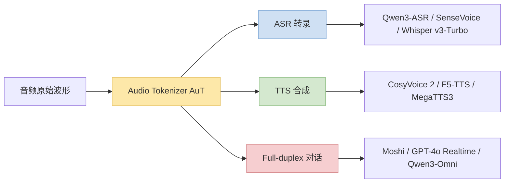
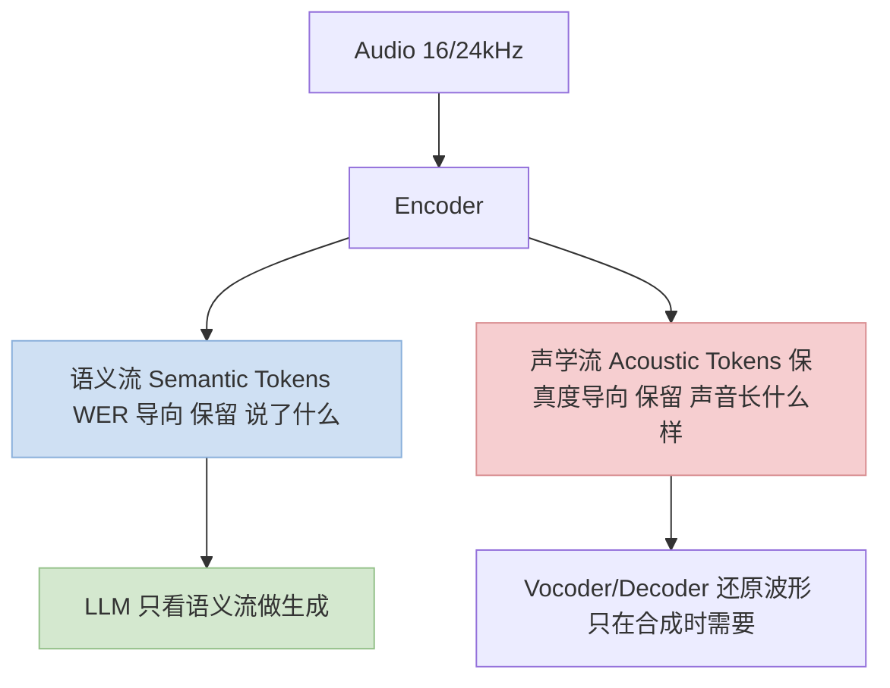
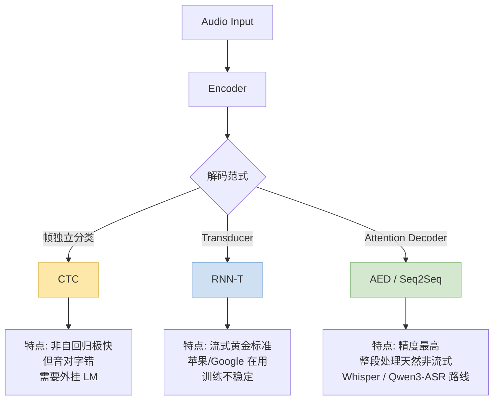
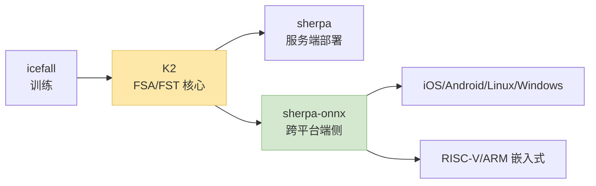
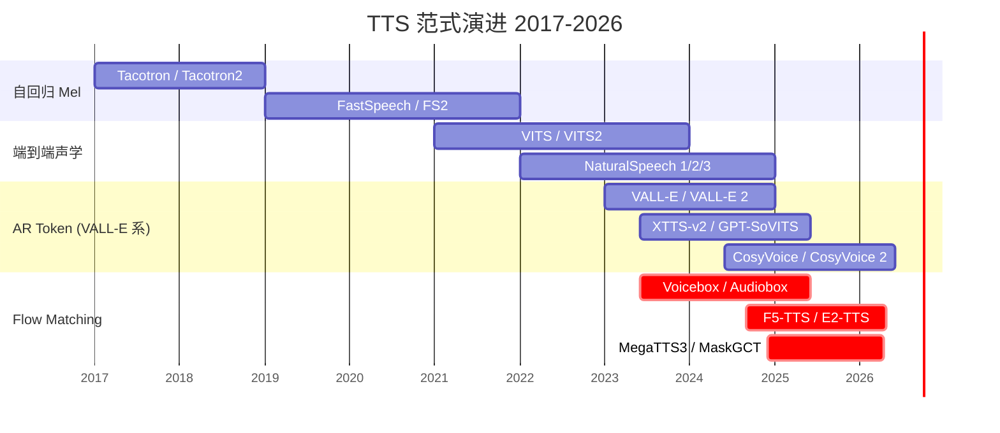
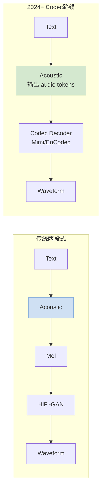
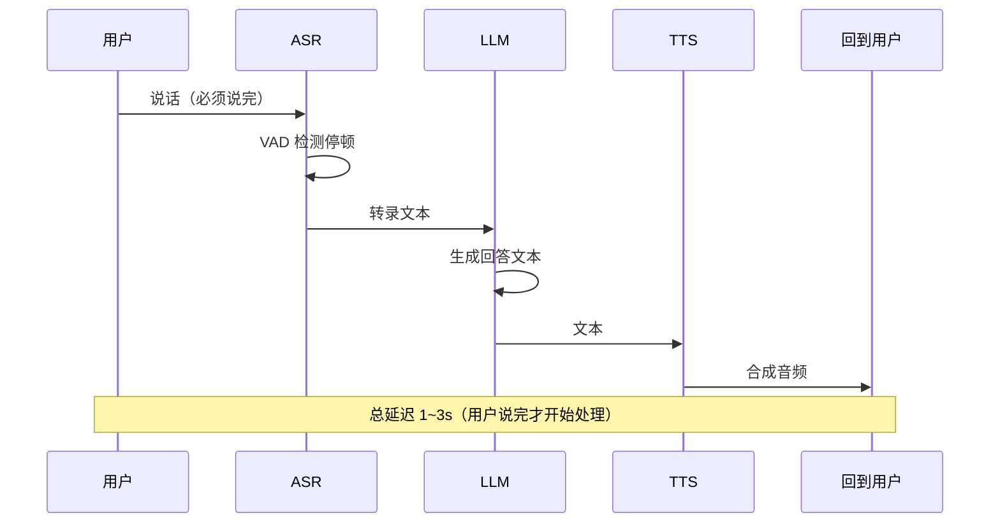
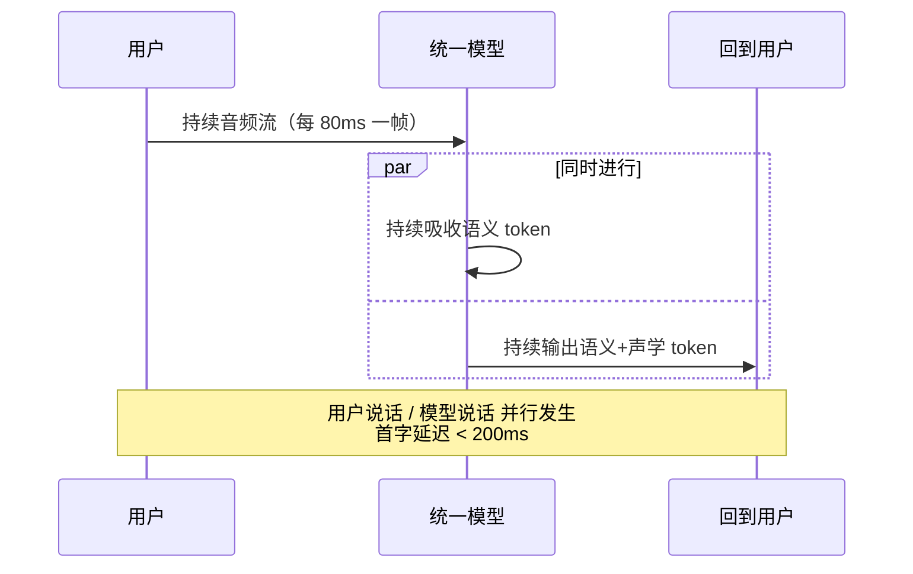
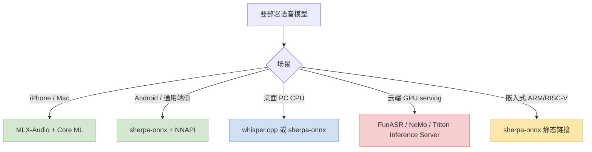

> 本文是训推加速系列里第一篇专门讲**语音 / 音频**的 post。系列前面的篇讲的都是 LLM、Diffusion、MoE——这篇聚焦语音栈独有的加速技术：**Audio Tokenizer / AuT / K2 / Zipformer / Flow Matching TTS / Mimi codec / HiFi-GAN / Full-duplex 对话**。
>
> 姊妹篇：[训推加速技术地图](/posts/training-inference-acceleration-map/)（全局视角 + 术语表）· [语音模型基础篇](/posts/speech-models-fundamentals-pretrained-asr/)（CTC vs Seq2Seq）· [语音识别架构演进](/posts/speech-recognition-architecture-evolution/)（从 HMM-GMM 到 Qwen3-ASR）· [语音模型预处理与术语](/posts/speech-model-preprocessing-glossary/)
>
> ⚠️ **时效声明（最后更新：2026-05-08）**：语音模型生态在 2024~2026 两年里迭代极快（Moshi / Qwen3-ASR / CosyVoice 2 / F5-TTS / GPT-4o Realtime 等都是这两年新出）。本文清单反映**2026 年中**的主流配置，半年到一年后可能部分被取代。

---

## 零、本文骨架

| 小节 | 主题 | 产出 |
|---|---|---|
| §一 | 新格局：语音栈的 3 条主线 | ASR / TTS / Full-duplex |
| §二 | 基础 recap | 采样 / STFT / Mel 一句话带过 |
| §三 | **Audio Tokenizer (AuT)** | 核心基建，双流 codec 原理 + 对比表 |
| §四 | **ASR 加速** | CTC / RNN-T / AED 三范式，Qwen3-ASR · K2 · Whisper v3-Turbo |
| §五 | **TTS 加速** | Tacotron → VITS → AR token → Flow Matching 演进 |
| §六 | **Vocoder** | HiFi-GAN 基线 · BigVGAN-v2 / Vocos SOTA · Codec decoder |
| §七 | **Full-duplex 对话** | Moshi / GPT-4o Realtime 范式 + 延迟预算 |
| §八 | 部署：端 / 云 / 边 | sherpa-onnx · whisper.cpp · MLX-Audio |
| §九 | 评测指标：WER / CER / MOS / Elo-TTS | 核心公式 |
| §十 | 2026 加速清单 + SOTA 推荐配置 | 实战收藏 |
| §十一 | 权威参考 | 链接索引 |

  
*图 0：同一段 "Wikipedia" 的三层视图——时域波形 / 宽带语谱图 / 音素级转录。整个语音加速栈做的事情本质就是把"上层的波形"尽可能快、尽可能准地映射到"下层的文本 / 反向生成"。来源：Wikimedia Commons*

---

## 一、新格局：语音栈的 3 条主线

2024~2026 语音领域有三条独立迭代又彼此交叉的主线：



**三线共享的基建**：**Audio Tokenizer (AuT)** —— 无论 ASR / TTS 还是 Full-duplex，都绕不开"如何把连续音频离散化"这一步。§三 专门讲它。

---

## 二、基础 recap

完整基础见 [语音模型预处理与术语](/posts/speech-model-preprocessing-glossary/)。这里只放加速需要的最小集：

**采样定理**：连续信号要无损数字化，采样率 $f_s$ 需满足

$$
f_s \geq 2 f_\text{max}
$$

人声主带宽 8 kHz → 通用 ASR 采样率 **16 kHz**；音乐 / 高保真场景 44.1 / 48 kHz。

**短时傅里叶变换 (STFT)**：波形 → 时频表示。参数：窗长 (win_length) / 步长 (hop_length) / FFT 点数 (n_fft)。典型 `win=400 / hop=160 / n_fft=512`，对应**帧率 100 fps**（这是后续所有 ASR 模型的时间分辨率基准）。

  
*图 1：25ms 窗 + STFT 得到的语谱图。横轴时间纵轴频率颜色能量。这是 ASR / TTS / AuT 几乎所有模型的共同输入或中间表示。来源：Wikimedia Commons*

**Mel 刻度**：人耳对低频敏感、对高频不敏感，Mel 刻度把物理频率非线性映射：

$$
\text{mel}(f) = 2595 \log_{10}\left(1 + \frac{f}{700}\right)
$$

Log-Mel spectrogram（80 维）是绝大多数 ASR / TTS 模型的事实标准输入。

  
*图 2：Mel 刻度 vs 物理频率 Hz。低频几乎线性、高频严重压缩——这恰好匹配人耳感知。来源：Wikimedia Commons*

---

## 三、Audio Tokenizer (AuT)：整个语音栈的新基建

### 3.1 为什么 2024 后所有大模型都在用 AuT

连续音频（16 kHz × 30s = 48 万浮点）直接塞进 Transformer 不现实——太长、信息密度太低。需要**离散化 + 压缩**，才能让 LLM 像处理文本一样处理音频。

传统路线：

```
音频 → Log-Mel (80 × T) → Encoder → 连续向量序列
```

**新路线（2023 后）**：

```
音频 → AuT → N 个整数 token ID → LLM 像处理文本一样 next-token prediction
```

关键区别——**连续向量只能喂进 LLM 的 cross-attention（像图像）；离散 token 可以直接做 autoregressive 生成**，这是 GPT-4o / Moshi / Qwen3-Omni 能"**说出音频**"的前提。

### 3.2 RVQ：AuT 的技术核心

主流 AuT 用 **Residual Vector Quantization (RVQ)** —— 多层 codebook 递归编码残差。

$$
z = \mathrm{Encoder}(x), \quad \hat{z}_1 = Q_1(z), \quad r_1 = z - \hat{z}_1
$$

$$
\hat{z}_2 = Q_2(r_1), \quad r_2 = r_1 - \hat{z}_2, \quad \ldots
$$

$$
\hat{z} = \sum_{i=1}^{K} \hat{z}_i, \quad \hat{x} = \mathrm{Decoder}(\hat{z})
$$

- $K$ = 层数（典型 8~32）
- 每层一个 codebook（典型 1024~4096 entries）
- 训练 loss = reconstruction + commitment + discriminator 多损失混合

### 3.3 单流 vs 双流 AuT

2024 的关键突破：**Mimi**（Kyutai）提出**双流 tokenizer**——把语义信息和声学信息**分两路编码**。



**为什么双流关键**：
- LLM 只要"听懂 + 说话"，**不需要处理高保真声学细节** → 语义流足够
- 声学流只在最终合成那一步用 → **大幅降低 LLM 序列长度**
- Moshi 能做到 **< 200ms full-duplex** 延迟，这是核心原因

### 3.4 主流 AuT 对比表

| AuT | 出品 | 类型 | 码率 | 采样率 | 用于 |
|---|---|---|---|---|---|
| **Mimi** | Kyutai (Moshi) | **语义+声学双流** | **1.1 kbps** | 24 kHz | Moshi full-duplex |
| **EnCodec** | Meta | 声学 RVQ | 1.5~24 kbps | 24 kHz | VALL-E / AudioGen / MusicGen |
| **SoundStream** | Google | 声学 RVQ | 3~12 kbps | 24 kHz | AudioLM |
| **DAC (Descript)** | Descript | 声学 RVQ 高保真 | 8 kbps | 44.1 kHz | 音乐级合成 |
| **WavTokenizer** | 2024 | 单流极低码率 | **0.5~0.9 kbps** | 24 kHz | Speech LLM |
| **XCodec / XCodec2** | 2024-2025 | 语义+声学统一单流 | ~4 kbps | 16 kHz | Step-Audio / MiniCPM-o |
| **BigCodec** | 2024 | 声学高保真 | 1.04 kbps | 16 kHz | 音频重建质量 SOTA |
| **SpeechTokenizer** | 2023 | 层次化 | 4 kbps | 16 kHz | 底层声学 + 顶层语义 |

**码率选择经验**：LLM 用 **1 kbps 级别**（Mimi / WavTokenizer）——每秒 ~50 个 token，对 LLM 友好；音乐生成 / 高保真合成用 **≥ 8 kbps**（DAC / EnCodec high-rate）。

---

## 四、ASR 加速

### 4.1 三种解码范式



**决策**：
- **Streaming + 工业实时** → **RNN-T**（Zipformer / Conformer-Transducer）
- **离线高精度** → **AED**（Whisper / Qwen3-ASR）
- **极低延迟、非自回归** → **CTC / NAR**（Paraformer / SenseVoice）

### 4.2 Paraformer / SenseVoice（非自回归路线）

阿里 FunASR 系列走的是**非自回归 CTC/NAR**路线——一次 forward 输出所有 token，省掉 AED 的 O(T) 自回归开销。

  
*图 3：SenseVoice 架构——一次推理同时输出 ASR 转录 + 情感识别 + 音频事件检测（AED）。非自回归设计让推理速度比 Whisper 快 10× 以上。来源：FunAudioLLM/SenseVoice GitHub*

**加速关键**：
- **Encoder 一次前向** → 所有位置的 token 并行输出
- **无 KV cache，无 AR 循环** → GPU 利用率 > 90%
- **弱点**：对 LM 上下文依赖不够，某些长难句可能差于 Whisper

  
*图 4：SenseVoice 推理流水线——ASR / SER（情感）/ AED（音频事件）统一 encoder + 多 task head。来源：FunAudioLLM/SenseVoice GitHub*

### 4.3 Whisper 家族 + v3-Turbo 蒸馏

  
*图 5：Whisper 架构 + 多任务训练格式。Encoder 吃 Log-Mel，Decoder 按特殊 token 切换任务（转录 / 翻译 / VAD / 语种识别）。来源：OpenAI Whisper GitHub*

**v3-Turbo 加速**：
- Decoder 层数从 32 → 4（**8× 减少**）
- 编码器不动
- 质量损失 ~5% WER，推理 **5~8× 提速**

---

  
*图 6：Whisper 99 语种 WER 分布。加速版（v3-Turbo / 蒸馏版）**在低资源语言上退化更严重**——这是加速必须监控的维度。来源：OpenAI Whisper GitHub*

### 4.4 Qwen3-ASR + ForcedAligner（2026 新范式）

  
*图 7：Qwen3-ASR 系列能力概览——1.7B / 0.6B 两档 · 52 语种 + 22 中文方言 · streaming/offline 统一 · 支持带 BGM 歌曲转录。来源：阿里通义 Qwen 团队*

  
*图 8：Qwen3-ASR 架构——Audio Encoder（继承 Qwen3-Omni 声学前端）+ Adapter + Qwen3 LLM decoder，另配套 Qwen3-ForcedAligner-0.6B 做字级时间戳（NAR 范式）。来源：阿里通义 Qwen 团队*

**范式创新**：
1. **ASR 模型本体 + 对齐模型独立发布**——Forced Alignment 从 Kaldi HMM 迁移到 neural NAR
2. **Streaming + Offline 统一**：训练时混合 chunk-mask 和 full-attention mask，推理时切换
3. **带 BGM 歌曲转录**：中国方言 + 歌词转录是工业级痛点，Qwen3-ASR 首批专门优化

### 4.5 K2 + Zipformer + sherpa-onnx（端侧 / 工业 streaming 事实标准）

**K2 生态**（Next-gen Kaldi）是端侧 ASR 的工程王者：



**Zipformer** 是 K2 家族的主力 encoder——比 Conformer 推理快 2×+，streaming RNN-T 组合是工业实时 ASR 首选。

**端侧典型数字**（Qwen3-0.5B-ASR / Zipformer-Small）：
- iPhone 15 Pro：**~0.05 RTF**（20× 实时）
- Raspberry Pi 5：**~0.3 RTF**（仍可实时）

### 4.6 加速指标速查

| 指标 | 定义 |
|---|---|
| **RTF** | Real-Time Factor = 处理时长 / 音频时长；< 1 可实时 |
| **延迟** | First Token Latency（streaming）< 500ms 典型 |
| **WER** | $\text{WER} = \frac{S + D + I}{N}$（替换/删除/插入 / 参考词总数）|
| **CER** | 中文用字符错误率 |

---

## 五、TTS 加速

### 5.1 TTS 范式演进时间线



**三代范式的本质差异**：

| 代 | 代表 | 推理单位 | 速度 | 质量 |
|---|---|---|---|---|
| 自回归 Mel | Tacotron | 1 个 mel frame / step | 慢 | 好 |
| 端到端声学 | VITS | 整句 | 中 | 中~好 |
| **AR audio token** | VALL-E / CosyVoice 2 | 1 个 audio token / step | 慢但可并行 | 高 |
| **Flow Matching（2024+）** | **F5-TTS / E2-TTS** | 全部 tokens 并行 + N 步 ODE | **快**（4 步） | **SOTA** |

### 5.2 Flow Matching TTS 核心

Flow Matching 把生成写成 **ODE（常微分方程）求解**，从噪声 $x_0$ 沿时间 $t \in [0,1]$ 积分到目标 $x_1$：

$$
\frac{dx_t}{dt} = v_\theta(x_t, t, \text{condition})
$$

- 训练：学习速度场 $v_\theta$
- 推理：用 Euler / RK4 求 ODE，N 步到位（典型 N=4~8）

**为什么比扩散快**：
- Diffusion 需要 50~1000 步去噪
- Flow Matching 的 ODE 比 SDE 更光滑 → 4~8 步够
- **这就是为什么 F5-TTS 能做到 4 步出音频，和 FLUX.1 schnell 同款范式**

### 5.3 TTS 管线典型结构


两段式中的**加速瓶颈**：
- **Acoustic Model**：AR token TTS 的自回归循环是瓶颈 → **Flow Matching 非自回归跳出**
- **Vocoder**：GAN vocoder（HiFi-GAN）已经够快，但 codec decoder 可以端到端跳过 mel

---

## 六、Vocoder（Mel → 波形）

### 6.1 HiFi-GAN 为什么至今仍是基线

**HiFi-GAN**（Kong et al. 2020）用 GAN 训练：
- Generator：mel → waveform（dilated conv）
- 多尺度 + 多周期 discriminator

**推理速度**：GPU 上 **> 1000× 实时**、CPU 上也能实时。**CosyVoice / XTTS / GPT-SoVITS / Tortoise 全在用**，工程默认。

**损失函数**（核心）：

$$
\mathcal{L}_G = \mathcal{L}_\text{adv}(G) + \lambda_{fm} \mathcal{L}_\text{fm}(G, D) + \lambda_{mel} \mathcal{L}_\text{mel}
$$

- $\mathcal{L}_\text{adv}$: 对抗损失
- $\mathcal{L}_\text{fm}$: feature matching（让生成和真实在中间 feature 上一致）
- $\mathcal{L}_\text{mel}$: Mel L1 loss 保留可辨识性

### 6.2 2024 SOTA：BigVGAN-v2 / Vocos

- **BigVGAN-v2**（NVIDIA 2024）：universal vocoder，未见过的声线 / 乐器也不崩，客观指标 SOTA
- **Vocos**（2024）：ConvNeXt + iSTFT head，**推理比 HiFi-GAN 还快 ~10×**（没有 upsampling 层），GPU 端吞吐王

### 6.3 Codec Decoder 跳过两段式

F5-TTS / Moshi / CosyVoice 2 这类新方案**不再单独训 HiFi-GAN**——直接用 Mimi / EnCodec / DAC 等 codec 的 decoder 当 vocoder：



**优势**：
- Codec decoder 已经在大规模音频重建任务上预训练好，效果 ≥ 专门训练的 vocoder
- 端到端链路更短，调试更容易

### 6.4 Vocoder 对比速查

| Vocoder | 年代 | 定位 | 相对速度 | 适用 |
|---|---|---|---|---|
| HiFi-GAN | 2020 | **默认基线** | 1× | 所有 mel-based TTS |
| Parallel WaveGAN / MelGAN | 2019 | 退役 | 0.8× | — |
| **BigVGAN-v2** | 2024 | 客观 SOTA | 0.8× | 通用 / 音乐 |
| **Vocos** | 2024 | 速度王 | **10×** | 高吞吐 serving |
| Codec decoder (Mimi/EnCodec) | 2023-2024 | 新范式 | ~HiFi-GAN 同级 | Speech LLM / Flow Matching TTS |

---

## 七、Full-duplex 对话（Moshi 范式）

### 7.1 半双工 vs 全双工

**传统半双工语音助手**（Siri / Alexa / 早期 ChatGPT voice）：



**Full-duplex 全双工**（Moshi / GPT-4o Realtime / Qwen3-Omni）：



### 7.2 Moshi 架构关键：Mimi 双流 + 时间同步

Moshi 能做到 full-duplex 的关键：

1. **Mimi codec 双流**（语义 + 声学）让 LLM 只处理 ~12.5 Hz 的低速语义 token
2. **时间对齐的双轨 token**：用户语音 token + 模型语音 token 在同一时间轴并行
3. **LLM 训练时同时预测两路 token**：不再是"轮流说话"而是"同时听同时说"

**延迟预算**（Moshi paper 给出的数字）：

$$
L_\text{TTFT} = L_\text{encoder} + L_\text{LLM} + L_\text{vocoder} < 200 \text{ ms}
$$

- Encoder（Mimi）~10ms
- LLM 生成 ~80ms
- Vocoder（Mimi decoder）~30ms
- 网络 + 缓冲 ~80ms

### 7.3 Full-duplex 模型对比

| 模型 | 出品 | 开源 | 首字延迟 | 双流 token |
|---|---|---|---|---|
| **Moshi** | Kyutai | ✅ | **< 200ms** | Mimi 语义 + 声学 |
| **GPT-4o Realtime** | OpenAI | ❌ | ~300~500ms | 未公开 |
| **Qwen2.5/3-Omni** | Alibaba | ✅ | ~400ms | 自研 audio token |
| **MiniCPM-o** | 面壁 | ✅ | ~500ms | 自研 |
| **Step-Audio** | 阶跃星辰 | 部分 | ~400ms | 自研 |

**选型**：研究 / 教学 → Moshi（开源 + paper 完整）；生产服务 → GPT-4o / Qwen3-Omni（质量与延迟的 Pareto 最优）。

---

## 八、部署：端 / 云 / 边

### 8.1 决策树



### 8.2 端侧工具栈

- **sherpa-onnx**：K2 家族跨平台运行时，iOS / Android / Linux / Windows 一套代码
- **whisper.cpp**：ggerganov 的 Whisper C++ 实现，CPU 推理标配
- **MLX-Audio**：Apple MLX 框架的音频扩展，M 系列芯片 ANE 加速
- **Vosk**：轻量级 offline ASR

### 8.3 云端 serving

- **FunASR serving**：Paraformer / SenseVoice 部署，批推理 + WebSocket
- **NeMo Deploy**：NVIDIA 的 ASR / TTS 部署栈
- **Triton Inference Server + ASR 插件**：多模型统一调度
- **vLLM / SGLang 语音插件**（2025 新）：处理 Qwen3-Omni 这类 speech LLM

### 8.4 量化策略

| 模型类型 | 量化建议 | 典型掉点 |
|---|---|---|
| Whisper / Qwen3-ASR | **INT8 权重 + FP16 激活** | WER +0.3% |
| Paraformer / SenseVoice | **INT8 全量化** | WER +0.2% |
| CosyVoice / F5-TTS | **FP16 保留**，不建议 INT8 | INT8 会降 MOS 0.2~0.3 |
| HiFi-GAN / Vocos | **FP16 或 INT8** | 可忽略 |
| Mimi / EnCodec decoder | **FP16** | 声学细节损失明显 |

**原则**：**离散化已经损失了高频信息的 codec / vocoder 对量化更敏感**，保守用 FP16；ASR 对量化最鲁棒。

---

## 九、评测指标

### 9.1 ASR

**WER（英文主指标）**：

$$
\text{WER} = \frac{S + D + I}{N}
$$

- $S$: substitution，$D$: deletion，$I$: insertion，$N$: 参考词总数

**CER（中文主指标）**：逐字符算，公式形式同 WER。

### 9.2 TTS / 声码器

**客观指标**：
- **PESQ**（Perceptual Evaluation of Speech Quality）：1~5 分
- **STOI**（Short-Time Objective Intelligibility）：0~1
- **UTMOS / DNSMOS**：自动 MOS 预测模型（预测人类 MOS 分）

**主观指标**：
- **MOS（Mean Opinion Score）**：1~5 分，5 最好
  $$
  \text{MOS} = \frac{1}{N}\sum_{i=1}^{N} s_i, \quad s_i \in \{1,2,3,4,5\}
  $$
- **Elo-TTS**：两个 TTS 输出并排，人工选更好，积累 N 场后算 Elo。TTS Arena (HuggingFace) 是 2024 后主流榜。

### 9.3 Full-duplex 对话专属

- **TTFT-voice**（Time-To-First-Token voice）：用户说完到模型开始说话的时间
- **Turn-taking accuracy**：是否在合适的停顿处接话
- **Barge-in success**：用户打断能否正确响应

---

## 十、2026 加速清单（SOTA 推荐配置）

按场景直接抄：

### 10.1 工业级中文 ASR serving

```
模型: Qwen3-ASR-1.7B 或 Paraformer-large
引擎: FunASR serving（vLLM 后端）
精度: bf16，seq packed
量化: 可选 INT8 权重
延迟: streaming chunk 500ms，首字 < 300ms
```

### 10.2 通用多语种 ASR serving

```
模型: Whisper-large-v3-Turbo（快）或 Qwen3-ASR-1.7B（准 + 中文方言）
引擎: vLLM + Whisper plugin
长音频: chunk_length_s=30 + batch_size=8
对齐: Qwen3-ForcedAligner 产生字级时间戳
```

### 10.3 端侧 ASR（手机 / 嵌入式）

```
模型: Zipformer-Small + RNN-T（K2 训练）
部署: sherpa-onnx
硬件: Qualcomm / Apple / 联发科 NPU
量化: INT8
目标: RTF < 0.1
```

### 10.4 高质量 TTS serving

```
模型: CosyVoice 2 或 F5-TTS
Acoustic: Flow Matching（4~8 步）
Vocoder: Mimi codec decoder 或 Vocos
精度: FP16
首字延迟: < 500ms
```

### 10.5 Full-duplex 语音对话

```
模型: Moshi（开源）或 GPT-4o Realtime（闭源）或 Qwen3-Omni（折中）
Tokenizer: Mimi（Moshi 用）或 自研 audio token
部署: 常驻 GPU，WebSocket 流式
延迟预算: 首字 < 200ms，帧内 < 80ms
```

### 10.6 歌曲 / 带 BGM 音频转录

```
模型: Qwen3-ASR（中文带 BGM）或 Whisper-large-v3
预处理: 不推荐做 vocal separation（会掉点），直接吃 BGM
```

---

## 十一、权威参考

**论文 / 技术报告**：
- [Whisper (Radford et al., 2022)](https://arxiv.org/abs/2212.04356)
- [Moshi (Kyutai, 2024)](https://kyutai.org/Moshi.pdf)
- [Qwen3-ASR HuggingFace](https://huggingface.co/Qwen/Qwen3-ASR-1.7B)
- [SenseVoice Paper](https://arxiv.org/abs/2407.04051)
- [Paraformer Paper](https://arxiv.org/abs/2206.08317)
- [CosyVoice 2 Paper](https://arxiv.org/abs/2412.10117)
- [F5-TTS Paper](https://arxiv.org/abs/2410.06885)
- [Mimi Codec Paper](https://kyutai.org/Moshi.pdf)
- [EnCodec Paper](https://arxiv.org/abs/2210.13438)
- [HiFi-GAN Paper](https://arxiv.org/abs/2010.05646)
- [BigVGAN Paper](https://arxiv.org/abs/2206.04658)
- [Vocos Paper](https://arxiv.org/abs/2306.00814)
- [K2 / Next-gen Kaldi](https://github.com/k2-fsa/k2)
- [Flow Matching (Lipman et al. 2023)](https://arxiv.org/abs/2210.02747)

**框架 / 代码**：
- [FunAudioLLM / SenseVoice](https://github.com/FunAudioLLM/SenseVoice)
- [FunAudioLLM / CosyVoice](https://github.com/FunAudioLLM/CosyVoice)
- [OpenAI Whisper](https://github.com/openai/whisper)
- [Kyutai Moshi](https://github.com/kyutai-labs/moshi)
- [k2-fsa / sherpa-onnx](https://github.com/k2-fsa/sherpa-onnx)
- [ggerganov / whisper.cpp](https://github.com/ggerganov/whisper.cpp)
- [SWivid / F5-TTS](https://github.com/SWivid/F5-TTS)
- [jik876 / HiFi-GAN](https://github.com/jik876/hifi-gan)
- [NVIDIA / BigVGAN](https://github.com/NVIDIA/BigVGAN)
- [charactr / Vocos](https://github.com/gemelo-ai/vocos)
- [Apple / MLX-Audio](https://github.com/Blaizzy/mlx-audio)
- [espnet / ESPnet](https://github.com/espnet/espnet)
- [speechbrain / SpeechBrain](https://github.com/speechbrain/speechbrain)

**榜单 / 评测**：
- [HuggingFace Open ASR Leaderboard](https://huggingface.co/spaces/hf-audio/open_asr_leaderboard)
- [TTS Arena](https://huggingface.co/spaces/TTS-AGI/TTS-Arena)

**系列文**：
- [训推加速技术地图 + 术语表](/posts/training-inference-acceleration-map/)
- [语音模型基础篇](/posts/speech-models-fundamentals-pretrained-asr/)
- [语音识别架构演进](/posts/speech-recognition-architecture-evolution/)
- [语音模型预处理与术语](/posts/speech-model-preprocessing-glossary/)

---

> **一句话总结**：2024~2026 语音栈的加速不再靠"调 Conformer 超参"——**AuT 双流 codec**（Mimi） + **Flow Matching TTS**（F5 / E2） + **大模型化 ASR**（Qwen3-ASR） + **Full-duplex**（Moshi / GPT-4o）才是新范式。想让自己的语音应用有竞争力，这四条主线每条都得跟得上。
