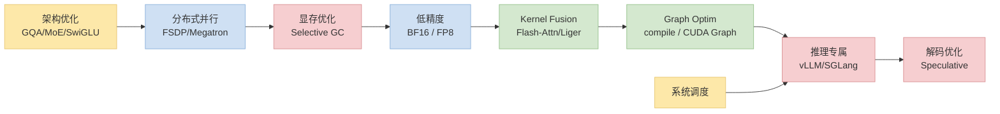
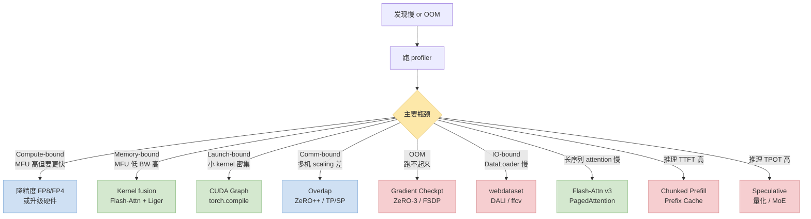

> 系列前面 10 篇每篇聚焦一个具体技术。这篇**从全局视角**把它们放在同一张地图上——按**阶段 / 瓶颈 / 触达层**三维分类，给决策流，最后附 60+ 条**大模型训推加速术语表**。新人入场看完这篇再决定深挖哪个子方向。

---

## 零、本文骨架

| 小节 | 主题 | 产出 |
|---|---|---|
| §一 | 引子：技术栈太多，从哪看起 | 全局导图定位 |
| §二 | 三维度分类 | 阶段 / 瓶颈 / 触达层 |
| §三 | 全景图（核心） | 大 mermaid：8 大类加速技术关系 |
| §四 | 瓶颈 → 技术决策流 | 对照 §二 的诊断 → 选型 |
| §五 | 系列各篇映射 | 本系列每篇在地图哪一块 |
| §六 | 2026 趋势 | FP4 / MoE / Agent 栈 / 长上下文 |
| §七 | 场景选型建议 | pretrain / SFT / serve 三档 |
| §八 | **大模型训推加速术语表** | 60+ 条速查 |
| §九 | 权威参考 | - |

---

## 一、引子：技术栈太多，从哪看起

训推加速的"技术噪音"极大——2024~2026 两年里仅主流的加速技术就冒出来几十个：

- **LLM 侧**：FlashAttention v1/v2/v3、Paged Attention、Continuous Batching、Speculative Decoding、Medusa、EAGLE、MoE 各派、FP8/FP4 推理、KV Quant、Chunked Prefill、FSDP v2、Megatron-LM TP/SP、ZeRO++、cuGraph、torch.compile …
- **MoE 专属**：DeepEP、Grouped GeMM、Aux-Loss-Free Balance、MLA、NoPE、Tutel …
- **Diffusion / 视频生成**：DMD / DMD2、LCM、SDXL-Lightning、HyperSD、SageAttention、SVDQuant、DeepCache、TeaCache、xDiT …
- **RL 训练栈**：veRL、AReaL、ROLL、OpenRLHF、SkyRL、NeMo-RL、fully-async、GRPO / DAPO / GSPO / SAPO …
- **MoE → Dense 蒸馏**：On-policy KD、Top-K Logit 蒸馏、vLLM 批量 rollout、Rejection Sampling SFT、Qwen3-Distill / Gemma-Distill …

**读者痛点**：
- 每个技术都有 blog 写得很好，但**技术之间的关系**没人说清
- 遇到具体瓶颈不知道**该选哪个**
- "先做什么后做什么"的优先级不明

本文不深入单项技术（系列其他篇干这事），专注**全局关系 + 决策导航**。

---

## 二、三维度分类

### 2.1 按加速阶段

```
Pre-training       → 最大化 MFU 和 TGS，数据吞吐决定进度
SFT / Fine-tuning  → 低显存 + 快迭代（PEFT / QLoRA）
RLHF / DPO         → 多模型同时加载，显存压力大
Serving / Inference → 延迟 + 吞吐 + 成本三角
```

### 2.2 按性能瓶颈

| 瓶颈 | 检测 | 主要技术 |
|---|---|---|
| **Compute-bound** | MFU 高，但算力不够快 | 更好硬件 / 低精度（FP8/FP4） / 更好 kernel |
| **Memory-bound** | MFU 低，BW util 高 | Kernel fusion / AI 提升 / KV quant |
| **Communication-bound** | 多机 scaling 效率低 | Overlap / 拓扑优化 / ZeRO++ |
| **Launch-bound** | 大量小 kernel | CUDA Graph / torch.compile / fused kernel |
| **IO-bound** | DataLoader / checkpoint 慢 | 见 [CPU SOP §六/七](/posts/python-cpu-bottleneck-troubleshooting-sop/) |

### 2.3 按触达层

自顶向下：

```
应用层     ├─ Serving system (vLLM / SGLang / TRT-LLM)
           ├─ Scheduling (continuous batching / chunked prefill)
系统层
           ├─ Compiler (torch.compile / Inductor / TensorRT)
           ├─ Framework (PyTorch / Megatron / DeepSpeed / FSDP)
Kernel 层  ├─ Library (Flash-Attn / Liger / Apex / xFormers)
           └─ Custom Triton / CUDA
模型层     ├─ Architecture (GQA / MoE / SwiGLU / RoPE)
           └─ Precision (BF16 / FP8 / FP4 / INT4)
硬件层     └─ GPU / NPU / Network (NVLink / IB / RoCE)
```

**原则**：**"就近层"优化优先**——模型层收益最大改动最小，kernel 层改动中等收益中等，硬件层需要换设备成本高。

---

## 三、训推加速全景图（核心）

本文把训推加速技术按**大类 × 子技术**组成一张"棋盘表"。读者的典型工作流：先按自己的**瓶颈类型**（见 §四 决策流）定位到某一行 → 再在该行内选具体子技术 → 再找对应的代表实现 / 工具。

| 大类 | 训练 / 推理 | 子技术 | 代表实现 / 工具 | 典型场景 |
|---|:---:|---|---|---|
| **分布式并行** | 训练 | **FSDP2** · **Context Parallel / Ulysses SP** · TP · PP · SP · EP · Ring Attention · ZeRO 1/2/3 · ZeRO++ · 通信 overlap | **Megatron-Core** · **M-Bridge**（HF↔Megatron 桥接）· **torchtitan** · PyTorch FSDP2 · NeMo-AutoModel · Pai-Megatron-Patch · DeepSpeed · ms-swift · LLaMA-Factory · Axolotl | 大模型多卡扩展 |
| **低精度** | 训 + 推 | **FP8 训练** · **FP4 weight-only** · BF16 混精 · INT8/FP8 推理 · AWQ / GPTQ / GGUF · FP8 Attention 量化 | **Transformer Engine** · **SageAttention** · AWQ · bitsandbytes · llama.cpp | 显存压缩 / 算力利用率 |
| **Kernel Fusion** | 训 + 推 | **Flash-Attention 3** · Fused RMSNorm/RoPE/SwiGLU · 融合 cross-entropy · FLA · 自写 Triton | **Flash-Attn** · **Liger Kernel** · xFormers · Unsloth · flash-linear-attention · Apex | 消除小 kernel / HBM 往返 |
| **Graph Optim** | 训 + 推 | **torch.compile** · **CUDA Graph** · TensorRT engine · Inductor | **PyTorch 2.x** · **TensorRT-LLM** · torch.export | 消除 launch overhead |
| **显存优化** | 训 | **Selective Activation Checkpointing** · Gradient Checkpointing · Activation Offload · ZeRO Offload · Parameter Offload | **PyTorch checkpoint** · DeepSpeed Offload | OOM / 长 seqlen 训练 |
| **推理专属** | 推 | **Paged Attention** · **Continuous Batching** · **Chunked Prefill** · **Prefix Cache** · KV Quant / Compression | **vLLM** · **SGLang** · **TensorRT-LLM** · LMDeploy | LLM 高吞吐 serving |
| **解码优化** | 推 | **EAGLE-3** · **Speculative Decoding**（通用框架）· PLD · DFlash · Medusa · Lookahead · Jacobi | **vLLM SD** · **SGLang SD** · EAGLE-3 官方 · TensorRT-LLM SD · Medusa | Decode TPOT 降低 2~5x |
| **架构优化** | 训 + 推 | **MLA** · **MoE (Aux-loss-free + Fine-grained Expert)** · **Hybrid Attention**（CSA/HCA / SWA+Global）· GQA / MQA · SwiGLU · RoPE · Mamba-2 · NoPE / YaRN | **DeepSeek-V3 / V4** · **Qwen3 / Llama-3** · MiniMax-01 (Lightning) · Gemma-3 (Hybrid) · Mamba / Jamba | 模型设计时就省算力 |
| **MoE 训练加速** | 训练 | **DeepEP**（Expert Parallel 通信）· **Grouped GeMM** · **Aux-Loss-Free Load Balance** · All-to-all / comp 重叠 · Expert 量化 | **DeepSeek DeepEP** · **Megatron-Core MoE** · Tutel · Mixtral infra · vLLM MoE | MoE 预训练 / SFT 通信瓶颈 |
| **Diffusion 专属加速** | 训 + 推 | **DMD2** · **VSA** · **Flow Matching** · 其它：步数蒸馏家族（DMD / LCM / SDXL-Lightning / HyperSD / PCM / TCD / MeanFlow）· SLA · Flash-Sparse-Attention · SageAttention / SVDQuant · Feature Caching（DeepCache / TeaCache / FBCache）· Adaptive CFG · FastVideo / FastWan 训练栈 · Flash-SD3 · "推理稀疏 + DMD 联合" | **Wan 2.2 + FastWan / VSA** · **FLUX.1 [schnell/dev]** · **DiffSynth-Studio** · 其它：Diffusers · ComfyUI · xDiT · FastVideo · SD3 / 3.5 · HunyuanVideo / CogVideoX / Mochi / SVD / Qwen3-Image | 图像秒级出图（FLUX.1 schnell 4 步）· 视频亚分钟级 |
| **RL 训练栈** | 训练 | **GRPO** · **Fully-async PPO** · DAPO · GSPO · SAPO · Rollout-train 解耦 · KL Free · Group-relative advantage | **veRL**（字节）· **OpenRLHF** · AReaL · ROLL · SkyRL · NeMo-RL · TRL | RLHF / RLAIF / Reasoning RL (o1 式) |
| **MoE → Dense 蒸馏** | 训练 | **On-Policy KD** · **Top-K Logit Distillation** · Rejection Sampling SFT · 合成数据 pipeline · Teacher FP8 推理 · KV cache 复用 · Layer/Width drop | **vLLM / SGLang 批量 rollout** · **Qwen3-Distill** · Gemma-Distill · MiniLLM · DistillKit · Liger-KD | 大 MoE teacher → 小 dense student |
| **PEFT 微调** | 训练 | **LoRA** · **QLoRA** · **DoRA** · PiSSA · LoRA+ · rsLoRA · VeRA · LoftQ · AdaLoRA · GaLore · IA³ · MoLA · LoRA hot-swap | **PEFT (HF)** · **Unsloth** · LLaMA-Factory · ms-swift · Axolotl · bitsandbytes · torchtune | 消费级显卡 / 少样本微调 / 多任务适配 |
| **优化器加速** | 训练 | **Muon** · Fused AdamW · 8-bit Adam · Shampoo / SOAP · Sophia · Adafactor · Lion · Schedule-Free | **Apex FusedAdam** · **bitsandbytes** · moonshot-ai/Muon · Keller-Jordan/Muon · torchshampoo | 收敛加速 / 显存减少 |
| **多模态 / Omni 模型加速** | 训 + 推 | **视觉 encoder 量化**（SigLIP / DINOv3 INT8）· **Audio tokenizer**（Mimi / EnCodec RVQ）· Cross-modal attention 融合 / Q-Former · Interleave training · Video chunking / temporal caching · Any-to-any 端到端 | **Qwen2.5-Omni / Qwen3-Omni** · **GPT-4o** · Gemini 2.5 Flash · Seed-VL · Emu3 · vLLM Multi-modal · SGLang VLM | 图 / 视频 / 音频 / 文本多模态训推 |
| **语音 / 音频模型加速** | 训 + 推 | **Audio Tokenizer / AuT**（Mimi · WavTokenizer · XCodec2 · EnCodec · DAC · BigCodec）· **Streaming ASR（Chunk-based / Transducer）** · **Full-duplex Voice Dialog** · Zipformer / Conformer / Paraformer 非自回归 · Flow Matching TTS（F5 / E2）· TTS 步数蒸馏 · FP16 / INT8 量化 · VAD / Diarization · 声学 codec INT8 · KV cache 流式 | **ASR**：**Qwen3-ASR**（阿里，52 语种）· **SenseVoice / Paraformer**（FunASR）· **Whisper v3 / v3-Turbo** · Voxtral · Nemo Canary · K2 / Zipformer · sherpa-onnx<br/>**TTS**：**CosyVoice 2**（阿里）· **F5-TTS / E2-TTS** · MegaTTS3 · Fish-Speech · **Kokoro**（端侧小 TTS）· GPT-SoVITS · XTTS-v2 · MaskGCT · **Vocoder 侧：HiFi-GAN / BigVGAN-v2 / Vocos**<br/>**Dialog / Omni**：**Moshi**（Kyutai, full-duplex）· **GPT-4o Realtime** · Qwen2.5-Omni · MiniCPM-o · Step-Audio · LLaMA-Omni · SALMONN<br/>**工具栈**：FunASR · NeMo Speech · ESPnet · SpeechBrain · k2 / icefall · WeNet · whisper.cpp · pyannote.audio | 实时语音对话 / 转录 / 合成 / 歌曲生成 |
| **端侧小模型加速** | 推 | **INT4 / AWQ / GGUF 量化** · **NPU 调度**（ANE / Hexagon / APU）· KV cache INT8 / INT4 · CoreML / NNAPI / LiteRT · Distill to small dense · LoRA adapter 动态加载 | **llama.cpp** · **MLX (Apple)** · **ExecuTorch** · MLC-LLM · TensorRT · ONNX Runtime · NCNN / MNN · 代表模型：**Gemma-3n / Qwen3-0.5B** · SmolLM · Phi-4-mini · SigLIP / DINOv3 · MobileNet v5 | 手机 / 笔记本 / 嵌入式推理 |
| **长上下文专项** | 训 + 推 | **Disaggregated Prefill/Decode**（Mooncake 范式）· **MInference / Quest** 稀疏 pattern · **KV 驱逐**（H2O / SnapKV / PyramidKV / ScissorHands）· **LongRoPE / YaRN** 位置外推 · Ring / Striped Attention · StreamingLLM · KV 量化（KIVI / KVQuant / LMCache）· DuoAttention / StarAttention · Prefix cache across requests | **Mooncake**（月之暗面）· **SGLang RadixAttention** · **vLLM 长上下文** · MInference · LMCache · LServe · 代表模型：Qwen3.5-Long · Llama-3.1-405B · Gemini 1.5 1M | 128K ~ 10M token 上下文训推 |
| **系统调度** | 推 | **Autoscaling** · 请求队列 · Load Balance · 多模型共置 · K8s orchestration | **Ray Serve** · **Triton Inference Server** · KServe | 集群级 serving |
| **IO / 数据侧** | 训 | **mmap 零拷贝** · **LMDB / RocksDB** · **Packing / Token Packing** · webdataset · parquet / HDF5 / tfrecord · Streaming Dataset · DALI / ffcv 预处理 | **NVIDIA DALI** · **mosaicml streaming** · **Megatron-Energon** · LMDB · HuggingFace datasets · torchtune packed · webdataset · DuckDB / Arrow | DataLoader 瓶颈 / 超大数据集 |
| **批处理策略（推理）** | 推 | **Continuous / In-flight Batching** · **Chunked Prefill + Decode 混批** · Dynamic Batching · Static Batching · Speculative Batching · Priority Scheduling · Long-short 拆批 | **vLLM** · **SGLang** · TensorRT-LLM · Triton Inference Server · Ray Serve | 吞吐 / 延迟平衡 |

**怎么用这张表**：
1. **找行**：按你的瓶颈（§二/§四）找对应大类
2. **挑列**：在"子技术"列里选一个最接近你诉求的
3. **定工具**：在"代表实现"列挑一个社区成熟度高的
4. **验场景**：对照"典型场景"确认方向没跑偏

### 3.1 该表的"阅读指南"——大类之间怎么组合



**颜色语义**：黄 = 架构 / 系统层，蓝 = 分布式 / 精度，绿 = 编译 / 融合，粉 = 显存 / 推理。上面这张图是"**典型上线路径**"——从模型设计开始逐层加上，每一步都是上一步的基础。

### 3.2 Fusion 阵营的扛旗者：Flash-Attention

  
*图：Flash-Attention 用 tile + online softmax 把 attention 从 memory-bound 拉到 compute-bound，是 2022 年以来单项影响最大的 kernel。来源：Dao-AILab/flash-attention*

### 3.3 分布式训练的地基：DeepSpeed / ZeRO

  
*图：ZeRO 论文 Figure 1——Baseline（每卡完整 P+G+Opt）→ P_os（按卡分 Optimizer States）→ P_os+g（再分 Gradients）→ P_os+g+p（最终所有都分）。7.5B 模型从 120GB / 卡 降到 1.9GB / 卡。PyTorch FSDP 直接继承这个范式。来源：Rajbhandari et al. 2020, [arXiv:1910.02054](https://arxiv.org/abs/1910.02054)*

---

## 四、瓶颈 → 技术决策流



**使用流程**：profile → 判断主瓶颈 → 找对应叶子节点 → 按该技术找教程 / 本系列对应篇。

---

## 五、系列各篇映射

本训推加速系列 10+ 篇在地图上的位置：

| 本系列 post | 对应技术地图区域 |
|---|---|
| [CLI 工具栈](/posts/training-inference-engineer-cli-toolkit/) | 工具层，无具体技术 |
| [GPU/NCCL SOP](/posts/training-inference-acceleration-troubleshooting-sop/) | 瓶颈诊断总纲 |
| [CPU 侧 SOP](/posts/python-cpu-bottleneck-troubleshooting-sop/) | IO-bound / CPU 瓶颈 |
| [Qwen3 fusion 识别](/posts/qwen3-understand-model-identify-fusion/) | Fusion 理论 + 访存比 |
| [Triton kernel 实战](/posts/triton-kernel-fusion-practice/) | Kernel Fusion / Custom Triton |
| [精度对齐](/posts/fused-kernel-accuracy-alignment/) | 精度验证 SOP |
| [Gradient Checkpointing](/posts/gradient-checkpointing-qwen3-dense/) | 显存优化 / Selective GC |
| [CUDA Graph 实战](/posts/cuda-graph-qwen3-dense/) | Graph Optim / Launch-bound |
| [效率指标](/posts/training-inference-efficiency-metrics/) | 测度 / 诊断基础 |
| [效果指标](/posts/training-inference-quality-metrics/) | 效果验证 / 评测 |
| **本文** | 全局地图 + 术语表 |

**还没写的 / 待补**：MoE 专篇、Speculative Decoding 专篇、FP8/FP4 专篇、PagedAttention 与 vLLM 深度剖析。

---

## 六、2024 ~ 2026 技术趋势

1. **FP4 训练**：H100/B200 上实测可行，Qwen3.5 / 3.6 / GPT-5.5 规模已常态化
2. **MoE scaling & 训练加速成熟化**：稀疏激活 + Expert Parallelism 标配，Qwen3-MoE / Qwen3.5-MoE / DeepSeek-V3 / V4 / GPT-OSS 都走这条；DeepEP / Aux-Loss-Free / Grouped GeMM 成为 MoE 训练栈的"新地基"
3. **长上下文成标配**：128K 起步、1M~10M 成常见规格，driver 是 KV quantization + disaggregated prefill/decode (Mooncake) + ring attention + LongRoPE + 稀疏 attention pattern (MInference / Quest)
4. **Speculative 家族升级**：**EAGLE-3** 成开源 SOTA（相比 EAGLE-2 再提 1.3~1.5×），**DFlash** / **PLD** 简化部署，decode 速度 2~5x
5. **Graph Compilation 再升级**：torch.compile 3.0 / TensorRT-LLM 的 engine 固化
6. **推理栈收敛**：vLLM / SGLang / TensorRT-LLM 三足鼎立；后续是 agent 服务栈（Claude Code / Codex / Cursor 式）
7. **硬件多样化**：B200 / GB200 NVL72 / 国产 AI 芯片涌现，kernel 要 portable
8. **Inference-time Scaling**：推理时做多次搜索（o1 / Qwen-Reasoning）——算力预算从训练挪向推理
9. **Diffusion 从"50 步"到"1 步"**：DMD / DMD2 / LCM / Lightning / HyperSD 等步数蒸馏系列让图像 / 视频生成从秒级变成亚秒级；Attention 量化（SageAttention / SVDQuant）让 SD3 / Flux 消费级显卡可跑
10. **RL 训练栈爆发**：o1 style reasoning + post-training 大规模化催生 veRL / AReaL / ROLL / OpenRLHF / SkyRL 等专用栈；"**fully-async**"（actor / learner / reward / rollout 完全异步）成新默认；GRPO → DAPO / GSPO / SAPO 算法迭代加速
11. **多模态 / Omni 端到端加速**：Qwen2.5-Omni / Qwen3-Omni / GPT-4o / Gemini 2.5 Flash 等 any-to-any 模型上线；视觉 encoder 量化（SigLIP INT8）、Audio tokenizer（Mimi / EnCodec RVQ）、temporal caching 成新子栈
12. **端侧模型爆发**：Gemma-3n / Gemma-4 edge / Qwen3-0.5B / SmolLM 让 LLM 跑进手机；NPU 调度（ANE / Hexagon / APU）+ INT4 量化 + KV cache 压缩成标配
13. **"MoE 教师 → Dense 学生"范式**：高参 MoE 先预训练到 SOTA，再蒸馏到消费级 dense 模型（Qwen3.5-MoE → Qwen3.5-8B / Gemma-4 / MiniCPM-4 都这么玩）。蒸馏 pipeline 本身是一套独立加速体系——teacher 批量 rollout 用 vLLM、logit 只存 top-K 省带宽、on-policy KD 让 student 越学越准
14. **Hybrid Attention 架构**：DeepSeek-V4 CSA/HCA、MiniMax-01 Lightning、Gemma-3/4 的 SWA+Global 交替层——长上下文下 full attention 被部分替换，KV cache 和 FLOPs 双降
15. **语音大模型 / 全双工对话爆发**：2024~2026 语音栈有几个关键跳跃——
    - **Qwen3-ASR** 把 ASR 带入"LLM 尺寸级多方言多语种"（52 语种 + 22 中文方言，1.7B / 0.6B），并把"**对齐 / 时间戳**"独立成 0.6B ForcedAligner 配套发布
    - **K2 + Zipformer + sherpa-onnx** 是 streaming / 端侧 ASR 的事实标准，学术 ESPnet 依然活跃但部署不如 K2 生态
    - **Mimi codec**（Kyutai）是 **full-duplex 对话**的关键基建——**双流 tokenizer**（语义流 + 声学流分离）让模型"边听边说"，Moshi / GPT-4o Realtime / Qwen2.5-Omni 都基于这条范式
    - **F5-TTS / E2-TTS** 把 TTS 带入 Flow Matching 时代，和 FLUX / Wan 2.2 一条技术范式——**Flow Matching 正在统治生成领域**（图像 / 视频 / 音频）
    - **Vocoder** 侧：HiFi-GAN 仍是工程基线，BigVGAN-v2 / Vocos 是 2024-2025 SOTA；但 F5-TTS / Moshi 这类新方案开始**跳过 mel→vocoder 两段式，直接用 codec decoder 出波形**
    - **端侧 TTS**：Kokoro（82M）证明手机 CPU 也能出工业级音质，端侧 speech 成新战场

---

## 七、场景选型建议

### Pre-training (8B~70B dense)

```
必做:
  ✓ BF16 混精（或 FP8 如果硬件支持）
  ✓ Flash-Attention 2/3
  ✓ FSDP or Megatron-LM TP/SP 并行
  ✓ Gradient Checkpointing (selective)
  ✓ 好 DataLoader (webdataset / packed)

推荐:
  ✓ Liger Kernel
  ✓ torch.compile + CUDA Graph

锦上添花:
  ± 自写 Triton kernel (ROI 不高, 除非 novel ops)
  ± FP8 Training (如 H100/B200 且训练稳定)
```

### SFT / Instruction Tuning (全参或 LoRA)

```
必做:
  ✓ QLoRA (NF4 weight + LoRA adapter)
  ✓ Unsloth / Liger
  ✓ Flash-Attention

推荐:
  ✓ Gradient Accumulation 扩 batch
  ✓ Packing (多样本拼接)

可选:
  ± Selective GC
  ± torch.compile
```

### Serving / Inference

```
必做:
  ✓ vLLM / SGLang / TRT-LLM 之一
  ✓ Paged Attention (vLLM 默认)
  ✓ Continuous Batching
  ✓ CUDA Graph for decode

推荐:
  ✓ Prefix Caching (共享前缀场景)
  ✓ Speculative Decoding (长输出场景)
  ✓ KV quant (INT8/FP8 KV)

按需:
  ± Weight quant (INT4 / FP4) for memory-limited serving
  ± Chunked Prefill (长 prompt 请求多场景)
```

---

## 八、大模型训推加速术语表（60+ 条速查）

按字母序排。有链接的是本系列已深入讲过的。

### A–E

- **AI (Arithmetic Intensity / 访存比)** = FLOPs/Bytes。[见 Qwen3 fusion §3.4](/posts/qwen3-understand-model-identify-fusion/)
- **Activation Checkpointing** = Gradient Checkpointing，同义。[见 GC 篇](/posts/gradient-checkpointing-qwen3-dense/)
- **All-Reduce** = 分布式通信原语，汇总 N 个 rank 的 tensor 再广播。
- **AMP (Automatic Mixed Precision)** = PyTorch 自动混精，配合 `GradScaler` 保持数值稳定。
- **AReaL** = 蚂蚁 / 清华开源的 async RL 训练框架，主打 fully-async actor/learner/rollout。
- **Attention Head** = 多头注意力的一个头；Qwen3-8B 有 32 个 query head、8 个 KV head（GQA）。
- **Aux-Loss-Free Balance** = DeepSeek-V3 提出的 MoE 负载均衡方案，通过动态偏置替代辅助损失，不牺牲主任务 loss。
- **BF16 (bfloat16)** = 1 sign + 8 exp + 7 mantissa，范围大精度低，训练友好。
- **Batch Size** = 单次前向/反向处理的样本数。
- **CUDA Graph** = 预录 kernel 序列 + 回放，消除 launch 开销。[专篇](/posts/cuda-graph-qwen3-dense/)
- **Continuous Batching** = vLLM 把不同请求动态拼进同一 batch，提升 serving 吞吐。
- **Context Parallel (CP)** = Megatron / FSDP2 提供的长序列并行方式，把 seq 维度切到多卡。
- **CE (Cross-Entropy)** = 分类 loss 标准形式。[公式](/posts/training-inference-quality-metrics/)
- **Chunked Prefill** = 把长 prefill 切片和 decode 拼一起处理，降 TTFT 尾部。
- **DAPO** = Decoupled advantage-based PPO，ByteDance 提出的 GRPO 变体，分离长序列 vs 短序列 advantage。
- **DeepEP** = DeepSeek 开源的 Expert Parallel 通信库，优化 MoE all-to-all，是 DeepSeek-V3 能高效训练的基建之一。
- **DeepSpeed** = 微软训练框架；ZeRO 系列 + Offload。
- **DeviceMesh** = PyTorch 2.x 提供的 N 维设备网格抽象，FSDP2 / TP / SP 都基于它组合。
- **DFlash** = 2025 提出的 Speculative Decoding 变体，把 draft 模型 + verify 阶段融合到单 kernel，适合轻量部署。
- **Disaggregated Prefill/Decode** = Mooncake / DistServe 提出，把 prefill 和 decode 部署到不同 GPU pool，各自用最优 batch/parallelism 配置。
- **DMD / DMD2 (Distribution Matching Distillation)** = 扩散模型的"多步 → 几步"蒸馏，DMD2 去掉 regression loss 进一步提速。
- **DiffSynth-Studio** = 阿里魔搭开源的 Diffusion 训练 + 推理全家桶，支持 Wan / FLUX / SD3 / HunyuanVideo 等主流模型及其步数蒸馏。
- **DoRA (Weight-Decomposed LoRA)** = 把权重分解为方向 + 幅度，只对方向做 LoRA，效果接近全参微调。
- **Dynamic Batching** = 推理服务中把动态到达的请求攒到一个 batch 的策略，典型 window ~10ms。与 **Continuous Batching** 的区别：Dynamic 是"攒一批才跑"；Continuous / In-flight 则是"已在跑的 batch 中途塞新请求"。
- **DPO (Direct Preference Optimization)** = 不要 reward model 的 RLHF 替代。

### F–L

- **EAGLE / EAGLE-2 / EAGLE-3** = Speculative Decoding 的 tree-based 方案，EAGLE-3 在 decode 速度和质量上再刷新 SOTA（相对 EAGLE-2 再提 30~50%）。
- **ExecuTorch** = PyTorch 官方端侧推理运行时，目标取代 TFLite / CoreML 的部分场景。
- **FastVideo** = UC Berkeley 开源的视频 Diffusion 训练 + 推理加速栈，主打 FastMochi / FastHunyuan 蒸馏。
- **FastWan** = 阿里 Wan 团队发布的 Wan 模型步数蒸馏加速栈，把视频生成时间从分钟级压到亚分钟。
- **FLA (Fast Linear Attention)** = flash-linear-attention 项目，Mamba / Linear-attention 系列的统一 kernel 仓库。
- **Flash-Sparse-Attention** = DiT 专用的稀疏 attention kernel，适配 image/video 生成里的稀疏 pattern。
- **Flash Stable Diffusion 3** = SD3 的一步 / 四步蒸馏版本，推理接近 FLUX.1 schnell 级别。
- **Flash-Attention** = Tri Dao 的 attention 算子，tile + online softmax。v1/v2/v3 逐代优化。
- **Flow Matching / Rectified Flow** = 替代传统 Diffusion 的生成范式，FLUX / SD3 / Wan 2.2 均采用。训练更稳定，推理步数更少。
- **FLUX / FLUX.1** = Black Forest Labs（原 Stability AI 核心团队）的 DiT 基座文生图模型，[dev] / [schnell] / [pro] 三档；schnell 基于 LCM 蒸馏，4 步出图。
- **FLA (Fast Linear Attention)** = flash-linear-attention 项目，Mamba / Linear-attention 系列的统一 kernel 仓库。
- **FSDP (Fully Sharded Data Parallel)** = PyTorch 版 ZeRO-3，参数 / 梯度 / 优化器全部 shard。
- **FSDP2** = PyTorch 2.x 第二代 FSDP，基于 **DTensor + DeviceMesh**，比 FSDP1 更灵活，支持细粒度 shard / 2D 并行组合。
- **FP8** = 1+4+3 或 1+5+2 两种格式，H100/B200 支持。训练和推理都能用。
- **FP4** = 新一代低精度，B200 原生支持，Weight-only 已落地。
- **GQA (Grouped-Query Attention)** = 多个 Q head 共享一个 KV head，省 KV 显存。Qwen3 标配。
- **Gradient Checkpointing** = 丢中间 activation、backward 重算。[专篇](/posts/gradient-checkpointing-qwen3-dense/)
- **Goodput** = 满足 SLO 的吞吐（vLLM 提出）。[公式](/posts/training-inference-efficiency-metrics/)
- **GRPO (Group Relative Policy Optimization)** = DeepSeek-R1 使用的 RL 算法，用 group-mean 作 baseline 替代 critic。
- **GSPO** = 2025 提出的 RL 算法，改进 GRPO 的方差估计。
- **Grouped GeMM** = MoE 训练中对不同 expert 的 GeMM 批量合并调度，减少 kernel launch 和内存碎片。
- **HBM (High Bandwidth Memory)** = GPU 主显存，H100 80GB HBM3 ≈ 3TB/s。
- **HFU (Hardware FLOPs Utilization)** = 含重算的 FLOPs 利用率。
- **H2O (Heavy Hitter Oracle)** = KV cache 驱逐算法，只保留"重要 token"的 KV，长上下文显存打折扣。
- **HyperSD** = ByteDance 的多步 → 单/四步扩散蒸馏方案，和 DMD / LCM 齐名。
- **ITL (Inter-Token Latency)** = 流式 decode 相邻 token 间隔。
- **KL Divergence** = 两概率分布的差异度量。[公式](/posts/training-inference-quality-metrics/)
- **KV Cache** = decode 时缓存历史 token 的 K/V，避免重算。
- **LCM (Latent Consistency Model)** = 扩散模型的步数蒸馏路线之一，4 步推理可用。
- **Liger Kernel** = LinkedIn 为 Qwen/Llama 家族做的 fused kernel 集合。
- **LLaMA-Factory** = 开源 LLM 微调框架，封装 SFT / DPO / PPO，国内用户多。
- **LMDB (Lightning Memory-Mapped Database)** = 单文件、基于 mmap 的 K-V 存储，小样本大数据集（图片 / 特征）训练读写的经典方案，比海量小文件快 10~100×。
- **LongRoPE** = 微软提出的 RoPE 长度外推方案，可扩展到 2M context。
- **LoRA** = Low-Rank Adaptation，PEFT 主流之一。
- **LoRA+ / rsLoRA / AdaLoRA / VeRA / LoftQ / PiSSA** = LoRA 的 2024-2025 变体族：LoRA+ 分组学习率、rsLoRA 稳定 rank、AdaLoRA 自适应 rank、VeRA 共享随机基、LoftQ 联合量化初始化、PiSSA 奇异值初始化。

### M–R

- **Mamba / Mamba-2** = Selective State Space Model，线性复杂度替代 attention。
- **Megatron-LM** = NVIDIA 训练框架；TP / SP / PP 并行，大模型训练基建最早的落地方案之一。
- **Megatron-Core** = Megatron-LM 的核心模块化版本，剥离训练 loop，方便被其它框架（NeMo / TRT-LLM）复用。
- **Megatron-Energon** = NVIDIA 出的大规模数据加载库，配套 Megatron-Core 使用，解决 petabyte 级数据吞吐。
- **M-Bridge (Megatron-Bridge)** = NVIDIA 2025 推出的 HuggingFace ↔ Megatron 格式桥接库，支持一键把 HF Transformers 模型转成 Megatron-Core 训练（省掉自己写转换脚本），主打"HF 研究员无缝享受 Megatron 训练效率"。
- **MInference** = MSR 2024 提出的长上下文稀疏 attention pattern 选择算法，1M token 推理快 10×。
- **MLX** = Apple 针对 M 系列 芯片的 ML 框架，支持 Unified Memory，端侧 LLM 首选之一。
- **mmap (memory-mapped I/O)** = 操作系统把文件映射到进程虚拟地址空间，按需分页加载。大型 parquet / safetensors / LMDB 加载首选，避免一次全读入内存。
- **Mooncake** = 月之暗面开源的 disaggregated KV cache + scheduler 方案，长上下文服务的代表性栈。
- **MFU (Model FLOPs Utilization)** = 模型 FLOPs 与硬件峰值 FLOPs 比值。
- **MLA (Multi-head Latent Attention)** = DeepSeek-V2/V3 提出的 attention 变体，压缩 KV 到 latent 空间，显存显著降低。
- **ms-swift** = 阿里魔搭（ModelScope）的大模型训练 / 微调 / 推理框架。
- **MoE (Mixture of Experts)** = 稀疏激活 —— N 个 expert 每 token 只路由到 top-k 个。
- **MQA (Multi-Query Attention)** = Q 有 multi head，KV 只 1 head。
- **MMLU** = 57 学科选择题 benchmark。
- **Muon (optimizer)** = Keller Jordan 等提出的 matrix-aware 优化器，对 2D 权重用 Newton-Schulz 迭代正交化，在 Llama / NanoGPT 级规模上明显快于 AdamW。
- **NCCL** = NVIDIA 分布式通信库。
- **NeMo-AutoModel** = NVIDIA NeMo 2025 推出的"自动化训练栈"，将 Megatron-Core / FSDP2 / 量化 / 蒸馏 / PEFT 全套封装到一致 API 后面，面向不想手调并行策略的团队。
- **NoPE** = No Position Embedding，某些长上下文 MoE 架构尝试取消显式位置编码。
- **On-Policy KD** = 学生生成 → 教师打分 / 提供 label 的蒸馏方式，效果显著好于 off-policy。
- **OpenRLHF** = 开源 PPO / DPO / KTO 训练框架，支持 Ray 分布式。
- **Paged Attention** = vLLM 把 KV cache 按 page 管理（像 OS paging），减少碎片。
- **Pai-Megatron-Patch** = 阿里 PAI 对 Megatron-LM 的国产适配 + 增强补丁集。
- **PEFT (Parameter-Efficient Fine-Tuning)** = LoRA / QLoRA / Prefix Tuning / DoRA / IA³ / GaLore 等总称。
- **PLD (Prompt Lookup Decoding)** = 从 prompt 中直接"复制"作为 draft 的 Speculative 变体，适合代码 / 问答等 prompt-output 相似场景。
- **PyramidKV / SnapKV / ScissorHands** = KV cache 驱逐家族，2024-2025 主流方案。
- **Perplexity (PPL)** = `exp(CE)`，模型困惑度。[公式](/posts/training-inference-quality-metrics/)
- **PP (Pipeline Parallel)** = 模型分阶段放到不同卡。
- **Prefix Caching** = 共享 prompt 前缀的 KV 重用。
- **QLoRA** = 4-bit 量化 + LoRA 微调。
- **Rejection Sampling SFT** = MoE 教师生成 → 用 reward / rule 过滤 → 喂给 student 做 SFT 的数据 pipeline。
- **ROLL** = 阿里开源的 RL 训练框架，主打 fully-async + reasoning 场景。
- **RoPE (Rotary Position Embedding)** = Llama/Qwen 系列的位置编码方式。
- **RLHF** = Reinforcement Learning from Human Feedback。
- **Roofline** = 算力/带宽 vs 访存比的性能上限图。[专篇](/posts/qwen3-understand-model-identify-fusion/)

### S–Z

- **SageAttention** = 清华等提出的 FP8/INT8 Attention 量化算法，训推都能用，在 SD3 / Flux / LLM 上广泛应用。
- **SAPO** = 2025 提出的 RL 算法（自适应 PPO 变体），改进 reward 方差处理。
- **SkyRL** = UC Berkeley 开源 RL 训练栈，面向 reasoning。
- **SM (Streaming Multiprocessor)** = GPU 计算单元，H100 有 132 个 SM。
- **SP / Ulysses SP** = Sequence Parallel / Ulysses 长序列并行（DeepSpeed 提出），把 attention 的 head 维 all-to-all 到多卡。
- **Speculative Decoding** = 小模型草稿 + 大模型验证，decode 加速 2~4x。
- **SLO (Service Level Objective)** = 服务等级目标，TTFT/P99 的上限承诺。
- **StarAttention / DuoAttention** = 长上下文下的 attention 稀疏 pattern，把"检索 / 摘要"等长文任务的 KV 访问量大幅压低。
- **StreamingLLM** = MIT 2024 提出，保留 attention sink + 滑动窗口，无限长上下文持续生成不爆显存。
- **Step Distillation (步数蒸馏)** = Diffusion 把 50 步采样蒸馏到 1~4 步（DMD / LCM / Lightning / HyperSD）。
- **SVDQuant** = MIT 提出的 4-bit 扩散模型 weight + activation 量化方案。
- **SwiGLU** = `silu(W_gate x) * W_up x`，Llama / Qwen MLP 激活。
- **TGS (Tokens per GPU per Second)** = 分布式训练扩展性指标。[公式](/posts/training-inference-efficiency-metrics/)
- **TP (Tensor Parallel)** = 矩阵按列或行 shard 到多卡。
- **TPOT (Time Per Output Token)** = decode 平均每 token 时间。
- **TTFT (Time To First Token)** = prefill 阶段延迟。
- **Triton** = OpenAI 的 GPU DSL，Python 写 kernel。[实战](/posts/triton-kernel-fusion-practice/)
- **torch.compile** = PyTorch 2.x 的图编译器（Inductor 后端）。
- **torchtitan** = Meta 开源的 PyTorch-native 大模型训练框架，核心路线是 FSDP2 + DTensor，目标是"不用 Megatron 也能训 Llama 规模模型"。
- **Tutel** = 微软开源的 MoE 训练加速库，主打 all-to-all 调度 + grouped GeMM。
- **veRL** = 字节 ByteDance 开源的 async RL 训练框架，面向 reasoning / SWE-bench 等 agentic 场景，现已成为 GRPO / DAPO 研究基准。
- **vLLM** = UC Berkeley 的开源推理引擎，Paged Attention 原创。
- **VSA (Video Sparse Attention)** = 视频 Diffusion 的"可训练稀疏 attention"方案。在 Wan 2.1 等模型上 finetune 后，attention 仅保留少量关键 token，推理耗时 2~5× 下降。常与 DMD 步数蒸馏联用（"推理稀疏 + 少步蒸馏"双 buff）。
- **SLA (Sparse Local Attention)** = 视频 Diffusion 的局部稀疏 attention 变体，和 VSA 并列的同方向工作。
- **TCD (Trajectory Consistency Distillation)** = Diffusion 步数蒸馏的一个变体，强调训练稳定性。
- **MeanFlow** = 一步 Flow Matching 推理的蒸馏方案之一。
- **Wan 2.x / 万象** = 阿里的开源视频生成模型系列（Wan 2.1 / 2.2），配套 FastWan 训推加速栈；Wan 2.1 可用 VSA finetune 后再上 DMD，组合收益显著。
- **WER / CER (Word/Character Error Rate)** = 语音识别评测。[公式](/posts/training-inference-quality-metrics/)
- **xDiT** = 扩散模型的并行推理框架，专做 SD / Flux / CogVideoX 的多卡加速。
- **YaRN** = RoPE 的长度外推方案之一，Qwen2.5-long / Llama-3.1 均采用。
- **ZeRO (Zero Redundancy Optimizer)** = DeepSpeed 提出；ZeRO-1/2/3 分别 shard 优化器 / 梯度 / 参数。
- **ZeRO++** = ZeRO 升级版，量化通信。

### 语音 / 音频模型专栏（ASR / TTS / Codec / Full-duplex Dialog）

**Audio Tokenizer / AuT（音频编码器）**

- **Mimi** = Kyutai Moshi 的双流 audio tokenizer，**语义流 + 声学流**分开编码，1.1 kbps 低码率下保持高质量，是 Moshi 能做 full-duplex 对话的关键基建。
- **WavTokenizer** = 2024 单流极低码率 codec（0.5~0.9 kbps），为 speech LLM 做离散化。
- **XCodec / XCodec2** = 语义 + 声学统一编码，Step-Audio / MiniCPM-o 采用。
- **EnCodec** = Meta 早期 RVQ codec，仍是 TTS 默认选项。
- **SoundStream** = Google 的原始 neural audio codec。
- **DAC (Descript Audio Codec)** = 高质量音频重建，音乐 / 广播级。
- **BigCodec** = 2024 大容量 codec，用于高保真音乐生成。
- **SpeechTokenizer** = 层次化 codec，底层声学 + 顶层语义。

**ASR 核心模型 / 框架**

- **Qwen3-ASR** = 阿里 2026 发布的 ASR 系列（1.7B / 0.6B），52 语种 + 22 中文方言，支持 streaming / offline 统一推理，伴生 Qwen3-ForcedAligner 做时间戳。
- **SenseVoice** = 阿里 FunASR 的多语种 ASR，一次推理同时输出转录 + 情感 + 音频事件检测，非自回归速度快。
- **Paraformer / Paraformer-v2** = 阿里非自回归 ASR，比 Whisper 快 10× 以上，是工业实时 ASR 主流之一。
- **Whisper v3 / v3-Turbo** = OpenAI 680k 小时带字幕预训练；v3-Turbo 把 decoder 层减半，速度 5~8× 提升。
- **K2 / icefall / sherpa / sherpa-onnx** = Next-gen Kaldi 全家桶，端到端训练 + 端侧部署一条龙；sherpa-onnx 是端侧 ASR 部署王者。
- **Zipformer** = K2 家族的主力 streaming encoder，推理极快（比 Conformer 快 2×+），RNN-T / CTC / AED 都能接。
- **Voxtral** = Mistral 的 ASR 模型。
- **NeMo Canary** = NVIDIA 的多语言 ASR 模型，在 HuggingFace Open ASR leaderboard 曾登顶。
- **WeNet** = 出门问问开源工业级 ASR，streaming + offline 共用 decoder。
- **FunASR** = 阿里开源的 ASR 全家桶：Paraformer / SenseVoice / CosyVoice 统一。
- **ESPnet / SpeechBrain** = 学术界最活跃的两个语音 toolkit。

**TTS 核心模型 / 框架**

- **CosyVoice / CosyVoice 2** = 阿里开源 zero-shot TTS，3 秒音色克隆，中文 SOTA 之一。
- **F5-TTS / E2-TTS** = 基于 **Flow Matching** 的非自回归 TTS，4 步出音频，工业级质量。
- **MegaTTS3** = 字节最新 TTS，多语言 + 歌唱合成。
- **Fish-Speech** = 开源 TTS + 语音克隆，部署轻量。
- **Kokoro** = 82M 参数端侧小 TTS，CPU 可跑，手机端明星。
- **GPT-SoVITS** = SoftVC VITS + GPT 框架，国内最流行的个人 TTS 克隆方案。
- **MaskGCT** = Masked generative codec transformer，高质量 zero-shot TTS。
- **ChatTTS** = 对话场景专精，支持笑声 / 停顿 / 语气词标签。
- **VALL-E / VALL-E 2** = 微软原创的 audio token AR TTS 范式，许多开源方案的始祖。
- **XTTS-v2** = Coqui 的多语种 TTS，开源社区常备。

**Vocoder（Mel → 波形）**

TTS 管线里最后一步——acoustic model 产生 mel-spectrogram，再由 vocoder 合成波形。2024-2026 有一批更快更高质量的方案。

- **HiFi-GAN** = 2020 Kong et al. 的 GAN vocoder，**目前仍是 TTS 默认基线**——CosyVoice / XTTS / GPT-SoVITS / Tortoise 都在用。训练稳定、推理极快（> 1000× realtime）、质量足够 24kHz/48kHz。
- **BigVGAN / BigVGAN-v2** = NVIDIA 的"universal vocoder"，解决 HiFi-GAN 在未见声线 / 乐器上的 artifact；2024 的 v2 是当前客观指标 SOTA。
- **Vocos** = 2024 ConvNeXt + iSTFT head 的 vocoder，**推理比 HiFi-GAN 还快 ~10×**，GPU 端吞吐王。
- **WaveRNN / Parallel WaveGAN / MelGAN** = Tacotron 时代的 vocoder，2024 后逐步退场。
- **SoundStorm / Voicebox / Audiobox** = Meta 的大规模 flow-matching 音频生成，**端到端跳过 mel-vocoder 两段式**，未来方向。
- **Codec Vocoder**（Mimi / EnCodec / DAC 的 decoder 端）= Neural codec 的"反向路径"——给定离散 token 直接出波形，本身就是 vocoder。F5-TTS / Moshi 这类新方案不再单独训 HiFi-GAN，改用 codec decoder。

**Full-duplex / Dialog 语音模型**

- **Moshi** = Kyutai 2024 发布的**首个开源 full-duplex** speech dialog 模型，延迟 < 200ms，用 **Mimi codec** 双流处理。
- **GPT-4o Realtime** = OpenAI 的实时语音对话 API，端到端 speech-to-speech，无需 ASR+TTS 级联。
- **Qwen2.5-Omni / Qwen3-Omni** = 阿里统一多模态（文/语/视频/图），Omni decoder 端到端出音频 token。
- **MiniCPM-o** = 面壁 end-to-end 语音对话模型，2.6B 参数，手机端可跑。
- **Step-Audio** = 阶跃星辰的对话 + TTS 模型。
- **LLaMA-Omni** = 清华开源的 LLaMA + speech 对话。
- **SALMONN** = 清华 / 字节的通用 speech understanding LLM。

**加速 / 部署工具**

- **sherpa-onnx** = K2 生态的跨平台 ASR / TTS 运行时，iOS / Android / Linux / Windows 一套代码。
- **whisper.cpp** = ggerganov 的 Whisper C++ 实现，端侧 CPU 推理标配。
- **MLX-Audio** = Apple MLX 的音频扩展，M 系列芯片实时 ASR / TTS。
- **pyannote.audio** = 说话人分割（diarization）与识别，配合 ASR 做多人会议转录。
- **Vosk** = 轻量级 offline ASR，Kaldi 路线。
- **Triton Inference Server 语音插件** = 服务端 ASR / TTS 批处理调度。

**关键概念**

- **Streaming ASR** = 边听边转写，chunk-based + limited left context，延迟 < 500ms。
- **Full-duplex** = 同时听 + 说，和 Moshi / GPT-4o Realtime 一样，区别于"半双工"级联 ASR → LLM → TTS。
- **RNN-T / CTC / AED** = 三种 ASR 解码范式。RNN-T（Transducer）是流式黄金标准，CTC 非自回归最快，AED（Encoder-Decoder attention）精度最高。
- **Forced Alignment** = 给定音频 + 转录文本，输出每个 token 的时间戳。Qwen3-ForcedAligner / MFA (Montreal Forced Aligner) 是主流。

### Hybrid Attention 专栏（DeepSeek-V4 等）

- **Hybrid Attention** = 同一模型里**交替堆叠**"全 attention layer"和"线性 / 稀疏 attention layer"，兼顾长上下文能力与推理成本。Gemma-3 / MiniMax-01 / DeepSeek-V4 都是这条路线。
- **CSA (Compact Sparse Attention)** = DeepSeek-V4 提出的稀疏 attention 变体，仅对部分 token 建立全连接，显著减少 KV 访问。
- **HCA (Hybrid Compact Attention)** = DeepSeek-V4 的另一种 attention 模式，与 CSA 交替使用，长上下文下 KV cache 和 FLOPs 均显著低于纯 full attention。
- **Lightning Attention** = MiniMax-01 的线性 attention 实现，单次 kernel 完成 Linear + Softmax 混合模式。
- **Mamba / Mamba-2** = Selective State Space Model，线性复杂度替代 attention。
- **Sliding Window + Global (SWA+G)** = Gemma 系列等采用的混合 pattern，大部分层 local window、少数层 full attention。

---

## 九、权威参考

- [PyTorch 2.x — Accelerating AI](https://pytorch.org/blog/accelerating-generative-ai-2/)
- [Flash-Attention (Dao)](https://github.com/Dao-AILab/flash-attention)
- [vLLM](https://docs.vllm.ai/)
- [SGLang](https://github.com/sgl-project/sglang)
- [TensorRT-LLM](https://github.com/NVIDIA/TensorRT-LLM)
- [Megatron-LM](https://github.com/NVIDIA/Megatron-LM)
- [DeepSpeed](https://www.deepspeed.ai/)
- [FSDP 文档](https://pytorch.org/docs/stable/fsdp.html)
- [Liger Kernel](https://github.com/linkedin/Liger-Kernel)
- [Triton](https://triton-lang.org/)
- [NVIDIA — Scaling Language Model Training](https://developer.nvidia.com/blog/scaling-language-model-training-to-a-trillion-parameters-using-megatron/)
- [Chinchilla (scaling laws)](https://arxiv.org/abs/2203.15556)
- [PaLM (MFU 定义)](https://arxiv.org/abs/2204.02311)
- [MT-Bench / Chatbot Arena](https://arxiv.org/abs/2306.05685)
- [Speculative Decoding (Google)](https://arxiv.org/abs/2211.17192)
- 本系列：
  - [CLI 工具栈](/posts/training-inference-engineer-cli-toolkit/)
  - [GPU/NCCL SOP](/posts/training-inference-acceleration-troubleshooting-sop/)
  - [CPU 侧 SOP](/posts/python-cpu-bottleneck-troubleshooting-sop/)
  - [Qwen3 fusion 识别](/posts/qwen3-understand-model-identify-fusion/)
  - [Triton 实战](/posts/triton-kernel-fusion-practice/)
  - [精度对齐](/posts/fused-kernel-accuracy-alignment/)
  - [Gradient Checkpointing](/posts/gradient-checkpointing-qwen3-dense/)
  - [CUDA Graph](/posts/cuda-graph-qwen3-dense/)
  - [效率指标](/posts/training-inference-efficiency-metrics/)
  - [效果指标](/posts/training-inference-quality-metrics/)

---

> **一句话总结**：训推加速不是单个魔法——三维分类让你知道"加速有哪几类"、全景图告诉你"它们怎么关联"、决策流让你"从瓶颈找技术"、术语表让你"读别人论文不卡壳"。先把地图建立起来，再深挖具体子方向。
