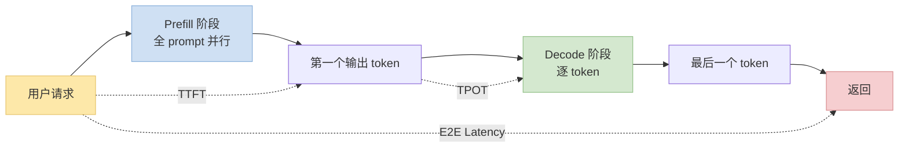

> 本系列前面 8 篇讲"怎么加速"——但团队协作时经常发现**每个人说的"快"都不是一回事**：训练组说 tokens/sec，推理组说 TTFT，infra 说 MFU。这篇把训推加速里所有高价值指标一次摆清楚，**每个都给数学公式 + Qwen3-8B 示意数字**。
>
> 姊妹篇：[训推加速系列导航](.#)（在做） · [GPU/NCCL SOP](/posts/training-inference-acceleration-troubleshooting-sop/) · [Python CPU SOP](/posts/python-cpu-bottleneck-troubleshooting-sop/)

---

## 零、本文骨架

| 小节 | 主题 | 产出 |
|---|---|---|
| §一 | 引子：指标为什么要统一 | 常见"鸡同鸭讲"场景 |
| §二 | 吞吐类 | tokens/sec · samples/sec · **TGS** · QPS · steps/sec |
| §三 | 延迟类（推理） | TTFT · TPOT · ITL · E2E · P50/P90/P99 |
| §四 | 硬件利用率（核心） | MFU · HFU · SM occupancy · HBM 带宽利用率 |
| §五 | 显存类 | Peak / Activation / KV cache 占比 |
| §六 | 成本 & 能效 | $/token · Tokens/Watt |
| §七 | 综合指标 | Goodput · SLO attainment |
| §八 | 公式速查表 | 一页看完 |
| §九 | 权威参考 | NVIDIA / Chinchilla / vLLM 等 |

> **数字前置声明**：本文所有 Qwen3-8B 具体数字为**典型量级估计**，非实测。请以你自己硬件上跑出的数字为准。

---

## 一、引子：为什么要一套统一指标

典型的"鸡同鸭讲"现场：

- **训练 lead**：我们 step time 420 ms，挺快的
- **Infra**：MFU 才 38%，差得远
- **PM**：用户反馈推理慢，P99 TTFT 2.3s
- **财务**：每 M token 成本 $0.18

这 4 个数字描述的是**不同维度**——step time 是单点延迟，MFU 是硬件效率，TTFT 是用户体感，$/token 是经济账——**没有对齐就会出现"改了指标反而变差"的假优化**。

本文把所有常用指标按**吞吐 / 延迟 / 利用率 / 显存 / 成本 / 综合**六类展开，每类给出：
- **数学定义**（含单位）
- **怎么量**
- **Qwen3-8B 参考数字**（示意，非实测）
- **加速后改善方向**

---

## 二、吞吐类指标

### 2.1 Tokens per Second（tokens/sec）

**定义**：单位时间内处理（训练）或生成（推理）的 token 数量。

$$
\text{tokens/sec} = \frac{N_\text{tokens}}{T_\text{elapsed}}
$$

- 训练：`batch_size × seqlen × grad_accum / step_time`
- 推理：`total_output_tokens / wall_time`

**Qwen3-8B 参考**（H100 单卡，bf16，示意）：
- 训练 ~**60k tokens/sec**（batch=4, seqlen=4096）
- 推理 batched decode ~**80~120 tokens/sec/user**

### 2.2 **TGS — Tokens per GPU per Second**（分布式训练核心指标）

**定义**：把总吞吐**除以 GPU 数量**，衡量每块 GPU 的有效产出。

$$
\text{TGS} = \frac{N_\text{tokens}}{N_\text{GPUs} \times T_\text{elapsed}}
$$

**为什么不用总 tokens/sec**：总吞吐随 GPU 线性增长是"假快"；TGS 才能反映**分布式 scaling efficiency**。

- **TGS 高 + GPU 数多** → 扩展性好
- **TGS 随 GPU 数增加反而下降** → 通信瓶颈或 overlap 做得差（[见 GPU SOP §四 NCCL](/posts/training-inference-acceleration-troubleshooting-sop/)）

**Qwen3-8B 参考值**（示意，取决于并行策略）：

| 配置 | TGS (tokens/GPU/s) | 含义 |
|---|---|---|
| H100 单卡 bf16 | ~6500 | 单卡 baseline |
| 8×H100 TP=1 DP=8 | ~6200 | 弱 scaling，通信极少 |
| 8×H100 TP=2 DP=4 | ~5400 | TP 引入 all-reduce，单卡效率降 |
| 64×H100 FSDP | ~4500 | FSDP shard 通信大 |
| **< 4000 TGS/GPU** 长期 | — | **必须排查**：通信 / DataLoader / 精度 |

**监控实践**：用 wandb / tensorboard 把 TGS 作为主图表；配合 MFU 看"慢是通信慢还是算力吃不满"。

### 2.3 Samples per Second

训练里 `batch_size × grad_accum / step_time`。**仅在 seqlen 固定时**和 tokens/sec 等价；变长序列下用 tokens/sec 更公平。

### 2.4 QPS（Queries per Second，推理）

**定义**：每秒处理的完整请求数（一个请求可能含几十到几千个 token）。

$$
\text{QPS} = \frac{N_\text{requests}}{T_\text{elapsed}}
$$

- **Batched serving** 时 QPS 远高于单并发 tokens/sec（同一 step 的 tokens 被多请求共享）
- 对外部团队通常报 QPS；对 infra 内部优化看 tokens/sec

### 2.5 Steps per Second（训练）

$$
\text{steps/sec} = \frac{1}{T_\text{step}}
$$

最原始的计时指标，**不跨 batch size 比较**。Qwen3-8B bf16 H100 batch=4 seqlen=4096 参考 ~**2.4 steps/sec**（step time ≈ 420 ms，示意）。

---

## 三、延迟类指标（推理专用）

**逻辑关系图**（概念理解）：

**时序事实图**（时间比例真实，假设 prompt 512 tokens / 输出 200 tokens）：

```mermaid
%%{init: {
  "theme": "base",
  "themeVariables": {
    "fontFamily": "-apple-system, Source Sans Pro, sans-serif",
    "primaryTextColor": "#374151",
    "textColor": "#374151",
    "titleColor": "#374151",
    "lineColor": "#9CA3AF",
    "sectionBkgColor": "#FAFAF7",
    "altSectionBkgColor": "#F3F4F0",
    "gridColor": "#E5E7EB",
    "taskBkgColor": "#FDE8A9",
    "taskBorderColor": "#E7C56D",
    "taskTextColor": "#374151",
    "taskTextOutsideColor": "#374151",
    "taskTextLightColor": "#374151",
    "activeTaskBkgColor": "#CFE0F3",
    "activeTaskBorderColor": "#8AB0DB",
    "doneTaskBkgColor": "#D4E8CF",
    "doneTaskBorderColor": "#94C18A",
    "critBkgColor": "#F6CED0",
    "critBorderColor": "#D98F92"
  }
}}%%
gantt
    title 单请求生命周期 prompt=512 output=200 Qwen3-8B 示意
    dateFormat x
    axisFormat %S.%Ls

    section 请求生命周期
    Queue wait                       :done,   q,  0,  30
    Prefill compute                  :active, pf, 30, 170
    First token emit                 :crit,   ft, 200, 5
    Decode token 2                   :        d2, 205, 25
    Decode token 3                   :        d3, 230, 25
    Decode tokens 4 to 199 skipped   :        d4, 255, 4545
    Decode token 200                 :        dn, 4800, 25
    Completion return                :done,   cp, 4825, 10
```

x 轴单位 `秒.毫秒`（例如 `0.200s` = 200ms，`4.825s` = 4825ms）。

**颜色语义 vs 指标对应**：

| 指标 | 视觉位置 | 图中对应的颜色 |
|---|---|---|
| **TTFT** | 从请求入队到 First token emit（前 200ms） | 第一根 **粉色 crit** 标记 TTFT 终点 |
| **TPOT** | 单个 decode token 条的宽度（≈ 25ms） | **黄色普通条**（Decode token 2/3/200） |
| **ITL** | decode token 之间的间距（本图近似等于 TPOT） | 同上 |
| **E2E** | 全条最左到最右（≈ 4835ms） | 首尾两根 **绿色 done** 标记起止（Queue wait / Completion return） |
| Prefill 计算 | 蓝色 **active** 条 | 占 TTFT 中 170/200ms |

**关键直觉**：本图里 TTFT 只占 E2E 的 ~4%，**真正主导 E2E 的是 TPOT × N_output**。所以推理优化先问一句"你优化的是 TTFT 还是 TPOT"——优先级完全不同（见 §七 Goodput）。

### 3.1 TTFT — Time To First Token

**定义**：从用户发请求到收到**第一个输出 token** 的时间。

$$
\text{TTFT} = T_\text{first_token} - T_\text{request_arrival}
$$

包含：请求排队 + 前处理 + prefill 计算 + 网络回传。

**Qwen3-8B 参考**（单请求，prompt 512 tokens）：
- H100 `vllm` serving：TTFT ~150~300 ms
- TTFT 对用户体感**最关键**——SLO 通常是 `TTFT P95 < 500 ms`

### 3.2 TPOT — Time Per Output Token

**定义**：decode 阶段每个 token 的平均时间。

$$
\text{TPOT} = \frac{T_\text{completion} - T_\text{first_token}}{N_\text{output_tokens} - 1}
$$

**Qwen3-8B 参考**：H100 batch=1 约 20~30 ms/token；batched 到 batch=16 降到 ~15 ms/token。

### 3.3 ITL — Inter-Token Latency

**定义**：相邻两个 token 之间的时间间隔（流式场景）。

$$
\text{ITL}_i = T_i - T_{i-1}
$$

**和 TPOT 的区别**：TPOT 是平均值，ITL 是逐个测量的序列。**ITL 的方差**才是 streaming 用户体验的关键——平均 20ms 但偶尔 500ms 卡顿比稳定 30ms 差得多。

### 3.4 E2E Latency

$$
\text{E2E} = T_\text{completion} - T_\text{request_arrival} = \text{TTFT} + \text{TPOT} \times (N_\text{output} - 1)
$$

对**非流式 API** 最重要（用户看不到中间 token）。

### 3.5 P50 / P90 / P99 分布

**SLO 常用的不是平均延迟，是尾部分位**：

| 分位 | 含义 | 典型业务线 SLO |
|---|---|---|
| P50 | 中位数，一半请求快过它 | 内部指标，不对外 |
| P90 | 90% 请求在此时间内 | 一般 SLA |
| P95 | 95% 请求 | 金融 / 游戏常用 |
| P99 | 1% 最慢的也在此内 | 高 SLA 服务 |
| P99.9 | 0.1% 极端值 | 苛刻场景 |

**经验**：优化**平均**容易但没用；优化 **P99** 才是真功夫。P99 长时间高往往是 GC 停顿、碎片、kernel launch 抖动。

---

## 四、硬件利用率（核心，Infra 必看）

### 4.1 MFU — Model FLOPs Utilization

**定义**：模型计算 FLOPs 与硬件峰值 FLOPs 的比值。

$$
\text{MFU} = \frac{\text{Model FLOPs/step}}{\text{Peak Hardware FLOPs/s} \times T_\text{step}}
$$

- **Model FLOPs**：**正向传播**消耗的 FLOPs，按 paper 估算（一般 `6 × N_params × N_tokens`——前向 2、反向 4）
- **Peak FLOPs**：H100 bf16 Tensor Core ~989 TFLOPS、A100 ~312 TFLOPS
- MFU 不考虑 activation recompute 的额外 FLOPs（那属于"浪费"）

**Qwen3-8B MFU 参考**（H100 bf16）：
- 未优化：~35%
- `torch.compile` + Flash-Attention：~45%
- Flash-Attn + Liger + CUDA Graph：~52%
- 工业级极致优化（Megatron-LM）：~55~60%
- **MFU > 50%** 对于 dense 训练是"很好"；**> 55%** 算业界领先

### 4.2 HFU — Hardware FLOPs Utilization

**定义**：实际执行的所有 FLOPs（**含 recompute**）与硬件峰值比值。

$$
\text{HFU} = \frac{\text{Total FLOPs/step}}{\text{Peak FLOPs/s} \times T_\text{step}}
$$

**MFU vs HFU**：

- 开 gradient checkpointing 会让 HFU > MFU（重算 forward 的额外 FLOPs 算 HFU，但不算 MFU，因为那些 FLOPs 没产生有效梯度）
- **HFU 高 MFU 低 → recompute 过多，selective GC 调整**
- **HFU 低 MFU 也低 → 硬件没吃满，通信 / launch / 精度问题**

### 4.3 HBM 带宽利用率

对 memory-bound 算子（RMSNorm / elementwise），**compute 永远吃不满**，关键看带宽。

$$
\text{BW Util} = \frac{\text{Bytes read+written per step}}{\text{Peak HBM BW} \times T_\text{step}}
$$

H100 HBM3 峰值 ~3 TB/s。memory-bound kernel 的 BW Util 能到 80~90% 就是"吃满带宽"。

### 4.4 SM Occupancy

**定义**：每个 SM 活跃 warp 数 / SM 最大 warp 数。

Nsight Compute 出这个数字。**不是越高越好**——低 occupancy 但能用好寄存器的 kernel 可能反而更快（Flash-Attention 就是典型）。一般 **30~70% 是健康区**。

### 4.5 Roofline 位置

[前篇 §3.4](/posts/qwen3-understand-model-identify-fusion/) 已讲。一句话回顾：算子在 Roofline 上的位置 = `min(AI × BW, Peak FLOPS)`，H100 Ridge Point ≈ 330 FLOPs/byte。

  
*图：Roofline 模型——横轴算术强度 (FLOP/Byte)，纵轴性能 (GFLOPS)。斜线 = 带宽上限，水平线 = 算力上限。Ridge Point 左边的算子是 memory-bound（RMSNorm / RoPE / SwiGLU elementwise），右边是 compute-bound（大 matmul）。来源：Wikimedia Commons*

---

## 五、显存类指标

### 5.1 Peak Memory（峰值显存）

训练一步中最高的显存占用。OOM 根因定位的起点。`torch.cuda.max_memory_allocated()` 读出。

$$
\text{Peak} = \text{Params} + \text{Activations} + \text{Optimizer States} + \text{Gradients} + \text{Temp Buffers}
$$

**Qwen3-8B bf16 训练**（示意）：

| 组成 | 占用 | 说明 |
|---|---|---|
| 参数 | 16 GB | 8B × 2 bytes (bf16) |
| 梯度 | 16 GB | 同参数 |
| Adam 状态（fp32） | 32 GB + 32 GB | m 和 v 各一份 fp32 |
| Activations | 8~40 GB | 依 seqlen / GC 策略 |
| Temp | 2~4 GB | kernel workspace / KV |
| **Total** | **74~100 GB** | 单卡 H100 80G OOM |

这就是为什么 8B 训练几乎必须上 **ZeRO / FSDP / gradient checkpointing**。

### 5.2 Activation Memory Ratio

$$
\text{AM Ratio} = \frac{\text{Activation Mem}}{\text{Peak Mem}}
$$

激活显存占 peak 比例高（> 30%），**gradient checkpointing 收益最大**。

### 5.3 KV Cache 大小（推理）

$$
\text{KV} = 2 \times N_\text{layers} \times N_\text{kv_heads} \times d_\text{head} \times \text{seqlen} \times \text{batch} \times \text{dtype_bytes}
$$

Qwen3-8B（36 层，GQA kv_heads=8，head_dim=128）：

- seqlen=1 batch=1：约 **144 KB**（一个 token）
- seqlen=4096 batch=32：约 **18 GB**

所以长上下文推理的瓶颈是 **KV cache 显存**——触发 PagedAttention / KV compression / KV quantization 等技术的直接动机。

---

## 六、成本 & 能效

### 6.1 Cost per Token

$$
\$/\text{1M tokens} = \frac{\text{GPU hourly rate} \times \text{hours}}{\text{tokens processed} / 10^6}
$$

H100 云价 ~$3/h，训练 ~**$0.15/M tokens**（示意，取决于 MFU）；推理 batched serving ~**$0.05~0.30/M output tokens**。

### 6.2 Tokens per Watt（能效）

$$
\text{tokens/W} = \frac{\text{tokens/sec}}{\text{GPU power draw (W)}}
$$

H100 TDP 700W，典型推理 ~80 tokens/sec/GPU → 约 **0.11 tokens/W**。数据中心大规模部署时**能效**比 $/token 更关键——电网容量通常是硬约束。

### 6.3 GPU-hour 成本

长期训练场景：`GPUs × hours × hourly_rate`。Qwen3-8B 从头预训练 ~**5000 GPU-hours**（8T tokens 示意）。

---

## 七、综合指标

### 7.1 Goodput（LLM Serving 专用）

vLLM / SGLang 提出，**只把满足 SLO 的请求计入吞吐**：

$$
\text{Goodput} = \frac{|\{r \in \text{Requests} : \text{TTFT}(r) < T_\text{SLO}\}|}{T_\text{elapsed}}
$$

> 一个 serving 系统 QPS = 1000 但只有 60% 请求满足 SLO → Goodput = 600。Goodput 比 QPS 更能反映**用户可用性**。

### 7.2 SLO Attainment Rate

$$
\text{SLO Rate} = \frac{N_\text{within_SLO}}{N_\text{total}}
$$

业界通常要求 **≥ 99%**（P99 < SLO）。

### 7.3 Throughput × Utilization 乘积

有些团队用：

$$
\text{Efficiency Score} = \text{MFU} \times \text{BW Util}
$$

同时衡量算力和带宽的利用情况，**两者都高**才叫"硬件吃满"。

---

## 八、公式速查表（收藏版）

| 类别 | 指标 | 公式 | 单位 |
|---|---|---|---|
| 吞吐 | tokens/sec | $N_\text{tokens} / T$ | tokens/s |
| 吞吐 | **TGS** | $N_\text{tokens} / (N_\text{GPUs} \cdot T)$ | tokens/GPU/s |
| 吞吐 | QPS | $N_\text{requests} / T$ | req/s |
| 延迟 | TTFT | $T_\text{first_token} - T_\text{start}$ | s |
| 延迟 | TPOT | $(T_\text{end} - T_\text{first}) / (N_\text{out} - 1)$ | s/token |
| 延迟 | E2E | TTFT $+$ TPOT $\cdot (N-1)$ | s |
| 利用率 | MFU | ${\text{Model FLOPs}}/({\text{PeakFLOPS} \cdot T_\text{step}})$ | % |
| 利用率 | HFU | ${\text{Total FLOPs}}/({\text{PeakFLOPS} \cdot T_\text{step}})$ | % |
| 利用率 | BW Util | ${\text{Bytes}}/({\text{PeakBW} \cdot T_\text{step}})$ | % |
| 显存 | Peak | $\text{Params+Grads+Opt+Act+Temp}$ | GB |
| 显存 | KV cache | $2\cdot L\cdot H_{kv}\cdot d \cdot T_\text{seq} \cdot B \cdot \text{bytes}$ | GB |
| 成本 | USD / 1M tokens | $$\frac{\text{Rate} \cdot T}{N / 10^6}$$ | USD |
| 综合 | Goodput | $\lvert\{r: \text{TTFT}(r) < \text{SLO}\}\rvert / T$ | req/s |
| 综合 | SLO Rate | $N_\text{within}/N_\text{total}$ | % |

---

## 九、权威参考

- [NVIDIA — Computing Model FLOPs Utilization (MFU)](https://developer.nvidia.com/blog/scaling-language-model-training-to-a-trillion-parameters-using-megatron/)
- [Chinchilla paper — 定义 6ND FLOPs 规则](https://arxiv.org/abs/2203.15556)
- [PaLM paper — MFU 公式首次系统化](https://arxiv.org/abs/2204.02311)
- [vLLM — Goodput 概念论文](https://arxiv.org/abs/2407.00079)
- [SGLang — Benchmark 指标](https://sgl-project.github.io/references/benchmark_and_profiling.html)
- [MLPerf Inference](https://mlcommons.org/benchmarks/inference-datacenter/)
- [Meta — Llama 3 training efficiency report](https://ai.meta.com/research/publications/the-llama-3-herd-of-models/)
- 系列：
  - [GPU/NCCL SOP](/posts/training-inference-acceleration-troubleshooting-sop/)
  - [CPU 侧排障 SOP](/posts/python-cpu-bottleneck-troubleshooting-sop/)
  - [CUDA Graph 实战](/posts/cuda-graph-qwen3-dense/)
  - [Gradient Checkpointing 最大化](/posts/gradient-checkpointing-qwen3-dense/)

---

> **一句话总结**：训推指标不是一个数字——吞吐类看"多快"、延迟类看"多少人等"、利用率类看"硬件吃没吃满"、成本类看"每 token 多少钱"。四维都看齐才能避免"为了改一个指标把另一个指标搞烂"的假优化。
