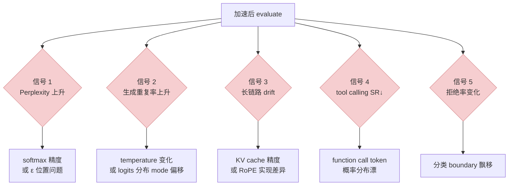
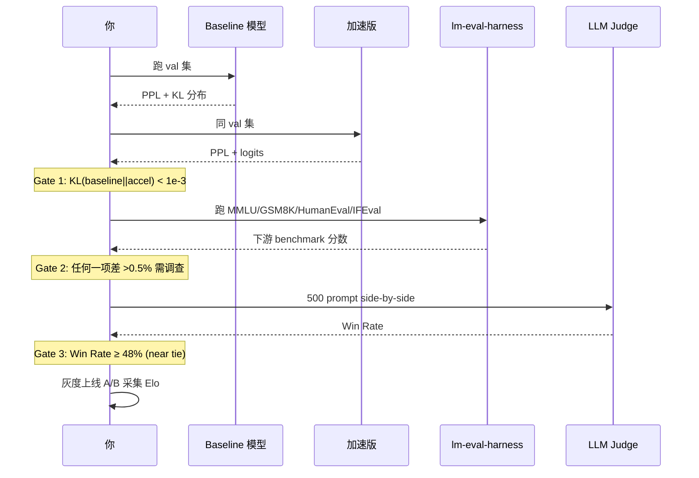

> 姊妹篇：[效率指标全景](/posts/training-inference-efficiency-metrics/) · [精度对齐实战](/posts/fused-kernel-accuracy-alignment/) · [GPU SOP](/posts/training-inference-acceleration-troubleshooting-sop/)
>
> 效率指标讲"多快"，效果指标讲"没变差"。加速最大的陷阱不是"跑不起来"，而是**跑起来了但效果悄悄掉了**。这篇梳理训推加速场景下所有常用效果指标——从 loss 和 perplexity 这些"模型自己考自己"的，到 MMLU/GSM8K 这些"下游任务"的，到 Elo 和 MOS 这些"人来判的"——一次讲清什么情况用什么。
>
> ⚠️ **时效声明（最后更新：2026-05-08）**：大模型评测集迭代极快——新 benchmark 每月都出、老 benchmark 饱和被淘汰、数据污染导致指标失真。本文清单反映**2026 年中的行业常用配置**，半年到一年后可能部分被取代。以下几个风向建议自行追更：
> - [🤗 Open LLM Leaderboard](https://huggingface.co/spaces/open-llm-leaderboard/open_llm_leaderboard)（通用）
> - [LMSYS Chatbot Arena](https://lmarena.ai/)（主观 Elo）
> - [SWE-bench Leaderboard](https://www.swebench.com/)（Agent 编码）
> - [τ-bench / OSWorld / GAIA 官方](https://github.com/sierra-research/tau-bench)（Agent 通用）
> - [Open-X-Embodiment / LIBERO](https://robotics-transformer-x.github.io/)（Robotic VLA）

---

## 零、本文骨架

| 小节 | 主题 | 产出 |
|---|---|---|
| §一 | 引子：加速不能"静悄悄掉点" | 为什么要看效果指标 |
| §二 | 训练侧指标 | Loss / CE / NLL / Perplexity / KL / Grad norm |
| §三 | 下游客观指标 | MMLU / GSM8K / HumanEval / BBH + 中文集 + **Agent / VLA / Multi-Agent** |
| §四 | 生成质量客观指标 | BLEU / ROUGE / CHRF / F1 / EM |
| §五 | 语音 / 转写指标 | **WER / CER** / MOS |
| §六 | 主观评价 | Elo / Side-by-side / LLM-as-Judge |
| §七 | Calibration / 安全性 | ECE / TruthfulQA / 拒绝率 / 幻觉率 |
| §八 | 加速常见的退化信号 | 重复率 / Perplexity 漂 / tool SR 下降 |
| §九 | 加速后的对齐工作流 | 链接精度对齐篇 |
| §十 | 权威参考 | - |

---

## 一、引子：加速不能"静悄悄掉点"

真实场景：某团队上线 fused attention，训练 loss 曲线**完全吻合** baseline，MMLU 也没差。业务上线两周后发现**长上下文问答（> 8K tokens）的回答质量明显下降**——原来 mask 实现的一个细节差异，只在长序列场景触发。

这说明：**效果指标要看一整套，不能只看训练 loss**。本文按"从**模型内部**到**对话输出**"的粒度组织，各层级对应的指标如下：

| 粒度层级 | 典型指标 | 主要用途 | 加速场景关注点 |
|---|---|---|---|
| **模型内部** | Loss · Perplexity · KL Divergence | 训练健康 / 分布对齐 | 加速前后 KL < 1e-3 算对齐 |
| **单样本预测** | CE · NLL · Logits 分布 · Top-1 Agreement | 精度对齐定量 | Top-1 agreement > 99.5% 算过关 |
| **下游客观任务** | MMLU · GSM8K · HumanEval · BBH · IFEval | 知识 / 推理 / 代码 / 指令遵循 | 任何一项差 > 0.5% 需调查 |
| **生成质量客观** | BLEU · ROUGE · CHRF · F1 · Exact Match | 翻译 / 摘要 / QA | 现代已被 LLM-as-Judge 部分替代 |
| **语音 / 转写** | WER · CER · MOS · DNSMOS | ASR / TTS / 语音增强 | 中文用 CER，英文用 WER |
| **主观评价** | Elo · LLM-as-Judge · Side-by-side A/B | 真实用户体验 | 胜率 ≥ 48% 视为 near tie |
| **安全 / 校准** | ECE · TruthfulQA · 幻觉率 · 拒绝率 | 安全性 / 可靠性 | 加速后 refusal rate 必须保持 |

---

## 二、训练侧指标

### 2.1 Cross-Entropy Loss（CE）

训练 LM 的基础 loss，本质是 **NLL（Negative Log-Likelihood）**：

$$
\mathcal{L}_\text{CE} = -\frac{1}{N}\sum_{i=1}^{N} \log P_\theta(y_i \mid x_{<i})
$$

- $P_\theta$：模型预测的下一 token 概率分布
- 单位：nats（自然对数底）；换成 bits 就 $\div \ln 2$

**Qwen3-8B 预训练参考**：从初始 ~10 降到收敛 ~2.0（通用语料，示意）。

### 2.2 Perplexity（PPL，困惑度）

**定义**：模型对序列分配概率的几何平均的倒数——可以理解成"模型平均在几个候选里挑"。

$$
\text{PPL} = \exp(\mathcal{L}_\text{CE})
$$

- CE=2.0 → PPL ≈ 7.4
- CE=1.5 → PPL ≈ 4.5

**解读**：PPL 4.5 ≈ 每个 token 平均在 4~5 个候选里挑。**PPL 是训练和推理（评测集）双向都用的指标**。

**加速后必测**：同样 val 集上 PPL 差 > **0.5%** 就算"肉眼可察退化"。

### 2.3 KL Divergence（分布对齐的核心工具）

**定义**：衡量两个概率分布的差异。

$$
D_\text{KL}(P \| Q) = \sum_x P(x) \log \frac{P(x)}{Q(x)}
$$

**在加速场景的用法**：
- **Baseline vs Accelerated**：对同一 input，算两个模型 logits 的 KL，作为**精度对齐的定量指标**
- **Distillation**：蒸馏训练的 loss 就是 KL divergence 本身
- **RLHF**：PPO 里 `ref_model` 对 `policy_model` 的 KL 当作正则项

**实战公式**（对数值稳定友好）：

$$
D_\text{KL}(P \| Q) = \sum_x P(x) [\log P(x) - \log Q(x)]
$$

PyTorch 实现：

```python
import torch.nn.functional as F
# baseline_logits 和 accel_logits 都是 [batch, seqlen, vocab]
log_p = F.log_softmax(baseline_logits.float(), dim=-1)
log_q = F.log_softmax(accel_logits.float(),    dim=-1)
kl = F.kl_div(log_q, log_p, reduction='batchmean', log_target=True)
print(f"KL(baseline || accelerated) = {kl.item():.6f}")
# < 1e-3 基本算对齐；> 1e-2 有问题
```

### 2.4 Logits 分布对比（不止 KL）

除 KL 外还有几个常用的 **logits-level diff** 指标：

| 指标 | 公式 | 用途 |
|---|---|---|
| **Top-1 Agreement** | $\frac{1}{N}\sum \mathbb{1}[\arg\max P = \arg\max Q]$ | 两模型最可能的下一 token 一致性 |
| **Top-K Overlap** | $\|$topk$(P) \cap $ topk$(Q)\|/K$ | Top-K 候选集的 Jaccard 相似 |
| **Max Abs Logit Diff** | $\max_x \|P(x) - Q(x)\|$ | 最大偏离 |
| **JS Divergence** | $\frac{1}{2}(D_\text{KL}(P\|M) + D_\text{KL}(Q\|M)), M=\frac{P+Q}{2}$ | 对称版 KL |

**加速验证经验**：
- Top-1 Agreement > 99.5% 算很好
- KL < 1e-3 算过关
- JS 对称，更适合"谁也不是 ground truth"的两个实现对比

### 2.5 Gradient Norm / Gradient Noise Scale

$$
\|\nabla\|_2 = \sqrt{\sum_i g_i^2}
$$

**训练健康度**的核心信号：
- `grad_norm` 稳定趋于某个值 → 训练正常
- `grad_norm` 暴增（"grad spike"） → 数据 / lr / 精度问题
- `grad_norm` → 0 → 学不动，可能数值下溢

**加速场景特有**：换 fused kernel 后 `grad_norm` 分布若明显变化，基本可断定数值实现有差异。

**Gradient Noise Scale**（GNS，Chinchilla 提出）：

$$
\text{GNS} = \frac{\mathrm{tr}(\Sigma_g)}{\|\mathbb{E}[g]\|^2}
$$

衡量 batch 之间的梯度噪声。指导 batch size 选择（GNS 太大说明 batch 不够）。

---

## 三、下游客观指标

**规则**：训练 loss 只说"拟合数据"，下游任务测"能不能用"。加速后必跑这一档。

### 3.1 英文通用

| 指标 | 测什么 | 题量 | Qwen3-8B 参考 |
|---|---|---|---|
| **MMLU** | 57 学科选择题（通用知识） | ~14k | ~70% |
| **MMLU-Pro** | MMLU 难度升级 | ~12k | ~48% |
| **GSM8K** | 小学数学推理 | 1319 | ~85% |
| **MATH** | 竞赛级数学 | 5000 | ~45% |
| **HumanEval** | Python 代码补全 | 164 | ~72% |
| **MBPP** | 基础 Python 编程 | 974 | ~68% |
| **BBH**（Big-Bench-Hard） | 23 个难任务 | ~6.5k | ~55% |
| **HellaSwag** | 常识推理 | 10k | ~85% |
| **Winogrande** | 指代消解 | 1.3k | ~78% |
| **ARC-Challenge** | 科学推理 | ~3k | ~80% |
| **IFEval** | 指令遵循 | ~500 | ~72% |
| **TruthfulQA** | 真实性 | 817 | ~55% |

### 3.2 中文专用

| 指标 | 测什么 | 题量 |
|---|---|---|
| **C-Eval** | 52 学科中文选择题 | ~14k |
| **CMMLU** | 类似 MMLU 中文版 | ~12k |
| **SuperCLUE** | 多维中文能力 | 动态 |
| **CMRC** | 中文阅读理解 | ~1.5k |
| **AGIEval** | 人类考试题（高考/公务员） | ~8k |

### 3.3 评测框架（直接用）

别自己写——用现成的：

- **`lm-evaluation-harness`** (EleutherAI)：覆盖 100+ 任务，标准化
- **`OpenCompass`**：国内主流，覆盖中英文任务
- **`HELM`**：斯坦福的综合评测

```bash
# lm-eval-harness 示例
lm_eval --model hf --model_args pretrained=Qwen/Qwen3-8B \
        --tasks mmlu,gsm8k,humaneval,hellaswag \
        --batch_size auto --output_path ./results
```

### 3.4 Agent 评测（2024 后新兴，加速前必跑）

随着 AI Agent 落地，**单轮问答的 MMLU 已经不能反映 Agent 能力**——需要在"多步工具调用 / 长链路推理 / 环境交互"的场景测。

| 评测 | 场景 | 题量 | 加速敏感度 |
|---|---|---|---|
| **SWE-bench / SWE-bench Verified** | 真实 GitHub issue 修复（代码 Agent） | 2.3k / 500 | 高（长上下文+多轮工具） |
| **τ-bench (tau-bench)** | 零售 / 航旅业务的 tool-calling Agent | 动态 | 高（工具参数精度） |
| **GAIA** | 通用助手 benchmark（Level 1-3） | 466 | 中（推理链长） |
| **AgentBench** | 8 类环境多任务（OS/DB/Web 等） | ~1.4k | 中 |
| **WebArena / VisualWebArena** | 真实网站的 web 操作 | 812 / 910 | 高（多模态） |
| **OSWorld** | 桌面 OS 级任务（跨 app 操作） | 369 | 极高 |
| **MINT** | 多轮工具调用 + 用户反馈 | 586 | 中 |
| **ToolBench / APIBench** | API 调用正确性 | 数千 | 中 |

**加速场景关注点**：
- 量化 / 蒸馏对**长 Context 推理链**影响最大（SWE-bench / GAIA 首当其冲）
- KV cache 量化可能让**工具参数中的数字/代码**精度漂（τ-bench 参数正确率 ↓）
- Speculative decoding 在 Agent 场景增益比聊天场景低（Agent 输出更多代码 / JSON，分布尖锐，draft 接受率低）

### 3.5 Multi-Agent / Agent Team 评测（2024 末~2025 新兴）

单 Agent → Agent Team 的评测还在早期标准化。目前主流：

| 评测 | 测什么 | 备注 |
|---|---|---|
| **AgentBoard** | Agent 行为的细粒度 error taxonomy（9 类错误）| 而非单一成功率 |
| **AIOpsLab** | 真实运维环境下多 Agent 协作 | IBM 出品 |
| **MultiAgentBench / BattleAgentBench** | Agent 之间协作 + 对抗 | 游戏 / 谈判场景 |
| **ChatDev / MetaGPT 风格 benchmark** | 模拟软件开发团队 | 多 role 协作 |
| **LiveCodeBench** | 持续更新代码题（无数据污染）| 单 agent 但实战强 |

**时效警告**：Multi-Agent 评测 2025 才开始收敛；选型推荐**看当前 SOTA leaderboard**而非抄历史论文。

### 3.6 Robotic VLA（Vision-Language-Action）评测

具身智能 / 机器人 VLA 模型的评测集，和前面的 NLP benchmark 完全另一套体系：

| 评测 | 场景 | 代表模型 |
|---|---|---|
| **LIBERO** | 长时程操作（spatial/object/goal/long） | OpenVLA, π0 |
| **CALVIN** | 语言条件的连续机器人操作 | RT-2, RoboFlamingo |
| **RLBench** | 100+ 仿真操作任务 | 通用 |
| **SimplerEnv** | 真实世界实验 simulation mirror | Google RT 系列 |
| **BEHAVIOR-1K** | 1000+ 家务任务，长时程 | 斯坦福 |
| **Open-X-Embodiment** | 21 个 embodiment 跨平台数据 + benchmark | RT-X / OpenVLA |
| **RoboCasa** | 厨房场景程序化生成 | 大规模任务池 |
| **Isaac Lab / Isaac Sim** | NVIDIA 物理仿真评测环境 | sim-to-real |

**VLA 加速的特殊考虑**：
- VLA 模型的**实时性要求**比 LLM 严苛——常要 20~50 Hz 推理（50ms 内必须出 action）
- 量化 / 剪枝容易让**精细操作（抓取成功率 / 插入精度）**下降，但聊天评测看不出来
- 评测必须**在仿真 + 真机**都跑——sim2real gap 是 VLA 加速的主要风险源

### 3.7 "加速后跑哪些"——最小集

不可能每次都跑 20 个 benchmark。按模型类型分推荐：

| 模型类型 | 必跑最小集 | 推荐补充 |
|---|---|---|
| 通用 LLM | MMLU + GSM8K + HumanEval + IFEval | C-Eval / CMMLU（中文）、LongBench（长上下文） |
| 编码 Agent | SWE-bench Verified + LiveCodeBench | HumanEval / MBPP |
| 通用 Agent | τ-bench + GAIA | OSWorld / WebArena |
| Multi-Agent | AgentBoard + LiveCodeBench | 场景相关的自定义环境 |
| VLA / 机器人 | LIBERO + SimplerEnv | 真机验证（小规模抽测） |
| 语音 / ASR | LibriSpeech + CommonVoice（WER/CER） | 多语言细分 |

---

## 四、生成质量客观指标（翻译 / 摘要 / 问答）

| 指标 | 公式概要 | 擅长 | 弱点 |
|---|---|---|---|
| **BLEU** | $n$-gram precision + brevity penalty | 机翻 | 对 paraphrase 敏感 |
| **ROUGE** | $n$-gram recall（ROUGE-1/2/L） | 摘要 | 同上 |
| **METEOR** | 语义对齐 | 翻译 | 计算慢 |
| **CHRF** | 字符级 $n$-gram F-score | 跨语言 | 低频词权重低 |
| **F1 / Exact Match** | 精准 / 宽松匹配 | QA / NER | 只看 token 级 |
| **BERTScore** | 预训练 embedding 余弦 | 语义相似 | 依赖 encoder 质量 |

**BLEU 公式**（简化）：

$$
\text{BLEU} = \text{BP} \cdot \exp\left(\sum_{n=1}^{4} w_n \log p_n\right)
$$

- $p_n$：$n$-gram precision
- $\text{BP}$：brevity penalty（过短惩罚）

**现代替代**：GPT-4/Claude 作评委（LLM-as-Judge，见 §六）对生成质量的判别比传统 $n$-gram 指标**更接近人类判断**，但成本高。

---

## 五、语音 / 转写指标

### 5.1 WER — Word Error Rate

语音识别（ASR）的金标准：

$$
\text{WER} = \frac{S + D + I}{N}
$$

- $S$：substitution（替换）
- $D$：deletion（删除）
- $I$：insertion（插入）
- $N$：参考答案总 word 数

**示例**：reference "the quick brown fox"，hypothesis "the quick brown dog" → S=1, D=0, I=0, N=4 → WER=25%。

**Whisper-large-v3 在 LibriSpeech**：~2.5% WER（示意）。

### 5.2 CER — Character Error Rate

中文 / 无空格语言用：

$$
\text{CER} = \frac{S_c + D_c + I_c}{N_c}
$$

（逐字符算）。Qwen / ASR 中文语音识别主要看 CER。

### 5.3 MOS — Mean Opinion Score

主观听感评分（**1~5 分**，5 最好），多个评测员打分后取平均。TTS 和语音增强场景标配。

$$
\text{MOS} = \frac{1}{N}\sum_{i=1}^{N} s_i, \quad s_i \in \{1,2,3,4,5\}
$$

**现代替代**：**UTMOS / DNSMOS** 等**自动 MOS 预测模型**——训一个小网络拟合人类 MOS 打分，加速评测。

---

## 六、主观评价指标

### 6.1 Elo Rating（Chatbot Arena 风格）

**定义**：两模型回答同一 prompt，人类选更好的那个——**N 场 A/B 对决后推出 Elo 分数**。

Elo 更新规则（简化）：

$$
R_A^{(t+1)} = R_A^{(t)} + K \cdot (S_A - E_A), \quad E_A = \frac{1}{1 + 10^{(R_B - R_A)/400}}
$$

- $S_A \in \{0, 0.5, 1\}$：胜 / 平 / 负
- $K$：学习率（通常 16~32）
- $E_A$：期望胜率

**LMSYS Chatbot Arena** 是业界最有影响力的主观榜。GPT-4o、Claude 4、Qwen3 都在榜上动辄 1300+。

### 6.2 Side-by-Side A/B 测试

**手工方法**：两个模型对同 prompt 的回答**并排**，评测员盲评选更好的。

**指标**：胜率（Win Rate）、Tie Rate（平局比例）、净胜率（Win − Lose）。

### 6.3 LLM-as-Judge（GPT-4/Claude 作评委）

**核心思路**：用更强的 LLM（GPT-4、Claude 4）给回答打分。

**Prompt 模板**（典型）：

```
You are a fair judge. Compare two responses to the prompt below.
Rate each on: helpfulness, correctness, clarity, conciseness.
Scores 1-10.

Prompt: {prompt}
Response A: {resp_a}
Response B: {resp_b}

Output JSON: {"A": <score>, "B": <score>, "winner": "A"|"B"|"tie"}
```

**已知 bias**：
- **Position bias**：前面的 response 更容易被选（要做 A/B 位置 swap）
- **Length bias**：更长的回答常被偏爱（要做长度 normalize）
- **Self-preference**：Claude 倾向喜欢 Claude 的 style（换评委 cross-check）

**主流框架**：**MT-Bench** / **AlpacaEval 2.0** / **Arena Hard** 都基于此。

### 6.4 主观指标跟加速的关系

加速对主观指标的影响往往**最后暴露**。推荐流程：

```
训练 loss ok → 下游 benchmark ok → LLM-as-Judge 评 500 prompt → Elo 小规模人工 review
```

---

## 七、Calibration / 安全性

### 7.1 ECE — Expected Calibration Error

衡量模型预测置信度和实际准确率的差距：

$$
\text{ECE} = \sum_{m=1}^{M} \frac{|B_m|}{n} \cdot |\text{acc}(B_m) - \text{conf}(B_m)|
$$

- 把预测按置信度分 $M$ 个 bin
- 每 bin 内算准确率 vs 平均置信度，加权求差

**ECE 低** = 模型说 90% 对时，确实 90% 对。加速导致 **softmax 温度偏移**时，ECE 会变化。

### 7.2 幻觉 / 真实性

- **TruthfulQA** 测"是否倾向说真话"
- **HaluEval** 测幻觉率
- **FActScore** 对长回答做 fact decomposition + 单独验证

### 7.3 拒绝率 / 安全性

- **AdvBench**：有害指令是否被拒
- **Do-Not-Answer**：正常问题是否被**过度**拒绝（"过度谨慎")

加速后必测：加速前后的 **refusal rate** 应保持一致——模型对有害指令的拒绝能力**不能因加速掉线**。

---

## 八、加速常见的"效果退化信号"



| 信号 | 指标 | 常见根因 |
|---|---|---|
| Perplexity 上升 | eval 集 PPL | 数值精度 / reduction 顺序 |
| 重复率（N-gram repetition） | `repetition_count / total_ngrams` | temperature 失效 / logits mode 偏 |
| 长链路 drift | 长文本任务得分 | KV cache 量化 / RoPE 精度 |
| Tool calling SR | 函数调用成功率 | 特殊 token 概率漂 |
| 拒绝率变化 | refusal rate | 分类 boundary 飘 |

---

## 九、加速后的对齐工作流（简述）

详见 [《精度对齐实战》](/posts/fused-kernel-accuracy-alignment/)。本篇视角下的**评测节点**：



---

## 十、权威参考

- [Perplexity 原始定义（Jurafsky & Martin NLP 教材）](https://web.stanford.edu/~jurafsky/slp3/3.pdf)
- [Cross-Entropy / KL — PyTorch 文档](https://pytorch.org/docs/stable/generated/torch.nn.functional.kl_div.html)
- [MMLU 论文](https://arxiv.org/abs/2009.03300)
- [GSM8K 论文](https://arxiv.org/abs/2110.14168)
- [HumanEval 论文 (Codex)](https://arxiv.org/abs/2107.03374)
- [BBH 论文](https://arxiv.org/abs/2210.09261)
- [IFEval 论文](https://arxiv.org/abs/2311.07911)
- [C-Eval](https://cevalbenchmark.com/)
- [CMMLU](https://github.com/haonan-li/CMMLU)
- [lm-evaluation-harness](https://github.com/EleutherAI/lm-evaluation-harness)
- [OpenCompass](https://github.com/open-compass/opencompass)
- [HELM](https://crfm.stanford.edu/helm/)
- [MT-Bench & Chatbot Arena 论文](https://arxiv.org/abs/2306.05685)
- [AlpacaEval 2.0](https://github.com/tatsu-lab/alpaca_eval)
- [TruthfulQA](https://arxiv.org/abs/2109.07958)
- [ECE — Calibration of Modern NN](https://arxiv.org/abs/1706.04599)
- [DNSMOS — 语音质量自动评估](https://arxiv.org/abs/2110.01763)
- 系列：
  - [效率指标全景](/posts/training-inference-efficiency-metrics/)
  - [精度对齐实战](/posts/fused-kernel-accuracy-alignment/)
  - [GPU/NCCL SOP](/posts/training-inference-acceleration-troubleshooting-sop/)

---

> **一句话总结**：加速的效果验证不能只看 loss——客观指标（MMLU/GSM8K/HumanEval/WER/CER）、主观指标（Elo/Judge）、安全校准（ECE/幻觉率）必须一起看，才能避免"效率上去了、效果悄悄掉了"的噩梦。
