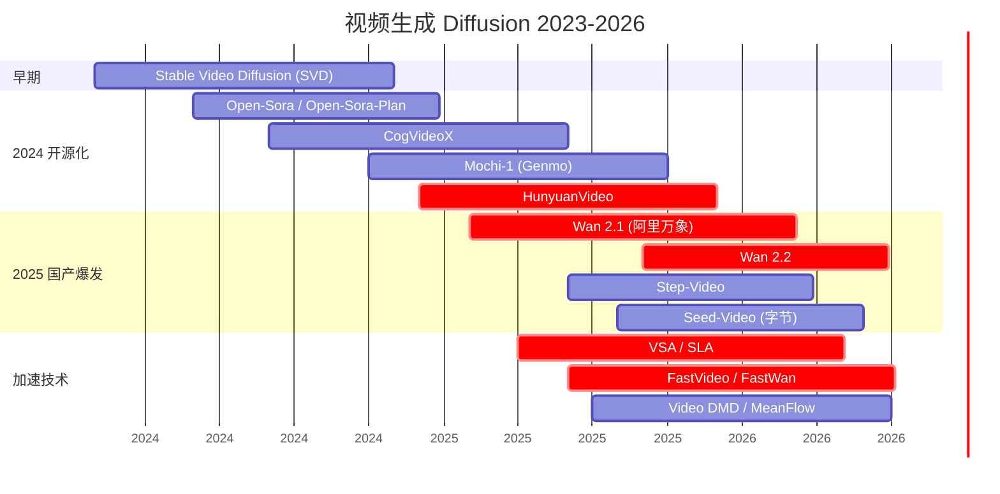
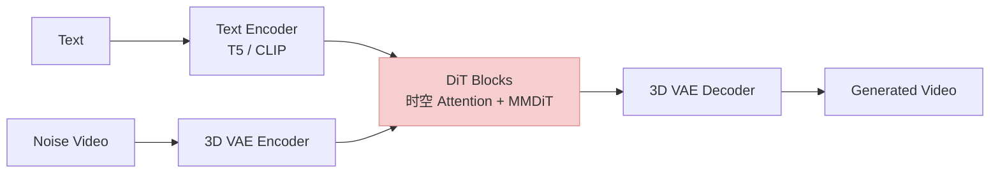
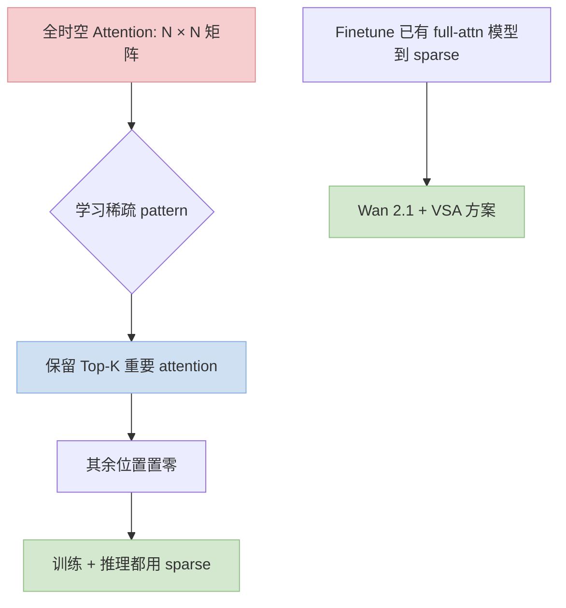

> 训推加速系列深化之"视频 & 3D 扩散"专题。视频时间维 + 3D 空间维让 attention 复杂度直接上升 1~2 个数量级——**这是一套独立于图像 Diffusion 的加速体系**。
>
> 姊妹篇：[图像 Diffusion 深化](/posts/image-diffusion-acceleration-flux-sd3-dmd2/)（先看这篇理解基础）· [训推加速技术地图](/posts/training-inference-acceleration-map/)
>
> ⚠️ **时效声明（最后更新：2026-05-08）**：视频生成是 2025 下半年才开始"开源可用"级别（Wan 2.1 / HunyuanVideo / Mochi），技术迭代极快，本文反映 2026 年中快照。

---

## 零、本文骨架

| 小节 | 主题 | 产出 |
|---|---|---|
| §一 | 视频 ≠ 图像的加速挑战 | 时间一致性 + attention 立方复杂度 |
| §二 | 2024~2026 视频模型时间线 | 从 SVD 到 Wan 2.2 |
| §三 | DiT 视频架构对比：Wan / HunyuanVideo / CogVideoX / Mochi | 表格 + 特点 |
| §四 | **可训练稀疏 Attention：VSA / SLA** | 视频加速的 2024 关键突破 |
| §五 | Temporal Caching：视频特有的 TeaCache / FBCache 用法 | - |
| §六 | 步数蒸馏：FastVideo / FastWan / 视频版 DMD2 | - |
| §七 | 3D 扩散加速：3D Gaussian Splatting / DreamGaussian / Triplane | - |
| §八 | 端到端 gen-to-video 管线 | FLUX → HunyuanVideo 串联 |
| §九 | 评测：FVD / VBench / 主观 | 公式 |
| §十 | 2026 SOTA 推荐配置 | - |
| §十一 | 权威参考 | - |

---

## 一、视频 ≠ 图像的加速挑战

### 1.1 复杂度爆炸

设图像 $H \times W$，视频多一个时间维 $T$ frame：

**图像 DiT attention 复杂度**：

$$
O\left((H \cdot W)^2\right)
$$

**视频 DiT 全时空 attention**：

$$
O\left((T \cdot H \cdot W)^2\right)
$$

1024×1024 图像 → 16K tokens；5 秒 24fps 1024×1024 视频 → 120 frames × 16K = **1.9M tokens**——attention 矩阵 $O(10^{12})$，直接**爆**。

### 1.2 三个独立于图像的新约束

| 约束 | 解决思路 |
|---|---|
| 序列长度爆炸 | **稀疏 / 窗口 attention**（VSA / SLA / 窗口化）|
| 时间一致性 | 帧间 attention（cross-frame）+ 专门的时间模块 |
| 显存爆炸 | Sequence Parallel / Context Parallel / 激活 offload |

**结论**：图像 Diffusion 三条主线（步数蒸馏 / 新架构 / Attention 量化）**视频全继承**，但要再加一条"**时空稀疏 attention**"——这才是视频加速的真正核心。

---

## 二、2024~2026 视频模型时间线



### 2.1 关键里程碑

- **2023-11 SVD**：第一个可用的开源视频扩散，2~3 秒
- **2024-12 HunyuanVideo**：腾讯发布，13B 参数，中文社区引爆
- **2025-02 Wan 2.1**：阿里万象系列起点，配套 DiffSynth-Studio
- **2025-09 Wan 2.2**：SOTA 开源视频生成模型之一
- **2025-04 VSA**：Video Sparse Attention，视频加速的关键工作

---

## 三、DiT 视频架构对比

| 模型 | 发布 | 参数 | 架构 | 时长 | 特点 |
|---|---|---|---|---|---|
| **SVD** | 2023-11 | 1.5B | UNet | 2-3s | 开源第一，老派 |
| **Open-Sora** | 2024-03 | 1.1~7B | DiT | 2~15s | 学术复现 Sora |
| **CogVideoX** | 2024-06 | 2B/5B | 3D DiT | 10s | 第一批 full DiT |
| **Mochi-1** | 2024-10 | 10B | Asym DiT | 5.4s | 质量高，Apache 2.0 |
| **HunyuanVideo** | 2024-12 | 13B | DiT | 15s | 腾讯 SOTA |
| **Wan 2.1** | 2025-02 | 14B | DiT | 5s | 阿里开源 |
| **Wan 2.2** | 2025-09 | 14B+ | DiT + VSA 支持 | 5s+ | 训推一体 SOTA |
| **Step-Video** | 2025-06 | — | DiT | — | 阶跃星辰 |

### 3.1 共同架构要素



### 3.2 加速各模型的共同手段

- **3D VAE**：把视频压缩到 latent（时空都压，比如 8×8×4），DiT 在 latent 上跑
- **Temporal chunking**：生成长视频时切片
- **稀疏 / 窗口 attention**：避免全时空 attention

---

## 四、可训练稀疏 Attention：VSA / SLA

### 4.1 为什么视频要稀疏

图像 attention 是 token²；视频是 `(T × H × W)²`，即使 latent 压缩 8×8×4 后，一个 5s 视频 latent 仍有 **~10K tokens**，相比图像 4K tokens 复杂度上 6×。

**关键观察**：视频相邻 frame 的 attention weight **大部分集中在局部时空邻域**——远处的 patch 贡献很小。

### 4.2 VSA (Video Sparse Attention) 核心思想



### 4.3 VSA 数学

设完整 attention 矩阵 $A \in \mathbb{R}^{N \times N}$，定义稀疏掩码 $M \in \{0, 1\}^{N \times N}$：

$$
\tilde{A} = \mathrm{softmax}\left(\frac{QK^T}{\sqrt{d}} + \log M\right) V
$$

（$\log 0 = -\infty$，使 softmax 后稀疏位置为 0）

**VSA 的关键**：mask $M$ **可训练** + 可 finetune 到已有全 attention 模型上。

$$
\text{Sparsity Ratio} = \frac{\|M\|_0}{N^2} \in [0.1, 0.3]
$$

稀疏率 10~30% = **7~10× FLOPs 省**。

### 4.4 VSA 实战：Wan 2.1 finetune

```
基础: Wan 2.1 full attention 版
finetune: VSA adapter, ~几千 H100 小时
结果: 推理速度 2~5× 提升，质量几乎无损
```

这就是为什么技术地图里说"**Wan 2.1 + VSA finetune + DMD 可再快 2~5×**"——三项叠加是视频生成加速的组合拳。

### 4.5 SLA (Sparse Local Attention)

**SLA** 是 VSA 的局部化变体——**预定义**局部时空窗口 + 少量 global token。相比 VSA 的"可学习 mask"，SLA 的 mask 是固定的（减少训练开销），但灵活性差一些。

---

## 五、Temporal Caching：视频特有的 Feature Cache

### 5.1 视频 Diffusion 的时间冗余

视频生成过程中，**相邻 timesteps** 的特征 + **相邻 frames** 的特征都非常相似——**双重冗余**比图像更可剥削。

### 5.2 TeaCache / FBCache 在视频上

- **TeaCache**（2024 起）：对视频 DiT 自适应 cache，实测 Wan 2.1 / HunyuanVideo 上 **1.8~2.5× 加速**，基本无损
- **FBCache**（2025）：更激进的 Feature Block Cache，视频场景 **2~3× 加速**

```
baseline Wan 2.1 14B 5s 视频: ~8 min
+ TeaCache:                    ~4 min
+ TeaCache + VSA (Wan 2.1):    ~2 min
+ TeaCache + VSA + FastWan:    ~1 min
```

### 5.3 和步数蒸馏的叠加

TeaCache / FBCache 和 DMD / FastWan 可以**一起用**：
- 蒸馏把 steps 从 50 → 8
- Cache 再跳过 8 步中一半的计算
- **组合后相对 baseline 速度提升 5~10×**

---

## 六、步数蒸馏：FastVideo / FastWan / 视频版 DMD2

### 6.1 FastVideo（UC Berkeley, 2025）

- 目标：**视频 Diffusion 步数从 50 蒸馏到 5~10**
- 方法：Consistency model + DMD-like 分布匹配
- 适用模型：Mochi / HunyuanVideo / Wan

### 6.2 FastWan（阿里万象团队）

专门为 **Wan 系列** 做的蒸馏栈：
- 从 Wan 2.1 50 步蒸馏到 5~10 步
- **质量损失 < 5%**（主观评价）
- 配套 DiffSynth-Studio

### 6.3 MeanFlow（视频 1 步方案）

视频版的 Rectified Flow + 单步蒸馏——**把整个视频一次生成出来**，不再逐步去噪。2025 刚出，质量还在追赶。

---

## 七、3D 扩散加速

### 7.1 3D 生成的三条路线

| 路线 | 代表 | 输出 | 加速核心 |
|---|---|---|---|
| **3D Gaussian Splatting** | 3DGS / Scaffold-GS | 点云 + 高斯 | 渲染极快（60+ FPS） |
| **Triplane Diffusion** | EG3D / GET3D | Triplane 特征 | 2D Diffusion → 3D 投影 |
| **SDS 蒸馏** | DreamFusion / DreamGaussian | Mesh / 点云 | 2D Prior + 优化 |

### 7.2 3D Gaussian Splatting 为什么快

传统 NeRF：每 ray × 每采样点 × MLP forward，**渲染分钟级**。

3DGS：场景表示成**显式高斯点**，每像素直接做 α-blending，**渲染毫秒级**。

$$
C(r) = \sum_i T_i \alpha_i c_i, \quad T_i = \prod_{j<i}(1 - \alpha_j)
$$

- $T_i$：通过前面高斯的累积透明度
- $\alpha_i, c_i$：第 i 个高斯的透明度与颜色

### 7.3 DreamGaussian + Gaussian Splatting 的结合

2D Diffusion Prior 给 multi-view 监督 → 优化 3D Gaussian 点集 → **秒级生成 3D 模型**。

```
输入: 单张图像 or 文本
 ↓
多 view Diffusion 生成 (Zero123 / Zero123++)
 ↓
Gaussian Splatting 初始化 + SDS loss 优化
 ↓
输出: 可直接渲染的 3D 高斯点云
 ↓
（可选）转为 Mesh / USD / glTF 标准格式
```

---

## 八、端到端 gen-to-video 管线

2026 生产级视频内容生成不是单个模型——是**管线串联**：


### 8.1 典型管线时序

```
1. Text-to-Image (FLUX.1 schnell 4 步 → 1.5s)
2. Image-to-Video (Wan 2.2 + VSA + TeaCache + DMD → 2 min)
3. Audio generation (MusicGen → 10s)
4. Composition (FFmpeg 秒级)

总延迟: 2.5~3 分钟 / 5秒视频（消费级 GPU）
```

### 8.2 主流部署栈

- **DiffSynth-Studio**（魔搭）：统一 Wan / FLUX / SD3 / HunyuanVideo 一键
- **ComfyUI + Video Suite**：节点式，创作者最爱
- **xDiT**：多卡 DiT 服务端并行

---

## 九、评测指标

### 9.1 FVD (Fréchet Video Distance)

仿照 FID，但用 **I3D** 视频分类特征替代 Inception：

$$
\text{FVD} = \| \mu_r - \mu_g \|^2 + \mathrm{Tr}(\Sigma_r + \Sigma_g - 2(\Sigma_r \Sigma_g)^{1/2})
$$

**越低越好**。用于评估生成视频的分布贴近真实视频分布的程度。

### 9.2 VBench（视频生成专用）

2024 后视频评测主流 benchmark，**16 维度**评分：
- subject consistency（主体一致性）
- background consistency
- temporal flickering（帧间闪烁）
- motion smoothness（运动流畅度）
- object class（对象类别准确）
- spatial relationship
- …

每维独立打分，最后综合。

### 9.3 主观评价

GenAI Arena 的视频 subarena。2025 起 Wan 2.2 / HunyuanVideo / Runway / Sora 等都上榜。

---

## 十、2026 SOTA 推荐配置

### 10.1 消费级 GPU 视频生成（RTX 4090/5090）

```
模型: Wan 2.1 + FastWan + VSA (蒸馏到 8 步)
Cache: TeaCache
Attention: SageAttention 2
框架: DiffSynth-Studio 或 ComfyUI Wan 节点
期望: 5 秒 720p 视频 < 90 秒
```

### 10.2 服务端高质量生产

```
模型: Wan 2.2 14B 或 HunyuanVideo 13B
并行: xDiT Sequence Parallel 2~4 GPU
Attention: VSA finetune 版 + SageAttention 2
Cache: TeaCache + FBCache
步数: 蒸馏到 10~15 步
期望: 5 秒 1080p 视频 < 60 秒/GPU
```

### 10.3 3D 生成

```
图像 → 3D: DreamGaussian / TripoSR / Hunyuan3D-2
关键帧 Diffusion: Zero123++ / Era3D
表示: 3D Gaussian Splatting
渲染: 浏览器端实时 60 FPS
```

### 10.4 长视频（> 10 秒）

```
方案: Chunk-based 生成 + 重叠帧 blend
单 chunk 5s → 拼接
关键控制: 首帧一致性 (image conditioning) + 运动延续
代表: Wan 2.2 long-context 模式 / Step-Video
```

---

## 十一、权威参考

**论文**：
- [Stable Video Diffusion (SAI, 2023)](https://arxiv.org/abs/2311.15127)
- [CogVideoX (THUDM, 2024)](https://arxiv.org/abs/2408.06072)
- [HunyuanVideo (Tencent, 2024)](https://arxiv.org/abs/2412.03603)
- [Mochi-1 (Genmo, 2024)](https://www.genmo.ai/blog/mochi)
- [VSA: Video Sparse Attention (2025)](https://arxiv.org/abs/2504.17893)
- [FastVideo (2025)](https://github.com/hao-ai-lab/FastVideo)
- [DMD2 + Video adaptation](https://arxiv.org/abs/2405.14867)
- [TeaCache (2024)](https://arxiv.org/abs/2411.19108)
- [3D Gaussian Splatting (2023)](https://arxiv.org/abs/2308.04079)
- [DreamGaussian (2023)](https://arxiv.org/abs/2309.16653)
- [Hunyuan3D-2 (2025)](https://arxiv.org/abs/2501.12202)

**代码**：
- [Wan / 万象](https://github.com/Wan-Video/Wan2.1)
- [HunyuanVideo](https://github.com/Tencent/HunyuanVideo)
- [CogVideoX](https://github.com/THUDM/CogVideo)
- [Mochi-1](https://github.com/genmoai/models)
- [FastVideo](https://github.com/hao-ai-lab/FastVideo)
- [DiffSynth-Studio](https://github.com/modelscope/DiffSynth-Studio)
- [xDiT](https://github.com/xdit-project/xDiT)
- [3D Gaussian Splatting](https://github.com/graphdeco-inria/gaussian-splatting)
- [DreamGaussian](https://github.com/dreamgaussian/dreamgaussian)

**系列文**：
- [图像 Diffusion 深化](/posts/image-diffusion-acceleration-flux-sd3-dmd2/)
- [训推加速技术地图](/posts/training-inference-acceleration-map/)
- [语音 / 音频加速](/posts/speech-audio-acceleration-stack/)

---

> **一句话总结**：视频 Diffusion 加速 = 图像三条主线 + **时空稀疏 attention (VSA / SLA)**。2026 消费级视频生成的 SOTA 组合：**Wan 2.1+VSA finetune + FastWan 蒸馏 + TeaCache + SageAttention**——5 秒视频从 baseline 几分钟打到亚分钟级。3D 侧 Gaussian Splatting 已经让秒级生成 + 实时渲染成为现实。
