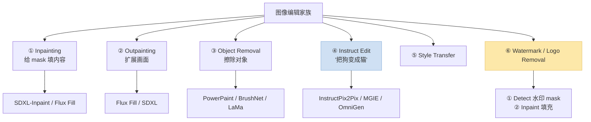
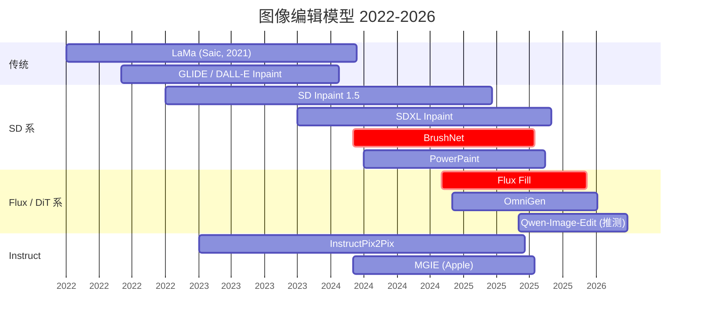
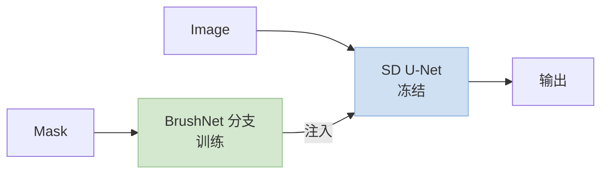
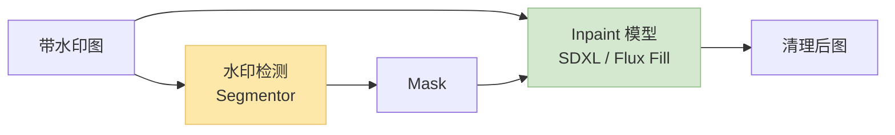
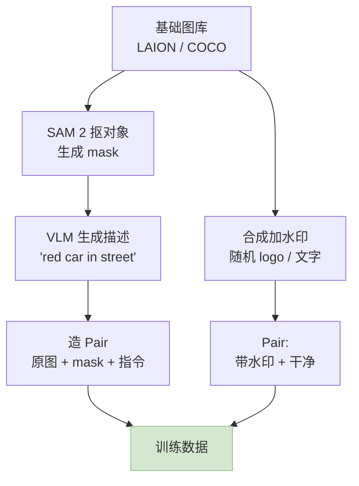

> 训推加速系列深化之"图像编辑"专题。水印消除是**可控 Inpainting** 的一个子任务——更大的家族包括**局部重绘 / 指令式编辑 / 内容擦除**。2024~2026 的 SOTA 从 SDXL Inpaint 跳到 **Flux Fill / BrushNet / PowerPaint**，训练端有独特挑战（**mask-aware 训练 / 合成数据 / 指令对齐**）。
>
> ⚠️ **声明**：本文讲**训练加速与模型技术**。实际水印消除应用时请尊重版权、商标和素材授权——只对自己拥有版权的图像或合法场景（去除历史扫描件中的污渍、修复老照片、消除自拍误入的路人）使用这类技术。
>
> 姊妹篇：[训推加速技术地图](/posts/training-inference-acceleration-map/) · [图像 Diffusion 深化](/posts/image-diffusion-acceleration-flux-sd3-dmd2/) · [分割模型](/posts/segmentation-sam2-training-acceleration/)
>
> ⚠️ **时效声明（最后更新：2026-05-08）**：Flux Fill 2024-11 发布，BrushNet / PowerPaint 2024 开源，数值为公开资料量级。

---

## 零、本文骨架

| 小节 | 主题 | 产出 |
|---|---|---|
| §一 | 图像编辑任务谱 | Inpaint / Instruct / Removal / Fill |
| §二 | 主流架构对比 | SDXL Inpaint / Flux Fill / BrushNet / PowerPaint |
| §三 | Inpainting 训练独有的挑战 | Mask-aware / 数据合成 |
| §四 | 水印消除作为可控 Inpainting | Detect + Inpaint 二级 pipeline |
| §五 | Instruct 式编辑：InstructPix2Pix / MGIE / OmniGen | - |
| §六 | 训练加速：数据合成 + LoRA + Flow Matching | - |
| §七 | 推理加速：少步蒸馏 + Region Denoise | - |
| §八 | Benchmark：PSNR / LPIPS / FID / 用户评分 | - |
| §九 | 2026 SOTA 配置 | - |
| §十 | 权威参考 | - |

---

## 一、图像编辑任务谱

### 1.1 从"局部填充"到"指令编辑"



### 1.2 任务差异对推理 / 训练的影响

| 任务 | 输入 | Mask | 训练数据 | 核心难点 |
|---|---|---|---|---|
| Inpaint | Image + Mask | ✅ | 任意图 + 合成 mask | Mask 边界接缝 |
| Removal | Image + Mask | ✅ | **带对象 + 无对象对**（难）| "真干净"的 GT |
| Instruct | Image + Text | ❌（隐式）| 成对 before/after（贵）| 对齐指令 |
| Watermark | Image（+ optional mask） | 可选 | **合成水印对** | 复杂水印形态 |

---

## 二、主流架构对比

### 2.1 时间线



### 2.2 横向对比

| 模型 | 参数 | 编辑类型 | Mask 输入 | 质量 | 推理速度 |
|---|---|---|---|---|---|
| **LaMa** | ~27M | 纯 inpaint | ✅ | 中 | 极快 |
| **SDXL Inpaint** | 2.6B | 通用 | ✅ | 好 | 中 |
| **BrushNet** | +插件 | 通用 | ✅ | 好 | 中 |
| **PowerPaint** | SDXL 基 | 多任务 | ✅ | 好 | 中 |
| **Flux Fill dev** | 12B | Inpaint + Outpaint | ✅ | **SOTA** | 慢 |
| **OmniGen** | 3.8B | 统一生成 + 编辑 | 可选 | 好 | 中 |
| **InstructPix2Pix** | 0.9B | 指令编辑 | ❌ | 中 | 快 |
| **MGIE** | 7B + VLM | 指令 + 多模态 | ❌ | 好 | 慢 |

### 2.3 BrushNet / PowerPaint：加"可控分支"的思路

和 ControlNet 同 family——**冻结主 SD，加一个 mask-aware 分支**：



- **训练成本低**：只训分支
- **质量好**：主 SD 的生成能力保留
- **多任务复用**：同一主 SD 接不同分支

---

## 三、Inpainting 训练独有的挑战

### 3.1 Mask 感知的输入通道

SD Inpaint 把 U-Net 输入扩成 9 通道：
- **4 通道**：原图 latent
- **1 通道**：mask (0/1)
- **4 通道**：masked latent（被 mask 区域置零）

这就要求**首层 conv 改 shape**——pretrained 权重要 partial copy + 扩展零初始化。

### 3.2 Mask 分布合成

训练时 mask **是合成的**，典型分布：
- **Random box mask**：随机矩形
- **Stroke mask**：手绘风格笔刷
- **Object mask**：用 SAM 2 抠对象 mask
- **Words mask**：文字形状（给水印消除用）
- **Mixed**：70% stroke + 20% object + 10% text

**经验法则**：**推理时 mask 分布 ≈ 训练 mask 分布** 才不会出现边界伪影。

### 3.3 对象擦除的"真干净"难题

训练目标需要 **pair：(图 + 对象), (图 - 对象)**。天然几乎没有——主流做法：
- **合成对象放置**：在干净图上贴对象生成 "before"
- **Diffusion-generated pair**：用模型生成干净版本
- **Video frame 借位**：同场景不同帧借干净背景

PowerPaint 用**多任务 token**把"擦除"和"填充"训成两种模式，解决"模型不知道该填什么"。

---

## 四、水印消除作为可控 Inpainting

### 4.1 标准 pipeline



### 4.2 水印检测是独立任务

- **文字水印**：OCR 定位（PaddleOCR / TrOCR）
- **Logo 水印**：检测器 + 分类（YOLO + classifier）
- **半透明 / 平铺水印**：**专用 segmentor**（常用 U-Net 训的 pixel-classifier）

常用开源：
- **WatermarkRemover-AI**（社区项目）
- **lama-cleaner / IOPaint**：LaMa-based 开源 inpainting 工具链

### 4.3 两种部署路线

| 路线 | 速度 | 质量 |
|---|---|---|
| **检测 + LaMa** | 快（~100 ms 图） | 中 |
| **检测 + Flux Fill** | 慢（~3 s/图） | **高** |
| **检测 + SDXL Inpaint 少步蒸馏** | 中（~500 ms） | 中高 |

### 4.4 合法使用边界

- **自己拍的照片**上误入的路人 / 招牌 / 日期戳
- **自己拥有**的设计稿 / 扫描件中的污渍
- **过期版权 / CC0** 素材的污损修复
- ❌ **绝不要**用来抹他人作品的版权水印或侵犯商标

---

## 五、Instruct 式编辑

### 5.1 InstructPix2Pix (2023)

首个成熟的"图 + 文字 → 新图"范式：
- 数据合成：用 **GPT-3 生成 edit instruction** + **Prompt-to-Prompt** 造 before/after 对
- 训练：在 SD 基础上 fine-tune，U-Net 输入加 reference image
- 数量：~45 万 pair

### 5.2 2024~2026 演进

| 模型 | 特点 |
|---|---|
| **MGIE (Apple)** | VLM 把自然语言指令改写成精确 prompt |
| **OmniGen** | **统一模型**，生成 + 编辑 + 可控 |
| **Flux Fill + ControlNet** | 组合 + LoRA 定制 |
| **Qwen-Image-Edit**（推测） | Qwen 家族的编辑 variant |

### 5.3 指令 + mask 混合

2025+ 趋势：**同时支持文字指令和可选 mask**——PowerPaint / OmniGen 都走这条。

---

## 六、训练加速

### 6.1 数据合成 pipeline



**关键**：**数据合成是训练加速的最大杠杆**（胜过 kernel 优化一个数量级）。

### 6.2 LoRA for Inpaint

全参微调 SDXL Inpaint 需 100+ A100-hour；LoRA 只需 ~10 hour：
- Rank 32~64
- Target U-Net down/up blocks
- 数据量 5k~50k pair 即可

适合**定制水印 / 垂直领域**（医学图像 inpaint / 古籍修复）。

### 6.3 Flow Matching Inpaint（Flux Fill 路线）

Flux Fill 走的是**在 Flux DiT 上做 Fill 特化**：
- 输入拼 9 通道（类似 SD Inpaint 扩展思路）
- 保持 Flow Matching 训练目标
- **数据依赖 mask 分布 + 合成 caption**

训练加速点和 [图像 Diffusion 篇](/posts/image-diffusion-acceleration-flux-sd3-dmd2/) 一致：
- **bf16 + FSDP2**
- **SageAttention**
- **梯度累积 + Activation Checkpointing**

### 6.4 训练 loss 设计

inpaint 常用 **mask-weighted loss**：

$$
\mathcal{L} = \| (\epsilon_\theta - \epsilon) \odot (1 + \lambda \cdot m) \|^2
$$

- $m$：mask（1 = 要填充）
- $\lambda$ 典型 3~10，让模型更关注要填充区域

---

## 七、推理加速

### 7.1 少步蒸馏

和主流 Diffusion 一致，可套 **DMD2 / LCM / Turbo**：
- SDXL Inpaint + LCM-LoRA → **4 步**
- Flux Fill dev → **4~8 步蒸馏版**
- 实测端到端速度 5~10× 加速

### 7.2 Region Denoise：只算要填的区域

**核心 trick**：mask 外的区域用**原图 latent**直接复制，不参与去噪计算：
- 每步节省 ~30~50% U-Net 计算
- 对 mask 很小的场景（水印擦除）特别有效
- 主流框架（diffusers / ComfyUI）默认就是这样做

### 7.3 Tiling（大图）

4K 图 inpaint 一次跑不下 → **Tile + overlap**：
- 512 / 1024 tile 逐个 inpaint
- Overlap 20~30% 做 blending

**坑**：tile 边界的一致性——用 **seed 固定 + 跨 tile context injection** 缓解。

### 7.4 实测数据（示意量级）

| 场景 | 方案 | 延迟 |
|---|---|---|
| 1024 图 + 小 mask | SDXL Inpaint + LCM | ~0.8 s (A100) |
| 1024 图 + 大 mask | Flux Fill dev 20 步 | ~4 s (A100) |
| 1024 图 + 水印 | LaMa | ~0.1 s (A100) |
| 4K 图 tiled | SDXL + 9 tiles | ~6 s |

---

## 八、Benchmark

### 8.1 客观指标

**PSNR** (越大越好)：

$$
\mathrm{PSNR} = 10 \log_{10} \frac{\mathrm{MAX}^2}{\mathrm{MSE}}
$$

**LPIPS** (感知距离, 越小越好)：用 VGG / AlexNet 特征计算。

**FID** (分布距离)：评估生成质量一致性。

**CLIP-score**（指令编辑）：编辑后图像和目标 prompt 的对齐度。

### 8.2 常用 benchmark

| Benchmark | 任务 | 指标 |
|---|---|---|
| **Places2** | Inpaint | PSNR / LPIPS |
| **CelebA-HQ** | 人脸 inpaint | FID |
| **MagicBrush** | Instruct 编辑 | L1 + CLIP |
| **EditBench** | 开放域编辑 | 主观评分 |
| **Emu Edit** | 多任务编辑 | 主观 + CLIP-Dir |

### 8.3 对水印消除的实践指标

| 指标 | 含义 |
|---|---|
| **Removal Rate** | 水印检测器在输出上不再检出的比例 |
| **Background PSNR** | mask 外区域的保真 |
| **Boundary LPIPS** | mask 边界的感知连续性 |
| **Artifact Rate** | 主观评测"伪影"出现率 |

---

## 九、2026 SOTA 配置

### 9.1 通用 Inpainting 云端

```
模型: Flux Fill dev + DMD2 4 步蒸馏版 + SageAttention
硬件: H100 × 1
目标: 1024 图 < 1 s, 质量接近原 Flux Fill
```

### 9.2 水印消除 pipeline

```
检测: YOLO / PaddleOCR + 专用水印 segmentor
Inpaint: SDXL Inpaint LCM 4 步 或 LaMa (速度优先)
后处理: 边界 blend + 可选轻量 SR
期望: 2K 图 < 500 ms (A100)
```

### 9.3 指令编辑应用

```
前端: MGIE / OmniGen / Qwen-Image-Edit (推测)
加速: FP8 + Flow Matching 少步
期望: 1024 图 < 2 s
```

### 9.4 端侧 inpaint

```
模型: LaMa 蒸馏版 或 SD-Turbo Inpaint (0.5B)
平台: iPhone / Android / 浏览器 WebGPU
目标: 512 图 < 1 s
```

### 9.5 LoRA 垂直定制

```
场景: 古籍修复 / 医学图像 / 广告素材
数据: 5k~20k pair
训练: LoRA rank=64 on SDXL Inpaint
时长: ~6~12 小时 A100 × 1
```

---

## 十、权威参考

**论文**：
- [LaMa (Saic, 2021)](https://arxiv.org/abs/2109.07161)
- [SDXL Inpaint](https://huggingface.co/diffusers/stable-diffusion-xl-1.0-inpainting-0.1)
- [BrushNet (2024)](https://arxiv.org/abs/2403.06976)
- [PowerPaint (2024)](https://arxiv.org/abs/2312.03594)
- [Flux Fill (Black Forest Labs, 2024)](https://blackforestlabs.ai/flux-1-tools/)
- [InstructPix2Pix (2023)](https://arxiv.org/abs/2211.09800)
- [MGIE (Apple, 2024)](https://arxiv.org/abs/2309.17102)
- [OmniGen (2024)](https://arxiv.org/abs/2409.11340)
- [Emu Edit (Meta, 2023)](https://arxiv.org/abs/2311.10089)
- [MagicBrush (2023)](https://arxiv.org/abs/2306.10012)

**代码**：
- [diffusers (HuggingFace)](https://github.com/huggingface/diffusers)
- [BrushNet](https://github.com/TencentARC/BrushNet)
- [PowerPaint](https://github.com/open-mmlab/PowerPaint)
- [Flux.1 Fill](https://github.com/black-forest-labs/flux)
- [IOPaint (lama-cleaner)](https://github.com/Sanster/IOPaint)
- [InstructPix2Pix](https://github.com/timothybrooks/instruct-pix2pix)
- [OmniGen](https://github.com/VectorSpaceLab/OmniGen)
- [MGIE](https://github.com/apple/ml-mgie)
- [ComfyUI (workflow)](https://github.com/comfyanonymous/ComfyUI)

**系列文**：
- [训推加速技术地图](/posts/training-inference-acceleration-map/)
- [图像 Diffusion 深化](/posts/image-diffusion-acceleration-flux-sd3-dmd2/)（共享步数蒸馏 / SageAttention）
- [视觉分割模型](/posts/segmentation-sam2-training-acceleration/)（上游 mask 来源）

---

> **一句话总结**：2024~2026 图像编辑加速的三条主线——**Flux Fill / BrushNet / PowerPaint 式的可控 Inpaint + InstructPix2Pix/OmniGen 式指令编辑 + 水印消除二级 pipeline**。训练侧核心杠杆是**数据合成与 mask 分布设计**；推理侧是 **少步蒸馏 + Region Denoise + LoRA 垂直定制**。水印消除技术请用在自己拥有版权的素材上。
