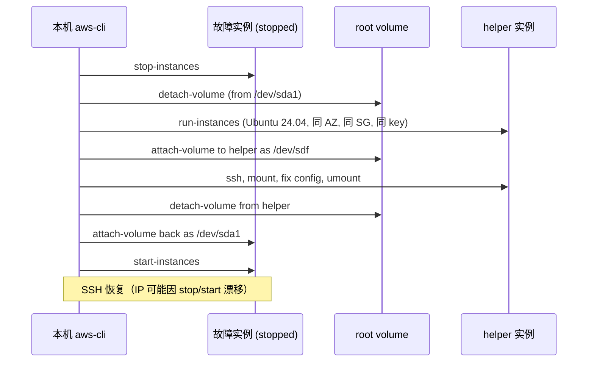
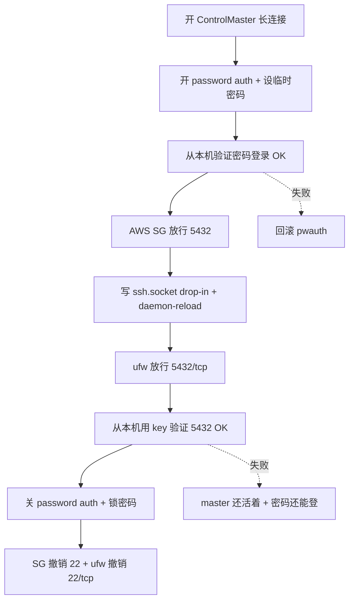
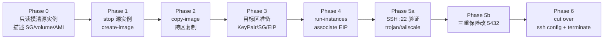

## TL;DR

把一台 us-east-1 的 VPS（跑着 trojan-go + Tailscale exit node）跨区迁移到 ap-southeast-1，顺便把 SSH 端口从 22 改到 5432。结果**三分钟内把自己的唯一 SSH 通道改没了**，靠 EBS detach-attach 到一台临时 helper 实例才救回来。完整复盘 + Ubuntu 24.04 socket activation 的正确姿势 + 之后做同类操作的"三重保险"清单。

关键坑点：

1. **Ubuntu 24.04 默认用 `ssh.socket` socket activation 管 SSH**，sshd_config 里的 `Port 22` 是 dead config，端口要改 `ssh.socket` 的 `ListenStream`
2. systemd drop-in 里 `ListenStream=...` 是**追加**到继承值，不会覆盖，想替换要先写一行空 `ListenStream=` 重置
3. **混用 `ssh.socket` + `ssh.service` 两种模式**会冲突绑 22 → socket 启动失败 → sshd 彻底没了
4. **EC2 Instance Connect 救不了 sshd 死的场景**（它只是往 `authorized_keys` 写临时 key，sshd 本身得活）
5. **Serial Console 对 Ubuntu EC2 默认无密码账户也救不了**（console 给你 login 提示但你没密码）
6. 主机上装了 **ufw** 时，SG 和 ufw 是两层防火墙，**两层都得放行**

---

## 起因：一个看起来很普通的需求

目标：

- 源实例：`t3.micro` / 8GB / us-east-1d / Ubuntu 24.04 / 跑着 trojan-go :443 + tailscaled + nginx fallback
- 要做：做一个 AMI 快照跨区 copy 到 ap-southeast-1，起一台同规格实例，分配 EIP，关停源实例
- 顺手：把 SSH 从 22 改成一个**非默认、且假装成别的服务的端口**（比如 `5432` 伪装 PostgreSQL，或 `3306` 伪装 MySQL），降低端口扫描噪音、让 masscan/zmap 扫到时优先把你当数据库而非 SSH 蜜罐。本文后续用 `5432` 做示例，你自己真正用的时候随便挑一个上万开外的冷门端口即可
- 约束：Trojan 用的是**自签证书 SNI 伪装**（CN=cloudfront.net），所以**没有 DNS 要改**；Tailscale IP 会自动随实例漂移

听上去是半小时的活。实际因为一行 drop-in 配置，变成了一小时的事故 + 半小时迁移。

---

## 事故：一条命令让 SSH 消失

按惯性思维，我打算在**源实例上**把 sshd 配成双端口监听（22 + 5432），验证 5432 可用后再做 AMI，新实例一起继承新配置。

```bash
# 源实例，Ubuntu 24.04
echo 'Port 5432' | sudo tee -a /etc/ssh/sshd_config.d/hardening.conf
sudo sshd -t                             # 配置语法 OK
sudo systemctl stop ssh.socket 2>/dev/null
sudo systemctl restart ssh
sudo ss -tlnp | grep sshd
```

输出：

```
LISTEN 0      4096   0.0.0.0:22      sshd
LISTEN 0      4096   [::]:22         sshd
```

**只有 22，没有 5432。** 

我以为是 sshd_config 读取问题，尝试加 socket 级别的 drop-in：

```bash
sudo mkdir -p /etc/systemd/system/ssh.socket.d
sudo tee /etc/systemd/system/ssh.socket.d/port-5432.conf <<EOF
[Socket]
ListenStream=0.0.0.0:5432
ListenStream=[::]:5432
EOF
sudo systemctl daemon-reload
sudo systemctl restart ssh.socket       # ← 这一行干掉了一切
```

返回：

```
Job for ssh.socket failed. See "journalctl -xe" for details.
```

再 `ssh vps`：

```
ssh: connect to host 203.0.113.42 port 22: Connection refused
```

从外部探测：

```bash
$ nc -zv 203.0.113.42 22
ec2-203-0-113-42.compute-1.amazonaws.com [203.0.113.42] 22 (ssh): Connection refused

$ nc -zv 203.0.113.42 5432
ec2-203-0-113-42.compute-1.amazonaws.com [203.0.113.42] 5432: Operation timed out

$ nc -zv 203.0.113.42 443
ec2-203-0-113-42.compute-1.amazonaws.com [203.0.113.42] 443 (https) open
```

443 通 → 主机还活着，trojan 进程也在；22 拒绝 → 没有服务监听；5432 超时 → SG 放过但无监听（也可能此刻 SG 未同步）。**SSH 全面自闭**。

### 根因

事后查 journalctl 可以看到是两次错误叠加：

1. 我先干了 `systemctl stop ssh.socket; systemctl restart ssh` —— 这让 **ssh.service 以 standalone daemon 模式占住了 22**（不再走 socket activation）
2. 然后又 `restart ssh.socket`，socket 想绑 `0.0.0.0:22` + `:5432`，**22 已被 daemon 模式的 ssh.service 占用，bind 失败**
3. socket 启动失败级联导致 ssh.service 也挂（被 socket `RequiredBy=` 关系拖死）
4. 最终谁都没活

第二个问题是：即便 socket 启动成功了，它的 `ListenStream=` 在 drop-in 里是**追加语义**，我的配置会让它听 22 **再加上** 5432 —— 但我本来想让它 22 消失只听 5432。后面真正改的时候还会踩到这个。

---

## 救援通道评估：哪些靠得住

SSH 挂了以后能想到的 AWS 侧救援方式：

| 通道 | 结果 |
|---|---|
| **重启实例** | ❌ socket drop-in 是持久化的，重启后 ssh.socket 仍旧 bind 失败 |
| **EC2 Instance Connect (EIC)** | ❌ EIC 是往 `~ubuntu/.ssh/authorized_keys` 写临时公钥，**需要 sshd 活着**，我这场景没用 |
| **EC2 Serial Console** | ❌ 账户级默认关闭；开了以后 Ubuntu EC2 AMI 默认**没给 ubuntu 用户设密码**，console 的 login 提示过不去 |
| **SSM Session Manager** | ❌ 需要 IAM instance profile + ssm-agent 在线。我 attach 了 role，但 agent 5 分钟没注册（老 AMI 可能没预装或需要 reboot 拿新凭证） |
| **Detach root volume + mount 到 helper** | ✅ **最终生效的救援路径** |

结论：**以上 4 条"软救援"如果你不是事先就铺好的，临时开都来不及 / 用不上。** 真正兜底的是**动手术——挂到另一台机器上改配置**。

---

## Detach-Volume 救援步骤

整个过程 15-20 分钟。前提：源实例可以 stop（也就是说它的 root volume `DeleteOnTermination=true` 没事，但**不能 terminate** 源实例，否则 root volume 也没了）。



### 1. Stop + Detach

```bash
aws ec2 stop-instances --region us-east-1 --instance-ids $SRC_ID
aws ec2 wait instance-stopped --region us-east-1 --instance-ids $SRC_ID

aws ec2 detach-volume --region us-east-1 --volume-id $SRC_VOL
# 等到 state=available
```

### 2. 启动 Helper（同 AZ！）

卷只能 attach 到**同可用区**的实例。先找最新 Ubuntu 24.04 AMI：

```bash
UBUNTU_AMI=$(aws ec2 describe-images --region us-east-1 \
  --owners 099720109477 \
  --filters 'Name=name,Values=ubuntu/images/hvm-ssd-gp3/ubuntu-noble-24.04-amd64-server-*' \
           'Name=state,Values=available' \
  --query 'sort_by(Images,&CreationDate)[-1].ImageId' --output text)

aws ec2 run-instances --region us-east-1 \
  --image-id $UBUNTU_AMI \                  # latest Ubuntu 24.04 in region
  --instance-type t3.micro \                # 注意账户 free-tier 限制可能禁 nano
  --key-name vps \                          # 复用现成 key
  --security-group-ids $SRC_SG \            # 复用现成 SG (22 已开)
  --subnet-id $SRC_SUBNET \                 # 关键：同 AZ 的 subnet
  --associate-public-ip-address \
  --tag-specifications 'ResourceType=instance,Tags=[{Key=Name,Value=rescue-helper-temp}]'
```

### 3. Attach 故障卷到 Helper

```bash
aws ec2 attach-volume --region us-east-1 \
  --volume-id $SRC_VOL \
  --instance-id $HELPER_ID \
  --device /dev/sdf
```

实际在 Nitro 系统里显示成 `/dev/nvme1n1`，根分区是 `/dev/nvme1n1p1`。

### 4. SSH 到 Helper 修配置

```bash
ssh -i ~/.ssh/vps.pem ubuntu@$HELPER_IP
```

```bash
sudo mkdir -p /mnt/rescue
sudo mount /dev/nvme1n1p1 /mnt/rescue

# 看一眼确认没错
ls /mnt/rescue    # 应该看到 etc/, home/, var/ 等

# 删掉搞砸的 drop-in
sudo rm -rf /mnt/rescue/etc/systemd/system/ssh.socket.d

# 同时把之前写进 sshd_config.d 的 Port 5432 也回退（没用的垃圾行）
sudo sed -i '/^Port 5432$/d' /mnt/rescue/etc/ssh/sshd_config.d/hardening.conf

sudo umount /mnt/rescue
```

### 5. Detach + 回挂源实例 + 启动

```bash
aws ec2 detach-volume --region us-east-1 --volume-id $SRC_VOL
# 等 available

aws ec2 attach-volume --region us-east-1 \
  --volume-id $SRC_VOL \
  --instance-id $SRC_ID \
  --device /dev/sda1                        # 关键：必须是 /dev/sda1 才能当 root 启动

aws ec2 start-instances --region us-east-1 --instance-ids $SRC_ID
aws ec2 wait instance-running --region us-east-1 --instance-ids $SRC_ID
```

**坑**：stop/start 后**公网 IP 会漂移**（如果没绑 EIP），`~/.ssh/config` 要更新。我的从 `203.0.113.42` 变成了 `203.0.113.88`。

### 6. Terminate Helper + 清理

```bash
aws ec2 terminate-instances --region us-east-1 --instance-ids $HELPER_ID
# helper 的 root volume DeleteOnTermination=true，自动删
```

费用总计 <$0.01（helper 跑了不到 10 分钟的 t3.micro）。

---

## 事故学到的两条铁律（写进长期 memory）

### 铁律 1：动 sshd / ssh.socket / 防火墙前，必须先留至少一条独立的 fallback 通道

fallback 可以是：

- **另一条 SSH 会话**：用 `ssh -M -S /tmp/sock -fN host` 开个 ControlMaster，保持 TCP 存活
- **密码认证**：临时打开 `PasswordAuthentication yes` + 给用户设密码，验证可登后再改端口
- **带外通道**：如果事先启用 Serial Console 并给 OS 用户设了密码（极少数人做了）

这三条**同时有**最安全，至少要有一条**事先验证过能用**。

### 铁律 2：Ubuntu 24.04 socket activation 的正确改法

`/usr/lib/systemd/system/ssh.socket` 里定义了：

```
[Socket]
ListenStream=0.0.0.0:22
ListenStream=[::]:22
BindIPv6Only=ipv6-only
Accept=no
```

这意味着：

- **sshd 的端口由 `ssh.socket` 决定**，`sshd_config` 里的 `Port` 指令是 dead config
- drop-in 里新增 `ListenStream=xxx` 是**追加**到已有列表
- 想"替换"而不是"追加"，要先写一行空 `ListenStream=` **重置**继承值

正确的 drop-in：

```bash
sudo mkdir -p /etc/systemd/system/ssh.socket.d
sudo tee /etc/systemd/system/ssh.socket.d/port-5432.conf <<'CONF'
[Socket]
ListenStream=
ListenStream=0.0.0.0:5432
ListenStream=[::]:5432
CONF

sudo systemctl daemon-reload
sudo systemctl restart ssh.socket       # 只 restart socket，不要碰 ssh.service
```

重点：

1. **只动 ssh.socket，不要手工 `systemctl restart ssh`** — 避免 daemon / socket 模式冲突
2. 空 `ListenStream=` 放在第一行，重置继承
3. 改完立即 `ss -tlnp | grep sshd` 验证

---

## 正确的 SSH 22→5432 流程（三重保险版）

事故之后，再去新实例上改端口时我走了个严格的流程。核心是**把改动所在机器当成一次性可重建的**，并且**任何一步失败都有回路**。



### 实操

```bash
# ① ControlMaster (保持 TCP 存活，新端口切换后这条连接不受影响)
ssh -M -S /tmp/ssh-vps-new -fN \
  -i ~/.ssh/vps.pem -o ControlPersist=yes \
  ubuntu@$NEW_IP

# ② 密码兜底 — 注意 60-cloudimg-settings.conf 优先级较低，我用 99- 前缀确保覆盖
PASS=$(openssl rand -base64 24 | tr -d '/+=' | cut -c1-20)
ssh -S /tmp/ssh-vps-new ubuntu@$NEW_IP "
  echo 'ubuntu:$PASS' | sudo chpasswd
  echo 'PasswordAuthentication yes' | sudo tee /etc/ssh/sshd_config.d/99-temp-pwauth.conf
  sudo systemctl reload ssh
"

# ③ 从本机实测密码登录（用 expect 非交互验证）
expect -c "
  set timeout 10
  spawn ssh -o PubkeyAuthentication=no -o PreferredAuthentications=password ubuntu@$NEW_IP whoami
  expect \"password:\" { send \"$PASS\r\" }
  expect \"ubuntu\" { puts \"PASSWORD_AUTH_OK\"; exit 0 }
"

# ④ SG 放 5432
aws ec2 authorize-security-group-ingress --region $REGION \
  --group-id $SG --protocol tcp --port 5432 --cidr 0.0.0.0/0

# ⑤ ssh.socket drop-in（注意空 ListenStream= 重置）
ssh -S /tmp/ssh-vps-new ubuntu@$NEW_IP "
  sudo mkdir -p /etc/systemd/system/ssh.socket.d
  sudo tee /etc/systemd/system/ssh.socket.d/port-5432.conf > /dev/null <<'CONF'
[Socket]
ListenStream=
ListenStream=0.0.0.0:5432
ListenStream=[::]:5432
CONF
  sudo systemctl daemon-reload
  sudo systemctl restart ssh.socket
  sudo ss -tlnp | grep sshd           # 应该只看到 5432
"

# ⑥ ufw 放 5432（很容易忘，是第二个 timeout 的根源）
ssh -S /tmp/ssh-vps-new ubuntu@$NEW_IP "sudo ufw allow 5432/tcp comment 'ssh hardened'"

# ⑦ 本机 key+5432 实测
ssh -p 5432 -i ~/.ssh/vps.pem ubuntu@$NEW_IP 'hostname; sudo ss -tlnp | grep sshd'

# ⑧ 收紧：关 password auth + 锁密码 + 撤 22
ssh -p 5432 -i ~/.ssh/vps.pem ubuntu@$NEW_IP "
  sudo rm /etc/ssh/sshd_config.d/99-temp-pwauth.conf
  sudo sed -i 's/^PasswordAuthentication yes/PasswordAuthentication no/' \
    /etc/ssh/sshd_config.d/60-cloudimg-settings.conf
  sudo passwd -l ubuntu
  sudo systemctl reload ssh
  sudo ufw delete allow 22/tcp
"
aws ec2 revoke-security-group-ingress --region $REGION \
  --group-id $SG --protocol tcp --port 22 --cidr 0.0.0.0/0
```

### 第二次 timeout：ufw 隐形

Drop-in 应用后本机 `ssh -p 5432` 仍然 timeout。tcpdump 发现：

```
07:40:14.693456 In  IP client.49626 > host.5432: Flags [S]
# ...然后没了
```

SYN 进来但没回应 —— SG 放行、sshd 在听，谁挡的？**ufw**。

```bash
$ sudo ufw status verbose
To                         Action      From
22/tcp                     ALLOW IN    Anywhere
443/tcp                    ALLOW IN    Anywhere
# 5432 根本不在列表
```

**教训**：装了 ufw 的机器，SG 和 ufw 是**两层防火墙，且规则独立**。每次放新端口要同时改两处；每次堵端口也要同时收两处。

---

## 完整迁移流程（去掉事故的版本）

回过头看，如果第一步就选"不动源实例、在新实例上改 5432"，整个事故根本不会发生。最终走通的流程：



### 关键命令（us-east-1 → ap-southeast-1）

```bash
# Phase 1：源端 stop + 创建 AMI
aws ec2 stop-instances --region us-east-1 --instance-ids $SRC
aws ec2 wait instance-stopped --region us-east-1 --instance-ids $SRC
SRC_AMI=$(aws ec2 create-image --region us-east-1 \
  --instance-id $SRC --name 'Migration-Snapshot' \
  --query 'ImageId' --output text)
aws ec2 wait image-available --region us-east-1 --image-ids $SRC_AMI

# Phase 2：跨区复制（8GB 盘大约 5-15 分钟）
DST_AMI=$(aws ec2 copy-image --region ap-southeast-1 \
  --source-region us-east-1 --source-image-id $SRC_AMI \
  --name 'Migration-Snapshot' --query 'ImageId' --output text)
aws ec2 wait image-available --region ap-southeast-1 --image-ids $DST_AMI

# Phase 3：目标区 KeyPair（同名复用 pem 提取的公钥，ssh 凭证无需变化）
ssh-keygen -y -f ~/.ssh/vps.pem > /tmp/vps.pub
aws ec2 import-key-pair --region ap-southeast-1 \
  --key-name vps --public-key-material fileb:///tmp/vps.pub

SG=$(aws ec2 create-security-group --region ap-southeast-1 \
  --group-name migrated-vps --description 'Migrated' \
  --vpc-id $DEFAULT_VPC --query 'GroupId' --output text)
# 先开 22（引导）+ 443（trojan），5432 在 Phase 5b 再加
aws ec2 authorize-security-group-ingress --region ap-southeast-1 --group-id $SG \
  --ip-permissions 'IpProtocol=tcp,FromPort=22,ToPort=22,IpRanges=[{CidrIp=0.0.0.0/0}]' \
                   'IpProtocol=tcp,FromPort=443,ToPort=443,IpRanges=[{CidrIp=0.0.0.0/0}]'

EIP=$(aws ec2 allocate-address --region ap-southeast-1 --domain vpc \
  --query 'AllocationId' --output text)

# Phase 4：启动 + 绑 EIP
NEW=$(aws ec2 run-instances --region ap-southeast-1 \
  --image-id $DST_AMI --instance-type t3.micro \
  --key-name vps --security-group-ids $SG \
  --subnet-id $SUBNET --associate-public-ip-address \
  --query 'Instances[0].InstanceId' --output text)
aws ec2 wait instance-running --region ap-southeast-1 --instance-ids $NEW
aws ec2 associate-address --region ap-southeast-1 \
  --instance-id $NEW --allocation-id $EIP
```

### Trojan 和 Tailscale 的跨区行为

| 服务 | 行为 |
|---|---|
| **trojan-go** | 证书是 `CN=cloudfront.net` **自签 SNI 伪装**，10 年有效期；客户端直连 IP，不走 DNS。迁移后只需客户端改 server IP |
| **tailscaled** | 节点身份在 `/var/lib/tailscale/tailscaled.state`，跟着 AMI 走。开机后自动重连，tailnet IP `100.x.x.x` 不变，ExitNode 配置保留 |
| **nginx fallback** | 本地 127.0.0.1 服务，不受影响 |

节点开机后跑一句 `sudo tailscale set --hostname=<your-node-name>` 就能把 hostname 从默认的 `ip-172-31-xx-xx` 改成稳定名字，其他 tailnet 里的设备后续看到它就是这个名字，不会被迁移后的私网 IP 变化困扰。

---

## 成本：降规格 ≠ 一定能降

原计划从 `t3.micro`（~$0.0116/hr, ap-southeast-1）降到 `t3.nano`（~$0.0058/hr），每月省约 $4。结果启动时：

```
InvalidParameterCombination: The specified instance type is not eligible for Free Tier.
```

这个账户被 **SCP / Free-Tier 强制策略**限死在 free-tier 白名单（t2.micro / t3.micro），nano 反而不在白名单。用户体验很反直觉，但账户管理员设的规则。最终还是 t3.micro，ap-southeast-1 比 us-east-1 贵 ~12%，每月 $9.5 vs $8.5。

**教训**：降规格前先跑一个 `run-instances --dry-run` 探底线。

---

## Security Review Checklist（新实例上线后务必过一遍）

```bash
# 1. 外部监听端口
sudo ss -tlnp | grep -v 127.0.0 | grep -v '::1]'

# 2. SG + ufw 双层确认
aws ec2 describe-security-groups --group-ids $SG --query 'SecurityGroups[0].IpPermissions'
sudo ufw status verbose

# 3. sshd 实效配置
sudo sshd -T | grep -iE '^(passwordauth|permitrootlogin|pubkeyauth|permitempty|kbd|gssapiauth|maxauth|logingrace)'

# 4. fail2ban
sudo fail2ban-client status

# 5. 自动安全更新
sudo cat /etc/apt/apt.conf.d/20auto-upgrades

# 6. authorized_keys 审计
ssh-keygen -lf /home/ubuntu/.ssh/authorized_keys

# 7. sudoers
sudo grep -rE '^[^#]' /etc/sudoers /etc/sudoers.d/

# 8. 世界可写文件
sudo find /etc -type f -perm -002
```

我这次的最终结果：

```
passwordauthentication no
permitrootlogin no
pubkeyauthentication yes
permitemptypasswords no
maxauthtries 3
logingracetime 120
```

+ ufw 只放 5432/tcp、443/tcp、48365/udp (tailscale-wg)
+ fail2ban active with sshd jail
+ unattended-upgrades active
+ 唯一 `authorized_keys` 匹配本机私钥指纹

---

## 用 Root Access Key 的人请立刻做的事

`aws sts get-caller-identity` 如果你看到：

```json
{ "Arn": "arn:aws:iam::xxxxxxxxxxxx:root" }
```

说明你 aws-cli 用的是 **root 账户的 access key**，这是 AWS 最严厉警告的反模式 —— root key 泄漏 = 整个账户失守 + 无法通过 IAM 策略限制。

正确做法：

1. AWS 控制台创建 IAM user（admin 权限 + MFA）
2. 给它生成新的 access key
3. `aws configure --profile personal` 配新 key
4. **Deactivate + Delete root access keys**
5. 开启账户级 MFA 强制，并在 CloudTrail 里开启 root 活动告警

---

## 给 "信用免费额度耗尽" 装一道物理开关：Budget Action 自动 stop EC2

很多人用的 AWS 账户带 $100 / $300 免费额度，180 天后过期。这段时间里最大的风险不是 credit 用完，而是**某天半夜流量爆了**（trojan 被当出口、tailscale 跑大带宽、或单纯 DDoS）——等你早上睁眼打开邮件，账单已经两位数美金了。

两种防线：

**① 告警：Budget 通知**（被动）
```bash
ACCT=$(aws sts get-caller-identity --query Account --output text)

# 删掉账户上所有旧 budgets，避免噪音
for B in $(aws budgets describe-budgets --account-id $ACCT --query 'Budgets[].BudgetName' --output text); do
  aws budgets delete-budget --account-id $ACCT --budget-name "$B"
done

cat > /tmp/budget.json <<'EOF'
{
  "BudgetName": "credit-5usd-left",
  "BudgetLimit": {"Amount": "95", "Unit": "USD"},
  "BudgetType": "COST",
  "TimeUnit": "ANNUALLY",
  "TimePeriod": {"Start": "2026-05-12T00:00:00Z", "End": "2026-11-30T23:59:59Z"},
  "CostTypes": {"IncludeCredit": false, "IncludeTax": true, "UseBlended": false}
}
EOF

cat > /tmp/notifs.json <<'EOF'
[{
  "Notification": {
    "NotificationType": "ACTUAL",
    "ComparisonOperator": "GREATER_THAN",
    "Threshold": 100.0,
    "ThresholdType": "PERCENTAGE"
  },
  "Subscribers": [{"SubscriptionType": "EMAIL", "Address": "you@example.com"}]
}]
EOF

aws budgets create-budget --account-id $ACCT \
  --budget file:///tmp/budget.json \
  --notifications-with-subscribers file:///tmp/notifs.json
```

关键：`IncludeCredit: false` —— 这样 budget 追踪的是"如果没有 credit 原本会被计费的金额"，到 $95 时意味着 credit 实际消耗了 $95，剩余 $5。如果开了 `IncludeCredit: true`，因为 credit 在 cover 费用，你永远看不到 actual spend 涨上来，等 credit 用完突然一下子爆。

**② 物理开关：Budget Action 自动 stop EC2**（主动）

Budget 通知只会给你发邮件。真正让你睡得着的是 **Budget Action** —— AWS 在阈值触发时**代你执行一个预设动作**：

```bash
# IAM role that AWS Budgets service will assume
cat > /tmp/trust.json <<'EOF'
{"Version":"2012-10-17","Statement":[{"Effect":"Allow",
  "Principal":{"Service":"budgets.amazonaws.com"},
  "Action":"sts:AssumeRole"}]}
EOF

cat > /tmp/perm.json <<'EOF'
{"Version":"2012-10-17","Statement":[{
  "Effect":"Allow",
  "Action":["ec2:StopInstances","ec2:DescribeInstances","ec2:DescribeInstanceStatus",
            "ssm:StartAutomationExecution","ssm:GetAutomationExecution"],
  "Resource":"*"
}]}
EOF

aws iam create-role --role-name BudgetsStopEC2Role \
  --assume-role-policy-document file:///tmp/trust.json
aws iam put-role-policy --role-name BudgetsStopEC2Role \
  --policy-name StopEC2 --policy-document file:///tmp/perm.json
sleep 10    # wait IAM propagation

cat > /tmp/action.json <<'EOF'
{
  "AccountId": "123456789012",
  "BudgetName": "credit-5usd-left",
  "NotificationType": "ACTUAL",
  "ActionType": "RUN_SSM_DOCUMENTS",
  "ActionThreshold": {"ActionThresholdValue": 100.0, "ActionThresholdType": "PERCENTAGE"},
  "Definition": {
    "SsmActionDefinition": {
      "ActionSubType": "STOP_EC2_INSTANCES",
      "Region": "ap-southeast-1",
      "InstanceIds": ["i-xxxxxxxxxxxxxxxxx"]
    }
  },
  "ExecutionRoleArn": "arn:aws:iam::123456789012:role/BudgetsStopEC2Role",
  "ApprovalModel": "AUTOMATIC",
  "Subscribers": [{"SubscriptionType":"EMAIL","Address":"you@example.com"}]
}
EOF

aws budgets create-budget-action --cli-input-json file:///tmp/action.json
```

注意：

- `ActionSubType: STOP_EC2_INSTANCES` 用的是 AWS 托管的 SSM Automation document（`AWS-StopEC2Instance`），**不需要 instance 上装 ssm-agent**，只是调用 EC2 API
- `ApprovalModel: AUTOMATIC` —— 不用人工点确认。如果你想要二次确认，改成 `MANUAL`，邮件里会给一个链接
- 阈值触发后 Action 状态从 `STANDBY` → `PENDING` → `EXECUTED`。Action 只会触发一次，之后要手动 reset
- 这个 Action 的副作用：实例 stop 后，trojan 和 tailscale 都下线。所以它是"最后一道物理开关"，不是日常 throttling 工具

### 为什么不是"摘信用卡"

我最开始的直觉是：既然 credit 用完会开始扣卡，那直接把卡摘了不就行了？**错**。AWS 的风控是：

1. 账单到期扣不到卡 → "past due" 状态
2. 催收邮件 30-60 天
3. 期间**服务不会立刻 stop**，费用继续累积
4. 最终 suspend + collection → 国际卡有上征信的风险

真正干净的做法是上面这个 Budget Action —— **让费用根本产生不出来**，而不是"产生了之后扣不到钱"。

---

## 事后清单（下次同类操作前过一遍）

- [ ] 确认源实例 IP 是否有业务依赖（DNS / 客户端配置 / 防火墙白名单）
- [ ] 源实例是否绑了 EIP（不绑的话 stop/start 会漂 IP）
- [ ] 账户是否有 free-tier / SCP 限制阻止目标实例规格
- [ ] 目标区默认 VPC 是否支持你要的 instance type
- [ ] KeyPair 不跨区 —— 先从本地 pem 提取公钥，`import-key-pair` 到目标区
- [ ] SG 规则和 ufw 规则**同时**修改
- [ ] 改端口 / 改 sshd 前，先开 ControlMaster + 临时密码认证两重 fallback
- [ ] 动 systemd socket unit 时，drop-in 的 list-type 字段是追加，不是替换
- [ ] Ubuntu 24.04+ 上 sshd 端口由 `ssh.socket` 决定，不是 `sshd_config`
- [ ] 跨区 AMI copy 是按快照大小收流量费（~$0.02/GB）
- [ ] AMI 本身免费但底下的 EBS snapshot 收费（$0.05/GB·月）
- [ ] 源实例 terminate 后 SG 和 KeyPair 变孤儿，要手动清
- [ ] 如果用的是 root access key，迁移后立即切换到 IAM user

---

## 延伸阅读

- [Tailscale VPS Exit Node 实战](/posts/tailscale-vps-exit-node-custom-port/) —— 同一台 VPS 的 Tailscale 侧配置
- [Tailscale 家庭多设备与 VPS 组网](/posts/tailscale-home-multidevice-vps-gpt/) —— 这套 exit node 的上游应用场景
- Ubuntu 官方 [SSH socket activation changelog](https://ubuntu.com/blog/openssh-editions-on-ubuntu) —— 24.04 切到 socket activation 的背景

---

> *一条 SSH 配置把自己踢出门，是每个接触云服务器超过三年的运维工程师迟早的必经仪式。愿你是有惊无险的那一次。*
