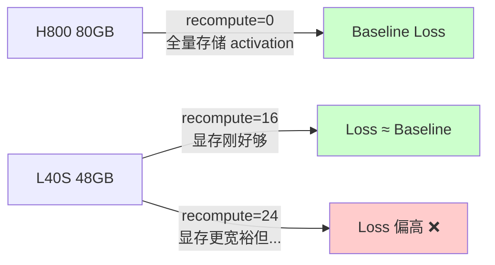
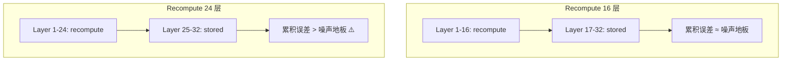
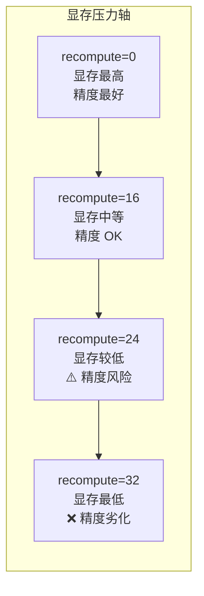

某 3B 模型的代码预训练实验，`recompute-num-layers` 从 16 改到 24，loss 明显偏高。教科书说 activation recomputation "对训练无影响，只是用计算换内存"——但在 BF16 精度下，这个假设在 24/32 层时不成立。

---

## 1. Activation Recomputation 的教科书描述

标准说法：前向传播时不保存中间层的 activation，反向传播时重新计算。代价是约 33% 额外 FLOPs（等价于多做一次前向），收益是显存从 O(N) 降到 O(√N) 或更低。

关键假设：**重新计算得到的 activation 与原始前向完全一致**，因此对梯度、loss、收敛行为零影响。

这个假设在 FP32 下基本成立。在 BF16 + Flash Attention + 非确定性 CUDA kernel 调度的组合下，它不成立。

---

## 2. 实验现象：24 层 vs 16 层 vs 0 层

实验配置：

| 参数 | 值 |
|------|-----|
| 模型 | 某 3B（H=2560, 32 layers） |
| 训练阶段 | Code pretraining（FD phase） |
| Sequence length | 16384 |
| Context parallelism | CP=2 |
| 框架 | Megatron，`--recompute-num-layers` 控制 |

三组对比：

| 配置 | recompute-num-layers | 硬件 | Loss 表现 |
|------|:---:|------|------|
| Baseline | 0 | 某 H800 集群（80GB） | 正常收敛 |
| Conservative | 16 | 某 L40S 集群（48GB） | 与 baseline 对齐 |
| Aggressive | 24 | 某 L40S 集群（48GB） | **loss 显著偏高** |

从 16 层改到 24 层，唯一的变化就是多 recompute 了 8 层的 activation。没有改 learning rate、没有改 batch size、没有改数据。但 loss 明显偏高，且下游评测指标同步劣化。

---

## 3. Hardware Portability 陷阱

这个问题的本质是一个 **跨硬件移植** 问题：



原始实验在 H800 上设计，80GB 显存足够存储 32 层全部 activation，不需要任何 recomputation。当需要迁移到 L40S（48GB）时，显存不够，**被迫**开启 recomputation。

直觉做法：尽量多 recompute，省更多显存，留出余量给更大 batch 或更长 sequence。所以直接设了 24 层。结果 loss 对不上。

---

## 4. Root Cause：为什么 Recomputed Activation 不是 Bit-identical

在 BF16 精度下，recomputed activation 与原始 activation 不一致的原因有三个：

### 4.1 CUDA Kernel 调度的非确定性

GPU 上的矩阵运算（GEMM）会根据当时的硬件状态选择不同的 tiling 策略和执行顺序。浮点加法不满足结合律：

```
(a + b) + c ≠ a + (b + c)   （在 BF16 下）
```

第一次前向和重新计算的前向，即使输入完全相同，kernel 内部的 reduction 顺序可能不同，导致输出有 ULP 级别的差异。

### 4.2 Flash Attention 的 Block 调度

Flash Attention 将 Q/K/V 切成 block 进行 tiled computation。Block 间的 online softmax 累积顺序取决于 GPU SM 的调度，这在两次执行间不保证一致。在 BF16 下，softmax 的累积误差会通过 attention output 传播到后续所有层。

### 4.3 误差的层间累积

单层的数值差异极小（~1 ULP），但误差会沿着 residual stream 累积：



- 16 层 recompute：累积的数值偏差在 gradient noise 的背景下可以忽略
- 24 层 recompute：累积偏差超过了 gradient noise 的量级，变成了一个系统性的 bias

这不是随机噪声——它是**每一步都向同一方向偏移**的系统误差，因为相同的 kernel 调度模式在相似输入下倾向于产生相似的偏差方向。

---

## 5. 寻找安全 Recomputation 边界

经验做法：逐步增加 `recompute-num-layers`，监控 loss 是否与 baseline 对齐。

本次实验的经验结论：

| 模块 | 安全 recompute 层数 | 总层数 | 比例 |
|------|:---:|:---:|:---:|
| LLM | 16 | 32 | 50% |
| ViT | 16 | 32 | 50% |

**50% 是经验 sweet spot**：在此比例下，累积误差仍在 gradient noise 以内；超过这个比例，误差开始对 loss 产生可观测的影响。

验证方法：
1. 在目标硬件上跑 2000-5000 步短实验
2. 与 H800 baseline（recompute=0）的 loss curve 对齐
3. 如果偏差超过 0.01-0.02 nats 且持续不收敛回来，说明 recompute 层数过多

---

## 6. Memory vs Precision Tradeoff 全景



这是一个**非线性**的 tradeoff：从 0 到 16 层几乎没有精度损失，但从 16 到 24 层出现了明显的跳变。原因是误差累积是超线性的——每多 recompute 一层，该层的误差不仅影响自身梯度，还会通过 residual connection 影响后续所有层的梯度计算。

---

## 7. Engineering Lessons

### Lesson 1: 硬件迁移必须重新验证 loss

永远不要假设 "H800 上能跑的配置，换到 L40S 只需要加 recompute 就行"。显存优化配置的变化可能引入精度问题，必须用短实验验证 loss 对齐。

### Lesson 2: BF16 下不存在 "等价重计算"

在 BF16 精度下，任何涉及重新执行浮点运算的操作都不能假设 bit-identical。这包括：
- Activation recomputation
- Deterministic vs non-deterministic mode
- 跨节点的 gradient all-reduce 顺序变化

### Lesson 3: 50% 层数是经验安全线

对于 32 层的模型，recompute 16 层是实测安全的上界。如果必须 recompute 更多层：
- 考虑 selective recomputation（只 recompute attention，保留 FFN activation）
- 考虑 mixed-precision recomputation（在 FP32 下做 recompute forward）
- 或者接受更大 batch、更少 sequence length 来换回显存

### Lesson 4: 配置应该跟着硬件走

最佳实践是为每种 GPU 型号维护一份独立的 training config：

```yaml
# H800 config
recompute-num-layers: 0
micro-batch-size: 4

# L40S config  
recompute-num-layers: 16
micro-batch-size: 2
```

不要试图用一份 config 适配所有硬件——显存差异会把你推到不安全的 recomputation 区间。

---

## 8. 总结

Activation recomputation 的 "计算换内存，对训练无影响" 是一个**在 BF16 精度下有条件的近似**，不是数学恒等式。条件是：recompute 的层数不能多到让累积数值误差超过 gradient noise floor。

对于 32 层的 3B 模型，这个边界大约在 16 层（50%）。超过这个边界，loss 劣化是可观测的、可复现的、且不会随训练步数自行恢复。

---

## References

1. Chen, T. et al. "Training Deep Nets with Sublinear Memory Cost." [arXiv:1604.06174](https://arxiv.org/abs/1604.06174), 2016.
2. Korthikanti, V. et al. "Reducing Activation Recomputation in Large Transformer Models." MLSys 2023.
3. Dao, T. et al. "FlashAttention: Fast and Memory-Efficient Exact Attention with IO-Awareness." NeurIPS 2022.
4. Megatron-LM documentation: `--recompute-num-layers`, `--recompute-method` flags.
5. NVIDIA. "Training with Mixed Precision." Developer Documentation.
