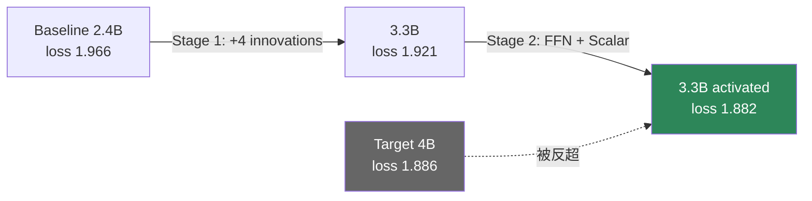
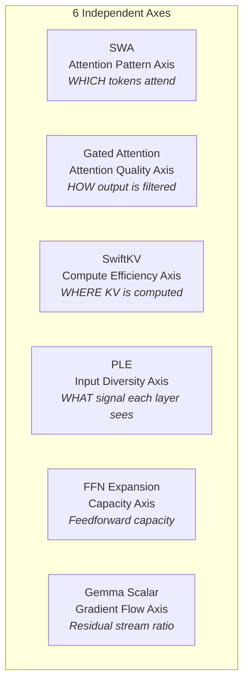

某 3B 模型和某开源 4B 模型的 loss 差了 0.08。纯粹加参数只能追回一半。最终靠 5 个正交创新逐步叠加——SWA、Gated Attention、SwiftKV、PLE、FFN 扩展——loss 从 1.966 直降到 1.882，反超目标。SFT 评测 0.65 完全追平。

这篇文章记录整个集成过程：每一步的独立验证、合并后的实际增益、以及为什么这些技术能无损叠加。

## 起点与目标

- **Baseline**: 某 3B 模型 (2.4B params)，600B tokens 后 loss = 1.966
- **Target**: 某开源 4B 模型，loss = 1.886
- **Gap**: 0.080 loss points，仅允许增加 ~0.9B 参数

纯粹按 Chinchilla scaling law 从 2.4B 扩到 4B，预期收益约 -0.04 loss——只能追回一半差距。剩下的 0.04 必须靠架构创新。

## Stage 1: 四项创新合并 (→3.3B, loss 1.921)

每项技术先在相同 baseline 上独立验证，确认正向收益后再合并：

| Innovation | 独立 delta | 作用机制 |
|:---|:---|:---|
| SWA (Sliding Window Attention, w=512) | -0.013 | 局部注意力降低稀疏 token 噪声 |
| Gated Attention (Elementwise) | -0.006 (在 SWA 基础上) | 门控过滤低质量 attention output |
| SwiftKV (16 layers predicted) | -0.009 | KV 预测减少冗余计算 |
| PLE (Per-Layer Embedding, dP=256) | -0.023 | 每层注入独立 token embedding 信号 |
| NoPE (SWA layers 不加位置编码) | ~0 loss change | 改善 long-context 外推 |

**合并结果**：loss = 1.921（baseline 调整为 1.970，600B tokens 对齐）

- 相对 baseline delta: **-0.049**
- 距目标 (1.890 对齐后): 仅剩 0.031

### SFT 评测验证

| Model | SFT average (7 tasks) |
|:---|:---|
| 某 3B 模型 (2.4B) | 0.59 |
| + Stage 1 (3.3B) | 0.64 |
| 某开源 4B 模型 | 0.65 |

Gap 从 0.06 缩小到 0.01——四项创新把大部分差距抹平了。

## Stage 2: FFN 扩展 + Gemma Scalar (loss 1.882)

Stage 1 之后还差 0.031，继续在容量和梯度流两个轴上加码：

- **FFN Expansion**: 后 16 层 intermediate dim 从 6912 扩展到 12032（+5120），前面层不动。总 activated params 仍为 3.3B 量级
- **Gemma Layer Scalar**: 每层 residual output 乘以一个 learnable scalar，优化梯度流经深层网络时的信号衰减

**结果**: loss = **1.882**，反超目标的 1.886。

SFT 评测达到 **0.65**——与某开源 4B 模型完全持平。

## 为什么这些创新是正交的

六项技术各自操作在独立的维度上，互不干扰：

正交性的直接证据：合并后的总 delta (-0.084) 接近各项独立 delta 之和，没有出现严重的次可加效应或破坏性干扰。

## 集成方法论：先验证，后合并

整个过程遵循严格的验证-合并协议：

**Step 1 — 独立验证**: 每项创新在完全相同的 baseline 上跑相同 token budget，确认 loss delta 为负。

**Step 2 — 逐步合并**: 按信号强度排序加入（PLE 最先因为 delta 最大），每加一项重新跑 validation。

**Step 3 — 检查干扰**: 部分组合存在次可加效应——SWA + Gated Attention 联合 delta 为 -0.019，略小于独立之和 (-0.013 + -0.006 = -0.019)。这是预期内的：两者都作用于 attention 路径，有轻微重叠。关键是没有任何组合出现正干扰（loss 变差）。

**Step 4 — SFT 端验证**: Pretrain loss 改善不等于下游任务改善。每个 stage 都跑完整 SFT pipeline 确认收益传导。

## 效率对比：创新 vs 纯 Scaling

| 策略 | 参数增量 | Loss delta | 额外推理开销 |
|:---|:---|:---|:---|
| 纯 scaling 2.4B→4B | +1.6B | ~-0.04 | +67% compute |
| 5 innovations (本方案) | +0.9B | -0.084 | SwiftKV 省 50% KV cache; PLE 零开销; SWA 省 long-context |

创新方案用更少参数获得 **2 倍以上的 loss 收益**，且推理效率反而更好：

- SwiftKV 将 16 层的 KV computation 替换为预测，KV cache 减半
- PLE 的 per-layer embedding lookup 是 O(vocab) 操作，推理时几乎无开销
- SWA 层只需维护固定窗口的 KV cache，大幅降低 long-context 内存

## 工程启示

**1. 正交性是可组合性的前提**。如果两项创新作用于同一维度（例如都修改 attention pattern），合并收益很可能次可加甚至互相抵消。选择创新方向时，先画出"作用轴"，确保不重叠。

**2. 独立验证的成本是值得的**。5 项创新 × 独立跑一次 = 5 次额外实验。但如果直接合并后发现收益不及预期，debug 哪项出了问题的成本远高于 5 次预验证。

**3. Sub-additive 不等于 negative**。SWA + Gated Attention 的联合收益略小于独立之和，这不是问题——只要不出现破坏性干扰，次可加效应是正交轴有轻微重叠的正常表现。

**4. SFT 是最终裁判**。Pretrain loss delta 只是代理指标。Stage 1 的 -0.049 loss 改善在 SFT 上转化为 +0.05 average score，接近线性映射；但这不是永远成立的——必须每阶段验证传导效率。

**5. "小模型追大模型"的路径不是 scaling，是在固定 param budget 内最大化每个参数的利用率**。PLE 让每层看到不同视角、FFN 扩展让深层有更多容量、SwiftKV 把节省的 compute 重新分配——本质是参数效率的极限压榨。

## References

1. Gemma 2 Technical Report — Layer Scalar 设计
2. Mistral 7B — Sliding Window Attention 原始提出
3. Chinchilla Scaling Laws (Hoffmann et al., 2022)
4. SwiftKV: Fast Prefill-Optimized Inference with Knowledge-Preserving Model Transformation ([arXiv:2410.03960](https://arxiv.org/abs/2410.03960))
5. Per-Layer Embedding — 内部技术报告
6. Gated Linear Attention — 门控注意力机制系列工作
