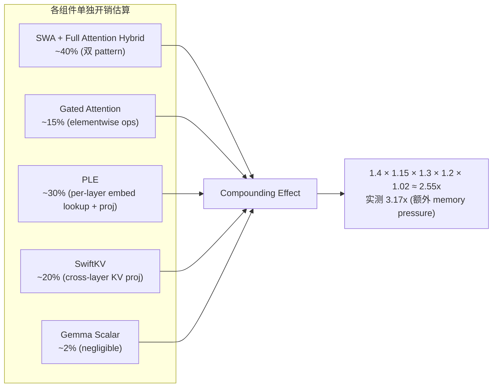

某 0.6B 验证模型做了新老架构对比：新架构 34/35 验证集更好，ceval +2.67, hellaswag +2.65, humaneval +1.59。但 iter-time 从 12.09s 涨到 38.32s——慢了 3.17 倍。同样的 GPU 时间，老架构能多训 3 倍 token。这是一个典型的"更好但更贵"的工程决策。

## 实验设定

用 0.6B 参数量做 proxy experiment，验证新架构（集成 SWA + Gated Attention + SwiftKV + PLE + NoPE + Gemma Scalar）相对老架构的收益。两个模型共享相同的超参数：

- 32 layers, hidden=1024, FFN=4096, GQA (8 heads, 4 groups)
- 相同数据配比和 LR schedule (4e-4 → 4e-5 cosine decay)
- 相同硬件：H800
- 老架构训了 ~558B tokens，新架构训了 ~620B tokens

公平对比的前提是控制变量：除了架构本身，其余一切保持一致。

## 质量收益：34/35 验证集胜出

整体 loss：老架构 2.107，新架构 2.079，delta = -0.028。

35 个验证子集中，34 个在新架构上更好。唯一退步的是 `t_eval`（+0.05）。Top improvements：

| Subset | 老架构 | 新架构 | Delta |
|--------|--------|--------|-------|
| superclue_math6 | 2.676 | 2.541 | -0.135 |
| hungarian_finals_exam | 1.426 | 1.344 | -0.081 |
| bbhen | 0.950 | 0.881 | -0.069 |
| LogiQuest | 3.648 | 3.587 | -0.061 |
| pure_zh_math | 1.912 | 1.855 | -0.057 |
| pure_en_math | 1.761 | 1.719 | -0.042 |
| general_text_pure_all | 2.894 | 2.852 | -0.042 |
| pure_code | 1.286 | 1.253 | -0.034 |

数学和推理类子集改善最大（-0.06 ~ -0.14），代码和通用文本也有稳定收益。

下游 benchmark 同样验证了质量提升：

| Benchmark | 老架构 | 新架构 | Delta |
|-----------|--------|--------|-------|
| cmmlu_fewshot_fill | 15.23% | 19.15% | +3.92 |
| drop | 13.26% | 16.78% | +3.52 |
| ceval | 27.64% | 30.31% | +2.67 |
| hellaswag | 43.77% | 46.42% | +2.65 |
| triviaqa_fewshot | 9.45% | 11.89% | +2.44 |
| gsm8k_en | 2.27% | 4.25% | +1.98 |
| mmluen | 26.58% | 28.46% | +1.88 |
| arc_c | 33.79% | 35.50% | +1.71 |
| bbh | 26.53% | 28.23% | +1.70 |
| humaneval pass@1 | 2.80% | 4.39% | +1.59 |

少量退步项（c3 -2.33, gaokao -1.32, lambada -1.14）集中在中文阅读理解，可能和 NoPE 对长距离位置的处理有关。

结论明确：**新架构在质量上全面优于老架构。**

## 效率代价：3.17x iter-time

| Model | iter-time |
|-------|-----------|
| 老架构 | 12.09s |
| 新架构 | 38.32s |
| **Ratio** | **3.17x** |

相同硬件、相同 global batch size (8192)。新架构每个 iteration 慢 3.17 倍。

换算成 throughput：如果老架构一个月能训 558B tokens，新架构同样时间只能训 ~176B tokens (558 / 3.17)。

## 为什么组合创新会 compound overhead

每个单独的改进看起来开销不大：

关键 insight：overhead 不是加法而是乘法。

- **SWA + Full Attention Hybrid**：每一层需要两套 attention pattern（local window + global），memory bandwidth 翻倍
- **Gated Attention**：attention output 过 gate 需要额外 elementwise multiply + sigmoid，增加 kernel launch 次数
- **PLE (Per-Layer Embedding)**：每层一次 880M 参数量的 embedding lookup + projection，把 parameter 访问从集中式变成分布式
- **SwiftKV**：cross-layer KV sharing 引入 sequential dependency，前一层 KV 没算完后一层无法开始
- **Gemma Scalar**：几乎无开销（只是一个 learnable per-head scale）

理论乘积约 2.55x，实测 3.17x，差距来自 memory pressure 增大后 GPU 利用率下降和额外的 kernel launch overhead。

## 决策框架：Quality per FLOP

| Metric | 老架构 | 新架构 | 分析 |
|--------|--------|--------|------|
| Loss (quality) | 2.107 | 2.079 | -0.028 (新架构更好) |
| Throughput | 1x | 0.315x | 3.17x 更慢 |
| Quality per FLOP | baseline | -0.028 / 3.17x cost | ~3.5x worse efficiency |

直觉上"更好但效率低 3.5 倍"听起来不划算。但这里有一个关键反直觉：**不能用线性比例来判断**。

如果训练预算固定（假设 1 个月 8xH800）：
- 老架构训 ~558B tokens / 月
- 新架构训 ~176B tokens / 月
- 但在 176B tokens 处，老架构的 loss 约 2.25（从 learning curve 估算）
- 新架构在 176B tokens 的 loss 可能在 2.15 左右

也就是说，**在相同计算预算下，新架构仍然可能优于老架构**——因为 architectural efficiency 不等于 computational efficiency。更好的架构用更少 token 就能达到相同质量。

真正的问题是：你的预算够不够让新架构跑出它的优势？

## 团队的决定

最终决定：**用新架构做 3B scale pretraining。**

理由：

1. **规模效应放大收益**：0.6B 上 -0.028 loss，到 3B + 1.8T tokens 时 advantage 预期更大
2. **部署时回收成本**：SwiftKV 在 inference 时减少 KV cache 体积，serving 成本下降。训练多花的钱在 serving 阶段赚回来
3. **iter-time 可优化**：Block Attention Residual 的 case 已经证明 Triton kernel 能把 PyTorch 的 +90% 开销压缩到 +14%。SWA/Gated Attention 的 fused kernel 同样有优化空间

## 什么时候该接受更慢的训练

接受 iter-time 退化的条件：

1. **部署收益 > 训练损失**：如果模型要 serve 数十亿请求，inference 的节省远超训练的额外成本。SwiftKV 减少 KV cache 就属于这类
2. **预算允许充分训练**：如果总预算能让新架构训到收敛（600B+ tokens），那质量优势是确定的
3. **瓶颈可被 kernel 优化消除**：如果 profiling 显示 overhead 来自 naive PyTorch 实现而非算法本质，就值得投入 kernel 工程
4. **竞争压力要求质量上限**：某些场景下 +2.67 ceval 是 must-have，计算成本是可协商的

反过来，如果预算紧张、部署场景 KV cache 不是瓶颈、且 kernel 优化没有明确路径，就应该保守选择老架构。

## 工程教训

**小规模验证的价值**：用 0.6B 模型花 ~2 周跑出结论，避免了直接在 3B scale 上试错（那会浪费数月 GPU 时间）。这个 proxy experiment 的 ROI 极高。

**不要只看 loss，要看 iter-time 归一化后的 loss**：-0.028 loss 在论文里很漂亮，但除以 3.17x 训练成本后就没那么耀眼了。Quality per FLOP 才是真实的判断指标。

**组合架构创新必须做 profiling**：每个单独 feature 的 ablation 可能只显示 10-40% 的开销，但组合后可能超出预期。应该在叠加所有改进后测一次 end-to-end iter-time。

**保留优化路径**：做决策时不仅看当前 iter-time，还要评估"这个 overhead 有多少是可优化的"。如果 60% 的开销来自 memory pressure 而非计算量，kernel fusion 和 memory optimization 就有很大空间。

## References

- Sliding Window Attention: Beltagy et al., "Longformer: The Long-Document Transformer", [arXiv:2004.05150](https://arxiv.org/abs/2004.05150)
- Gated Attention: Hua et al., "Transformer Quality in Linear Time", ICML 2022
- SwiftKV: Reducing KV Cache for Efficient LLM Inference (internal)
- PLE: Per-Layer Embedding for parameter-efficient scaling (internal)
- NoPE: No Positional Encoding approach, Kazemnejad et al., [arXiv:2305.19466](https://arxiv.org/abs/2305.19466)
- Gemma Scalar: Gemma Team, "Gemma: Open Models Based on Gemini Research", [arXiv:2403.08295](https://arxiv.org/abs/2403.08295)
