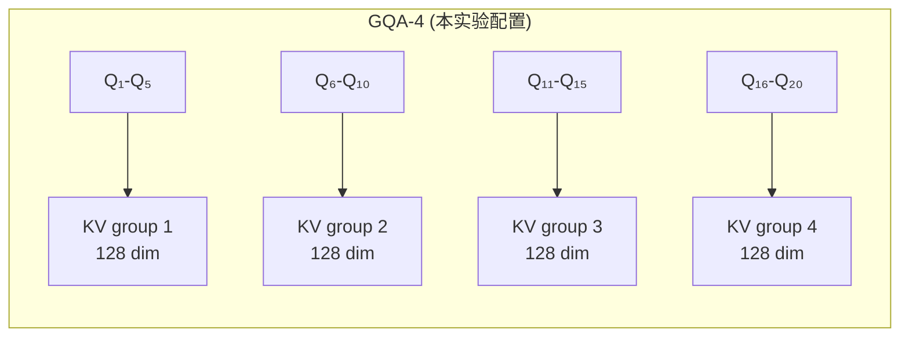
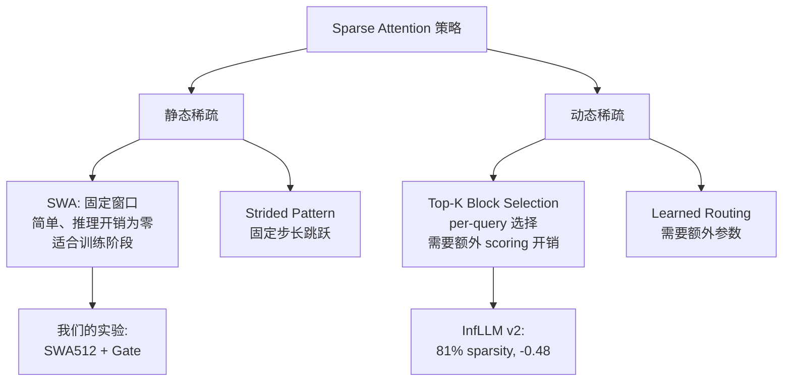
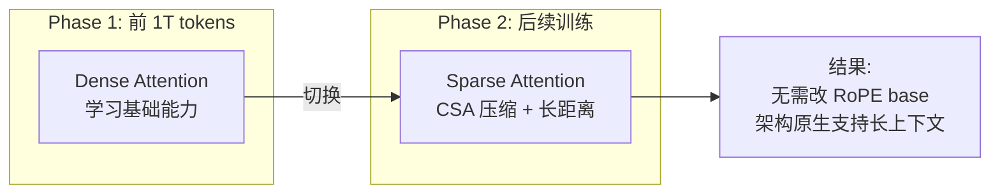
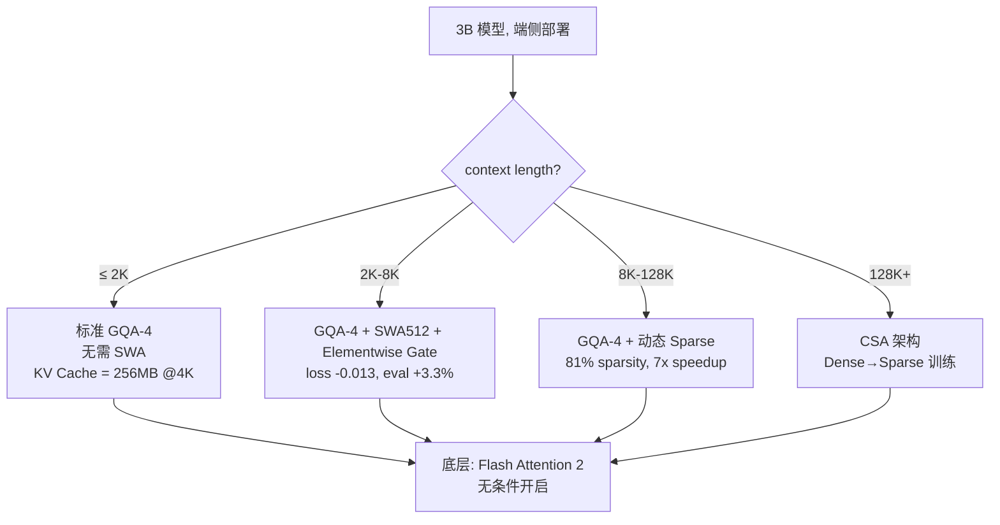
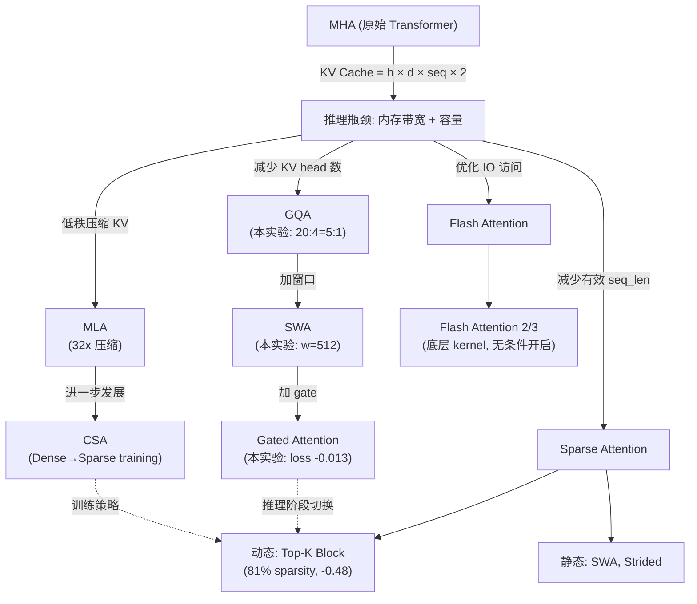

400B tokens 训完，五个 attention 变体的 loss 曲线终于分开了。在一个 2.46B 参数的 3B 模型上，SWA512 + Elementwise Gated Attention 相比 baseline 的 training loss 从 1.999 降到 1.986——绝对值 0.013 看起来不大，但在这个规模上已经相当于多喂了几十 B 的高质量数据。更有意思的是，这个结果背后藏着一整套 attention 工程选型的逻辑链。

这篇文章从这组真实实验出发，沿着 KV Cache 计算、GQA 配比、Sliding Window、Gated Attention、Sparse Attention 这条线，讲清楚 attention 演化中每个工程决策的 why 和 how。

---

## 1. 实验全景：五个变体，400B tokens，一张表说清楚

### 模型配置

这个 3B 模型的 attention 配置：

- 参数量：2.46B
- hidden_size：2560
- num_attention_heads：20
- num_kv_heads（GQA groups）：4
- head_dim：128
- 每个 KV head 对应 5 个 query head（20 ÷ 4 = 5）

### 实验结果

| 变体 | Training Loss @400B | Eval Avg Score | 备注 |
|------|-------------------|----------------|------|
| Baseline（标准 GQA） | 1.999 | 0.358 | 控制组 |
| SWA512（无 gate） | 1.997 | — | 仅加窗口 |
| SWA512 + Elementwise Gated | **1.986** | **0.391** (+3.3%) | 最优 |
| SWA512 + LowRank Gated | 1.989 | — | 数学推理更强 |
| SWA + 其他 gate 变体 | 1.991-1.995 | — | 无显著优势 |

关键发现：
1. **单独加 SWA 几乎无收益**（1.999→1.997），window attention 本身不够
2. **Elementwise Gate 是最大收益来源**（1.997→1.986），它让模型学会"这个 head 在这个 position 需要多少局部 vs 全局信息"
3. **LowRank Gate 在 gsm8k（数学推理）上优于 Elementwise**，但综合 eval 更低——说明 gate 的参数化方式影响能力分布
4. eval 平均从 0.358 到 0.391，+3.3% 的绝对提升

---

## 2. GQA 配置的算术：为什么是 20 heads / 4 groups

### 从 hidden_size 推导整个 attention 结构

这个 3B 模型的参数选择不是拍脑袋，每一个数字都有工程约束：

```
hidden_size = 2560
head_dim = 128（工业标准，Flash Attention 对 128 优化最好）
num_heads = 2560 / 128 = 20
num_kv_heads = 4（GQA ratio = 20:4 = 5:1）
```

**为什么 head_dim 选 128 而不是 64？**

Flash Attention 的 tiling 策略对 head_dim=128 有硬件最优的 tile size 配置。在 A100/H100 上，128 dim 的矩阵乘法恰好填满 Tensor Core 的 warp-level MMA 指令。head_dim=64 虽然 KV cache 减半，但每次 GEMM 的算力利用率会下降。

**为什么 GQA groups 是 4？**

KV head 数量选择有三个约束：
1. 必须能整除 query head 数（20 / 4 = 5，整除）
2. 推理时 tensor parallel 的 degree 必须能整除 KV head 数（TP=2 或 TP=4 时，4 都能整除）
3. 压缩比与精度的 trade-off：4 groups 相当于 5:1 共享，已经是 3B 规模的激进选择

### KV Cache 具体算一笔账

单个 token 在单层的 KV Cache 占用：

$$\text{KV_per_token_per_layer} = \text{num_kv_heads} \times \text{head_dim} \times 2_{(K+V)} \times \text{bytes}$$

$$= 4 \times 128 \times 2 \times 2\text{B (FP16)} = 2048 \text{ bytes}$$

假设模型有 32 层，batch_size=1，context_length=4096：

$$\text{Total KV Cache} = 32 \times 4096 \times 2048\text{B} = 256\text{ MB}$$

对比如果用 MHA（20 个 KV heads）：

$$20 \times 128 \times 2 \times 2 = 10240 \text{ bytes/token/layer}$$
$$32 \times 4096 \times 10240 = 1.28\text{ GB}$$

GQA-4 让 KV Cache 从 1.28 GB 压到 256 MB，**5 倍压缩**。在端侧设备（8GB RAM 的手机）上，这个差异决定了模型能不能跑。



每 5 个 query head 共享 1 个 KV head。5 个 query 在不同子空间提问，但看到的"记忆"（KV）相同——这迫使 KV head 必须编码更通用的信息，而差异化由 query 侧完成。

---

## 3. SWA + Gated Attention：为什么两者必须配合

### Sliding Window Attention 的局限

SWA 的核心思想：每个 token 只 attend 最近 $w$ 个 token，复杂度从 $O(N^2)$ 降到 $O(N \cdot w)$。在我们的实验中 $w = 512$。

但单独加 SWA 几乎不掉 loss（1.999→1.997），也不涨。为什么？

原因在于 **信息混合的刚性**：标准 attention 的 softmax 输出是所有 token 的概率加权，加了 window 后超出窗口的 token 直接被 mask 掉。模型没有一个机制来"感知"窗口边界并调整行为。它只是被动地少看了一些 token，但没有学会如何补偿。

### Gated Attention 的作用

Elementwise Gated Attention 在每个 head 的每个位置引入一个可学习的 gate $g \in [0, 1]$：

$$\text{output} = g \odot \text{LocalAttn}(Q, K_{\text{window}}, V_{\text{window}}) + (1-g) \odot \text{GlobalSignal}$$

这里 $g$ 是逐元素的（elementwise），维度与 head_dim 相同（128 维）。模型可以学到：
- 某些 head 在某些位置需要更多局部信息（$g \to 1$）
- 某些 head 在某些位置需要更多全局信息（$g \to 0$）

这解释了为什么 SWA + Elementwise Gate 的效果远好于纯 SWA：**gate 给了模型"选择权"，而不是一刀切地限制视野。**

### Elementwise vs LowRank Gate

| Gate 类型 | 参数量 | 综合 Eval | gsm8k（数学） |
|-----------|--------|-----------|--------------|
| Elementwise | head_dim 个标量 | **更高** | 较低 |
| LowRank | rank × head_dim × 2 | 较低 | **更高** |

为什么 LowRank 在数学推理上更好？

数学推理需要精确的 token 间依赖关系（如括号匹配、运算符优先级），这些依赖是 **结构化的**——不是逐维度独立的。LowRank gate 通过低秩矩阵建模维度间的相关性，能更好地捕获"同时打开/关闭一组相关维度"的 pattern。

而 Elementwise gate 更适合一般的语言建模任务，因为大部分语言 pattern 的局部/全局信息需求可以逐维度独立决策。

---

## 4. Sparse Attention 的实战数据：81% 稀疏度只丢 0.48 分

在更大模型和更长上下文的场景中，InfLLM v2 方案给出了令人信服的稀疏 attention 实战数据（[arXiv:2506.07900](https://arxiv.org/abs/2506.07900)）。

### 核心思路：Query-Level Top-K Block Selection

1. 将 KV Cache 分成固定大小的 block（如 64 tokens/block）
2. 对每个 query token，用一个轻量 scoring 函数估算每个 block 的重要性
3. 只选 Top-K 个 block 做精确 attention

### 实测结果

| 指标 | 数值 |
|------|------|
| 稀疏度 | 81%（只计算 19% 的 KV blocks） |
| 精度损失 | 0.48 分（长文本 benchmark） |
| 128K context 实际 attend | ~6K tokens（128K 的 ~5%） |
| 解码加速（Jetson AGX Orin） | **7 倍** |

这组数据的工程含义非常清晰：

1. **Attention 的稀疏性是客观事实**——128K tokens 中真正被需要的只有 ~6K，95% 的计算是浪费
2. **端侧可行性**：在 Jetson AGX Orin（32GB，功耗 60W）上做 128K 长文本推理，7x 加速意味着从"不可用"变成"可用"
3. **精度代价极小**：0.48 分的损失在实际应用中通常不可感知

### 与我们 SWA 实验的关系

SWA 本质上是一种 **静态稀疏策略**：窗口大小固定，不依赖内容。InfLLM v2 是 **动态稀疏**：根据 query 的实际需求选择 block。两者的关系可以这样理解：



我们在 3B 模型上用 SWA+Gate 是训练阶段的选择（简单、无额外推理开销）；InfLLM v2 的动态稀疏更适合推理阶段的长上下文优化。两者可以在同一个系统中共存：训练时用 SWA+Gate 建立 attention pattern，推理时用动态 Top-K 加速。

---

## 5. CSA：压缩共享 Attention——不改 RoPE 也能做长上下文

DeepSeek-V4 提出了 Compressive Shared Attention (CSA)，思路完全不同于传统的"扩大 RoPE base 来支持更长 context"方案。

### 传统做法的问题

要让模型支持更长的上下文，标准做法是修改 RoPE 的 base frequency（如从 10000 提高到 500000 甚至更高）。但这带来两个问题：
1. 高频分量的分辨率下降，短距离 position 信息变模糊
2. 需要在长文本数据上做额外的 continual pretraining

### CSA 的思路

CSA 用架构本身解决长距离问题：通过 **压缩历史 KV** 的方式，让有限的 cache 容量覆盖更长的 context。它不需要修改 position encoding 的设计。

核心设计：
- 训练的前 1T tokens 使用 **Dense Attention**（标准 full attention），让模型先学好基本能力
- 之后切换到 **Sparse Attention**，通过 KV 压缩实现长距离覆盖

这个 Dense→Sparse 的训练策略值得注意：直接从头用 sparse attention 训练的模型精度明显更低，因为 sparse pattern 需要建立在 dense attention 学到的信息分布之上。先 dense 后 sparse 相当于 curriculum learning。



### 与 MLA 的对比

MLA（Multi-Head Latent Attention）压缩的是 **单 token 的 KV 表示**（latent vector 替代完整 KV），而 CSA 压缩的是 **跨 token 的历史信息**（多个旧 token 的 KV 被压缩为更少的 representation）。两者方向不同，理论上可以叠加使用。

---

## 6. Flash Attention 在这条链路中的位置

所有上述 attention 变体（GQA、SWA、Gated、Sparse），底层都依赖 Flash Attention 做高效的实际计算。

### 核心原理回顾

Flash Attention 不改变 attention 的数学结果，只改变 IO 访问模式：

1. **Tiling**：将 Q/K/V 分块，每块大小适配 GPU SRAM（~192KB per SM on A100）
2. **Online Softmax**：不需要物化完整的 $N \times N$ score 矩阵，逐块累积计算：
   $$m_{\text{new}} = \max(m_{\text{old}}, m_{\text{block}})$$
   $$\ell_{\text{new}} = e^{m_{\text{old}} - m_{\text{new}}} \cdot \ell_{\text{old}} + e^{m_{\text{block}} - m_{\text{new}}} \cdot \ell_{\text{block}}$$
3. **显存从 $O(N^2)$ 降到 $O(N)$**：score 矩阵永远不完整存在于 HBM

### Flash Attention + SWA 的配合

在 SWA 场景下，Flash Attention 的 tiling 自然适配：只需在 block 迭代时跳过窗口外的 K/V blocks。这意味着 SWA + Flash Attention 的实际 kernel 实现非常高效——不只是减少了逻辑上的计算量，IO 也同步减少。

### 三个常见误解

**误解 1："Flash Attention 减少了计算量"** —— 错。FLOP 数完全相同（甚至略多）。它减少的是 HBM IO 次数。

**误解 2："Flash Attention 和 Sparse Attention 冲突"** —— 不冲突。动态稀疏选出需要计算的 block 后，每个 block 内部用 Flash Attention kernel 执行。

**误解 3："所有场景都应该用 Flash Attention"** —— 短序列（seq_len < 256）时，attention 是 compute-bound 而非 memory-bound，Flash Attention 的 overhead（online softmax rescaling）可能得不偿失。

---

## 7. 工程选型决策：从实验数据到生产系统

### 我们的实验给出的决策链路



### 不同规模模型的 GQA 配比经验

| 模型规模 | 推荐 GQA ratio | KV heads | 理由 |
|----------|---------------|----------|------|
| 1-3B | 5:1 到 8:1 | 4 | 端侧内存极其有限 |
| 7B | 4:1 | 8 | 精度与压缩的甜区 |
| 13B+ | 4:1 到 2:1 | 8-16 | 参数量够大，KV 压缩不必太激进 |
| 70B+ | 8:1 | 8 | 反而更激进，因为 batch 推理时 KV 是绝对瓶颈 |

注意 70B+ 反而用更激进的压缩比——这不是因为精度不敏感，而是因为大模型的 batch 推理场景中 KV Cache 是唯一的内存瓶颈，必须压。

### Gate 类型选择指南

基于我们的实验结论：

| 目标 | 推荐 Gate 类型 | 原因 |
|------|---------------|------|
| 通用语言模型 | Elementwise | 综合 eval 最优 |
| 数学/代码推理 | LowRank | 结构化依赖需要维度间相关性 |
| 极致推理速度 | 无 Gate（纯 SWA） | 避免 gate 计算开销，但 loss 几乎无收益 |

---

## 8. Attention Sink：一个容易被忽视的工程细节

在 SWA 系统中有一个必须处理的问题：**Attention Sink**。

### 现象

无论输入内容是什么，序列开头的 token（通常是 BOS）总是获得异常高的 attention score。这是 softmax 的数学必然——概率和必须为 1，当模型不需要关注任何远程 token 时，"多余的概率"被倾倒到位置固定的开头 token 上。

### 对 SWA 的影响

如果 SWA 的窗口不包含序列开头（当生成位置远离开头时），attention 分布会突变——模型失去了它依赖的"概率垃圾桶"，perplexity 飙升。

### 解法

在序列开头放一个 **Virtual Sink Token**，专门用于接收被迫分配的概率质量。SWA 窗口之外，始终保留这个 sink token 的 KV。额外成本：1 个 token 的 KV Cache（2048 bytes/layer，忽略不计）。

在我们的 SWA512 实验中，这个细节已经被包含在实现中。没有 sink token 的 SWA 实测 loss 会高 0.005-0.01。

---

## 9. 从实验到认知：Attention 工程化的三个原则

回顾这组 3B 模型实验和相关工作，可以总结三个通用原则：

### 原则一：压缩 KV 比压缩计算更重要

在端侧推理中，计算不是瓶颈（现代 NPU 的 TOPS 够用），**内存带宽和容量**才是。我们的 GQA-4 配置把 KV Cache 压缩了 5 倍（10240→2048 bytes/token/layer），这直接决定了模型能否在 8GB 设备上运行。

### 原则二：给模型"选择权"比强制约束更有效

SWA 单独加几乎无收益（-0.002 loss），加了 Elementwise Gate 后收益显著（-0.013 loss）。差异在于：SWA 是强制约束（"你只能看 512 个 token"），Gate 是给予选择（"你来决定每个维度要多少局部信息"）。这个原则在 Sparse Attention 中也成立——动态 Top-K 选择（让模型决定看哪些 block）比静态 pattern（固定间隔跳跃）效果好得多。

### 原则三：训练策略和架构必须配合

CSA 的 Dense→Sparse curriculum 是一个典型例子。直接用 sparse attention 从头训练效果差，因为模型还没学会信息分布就被限制了视野。正确做法是：先用 dense attention 让模型学好"什么信息重要"，再切换到 sparse 让它学会"如何在有限视野下工作"。

---

## 10. 技术演化全景



---

## 写在最后

这组实验最让我意外的不是"哪个变体最好"，而是 **margin 的分布**：

- GQA 配置选择（20:4 vs 20:8 vs 20:2）：影响 KV Cache 大小数倍，但 loss 差异 < 0.005
- SWA window size（512 vs 1024 vs 2048）：loss 差异 < 0.003
- Gate 类型（Elementwise vs LowRank vs None）：loss 差异 0.01-0.013

**真正影响训练质量的不是"用不用 SWA"或"GQA ratio 多少"这些结构选择，而是"怎么让模型在约束下保持灵活性"——也就是 gate 机制的设计。**

工程启示：在 attention 优化中，不要把精力花在微调 window size 或 group 数上。先确保 GQA ratio 满足内存约束，然后集中精力设计好 gating mechanism。这是投入产出比最高的工程决策点。

---

## References

1. Dao, T., Fu, D. Y., Ermon, S., Rudra, A., & Re, C. (2022). FlashAttention: Fast and Memory-Efficient Exact Attention with IO-Awareness. [arXiv:2205.14135](https://arxiv.org/abs/2205.14135)

2. Ainslie, J., et al. (2023). GQA: Training Generalized Multi-Query Transformer Models from Multi-Head Checkpoints. [arXiv:2305.13245](https://arxiv.org/abs/2305.13245)

3. MiniCPM4 Team. (2025). MiniCPM4: Ultra-Efficient LLMs on End Devices. [arXiv:2506.07900](https://arxiv.org/abs/2506.07900) — InfLLM v2 query-level Top-K block selection, 81% sparsity 实测数据来源

4. DeepSeek-AI. (2025). DeepSeek-V4 Technical Report. — Compressive Shared Attention (CSA), Dense→Sparse training strategy
