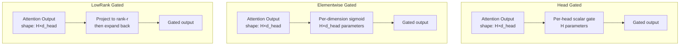
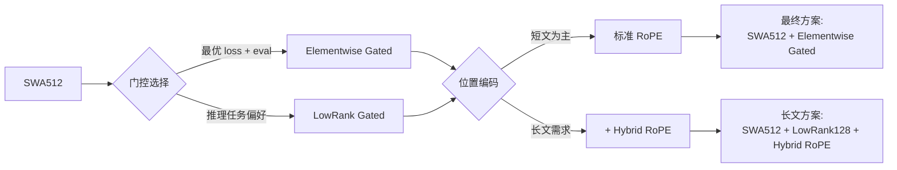
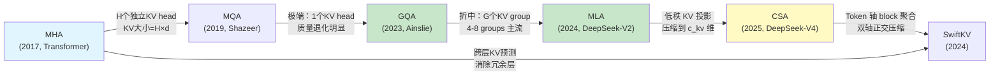
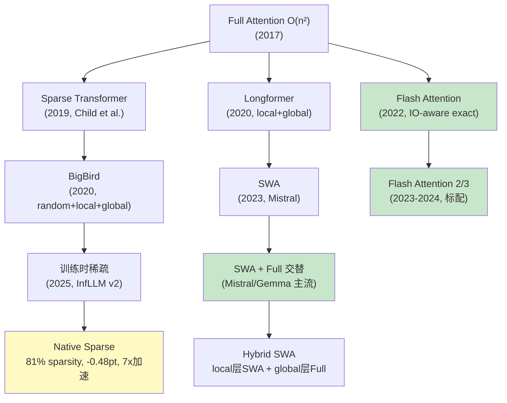
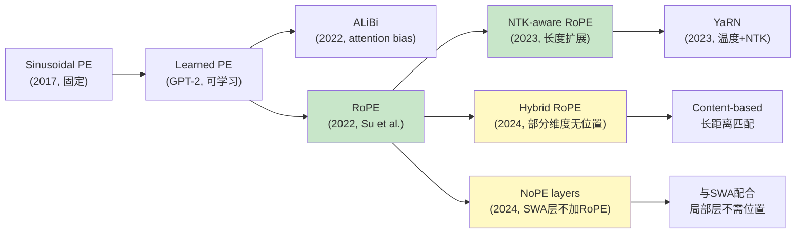
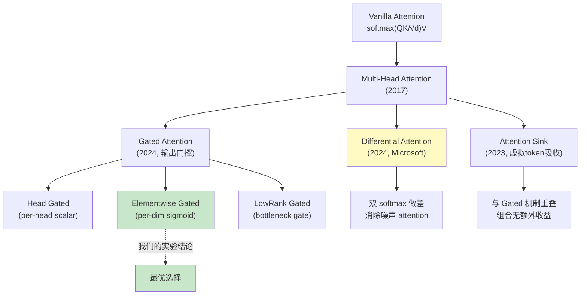
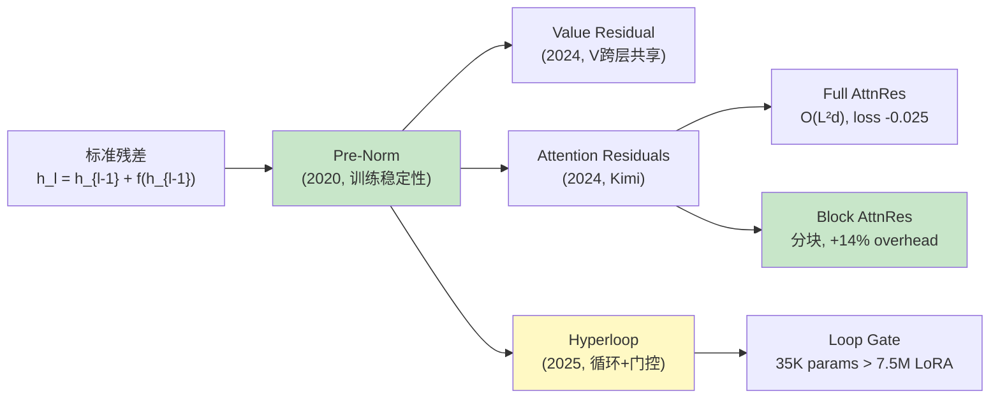
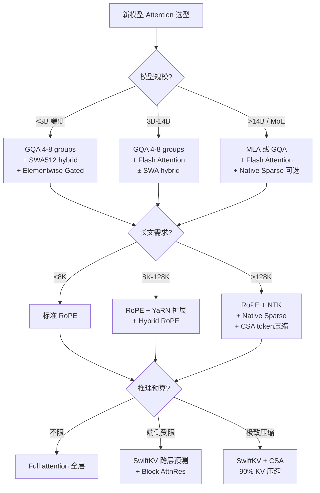

## 开场：一个 3B 模型的 Attention 选型决策

某 3B 端侧模型的架构选型阶段，团队在 Attention 机制上做了 5 轮排除实验。最终结论只有一句话——**SWA512 + Elementwise Gated Attention**——但排除过程中暴露的反直觉现象，几乎打翻了所有先验假设：

| 实验 | 预期 | 实际 |
|------|------|------|
| Sink Token + LowRank Gated | 应该强于单独 Sink | 仅 +0.001，机制重叠 |
| SWA128 vs SWA512 | 小窗口 loss 更高 | 小窗口 loss 更**低**但评测掉了 2.3% |
| SWA + Hybrid RoPE | 长文应该更好 | 短文 -0.002 但长文 **+0.004 反噬** |
| Head Gated vs Elementwise Gated | 参数更多应该更好 | Head Gated (1.988) 弱于 Elementwise (1.986) |
| LowRank Gated + Hybrid RoPE | 正交收益叠加 | 确实叠加 (-0.005 额外收益) |

这篇文章先复盘这 5 次实验，然后把 Attention 变体的全景演进铺开——从 Vanilla MHA 到 2024-2026 的 MLA、Differential Attention、Native Sparse，指出哪些是主流路线、哪些已经被淘汰。

---

## Part 1：五次排除实验的完整数据

### 实验 1：Gated Attention 变体全面对比

基线：某 3B 模型 + SWA512（loss 1.997@400B）

| 方案 | loss @400B | vs baseline |
|------|--:|--:|
| SWA512 (no gate) | 1.997 | — |
| SWA512 + Sink Token | 1.992 | -0.005 |
| SWA512 + LowRank Gated | 1.989 | -0.008 |
| SWA512 + Head Gated | 1.988 | -0.009 |
| SWA512 + LowRank128 + Sink | 1.991 | -0.006 |
| **SWA512 + Elementwise Gated** | **1.986** | **-0.011** |

**关键发现：Sink Token + LowRank Gated 组合（1.991）反而弱于 LowRank 单独（1.989）。**

为什么组合无效？因为两者解决的是**同一个问题**的两种策略：

- **Sink Token**：给 attention 一个"垃圾桶"，当 query 找不到 relevant key 时，权重集中在 sink 上，避免被迫分散到无关 token
- **Gated Attention**：对 attention 输出做门控过滤，当信息质量差时 gate 接近 0，直接抑制

两者都在处理 "irrelevant attention weight" 问题。叠加后互相抢功——Sink 吸收了低质量权重，Gate 就没什么可过滤的了。

### 实验 2：SWA128 vs SWA512 — Loss 最优 ≠ 评测最优

| 指标 | SWA128 + Elementwise | SWA512 + Elementwise |
|------|--:|--:|
| loss @400B | **1.972** | 1.975 |
| gsm8k | **0.1948** | 0.1820 |
| mmlu | 0.4080 | **0.4387** |
| bbh | 0.3852 | **0.3899** |
| ceval | 0.3737 | **0.4465** |
| **平均** | 0.3680 | **0.3914** |

SWA128 loss 更低 0.003，但评测**反而掉了 2.3%**。

**根因**：小窗口让模型过度拟合局部 pattern（n-gram 预测），在 perplexity 上表现更好，但丧失了跨句/跨段落的全局理解能力。mmlu 和 ceval 这类需要长距离推理的任务直接暴露了这个问题。

**教训**：Pretraining loss 不是充分指标。SWA 窗口大小必须在下游评测上验证。

### 实验 3：SWA + Hybrid RoPE — 短文有效但长文反噬

| 场景 | SWA + Hybrid RoPE vs baseline + Hybrid RoPE |
|------|--:|
| 短文 PT | -0.002（SWA 更好） |
| 长文 FD | **+0.004**（SWA 更差） |

**机制解释**：Hybrid RoPE 的核心价值是让部分 attention 维度不带位置编码，实现纯 content-based 的长距离匹配。但 SWA 把这些维度的感受野截断在窗口内——content-based matching 没有长距离信息可以匹配了。

短文场景窗口够用，所以有微弱收益；长文场景窗口成为瓶颈，Hybrid RoPE 的优势被彻底抵消，反而因为额外的非位置编码维度带来了学习困难。

### 实验 4：Elementwise Gated vs Head Gated vs LowRank Gated

三种 Gated Attention 的设计差异：

| 变体 | 参数量 | loss @400B | 评测平均 |
|------|--:|--:|--:|
| Head Gated | H=20 参数 | 1.988 | — |
| LowRank Gated (r=128) | 2×H×d×r | 1.989 | 0.3864 |
| **Elementwise Gated** | H×d_head | **1.986** | **0.3914** |

Elementwise Gated 胜出的原因：**粒度恰好**。Head Gated 太粗（一个 head 要么全过要么全关），LowRank 太绕（先压缩再展开，引入信息损失）。Elementwise 直接在每个维度上做独立的 sigmoid 门控，让模型自行决定哪些维度的 attention 信息有价值。

### 实验 5：LowRank Gated + Hybrid RoPE 的正交叠加

在 LowRank Gated 基础上加入 Hybrid RoPE：**额外降低 0.005 loss**。

这是唯一一个叠加有效的实验。原因：LowRank Gated 处理的是 "attention 输出质量过滤"，Hybrid RoPE 处理的是 "位置编码的长距离适应性"——两者真正正交。

### 最终选型结论

---

## Part 2：Attention 变体全景演进

### 2.1 从 MHA 到 GQA/MQA：KV Cache 压缩的第一轴

**主流路线**（2025-2026 生产部署）：
- **GQA (4-8 groups)**：绝大多数 1B-70B 模型的标配（Llama 3, Qwen3, Gemma 3）
- **MLA**：DeepSeek 系列独家，KV cache 压缩率最高但实现复杂
- **CSA + MLA**：DeepSeek-V4 的 token×head 双轴压缩，1M context 下 90% KV 缩减

**已淘汰**：
- MQA：质量退化过大，几乎所有模型都转向了 GQA
- 纯 MHA：只在教学/小规模实验中使用

### 2.2 从 Full Attention 到 Sparse/Local：计算复杂度优化

**主流路线**：
- **Flash Attention 2/3**：所有生产模型的基础设施，不是"变体"而是"实现"
- **SWA + Full 交替 (Hybrid SWA)**：Mistral、Gemma 3 等多个主流模型都用此方案。典型配置：奇数层 SWA (w=512-4096)，偶数层 Full Attention
- **Native Sparse (训练时稀疏)**：MiniCPM4/InfLLM v2 路线，81% sparsity 仅掉 0.48 分但加速 7x，2025-2026 最前沿

**已淘汰/小众**：
- BigBird/Longformer：random attention pattern 在 LLM 中不适用
- Linear Attention (Performers, RWKV 早期)：质量差距过大，主流模型未采用
- Sparse Transformer (fixed stride)：被 learned sparsity 取代

### 2.3 位置编码演进：从 Sinusoidal 到 Hybrid RoPE

**主流路线**：
- **RoPE**：绝对主流，几乎所有 2023+ 模型的标配
- **NTK-aware / YaRN 扩展**：长上下文 (4K→128K+) 的标准做法
- **Hybrid RoPE + NoPE**：前沿方向，部分维度不带位置编码以支持纯内容匹配

**已淘汰**：
- Sinusoidal PE：只在教学中出现
- ALiBi：曾短暂流行（Bloom），但 RoPE 全面取代
- Learned PE：外推能力差，不适合变长序列

### 2.4 Attention 输出处理：从 Vanilla 到 Gated/Differential

**主流路线**：
- **Elementwise Gated Attention**：我们的实验验证为最优，Gemma 3 也采用类似机制
- **Differential Attention**：Microsoft 提出，两组 attention 做差消除噪声，理论优雅但工程落地案例有限

**已证明无效/冗余**：
- **Sink Token + Gated 组合**：我们的实验证明机制重叠，组合无收益
- **Head Gated**：粒度太粗，不如 Elementwise

### 2.5 深度方向的 Attention：Residual 创新

**主流路线**：
- **Pre-Norm + 标准残差**：绝对主流
- **Block Attention Residuals**：Kimi 系列验证 loss -0.025，已有 Triton kernel 实现（我们验证 +14% overhead 可接受）

**前沿/待验证**：
- Hyperloop (循环 Transformer)：3 loops 最优，Loop Gate 35K 参数击败 7.5M LoRA
- Value Residual：收益小于 Attention Residuals，但实现更简单

---

## Part 3：2024-2026 Attention 技术栈的选型决策树

面对一个新模型的 Attention 选型，以下是基于我们实验和行业实践的推荐决策流程：

### 选型原则总结

| 原则 | 解释 | 我们的实验验证 |
|------|------|------|
| **Loss ≠ 评测** | 小窗口/局部优化能降 loss 但伤全局理解 | SWA128 loss -0.003 但 eval -2.3% |
| **正交才能叠加** | 解决同一问题的两个机制叠加无效 | Sink + Gated = 0.001 收益 |
| **粒度决定效果** | 门控粒度太粗或太细都不好 | Elementwise > Head > LowRank |
| **位置编码要匹配感受野** | 无位置维度需要全局感受野支撑 | Hybrid RoPE + SWA = 长文反噬 |
| **训练时引入 > 后验近似** | 推理时的稀疏/压缩，训练时就要学 | Native Sparse 0.48pt vs post-hoc 2-5pt |

---

## Part 4：主流模型的 Attention 配置对照

| 模型 (2024-2026) | KV 压缩 | 窗口策略 | 位置编码 | 门控/特殊机制 |
|------|------|------|------|------|
| **Llama 3** (8B/70B) | GQA 8 groups | Full attention | RoPE | — |
| **Qwen 3** (0.6B-235B) | GQA 4-8 groups | Full attention | RoPE | Thinking mode |
| **Gemma 3** (1B-27B) | GQA + SWA hybrid | local/global 交替 | RoPE | Per-layer embedding |
| **Mistral** (7B-Large) | GQA + SWA | SWA w=4096 | RoPE | — |
| **DeepSeek-V3/V4** | **MLA** | Full + CSA | RoPE | Native Sparse |
| **MiniCPM4** | GQA | Full + InfLLM v2 | RoPE | 训练时 81% sparse |
| **Kimi (Moonshot)** | GQA | Full | RoPE | **Block AttnRes** |
| **某 3B 端侧模型 (ours)** | GQA 4 groups + SwiftKV | **SWA512 hybrid** | RoPE + NoPE | **Elementwise Gated** |

可以看到：
1. **GQA 是绝对共识**——没有 2024+ 模型用 MHA/MQA
2. **SWA hybrid 是端侧/长文趋势**——Gemma、Mistral、我们都用
3. **MLA 是 DeepSeek 独家**——效果最好但工程实现复杂
4. **Gated Attention 还未成为行业标配**——但 Gemma 3 和我们的实验都证明有效

---

## 写在最后

Attention 机制的演进不是线性的"一代比一代好"，而是多个正交轴上各自推进：

- **KV 压缩轴**：MHA → GQA → MLA → CSA（越来越小的 KV cache）
- **计算复杂度轴**：O(n²) → Flash IO-aware → SWA hybrid → Native Sparse（越来越快）
- **位置编码轴**：固定 → 旋转 → 扩展 → 部分无位置（越来越灵活）
- **输出质量轴**：Vanilla → Sink → Gated → Differential（越来越 selective）
- **深度连接轴**：标准残差 → Value Residual → Attention Residuals（越来越 expressive）

选型的核心不是"用最新的"，而是**在正交轴上各选一个适合部署场景的方案，然后验证它们真的正交（组合有效）**。我们的五次实验反复证明：看起来正交的组合（Sink+Gated）可能是重叠的，看起来有效的优化（小窗口降 loss）可能在评测上翻车。

唯一可靠的方法是：**每个组合都要在下游评测上验证，不能只看 loss。**

---

## 参考文献

- [1] Vaswani et al. "Attention Is All You Need", NeurIPS 2017
- [2] Shazeer, "Fast Transformer Decoding: One Write-Head is All You Need", 2019 (MQA)
- [3] Ainslie et al. "GQA: Training Generalized Multi-Query Transformer Models", EMNLP 2023
- [4] DeepSeek-V2 Technical Report, 2024 — MLA architecture
- [5] DeepSeek-V4 Technical Report, 2026 — CSA token-axis compression
- [6] Dao, "FlashAttention-2: Faster Attention with Better Parallelism", 2023
- [7] Jiang et al. "Mistral 7B", 2023 — SWA in production
- [8] Gemma 3 Technical Report, Google, 2025
- [9] Ye et al. "Differential Transformer", Microsoft, 2024
- [10] Kimi Attention Residuals, Moonshot AI, 2024
- [11] MiniCPM4, OpenBMB, [arXiv:2506.07900](https://arxiv.org/abs/2506.07900) — InfLLM v2 训练时稀疏
- [12] Su et al. "RoFormer: Enhanced Transformer with Rotary Position Embedding", 2022

---

*核心结论：Attention 选型不是追新，而是在 5 个正交轴（KV 压缩、计算复杂度、位置编码、输出质量、深度连接）上各选一个与部署场景匹配的方案，然后用下游评测验证组合的正交性。我们的教训：Sink+Gated 不正交，SWA+Hybrid RoPE 在长文冲突，小窗口低 loss 是假信号。*
