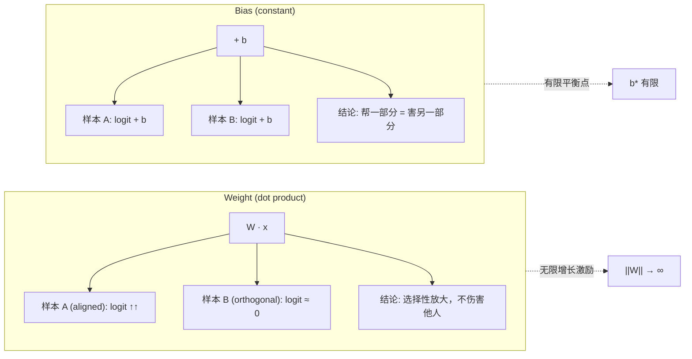

某 3B 模型的 Layer Scalar 不加 weight decay 漂到了 56.25（详见上篇）。顺理成章的追问：bias 也不加 weight decay，它为什么不漂？答案藏在一个简单的数学性质里——bias 对所有样本加相同常数，帮了一部分就必然害另一部分。这形成了天然的有限平衡点。

## 1. 行业标准：所有主流框架都把 bias 排除在 weight decay 之外

| Framework | 规则 |
|---|---|
| GPT-3 / LLaMA / GPT-NeoX / Megatron | 显式拆分：`decay`（2D weights）vs `no_decay`（bias + norm） |
| nanoGPT | `p.dim() >= 2` → decay，否则 no_decay |
| HuggingFace Trainer | 默认排除 `["bias", "LayerNorm.weight"]` |

这不是偶然的编码习惯，而是基于对参数动力学的深刻理解。更激进的做法：现代 LLM（LLaMA、PaLM、Qwen）直接让所有 Linear 层 `bias=False`，从源头消灭问题。

## 2. 核心区别：Selective Boosting vs Universal Shifting

为什么 weight 没有 weight decay 会无限增长，而 bias 不会？关键在于它们对不同样本的作用方式。

**Weight（点积 W·x）**：可以"选择性放大"——只增加与方向对齐的输入的 logit，不伤害其他样本。当数据线性可分时，$W \to \alpha W$ 同时锐化所有 softmax 分布，loss 随 $\|W\|$ 单调下降 → 无限增长激励。

**Bias（常数加法）**：对所有输入施加相同偏移。增大 $b_k$：
- 帮助 class-k 样本（正确 logit 增加）
- 伤害 non-class-k 样本（错误 logit 增加）
- 两种力量在有限的 $b^*$ 处达到平衡

## 3. 具体数字：一目了然的 Loss 变化

设 3 维输入、2 个类别：
- 样本 A：$x = [1, 0.5, -0.3]$，真实标签 = class 0
- 样本 B：$x = [-0.8, 0.2, 1.0]$，真实标签 = class 1
- $W_0 = [0.5, -0.2, 0.1]$，$W_1 = [-0.3, 0.4, 0.6]$
- 变量：$b_0$（class 0 的 bias）

| $b_0$ | Loss\_A | Loss\_B | Total Loss | 趋势 |
|---|---|---|---|---|
| 0 | 0.018 | 0.018 | **0.036** | ← 最优 |
| 1 | 0.007 | 0.049 | 0.055 | ↑ 变差 |
| 2 | 0.002 | 0.127 | 0.129 | ↑↑ 明显恶化 |
| 3 | 0.001 | 0.313 | 0.314 | ↑↑↑ 严重 |
| 4 | 0.000 | 0.508 | 0.509 | ↑↑↑↑ 灾难 |

$b_0$ 增大：Loss\_A 下降（0.018 → 0.000），但 Loss\_B 上升更快（0.018 → 0.508）。Total loss 在 $b_0 = 0$ 处有明确的最小值。

## 4. 数学推导：为什么 Weight 有无限增长激励而 Bias 没有

### Weight 的情况

对于 softmax cross-entropy，当数据线性可分时：

$$\mathcal{L} = -\log \frac{e^{W_y \cdot x}}{\sum_k e^{W_k \cdot x}}$$

令 $W \to \alpha W$（$\alpha > 1$）：所有 logit 差值 $(W_y - W_k) \cdot x$ 被放大 $\alpha$ 倍，softmax 趋向 one-hot，loss 趋向 0。

$$\lim_{\alpha \to \infty} \mathcal{L}(\alpha W) = 0$$

梯度永远指向增大 $\|W\|$ 的方向——没有 weight decay 就没有刹车。

### Bias 的情况

对 $b_k$ 求导：

$$\frac{\partial \mathcal{L}}{\partial b_k} = p_k - \mathbb{1}[y = k]$$

其中 $p_k = \text{softmax}(z)_k$ 是模型对 class k 的预测概率。

对整个数据集取期望：

$$\mathbb{E}\left[\frac{\partial \mathcal{L}}{\partial b_k}\right] = \bar{p}_k - \pi_k$$

其中 $\bar{p}_k$ 是模型对 class k 的平均预测概率，$\pi_k$ 是 class k 的真实比例。

**平衡条件**：当 $\bar{p}_k = \pi_k$ 时，梯度为零。这是一个有限的平衡点——bias 自动调整到让模型的平均预测匹配真实类别频率。

关键区别：weight 的梯度方向始终一致（增大 margin），而 bias 的梯度是来自不同样本的拉锯战，必然在某处归零。

## 5. 与 Layer Scalar 的对比

| 属性 | Layer Scalar | Bias |
|---|---|---|
| 作用方式 | 对整层输出做乘性缩放 | 对单个维度做加性偏移 |
| 增长激励 | 类似 weight：缩放 residual 增强表达力，持续增长驱动 | 样本间竞争，有限平衡 |
| 需要 WD？ | **是**（实测：不加 WD，L31 从 1.0 漂到 56.25） | **否** |
| 自稳定机制 | 无（放大对所有 token 同向有利） | 有（帮一类 = 害另一类） |

Layer Scalar 本质上和 weight 一样——它是乘性的，放大整个残差流不会造成"样本间竞争"。每个 token 的残差被同比例放大，所有 softmax 分布同时锐化，loss 单调下降。这就是它需要 weight decay 的原因。

## 6. Quantization 安全性分析

即使 bias 参与量化：

- INT32 表示范围：$\pm 2.1 \times 10^9$
- 典型 scale $s_w \times s_a = 10^{-4} \sim 10^{-2}$，可表示 bias 范围 = $10^5 \sim 10^7$
- 实测 LLM bias 值：极少超过 10
- 安全余量：至少 **10,000 倍** → 不存在量化溢出风险

即使不加 weight decay，bias 的自平衡机制也将其稳定在合理范围内，量化完全安全。

## 7. 为什么现代 LLM 干脆去掉 Bias

现代架构（LLaMA、PaLM、Qwen）所有 Linear 层 `bias=False`，原因不是"bias 有害"，而是：

1. **边际收益低**：RMSNorm（不含 affine bias）已承担了偏移的角色
2. **参数效率**：减少参数 = 减少显存 = 增大 batch size
3. **工程简洁**：更少的边界情况（量化、分布式切分、FSDP shard）
4. **不是因为会爆炸**：本文已证明 bias 有天然平衡点，不会失控

## 8. 工程经验总结

| 结论 | 依据 |
|---|---|
| Bias 不需要 weight decay | 数学上有有限平衡点（$\bar{p}_k = \pi_k$） |
| Layer Scalar 需要 weight decay | 乘性参数无自稳定机制，实测漂移 56× |
| 现代 LLM 去掉 bias 是优化选择 | 与安全无关，纯粹是参数效率的工程决策 |
| 判断标准 | 问自己：这个参数增大，是"同时帮所有样本"还是"帮一部分害一部分"？ |

**一句话判据**：如果一个参数增大能同时降低所有样本的 loss（如 weight magnitude、layer scalar），它就有无限增长激励，需要 weight decay；如果增大必然导致部分样本 loss 上升（如 bias），它就自带刹车，不需要 weight decay。

## References

1. Loshchilov, I. & Hutter, F. (2019). *Decoupled Weight Decay Regularization*. ICLR 2019.
2. Karpathy, A. *nanoGPT*. GitHub. Parameter group splitting logic.
3. Touvron, H. et al. (2023). *LLaMA: Open and Efficient Foundation Language Models*. [arXiv:2302.13971](https://arxiv.org/abs/2302.13971).
4. Zhang, B. & Sennrich, R. (2019). *Root Mean Square Layer Normalization*. NeurIPS 2019.
5. Chowdhery, A. et al. (2022). *PaLM: Scaling Language Modeling with Pathways*. [arXiv:2204.02311](https://arxiv.org/abs/2204.02311).
