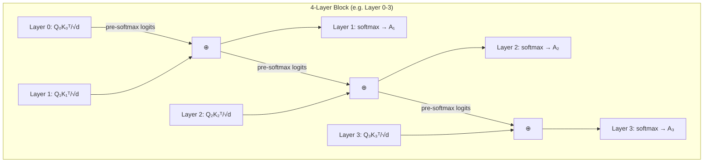

某 3B 模型架构搜索中，Block Attention Residual 带来了 0.025 的 loss 收益——不加任何参数。但 PyTorch 实现直接慢了 90%，整个训练周期要翻倍。Triton kernel 迭代两版后把开销压到 14%，让这个"免费"的收益真正能用上。

这个 case 的核心教训：**研究上有效的结构创新，离工程落地往往差一个 kernel 的距离。**

## Block Attention Residual 做了什么

标准 Transformer 中，每层的 attention 计算是完全独立的：$Q_i K_i^T / \sqrt{d}$ 算完 softmax 就丢掉 logits，各层互不干涉。

Block Attention Residual 的想法很简单：把连续 4 层组成一个 block，让 layer i 的 pre-softmax logits 作为 layer i+1 的 additive bias 传递下去。公式上：

$$
A_i = \text{softmax}\left(\frac{Q_i K_i^T}{\sqrt{d}} + \text{logit_residual}_{i-1}\right)
$$

其中 $\text{logit_residual}_{i-1}$ 就是上一层 softmax 之前的 raw attention scores。后一层在计算 attention 时能"看到"前一层关注了什么位置，而不需要额外的 cross-attention 模块或可学习参数。

关键特性：
- **零额外参数**：纯 additive residual，没有 learnable weight
- **Block 内传递，block 间隔断**：每 4 层一个 block，block 边界处 residual 归零
- **推理可吸收**：推理时 attention residual 可以合并到 attention 计算中，不增加 inference cost

## 实验结果：两个 baseline 都有效

我们在两个不同的 baseline 架构上验证了 Block Attention Residual 的效果。

### 实验 1：SWA + Gated Attention baseline

在约 8.8B tokens 处观测：

| 配置 | Loss |
|------|------|
| Baseline (SWA + Gated Attention) | X |
| + Block Attention Residual (每 4 层) | X - 0.025 |

Loss 下降 0.025，直接加和聚合（无 weighting），无额外参数。

### 实验 2：SwiftKV16 baseline

| Token 量 | Loss 收益 |
|-----------|-----------|
| 8k tokens | -0.02 |
| 26k tokens | -0.016 |

在更长的 context 下收益略有减小，但仍然显著。更重要的是，两个完全不同的 baseline 都能获益，说明这个方法是 **architecture-agnostic** 的。

作为参照：0.025 的 loss 下降大致相当于通过 PLE 增加 35% 参数量能带来的收益——而 Block Attention Residual 不加一个参数。

## 为什么 PyTorch 实现慢了 90%

问题出在 FlashAttention 的设计哲学上。

FlashAttention 的核心优势是**不 materialize 完整的 attention matrix**：它按 tile 计算 $QK^T$，在 SRAM 中完成 softmax 后立刻与 V 相乘，pre-softmax logits 从不写回 HBM。这就是它比 naive attention 快的原因——避免了 $O(n^2)$ 的显存读写。

Block Attention Residual 要求把 pre-softmax logits 传给下一层。在 PyTorch 层面实现，你被迫：

1. **禁用 FlashAttention**，改用标准 attention 实现（否则拿不到中间 logits）
2. **Materialize 完整 attention matrix**：$(\text{seq_len} \times \text{seq_len})$ per head，对 3B 模型（20 Q heads）这是巨大的显存开销
3. **额外的 memory allocation + HBM 读写**：每层多一次 full attention matrix 的 store 和 load

结果：forward pass 时间接近翻倍，整体训练 +90%。一个"免费"的 loss 收益变成了天价的计算开销。

## Triton Kernel 优化之路

### v1：Fuse Residual 进 Attention Kernel (+31%)

核心思路：不要在 Python 层面"拿出 logits 再加回去"，而是在 Triton attention kernel 内部完成 residual 的加法。

具体做法：
- 修改 FlashAttention-style 的 Triton kernel，在每个 tile 计算 $Q_i K_j^T$ 之后、做 softmax 之前，加上从上一层传来的对应 tile 的 residual
- 不需要 materialize 完整 attention matrix：按 block-by-block 计算 residual 贡献
- Backward pass 仍需存储部分中间状态（online softmax 的 log-sum-exp 统计量需要修正）

效果：从 +90% 降到 +31%。核心收益来自避免了 full attention matrix 的 materialization。

### v2：优化 torch.cat + SRAM 复用 (+14%)

v1 到 v2 的提升来自两个发现：

**隐藏瓶颈：block 边界的 torch.cat**

4-layer block 的首层没有 residual input，末层的 residual 不需要输出。但 block 边界处，多个 tensor 的拼接（torch.cat）引入了意外的开销——这在 profiling 中不容易发现，因为它被分散在多个 op 中。优化方法：预分配 buffer，避免 block 边界的动态 allocation。

**SRAM tile 复用**

Triton kernel 内部，上一层的 residual tile 和当前层的 $QK^T$ tile 共享 SRAM 空间。v1 中这两个 tensor 分别占用 SRAM，导致 tile size 受限（tile 越小，loop 次数越多，overhead 越大）。v2 通过 explicit SRAM 管理让两者 time-share 同一块 SRAM。

最终效果：

| 实现方式 | 相对 baseline 额外训练时间 |
|----------|---------------------------|
| PyTorch naive | +90% |
| Triton v1 | +31% |
| Triton v2 | +14% |

从 +90% 到 +14%，overhead 减少了 6.4 倍。

## 工程决策：14% 换 0.025 loss

最终我们的判断：

- **收益确定**：0.025 loss 下降，两个 baseline 验证，architecture-agnostic
- **开销可控**：14% 额外训练时间（vs 原来的 90%），在某 3B 模型的训练 budget 内可承受
- **推理零开销**：attention residual 在推理时可以被吸收，不影响 serving latency
- **无额外参数**：模型大小不变，不影响 deployment footprint

实验配置：H=2560，32 layers（8 个 4-layer block），GQA 20Q/4KV，H800 8-GPU node，mbs=1，gbs=256。

14% 的 overhead 对于某 4B 候选架构的完整预训练来说，大约增加 2-3 天的训练时间。考虑到收益等价于多加 35% 参数，这笔账怎么算都划算。

## 教训

**研究结果到工程落地之间的鸿沟**

Block Attention Residual 在论文中是一个 elegant 的想法：不加参数就能提升 loss。但如果团队没有 Triton kernel 能力，这个方法在实践中就是不可用的——没人能承受 +90% 的训练开销。

**Profiling 比直觉重要**

v1 → v2 的关键突破不是更巧妙的算法，而是 profiling 发现了 torch.cat 这个隐藏瓶颈。kernel 优化到后期，主要 overhead 往往不在你预期的 compute 上，而在 memory allocation 和 data movement 上。

**FlashAttention 的"不可侵犯"假设**

FlashAttention 的速度优势建立在"中间结果不出 SRAM"这个前提上。任何需要跨层传递中间状态的架构创新，都会与这个前提冲突。未来做 architecture search 时，应该在设计阶段就考虑 kernel 实现的可行性，而不是先证明有效再倒回来补 kernel。

## References

1. Kimi Team. Block Attention Residual mechanism (architecture description).
2. Dao, T. (2023). FlashAttention-2: Faster Attention with Better Parallelism and Work Partitioning.
3. Tillet, P. et al. (2019). Triton: An Intermediate Language and Compiler for Tiled Neural Network Computations.
