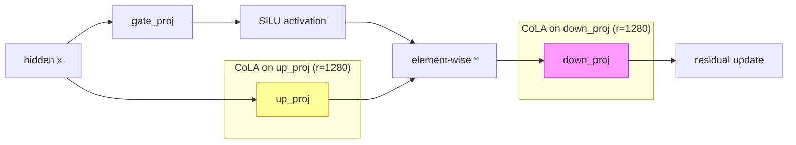

CoLA 论文说低秩化能减 45% 参数不掉点。我们在某 3B 模型上验证：放在 down_proj 收敛比放在 up_proj 慢 2.3 倍，放在全部三个投影直接崩了（+0.17 loss）。FFN 内部不是哪里都能做低秩的——up_proj 是唯一可行的落点。

## SwiGLU FFN 结构与三个可选落点

某 3B 模型的 FFN 采用 SwiGLU 结构：

```
output = down_proj(silu(gate_proj(x)) * up_proj(x))
```

CoLA 的核心操作是将全秩矩阵 $W \in \mathbb{R}^{m \times n}$ 分解为 $W = AB$，其中 bottleneck 维度为 $r \ll \min(m, n)$。问题是：gate_proj、up_proj、down_proj 三个投影，CoLA 应该放在哪里？

注意：该模型使用 GQA（20Q/4KV），K/V 维度仅 512，已经足够小，attention 侧做 CoLA 不实际。所以实验聚焦在 FFN 内部。



上图标注了两个关键位置。up_proj 的 rank 受限意味着 value signal 被约束在一个子空间内，但 gate_proj 仍然保持 full-rank 来做选择；down_proj 的 rank 受限则直接约束了 FFN 输出给 residual stream 的维度。

## 三组实验设置

| 方案 | CoLA 位置 | Rank $r$ | 参数说明 |
|------|-----------|----------|----------|
| Plan A | gate + up + down 全部 | 640 (d/4) | 最激进 |
| Plan B (up-only) | 仅 up_proj | 1280 (d/2) | 单点最优候选 |
| Plan B (down-only) | 仅 down_proj | 1280 (d/2) | 对照组 |

训练配置：1.8T token budget，gbs=4800，seq=4096，bf16+fp8 hybrid。

## 收敛曲线：三个方案的 Train Loss Gap vs Baseline

| Step | Token (B) | Plan A (all, r=640) | up-only (r=1280) | down-only (r=1280) |
|------|-----------|---------------------|-------------------|---------------------|
| 3,000 | 59B | +0.212 | +0.043 | +0.083 |
| 6,000 | 118B | +0.175 | +0.032 | +0.070 |
| 8,000 | 157B | +0.166 | +0.030 | +0.064 |
| 18,000 | 354B | — | +0.022 | — |

Plan A 直接崩盘：loss gap 在 +0.17\~0.24 之间浮动，35 个 validation set 平均劣化 +0.231。up-only 在 step 6000 的表现就已经超过 Plan A 在 step 8000 的最终表现。全部低秩化是不可行的。

## 核心对比：up-only vs down-only 的 2.3 倍差距

在相同 step 相同参数量（都是 r=1280）的条件下：

| Step | up-only gap | down-only gap | 比值 (down/up) |
|------|-------------|---------------|----------------|
| 3,000 | +0.043 | +0.083 | 1.93x |
| 6,000 | +0.032 | +0.070 | 2.19x |
| 8,000 | +0.030 | +0.064 | 2.13x |

在 step 3000 时对 35 个 validation set 做公平比较：
- up-only 平均劣化：+0.042
- down-only 平均劣化：+0.096
- **比值：2.3x**

down-only 的 loss gap 始终是 up-only 的 2.1\~2.3 倍，且随训练推进差距在扩大而非缩小。这不是随机波动，是结构性差异。

## 为什么 up_proj 优于 down_proj

SwiGLU 的计算流程是 `out = down(silu(gate(x)) * up(x))`。两个位置的 rank limitation 造成的影响本质不同：

**up_proj 低秩化**：value signal 被约束在 rank-1280 的子空间内。但 gate_proj 保持 full-rank，可以对这个子空间做精细的 element-wise 选择——哪些维度通过、哪些被抑制。gate 的 full-rank selectivity **部分补偿**了 up 的 rank loss。

**down_proj 低秩化**：不论 gate 和 up 计算出了多丰富的 intermediate representation，最终输出只能落在 hidden dimension 的一个 1280 维子空间里。这直接约束了 FFN 对 residual stream 的贡献——每一层后续 layer 都只能收到一个 lower-rank 的 residual update。没有任何机制能补偿这个瓶颈。

**类比**：up_proj 低秩好比 "我只能带 1280 种货物，但有一个 smart filter（gate）选择传哪些"；down_proj 低秩好比 "不管我内部算了什么，最终只能在 1280 个方向上输出"。前者有补偿机制，后者没有。

## Early-Behavior Illusion：down-only 的初始假象

一个有趣的现象：

| Step | up-only val gap | down-only val gap |
|------|-----------------|-------------------|
| 1,000 | +0.297 | +0.047 |
| 2,000 | +0.045 | +0.109 |
| 3,000 | +0.042 | +0.096 |

在 step 1000 时，down-only 看起来**远好于** up-only！如果在这个时间点做决策，会得出完全错误的结论。

原因推测：down_proj 低秩化让模型快速学到一个 "低维但粗糙" 的 residual pattern——初始 adaptation 快。但随着训练深入，模型需要更丰富的 residual update 来精细化表示，down_proj 的 rank 瓶颈就成了硬伤。up-only 初始慢是因为 gate 需要时间学会如何在受限的 value space 中做有效选择，一旦学会就持续收益。

**教训：低秩实验至少要跑到 2000-3000 步才能做可靠判断。**

## Power-Law 外推：需要 6.85T Tokens 才能完全收敛

对 up-only 方案，利用 15,459 个共享 iteration（50B-354B 范围）拟合 power-law：

$$\text{gap}(t) = G_\infty + B \cdot t^{-\beta}$$

拟合参数：
- $G_\infty = -0.0094$
- $B = 39.74$
- $\beta = 0.2681$

预测：
- 在 1.8T token budget 结束时：gap $\approx$ +0.011
- 首次达到 gap $\leq$ 0.005 的时间点：约 6.85T tokens（3.8x 当前 budget）

结论：up-only CoLA 从架构上是 viable 的（收敛趋势正确，$G_\infty < 0$ 说明理论上能追平），但在有限 budget 内不能完全 close the gap。

## 工程决策框架

| 方案 | 结论 | 理由 |
|------|------|------|
| Plan A (all, r=640) | **ABANDONED** | 灾难性劣化 +0.17\~0.24 |
| down-only (r=1280) | **ABANDONED** | 收敛比 up-only 慢 2.3x，无结构性优势 |
| up-only (r=1280) | **VIABLE** | +0.011 gap @ 1.8T，可接受则用 |

决策取决于下游目标：
- 若 deployment target 能容忍 +0.011 loss gap → 采用 up-only CoLA，节省 FFN up_proj 参数
- 若需要严格 match baseline → 在 1.8T budget 内不建议使用
- 若 budget 可扩展至 3T+ → 值得重新评估

核心 takeaway：FFN 内部的低秩化不是位置无关的。gate 对 up_proj 的补偿效应使 up_proj 成为唯一合理的 CoLA 落点。在做类似实验时，不要被前 1000 步的表现误导，至少观察到 3000 步再做判断。

## References

1. CoLA: Compute-Efficient Low-Rank Activation — 原始论文，提出 45% 参数缩减目标
2. Shazeer (2020), "GLU Variants Improve Transformer" — SwiGLU 结构定义
3. Kaplan et al. (2020), "Scaling Laws for Neural Language Models" — power-law fitting 方法论
4. Ainslie et al. (2023), "GQA: Training Generalized Multi-Query Transformer" — GQA 结构，解释为何 attention 侧不适合 CoLA
