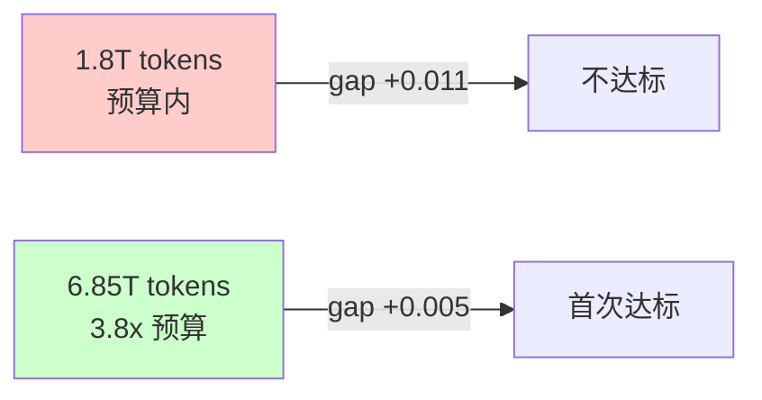

CoLA 论文声称参数减 45% 不掉点。我们在某 3B 模型的 FFN 上实测：全低秩方案(r=640) 训了 158B token，loss 差 0.18 当场判死刑。单点低秩(up_proj, r=1280) 好得多——但 power-law 外推说 6.85T tokens 才能追平 baseline。这比我们的训练预算大了 3.8 倍。

这篇文章记录一个完整的负面结果。不是"方法不行"，而是"在我们的设定下，代价远超论文承诺"。

## CoLA 是什么，为什么我们要试

CoLA (Compute-Efficient Pre-Training via Low-Rank Activation, [arXiv:2502.10940](https://arxiv.org/abs/2502.10940)) 的核心思路很简单：将 Transformer 中的全秩线性层替换为低秩分解 $W = AB$，其中 $A \in \mathbb{R}^{d_{out} \times r}$, $B \in \mathbb{R}^{r \times d_{in}}$, $r \ll \min(d_{in}, d_{out})$。论文在 350M 和 1B 模型上验证，rank 取 $d/4$ 时参数量减少约 45%，训练 loss 与 full-rank baseline 无显著差异。

对于一个 3B on-device 模型来说，FFN 占了总参数的约 2/3。如果能把 FFN 的三个 projection (gate_proj, up_proj, down_proj) 全部低秩化且不掉点，推理 latency 能减少 30%+。这个诱惑足够大，值得花几百 GPU-hours 验证。

## 实验设定

**Base model:** 某 3B 模型 (32 layers, d_model=2560, d_ffn=6912, 20Q/4KV GQA, SwiGLU activation)

**训练配置:** 1.8T tokens budget, seq_len=4096, global batch size=4800, bf16+fp8 hybrid precision

**三个实验方案：**

| 方案 | 低秩目标 | Rank | 参数减少 |
|------|----------|------|----------|
| Plan A | gate/up/down 全部 CoLA | r=640 (d/4) | ~45% FFN params |
| Plan B up-only | 仅 up_proj | r=1280 (d/2) | ~15% FFN params |
| Plan B down-only | 仅 down_proj | r=1280 (d/2) | ~15% FFN params |

## Plan A：全低秩，158B tokens 判死刑

Plan A 严格复现论文设定：所有 FFN projection 使用 r=d/4=640 的低秩分解。

结果是灾难性的：

- 训练到 158B tokens (8045 steps) 时，train loss 比 baseline 高 **+0.18**
- 全部 35 个 validation set 无一例外全部退化，平均 gap **+0.19**
- Loss 曲线没有任何收敛迹象，gap 随训练持续扩大

我们在 158B tokens 处提前终止。这个 gap 量级在 pre-training 中意味着"不可恢复"——继续训完 1.8T tokens 也不会追平。

**失败原因分析：** SwiGLU 的计算路径是 $\text{output} = \text{down}(\text{gate}(x) \odot \text{up}(x))$。当三个 projection 同时低秩化时，信息要连续通过三个 rank-640 的 bottleneck。有效 rank 远小于 640——这不是三个独立的低秩近似，而是一个串联的信息瓶颈。

## Plan B up-only：慢收敛的故事

只对 up_proj 做低秩分解，rank 提高到 d/2=1280。结果好得多，但"好得多"和"足够好"之间还有巨大鸿沟。

训练持续到 382B tokens (19,446 steps)，超过了 baseline 的 354B 训练量。

### 关键数据点

| Tokens | Steps | Train Loss Gap | Val Loss Gap (35 sets avg) |
|--------|-------|---------------|---------------------------|
| 59B | ~3,000 | +0.043 | +0.297 |
| 118B | ~6,000 | +0.032 | +0.065 |
| 236B | ~12,000 | +0.025 | +0.035 |
| 354B | ~18,000 | +0.022 | +0.022 |
| 382B | 19,446 | +0.021 | +0.021 |

几个观察：

1. **Gap 在持续缩小**，但速度越来越慢——典型的 power-law decay
2. **Val loss gap 收敛比 train loss gap 慢**：59B 时 val gap 是 train gap 的 7 倍，到 354B 时两者才对齐
3. 即使多训了 28B tokens (比 baseline 多 8%)，gap 仍然有 +0.021

## Plan B down-only：诡异的早期优势与反转

down_proj 低秩化展现了一个意料之外的现象：

```
Step 1000 (~20B tokens):
  down-only gap: -0.034 (比 baseline 还好！)
  up-only gap:   +0.003 (基本持平)

Step 2000 (~40B tokens):
  down-only gap: +0.092 (急剧恶化)
  up-only gap:   +0.008 (稳定)

Step 8000 (~158B tokens):
  down-only gap: +0.064
  up-only gap:   +0.030
```

down-only 在最初 1000 steps 的 loss 竟然比 baseline 低。一个可能的解释：低秩 down_proj 在训练初期提供了隐式正则化，帮助 gate/up 的梯度更快稳定。但这个"免费午餐"在 2000 steps 后彻底消失，之后 down-only 的表现始终劣于 up-only。

**结论：** 如果只能选一个 projection 做 CoLA，up_proj 是更好的目标。

## Power-Law 外推：什么时候能追平？

对 Plan B up-only 的收敛曲线做 power-law fitting。使用 15,459 个 common iterations 的数据点，拟合区间 50B-354B tokens：

$$\Delta L(t) = a \cdot t^{-\alpha} + c$$

拟合结果外推：

| 目标 Token 量 | 预测 Gap | 相对 baseline |
|--------------|----------|--------------|
| 1.8T (stage1 budget) | +0.011 | 仍高于容忍线 |
| 3.6T (2x budget) | +0.007 | 接近但未达标 |
| **6.85T** | **+0.005** | **首次达到容忍线** |

我们的容忍线是 gap ≤ 0.005 (在 3B scale 下约等于"无统计显著差异")。按外推，**需要 6.85T tokens 才能达到这个目标——这是 stage1 训练预算 1.8T 的 3.8 倍。**



换算成 GPU-hours：为了省 15% FFN 参数带来的推理加速，需要多花 3.8 倍的训练计算。这笔账怎么算都不划算。

## 为什么论文结果不能直接迁移

四个关键差异导致论文的结论在我们的场景下不成立：

**1. 应用范围不同。** 论文对整个模型 (包括 attention 的 QKV/O projection) 全部应用 CoLA。我们只对 FFN 做，因为 GQA 的 K/V head dimension 只有 512，太小无法有效低秩化。这意味着模型中的"全秩锚点"(attention layers) 要承担更多信息传递，FFN 的低秩化代价相对更高。

**2. Scale 不同。** 论文验证 350M 和 1B。3B 模型的每层信息密度更高，低秩近似的相对损失更大。这符合 scaling law 的一般规律：大模型对架构 degradation 更敏感。

**3. SwiGLU 的串联效应。** 论文使用 standard MLP (两层)。SwiGLU 有三个 projection 且有乘法交互 ($\text{gate} \odot \text{up}$)，低秩化任何一个都会影响乘法 gate 的有效维度。

**4. Context length: 256 vs 4096。** 论文用 256 token 的短序列。我们用 4096。更长的 context 意味着每个 token 需要从 FFN 中提取更多信息来建模长程依赖。低秩 FFN 在长序列上的信息瓶颈效应被放大了 (16 倍的序列长度不是线性放大，但确实显著加剧)。

## 负面结果的教训

### 什么时候该怀疑一篇论文

1. **Scale gap > 3x 时要验证。** 350M→3B 是近 10 倍的 scale gap。论文的结论在 scale 外推时不保证成立。
2. **Architecture 细节不同时要验证。** SwiGLU vs standard MLP、GQA vs MHA，这些不是"细微差异"而是"结构性差异"。
3. **Context length 差异大时要验证。** 256→4096 是 16 倍。信息论告诉我们，bottleneck 对吞吐量的限制在高负载时更严重。

### 什么时候该做 pilot experiment

- 当你打算投入 > 1000 GPU-hours 时，先花 50 GPU-hours 跑一个 short-horizon pilot
- 我们的 Plan A 在 158B tokens (约占总预算 9%) 时就已经能判死刑。如果只跑了 50B tokens 的 pilot，也能看到 +0.05 以上的 gap 并提前止损

### Power-law extrapolation 是你的朋友

- 不需要跑完全程就能预测终点
- 50B-354B 的数据足够拟合出 6.85T 的预测
- 这比"跑完 1.8T tokens 再说"省了 80% 的计算

## 总结

CoLA 是一篇扎实的论文，在其验证范围内结论成立。但"参数减 45% 不掉点"这个结论有严格的前提条件：full-model application, ≤1B scale, short context, standard MLP。当这些条件不满足时，低秩化的代价会从"free"变成"3.8x training budget"。

对于 3B+ on-device 模型的 FFN 优化，我们的结论是：**CoLA 风格的 pre-training 时低秩化不是正确的路径。** 更值得探索的方向可能是 post-training pruning/distillation，或者在架构层面直接设计更窄但更深的 FFN。

## References

- [CoLA: Compute-Efficient Pre-Training via Low-Rank Activation](https://arxiv.org/abs/2502.10940) ([arXiv:2502.10940](https://arxiv.org/abs/2502.10940))
