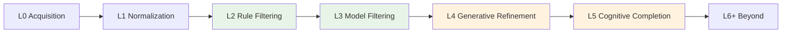
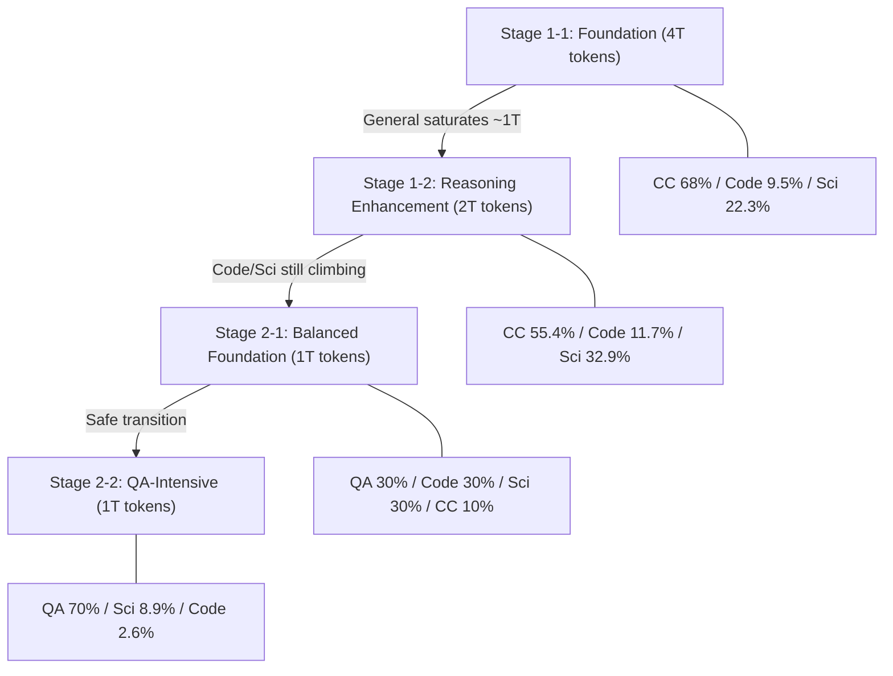

某 3B 模型（从零训练 8T tokens）整体 51.72 分与 7B 参数的 OLMo-3 打平。关键不是用了更多数据——而是 200 次消融发现的三条定律：处理深度是与数据量并列的 scaling 维度，格式切换的收益是比例调整的 8-60 倍，不同能力域的饱和速率可以差 4 倍以上。

---

## 1. 预训练数据工程为何被严重低估

Scaling law 文献集中在参数量与 token 总量的最优配比（Chinchilla 路线），但大家都回避了一个问题：**同样 1T tokens，经过不同层级处理后效果差多少？**

原因很简单——做一次完整的数据处理消融太贵了。需要在相同参数、相同 schedule、相同 evaluation 下跑完多组 500B+ token 实验，纯靠算力堆。这篇工作的价值在于：用 200+ 次 500B token 子实验系统性地回答了这个问题，并且最终用 8T token 的完整训练验证结论可迁移。

关键结论：数据处理深度（Data Processing Depth）是一个与数据总量同等重要的 scaling 维度。Chinchilla 告诉你"给 3B 模型配 150B token"——但没有告诉你那 150B token 处理到什么层级。

---

## 2. L0-L9 数据达尔文主义分级

论文提出了一套从 L0 到 L9 的数据处理深度分类法（Data Darwinism）。核心思想：每一层处理都在原始数据上叠加更多"认知加工"：

| Level | 名称 | 关键操作 | 信息增量 |
|-------|------|----------|----------|
| L0 | Data Acquisition | 爬虫 / API 抓取 | 原始 bytes |
| L1 | Format Normalization | OCR / HTML parsing / 编码统一 | 可读文本 |
| L2 | Rule-based Filtering | MinHash LSH 去重、长度/语言过滤 | 去噪 |
| L3 | Lightweight Model Filtering | fastText / 小分类器打分，只做选择 | 质量信号 |
| L4 | Generative Refinement | LLM 重写/结构化清洗，保留语义 | 格式信号 |
| L5 | Cognitive Completion | Frontier LLM 补全隐含推理链 | 推理信号 |
| L6+ | Beyond（理论层级） | 外部参考验证、代码执行、多 agent 校验 | 事实信号 |

关键区分：L2-L3 是**选择性**操作（从池子里挑好的），L4-L5 是**生成性**操作（把现有数据变得更好）。这个区分决定了收益曲线的形状。

---

## 3. 消融 1：处理深度的边际收益呈非线性跳跃

500B token 对照实验，固定模型架构和训练 schedule，仅变化数据处理层级：

| 数据层级 | Avg Code | Avg Sci | Overall | vs L2 |
|----------|----------|---------|---------|-------|
| L2 Rule-Based | 48.47 | 40.14 | 46.66 | — |
| L3 Model-Based | 49.63 | 40.28 | 46.93 | +0.27 |
| L4 Generative Refined | 50.15 | 42.25 | 47.83 | +1.17 |

整体看，L2→L4 只有 +1.17，似乎不大。但拆开看具体 benchmark：

- **MATH 单项：L3→L4 跳了 +7.0 分**——是 L2→L3 增益的 **26 倍**

这意味着：L3 的 fastText 过滤只是在相同分布里挑更好的样本，边际递减很快；而 L4 的 LLM 重写实际上**改变了数据的认知格式**——把隐含的推理步骤显式化、把混乱的排版结构化——这对数学推理能力的提升是质变而非量变。

工程启示：如果你的 pipeline 停在 L3（大多数开源项目的现状），你在推理类任务上可能损失了数十个百分点的潜力。

---

## 4. 消融 2：格式切换 vs 比例调整——最震撼的发现

这是整篇论文最具颠覆性的对比实验：

| 干预手段 | Code 提升 | Science 提升 |
|----------|-----------|-------------|
| 调整数据比例（Stage 1→3） | +2.62 | -0.24 |
| 引入 QA 格式（Stage 2） | +20.34 | +15.75 |

**比值：格式切换 / 比例调整 = 8x（Code）到 60x（Science）**

这个数字值得反复强调。社区花了大量精力在"代码数据占比从 10% 调到 15%"这类工作上，收益只有个位数；而把同样的知识从"连续文本"转换为"问答格式"，收益是前者的一到两个数量级。

为什么 Science 方向的比值高达 60 倍？因为 ratio 调整对 Science 几乎无效（-0.24，甚至略微下降），而格式切换带来了 +15.75 的巨大提升。这暗示科学文本在连续形态下的"可学习性"很低——模型很难从一堆论文段落中自发提取因果链；但一旦转为 QA 形态，学习效率暴增。

---

## 5. 两阶段 Curriculum 与饱和检测

论文的训练流程分四个子阶段，基于**每个能力域独立的饱和曲线**动态切换数据配方：

各阶段的设计逻辑：

- **Stage 1-1 (4T)**：标准 foundation 配方，CC 占大头。观察到 general domain 在约 1T token 时 loss 趋平。
- **Stage 1-2 (2T)**：降低 CC 比例，提升 Code 和 Science。此时 Code 和 Science 的 loss 仍在稳定下降。
- **Stage 2-1 (1T)**：过渡阶段。引入 QA 格式数据但比例温和（30%），防止分布骤变导致 catastrophic forgetting。
- **Stage 2-2 (1T)**：QA 数据占 70%。MATH 从 22 分飙升到 62.8 分。

**关键发现：Stage 2-2 的 1T QA-intensive tokens 提供的边际增益，超过了 Stage 1 最后 2T general text 的贡献。**

这直接挑战了"堆量"路线——不是所有 token 都平等的，在正确的时间切入正确格式的数据，1T 可以顶 2T 甚至更多。

---

## 6. 饱和速率的能力域差异

不同能力域的饱和特征差异巨大：

- **General domain**：约 1T tokens 饱和
- **Code**：约 4T tokens 饱和（4 倍于 general）
- **Science**：6T tokens 仍在上升（天花板未知）

这意味着用单一 loss 曲线指导数据配方是错误的——当 overall loss 趋平时，可能只是 general domain（占比最大）饱和了，而 code 和 science 域仍有大量空间。正确做法是为每个目标能力域独立监控饱和曲线，并据此调整 curriculum。

实操建议：在训练 dashboard 上为每个域单独画 evaluation metric 曲线。当某个域连续 3 个 checkpoint 不再上升时，降低该域数据占比，把算力让给仍在上升的域。

---

## 7. L5 Source-Target Alignment：跨域迁移很弱

L5 层级（Cognitive Completion）的消融揭示了一个重要约束：

| 合成数据来源 → 评估目标 | 提升 |
|--------------------------|------|
| CodeQA → Code | +4.3 |
| CC-QA → Science | +5.1 |
| CodeQA → Science | 微弱 |

结论：**synthetic data 必须 domain-matched**。用代码领域的 QA 合成数据去提升科学推理，效果微乎其微。这与"通用推理能力可迁移"的直觉相悖，但实验数据很清楚。

原因推测：L5 补全的是"某个领域特定的隐含推理模式"——代码的 debugging chain 和科学的因果推理链是不同的认知结构，彼此不可替代。

---

## 8. 工程实践启示

基于这 200 次消融，提炼三条可操作的规则：

**定律一：处理深度优先于数据量。** 如果你只有 500B token 的预算，把数据从 L2 提升到 L4 的收益 > 在 L2 水平上多加 500B token。优先投资 LLM-based data refinement pipeline。

**定律二：格式工程优先于比例工程。** 在你花时间 A/B test "代码占比 12% vs 15%" 之前，先确认你的数据是否已经做了格式转换（连续文本→QA/CoT）。格式切换的收益是比例调整的一到两个数量级。

**定律三：按域独立管理饱和。** 不要用 overall loss 做 curriculum 决策。为 code、science、general 三个域分别监控 saturation curve，基于各自的饱和节奏调整配方。General 域在 1T 就该开始降权，Science 域可能到 6T+ 还值得投入。

额外提醒：如果你在做合成数据（L5），确保 source domain 和 target domain 匹配。"随便用 GPT-4 生成一堆 QA 对"不如"用 GPT-4 针对目标域文档生成 domain-specific QA"。

---

## 参考文献

- daVinci-LLM: Data Processing Depth and Curriculum Learning for Pretraining. [arXiv:2603.27164](https://arxiv.org/abs/2603.27164)
