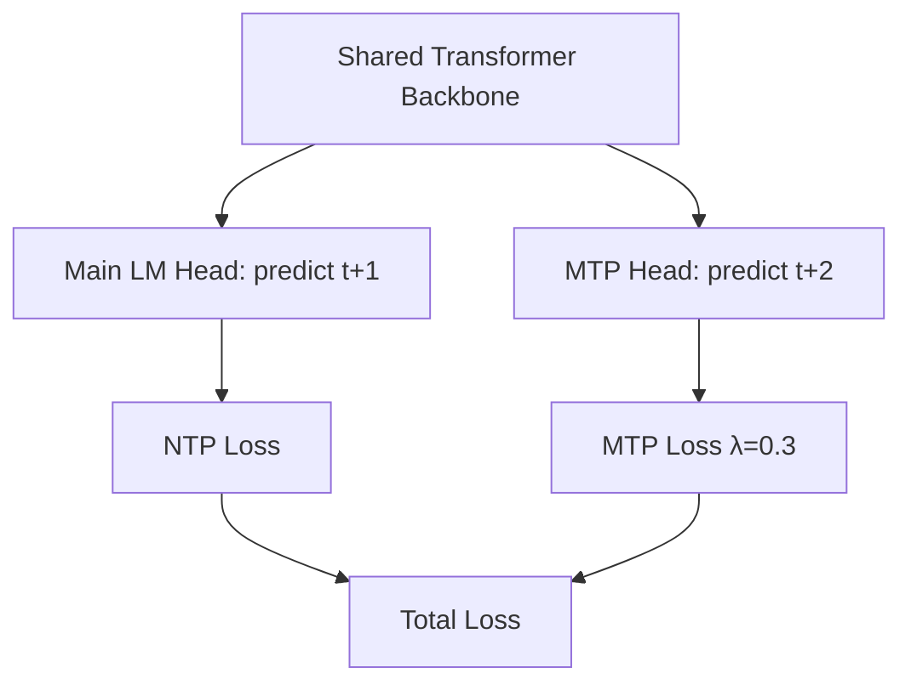
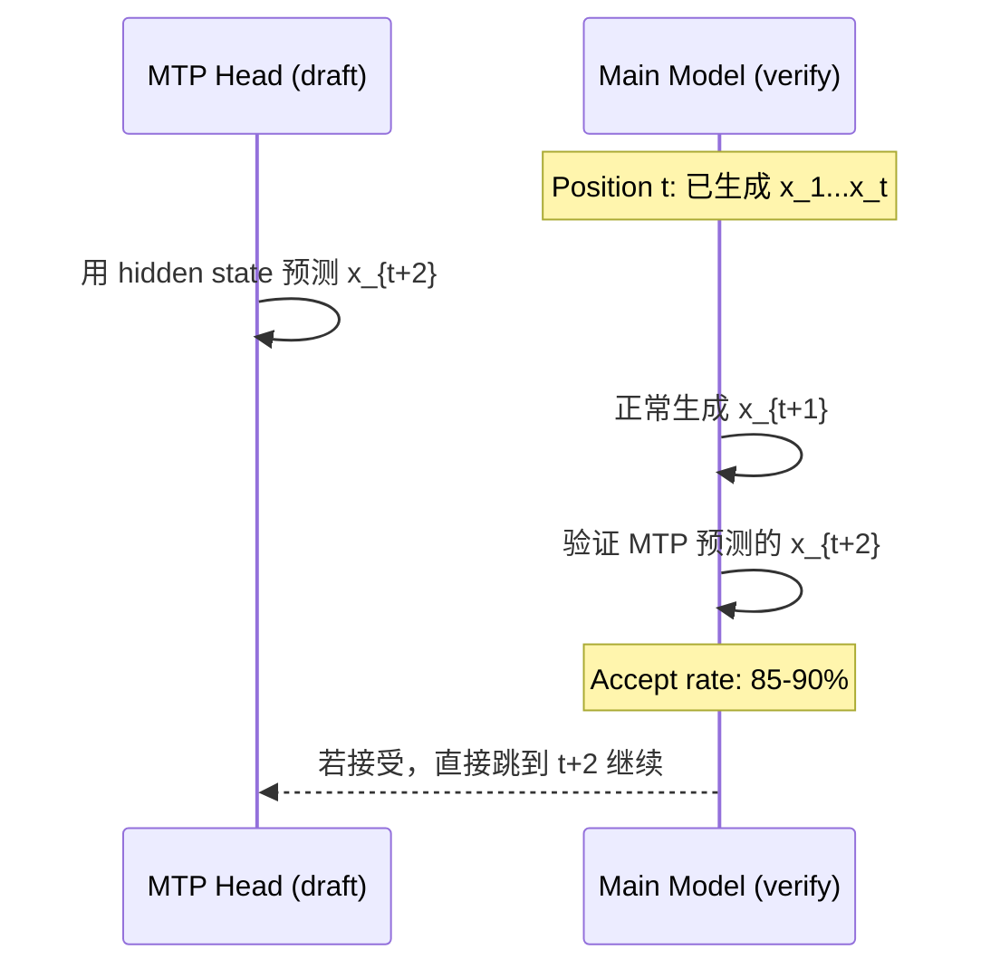
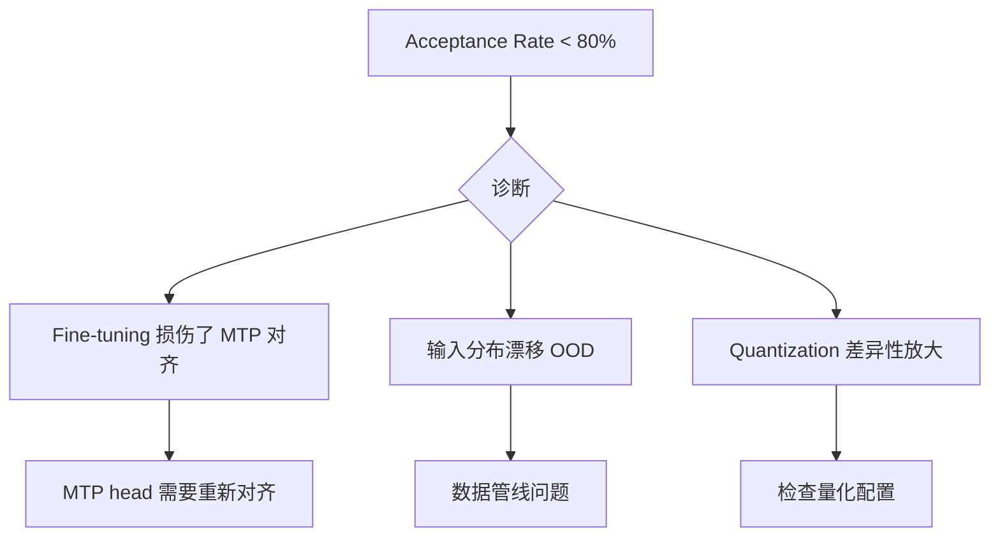
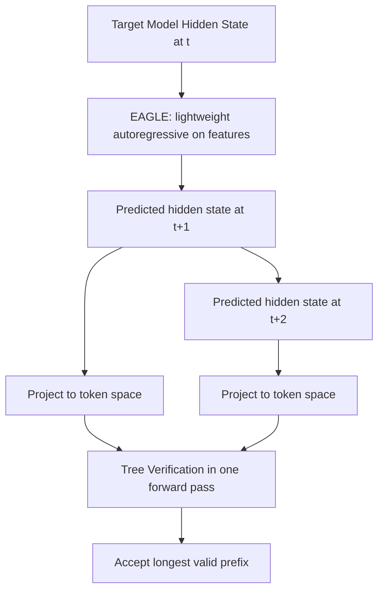
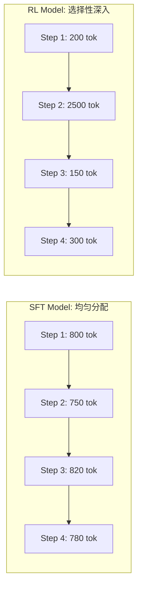
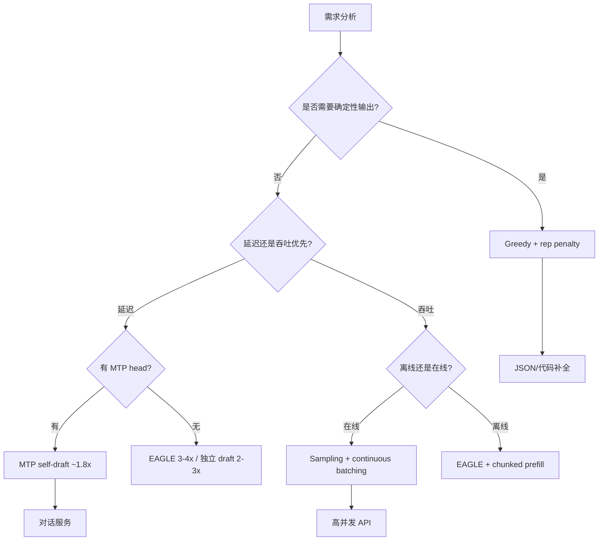

训练时加一个 Multi-Token Prediction (MTP) 辅助 loss，目的是提升表征质量。但到了推理阶段，这个"免费赠品"忽然变成了 speculative decoding 的 draft head —— 不需要额外训练 draft model，不需要额外显存加载小模型，直接拿训练时的 MTP module 当 drafter，acceptance rate 85-90%，吞吐提升 ~1.8x。

这篇文章从这个 case 出发，重新审视 decoding 策略的工程选型：什么场景选什么方案，生产环境的真实约束是什么，以及一个常被忽视的视角 —— RL 阶段的 length penalty 如何反向塑造 decoding 行为。

---

## 1. Case：MTP Module 如何"白送"Speculative Decoding

### 1.1 训练侧：辅助 Loss 的原始设计

MTP 在预训练阶段作为辅助 loss 引入，权重 $\lambda = 0.3$：

$$\mathcal{L}_{\text{total}} = \mathcal{L}_{\text{NTP}} + \lambda \cdot \mathcal{L}_{\text{MTP}}$$

其中 MTP module 共享主模型的 embedding 层和部分 transformer 参数，额外增加一个轻量的 prediction head 预测第二个 token（next-next-token）。训练目标很朴素：让模型的中间表征包含更多"前瞻"信息，从而提升主 loss 的收敛速度和最终质量。



关键设计决策：MTP head **只预测第二个 token**，不像 Medusa 那样堆叠多个 head（预测 t+2, t+3, t+4...）。这是一个经过权衡的选择 —— 距离越远的预测准确率衰减越快，多个低精度 head 的训练噪声反而会伤害主 loss。单 head 的 λ=0.3 是一个甜点：足够提供梯度信号，又不至于干扰主任务。

### 1.2 推理侧：Self-Speculative Decoding

传统 speculative decoding 需要一个独立的 draft model（通常是同系列的小模型，如 1B 辅助 7B）。这带来三个工程成本：
1. 额外显存（draft model 的权重 + KV cache）
2. 两个模型的版本管理和部署同步
3. Draft model 和 target model 的分布对齐需要刻意训练

MTP module 完全消除了这三个问题。因为它在预训练阶段就和主模型联合优化过，分布天然对齐：



**实测数据**：
- Second-token prediction acceptance rate：85-90%
- 端到端吞吐提升：~1.8x
- 额外显存开销：MTP head 参数量约为主模型的 1-2%，可忽略

### 1.3 为什么是"白送"

对比传统方案的 ROI：

| 方案 | 训练成本 | 推理额外开销 | 加速比 | 是否改变输出分布 |
|------|---------|-------------|--------|----------------|
| 独立 draft model | 训练一个小模型 | +20-30% 显存 | 2-3x | 否（精确等价） |
| Medusa heads | 微调多个 head | +5% 显存 | 1.5-2x | 近似等价 |
| EAGLE | 训练 feature predictor | +10% 显存 | 3-4x | 否 |
| **MTP self-draft** | **预训练时已完成** | **+1-2% 显存** | **~1.8x** | **否** |

MTP 的加速比不是最高的（EAGLE 更强），但它的边际成本为零 —— 你不需要为推理加速做任何额外工作，只要你在预训练时加了这个辅助 loss。这就是"白送"的含义。

---

## 2. Acceptance Rate 作为质量探针

### 2.1 监控指标的设计

MTP acceptance rate 不仅是性能指标，更是一个灵敏的 **模型质量探针**。

原理很简单：如果 MTP head 和主 LM head 预测一致（acceptance rate 高），说明模型的内部表征具有良好的"前瞻一致性" —— hidden state 同时编码了 t+1 和 t+2 的信息，两者互洽。

当 acceptance rate 突然下降（< 80%），通常意味着：



### 2.2 实践中的监控策略

在推理服务中持续采集 acceptance rate，按维度聚合：

- **按时间窗口**：滑动 5min 窗口的 acceptance rate 趋势
- **按请求类型**：代码生成 vs 对话 vs 摘要，不同任务的 baseline 不同
- **按 sequence position**：越靠后的位置 acceptance rate 是否衰减

告警阈值建议：
- 全局 < 80%：触发告警，检查最近的模型更新或数据变化
- 特定任务类型 < 70%：可能是 fine-tuning 在该领域破坏了 MTP 对齐
- Position 越靠后衰减越快：可能是 KV cache 精度问题或 context 超出训练范围

---

## 3. Decoding 策略全景：以"生产可用"为透镜

从生产服务视角重新审视所有 decoding 方案，核心评判标准是：**continuous batching 友好程度** 和 **per-request 资源开销**。

### 3.1 采样策略：生产环境的默认选择

| 策略 | 公式 | 生产友好度 | 适用场景 |
|------|------|-----------|---------|
| Top-p (nucleus) | $\sum_{v \in S} P(v) \geq p$ | 极高 | 对话、写作 |
| Top-k | 保留概率前 k 个 token | 极高 | 简单截断 |
| Min-p | $P(v) \geq \text{min_p} \cdot P_{\max}$ | 极高 | 精细控制 |
| Temperature | $P(v) \propto \exp(z_v / \tau)$ | 极高 | 与其他策略叠加 |
| Greedy | $\arg\max$ | 极高 | 结构化输出 |
| Beam search | 维护 k 条序列 | **极低** | 翻译（离线） |

**为什么 beam search 在 serving 中几乎死亡？** 一个 beam_size=4 的请求占用 4 个 KV cache slot，相当于 4 个独立请求的资源。在 continuous batching 调度器看来，这是灾难级的资源浪费。

采样策略对系统完全透明：每步只产生一个 token、占一个 KV cache slot、和其他请求无差别地在 batch 中流动。这就是它成为生产默认的原因。

### 3.2 Speculative Decoding 的系统集成

Speculative decoding 的核心数学保证 —— 输出分布与直接解码精确等价：

$$P_{\text{accept}}(x_t) = \min\left(1, \frac{P_{\text{target}}(x_t \mid x_{<t})}{P_{\text{draft}}(x_t \mid x_{<t})}\right)$$

被拒绝时从修正分布采样：

$$P_{\text{resample}}(x) = \text{norm}\left(\max(0, P_{\text{target}}(x) - P_{\text{draft}}(x))\right)$$

**在 continuous batching 中的挑战**：draft-then-verify 的两步流程打断了调度器的逐 token 节奏。工程上的解法：

1. **Draft 阶段共享 batch**：多个请求的 draft 预测打包到同一个 batch
2. **Verify 阶段处理变长**：不同请求的 draft length 不同，需要 padding 或动态 batch
3. **Self-draft（MTP）的优势**：draft 和 verify 在同一次 forward pass 中完成，调度复杂度大幅降低

### 3.3 EAGLE 的 Feature-Level 改进

EAGLE 不在 token level 做 draft，而是在 hidden state level 进行自回归预测：



EAGLE-2 报告的 per-token acceptance rate ~0.8，加速比 3-4x。但代价是需要额外训练 feature predictor，且推理时额外显存开销 ~10%。

---

## 4. Token Budget 与 Decoding 的交互

Token Budget 设计（离散 power-of-2 levels）在推理时与 decoding 产生非直觉的交互。

### 4.1 Budget 注入机制回顾

```
BUDGET_LEVELS = [0, 64, 128, 256, 512, 1024, 2048, 4096]
```

Budget 作为 prefill injection，模型不生成 budget 值，只读取它。`budget=0` 时，`<think_start><think_end>` 仍然存在（结构不变性）。

### 4.2 模型如何学习"遵守"Budget

这是一个 autoregressive generation 中的隐含约束：模型在每一步 decode 时，需要"记住"当前已使用的 token 数距离 budget 上限还有多少余量。

这个能力不是天然存在的 —— 它必须在训练数据中通过足够多的样本学习。实践中的关键发现：

1. **Budget 越大越容易遵守**：budget=4096 的违规率 < 1%，budget=64 的违规率可达 5-10%
2. **Temperature 影响 budget 遵守能力**：高 temperature 增加随机性，模型更容易"忘记"停止
3. **Speculative decoding 不影响 budget 遵守**：因为验证机制保证输出分布不变

### 4.3 生产中的防护机制

即使模型训练了 budget awareness，生产中仍需硬性截断作为兜底：

```python
def generate_with_budget(model, prompt, budget_level):
    max_think_tokens = budget_level
    generated = 0
    for token in autoregressive_decode(model, prompt):
        if in_thinking_region and generated >= max_think_tokens:
            force_emit("<think_end>")  # 强制结束思考
            break
        generated += 1
```

这个 fallback 被触发的频率本身也是一个监控指标 —— 频率过高说明模型在该 budget level 上的训练不充分。

---

## 5. Length Penalty（RL）如何反向塑造 Decoding 行为

### 5.1 DLER：硬截断的设计哲学

DLER (Doing Length Penalty Right) 采用激进的硬截断策略：

$$r(y) = \begin{cases} r_{\text{task}}(y) & \text{if } |y| \leq L_{\max} \\ 0 & \text{if } |y| > L_{\max} \end{cases}$$

其中 $L_{\max} = 4000$ tokens。超过直接获得零奖励，没有渐变、没有软惩罚。

**为什么硬截断比软惩罚更有效？**

软惩罚（如 $r - \beta \cdot \|y\|$）会导致模型学习"在接近惩罚阈值时匆忙收尾"，产出低质量的结尾段。硬截断则迫使模型在一开始就规划好输出长度 —— 要么完整输出拿满分，要么超长直接零分。这个 all-or-nothing 的信号更清晰。

### 5.2 RL 训练后的 Decoding 行为变化

经过 length penalty RL 训练的模型展现出 **selective deepening** 模式：

| 指标 | SFT 阶段 | RL 阶段后 | 变化 |
|------|---------|----------|------|
| Mean trajectory length | 10.9K tokens | 7.9K tokens | -28% |
| Mean steps | 14 steps | 8.9 steps | -36% |
| Per-step variance | 低（均匀分配） | 高（选择性深入） | 结构性变化 |

关键观察：RL 后的模型不是"均匀地变短"，而是学会了 **resource allocation** —— 在 routine operations（简单推导、格式化输出）上用极短的 steps，在 decision points（关键推理、分支选择）上展开详细推理。



### 5.3 对推理服务的影响

RL-trained 模型的 decoding 行为对推理系统有直接影响：

1. **KV cache 峰值降低**：mean trajectory 从 10.9K 降到 7.9K，KV cache 占用直接减少 28%
2. **吞吐提升**：更短的序列 = 更快释放 batch slot = 更高的并发数
3. **Speculative decoding 的 acceptance rate 变化**：RL 后模型的输出分布更"尖锐"（更确定），MTP acceptance rate 通常会略微提升
4. **Variable-length 调度优化**：chunk-wise RL rollout 中，variable-length trajectory 被切分为 fixed chunks 处理，这个 chunking 策略可以复用到推理的 chunked prefill 中

---

## 6. 真实模型的推理配置

### 6.1 128K Context + Sparse Attention 加速

某 4B 模型在 128K context 场景下，通过 sparse attention 机制实现端侧部署：

- 平台：Jetson AGX Orin（边缘设备）
- Decoding 加速比：7x（相对 dense attention）
- 核心思路：long context 中绝大部分 KV 对当前 token 的注意力权重极低，动态跳过

这验证了一个工程直觉：**context window 的增大不应该线性增加 decode 成本**。Sparse attention 让 128K context 的 per-token decode 成本接近 4K context。

### 6.2 MTP Drafter + 128K Context

支持 128K context 的大型 MoE 模型采用 MTP drafter 作为推理加速方案。在长 context 场景下，MTP 的 acceptance rate 随 position 的衰减比短 context 更明显 —— 这是因为长距离依赖让 next-next-token 的预测难度增大。实践中在 position > 64K 后 acceptance rate 从 88% 降至 82%。

### 6.3 Chunk-wise RL Rollout

某模型的 RL 训练采用 chunk-wise rollout：将 variable-length trajectory 切分为 fixed-length chunks 后独立打分。这个设计的推理侧收益是：模型天然学会了在 chunk boundary 处产生"可中断"的输出结构，便于推理时的 streaming 和早停。

---

## 7. 端到端决策框架

综合所有维度，按生产场景给出推荐：



### 关键 Tradeoff 总结

| 维度 | 选择 A | 选择 B | 判断依据 |
|------|--------|--------|---------|
| Draft 来源 | MTP self-draft | 独立 draft model | 是否有预训练阶段的 MTP loss |
| 加速 vs 复杂度 | ~1.8x + 零额外成本 | 3-4x + 训练/部署成本 | 业务对加速比的硬需求 |
| 长度控制 | RL length penalty | 推理时强制截断 | 是否能承担 RL 训练成本 |
| Context 成本 | Sparse attention | Full attention | 平均 context 长度 |
| 质量监控 | MTP acceptance rate | 独立评估 pipeline | 是否有 MTP head 可观测 |

---

## 8. 总结

从 MTP 的 case 中可以提炼出一个更一般的工程原则：**训练时的辅助机制经常在推理时有意外收获，前提是你在设计时保持了"可复用性"意识。**

MTP head 因为与主模型联合训练、共享表征空间，所以天然适配 speculative decoding 的 drafter 角色。如果当初把 MTP 设计为独立的、不共享参数的网络，这个"白送加速"就不存在了。

同样的逻辑也适用于：
- RL 阶段的 length penalty → 推理时的 KV cache 节省
- Chunk-wise rollout → 推理时的 streaming 友好结构
- Token budget 训练 → 推理时的可控生成

**Decoding 策略不是一个孤立的推理时优化问题，而是贯穿 pretraining → post-training → inference 全链路的系统工程。** 在每个阶段的设计中为下一阶段留出复用接口，是让整个 pipeline 产生 1+1>2 效果的关键。

---

## References

1. Leviathan et al., "Fast Inference from Transformers via Speculative Decoding", [arXiv:2211.17192](https://arxiv.org/abs/2211.17192), 2022.
2. Li et al., "EAGLE: Speculative Sampling Requires Rethinking Feature Uncertainty", [arXiv:2401.15077](https://arxiv.org/abs/2401.15077), 2024.
3. DeepSeek-AI, "DeepSeek-V3 Technical Report", [arXiv:2412.19437](https://arxiv.org/abs/2412.19437), 2024.
4. OpenBMB, "MiniCPM4 Technical Report", [arXiv:2506.07900](https://arxiv.org/abs/2506.07900), 2025.
5. Singhal et al., "DLER: Doing Length Penalty Right in Large Language Models", [arXiv:2510.15110](https://arxiv.org/abs/2510.15110), 2025.
