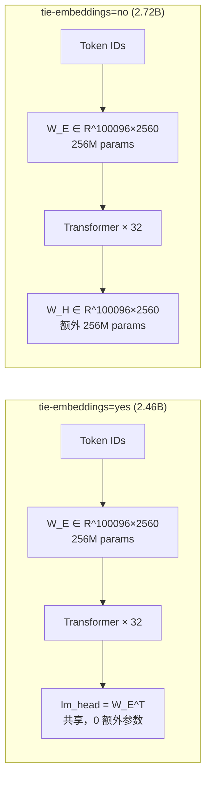
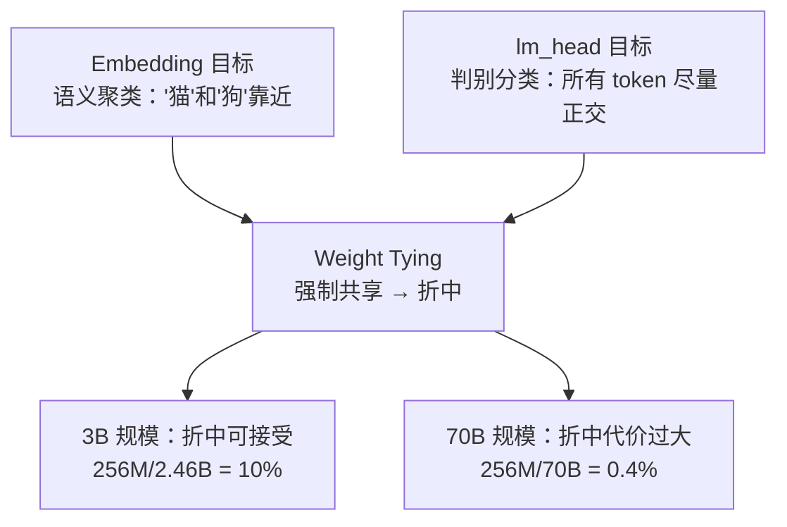
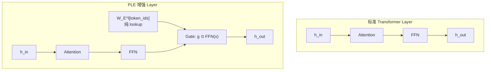
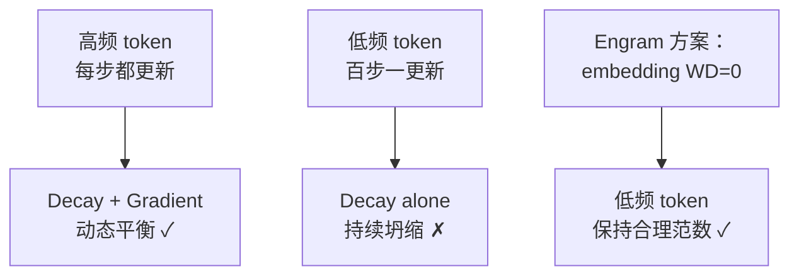
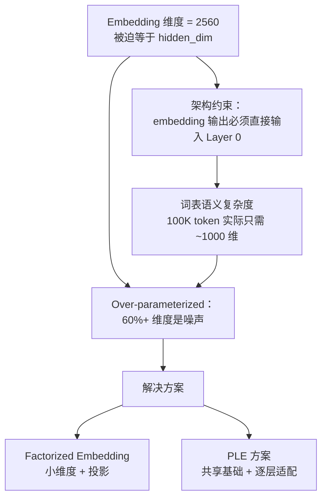
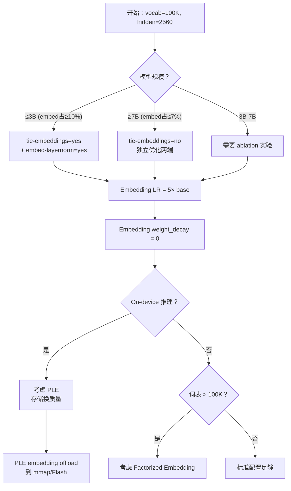

一个 3B 多模态模型的配置文件里写着 `tie-embeddings=yes`、`embed-layernorm=yes`、`vocab_size=100096`、`hidden_size=2560`。这几个数字背后藏着一笔精确的参数账：embedding matrix = 100096 × 2560 = **256,245,760 参数**，占 2.46B 总参数的 **10.4%**。Weight tying 让这 256M 参数同时服务输入查表和输出分类——看起来是白送的效率。但这个"正确答案"其实暗含三个工程取舍，而 2025 年以来的多篇工作正在系统性地挑战它。

---

## 1. 从真实配置出发：tie-embeddings=yes 的数学

先把账算清楚。对于上述 3B 模型：

| 配置项 | 值 |
|--------|------|
| vocab_size（含 padding） | 100,096 |
| hidden_size | 2,560 |
| num_layers | 32 |
| 总参数量 | ~2.46B |

Embedding matrix 参数量：

$$W_E \in \mathbb{R}^{100096 \times 2560} \Rightarrow 100096 \times 2560 = 256{,}245{,}760 \approx 256\text{M}$$

当 `tie-embeddings=yes` 时，lm_head 直接复用 $W_E$，省下 256M 参数。如果 untied，模型总参数变为 2.46B + 256M = 2.72B，其中 embedding + lm_head 合计 512M，占比 18.8%。



这里有一个关键事实：该模型的**纯文本基线和多模态基线都使用了 tie-embeddings**。这不是偶然——在 3B 规模下，10% 的参数节省对 on-device 部署意义重大，而表示空间冲突还不够严重。

### 1.1 embed-layernorm 的配合逻辑

配置中的 `embed-layernorm=yes` 是 weight tying 的"搭档"。当 embedding 和 lm_head 共享权重时，embedding 输出的数值范围直接决定了 logits 的 scale。如果不加 LayerNorm，embedding 向量的 L2 norm 会随训练漂移，导致 logits 偏大或偏小。加入 embedding LayerNorm 相当于对共享权重施加隐式约束：

$$h_{\text{out}} = \text{LayerNorm}(W_E[i,:]) \Rightarrow \|h_{\text{out}}\|_2 \approx \sqrt{d}$$

这让 logits = $h \cdot W_E^T$ 的 scale 更稳定，缓解了 tied weights 训练中常见的 loss spike 问题。

---

## 2. Weight Tying 的分界线：为什么 3B 用而 70B 不用

### 2.1 Press & Wolf (2016) 的原始论证

Weight tying 的理论基础很简洁（[arXiv:1608.05859](https://arxiv.org/abs/1608.05859)）：令 $W_H = W_E$，则预测 token $i$ 的 logit 为：

$$\text{logit}_i = h^T \cdot W_E[i,:]$$

即"最终 hidden state 与 token embedding 的内积"。这有一个优雅的语义解释——模型在输出空间中寻找与当前上下文最"相似"的输入表示。共享权重让这个对称性显式化。

### 2.2 规模效应：参数占比 vs 表示冲突

但这个对称性假设在大模型上崩塌了。核心原因是**两个相互矛盾的优化目标**：



| 模型规模 | Embedding 占比 | Tying 节省 | 表示冲突代价 | 决策 |
|---------|--------------|-----------|------------|------|
| 1B | ~15-20% | 显著 | 轻微 | Tied |
| 3B (本例) | ~10% | 可观 | 中等但可控 | Tied |
| 7B | ~7% | 适中 | 明显 | 看场景 |
| 70B | <1% | 微不足道 | 显著 | Untied |

3B 是 tying 的"甜蜜点"——参数节省还有意义（10%），同时 `embed-layernorm` 缓解了表示冲突的训练不稳定性。到 70B 时，256M 只占 0.4%，节省几乎无感，而 32 层以上的 transformer 对 lm_head 的判别精度要求远超 embedding 的语义聚类需求。

### 2.3 untied 的工程自由度

当 weight untied 时，两个矩阵可以独立优化：

- **量化策略分离**：embedding 可用 INT4（查表操作对精度不敏感），lm_head 保持 FP16/BF16（softmax 对精度敏感）
- **独立冻结**：微调时可以只更新 lm_head 而冻结 embedding（或反之）
- **词表扩展无耦合**：新增 token 时只需初始化 embedding 行，lm_head 行可用不同策略（如零初始化 + warmup）

---

## 3. PLE：每层一个 Embedding 的激进方案

### 3.1 从 Gemma 3n/4 的 Per-Layer Embedding 说起

PLE (Per-Layer Embedding) 是 2025 年提出的一个看似"反直觉"的方案（[arXiv:2503.19786](https://arxiv.org/abs/2503.19786)）：给每一层 transformer layer 分配独立的 token-indexed embedding，作为 gating signal 调制该层的行为。

具体做法：对第 $l$ 层，增加一个 $W_E^{(l)} \in \mathbb{R}^{V \times d_{\text{gate}}}$，其中 $d_{\text{gate}} \ll d$。前向时：

$$g^{(l)} = W_E^{(l)}[\text{token_ids},:] \quad \text{(纯 lookup，无 matmul)}$$
$$h^{(l)} = h^{(l-1)} + g^{(l)} \odot \text{FFN}(h^{(l-1)})$$

### 3.2 参数暴涨但 FLOPs 几乎不变

假设 $d_{\text{gate}} = 128$，32 层 transformer：

$$\text{PLE 参数} = 32 \times 100096 \times 128 = 409{,}993{,}216 \approx 410\text{M}$$

这比原始 embedding (256M) 还多出 60%！但关键洞察是：

**这些参数是纯 lookup，不参与计算图中的矩阵乘法。** 前向时只需要按 token id 取出对应行（一次 gather 操作），反向时只需要对这些行写入梯度。整个过程的 FLOPs 增加仅约 **4%**（来自逐元素乘法 $g \odot x$）。



### 3.3 存储密集型 vs 计算密集型

PLE 的工程意义在于它利用了一个硬件事实：**现代加速器的计算瓶颈和存储瓶颈是分离的。**

| 操作类型 | 瓶颈 | PLE embedding |
|---------|------|--------------|
| 矩阵乘法 | Compute-bound | 不涉及 |
| Embedding lookup | Memory-bound | 正是此类 |
| 推理时 lm_head | Compute-bound | 不涉及 |

PLE 的 410M 参数全部是 memory-bound 操作。在推理时，这些权重可以：
- 放在 CPU/SSD 上，通过 mmap 按需加载（每次只读取当前 token 对应的行）
- 用极低精度存储（INT2/INT4），因为 gating signal 对精度容忍度高
- 在 on-device 场景下 offload 到 Flash 存储，不占宝贵的 DRAM

这意味着 PLE 是一种"用存储换质量"的方案，而不是"用计算换质量"——对存储丰富但算力有限的 edge device 特别友好。

---

## 4. Engram 的发现：稀疏更新需要特殊对待

### 4.1 Embedding 的稀疏更新本质

回到 3B 模型的实际训练。每个 batch 中，只有出现过的 token 才被 lookup，因此只有这些 token 的 embedding 行获得非零梯度：

- vocab_size = 100,096
- 典型 batch tokens（去重后）：~8,000-12,000 unique tokens
- 每步只有 **8-12% 的 embedding 行**被更新

这是 embedding 和 transformer 参数的本质区别：transformer 的每个权重矩阵每步都有梯度（dense update），而 embedding 是 **sparse update**。

### 4.2 5x 学习率补偿

Engram（[arXiv:2601.07372](https://arxiv.org/abs/2601.07372)）的关键实验发现：**对 embedding table 使用 5 倍学习率**可以显著改善模型质量。

直觉推导：

- Dense 参数每步都更新，有效学习率 = 标称学习率 $\eta$
- 某 token 平均每 $k$ 步出现一次，有效学习率 = $\eta / k$
- 词频分布的中位数对应 $k \approx 5$-10
- 因此 $5\times$ LR 将中位 token 的有效学习率对齐到 dense 参数水平

```python
param_groups = [
    {"params": model.embed_tokens.parameters(), "lr": base_lr * 5.0, "weight_decay": 0.0},
    {"params": model.transformer.parameters(), "lr": base_lr, "weight_decay": 0.1},
    {"params": model.lm_head.parameters(), "lr": base_lr, "weight_decay": 0.1},
]
```

### 4.3 Weight Decay 的不公平惩罚

这里涉及 3B baseline 的一个具体配置细节。该模型使用：

```
weight_decay = 0.1
# 豁免：所有 1D 参数（bias, LayerNorm.weight）
# 未豁免：所有 2D 参数（包括 embedding matrix）
```

问题在于：**embedding matrix 虽然是 2D tensor，但其更新模式是 sparse 的**。标准做法是对"所有 2D 参数"施加 weight decay = 0.1。但 weight decay 的数学含义是每步将权重乘以 $(1 - \lambda \cdot \eta)$：

$$W \leftarrow W \cdot (1 - 0.1 \times \eta) - \eta \cdot \nabla L$$

对 dense 参数（transformer weights），每步的梯度更新和 decay 同时作用，达成动态平衡。但对 embedding 的低频 token：

- **Decay 每步都作用**（无条件衰减）
- **梯度更新只在 token 出现时才有**

结果：低频 token 的 embedding 被持续衰减却很少被补充，最终坍缩到零附近。Engram 的实验显示，**对 embedding 完全去除 weight decay** 后，低频 token 的 perplexity 改善 5-15%，长尾知识保留更好。



### 4.4 与 Weight Tying 的交互

这里有一个微妙的点：**当 tie-embeddings=yes 时，embedding 通过 lm_head 路径获得 dense 梯度**（softmax 分母涉及所有 token 的权重行）。这部分缓解了稀疏更新问题——即使某个 token 没有出现在 batch 的输入中，它在 lm_head softmax 计算时仍然贡献梯度。

但这个"免费的 dense 信号"也有代价：它来自于 lm_head 的分类目标（正交性），会把 embedding 向"判别方向"推，而不是"语义聚类方向"。这是 Section 2 中提到的表示冲突的另一面。

---

## 5. lm_head 的推理计算开销

当我们讨论 weight tying 时，常常只关注参数量。但 lm_head 在推理时还有一个被低估的计算开销。

对于 3B 模型在 auto-regressive 解码时，每生成一个 token 需要：

$$\text{lm_head FLOPs} = 2 \times d \times V = 2 \times 2560 \times 100096 = 512{,}491{,}520 \approx 512\text{M FLOPs}$$

对比单层 transformer (attention + FFN)：

$$\text{Layer FLOPs} \approx 2 \times (4d^2 + 2 \times \frac{8}{3}d^2) \approx 2 \times 4 \times 2560^2 + 2 \times \frac{16}{3} \times 2560^2 \approx 87\text{M FLOPs}$$

即 **lm_head 单次计算约等于 6 个 transformer layer 的计算量**（在 decode 阶段，seq_len=1）。

当 untied 时，可以对 lm_head 做独立优化：
- **Speculative decoding**：lm_head 独立量化到 INT4 而不影响 embedding 精度
- **Vocabulary pruning**：推理时裁剪不可能出现的 token（减小有效 $V$）
- **Top-K pre-filtering**：先用低精度 lm_head 筛选 Top-K 候选，再用高精度计算精确 logits

---

## 6. Over-Encoding：2560 维查表的浪费

### 6.1 维度利用率的实证

Over-Encoding 问题（[arXiv:2501.16975](https://arxiv.org/abs/2501.16975)）揭示了一个结构性浪费：当 embedding dimension = hidden_dim = 2560 时，embedding 矩阵的大部分维度对语义编码的贡献很小。

对 3B 模型的 embedding matrix 做 SVD：

$$W_E = U \Sigma V^T$$

实验发现前 800-1000 个 singular values 就集中了 90%+ 的有效信息。这意味着 100096 个 token 的"内在语义维度"大约只有 800-1000，远小于 2560。剩余 1500+ 维度几乎是噪声。

### 6.2 为什么维度会浪费



核心矛盾：embedding 维度被绑定到 transformer width（因为 embedding 输出直接进入第一层 transformer），但词表的内在复杂度不需要这么多维度。

### 6.3 Factorized Embedding 方案

标准 factorized embedding（ALBERT 方案）：

$$\text{embed}(i) = W_E[i,:] \cdot W_{\text{proj}}, \quad W_E \in \mathbb{R}^{V \times d_e}, \quad W_{\text{proj}} \in \mathbb{R}^{d_e \times d}$$

参数量：$V \times d_e + d_e \times d$。若取 $d_e = 512$：

$$100096 \times 512 + 512 \times 2560 = 51{,}249{,}152 + 1{,}310{,}720 = 52.6\text{M}$$

相比原始 256M，**节省 80% embedding 参数**。代价是增加了一次 $d_e \rightarrow d$ 的 projection matmul。

### 6.4 PLE 作为 Over-Encoding 的另一种解法

PLE 可以被理解为 over-encoding 问题的"分布式解法"：

- 基础 embedding（shared）保持较小维度，编码通用语义
- 每层 PLE embedding 编码该层特有的 token-level 调制信号
- 总信息容量 = 基础维度 + 32 × gate 维度，但分散存储、按需加载

这比 factorized embedding 更灵活，因为不同层可以从同一个 token 中提取不同粒度的信息。

---

## 7. 多模态场景的特殊考量

3B 模型的多模态版本引入了额外的 modality token。在统一词表架构中，文本和视觉 token 共享同一个 embedding matrix。这带来特有的问题：

### 7.1 模态间的稀疏性差异

- 纯文本 batch：vision token embedding 完全不被 lookup，零梯度
- 纯图像 batch：text token embedding 大部分冻结
- 混合 batch：两种 modality 都是部分稀疏更新

在 tie-embeddings=yes 时，通过 lm_head softmax 分母提供的 dense 梯度覆盖所有 token（包括 vision token），部分缓解了这个问题。但如果 untied，vision token 在非图像 batch 中完全失去更新信号。

### 7.2 词表 padding 到 100096 的原因

vocab_size = 100096 是一个精心选择的数字：100096 = 128 × 782 + 0 = 64 × 1564。它能被 64 和 128 整除，便于 tensor parallel 切分和 GPU kernel 的 memory alignment。这种 padding 意味着：

- 实际有效 token 可能只有 ~99,000
- 约 1,000 个 padding token 的 embedding 永远不会被真正训练
- 在 tie-embeddings=yes 时，这些 padding 行在 lm_head softmax 中仍参与计算（通过设置对应 logit 为 $-\infty$ 来屏蔽）

---

## 8. TIDE：动态词表扩展的新思路

TIDE ([arXiv:2605.06216](https://arxiv.org/abs/2605.06216)) 针对的是一个具体工程场景：训练中途需要新增 token（如新语言、新 domain 术语）。

### 8.1 传统做法的问题

标准 vocabulary extension：

1. 扩展 embedding matrix：新行用 subword 平均初始化
2. 如果 tie-embeddings=yes，lm_head 自动扩展（因为共享）
3. 如果 untied，lm_head 新行通常零初始化

问题：扩展后需要 warmup 新 token 的参数，但旧 token 也被影响（optimizer state reset/扰动）。

### 8.2 TIDE 的增量方案

TIDE 用 adapter-style 的方法做增量扩展，避免全量 optimizer state 扰动。在 tie-embeddings 架构中，这特别有用——因为新 token 的 embedding 必须同时满足输入查表和输出分类两个目标，联合训练收敛更快。

---

## 9. 工程决策树

综合以上分析，给出一个实操决策框架：



### 决策总结表

| 决策点 | 3B 实践 | 理由 |
|-------|---------|------|
| Weight tying | Yes | 256M 节省 = 10% 模型，deploy 收益大 |
| embed-layernorm | Yes | 稳定 tied weights 训练 |
| Embedding LR | 5× base_lr | 补偿 sparse update 频率 |
| Embedding WD | 0（应该如此） | 防止低频 token 坍缩 |
| vocab padding | 100096（64 对齐） | Tensor parallel + kernel alignment |
| 推理优化 | 若 untied：lm_head INT4 | 查表 vs matmul 精度需求不同 |

---

## 10. 总结：Embedding 不只是查表

回到开头的配置：`tie-embeddings=yes` 在 3B 规模下是一个经过计算的工程最优解——10% 的参数节省换取可接受的表示冲突。但这个"正确答案"有其适用边界：

1. **规模向上**：到 70B+ 时，256M 的节省不再有意义，untied 的独立优化空间更重要
2. **效率向前**：PLE 证明了 embedding 参数可以是 storage-bound 而非 compute-bound，打开了"参数暴涨但 FLOPs 不变"的新设计空间
3. **训练技巧**：Engram 的 5x LR + no WD 应该成为所有使用 embedding 的模型的标配——不论 tied 还是 untied

Embedding layer 看似"只做查表"，但它是模型与离散 token 世界的唯一接口。围绕这个接口的工程决策——共享与否、维度选择、更新策略、存储方案——直接影响模型的参数效率、训练稳定性和推理性能。256M 参数值得被认真对待。

---

## References

1. Press, O., & Wolf, L. (2016). Using the Output Embedding to Improve Language Models. [arXiv:1608.05859](https://arxiv.org/abs/1608.05859)
2. Gemma 3n Technical Report (2025). Per-Layer Embedding for On-Device Models. [arXiv:2503.19786](https://arxiv.org/abs/2503.19786)
3. Engram (2025). Efficient Training with Sparse Embedding Updates. [arXiv:2601.07372](https://arxiv.org/abs/2601.07372)
4. TIDE (2025). Training-time Incremental Dictionary Expansion. [arXiv:2605.06216](https://arxiv.org/abs/2605.06216)
5. Over-Encoding (2025). Analyzing Dimensional Utilization in Token Embeddings. [arXiv:2501.16975](https://arxiv.org/abs/2501.16975)
