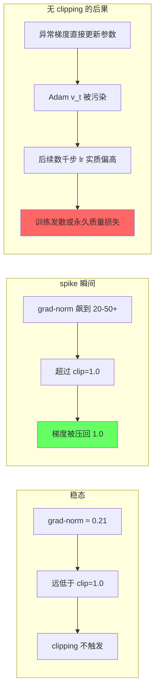
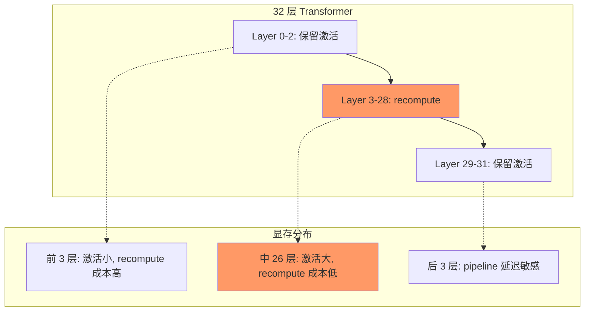
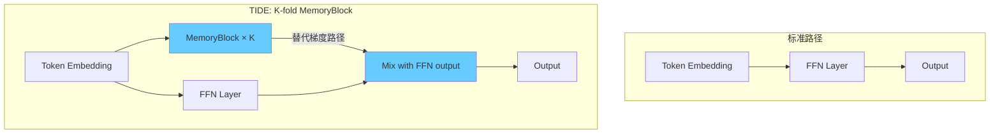
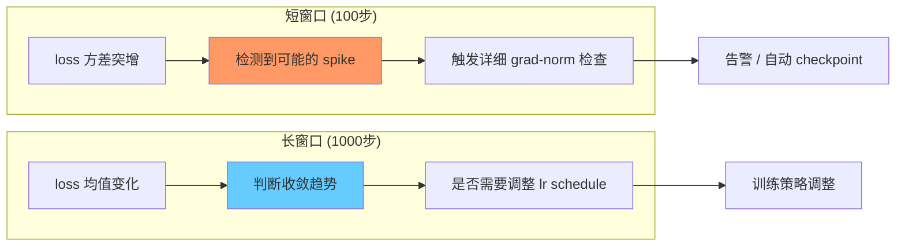
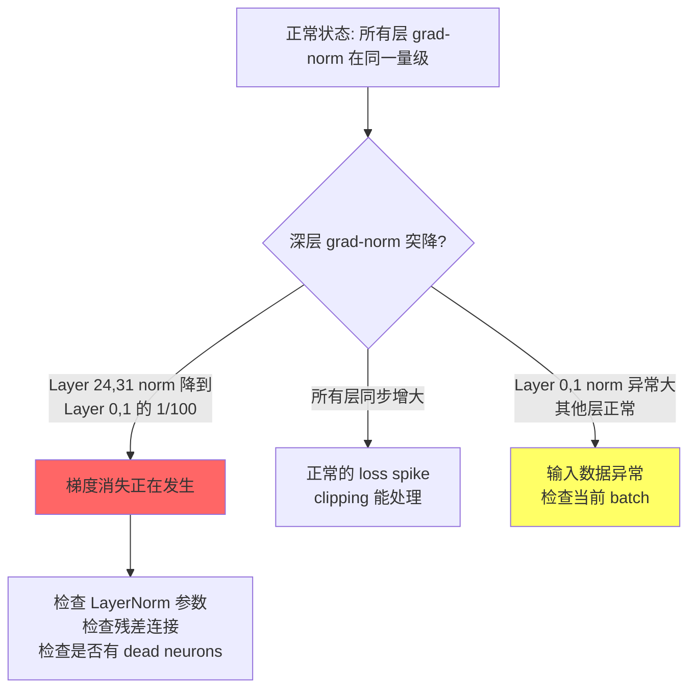
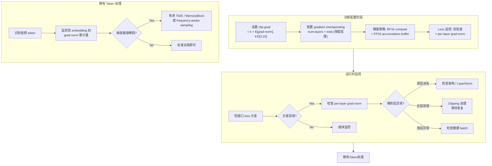

0.6B 对比实验跑了两周，grad-norm 曲线一直稳稳地贴在 0.21 附近。两个结构变体（v3.0 和 v3.5）几乎重合，我一度以为 gradient clipping 这个超参数根本不重要——反正 clip threshold 设的 1.0，norm 才 0.21，差着快 5 倍，clipping 永远不会触发。

直到第 47000 步。

v3.5 结构的 grad-norm 从 0.21 直接拉到 53.7，loss 同步飙升了 2.4 个 nats。clipping 在那一步把梯度压回了 1.0，optimizer state 没有被彻底污染，200 步后 loss 恢复正常。如果没有 clip-grad=1.0 这道保险，那一步的超大梯度会把 Adam 的 second moment 拉偏，后续几千步的有效 learning rate 都会失控。

这次事故让我重新审视了梯度工程的每一个环节。本文从六个真实配置出发，讲清楚每一个梯度相关决策背后的数值逻辑。

---

## 1. Gradient Clipping：平时不干活的 "保险丝"

### 真实数据

3B 模型训练配置：`clip-grad=1.0`（global norm clipping）。

0.6B 对比实验中，v3.0 和 v3.5 两个结构变体的 grad-norm 统计：

| 指标 | v3.0 | v3.5 |
|------|:---:|:---:|
| 稳态 grad-norm 均值 | ~0.21 | ~0.21 |
| 稳态 grad-norm 标准差 | <0.03 | <0.03 |
| Clip threshold | 1.0 | 1.0 |
| 稳态下 clipping 触发率 | ~0% | ~0% |

看起来 clipping 完全是摆设。**但这恰恰是正确的**——一个好的 clip threshold 应该在稳定训练时从不触发，只在异常发生时兜底。

### Loss Spike 时梯度的行为

当 loss spike 发生时，grad-norm 的典型行为是 **10-100x 突增**：



### Clip Threshold 选择的工程逻辑

clip threshold 的选择逻辑其实很清晰：

$$
\text{clip_threshold} = k \times \mathbb{E}[\|g\|_2], \quad k \in [3, 10]
$$

我们的情况：$\mathbb{E}[\|g\|_2] \approx 0.21$，clip=1.0 意味着 $k \approx 4.8$。这是一个合理的安全系数——允许正常的梯度波动，但截断真正的异常值。

**反直觉的坑**：clip threshold 设太低（比如设 0.3，$k \approx 1.4$）会导致 clipping 频繁触发。此时 Adam 的 $v_t$（second moment estimate）追踪的是被 clip 后的梯度方差，而非真实方差，导致 adaptive learning rate 的估计偏差累积，反而引入不稳定。

### Global Norm vs Per-Parameter

3B 模型用的是 global norm clipping（所有参数梯度拼成一个向量算 L2 norm），这是主流选择。原因：

- 保持层间梯度的**相对比例**。Adam 的 momentum 方向依赖于各层梯度的比例关系
- 单一标量就能判断训练健康状态：grad-norm 异常 = 训练出问题

但有一个例外：**多模态训练**。当 ViT encoder 和 LLM backbone 共同训练时，两者的 grad-norm 量级可能差 10-100x。此时 global norm 被 ViT 主导，LLM 部分的梯度信号被等比压缩。解法是分模块独立 clip。

---

## 2. Gradient Checkpointing：为什么只 Recompute 26 层而不是 32 层

### 真实配置

多模态 SFT baseline 的梯度检查点配置：

```
recompute-granularity = full
recompute-method = block
recompute-num-layers = 26  # 总共 32 层
```

三个参数的含义：
- `granularity=full`：每个被选中的 transformer block 的**全部中间激活**都丢弃并在 backward 时重算
- `method=block`：以 transformer block 为单位做 checkpoint（而非更细粒度的 per-operation）
- `num-layers=26`：只对中间的 26 层做 recompute，前 3 层和后 3 层保留激活

### 为什么不是全部 32 层？

这不是偷懒，而是一个精确的工程权衡：

**前几层**的输入 activation tensor 尺寸为 $[B, S, H]$，其中 $H$ 是 hidden size。但前几层紧跟在 embedding 之后，此时的激活值还没经过多次 FFN 扩展，保留它们的显存开销小，但重算它们需要重新做 embedding lookup + positional encoding，成本相对高。

**后几层**紧邻 loss 计算。它们的 backward 最先执行，如果此时还要先 recompute forward，会导致 backward 的启动延迟，影响 pipeline 效率。



### ViT 的独立梯度检查点

在多模态训练中，ViT encoder 使用**动态梯度检查点**（dynamic gradient checkpointing），和 LLM backbone 的策略独立。原因：

- ViT 处理固定分辨率图像，attention score matrix 是 $O(P^2)$（$P$ = patch 数），远小于 LLM 的 $O(S^2)$（$S$ = 文本 seq_len）
- ViT 的 activation 尺寸相对固定，可以精确计算哪些层值得 checkpoint
- 动态策略：根据当前 batch 的实际显存压力决定 checkpoint 哪些层

### 实际显存节省

26/32 层 recompute 的效果：**激活显存节省约 60%**。理论上全部 32 层能省 ~80%，但额外的 20% 收益换来的是更高的重算延迟和 pipeline bubble。这是一个 Pareto 最优点。

每一层 full recompute 增加约 33% 的 FLOPs（forward 被算两次），但由于 GPU 的 compute/memory bound 特性，实际 wall-clock time 增加通常只有 20-25%——因为减少了显存分配/释放的开销，cache utilization 更好。

---

## 3. BF16 精度与 0.6B Iter-time 之谜

### 真实数据

0.6B 对比实验的 iteration time：

| 结构 | hidden_size | num_layers | iter-time |
|------|:---:|:---:|:---:|
| v3.0 | 1536 | 28 | 12.09s |
| v3.5 | 1536 | 28 | 38.32s |
| **慢速比** | — | — | **3.17x** |

两者 hidden_size 和 layer 数完全相同。3.17x 的 iter-time 差异从何而来？

### 结构差异分析

v3.5 引入了结构变化（推测为 gated attention 机制 + 额外的 projection 层）。在 BF16 精度下，这些变化对 iter-time 的影响被 **非线性放大**：

**原因 1：矩阵形状对 Tensor Core 效率的影响**

NVIDIA GPU 的 Tensor Core 对 BF16 matmul 有严格的 tile 对齐要求（通常 16x16 或 32x32）。v3.5 增加的 gate projection 引入了新的矩阵维度，如果这些维度不是 tile size 的整数倍，硬件利用率骤降。

**原因 2：Memory bandwidth bottleneck**

Gated attention 意味着更多的 intermediate tensor（gate value, gated output 等需要额外的 element-wise 操作）。这些操作是 memory-bound 的——BF16 的 2-byte 宽度意味着带宽利用率只有 FP32 的一半大小，但 element-wise 操作本身并不因为精度降低而变快（它们是带宽限制，不是计算限制）。

**原因 3：额外的 kernel launch overhead**

每多一个 projection，就多一次 kernel launch。在 0.6B 这种小模型上，单个 matmul 的计算量不大，kernel launch 的 overhead 占比更高。而大模型（如 3B+）由于单个 matmul 的计算量大，launch overhead 占比可以忽略。

```mermaid
graph TD
    subgraph "v3.0 Forward Pass"
        A1["Q,K,V projection (3 matmul)"] --> B1["Attention"]
        B1 --> C1["Output projection (1 matmul)"]
        C1 --> D1["FFN up (1 matmul)"]
        D1 --> E1["FFN down (1 matmul)"]
    end
    
    subgraph "v3.5 Forward Pass (推测)"
        A2["Q,K,V projection (3 matmul)"] --> B2["Gate projection (1 matmul)"]
        B2 --> C2["Gated Attention"]
        C2 --> D2["Output projection (1 matmul)"]
        D2 --> E2["Gate FFN up (2 matmul: up + gate)"]
        E2 --> F2["FFN down (1 matmul)"]
    end
    
    style B2 fill:#f96
    style E2 fill:#f96
```



### BF16 精度的 Accumulation 陷阱

3.17x 的差异中，还有一部分来自**梯度累加精度**问题。v3.5 更多的 projection 意味着更多的梯度需要累加。BF16 的 7-bit mantissa（有效精度 $\sim 10^{-2}$）在做 gradient accumulation 时：

$$
\text{如果 } |g_{\text{accum}}| \gg |g_{\text{new}}| \times 2^7, \text{ 则 } g_{\text{accum}} + g_{\text{new}} = g_{\text{accum}} \text{ (round-off)}
$$

这意味着**小梯度被 "吞掉"**。解法是 gradient accumulation buffer 保持 FP32，这是标准做法（BF16 compute + FP32 master weights），但会引入额外的 FP32 buffer 内存和 cast 操作。

| 格式 | Mantissa bits | 相对精度 | 动态范围 |
|------|:---:|:---:|:---:|
| FP32 | 23 | $\sim 10^{-7}$ | $10^{38}$ |
| FP16 | 10 | $\sim 10^{-3}$ | $65504$ |
| BF16 | 7 | $\sim 10^{-2}$ | $10^{38}$ |

BF16 不需要 loss scaling（动态范围够大），但精度问题会以更隐蔽的方式影响训练——不是 nan/inf 的显式崩溃，而是**梯度信息的静默丢失**。

---

## 4. TIDE 的梯度频率鸿沟：6 个数量级的不平等

### 问题的量化

Token 频率遵循 Zipf 分布。在典型的大规模预训练中：

| Token 频率区间 | 占词表比例 | 总梯度更新次数 | 典型 token |
|:---:|:---:|:---:|:---|
| Top 1% 高频 | ~1% | ~$10^9$ | "the", "的", 空格, 换行 |
| 中频 | ~20% | ~$10^6$-$10^7$ | 常见名词、动词 |
| 低频 | ~79% | ~$10^3$-$10^5$ | 专业术语, 罕见字, emoji |

**高频 token 与低频 token 的梯度更新次数差距达 6 个数量级**（$10^9$ vs $10^3$）。

### FFN Lipschitz Bound 的结构性限制

TIDE（[arXiv:2605.06216](https://arxiv.org/abs/2605.06216)）指出了一个比更新频率差异更深层的问题：**FFN 的 Lipschitz bound 限制了稀有 token 的可区分性**。

具体来说，对于 FFN 层 $f$：

$$
\|f(e_i) - f(e_j)\| \leq L \cdot \|e_i - e_j\|
$$

其中 $L$ 是 FFN 的 Lipschitz 常数。当两个稀有 token 的 embedding $e_i$ 和 $e_j$ 距离很近时（因为它们都没有被充分训练，还停留在初始化附近），**无论训练多久，FFN 输出的差异都被 $L \cdot \|e_i - e_j\|$ 上界约束**。

这意味着：对于结构上相似的稀有 token（比如同一领域的不同专业术语），即使给无限训练数据，标准的 transformer 结构也无法区分它们。这不是数据量的问题，是**架构的结构性缺陷**。

### TIDE 的解法：K-fold MemoryBlock

TIDE 的核心思想是为稀有 token 提供**替代梯度路径**：



K-fold MemoryBlock 的设计要点：

1. **独立参数化**：MemoryBlock 有独立的参数，不受 FFN Lipschitz bound 约束
2. **稀疏激活**：只有稀有 token 路由到 MemoryBlock（通过 frequency-aware gating）
3. **K-fold 冗余**：K 个 MemoryBlock 提供多条梯度路径，确保即使某条路径的梯度为 0，其他路径仍能提供更新信号

效果：结构相似的稀有 token 通过不同的 MemoryBlock 路径获得差异化的表征，绕过了 FFN Lipschitz bound 的限制。

### Adam 的 Dead Momentum 问题

稀有 token 还面临 optimizer 层面的问题。Adam 的 second moment：

$$
v_t = \beta_2 v_{t-1} + (1-\beta_2) g_t^2
$$

对于长时间不更新的参数（稀有 token 的 embedding 行），$v_t$ 通过 $\beta_2$ 的指数衰减趋近于 0。当这个 token 突然出现并产生梯度 $g_t$ 时：

$$
\text{effective step} = \frac{g_t}{\sqrt{v_t} + \epsilon} \approx \frac{g_t}{\epsilon} \quad (\text{极大})
$$

一次超大的 step 可以把 embedding 推到完全错误的位置。这就是 "dead momentum" 现象——越不更新，突然更新时越危险。

---

## 5. Loss 监控的双粒度设计

### 真实配置

训练框架的 loss 监控配置：

```
v-loss-meanvar-interval-1 = 1000  # 每 1000 步计算一次长窗口均值/方差
v-loss-meanvar-interval-2 = 100   # 每 100 步计算一次短窗口均值/方差
v-urlog-filter-layers = 0,1,8,16,24,31  # 监控这些层的梯度 norm
```

### 为什么需要双粒度？

两个不同粒度的 loss 统计窗口解决不同的问题：

**长窗口（1000 步）**：
- 检测**趋势性偏移**（loss 是否还在下降、收敛速度是否在放缓）
- 计算 loss 的 running mean 和 variance，提供 baseline
- 触发宏观决策（是否该调 lr、是否该进入下一阶段）

**短窗口（100 步）**：
- 检测**突发异常**（loss spike、sudden divergence）
- 短窗口的 variance 突增往往先于 loss 均值的明显偏移
- 100 步 ≈ 几分钟到十几分钟（取决于 batch size），能实现近实时告警



### Per-layer Gradient Norm 监控

配置 `v-urlog-filter-layers=0,1,8,16,24,31` 监控 6 个层的 gradient norm。这些层的选择有讲究：

- **Layer 0, 1**（最浅层）：直接连接 embedding，能反映输入数据质量异常
- **Layer 8, 16, 24**（等间距中间层）：覆盖模型深度方向的梯度传播情况
- **Layer 31**（最深层）：最接近 loss，梯度信号最强，也最先反映 loss landscape 的变化

### 梯度消失的早期检测

Per-layer 监控的最大价值是**在 loss 异常之前发现梯度消失**：



经验法则：如果深层（Layer 24+）的 grad-norm 持续低于浅层（Layer 0-1）的 1/10，说明梯度信号在传播过程中被过度衰减。这通常不会立即反映在 loss 上——loss 可能还在缓慢下降，但模型深层已经 "停止学习"，最终表现为 downstream eval 上不去。

---

## 6. Gradient Noise Scale：Batch Size 调优的定量信号

### 理论框架

Gradient noise scale（GNS）定义为（McCandlish et al., [arXiv:1812.06162](https://arxiv.org/abs/1812.06162)）：

$$
B_{\text{noise}} = \frac{\text{tr}(\Sigma)}{\|G\|^2}
$$

其中 $G$ 是真实梯度期望，$\Sigma$ 是 mini-batch gradient 的协方差矩阵。直觉：

- $B_{\text{noise}} \gg B_{\text{actual}}$：当前 batch size 太小，梯度以噪声为主，增大 batch size 有显著收益
- $B_{\text{noise}} \approx B_{\text{actual}}$：最优区间，性价比最高
- $B_{\text{noise}} \ll B_{\text{actual}}$：batch size 过大，浪费计算

### 与 Loss Spike 的关系

GNS 是 loss spike 的**前兆指标**。在 spike 发生前 50-200 步，GNS 往往已经开始增大——因为梯度方差增大先于 loss 均值的偏移。

结合前面的双粒度监控，一个完整的异常检测链条是：

$$
\text{GNS 增大} \xrightarrow{50-200 \text{ steps}} \text{短窗口方差增大} \xrightarrow{10-50 \text{ steps}} \text{Loss spike}
$$

如果在 GNS 增大阶段就介入（比如临时降低 lr 或增大 batch size），很多 spike 是可以预防的。

### 实用估计方法

真实的 $G$ 和 $\Sigma$ 无法直接算，但可以用两组独立 mini-batch 估计：

$$
\hat{B}_{\text{noise}} \approx \frac{B \cdot \|g_1 - g_2\|^2}{2\|g_1 + g_2\|^2}
$$

其中 $g_1, g_2$ 是两个独立 mini-batch 的梯度，$B$ 是 mini-batch size。这个估计的 overhead 很小：只需要在少量步骤上多算一次 forward-backward。

### 训练阶段与 GNS 的变化


这解释了为什么很多大模型训练采用 **batch size warmup**：早期小 batch（GNS 小，信号已经够强），后期逐步增大（GNS 增大，需要更多 sample 来获得准确的梯度方向）。

---

## 把六个细节拼起来：梯度工程的决策树



最后一个经验总结：**梯度相关的问题分为 "急性" 和 "慢性" 两类**。

- **急性**：loss spike、nan/inf、训练发散。这些有明确的信号，clipping + 监控 + checkpoint 回滚可以应对
- **慢性**：BF16 精度丢失、稀有 token 欠训练、深层梯度消失。这些不会让训练 crash，但会静默地让最终模型质量下降 2-5 个百分点。你可能永远不知道是哪里的问题——直到你把 per-layer grad-norm 日志翻出来看

梯度不只是优化方向的载体。它是一个需要被精心工程化的数值对象——精度、裁剪、检查点、监控粒度，每一个决策都在影响最终模型的上限。

---

## 参考文献

1. **TIDE: Training with Importance-based Data Enrichment** — 揭示 token 频率差异导致的 Lipschitz bound 结构性限制，提出 K-fold MemoryBlock 解法。[arXiv:2605.06216](https://arxiv.org/abs/2605.06216)

2. **Mixed Precision Training** (Micikevicius et al., 2018) — 混合精度训练的奠基性工作，提出 loss scaling 机制解决 FP16 underflow 问题。[arXiv:1710.03740](https://arxiv.org/abs/1710.03740)

3. **An Empirical Model of Large-Batch Training** (McCandlish et al., 2018) — 提出 gradient noise scale 概念，建立 batch size 与训练效率的定量关系。[arXiv:1812.06162](https://arxiv.org/abs/1812.06162)

4. **Training Deep Nets with Sublinear Memory Cost** (Chen et al., 2016) — Gradient checkpointing 原始论文，分析计算-显存 trade-off 的理论边界。[arXiv:1604.06174](https://arxiv.org/abs/1604.06174)
