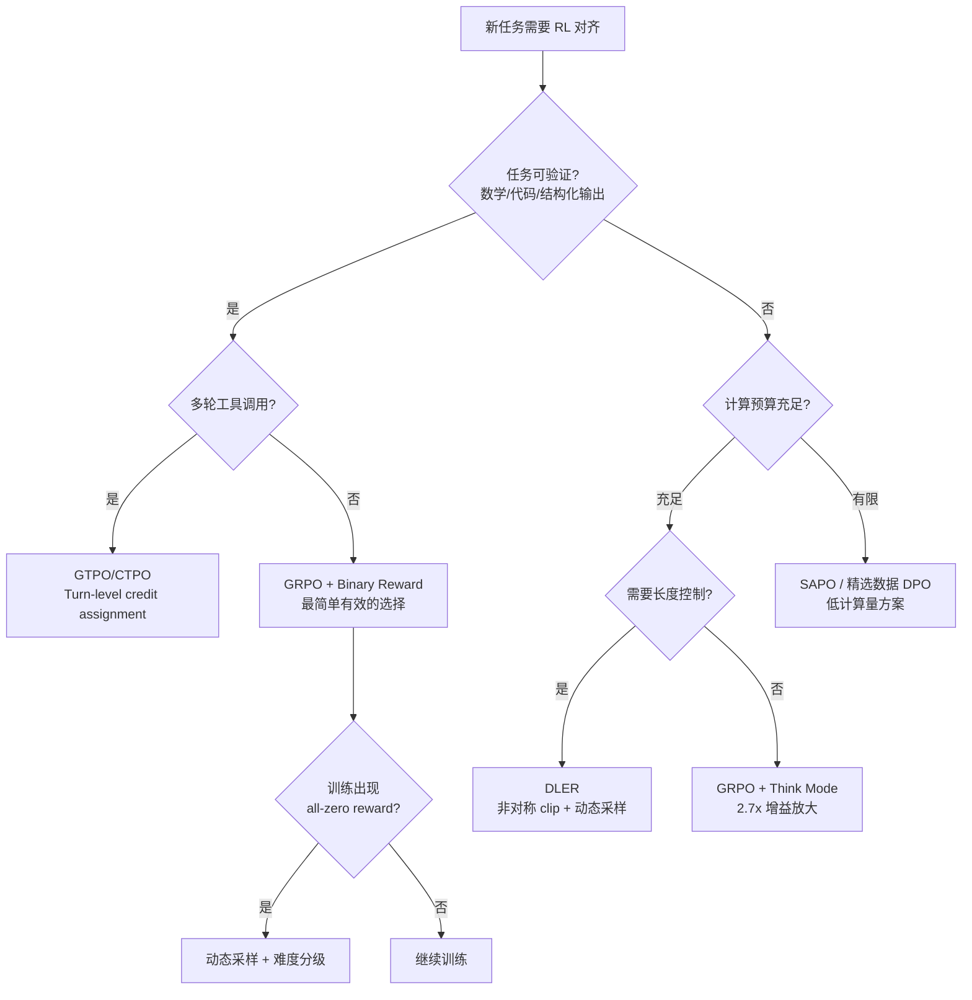

## 开场：30 条数据的奇迹

先看一组让人不太敢信的实验数据：

| 模型 | 规模 | 方法 | Stage | AIME24 | AIME25 | AMC23 | MATH500 | Avg |
|------|------|------|-------|--------|--------|-------|---------|-----|
| Base (R1-Distill) | 1.5B | — | — | 28.8 | 21.8 | 62.9 | 83.9 | 48.1 |
| + CoRT GRPO RL | 1.5B | 30 samples | RL | 43.1 | 30.2 | 73.8 | 87.3 | 58.3 |
| Base (R1-Distill) | 32B | — | — | 72.9 | 59.0 | 88.8 | 94.3 | 77.5 |
| + CoRT Hint-RFT | 32B | 30+800 | RFT | 76.7 | 67.1 | 94.4 | 95.1 | 81.3 |

没有打错——仅用 30 条人工精心构造的样本，对一个 1.5B 参数的小模型做 GRPO 强化学习，AIME24 数学竞赛得分从 28.8 拉到 43.1，全指标平均从 48.1 飙到 58.3（+10.2）。32B 模型用 Hint-RFT 方案同样从 77.5 涨到 81.3。这项工作来自 CoRT (Chain of Reasoning with Tools) [1]，被 NeurIPS 2025 接收。

### Hint Engineering：不是教数学，是教"何时信任工具"

这 30 条样本不是随机选的数学题答案。它们是人工在模型的推理轨迹中**精确定位 pathological behaviors**后构造的：

**病态行为 1 — Delayed Code Computation（延迟计算）**：模型用自然语言长篇手算了 50 行，然后才补一句 'let me verify with code'。hint 插入时机：在模型第一次尝试手算复杂数值时，立即插入 '这个计算用 code interpreter 更可靠'。

**病态行为 2 — Code Result Distrust（结果不信任）**：code interpreter 已返回正确数值 `answer = 42`，模型却花 30 行重新手算验证。hint 插入时机：在 CI 返回结果后，插入 '数值已由确定性计算得出，无需手动复核'。

这就是所谓的 **hint engineering**——不是教模型数学，而是教模型'何时该信任工具'。RL 的作用是让这些行为内化为策略，而不是每次都需要外部 hint。

### Token 效率：更准确，也更高效

CoRT 的另一个亮点是 **token 效率**：
- 32B Hint-Engineering-RFT 与某强 baseline 达到同等精度，但 token 用量 7K vs 14K（-50%）
- 1.5B RL 版本相对纯 NL CoT 减少约 50% token

这揭示了一个关键洞察：RL 训练后的模型不仅更准确，还更高效——因为它学会了在该用工具时立即调用，而不是先手算再验证。

### 核心范式转变

这些数据点指向 2025-2026 年 RL for LLM 的三个范式转变：
1. **数据效率革命**：30 条精心设计 > 30000 条随机数据
2. **干预精度 > 覆盖广度**：在 pathological behavior 的精确位置做 hint > 全面 SFT
3. **小模型 + 工具 > 大模型纯推理**：1.5B + CI (58.3) vs 1.5B pure CoT (48.1)

---

## 一、GRPO 核心机制与优缺点

### 1.1 原理速览

Group Relative Policy Optimization (GRPO) [2] 的核心思想极简：

1. 对每个 prompt，采样 K 条响应（通常 K=8~64）
2. 用 reward model 或规则打分
3. 用组内统计量（均值、标准差）作为 baseline
4. 高于均值的响应获得正向梯度，低于均值的获得负向梯度

```
advantage_i = (reward_i - mean(rewards)) / std(rewards)
```

相比 PPO 需要单独训练一个 critic model 来估计 value function，GRPO 直接用同 batch 的统计量替代 baseline，**省去 critic 模型的显存和计算开销（约 50%）**。

### 1.2 Binary Reward 的意外有效性

一个反直觉的发现：对于 instruction following 类任务，最简单的 0/1 binary reward（完全正确=1，否则=0）效果出奇地好。原因在于：

- 指令遵循本质是"做到 or 没做到"，连续 reward 信号反而引入噪声
- Binary reward 避免了 reward model 的 calibration 问题
- 梯度信号虽然稀疏，但方向极其明确

### 1.3 Think Mode 的 2.7x 放大效应

在某些实验中，开启 think mode（让模型在生成答案前先输出思考过程）可将 RL 增益放大约 2.7 倍。机制分析：

- Thinking trace 中自然出现 self-verification 行为
- RL 奖励信号可以直接强化"检查一遍再回答"的行为模式
- 等价于免费获得一个 self-consistency 式的推理增强

### 1.4 GRPO 的短板

| 短板 | 具体表现 | 影响场景 |
|------|---------|---------|
| Trajectory-level reward | 只知道整条响应的好坏，不知道哪一步出了问题 | 多步推理、工具调用 |
| 组内方差依赖 | 如果所有响应都对/都错，梯度为零 | 简单/极难 prompt |
| 长序列偏好 | 更长的响应有更多 token 分摊梯度 | 需要简洁输出的任务 |

---

## 二、SAPO — Self-Aligned Policy Optimization

### 2.1 DPO 的困境

Direct Preference Optimization (DPO) 看起来优雅——直接从偏好对学习，不需要 reward model。但实践中有一个致命问题：**distribution mismatch**。

训练数据中的 chosen/rejected 对通常由其他模型生成，与当前策略的分布差距越来越大。结果是：
- 训练 loss 下降，但实际表现可能不升反降
- 在某实验中，DPO 在 instruction following 上直接 **掉了 2.0 分**

### 2.2 SAPO 的解法

Self-Aligned Policy Optimization 的核心 insight：

> 用模型自己的 generation 同时作为 positive 和 negative examples。

具体流程：
1. 对同一 prompt，让当前策略生成多条响应
2. 用 verifier 或规则判断正确性
3. 正确的作为 chosen，错误的作为 rejected
4. 用 DPO 式的目标函数优化

这样做的好处：
- **完全 on-policy**：所有数据都来自当前策略，无分布偏移
- **计算量低于 GRPO**：不需要大组采样（K=2~4 即可）
- **适合已经较强的 base model**：只需修正少数错误模式

### 2.3 适用场景

SAPO 最适合以下条件的交集：
- 计算预算有限（无法支持 K=64 的 GRPO）
- 单轮任务（多轮工具调用需要更细粒度的 credit assignment）
- Base model 已经 reasonably strong（有足够概率生成正确答案）

---

## 三、veRL 框架实战

### 3.1 为什么需要专用 RL 框架

LLM 的 RL 训练与传统 RL 有本质区别：
- 单次 rollout 可能需要数千 token 的 autoregressive generation
- 不同 prompt 的 response 长度差异巨大（10x 甚至 100x）
- GPU 利用率被最长序列绑架

veRL 是目前最活跃的开源 LLM RL 框架之一，专门解决这些问题。

### 3.2 核心特性

**Fully-Async Rollout**：生成和训练完全异步。生成侧用 vLLM 做高吞吐推理，训练侧用 FSDP/DeepSpeed 做梯度更新，两者通过 shared memory 通信。

**Partial Rollout**：不等所有序列生成完毕就开始训练。传统做法是一个 batch 内所有序列都完成后才计算 loss，这意味着你要等最慢的那条 8000 token 响应。Partial rollout 允许先用已完成的序列开始训练。

**Chunk-wise Rollout**：这是 MiniCPM4 [9] 引入的关键优化——

将变长轨迹切成固定大小的 chunk，每个 chunk 独立计算 reward 和 advantage。效果：
- Step time 降低 **41%**
- AIME24 额外提升 **+1.88**（因为更均匀的梯度信号）

### 3.3 工程配置要点

```yaml
# veRL 典型配置片段（示意）
rollout:
  engine: vllm
  max_concurrent: 1024
  chunk_size: 512
  partial: true

training:
  algorithm: grpo
  group_size: 16
  kl_coeff: 0.01
  clip_range: 0.2
```

关键参数选择：
- `group_size`：8~64，越大 baseline 越稳，但显存线性增长
- `kl_coeff`：0.001~0.05，防止策略跑偏太远
- `chunk_size`：需要 profile，太小增加通信开销，太大回到原来的问题

---

## 四、算法选型决策树

面对一个新任务，如何选择 RL 算法？以下是实战验证的决策路径：



### 决策要点补充

| 场景 | 推荐算法 | 关键理由 |
|------|---------|---------|
| 数学/代码（可自动验证） | GRPO + binary reward | 信号清晰，无需 RM |
| 多轮 Agent（工具调用） | GTPO / turn-level RL | 需要 step-level credit |
| 开放式对话 | RLHF (PPO) / DPO | 需要 preference model |
| 指令遵循 | GRPO + think mode | Binary reward + 思考链 |
| 端侧小模型（<3B） | CoRT-style 少样本 RL | 30-400 样本即可 |
| 长度敏感输出 | DLER [3] | 非对称 clip 避免过长 |

---

## 五、工程陷阱

### 5.1 Same-family Judge = Reward Hacking

用同系列模型做 judge（比如用 7B 版本给 1.5B 版本打分），训练 reward 看起来一直涨，但实际 eval 在掉。原因：同系列模型共享 bias，RL 会 exploit 这些 bias 而非真正提升能力。

**解法**：用不同架构 / 不同训练方式的模型做 judge，或直接用规则验证。

### 5.2 DPO 伤害 Instruction Following

在某实验中 [4]，DPO 在 instruction following benchmark 上直接 **-2.0 分**。原因分析：
- DPO 倾向于让模型避免 rejected response 的所有特征
- 如果 rejected response 只是格式错误但内容正确，模型会连内容一起回避
- 本质是 off-policy 数据的 spurious correlation

### 5.3 All-Zero Reward Batches

当 prompt 太难（所有 K 条响应都错）或太简单（都对）时，组内标准差为零，梯度消失。

**解法**：
- Dynamic sampling：根据历史 reward 分布动态调整 prompt 难度
- Curriculum：先易后难，逐步提升
- Mixed batch：确保每个 batch 包含不同难度的 prompt

### 5.4 PPO Clip 与高熵 Token

PPO 的对称 clip（上下都 clip 到 1±ε）在高熵 transition token（如推理步骤之间的换行、连接词）上会杀死梯度。这些 token 的 action probability 本身就很分散，稍有更新就触发 clip。

DLER [3] 的解法：**非对称 clip**——对长度惩罚方向用更宽的 clip range，对长度奖励方向用更窄的 clip，实现"允许缩短，限制拉长"。

---

## 六、端侧 RL 的特殊考量

对于 ≤3B 参数的端侧模型，RL 训练有独特的优势和约束：

### 6.1 少样本 RL 的可行性

CoRT [1] 证明 30 条样本足够让 1.5B 模型获得显著提升。更多证据：

| 方法 | 模型规模 | 训练数据量 | 提升幅度 |
|------|---------|-----------|---------|
| CoRT [1] | 1.5B | 30 samples | AIME24 +14.3 |
| Environment Tuning [8] | 7B | 400 instances | 工具调用 +显著 |
| Tool-R0 [6] | 1.5-7B | 0 (self-play) | +92.5% relative |
| ICRL [7] | 7B | 0 (few-shot context) | 从零学会工具格式 |

### 6.2 Zero-Data 方案

**Tool-R0** [6]：完全不需要外部训练数据。模型通过 self-play 与环境交互，自己生成训练信号。核心循环：
1. 模型尝试调用工具
2. 环境返回执行结果
3. 最终答案正确 → 正向奖励，错误 → 负向
4. GRPO 更新策略

在工具调用任务上达到监督学习 baseline 的 192.5%（即 92.5% relative improvement）。

**ICRL** [7]：In-Context Reinforcement Learning，完全不依赖 SFT 阶段。通过在 prompt 中提供 few-shot 示例定义工具调用格式，然后纯 RL 训练让模型学会使用工具。证明了"SFT 不是 RL 的前置条件"。

### 6.3 端侧 RL 的工程建议


关键原则：
1. **数据质量 >> 数量**：30 条 > 30000 条低质量数据
2. **Binary reward 优先**：复杂 RM 在小模型上容易过拟合
3. **Think mode 必开**：小模型更需要显式推理链
4. **Chunk-wise rollout**：小模型生成快，chunk 带来的加速比例更大

---

## 总结

2025-2026 年 RL for LLM 的格局已经从"谁的 GPU 多"演变为"谁的干预更精准"。核心 takeaway：

1. **GRPO 是默认选择**——简单、省显存、binary reward 即可
2. **少样本 RL 是真实的**——30 条数据 +14.3 分不是 cherry-pick
3. **Think mode 是免费午餐**——2.7x 放大效应，无额外训练成本
4. **DPO 不万能**——在 instruction following 上可能适得其反
5. **框架选型影响巨大**——chunk-wise rollout 同时省时间又提精度

---

## References

- [1] CoRT: Chain of Reasoning with Tools, [arXiv:2510.20342](https://arxiv.org/abs/2510.20342) (NeurIPS 2025)
- [2] DeepSeek-R1: Incentivizing Reasoning in LLMs via RL (GRPO), [arXiv:2501.12948](https://arxiv.org/abs/2501.12948)
- [3] DLER: Efficient Length-Controlled Generation via RL, NVIDIA, [arXiv:2510.15110](https://arxiv.org/abs/2510.15110)
- [4] OpenWebRL: Training LLM Web Agents via Online RL, [arXiv:2606.02031](https://arxiv.org/abs/2606.02031)
- [5] veRL / SLIME: Scalable RL Training Framework for LLMs
- [6] Tool-R0: Zero-Data Self-Play RL for Tool Calling, [arXiv:2602.21320](https://arxiv.org/abs/2602.21320)
- [7] ICRL: In-Context Reinforcement Learning for Tool Use, [arXiv:2603.08068](https://arxiv.org/abs/2603.08068)
- [8] Environment Tuning: LLM Tool Calling via Environment Learning, [arXiv:2510.10197](https://arxiv.org/abs/2510.10197)
- [9] MiniCPM4: Ultra-Efficient LLM with Chunk-wise Rollout, [arXiv:2506.07900](https://arxiv.org/abs/2506.07900)
- [10] Qwen3 Technical Report, [arXiv:2505.09388](https://arxiv.org/abs/2505.09388)
