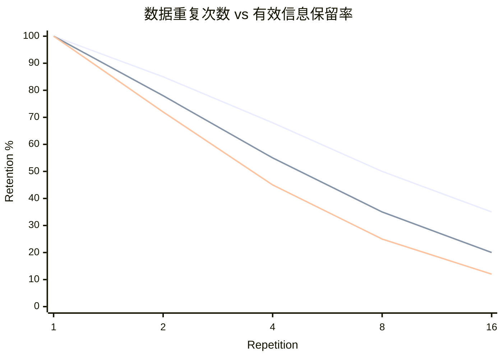
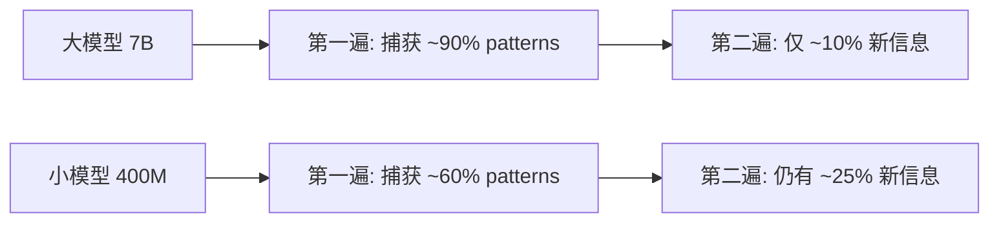

7B 模型把训练数据重复 8 次，有效信息只剩 25%。同样的数据重复 8 次给 400M 模型，保留 50%。大模型比小模型对重复更敏感——这颠覆了"大模型能从数据中学到更多"的直觉。

InfoLaw 提出了一个统一的信息论框架，量化了数据重复、数据质量和模型规模三者之间的交互关系。核心发现：repetition decay 不是常数，而是模型规模的递增函数。模型越大，重复数据的边际信息量衰减越快。

## 有效信息保留率：模型规模的反直觉效应

直接看数据：

| 重复次数 | 400M 保留率 | 1.3B 保留率 | 7B 保留率 |
|---------|------------|------------|----------|
| 1x | 100% | 100% | 100% |
| 2x | 85% | 78% | 72% |
| 4x | 68% | 55% | 45% |
| 8x | 50% | 35% | 25% |
| 16x | 35% | 20% | 12% |

8x repetition 时，400M 保留 50% 有效信息，7B 只剩 25%——大模型的信息衰减是小模型的 2 倍。到 16x repetition，7B 模型只剩 12% 有效信息，几乎等于在烧 GPU 却什么都没学到。

三条曲线从上到下分别对应 400M、1.3B、7B。模型越大，曲线下降越陡峭。

## 为什么大模型对重复更敏感？

信息论解释非常清晰：

**大模型 = 大容量硬盘。** 一个 7B 模型有足够的 capacity 在第一遍就捕获 common patterns 和 rare patterns。第二遍数据进来时，common patterns 已经饱和（提供零边际信息），rare patterns 也大部分被学会了。重复数据对它来说几乎是"重读一本已经背熟的书"。

**小模型 = 小容量硬盘。** 一个 400M 模型在第一遍根本装不下所有 patterns。它被迫在 common patterns 和 rare patterns 之间做取舍。第二遍数据进来时，那些第一遍被"丢弃"的 patterns 还有机会被学到。重复对它来说是"再看一遍笔记，补上漏掉的内容"。

类比：一个 1TB 硬盘复制一个 500GB 数据集两次，第二份完全是浪费空间。但一个 256GB 硬盘第一次只能装下一部分，第二次有机会换一批数据进来（通过 gradient update 重新分配 capacity）。

这个现象的本质是 **information saturation rate** 与 model capacity 正相关：

## 数据质量权重：不是所有 token 都平等

InfoLaw 引入 quality weight 来量化不同数据源的信息密度：

| 数据来源 | quality_weight | 含义 |
|---------|---------------|------|
| 高质量教材 | 1.8-2.2 | 信息密度最高 |
| 代码 | 1.5-1.8 | 结构化知识 |
| Wikipedia | 1.3-1.5 | 知识密集 |
| 清洗后的 web 数据 | 1.0 | 基准线 |
| 低质量 web 数据 | 0.4-0.7 | 噪声多 |

教材与低质量 web 数据之间有 **5 倍**的信息密度差异。这意味着 1 token 教材 ≈ 5 tokens 低质量网页。但这个权重在重复场景下不能简单叠加——重复教材的信息衰减同样遵循 model-size-dependent decay。

## 统一预测公式：InfoLaw

InfoLaw 把所有因素统一到一个预测框架中：

$$L(N, D, w, r) = L_{\infty} + \frac{A}{N^{\alpha}} \cdot \varphi(D_{\text{eff}})$$

其中有效数据量的计算纳入了质量权重和重复衰减：

$$D_{\text{eff}} = \sum_i w_i \cdot D_i \cdot h(r_i, N)$$

关键在 $h(r, N)$——repetition decay function **依赖模型规模 N**。这不是一个 global constant，而是随 N 增大而更快衰减的函数。这是 InfoLaw 区别于以往 scaling law 工作的核心创新。

### 预测精度

| 预测场景 | 平均误差 | 最大误差 |
|---------|---------|---------|
| 已知 mix，新 scale (7B/425B tokens) | 0.12% | 0.85% |
| 新 mix，已知 scale (1.3B/100B tokens) | 0.15% | 0.96% |
| 新 mix + 新 scale (7B/425B tokens) | 0.18% | 1.2% |

所有场景 sub-1% prediction error，包括外推到 7B/425B tokens 的未见配置。这个精度足以支撑实际的 training budget 决策。

## 实践指导：何时重复 vs 何时补充新数据

四条核心规则：

**规则一：7B+ 模型，高质量数据重复不超过 4x。** 超过 4x 后信息保留率跌破 50%，compute efficiency 急剧下降。

**规则二：400M 边缘模型可以安全重复 8-10x。** 小模型对重复的容忍度高得多，在数据稀缺场景下这是可行策略。

**规则三：新数据 > 重复旧数据（即使质量更低）。** 数学上：$0.7 \times 8$ fresh tokens 的有效信息量 > $2.0 \times 1$ token repeated 8x。quality_weight 0.7 的唯一数据乘以 8 份，远胜于 quality_weight 2.0 的数据重复 8 次。

**规则四：overtraining ratio 必须折算重复惩罚。** 业界常说"200x overtraining"（tokens/params = 200），但这假设所有 token 都是 unique data。如果实际训练集有 4x repetition，对 7B 模型来说有效 overtraining ratio 只有约 $200 \times 0.45 = 90$，远低于预期。

## Calibration 方法论：用小实验换大节省

InfoLaw 的实用价值在于它的 calibration cost 极低：

1. **5-10 个小规模实验**（≤1B 模型）标定各数据源的 quality_weight
2. **3-5 组 repetition rate 对比**拟合 decay function 参数
3. 总 calibration 成本：完整训练的极小比例（通常 <1%）
4. 标定完成后，外推到任意规模，误差 <1%

这是一个 **invest once, predict everywhere** 的框架。花 1% 的 compute budget 做小实验，就能预测 100x 规模训练的最终 loss，从而做出 data mix 和 repetition 策略的最优决策。

## 工程决策清单

基于 InfoLaw 的发现，overtraining 决策应考虑以下因素：

| 决策维度 | 传统做法 | InfoLaw 指导 |
|---------|---------|-------------|
| 数据不够时 | 重复现有数据 | 优先补充低质量但 unique 的数据 |
| 大模型数据策略 | 与小模型相同 | 大模型需要更多 unique data，重复预算更紧 |
| Overtraining 计算 | tokens / params | $D_{\text{eff}}$ / params（折算质量和重复） |
| 质量 vs 数量 | 质量优先 | 取决于重复次数——高重复下数量优先 |
| 预算分配 | 直觉或 grid search | 小实验标定 → 公式外推 |

最反直觉的结论：当你的 7B 模型已经把高质量数据看过 4 遍时，与其继续重复这些"黄金数据"，不如去爬更多质量一般但从未见过的网页。**Novelty beats quality when repetition is high.**

## References

- InfoLaw: An Information-Theoretic Framework for Training Data Attribution in Language Models. [arXiv:2605.02364](https://arxiv.org/abs/2605.02364), CMU, 2026.
