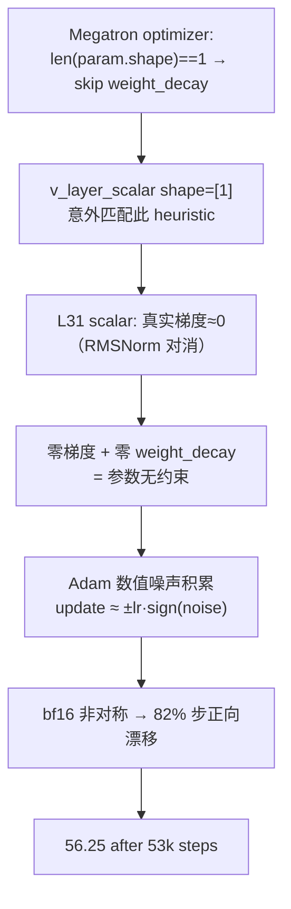

某 3B 模型训练到 Stage2 结束，例行检查参数分布时发现最后一层的 learnable scalar 从初始 1.0 漂移到了 56.25。但训练 loss 和所有评测指标完全没有任何异常。这个参数在"假装学习"——而且会在端侧 INT4 量化时致命。

这篇文章记录完整的排查过程：从发现现象、定位根因、理解数学原理，到三次修复尝试（两次失败），最终给出一个三文件改动的干净解。

---

## 1. 现象：32 层中只有最后一层失控

模型结构：32 层 Transformer，每个 block 的 residual path 上有一个 learnable layer scalar（`shape=[1]`），用于控制该层残差的缩放幅度。Stage1 预训练结束时的参数分布：

| Layer | scalar 值 | 状态 |
|:-----:|:---------:|:----:|
| L0 | 0.656 | 正常收敛 |
| L1-L14 | 0.3-0.8 | 正常收敛 |
| L15 | 0.197 | 正常收敛 |
| L16-L29 | 0.4-1.1 | 正常收敛 |
| L30 | 1.203 | 正常收敛 |
| **L31** | **56.25** | **单调漂移，未收敛** |

关键观察：
- L0-L30 全部稳定在 0.2-1.3 范围内
- L31 从初始值 1.0 出发，**单调递增**，无任何收敛趋势
- 训练 loss 曲线完全平滑，没有任何扰动
- 所有下游评测指标无异常

直觉上这不可能——一个参数在"学习"但对 loss 没有任何影响？

---

## 2. 为什么 Loss 纹丝不动：RMSNorm 的完美对消

L31 的特殊之处在于：它是最后一层 Transformer block。L31 的输出直接进入 `final_layernorm`（RMSNorm），然后接 `lm_head`。

RMSNorm 的定义：

$$\text{RMSNorm}(x) = \frac{x}{\text{rms}(x)} \cdot \gamma$$

其中 $\text{rms}(x) = \sqrt{\frac{1}{d}\sum_i x_i^2}$。

当 L31 的输出被 scalar $s$ 缩放后：

$$\text{RMSNorm}(s \cdot x) = \frac{s \cdot x}{s \cdot \text{rms}(x)} \cdot \gamma = \frac{x}{\text{rms}(x)} \cdot \gamma = \text{RMSNorm}(x)$$

**scalar $s$ 被完美对消了。** 无论 $s$ 是 1.0 还是 56.25 还是 10000，经过 RMSNorm 后输出完全一致。

因此：

$$\frac{\partial \mathcal{L}}{\partial s} = 0$$

实测梯度值：$\sim 2.79 \times 10^{-10}$，来源仅是 RMSNorm 中 $\varepsilon = 10^{-6}$ 的数值残差。在数学意义上，这个参数对 loss 有零贡献。

**验证**：其他 L0-L30 的 scalar 输出后面还有下一层 Transformer block 的 attention/FFN，不会经过 RMSNorm 再直接用，所以不存在对消——梯度真实存在，参数正常学习。

---

## 3. 根因链：Megatron 的一行 Heuristic 引发连锁反应



逐步拆解：

**Step 1: Megatron 的 weight_decay 排除规则**

某训练框架(Megatron) 的 optimizer 代码中有一行经典 heuristic：

```python
if len(param.shape) == 1:
    # bias, layernorm gamma/beta → no weight_decay
    no_weight_decay_params.append(param)
```

设计意图是排除 bias 和 LayerNorm 的 $\gamma$/$\beta$——这些 1D 参数通常不应被 weight decay 正则化。

**Step 2: layer_scalar 的 shape=[1] 意外触发**

`v_layer_scalar` 是一个标量参数，但 PyTorch 中标量 tensor 的 `shape` 是 `torch.Size([1])`，`len(shape) == 1`。它被错误地归入了 no_weight_decay 组。

**Step 3: Adam 在零梯度下退化**

当 true gradient $g = 0$，Adam 的行为：
- $m_t = \beta_1 m_{t-1} + (1-\beta_1) \cdot 0 = \beta_1 m_{t-1}$
- $v_t = \beta_2 v_{t-1} + (1-\beta_2) \cdot 0 = \beta_2 v_{t-1}$

理论上 $m$ 和 $v$ 都会指数衰减到 0，update 趋于 0。但实际中：
1. 梯度不是精确的 0，而是 $\sim 10^{-10}$ 量级的数值噪声
2. bf16 累积、all-reduce 通信、epsilon 除法都引入非对称噪声
3. 当 $v_t$ 足够小时，update $\approx \frac{m_t}{\sqrt{v_t} + \epsilon}$ 对微小噪声极度敏感

实测单步 update 幅度：$\approx \pm 8.5 \times 10^{-4}$（即 $\approx lr$），方向不随机——约 82% 的步是正向。

**Step 4: 没有 weight_decay 拉回**

正常情况下，即使梯度异常，weight_decay 也会把参数往 0 拉。但由于 Step 1 的 heuristic 排除，L31 scalar 没有任何力量阻止它漂移。

---

## 4. 为什么 Stage2 漂移速度是 Stage1 的 5 倍

实测漂移速率：
- Stage1 后期（53k steps 处）：~0.00013/step
- Stage2 开始后：~0.0007/step
- 比值：$\approx 5.4\times$

原因：**Stage2 重置了 optimizer state**。

该模型的 Stage2 引入了 ViT encoder 和 projector 新参数，由于参数名不匹配，加载时使用 `--no-load-optim`，导致所有参数的 Adam state（$m$ 和 $v$）被清零重新初始化。

Adam 的 update 公式（忽略 bias correction 简化）：

$$\Delta\theta \approx \frac{m_t}{\sqrt{v_t} + \epsilon}$$

在 Stage1 后期，$v_t$ 已经经过 53k 步积累，即使是微小噪声梯度也贡献了一定量的 $v$。分母较大，update 被抑制。

Stage2 重置后，$v_0 = 0$，前几步 $v_t \approx (1-\beta_2) g_t^2$ 极小，分母接近 $\epsilon$，update 几乎不受抑制。

定量估计比值：

$$\frac{\text{update}_{reset}}{\text{update}_{accumulated}} \approx \sqrt{\frac{1}{1-\beta_2}} = \sqrt{\frac{1}{1-0.95}} = \sqrt{20} \approx 4.47$$

与实测 $5\times$ 一致。

---

## 5. 修复尝试：两次失败和最终方案

### 尝试 1: `requires_grad = False`

最直觉的方案——既然梯度没用，直接冻结。

```python
if layer_number == num_layers:  # L31
    self.v_layer_scalar.requires_grad = False
```

**结果：AssertionError**

DDP 要求所有 rank 上参与通信的 parameter 数量一致。冻结一个参数后，forward 只使用 15/17 个需要梯度的参数参与 backward，DDP bucket 分配崩溃。

### 尝试 2: 强制加上 weight_decay

绕过 heuristic，手动把 L31 scalar 放入 weight_decay 组：

```python
# 预期: weight_decay 把参数拉回 1.0 附近
decay_params.append(v_layer_scalar_L31)
```

**结果：平衡点不是 1.0，而是 ~8**

weight_decay 会把参数往 0 拉（不是往 1.0 拉）。平衡时：

$$\text{drift_force} = \text{wd} \times lr \times \theta_{eq}$$
$$0.0007 = 0.1 \times 0.00085 \times \theta_{eq}$$
$$\theta_{eq} \approx 8.2$$

参数稳定在了 8 附近，而不是期望的 1.0。不可接受。

### 最终方案: grad hook + no_weight_decay attribute

```python
# 在模型初始化中
if layer_number == num_layers:
    self.v_layer_scalar.register_post_accumulate_grad_hook(
        lambda p: p.grad.zero_()
    )
    self.v_layer_scalar._no_weight_decay = True
```

原理：
1. `register_post_accumulate_grad_hook`：每次 backward 后立即清零梯度 → Adam 看到的梯度恒为精确 0 → $m$ 和 $v$ 指数衰减到 0 → update = 0
2. `_no_weight_decay = True`：显式标记，防止未来代码改动误加 decay
3. 参数仍然 `requires_grad=True` → DDP bucket 正常 → checkpoint 正常

**修改范围**：3 个文件，约 15 行代码。

### Stage3 验证

| iter | L0 | L15 | L30 | L31 |
|:----:|:---:|:---:|:---:|:---:|
| 111000 (fix 前) | 0.656 | 0.197 | 1.203 | 64.0 |
| 112000 (fix 生效) | 0.660 | 0.197 | 1.203 | **1.0** |
| 116000 (+4000 步) | 0.621 | 0.254 | 1.055 | **1.0** |

L31 被精确钉在 1.0，其他层继续正常学习，loss 曲线无扰动。

---

## 6. 量化时的定时炸弹

为什么一个"对训练无害"的 bug 必须修？因为端侧部署。

INT4 量化需要把 FP32/BF16 参数映射到 4-bit 整数。量化公式：

$$q = \text{round}\left(\frac{x - x_{min}}{x_{max} - x_{min}} \times (2^4 - 1)\right)$$

当同一层参数的 dynamic range 异常大时：

| 场景 | scalar 值 | 同层 weight range | 有效精度 |
|:----:|:---------:|:----------------:|:--------:|
| 正常 | 1.0 | [-2.0, 2.0] | 4 bits |
| 漂移后 | 56.25 | [-2.0, 2.0] | $4 - \log_2(56.25/2) \approx$ **-0.8 bits** |

dynamic range 被一个异常值占据，所有正常 weight 被压缩到不足 1 bit 的精度区间。等效精度损失约 5.8 bits。

对于 per-tensor quantization，这直接导致该层 weight 量化后全部坍缩到 0。对于 per-channel/per-group quantization，影响范围取决于 scalar 所在 group——但 `shape=[1]` 的标量通常独占一个 group 或被特殊处理，无论哪种情况，都会导致 scale factor 异常，影响相邻参数的反量化精度。

**这就是一个纯训练视角永远发现不了的部署期 Bug。**

---

## 7. 额外踩坑：Megatron 的 layer_number 是 1-based

修复代码的第一版写的是：

```python
if layer_number >= num_layers - 1:  # 想冻结最后一层
```

实际结果：同时冻结了 L30 和 L31。

原因：Megatron 中 `layer_number` 从 1 开始计数，32 层模型的 `layer_number` 范围是 1-32。`num_layers - 1 = 31`，条件 `>= 31` 匹配了 layer_number=31（即 L30）和 layer_number=32（即 L31）。

正确写法：

```python
if layer_number == num_layers:  # layer_number 是 1-based
```

一个 off-by-one 差点让倒数第二层（本来正常学习的 L30）也被冻结。这类 bug 在训练指标上也很难发现——冻结一个 scalar 对 loss 影响微乎其微。

---

## 8. 工程教训

**教训 1: Shape-based heuristic 是技术债**

`len(param.shape) == 1` 这种 heuristic 在模型结构简单时没问题。但当出现 `shape=[1]` 的标量参数时就会误伤。更健壮的做法是用参数名 pattern matching（如 `"bias" in name or "norm" in name`）或显式的 `_no_weight_decay` attribute。

**教训 2: "对 loss 无害" ≠ "无害"**

一个参数可以在 FP32 训练中完美隐形，但在量化部署时致命。参数分布监控应该是常规 pipeline 的一部分，而不是"发现异常后回溯"。

**教训 3: Optimizer state reset 放大一切微小问题**

Stage2/Stage3 常用 `--no-load-optim` 来处理参数不匹配。这个操作把 Adam 的"记忆"清零，让所有累积的动量和方差归零。对正常参数影响有限（梯度信号足够强，几百步就能恢复 state），但对零梯度参数则是灾难——失去了 accumulated $v$ 对噪声的抑制。

**教训 4: DDP 对参数冻结很敏感**

不能在训练中途随意 freeze 参数。如果确实需要"不学习"，正确做法是保持 `requires_grad=True` 但在 grad hook 中清零。这保证了 DDP 通信的一致性。

**教训 5: 永远检查 index convention**

Megatron 的 `layer_number` 从 1 开始，PyTorch 的 `nn.ModuleList` 索引从 0 开始。混用时 off-by-one 几乎是必然的。在修复代码中加一行 assert 检查实际参数值，比相信 index 可靠得多。

---

## References

1. Kingma & Ba. *Adam: A Method for Stochastic Optimization*. ICLR 2015.
2. Zhang & Sennrich. *Root Mean Square Layer Normalization*. NeurIPS 2019.
3. Loshchilov & Hutter. *Decoupled Weight Decay Regularization* (AdamW). ICLR 2019.
4. Dettmers et al. *GPTQ: Accurate Post-Training Quantization for Generative Pre-trained Transformers*. ICLR 2023.
5. NVIDIA Megatron-LM. GitHub repository. `megatron/optimizer/optimizer.py`.
